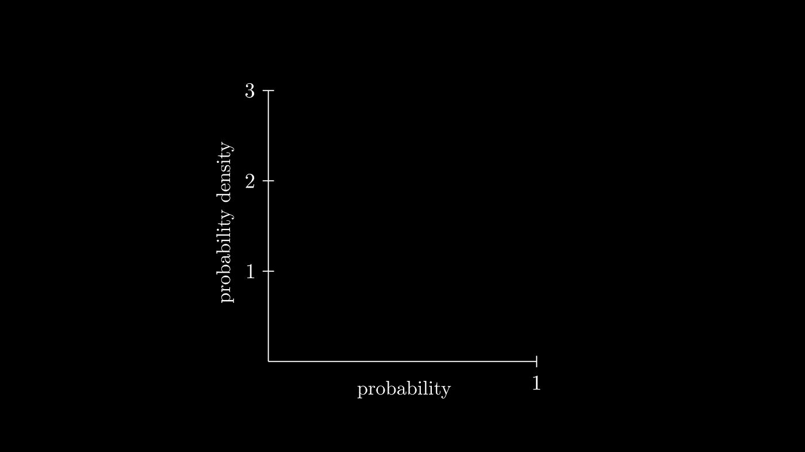
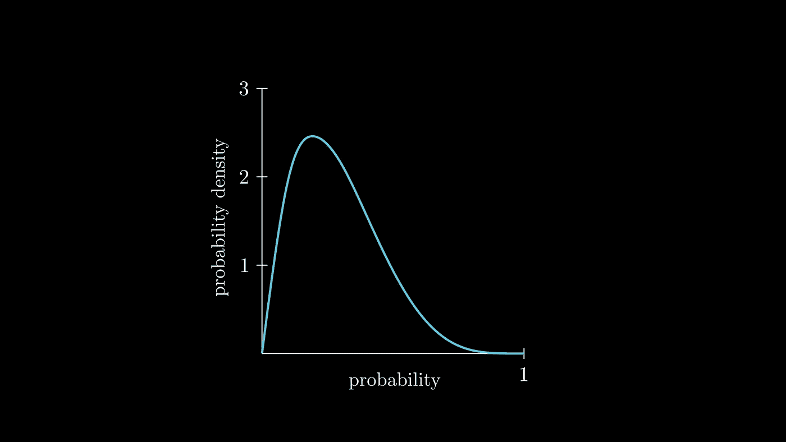
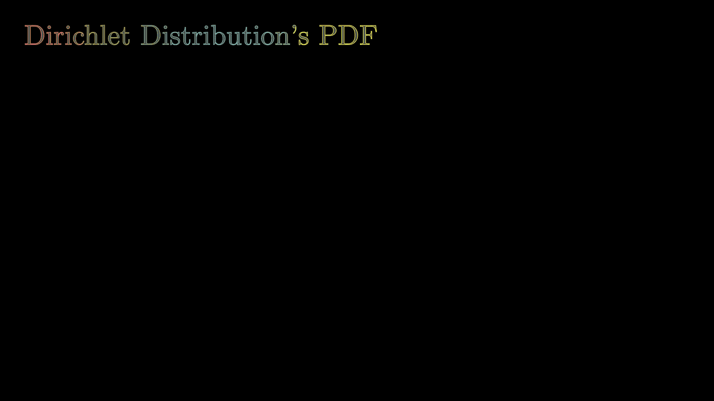
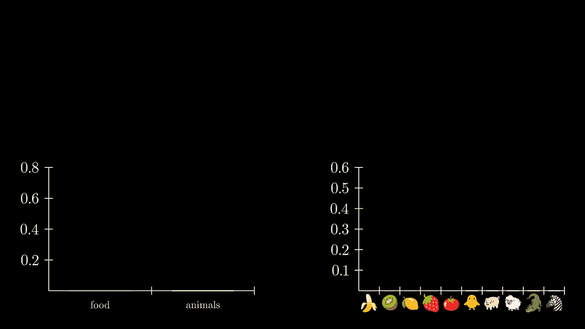
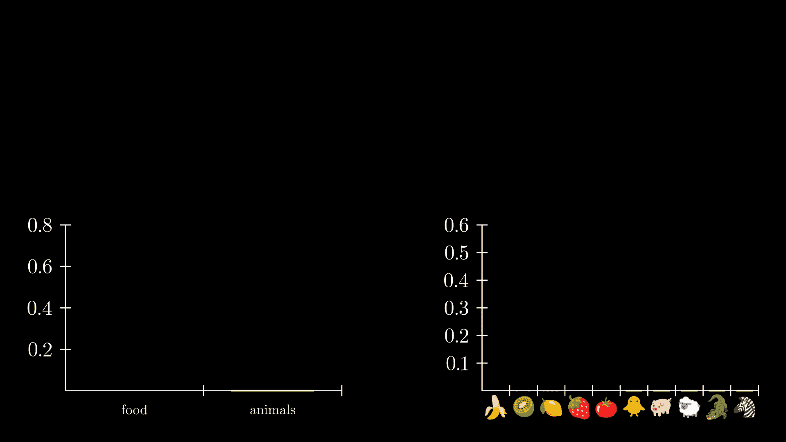
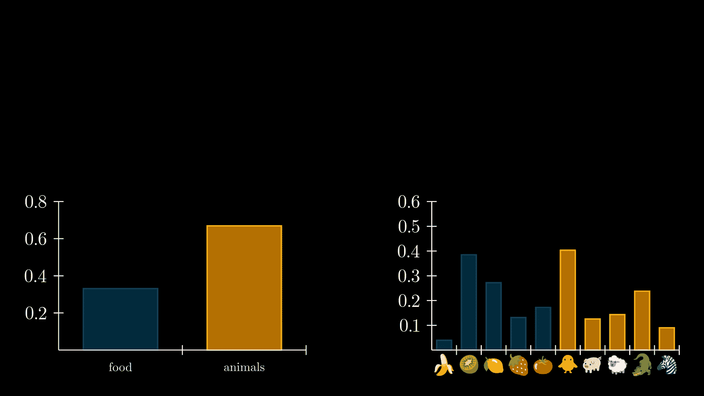
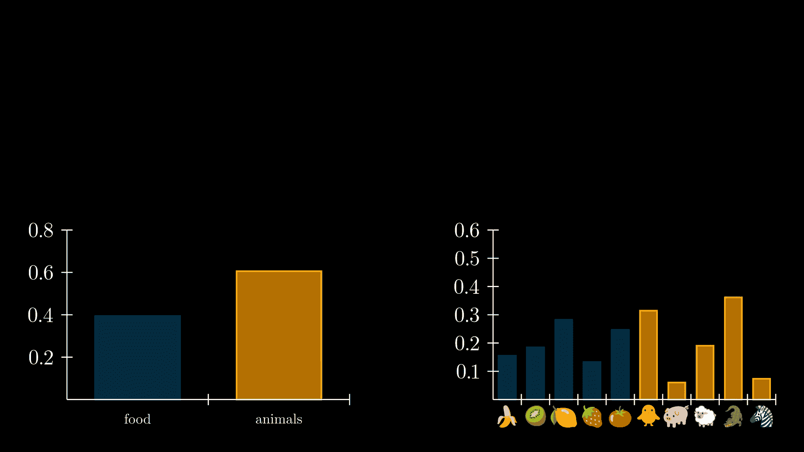
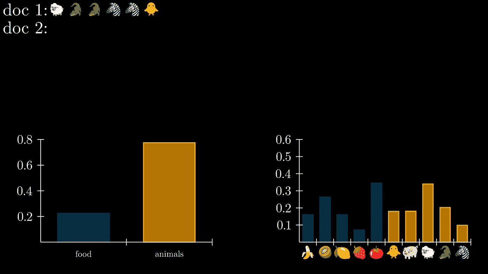
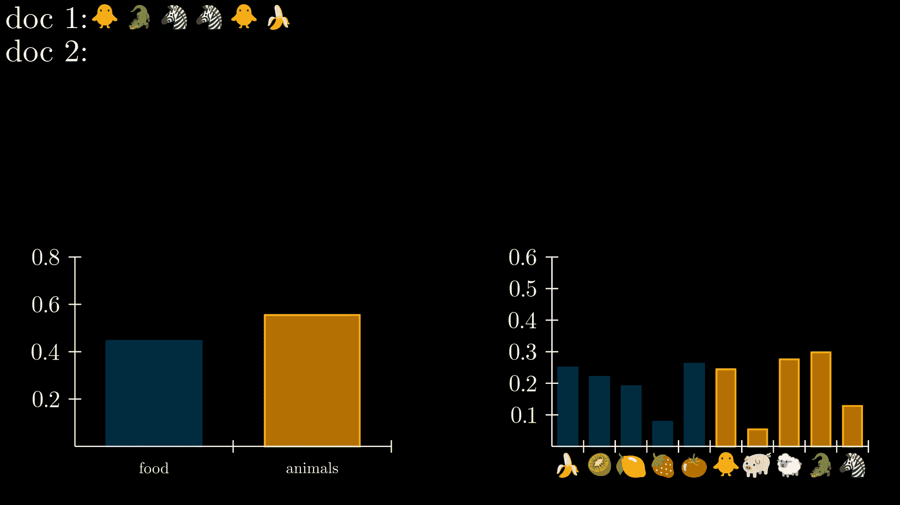

# 但什么是 LDA？使用类似于 3Blue1Brown 的数学动画来解释。

> 原文：[`towardsdatascience.com/but-what-is-lda-explained-using-mathematical-animation-like-3blue1brown-4e8825334d84`](https://towardsdatascience.com/but-what-is-lda-explained-using-mathematical-animation-like-3blue1brown-4e8825334d84)

[](https://huonglanchu.medium.com/?source=post_page-----4e8825334d84--------------------------------)[](https://towardsdatascience.com/?source=post_page-----4e8825334d84--------------------------------) [Lan Chu](https://huonglanchu.medium.com/?source=post_page-----4e8825334d84--------------------------------)

·发布于[Towards Data Science](https://towardsdatascience.com/?source=post_page-----4e8825334d84--------------------------------) ·13 分钟阅读·2023 年 6 月 5 日

--

让你的同事们印象深刻 ;)

你是否曾经为解释数学概念而苦恼过？[3Blue1Brown](https://www.youtube.com/channel/UCYO_jab_esuFRV4b17AJtAw)是我最喜欢的 YouTube 频道，它提供了很酷的数学和统计主题的视频和动画。直到我观看了这个频道上的可视化解释，我才真正理解了二项分布🤷‍♀️

如果你能够了解这些动画是如何制作的，以便你能创建类似的动画来解释数据科学概念，并让你的队友和经理们印象深刻，那岂不是很棒吗？🤩😍


LDA 生成过程。作者制作的 Gif。

好吧，你真幸运，因为你可以使用[**Manim**](https://docs.manim.community/en/stable/)来实现这一点！😍它是一个免费的开源项目，允许我们使用 Python 创建数学动画，最初由[**Grant** **Sanderson**](https://twitter.com/3blue1brown)编写，现在由 Manim 社区维护。

在这篇文章中，我们将学习如何在 Manim 中创建一些基本元素，并应用我们所学的内容来动画展示如何生成文档，使用的是 Latent Dirichlet Allocation (LDA)。如果你希望理解 LDA 的工作原理，我有[一篇文章](https://medium.com/towards-data-science/what-do-countries-talk-about-at-the-un-general-debate-topic-modelings-using-lda-19873cf00fe0)可以帮助你。在这篇文章中，我们将假定你已经理解了 LDA 的工作原理。好了，让我们开始吧。

# 什么是 Manim


Manim 是一个 Python 库，它允许用户创建精确的数学动画，类似于[3Blue1Brown](https://www.youtube.com/channel/UCYO_jab_esuFRV4b17AJtAw)的视频。Manim 由以下主要组件构建，并且需要较新的 Python 版本（3.7–3.10）才能运行：

1.  Python

1.  [pycairo](https://cairographics.org/pycairo/) 用于制作图形

1.  [FFmpeg](https://ffmpeg.org/download.html#build-windows) 用于将帧转换为视频

1.  [LaTeX](https://miktex.org/download) 用于编写文本和公式

## Manim 构建模块


[Manim 示例](https://docs.manim.community/en/stable/examples.html)

本质上，manim 将三个概念结合起来以生成数学动画： [**Mobject**](https://docs.manim.community/en/stable/reference/manim.mobject.mobject.Mobject.html#manim.mobject.mobject.Mobject)， [**Animation**](https://docs.manim.community/en/stable/reference/manim.animation.animation.Animation.html#manim.animation.animation.Animation)， 和 [**Scene**](https://docs.manim.community/en/stable/reference/manim.scene.scene.Scene.html#manim.scene.scene.Scene)。

**Mobject** 是 Mathematical Object 的缩写。它们是所有 manim 动画的基本构建块。每个从 Mobjects 派生的类代表一个可以在屏幕上动画化和显示的对象，例如形状、方程或图表。

manim 的核心是 **Animation**，这是在两个 Mobjects 之间进行插值的过程。它定义了可以应用于 Mobjects 的变换和运动，例如 [旋转](https://docs.manim.community/en/stable/reference/manim.animation.rotation.Rotate.html#manim.animation.rotation.Rotate) 或 [淡出](https://docs.manim.community/en/stable/reference/manim.animation.fading.FadeOut.html#manim.animation.fading.FadeOut)。

**Scene** 类是你动画的画布。每个 Mobject 都必须被 `[添加](https://docs.manim.community/en/stable/reference/manim.scene.scene.Scene.html#manim.scene.scene.Scene.add)` 到一个场景中才能显示，每个动画也必须通过场景 `[播放](https://docs.manim.community/en/stable/reference/manim.scene.scene.Scene.html#manim.scene.scene.Scene.play)`。

## 设置环境

你可以通过运行以下命令创建一个新的环境并使用 conda 安装 Manim：

```py
conda create -n my-manim-environment
conda activate my-manim-environment
conda install -c conda-forge manim​
```

最好通过 conda 安装 manim，因为 conda 会处理所有的依赖项，如 ffmpeg、pycairo 等，你不需要担心安装额外的依赖项。LaTeX 是一个可选的依赖项，不会通过 conda 安装。为了使用 Manim 的 LaTeX 接口，例如渲染公式，你可以通过运行以下命令来为 macOS 安装 LaTeX：

```py
brew install --cask mactex-no-gui​
```

在 Ubuntu 上，你可以运行

```py
sudo apt install texlive
```

现在，你应该已经成功安装了 Manim。很好，我们开始吧。

# **使用 Manim 创建基本元素**

在这一部分，我们将学习如何使用 Manim 创建基本的 Mobjects，比如箭头、曲线和条形图。这将为我们在下一节中创建 LDA 生成过程的动画做好准备。

## 创建基本元素 - 一个箭头

首先，让我们导入 manim 库的所有内容：

```py
from manim import *
```

在 Manim 中，脚本动画的代码通常写在`construct()`方法内，该方法属于`Scene`类。在这个方法内，你可以创建对象，将它们显示在屏幕上，并对其进行动画处理。例如，你可以使用`Arrow`类创建两个箭头，并使用`shift()`方法将它们排列在一起，`shift()`方法用于调整`Mobject`的位置。最后，我们将使用`Create`类来初始化对象的动画，并通过调用`play()`方法将动画添加到场景中：

```py
from manim import *
from manim.mobject.geometry.tips import ArrowSquareTip
class ArrowExample(Scene):
    def construct(self):
        arrow_1 = Arrow(
            start=RIGHT, end=LEFT, color=BLUE
        )  # Specifies the starting point of the arrow as the right side.
        arrow_2 = Arrow(
            start=RIGHT, end=LEFT, color=BLUE, tip_shape=ArrowSquareTip
        ).shift(
            DOWN
        )  # Shifts the position of the arrow downward
        self.play(Create(arrow_1))
        self.play(Create(arrow_2))
```

将上面的脚本保存到`Arrows.py`文件中。现在，在你存储这个文件的项目文件夹中，运行以下命令以生成脚本的视频（“ -p”选项允许你在动画渲染后显示视频）

```py
manim -p manim.py Arrows.py
```


## 创建基本元素 - 条形图

我们还可以使用 Manim 中的`BarChart`类来创建条形图。在下面的示例中，我使用以下配置创建了一个条形图：

```py
from manim import *

class BarChartExample(Scene):
    def construct(self):
        # Create the initial bar chart
        barchart1 = BarChart(
            values=[0.1, 0.2, 0.3],
            y_range=[0, 0.6, 0.2],
            bar_names=["food", "animals", "sport"],
            y_length=6,
            x_length=10,
            x_axis_config={"font_size": 36}
        )
        self.play(Create(barchart1))
```


但仅仅创建条形图并不有趣。让我们看看能否将初始条形图转变为最终的条形图。为此，我们将使用强大的`[animate](https://docs.manim.community/en/stable/reference/manim.mobject.mobject.Mobject.html#manim.mobject.mobject.Mobject.animate)`方法。

**.animate**

`animate()`是所有 Mobjects 的一个属性，允许你展示对象随时间变化的情况，如在动画过程中改变对象的位置、颜色、大小或形状。在下面的示例中，我们将为场景中已经存在的第一个条形图创建动画，并使用`animate.become()`将其转换为第二个条形图：

```py
from manim import *

class BarChartExample(Scene):
    def construct(self):
        # Create the initial bar chart
        barchart1 = BarChart(
            values=[0.1, 0.2, 0.3],
            y_range=[0, 0.6, 0.2],
            bar_names=["food", "animals", "sport"],
            y_length=6,
            x_length=10,
            x_axis_config={"font_size": 36}
        )

        # Create the second bar chart
        barchart2 = BarChart(
            values=[0.4, 0.3, 0.3],
            bar_names=["food", "animals", "sport"],
            y_length=6,
            x_length=10,
            x_axis_config={"font_size": 36}
        )

        self.play(Create(barchart1)) # draw the first bar chart

        # Animate the first bar chart to become the second one
        self.play(barchart1.animate.become(barchart2), run_time=1.5)
        self.wait(2)
```


## 创建基本元素 - 曲线

在 Manim 中，`Axes`是一个用于创建坐标系统可视化表示的类，可以在其中添加图形、点、线等数学对象。在这个例子中，我们将使用`Axes`类来绘制正弦函数。首先，使用一些特定配置创建`Axes`对象。接下来，我们将使用`axes.get_axis_labels()`方法为正弦曲线获取名称。标签通过`add()`方法添加到`axes`中，最后，`VGroup`类用于将`axes`和`sin_curve`分组并一起移动。生成的动画将显示正弦函数，如下所示：

```py
from manim import *
class SinFunctionPlot(Scene):
    def construct(self):
        axes = Axes(
            x_range=[-10, 10, 1],  # x-axis range and step size
            y_range=[-1.5, 1.5, 1],  # y-axis range and step size
            x_length=10,
            axis_config={"color": BLUE},
            x_axis_config={
                "numbers_to_include": np.arange(-10, 10, 2),
                "numbers_with_elongated_ticks": np.arange(-10, 10, 2),
            },
        )
        axes_labels = axes.get_axis_labels(Tex("sin(x)"))
        # add labels to the axes object
        axes.add(axes_labels)
        # create the sin function
        sin_curve = axes.plot(lambda x: np.sin(x), color=RED)
        plot = VGroup(axes, sin_curve)
        # Incrementally show the plot
        self.play(Create(plot))
        self.wait(2)
```


## ​

# 使用 Manim 创建 LDA 动画

很棒，到现在你已经学会了如何在 Manim 中创建一些元素，如箭头、曲线和条形图。那我们将所学应用到 LDA 模型生成文档的动画中如何呢？

基本上，LDA 生成过程包含两个组件：主题分布和词汇分布。因此，我们将通过动画展示文档是如何通过 LDA 生成的，具体表现为词汇和主题是如何被选择的。

LDA 使用*Dirichlet 和多项式分布*。然而，为了能够在二维中可视化数据，我们将考虑一个更简单的示例，其中我们的文档只包含两个主题：**食物 🍕 和动物 🐖**。这使我们可以使用 Beta 分布而不是 Dirichlet 分布来可视化主题分布。

## 创建主题分布

**Beta 分布的概率密度曲线 (PDF)**

我们将从创建 Beta 分布的概率密度曲线开始。如何绘制这条曲线？没错！我们将首先设置一个`Axes`对象，以便在其上绘制 PDF。我将使用以下一些预定义的配置：

```py
ax = Axes(
    x_range=[0, 1],
    y_range=[0, 3],
    tips=False,
    x_length=config["frame_width"] / 3,
    y_length=config["frame_height"] * 0.6,
).add_coordinates()
```

在设置好 Axes 对象后，通过调用`get_x_axis_label()`和`ax.get_y_axis_label()`方法为 x 轴和 y 轴添加标签会很不错。为了书写标签，我们将使用`Tex`类提供的 LaTeX 语法。经过一些美化处理，标签就准备好了：

```py
 x_label = ax.get_x_axis_label(
      Tex("probability").scale(0.7), edge=DOWN, direction=ORIGIN
  )

  y_label = ax.get_y_axis_label(
      Tex("probability density").scale(0.7).rotate(90 * DEGREES),
      edge=LEFT,
      direction=LEFT,
      buff=0.2,
)
ax.add(x_label, y_label)​
```



很好，我们现在将通过使用类中的参数𝛼和𝛽创建一个 beta 分布对象来创建 PDF 曲线，并将该曲线添加到 Axes 对象中：

```py
alpha = 2
beta = 5
num_samples = 1

def pdf(x):
    return dist.pdf(x)

dist = scipy.stats.beta(self.alpha, self.beta)
pdf_curve = ax.plot(pdf, x_range=[0, 1], color=BLUE_C)
# add the PDF curve to the ax object.
ax.add(pdf_curve)​
```



很棒！每个好的图表都有一个标题，让我们使用`Tex`类为 PDF 曲线添加一个标题：

```py
title_pdf = (
    Tex("Dirichlet Distribution's PDF")
    .set_color_by_gradient(*bar_kwargs["bar_colors"])
    .set_fill(color=WHITE, opacity=0.3)
    .set_stroke(width=1.2)
    .set(width=7)
    .to_corner(UL)
)
```

为了显示 PDF 曲线使用了 alpha 和 beta 参数，我想通过创建两个`Tex`对象并使用`.next_to()`方法将其显示在轴旁边来将其包含在动画中。以下代码块将完成这项工作：

```py
a_tex = Tex(r"$\alpha = 2$", color=BLUE).scale(0.7)
b_tex = Tex(r"$\beta = 5$", color=BLUE).scale(0.7)
ax.add(a_tex, b_tex)
a_tex.next_to(ax, direction=UP + LEFT, aligned_edge=RIGHT)
b_tex.next_to(a_tex, DOWN)
```

最后，我们将使用`Write`和`Create`类来在屏幕上写入 alpha、beta 值，并绘制轴和 PDF 曲线：

```py
self.play(Write(a_tex), Write(b_tex))
self.play(Create(ax))
self.play(Create(pdf_curve), run_time=2)
```


好的。接下来要做的是动画演示 LDA 过程中如何创建主题分布。我们的文档包含 2 个主题：**食物 🍕 和动物 🐖**。我们将创建一个函数来返回一个`BarChart`对象，显示每个主题在文档中出现的概率。Beta 分布以 alpha 和 beta 作为参数，额外的样式和自定义选项可以通过`kwargs`传递：

```py
alpha = 2
beta = 5

def get_barchart(self, alpha, beta, width, height, zeros=True, **kwargs):
    num_samples = 1
    if zeros is True:
        data = [0, 0]
    else:
        dist = scipy.stats.beta(alpha, beta)
        prob_0 = dist.rvs(num_samples)[0]
        prob_1 = 1 - prob_0
        data = [prob_0, prob_1]

    bar_chart = BarChart(values=data, x_length=width, y_length=height, **kwargs)
    return bar_chart

bar_kwargs = {
     "x_length": config["frame_width"] / 2.5,
     "y_length": config["frame_height"] - 3.25,
     "bar_colors": [RED, GREEN, BLUE, YELLOW],
     "y_range" : [0, 0.7, 0.15],
}
```

接下来，我们将通过初始化 BarChart 创建一个 manim 条形图对象`bar`，并将条形图添加到屏幕的右下角。接下来，我们希望通过创建显示标签的 Tex 对象来标记每个条形，并使用`.next_to()`方法将标签放置在相应条形的下方。最后，我们使用`Create`类绘制并显示条形图的创建过程：

```py
bar = BarChart([0.7, 0.3], **bar_kwargs)​
bar.to_edge(DOWN + RIGHT)​
tex_animals = Tex("animals")
tex_animals.next_to(bar.bars[0], DOWN, buff=0.1)
tex_food = Tex("food")
tex_food.next_to(bar.bars[1], DOWN, buff=0.1)​
self.play(Create(bar))
self.play(Write(tex_food), Write(tex_animals))​
```


为了模拟从 Beta 分布中进行多次重采样，我们将创建循环，在每次迭代中生成一个新样本，计算相应的概率，并使用`change_bar_values`方法相应地更新条形图的值：

```py
# resample 10 times
for i in range(10):
    topic_distribution = scipy.stats.beta(self.alpha, self.beta)
    probability = new_dist.rvs(self.num_samples)[0]
    new_data = [probability, 1 - probability]

    if i == 0:
        dot = Dot(ax.coords_to_point(probability, 0))
        self.play(Create(dot), bar.animate.change_bar_values(new_data))

    else:
        self.play(
            dot.animate.move_to(ax.coords_to_point(probability, 0)),
            bar.animate.change_bar_values(new_data),
        )

    self.wait(1)
```

将所有内容结合起来，我们就有了以下动画：



如果你看到一个 PDF 曲线和柱状图被绘制的动画，恭喜你！你刚刚从头开始编写了你的第一个 Manim 场景，用来显示 LDA 主题分布。

## 创建词汇分布

太好了，我们有了主题分布。然而，一个主题还应该包含属于它的词汇。假设我们的词汇表包括以下十个词：

{🍌,🥝,🍋,🍓,🍅,🐥,🐖,🐑,🐊,🦓}

并且每个文档将仅包含 5 个词。为了可视化 LDA 的生成过程，我们将分别显示每个主题的主题分布和词汇分布，两个单独的柱状图。主题分布将与我们之前做的相同：

```py
topic_distribution = BarChart(
    values=[0,0],
    bar_names=['animals', 'food'],
    y_axis_config={"font_size": 36},
    y_length=3,
    x_length=5,
    y_range=[0, 0.6, 0.1],
)​
```

不幸的是，对于词汇分布，我们不能将表情符号列表传递给 `bar_names`，这必须一个个手动添加到正确的位置。我们将为此创建一个辅助函数：

```py
words = [
    'banana', 
    'kiwi', 
    'lemon', 
    'strawberry', 
    'tomato', 
    'chicken', 
    'pig', 
    'sheep',
    'crocodile',
    'zebra'
]
def add_svg_xticks(bar_chart):
    """Adds svg symbols instead of standard x-ticks to a BarChart."""
    for i, word in enumerate(words):
        symbol = SVGMobject(f"icons/{word}.svg", width=0.4)
        symbol.next_to(bar_chart.bars[i], DOWN, buff=0.3, aligned_edge=DOWN)
        bar_chart.add(symbol)​
```

在这里，我们使用 `symbol = SVGMobject(f”icons/{word}.svg”)` 从磁盘加载一个 SVG 符号，并使用 `.next_to()` 方法将其移动到对应的柱子正下方。`BarChart` 包含 10 根柱子（因为我们的词汇表中有 10 个词汇），并且第“i”根柱子可以通过 `bar_chart.bars[i]` 来引用。



为了说明主题和词汇的随机选择，我们在场景中添加两个箭头：

```py
arrow_topic = Line(ORIGIN, DOWN * 0.8).add_tip().set_color(BLUE)
arrow_word = Line(ORIGIN, DOWN * 0.8).add_tip().set_color(BLUE)​
```

这将绘制一条小的垂直线，`.add_tip()` 将箭头头部添加到线条上。这些箭头将出现、消失并移动，以说明在随机选择过程中选择了哪个主题和哪个词汇。

我们通过从 Dirichlet 分布中采样来开始动画，以获取每个主题的词汇分布：

```py
topic_p = scipy.stats.dirichlet(self.alphas_topics).rvs(1)[0]
word_p1 = scipy.stats.dirichlet(self.alphas_words_topic1).rvs(1)[0]
word_p2 = scipy.stats.dirichlet(self.alphas_words_topic2).rvs(1)[0]
word_p = np.concatenate((word_p1, word_p2))
```

​并通过让每根柱子从零变换到其初始值来初始化动画：

```py
self.play(
    topic_distribution.animate.change_bar_values(topic_p),
    word_distribution.animate.change_bar_values(word_p),
)
```



​

接下来，我们从主题分布中随机采样一个主题（这是通过多项分布完成的），并使用箭头可视化选择。这可以通过在选择的第一个主题/词汇时将其淡入场景来实现：

```py
# move
arrow_topic.next_to(topic_distribution[0][topic], UP, buff=0.1)
arrow_word.next_to(word_distribution[0][word], UP, buff=0.1)
# animate
self.play(FadeIn(arrow_topic))
self.play(FadeIn(arrow_word))
```


或者通过播放一个运动动画，当选择了新的主题/词汇时：

```py
# animate move
self.play(arrow_topic.animate.next_to(topic_distribution[0][topic], UP, buff=0.1))
self.play(arrow_word.animate.next_to(word_distribution[0][word], UP, buff=0.1))
```



现在选择了主题和词汇，我们可以最终开始编写我们的文档。我们复制所选的词汇，并将该词汇动画化地移动到我们正在生成的文档中：

```py
word_symbol = create_word_token(word)
word_symbol.next_to(
word_distribution[0][word], DOWN, buff=0.3, aligned_edge=DOWN
)
topic_symbol = create_topic_symbol(row, topic)
self.play(FadeIn(topic_symbol))
self.play(word_symbol.animate.move_to(topic_symbol.get_center()))
self.play(FadeOut(topic_symbol))
```



我们重复选择主题和词汇的过程，直到达到我们希望的文档大小，在我们的例子中是 5 个词。要过渡到下一个文档，我们使箭头渐隐：

```py
self.play(FadeOut(arrow_topic, arrow_word))
```

并创建一个新行以编写新文档：

```py
new_row = VGroup(Tex(f"doc {doc_index}: "))
new_row.next_to(row, DOWN, buff=0.1, aligned_edge=LEFT)
self.add(new_row)
row = new_row
```



并重新采样词汇/主题分布：

```py
topic_prob = dirichlet(self.alphas_topics).rvs(1)[0]
word_prob = np.concatenate(
    [
        dirichlet(self.alphas_words_topic1).rvs(1)[0],
        dirichlet(self.alphas_words_topic2).rvs(1)[0],
    ],
)
self.play(
    topic_distribution.animate.change_bar_values(topic_prob),
    word_distribution.animate.change_bar_values(word_prob),
)
```



并对任意多个文档重复整个过程。在下面的示例中，我们创建了 3 个文档，每个文档包含 5 个词。


# 总结

恭喜！你刚刚在 Manim 中创建了一个 LDA 生成过程。在这篇文章中，我们学习了：

1.  Manim 的三个主要构建模块：

+   Mobjects：可以在屏幕上显示的数学对象，例如 `Circle`、`Square`、`Axes` 等。

+   定义可以应用于 Mobjects 的转换和移动的动画。

+   场景：场景是你动画的画布，显示 Mobjects。

2\. 创建基本的 Manim 对象，例如箭头、条形图和曲线

3\. 动画化生成文档的过程，使用 LDA。

Manim 提供了许多超出本文范围的功能。最好的学习方式是通过实践，因此我鼓励你进一步探索并尝试自己的示例。我也很期待看到你的动画！

# 参考资料

1.  Manim 文档：[Manim Community v0.17.3](https://docs.manim.community/en/stable/index.html)

1.  如何使用 Python 创建类似 3Blue1Brown 的数学动画 | 作者 Khuyen Tran | Towards Data Science

# 代码

产生所有动画的完整代码可以在 [这里](https://github.com/lanchuhuong/manim_lda/tree/main) 找到。
