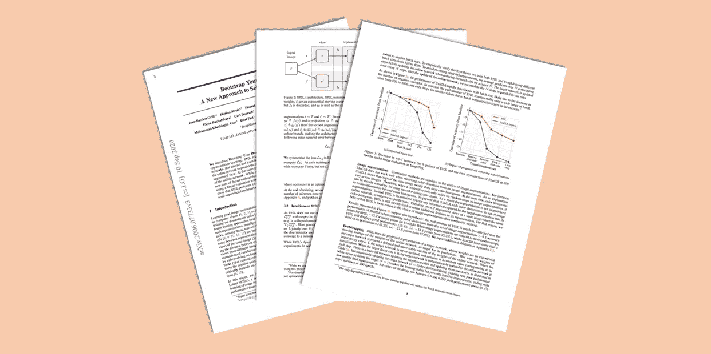

# BYOL — 对比自监督学习的替代方案

> 原文：[`towardsdatascience.com/byol-the-alternative-to-contrastive-self-supervised-learning-5d0a26983d7c?source=collection_archive---------4-----------------------#2023-09-07`](https://towardsdatascience.com/byol-the-alternative-to-contrastive-self-supervised-learning-5d0a26983d7c?source=collection_archive---------4-----------------------#2023-09-07)

## [🚀Sascha 的论文俱乐部](https://towardsdatascience.com/tagged/saschas-paper-club)

## Bootstrap Your Own Latent: J. Grill 等人的自监督学习新方法

 [Sascha Kirch](https://medium.com/@SaschaKirch?source=post_page-----5d0a26983d7c--------------------------------)

·

[关注](https://medium.com/m/signin?actionUrl=https%3A%2F%2Fmedium.com%2F_%2Fsubscribe%2Fuser%2F5c38dace9d5e&operation=register&redirect=https%3A%2F%2Ftowardsdatascience.com%2Fbyol-the-alternative-to-contrastive-self-supervised-learning-5d0a26983d7c&user=Sascha+Kirch&userId=5c38dace9d5e&source=post_page-5c38dace9d5e----5d0a26983d7c---------------------post_header-----------) 发表在 [Towards Data Science](https://towardsdatascience.com/?source=post_page-----5d0a26983d7c--------------------------------) · 10 分钟阅读 · 2023 年 9 月 7 日

--

在今天的论文分析中，我们将深入研究 BYOL（**B**ootstrap **Y**our **O**wn **L**atent）背后的论文。它提供了一种对比自监督学习技术的替代方案，通过去除对大量负样本和庞大批量的需求，为表示学习提供支持。此外，它也是理解当今最先进的基础模型（如 [DINO](https://arxiv.org/abs/2104.14294) 系列，包括 [DINOv2](https://arxiv.org/abs/2304.07193)）的一个里程碑式的论文。

对比自监督学习框架仍然感觉有些直观，但 BYOL 起初可能令人困惑和害怕。因此，这是一篇非常好的论文，可以一起分析。所以让我们深入研究，并剥离其核心思想！

图片来源于[Sascha Kirch](https://medium.com/@SaschaKirch)的[出版物](https://arxiv.org/abs/2006.07733)

> **Paper:** [Bootstrap your own latent: A new approach to self-supervised Learning](https://arxiv.org/abs/2006.07733) by Jean-Bastien Grill et. al., 13 Jun. 2020
> 
> **Resources:** [GitHub](https://github.com/deepmind/deepmind-research/tree/master/byol)
> 
> **Category:** similarity learning, representation learning, computer vision, foundation models
> 
> [**Other Walkthroughs**](https://medium.com/@SaschaKirch/list/paper-walkthroughs-by-sascha-kirch-89c7847da8e2)**:**
> 
> [CLIP] — [GLIP] — [Segment Anything] — [[Depth Anything](https://medium.com/towards-data-science/depth-anything-a-foundation-model-for-monocular-depth-estimation-8a7920b5c9cc?sk=fc6197edd68e6137c3396c83e50f65cb)] — [DINO] — [DDPM]
