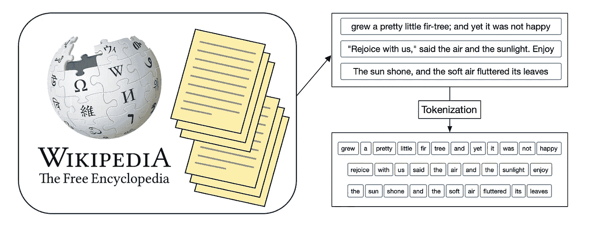
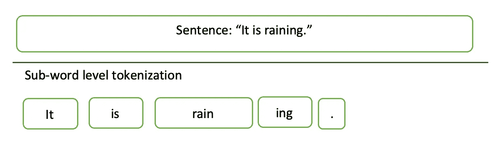

# 初学者的字节对编码

> 原文：[`towardsdatascience.com/byte-pair-encoding-for-beginners-708d4472c0c7?source=collection_archive---------2-----------------------#2023-10-10`](https://towardsdatascience.com/byte-pair-encoding-for-beginners-708d4472c0c7?source=collection_archive---------2-----------------------#2023-10-10)

## 一个简单明了的 BPE 分词器指南

 [Mina Ghashami](https://medium.com/@mina.ghashami?source=post_page-----708d4472c0c7--------------------------------)

·

[关注](https://medium.com/m/signin?actionUrl=https%3A%2F%2Fmedium.com%2F_%2Fsubscribe%2Fuser%2Fc99ed9ed7b9a&operation=register&redirect=https%3A%2F%2Ftowardsdatascience.com%2Fbyte-pair-encoding-for-beginners-708d4472c0c7&user=Mina+Ghashami&userId=c99ed9ed7b9a&source=post_page-c99ed9ed7b9a----708d4472c0c7---------------------post_header-----------) 发布于 [Towards Data Science](https://towardsdatascience.com/?source=post_page-----708d4472c0c7--------------------------------) ·6 min read·2023 年 10 月 10 日

--

作者提供的图片

在这篇文章中，我们探讨了一种广为人知的分词算法，称为字节对编码（BPE）。它被用于许多最先进的大型语言模型中，如 BERT 系列、BART 和 GPT 系列。

让我们开始吧。

# 字节对编码（BPE）

字节对编码（BPE）是一种**基于语料库的子词分词**算法**。** 它是**基于语料库的**，因为它使用训练语料库来学习频繁出现的字符（或符号）并将它们合并为一个符号。它也是一种**子词分词器**，因为它将文本拆分成比单词更小（或等于单词）的单元。

下图展示了句子“ it is raining”的子词分词情况。注意，“it”和“is”是完整的词汇标记；而“rain”和“ing”是从“raining”中分出的子词。

BPE 算法主要有两个部分：标记学习器和标记分割器。

1- **标记学习器**：它接收一个文本语料库并创建一个包含标记的词汇表。这个语料库充当训练语料库。
