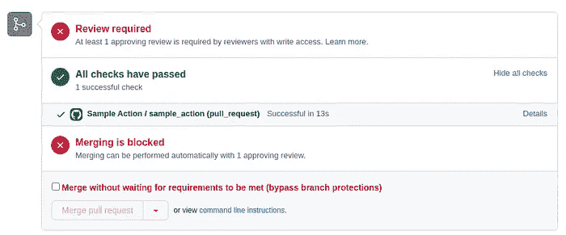
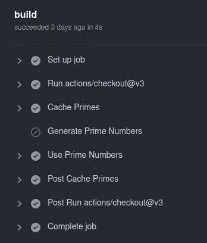
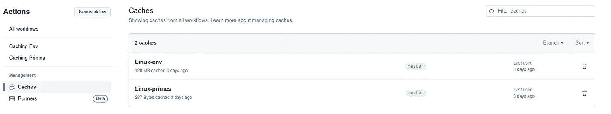

# GitHub Actions 中的缓存

> 原文：[`towardsdatascience.com/caching-in-github-actions-7ff11b6c1874`](https://towardsdatascience.com/caching-in-github-actions-7ff11b6c1874)

## 加速您的 CI/CD 管道

[](https://medium.com/@hrmnmichaels?source=post_page-----7ff11b6c1874--------------------------------)[](https://towardsdatascience.com/?source=post_page-----7ff11b6c1874--------------------------------) [Oliver S](https://medium.com/@hrmnmichaels?source=post_page-----7ff11b6c1874--------------------------------)

·发表于[Towards Data Science](https://towardsdatascience.com/?source=post_page-----7ff11b6c1874--------------------------------) ·7 分钟阅读·2023 年 11 月 21 日

--

在这篇文章中，我们将探讨如何缓存[GitHub Actions](https://docs.github.com/en/actions)。GitHub Actions 是 GitHub 提供的一个平台，允许自动化工作流，通常用于 CI/CD（持续集成/交付）管道——例如，当想要合并新的 PR 时自动运行单元测试。由于这些管道运行频繁，且执行时间可能显著增长，因此考虑节省时间是很有意义的——缓存动作输出就是一种方法。


照片由[Possessed Photography](https://unsplash.com/@possessedphotography?utm_content=creditCopyText&utm_medium=referral&utm_source=unsplash)拍摄，发表于[Unsplash](https://unsplash.com/photos/sodimm-ram-stick-nuc3NFB_6po?utm_content=creditCopyText&utm_medium=referral&utm_source=unsplash)

在这篇文章中，我们将讨论缓存。我觉得官方文档简洁且未解答一些问题——因此我在这里想多做一些解释。我们首先简要介绍 GitHub Actions 及其缓存的工作原理，然后通过两个示例进行演示：第一个示例遵循创建素数的原始玩具示例，而第二个示例更现实——我们缓存一个完整的 Python 环境。

# GitHub Actions 简介

在[上一篇文章](https://medium.com/gitconnected/introduction-to-github-actions-e742b5370bfa)中，我详细介绍了这一主题——因此这里我们仅简要概述此内容，并且我建议参阅链接中的文章获取详细信息。总的来说，GitHub Actions 允许自动化工作流，通常用于 CI/CD 管道，例如运行单元测试、检查风格指南等。在接收到某些触发事件后，运行器（可以由 GitHub 托管或自定义）会接收由不同步骤组成的任务。让我们用上一篇文章中的一个示例进行演示：

```py
name: Sample Workflow

on:
  pull_request:
    branches: [main]
  push:
    branches: [main]
jobs:
  sample_job:
    runs-on: ubuntu-20.04
    steps:
      - name: Checkout repo
        uses: actions/checkout@v3
      - name: Set up Python 3.10.0
        uses: actions/setup-python@v3
        with:
          python-version: "3.10.0"
      - name: Echo 1
        run: echo "Echo 1"
      - name: Echo 2
        run: |
          echo "Echo 2a"
          echo "Echo 2b"
```

在这里，我们定义了一个名为“Sample Workflow”的工作流，并将代码推送和打开新 PR 设置为事件触发器。工作流包括一个在“ubuntu-20.04”上运行的单个作业——这是一个运行所述 Ubuntu 版本的免费 Git 实例。该作业有不同的步骤，包括检出代码库、设置 Python 和输出不同的消息。

为了运行此工作流，我们需要将其放置到`.github/workflows`文件夹中。一旦放置并推送到 Github，这个工作流将会在定义的事件触发器上自动运行——我们可以方便地查看定义工作流的状态和输出，例如，如下所示：



作者提供的图片

## 缓存操作

在奠定基础之后，让我们继续讨论缓存。通过[缓存操作](https://github.com/actions/cache)，我们可以定义一个缓存步骤。借用我们即将到来的玩具示例，这可以如下所示：

```py
- name: Cache Primes
id: cache-primes
uses: actions/cache@v3
with:
    path: prime-numbers
    key: ${{runner.os}}-primes
```

缓存由一个键和一个路径唯一标识：如果这两者都存在/填写，缓存将被加载——否则生成。当工作流第一次运行（或某些依赖项发生更改）并生成缓存时，指定在`path`下的文件夹内容将上传到某个 Github 存储区。这样，缓存就与之前运行的运行器无关，并且始终可用（特别是，你不需要自己的运行器来持久化缓存——可以使用公开的 Github 运行器）。

现在，在接下来的步骤中，我们可以检查缓存是否可用（缓存命中），并跳过它（通常是生成缓存内容的步骤）：

```py
- name: Generate Prime Numbers
  if: steps.cache-primes.outputs.cache-hit != 'true'
  run: ./generate_primes.sh
```

# 缓存生成素数

话虽如此，让我们给出第一个完整的示例：通过 Github Actions，我们生成前`N`个素数，并缓存此输出。请注意，这一做法受到原始文档的启发，尽管在我看来更为完整。

这个示例由两个 bash 脚本组成。通过第一个脚本`generate_primes.sh`，我们生成前`N`个素数并将它们写入`prime-numbers/generate_primes.sh`：

```py
#!/bin/bash

N=10  # Number of prime numbers to generate
file_path="prime-numbers/primes.txt" # Path where to store the primes

# Remove existing file if it exists
rm -f "$file_path"

# Function to check if a number is prime
is_prime() {
    num=$1
    for ((i=2; i*i<=num; i++)); do
        if ((num % i == 0)); then
            return 1
        fi
    done
    return 0
}

# Create directory for prime numbers if it doesn't exist
mkdir -p "$(dirname "$file_path")"

echo "Generating prime numbers ..."

count=0
number=2
while [ $count -lt $N ]; do
    if is_prime $number; then
        echo $number >> prime-numbers/primes.txt
        ((count++))
    fi
    ((number++))
done
```

另一个脚本`primes.sh`读取此文件，并简单地打印存储的素数：

```py
#!/bin/bash

# Read and print prime numbers from the file
if [ -f prime-numbers/primes.txt ]; then
    echo "Prime numbers:"
    cat prime-numbers/primes.txt
else
    echo "File prime-numbers/primes.txt not found."
fi
```

假设我们想找很多素数，并且这需要一段时间，这与缓存这个过程密切相关，这正是我们用`prime_workflow.yml`做的：

```py
name: Caching Primes

on: push

jobs:
  build:
    runs-on: ubuntu-20.04

    steps:
    - uses: actions/checkout@v3

    - name: Cache Primes
      id: cache-primes
      uses: actions/cache@v3
      with:
        path: prime-numbers
        key: ${{ runner.os }}-primes

    - name: Generate Prime Numbers
      if: steps.cache-primes.outputs.cache-hit != 'true'
      run: ./generate_primes.sh

    - name: Use Prime Numbers
      run: ./primes.sh
```

我们检出代码库，在第 2 步调用缓存操作：键由运行器操作系统和后缀“-primes”组成，缓存路径是第一个脚本将结果文件转储到的文件夹。

然后，我们要求工作流生成素数（即运行`generate_primes.sh`）——如果没有缓存命中，例如，当第一次执行此脚本时。

最后，我们在脚本`primes.sh`中使用生成的或缓存的素数。查看此工作流的第二次运行，我们观察到确实跳过了“生成”步骤：



作者提供的图片

你还可以在[Github](https://github.com/hermanmichaels/github_actions_cache)上找到完整的示例。

# 缓存 Poetry 环境

现在，让我们来看一个稍微现实一点的示例：强烈建议任何 Python 项目都捆绑一个环境，以确保所有开发者使用相同的包和版本。在 Github Actions 运行器上，仓库通常是全新检出的，这意味着每次都必须重新安装设置的环境。因此，我们在这里展示如何缓存这个环境——即与其下载和安装包，不如将完整的环境缓存并从缓存中下载。特别是，此示例将展示如何使用[poetry](https://medium.com/towards-data-science/dependency-management-with-poetry-f1d598591161)，这是我管理环境时更倾向使用的工具。

该项目中的示例文件`main.py`如下所示：

```py
import matplotlib.pyplot as plt
import numpy as np

def plot():
    x = np.linspace(0, 10, 50)
    y = np.sin(x)
    plt.plot(x, y)
    plt.savefig("plot.png")

if __name__ == "__main__":
    plot()
```

即，我们使用[matplotlib](https://matplotlib.org/)绘制简单的正弦曲线，因此需要这个和 numpy。

因此，我们的`pyproject.toml`文件包含以下内容（这里，我假设你对 poetry 有基本了解——否则可以参考[链接的帖子](https://medium.com/towards-data-science/dependency-management-with-poetry-f1d598591161)）：

```py
[tool.poetry]
name = "myproject"
version = "0.1.0"
description = "…"
authors = ["hermanmichaels <hrmnmichaels@gmail.com>"]

[tool.poetry.dependencies]
python = "3.10"
matplotlib = "3.5.1"
mypy = "0.910"
numpy = "1.22.3"
black = "22.3.0"
```

正如我们所见，我们安装了所需的包——以及一些[每个 Python 项目都不应错过的有用工具](https://medium.com/towards-data-science/best-practices-for-python-development-bf74c2880f87)。

然后，设置环境（包括缓存）的相应 Github Actions 工作流如下所示：

```py
name: Caching Env

on: push

jobs:
  build:
    runs-on: ubuntu-20.04

    steps:
    - uses: actions/checkout@v3

    - name: Set up Python 3.10.0
      uses: actions/setup-python@v3
      with:
        python-version: "3.10.0"

    - name: Install poetry
      run: curl -sSL https://install.python-poetry.org | python3 -

    - name: Cache Env
      id: cache-env
      uses: actions/cache@v3
      with:
        path: ~/.cache/pypoetry
        key: ${{ runner.os }}-env

    - name: Install poetry dependencies
      if: steps.cache-env.outputs.cache-hit != 'true'
      run: poetry install
```

我们首先安装 Python 和 poetry。在最后一步，我们运行`poetry install`，它将所有所需的包安装到 poetry 环境中。

本帖的关键点是倒数第二步：在此步骤中，我们定义了一个目标路径为`~/.cache/pypoetry`的缓存——这是 poetry 环境默认存储的地方。因此，如果再次运行此工作流，并且此键/文件夹组合存在于缓存中，我们将跳过 poetry 安装——而是从云缓存中下载完整的环境。

此示例也可以在相同的[演示仓库](https://github.com/hermanmichaels/github_actions_cache)中找到。

注意：这其中存在权衡。在没有缓存的版本中，我们下载所有包并安装它们。在使用缓存的版本中，我们不需要安装任何东西，而是需要从缓存中下载所有已安装的包。哪个更快应取决于各种因素，如带宽、包的大小和安装时长。如果你有实际的数据点，或者你更喜欢如何处理，请在评论中告诉我！

# 缓存管理

最后，关于监控和管理缓存的一点说明：当你在 Github 上打开你的仓库，并导航到“Actions / Caches”时，我们会看到如下图像：



作者提供的图像

这个仓库中使用的所有缓存都被展示出来，例如，指明了它们的大小，我们可以在需要时将其移除。

# 结论

这结束了我们对 Github Actions 缓存的介绍。这是一个非常有用的功能，因为 CI/CD 流水线通常让开发者等待不耐烦——通过缓存，我们可以减少这些流程的运行时间，并减少对整个系统的负载。

在对主题进行一般介绍后，我们通过两个具体示例展示了如何应用缓存：我们从缓存生成的素数的玩具示例开始，然后展示了如何缓存一个诗歌环境。这个[Github 仓库](https://github.com/hermanmichaels/github_actions_cache)包含了所有示例代码。

感谢阅读！
