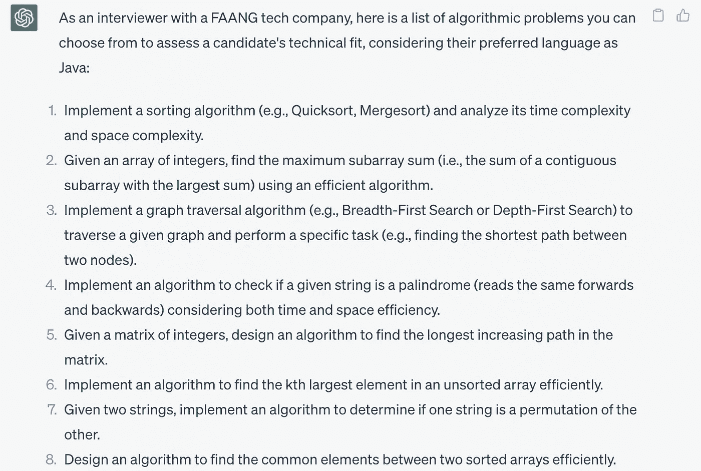
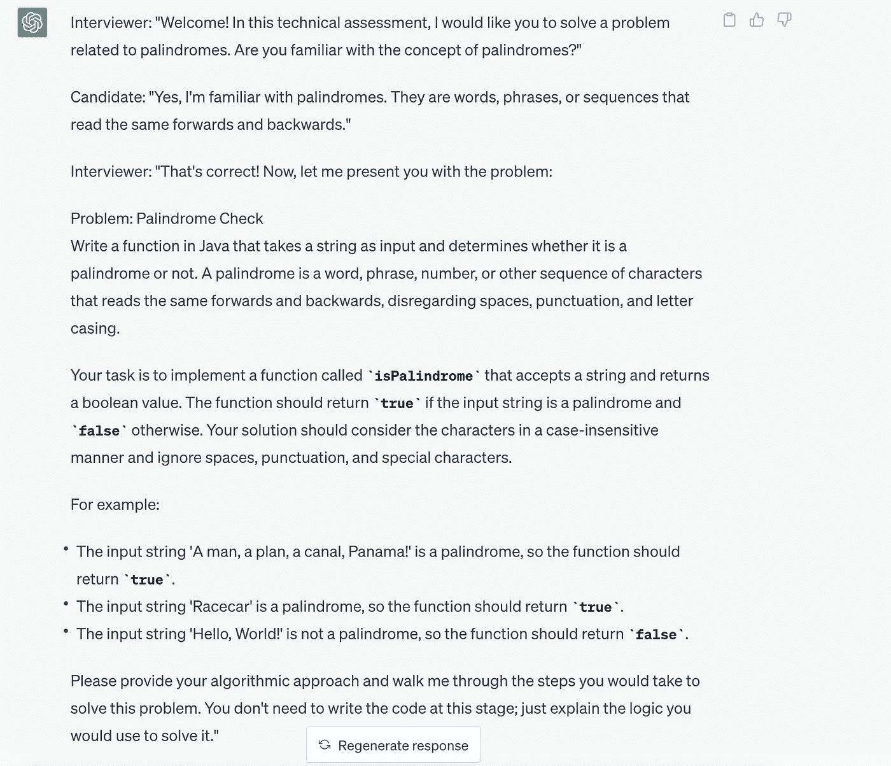
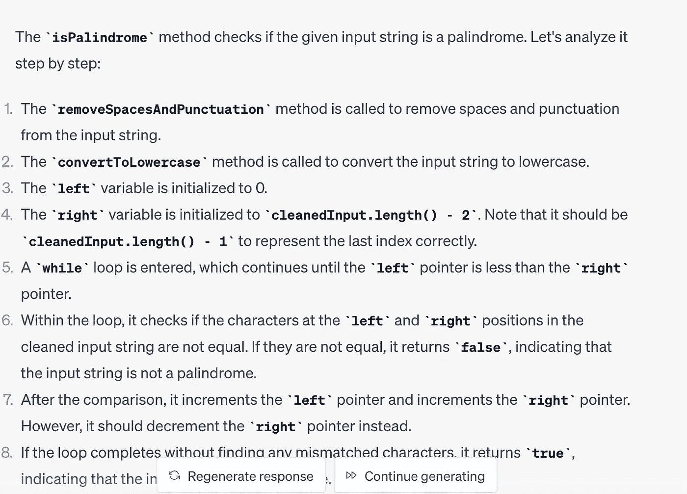

# AI 真的能帮你通过面试吗？

> 原文：[`towardsdatascience.com/can-ai-really-help-you-at-passing-interviews-22bce4a57a2`](https://towardsdatascience.com/can-ai-really-help-you-at-passing-interviews-22bce4a57a2)

## 思考、提示和一些建议

[](https://danielrizea.medium.com/?source=post_page-----22bce4a57a2--------------------------------)[](https://towardsdatascience.com/?source=post_page-----22bce4a57a2--------------------------------) [Daniel Rizea](https://danielrizea.medium.com/?source=post_page-----22bce4a57a2--------------------------------)

·发布在 [Towards Data Science](https://towardsdatascience.com/?source=post_page-----22bce4a57a2--------------------------------) ·9 分钟阅读·2023 年 8 月 5 日

--


Andertoons 图像许可证

最近，我听到了一些面试官的担忧，他们担心候选人可能会利用 AI 来通过技术面试。担忧在于使用像 ChatGPT 或 Bard 这样的 LLM 技术，候选人可能会“作弊”并在技术面试中解决问题。

我认为**你应该利用 AI**来通过面试，但**不是**你最初所期待的那种方式。

> 通过面试最重要的因素是充分准备，而准备的最佳方式就是练习。

一些公司会收取数千美元，通过模拟面试提供反馈，并指出需要改进的地方。这为那些无法负担这种服务的人创造了巨大的机会差距。

随着新型 LLM 技术的出现，问题在于 AI 是否在平衡竞争的条件，是否可以作为练习模拟面试的导师。首先，让我们深入探讨一下利用 AI 的错误方式。

# **错误的方式**

首先，让我们试着解决这个有效的问题。在面试中，你是否应该使用 LLM 服务（可以是 ChatGPT、Bard——随便你）来尝试获得技术问题的答案？技术是可行的，但真正的问题是你作为候选人是否真的应该这样使用？

在我看来，答案是**不**。这样做会在短期和长期内伤害到你。让我们来看一下不这样做的一些原因：

## **你会被抓住**

面试很有压力，大多数情况下，面试官会察觉到你在分屏操作、试图搜索答案并说出你不完全理解的内容。

我在我的职业生涯中[进行过超过 1000 次面试](https://medium.com/entrepreneur-s-handbook/what-ive-learned-after-holding-one-thousand-interviews-234c79b77a89)，在一些情况下，候选人试图进行分屏操作，同时在与我交谈时寻找答案。这一点非常明显。

我怎么知道他们在寻找答案？他们不会注意我的暗示，会突然停顿，然后从不同的角度开始说话。

> 面试非常有压力。额外的压力和担心自己会被抓住会显著降低你的智商。

最可能的结果是你**会失败**面试。我见过几次这种情况。你可能非常聪明且勤奋，但一旦作弊，你就不会成为团队中的文化补充——任何团队。

## **面对面做不到的事**

在 COVID 之前，大多数面试都是面对面的。大科技公司会为现场面试安排航班。随着 COVID 的出现，这一点有所变化，但现在随着返回办公室，越来越多的面试将会面对面进行。在这一点上，如果你被邀请到现场，使用 LLMs 在面试中解决问题几乎是不可能的。

## **游戏的错误角度**

即使你成功获得了工作，你在新职位上很可能会遇到困难。你可以试图说服自己，只要进入岗位，就能在过程中解决一切，但你会给自己带来很多压力，因为你心里知道你在面试中作弊了。

这就像是以谎言开始一段关系——这很可能不会有好的结局。

# **更好地利用 AI 的方法**

看起来 LLMs 在聊天互动方面非常擅长，这正是名字中的意思：大型语言模型。你很可能已经尝试过某个版本的 ChatGPT 或 Bard。如果没有，我鼓励你尝试一下。

从到目前为止大家做的实验来看，LLMs 在正确的提示方式下可能会成为非常好的导师。辅导和获得专业公司提供的服务来指导或教你学习技能是相当昂贵的，但现在借助 AI，事情可能会变得免费。

现在你可以使用 LLMs、今天的 ChatGPT 和 Bards 来完善你的技能，提升面试表现。

# **来自 AI 行业的一些技巧和窍门**

在 LLMs 的帮助下，出现了一种新的“学科”，即所谓的*提示工程*，这是“明确你要求你的 AI LLM 模型提供什么”的聪明名称，以便你获得所需的答案。

目前在行业中关于提示工程有一些陷阱，你可以利用这些陷阱来获得更好的结果。是的，AI 确实会出现幻觉，这是一种巧妙的说法，指的是偏离正轨并给出错误的答案。在这里，良好的提示工程能够减少幻觉的可能性。我会尝试引用不同的文献，以便你看到我并不是在凭空捏造这些内容，你也可以深入研究，否则，你可以直接使用这些提示。

## **上下文，上下文，上下文**

你可能听到过无数次，但上下文很重要。LLMs 也是如此。你为 LLM 引擎设置的上下文越好，你获得的答案就会越好。

## **逐步方法更好**

同样适用于面试。面试官希望看到你为达到特定结果所采取的步骤。如果你在提示中要求提供逐步答案，你会更有可能得到不出现幻觉的模型，并获得更准确的结果。

这在行业中也被称为[思维链推理](https://ai.googleblog.com/2022/05/language-models-perform-reasoning-via.html\)（零样本 CoT）。你可以通过在提示的末尾附加一个*“让我们一步一步思考”*来实现这一点。

## **LLMs 擅长自我检查**

出于某种原因，即使 LLM 出现幻觉并且你询问模型根据你的初始问题答案是否正确，它通常也会知道答案[错误并给出正确答案](https://arxiv.org/abs/2212.09561)。如果它们擅长检查自己的答案，它们也**擅长检查你的答案**。

## **LLMs 不擅长数学**

LLMs[在基本算术上表现不佳](https://www.marktechpost.com/2023/03/12/microsoft-proposes-mathprompter-a-technique-that-improves-large-language-models-llms-performance-on-mathematical-reasoning-problems/)因此尽量避免这些主题。

除非你想通过微积分和基本算术的面试，否则这应该没问题。

但这些技术细节说够了，让我们看看如何将其付诸实践并融入一些之前的行业经验。随意实验你的文本提示。

# **模拟面试脚本和应用提示技巧**

让我们看看如何将你的 LLM 聊天伙伴转变为面试官，带你进行模拟演示。下面是模拟面试过程中主要部分的详细介绍。

## 闲聊

这是为了让候选人放松并描述过程。我们在这里不需要任何提示，或者你可以和你的 LLM 进行关于天气的友好聊天，随你选择。

目前没有提示。

## 向候选人展示问题

在这里我们可以使用以下提示来生成一些可能的 Java 面试问题：

```py
LLM prompt: “You are an interviewer with a FAANG tech company. 
What is a list of algorithmic problems to choose from in order to assess if a candidate is a good technical fit. 
The candidate’s preferred language is Java.”
```

ChatGPT 示例：



作者制作的图片

不要忘记，提供背景信息是有帮助的。通常，问题分为算法或系统设计阶段，你可以通过改变提示中的术语来选择训练哪种类型。

现在你可以选择你的问题，假设我们选择 *回文算法问题*。

```py
LLM prompt: “Please present the palindrome problem to the candidate.”
```

ChatGPT 示例：



作者制作的图片

## 与候选人一起讨论解决方案，就像在面试中一样

在这里你需要打开一个 Google 文档（在远程面试中，你很可能会有一个与面试官共享的书写解决方案的介质）。你可以开始起草你的解决方案和代码，并大声思考，就像在面试中一样。

> 如果你需要更多提示，可以请求它们

```py
LLM prompt: "Can you give additional hints and examples without giving the solution?" 
```

## 时间到

当时间到时，评估解决方案并给予候选人宝贵的反馈。完成你认为有效的解决方案后，检查它是否有效。在下面的提示之后，将代码复制并粘贴到 LLM 提示中。不要忘记应用之前的技巧并请求逐步分析。

```py
LLM prompt: “"Is this a good solution for the Palindrome problem that the candidate has provided? Let's go through it step by step."
```

我们有以下问题的解决方案，其中我们 **故意添加了 2 个错误** 来看看引擎是否会发现它们：

+   将正确的 *length(cleanedInput) -1* 改为 *length(cleanedInput) -2*

+   将正确的 right — 改为 right ++

```py
public class Palindrome {
public static boolean isPalindrome(String input) {
String cleanedInput = removeSpacesAndPunctuation(input);
cleanedInput = convertToLowercase(cleanedInput);
int left = 0;
int right = cleanedInput.length() - 2;
while (left < right) {
if (cleanedInput.charAt(left) != cleanedInput.charAt(right)) {
return false; // Characters don't match, not a palindrome
}
left++;
right++;
}
return true; // All characters matched, it's a palindrome
}
public static String removeSpacesAndPunctuation(String input) {
StringBuilder cleanedInput = new StringBuilder();
for (char c : input.toCharArray()) {
if (Character.isLetterOrDigit(c)) {
cleanedInput.append(c);
}
}
return cleanedInput.toString();
}
public static String convertToLowercase(String input) {
return input.toLowerCase();
}
public static void main(String[] args) {
String input = "A man, a plan, a canal: Panama";
System.out.println(isPalindrome(input)); // Output: true
}
}
```

输出：



作者制作的图片

很高兴我们还得到了一些关于我们犯的错误的指点。

记住，减少 LLM 幻觉机会的一种方法是利用逐步分析方法或 CoT 通过请求逐步分析。

从回文示例中学习后，你可以继续研究另一个问题。

你还可以让 LLM 检查之前提供的答案，以确保它是正确的，并逐步进行分析。

```py
LLM prompt: Are you sure that you have provided a correct assessment? Let’s go through it step by step.
```

# LLMs 和模拟面试的局限性

即使应用了展示的技巧和窍门，LLMs 仍可能会产生幻觉并认为错误的解决方案看起来不错。最好的办法是进行事实核查。将代码运行在模拟器中，以查看它是否输出正确的答案。

使用 LLMs 的一种方法是提出面试中会问到的问题。作为一个很好的起点，你可以使用 LLM 模型解决问题，并通过运行实际代码或在线搜索解决方案来进行事实核查。

# 可能有帮助的工具

如果你不想自己实验 LLM 聊天引擎，你可以利用现有的 **语音和聊天工具**，这些工具可以让你在面试中更自如。

Google 提供了一些很酷的面试准备工具：[interview-warmup](https://grow.google/certificates/interview-warmup/)

# 使用 AI 进行学习，而不是“游戏”

面试的目的在于评估你是否具备必要的技能以及是否与公司文化相匹配。操控系统不会让你与许多公司的文化契合，也很可能不会帮你获得工作。

你可以利用**人工智能**获得竞争优势，通过更快、更聪明地学习以及准备面试。这样你将提升你的价值，并能够通过任何面试，获得你想要的职位。
