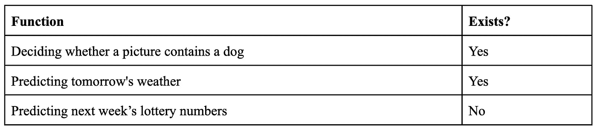
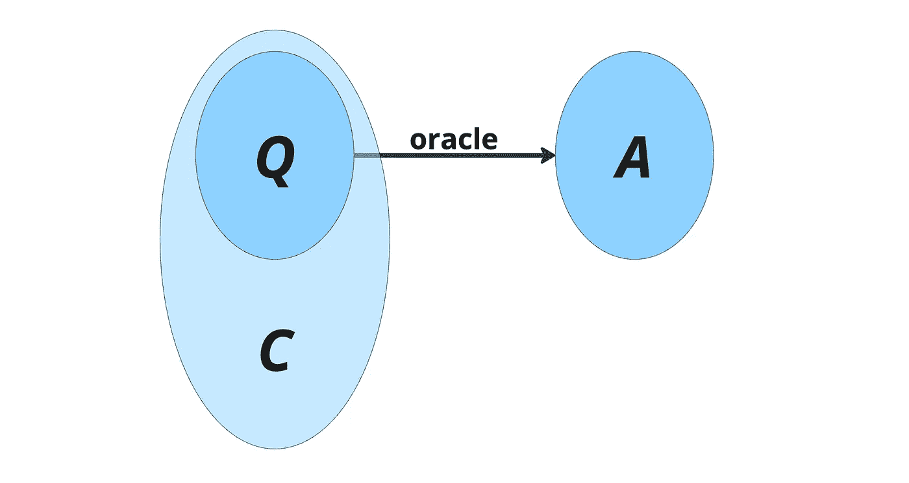
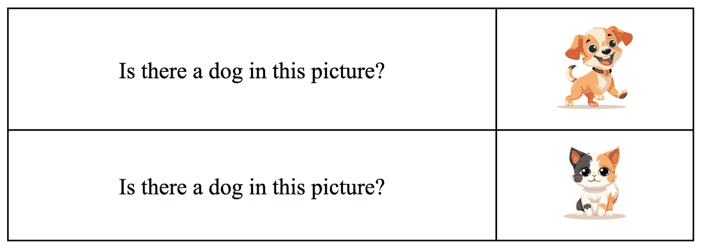

# AI 能解决你的问题吗？

> 原文：[`towardsdatascience.com/can-ai-solve-your-problem-415c9bc1da8a?source=collection_archive---------7-----------------------#2023-11-27`](https://towardsdatascience.com/can-ai-solve-your-problem-415c9bc1da8a?source=collection_archive---------7-----------------------#2023-11-27)

## 识别 AI 适用项目想法的三个简单启发式方法

 [Daniel Bakkelund](https://medium.com/@danielbakkelund?source=post_page-----415c9bc1da8a--------------------------------)

·

[关注](https://medium.com/m/signin?actionUrl=https%3A%2F%2Fmedium.com%2F_%2Fsubscribe%2Fuser%2F169e77f9e788&operation=register&redirect=https%3A%2F%2Ftowardsdatascience.com%2Fcan-ai-solve-your-problem-415c9bc1da8a&user=Daniel+Bakkelund&userId=169e77f9e788&source=post_page-169e77f9e788----415c9bc1da8a---------------------post_header-----------) 发表在 [Towards Data Science](https://towardsdatascience.com/?source=post_page-----415c9bc1da8a--------------------------------) · 6 分钟阅读 · 2023 年 11 月 27 日 

--

图片由 [TheDigitalArtist](https://pixabay.com/users/thedigitalartist-202249/) 提供，来源于 [pixabay](https://pixabay.com/illustrations/ai-generated-city-futuristic-8259059/)。

在一个旨在将 AI 能力融入其产品和服务的产品组织中，总是面临着让非 AI 领域专家也能参与到 AI 进程中的挑战。虽然不是每个人都需要成为 AI 专家，但必须尽可能多地让人们贡献想法，并探索利用 AI 的力量将公司推向更高水平。这一点尤其适用于领域专家和产品人员，他们对其产品和服务试图解决的问题了如指掌，并且知道问题的关键所在。

我学到的一个普遍存在的挑战是基本问题“*我们可以用 AI 解决哪些问题？*”。当非专家提出这个问题时，答案竟然很难给出。因此，我设计了三个启发式问题，你可以在面对一个问题时使用这些问题，思考“这个问题可以用 AI 解决吗？”。如果你能对这三个问题都回答“是”，你可能会发现自己有机会启动一个 AI 项目。

# 问题 1：你能说出来吗？

你可以把 AI 想象成一个回答问题的预言者。你需要问自己的是：

> ***你能用文字表达你希望得到解答的问题吗？***

这当然是一个适用于任何你想做的事情的测试。如果你想做某件事，但无法明确表达你想做的是什么，你可能并不真正知道自己想要什么。启动一个 AI 项目也不例外。

向 AI 提问的示例问题可能包括：

+   这张图片中有一只狗吗？

+   明天的天气会是什么？

+   下周的乐透号码是什么？

这些都是可以提问的良好问题。但并不是所有的问题都能得到回答，因此我们需要另一个测试。

# 问题 2：它存在吗？

我们可以把预言者看作一个将问题映射到答案的函数：

预言者函数将问题映射到答案。

左侧的圆圈包含所有问题，而右侧的圆圈包含所有答案。预言者是将问题发送给答案的函数。接下来要问自己的是：

> ***这个函数存在吗？***

这可能看起来很奇怪，而且问题还会变得更加奇怪：你应该从形而上学的层面来问这个问题——理论上这个函数是否有可能存在？让我们举几个例子：

可能的预言者函数及其存在。

我们都见过 AI 回答“图片中的狗”这个问题，所以我们知道这个函数是存在的。我们也见过天气预报，所以我们知道在某种程度上可以预测明天的天气。但没有办法预测下周的乐透号码。原因在于，乐透被操控的目的正是为了使这个函数不存在。这是不可能的。这就是我所说的“在形而上学层面上”。

为什么这很重要？因为机器学习（这就是我们如何制作 AI）是通过从示例中学习来尝试近似函数。

描绘的预言者函数以及它基于 AI 的近似。

如果我们有很多关于函数（即预言者）应如何行为的示例，我们可以尝试学习这种行为，并尽可能地模拟它。但你只能近似一个存在的函数。

诚然，这些都比较抽象，因此我建议将这个启发式方法替换为以下的元启发式方法：

> ***一个知识丰富的人能做这件事吗？***

从形而上学的角度来看，假设拥有世界上所有的信息和无限的时间，人类能否回答这个问题？显然，人类在识别图片中的狗方面做得相当好。人类确实开发了天气预报，并且也进行天气预报。但是，我们无法预测下周的乐透号码。

如果你已经走到这一步，回答了两次“是”，那么你有 1）一个明确的问题，以及 2）你知道至少在理论上，这个问题是可以回答的。但还有一个问题需要解决：

# 问题 3：背景信息是否可用？

这个问题稍微有点技术性。关键在于，预言者函数通常需要比单纯的问题更多的信息来找到答案。有知识的人在担任预言者时，可能需要额外的信息来做出决策或提供答案。这就是我所说的*背景信息*。

预言者函数和背景信息一起工作。背景信息通常包含超出问题本身的信息。

例如，天气预报的预言者需要知道当前的气象条件以及几天前的条件才能做出预测。这些信息不包含在短语“明天的天气会是什么？”中。

另一方面，在狗和猫的图片中，背景信息就在图片中，不需要额外的背景信息。

之所以这很重要，是因为当我们训练 AI 时，AI 会被问到如下类型的问题：

AI 训练问题。[图片由 brgfx 提供，来源于 Freepik](https://www.freepik.com/author/brgfx)

然后，AI 会在收到真实答案之前做出猜测，并希望随着时间的推移，AI 能够学会区分猫和狗。但要实现这一点，差异必须是可用的，以便 AI 能学会识别这些差异。在图片的情况下，这很直接——你只需要确保图片的质量足够高，以使区分成为可能。在天气预报的情况下，变得更复杂——你实际上需要做出明智的决定，以确定进行天气预测所需的信息。这是一个最好由领域专家回答的问题，因此你可能需要寻求帮助，以获得一个好的答案。

但关键是：如果没有足够的信息供有知识的人回答这个问题，那么 AI 学会如何回答这个问题的希望也很小。你需要这些背景信息。

# 结论

总结一下，如果你希望测试你的 AI 项目想法，以确定这是否是一个可以通过 AI 解决的问题，你可以尝试回答以下三个问题：

> **1\. 你能把你的问题用文字表达出来吗？**
> 
> **2\. 有知识的人能完成这项工作吗？**
> 
> **3\. 背景信息是否可用？**

如果你能对这三个问题都回答“是”，那么你已经准备好继续前进了。可能仍然会有障碍需要克服，也许最终会发现太困难了。但那是另一个帖子的主题。

祝好运！

诚挚的问候

丹尼尔·巴克伦德
