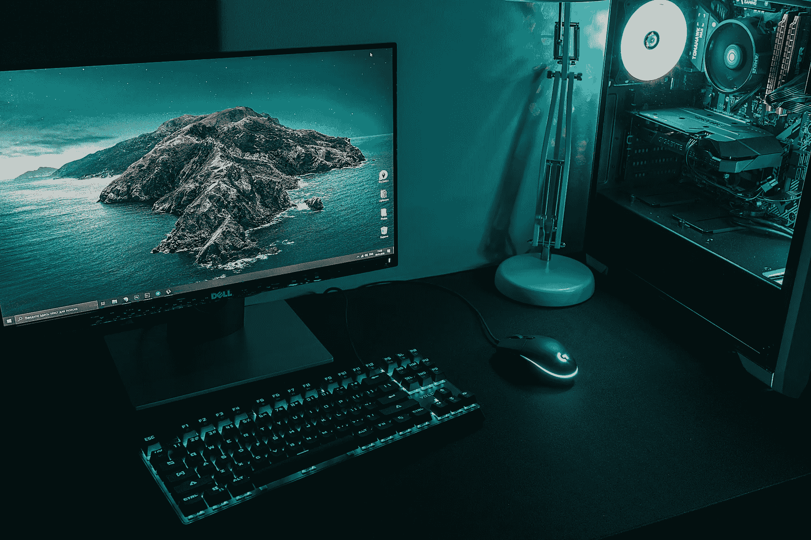

# LLM 能否取代金融科技经理？开发无 GPU 企业分析 AI 工具的全面指南

> 原文：[`towardsdatascience.com/can-an-llm-replace-a-fintech-manager-comprehensive-guide-to-develop-a-gpu-free-ai-tool-for-corpo-ce04e12138e8?source=collection_archive---------5-----------------------#2023-12-20`](https://towardsdatascience.com/can-an-llm-replace-a-fintech-manager-comprehensive-guide-to-develop-a-gpu-free-ai-tool-for-corpo-ce04e12138e8?source=collection_archive---------5-----------------------#2023-12-20)

## [实用教程](https://towardsdatascience.com/tagged/hands-on-tutorials)

## 开发您自己的零成本 LLM 封装器，以在本地解锁企业上下文

 [Gerasimos Plegas 〽️](https://medium.com/@gerasimos_plegas?source=post_page-----ce04e12138e8--------------------------------)

·

[关注](https://medium.com/m/signin?actionUrl=https%3A%2F%2Fmedium.com%2F_%2Fsubscribe%2Fuser%2F3ea2b50f5cb8&operation=register&redirect=https%3A%2F%2Ftowardsdatascience.com%2Fcan-an-llm-replace-a-fintech-manager-comprehensive-guide-to-develop-a-gpu-free-ai-tool-for-corpo-ce04e12138e8&user=Gerasimos+Plegas+%E3%80%BD%EF%B8%8F&userId=3ea2b50f5cb8&source=post_page-3ea2b50f5cb8----ce04e12138e8---------------------post_header-----------) 发表在 [Towards Data Science](https://towardsdatascience.com/?source=post_page-----ce04e12138e8--------------------------------) ·9 分钟阅读·2023 年 12 月 20 日

--

*“在孤独中，思想获得力量，并学会依靠自己”* | 劳伦斯·斯特恩

照片由[Daniel Eliashevskyi](https://unsplash.com/@deni_eliash?utm_content=creditCopyText&utm_medium=referral&utm_source=unsplash)拍摄，发布在[Unsplash](https://unsplash.com/photos/black-flat-screen-computer-monitor-beside-black-computer-keyboard-aTg26S0_OC0?utm_content=creditCopyText&utm_medium=referral&utm_source=unsplash)上。

还不到一年时间，GPT *stardust* ✨几乎覆盖了全球的所有行业。越来越多的专家，来自各个领域，渴望利用大型语言模型（LLM）来优化他们的工作流程。显然，企业界也不能缺席这一新趋势的探索。未来承诺着前所未有的可能性，但也伴随着相应的……成本。

本项目的范围是展示一种端到端的解决方案，以利用大型语言模型（LLMs），同时缓解隐私和成本问题。我们将利用[**LLMWare**](https://github.com/llmware-ai/llmware?ref=hackernoon.com)，一个用于工业级企业 LLM 应用开发的开源框架，检索增强生成（**RAG**）方法[1]，以及[**BLING**](https://huggingface.co/collections/llmware/bling-models-6553c718f51185088be4c91a)——一个新推出的开源小模型集合，仅在 CPU 上运行。

## 概念

在成功预测 Jrue Holiday🏀的[转会](https://medium.com/towards-data-science/can-a-data-scientist-replace-a-nba-scout-ml-app-development-for-best-transfer-suggestion-f07066c2773)到密尔沃基雄鹿队之后，Data Corp 开始了一个新项目：协助一家金融科技公司…
