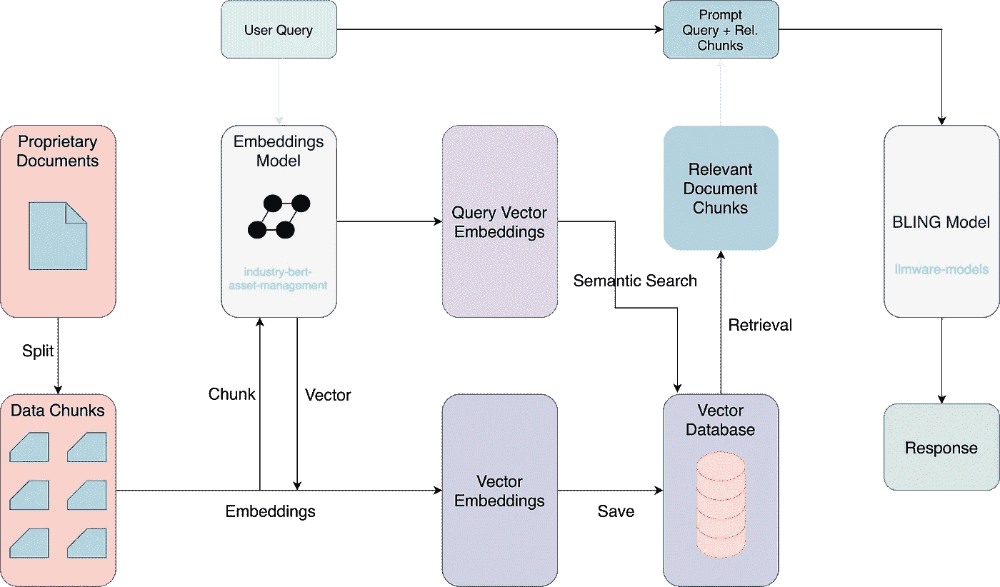

# LLM 能否取代金融科技经理？开发无 GPU AI 工具进行企业分析的综合指南

> 原文：[`towardsdatascience.com/can-an-llm-replace-a-fintech-manager-comprehensive-guide-to-develop-a-gpu-free-ai-tool-for-corpo-ce04e12138e8`](https://towardsdatascience.com/can-an-llm-replace-a-fintech-manager-comprehensive-guide-to-develop-a-gpu-free-ai-tool-for-corpo-ce04e12138e8)

## [实践教程](https://towardsdatascience.com/tagged/hands-on-tutorials)

## 开发你自己的零成本 LLM 包装器，以在本地解锁企业上下文

[](https://medium.com/@gerasimos_plegas?source=post_page-----ce04e12138e8--------------------------------)[](https://towardsdatascience.com/?source=post_page-----ce04e12138e8--------------------------------) [Gerasimos Plegas 〽️](https://medium.com/@gerasimos_plegas?source=post_page-----ce04e12138e8--------------------------------)

·发表于[Towards Data Science](https://towardsdatascience.com/?source=post_page-----ce04e12138e8--------------------------------) ·9 分钟阅读·2023 年 12 月 20 日

--

*“在孤独中，心灵获得力量，学会依赖自己”* | 劳伦斯·斯特恩


图片由[Daniel Eliashevskyi](https://unsplash.com/@deni_eliash?utm_content=creditCopyText&utm_medium=referral&utm_source=unsplash)提供，来源于[Unsplash](https://unsplash.com/photos/black-flat-screen-computer-monitor-beside-black-computer-keyboard-aTg26S0_OC0?utm_content=creditCopyText&utm_medium=referral&utm_source=unsplash)

过去不到一年，GPT *星尘* ✨几乎涵盖了全球的各个领域。越来越多的专家，无论来自哪个领域，都渴望利用大型语言模型（LLM）来优化他们的工作流程。显然，企业界也不能缺席这一新趋势的探索。未来承诺着前所未有的可能性，但这些都伴随着适当的…成本。

本项目的范围是演示如何利用 LLM 的端到端解决方案，以减轻隐私和成本问题。我们将使用[**LLMWare**](https://github.com/llmware-ai/llmware?ref=hackernoon.com)，一个用于工业级企业 LLM 应用开发的开源框架，检索增强生成（**RAG**）方法[1]，以及[**BLING**](https://huggingface.co/collections/llmware/bling-models-6553c718f51185088be4c91a)——一组新推出的开源小模型，完全依赖 CPU 运行。

## 概念

在成功预测 Jrue Holiday 的 🏀 [转会](https://medium.com/towards-data-science/can-a-data-scientist-replace-a-nba-scout-ml-app-development-for-best-transfer-suggestion-f07066c2773) 到密尔沃基雄鹿后，Data Corp 开始了一个新项目：协助一家金融科技中小企业优化其决策过程。也就是说，构建一个工具来处理数百万份专有文档，查询先进的 GPT 类模型，并为经理提供简洁、优化的信息。这一切很好，但有两个主要陷阱：

1.  **安全性**: 查询商业 LLM 模型（即 GPT-4）本质上意味着通过互联网共享专有信息（*那那些数百万份文档怎么办？*）。数据泄露无疑会损害公司的完整性。

1.  **成本**: 像上面提到的自动化工具将提高经理们的生产力，但*天下没有免费的午餐*。预计的每日查询可能达到数百次，考虑到‘GPU-饥渴’的 LLM，累积的成本可能很容易失控。

上述限制促使我选择了一个棘手的替代方案：

*如何开发一个能够处理专有知识并利用 LLM 模型的定制工具，但能够在本地（内部部署）运行，几乎不花费成本？*

为了更好地传达结果，做出了几个假设：

#1: 公司专注于资产管理子领域，因此我们将查询相关话题：例如资产**criticality**。

#2: 为了简化起见，我们将使用少量文档（3）来代表公司的专有来源。`doc_1` 部分描述了术语“criticality”，`doc_2` 包含了“critical”的词条，但意义不相关，`doc_3` 完全不相关。

为了完成任务，我们必须提取有关主题术语“credibility”的最佳上下文。然后，为了验证，我们将直接将其与 OpenAI 的 ChatGPT 的相应答案进行比较。

## 操作模式

1.  熟悉关键**概念**，如 RAG 和 BLING 模型的应用。

1.  **环境**设置和测试以运行代码。

1.  **工具开发**，包括向量数据库初始化、嵌入模型选择、针对有效 RAG 的语义查询。

1.  **基准测试**结果与 OpenAI 模型；与 GPT-3.5-turbo 输出进行比较。

# 1. 关键概念

在深入实施之前，熟悉基础知识是必要的。

## 嵌入

原始文档的文本必须转化为向量表示，这对执行相关性搜索至关重要。简而言之，这种元素使得机器学习模型能够找到它们之间的相似性，从而更好地理解原始数据（即单词）之间的关系。这种转换是通过使用嵌入模型[2]来完成的。

## RAG

检索增强生成（RAG）是自然语言处理（NLP）领域的一个综合方法，以双重方式运作：

+   **检索**相关文档中的信息

+   **生成**基于这些信息的响应。

其实现涉及到用户希望从基础模型之外检索数据的情况，然后将其添加到上下文中以增强他们的提示[3]。



工作流图片由作者提供

如上所示，用户查询触发了知识库的相关上下文检索——这是 RAG 模型的工作。然后，这些上下文增强了原始提示，现已*增强*的提示则输入到基础 LLM 模型中。

## BLING 模型

这完全是一个便捷的开源小型[模型](https://huggingface.co/collections/llmware/bling-models-6553c718f51185088be4c91a)（1B-3B 参数），经过优化以实现 RAG（检索增强生成）实施，旨在运行在基于 CPU 的基础设施上。它们由 HuggingFace 开发，针对知识密集型行业（即金融、法律、监管等），其实现涉及必须严格保护的敏感数据——这实际上是我们的企业案例！

现在我们了解了工具背后的基本技术细节，让我们开始编程吧！

# 2\. 环境设置

在这一部分，我们将建立运行代码所需的环境。在命令行界面（CLI）中，只需运行以下代码片段：

+   安装[transformers](https://pypi.org/project/transformers/) —— 一个开源的预训练模型工具包，能够在多个模态上执行任务。它提供了快速下载和使用模型的 API。

+   安装[llmware](https://pypi.org/project/llmware/)框架 —— 一个企业级基于 LLM 的开发框架，提供工具和微调模型，包括检索库。

install.py

+   安装[Docker](https://www.docker.com/products/docker-desktop/) —— 一个容器化软件，允许我们从 LLMWare 运行一个 compose 文件，包括所有必要的工具，如[Milvus](https://milvus.io)向量数据库和[MongoDB](https://www.mongodb.com)。

docker_compose.bash

+   导入库

import.py

为了确认设置，你可以按照[LLMWare](https://github.com/llmware-ai/llmware?ref=hackernoon.com)的快速入门指南，或选择直接运行以下代码（*现在，让它完全运行 - 我们稍后会解释一切*）：

test_query.py

输出，包括查询结果，表明你已经成功设置了机器。让我们继续下一部分吧！

# 3\. 工具开发

```py
ℹ️ For your reference ℹ️
This code has been executed on a MacBook Pro 2,3 GHz Quad-Core i5
with 8BG RAM, which is anything but powerful for our days, yet managed 
to perform well.
```

现在，让我们进入有趣的部分——动手实践吧！

## 步骤 1 - 向量数据库

首先，我们必须创建一个数据库来存储我们的企业文本。这些信息在多维空间中表示为向量（嵌入），能够存储它们的数据库属于向量数据库的范畴[4]。

[Milvus](https://milvus.io) 是我们将要使用的开源解决方案，它将帮助我们对公司的文档执行语义查询。我们只需创建一个文件夹并将这些文档移动到那里。然后只需复制以下代码片段中的 `samples_path`：

vector_db.py

## 第二步 - 嵌入模型

正如预期的那样，嵌入将被定位……由于我们将工具应用于资产管理领域，我们可以选择一个相关的嵌入模型。希望 HuggingFace 提供了一个专门构建的模型，名为：`[industry-bert-asset-management](https://huggingface.co/llmware/industry-bert-asset-management-v0.1)`。这是一个基于 BERT 的行业领域 Transformer，专为资产管理行业中的嵌入设计。

embeddings.py

## 第三步 - 语义查询

接下来，我们构造我们的语义查询，并将其传递通过向量数据库，要求返回 2 个结果。为了简化起见（*参见假设 #1*），要执行的查询是：“什么被定义为关键性？”

semantic_search.py

## 第四步 - BLING 模型

获取源数据后，我们将把它传递给选择的 BLING 模型。

首先，我们设置一个变量 `embedded_text` 来存储从 `query_res` 列表中的项拼接得到的最终文本。接下来，我们从 LLMWare 实例化一个 Prompt 对象（`prompter`），以克服严格的提示结构。然后，我们检查所有相关的 HuggingFace `models` 以实现最佳性能。

rag.py

为了更清楚，我在此描述了一个精简版本的输出，包括模型-回答对：

```py
 > Loading Model: llmware/bling-1b-0.1...
LLM Response:  The product of the consequence of failure and likelihood of failure ratings provides the overall
criticality score for a given asset. The higher the score, the greater risk

 > Loading Model: llmware/bling-1.4b-0.1...
LLM Response:  The product of the consequence of failure and likelihood of failure ratings provides assertions
for the overall criticality score.

 > Loading Model: llmware/bling-falcon-1b-0.1...
LLM Response:   Criticality scores are the product of the consequence of failure and likelihood of failure ratings.
Criticality scores provide an informed prioritization process that not only identifies the highest risk assets, 
but also allows for the comparison of risk reduction options.

 > Loading Model: llmware/bling-cerebras-1.3b-0.1...
LLM Response:  Criticality score (risk score) for a given asset.

 > Loading Model: llmware/bling-sheared-llama-1.3b-0.1...
LLM Response: Criticality score

 > Loading Model: llmware/bling-sheared-llama-2.7b-0.1...
LLM Response: Criticality is the product of consequence of failure and likelihood of failure ratings, which provides the
overall risk score for a given asset.

 > Loading Model: llmware/bling-red-pajamas-3b-0.1...
LLM Response: The product of the consequence of failure and likelihood of failure ratings provides the overall criticality
score for a given asset.
```

***注意***：由于模型的随机性质，您的结果可能会有所不同。

# 4. 验证

起初，明智的做法是展示涉及的文档对“关键性”术语的说明。根据假设 #2，只有 `doc_1` 是相关的，并且说……

```py
Criticality is the measure of risk associated with an asset.
Knowing which assets are more critical than others can aid in determining:
- how to prioritize the spending of limited funds;
- where to deploy limited personnel resources;
- how to manage an individual asset or collection
- capital improvement planning decisions.

To identify which assets are critical, two questions are important:
- How likely is the asset to fail (likelihood or probability of failure)?
- What are the consequences if the asset does fail (consequence or impact of failure)?

CRITICALITY SCORE
The product of the consequence of failure and likelihood of failure ratings provides 
the overall criticality score (risk score) for a given asset. The higher the score, the greater risk.
```

鉴于此，很容易得出结论，除了 `*llmware/bling-falcon-1b-0.1*`，其他模型的表现均不尽如人意，该模型包含了数学评估（即产品）和优先级语义：

```py
> Loading Model: llmware/bling-falcon-1b-0.1...
LLM Response:   Criticality scores are the product of the consequence of failure and likelihood of failure ratings.
Criticality scores provide an informed prioritization process that not only identifies the highest risk assets, 
but also allows for the comparison of risk reduction options.
```

## 与 GPT-3.5-turbo 的基准测试

在设置好我们的 OpenAI 密钥后，我们可以使用任何所需的模型（在我们的例子中是 GPT-3.5）和添加 `query_results` 的 `prompter`。这样，我们就可以准备好用源和查询字符串对 LLM 进行查询。

validate_gpt.py

```py
In the context of an asset management, criticality is defined by the
importance of an asset to the organization's operations, financial well-being, 
and strategic objectives. It considers the asset's impact on production,
revenue generation, regulatory compliance, and overall business continuity.
Critical assets are prioritized for strategic planning, resource allocation, 
and risk mitigation efforts.
```

答案非常好，与我们工具的输出相比，推导结果令人非常满意。特别是，尽管我们的实现缺少了对*资产重要性*和*资源*的简要参考，但它成功地包含了*数学*评估（也就是产品）和*优先级*语义，这些都源于专有文档。换句话说，这意味着我们那只有 1B 参数、在相当普通的笔记本电脑上本地运行的简陋模型，竟然能够与一个 20B 参数的原始 LLM 进行竞争！

## 结论

再一次，这是一次愉快的旅程……从零成本工具开始，利用最先进的开源框架如 LLMWare，我们轻松开发了一个隐私优先的 AI 工具用于上下文分析。

尽管我们使用了甚至是**1/20** GPT-3.5-turbo 模型的小型 LLM，且**完全不使用 GPU**，但输出结果还是非常出色！我们敢于声称，我们的工具成功地从公司文档中提取了最重要的信息，并“有意识地”将其与 LLM 的响应相结合。

但最重要的是，这次尝试为克服与 GPU 相关的成本和隐私问题奠定了基础，尤其是在处理第三方商业 LLM 解决方案时。如果有任何事情是理所当然的，那就是企业——即使是小企业——可以从类似的实现中获得显著的好处。通过在本地运行，可能还使用专有 GPU 以获得额外的提升，它们可以优化其运营并赶上这一新的 LLM 热潮。


图片由[Andy Holmes](https://unsplash.com/@andyjh07?utm_content=creditCopyText&utm_medium=referral&utm_source=unsplash)提供，刊登在[Unsplash](https://unsplash.com/photos/black-flat-screen-computer-monitor-xA26xebY3dw?utm_content=creditCopyText&utm_medium=referral&utm_source=unsplash)上

感谢阅读，祝您圣诞快乐！如果有任何问题，请随时在下面留言或通过[𝕏](https://twitter.com/MPlegas) / [LinkedIn](https://www.linkedin.com/in/gerasimosplegas)与我联系。无论如何……

享受假期，克隆[repo](https://github.com/makispl/bling-rag-llm-projects)，并招聘下一个…… #LLM 😉

**参考文献**

[1] [`ai.meta.com/blog/retrieval-augmented-generation-streamlining-the-creation-of-intelligent-natural-language-processing-models/`](https://ai.meta.com/blog/retrieval-augmented-generation-streamlining-the-creation-of-intelligent-natural-language-processing-models/)

[2] [`www.cloudflare.com/en-gb/learning/ai/what-are-embeddings/`](https://www.cloudflare.com/en-gb/learning/ai/what-are-embeddings/)

[3] Retrieval-Augmented Generation for Knowledge-Intensive NLP Tasks, P. Lewis et al, 2020, [arXiv:2005.11401](https://arxiv.org/abs/2005.11401)

[4] [`www.pinecone.io/learn/vector-database/`](https://www.pinecone.io/learn/vector-database/)
