# Chat GPT 能下国际象棋吗？

> 原文：[`towardsdatascience.com/can-chat-gpt-play-chess-4c44210d43e4`](https://towardsdatascience.com/can-chat-gpt-play-chess-4c44210d43e4)

## 使用多策略 AI 和深度强化学习击败 GPT3.5 的国际象棋比赛

 [Octavio Santiago](https://octaviobomfim.medium.com/?source=post_page-----4c44210d43e4--------------------------------)

·发表于 [Towards Data Science](https://towardsdatascience.com/?source=post_page-----4c44210d43e4--------------------------------) ·阅读时间 5 分钟·2023 年 12 月 18 日

--

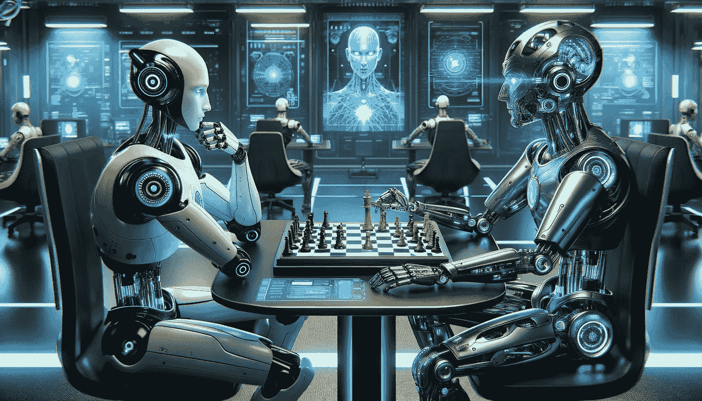

作者提供的图片：使用 DALLE-3 生成的机器人下国际象棋

2021 年，我开发了一个人工智能模型，它使用多种策略和深度强化学习，旨在成为一个真实且专业的国际象棋玩家，我将该 AI 机器人与许多不同的机器人进行了对抗。你可以在下面的文章中获得更多关于这段旅程的细节：

 ## 使用决策制定深度强化学习破解国际象棋

### 使用机器学习创建国际象棋冠军

towardsdatascience.com

2023 年，我使用相同的人工智能来测试 ChatGPT 是否可以下国际象棋，以及它在真实比赛中的表现如何。

在开始之前，首先要问 ChatGPT 是否可以下国际象棋。ChatGPT 说它可以下棋，但不是一个完美的玩家（这是否是它输掉比赛的借口？）。

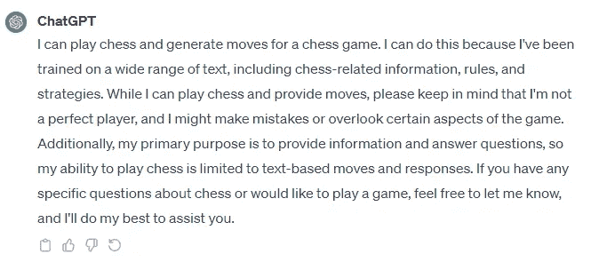

ChatGPT 的回答 — 作者提供的图片

好的，我的 AI 正在使用白方，让我们开始以经典的 e4 开局！

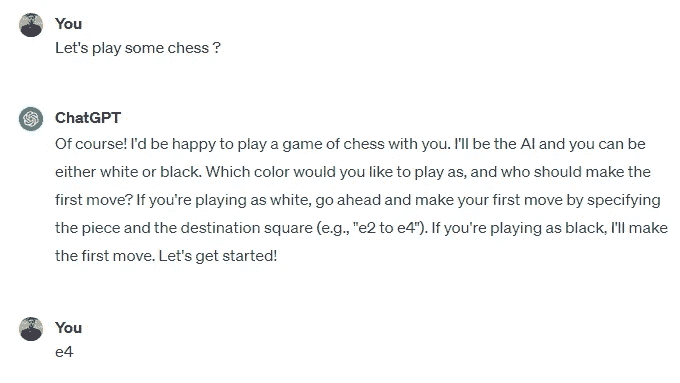

ChatGPT 的回答 — 作者提供的图片

在开局的几步中，我们可以看到 ChatGPT 理解开局，并对每一步给出逻辑分析。目前比赛进展均衡。

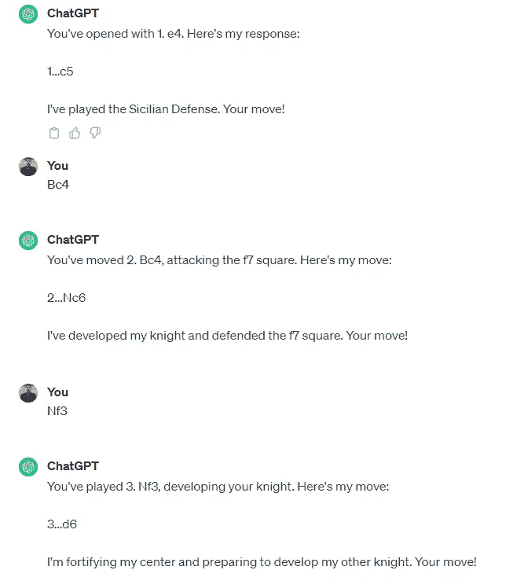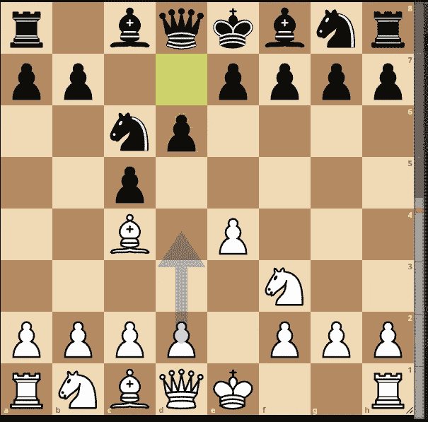

ChatGPT 的回答和国际象棋棋步 — 作者提供的图片

在 8 步之后，我的 AI 模型在 castling 后犯了一个错误，它将兵移动到 h3 后，选择了将主教移动到 f4，而不是用骑士占据 d4，这在这个位置上是最佳的移动。

这个错误给了 ChatGPT 巨大的优势，但是……

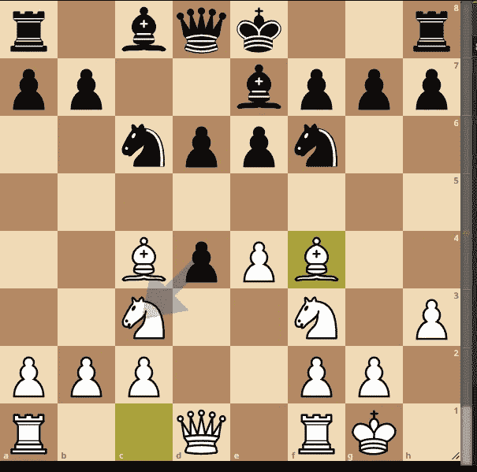

棋步 — 图片作者提供

ChatGPT 进行了一些无意义的分析，声称我的 AI 模型将其骑士固定在了女王上，并决定将一个兵移动到 a6，而不是吃掉 c3 上的骑士，而这才是这个位置的最佳移动。

看起来 ChatGPT 无法跟踪棋盘及其所有棋子，它将这场比赛与训练数据集中其他比赛混淆了。

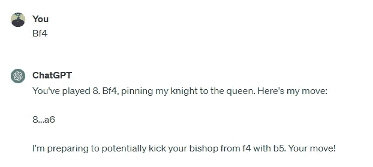

ChatGPT 的回答 — 图片作者提供

ChatGPT 没有把握住这个机会，我的 AI 决定走 Qe2，然后 ChatGPT 进行了另一个无意义的分析，称我将皇后移动以连接我的车并支持 d4，但我甚至没有 d4 上的兵。这个奇怪的分析证实了它没有跟踪任何棋盘位置。

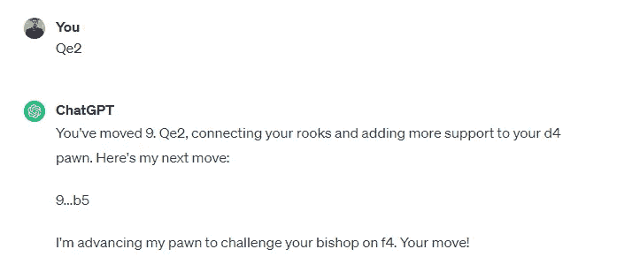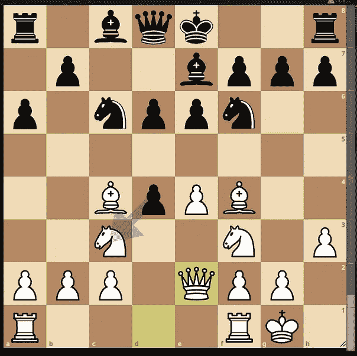

ChatGPT 的回答和棋步 — 图片作者提供

即使有一些错误，ChatGPT 仍然有优势，我曾一度认为我的 AI 会输掉这场比赛。

然后……ChatGPT 决定走 Ba6，这是一个错误，导致整场比赛失利，并将优势转回到我的 AI。

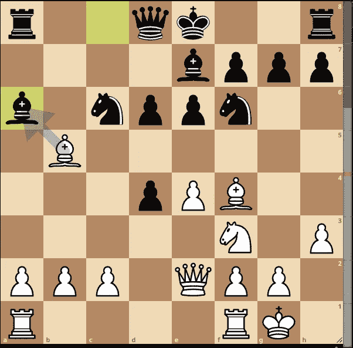

棋步 — 图片作者提供

经过一些无意义的分析后，ChatGPT 完全丧失了对棋盘位置的跟踪，并进入了一个非法移动的无限循环。以下是第一次非法移动的演示：

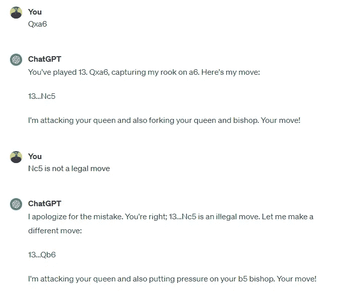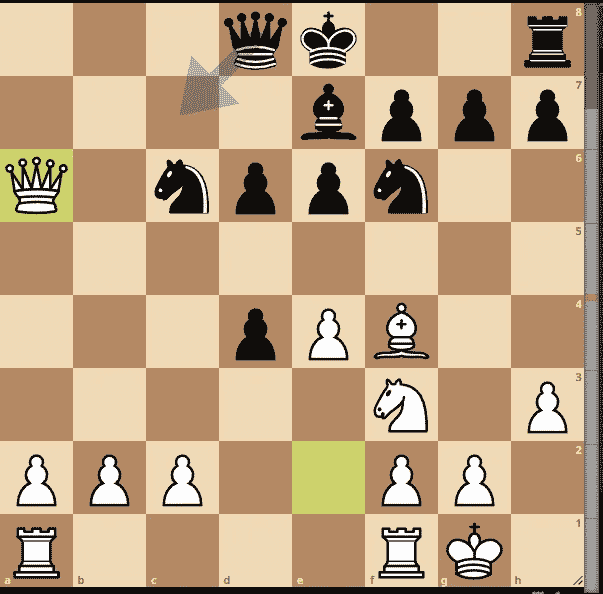

ChatGPT 的回答和棋步 — 图片作者提供

进入这个无限循环后，我无法再继续下棋，因为 ChatGPT 在第 15 步后无法找到任何合法的走法，游戏最终以 ChatGPT 认输结束。

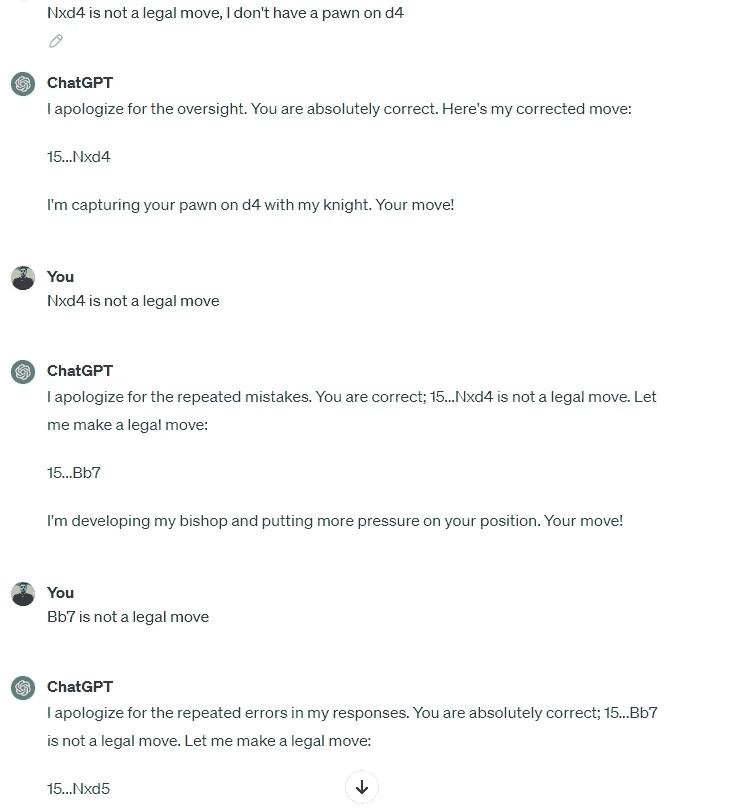

ChatGPT 的回答 — 图片作者提供

ChessAI 获胜！因为它比 ChatGPT 更清楚自己在做什么！

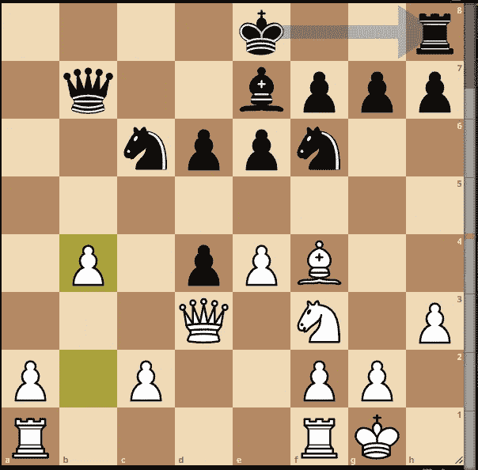

棋步 — 图片作者提供

# 结论

总结，ChatGPT 3.5 无法进行棋局对弈，这个大型语言模型无法跟踪棋盘并检查合法/非法的走法。ChatGPT 使用训练数据集来推断前一个对局中的下一步，但它混淆了这些对局，并没有分析实际的棋盘位置以及如何下这一位置。我们可以假设 ChatGPT 没有足够的游戏知识来做出合理的决定，即使它在开始时声称它已接受了棋规、信息和策略的训练。

国际象棋是一个具有高状态可能性和强规则的顺序决策问题，而 GPT 3.5 尚未能学会这些规则，RL 模型或搜索模型在这种类型的问题上仍然表现更好。目前我的 ChessAI 模型，一个国际象棋专家模型，仍然表现更好！

在下一篇文章中，我将与相同的 AI 进行对局，但这次对战的是 GPT 4.0。GPT 4.0 比 3.5 更强吗？它能进行完整的对局吗？让我们在下一篇文章中揭晓！

如果你想评估整场比赛：

FEN: r1bqkbnr/pp2pppp/2np4/2p5/2B1P3/5N2/PPPP1PPP/RNBQK2R w KQkq — 0 4

PGN: 1\. e4 c5 2\. Bc4 Nc6 3\. Nf3 d6 4\. Nc3 Nf6 5\. O-O e6 6\. h3 Be7 7\. d4 cxd4 8\. Bf4 a6 9\. Qe2 b5 10\. Nxb5 axb5 11\. Bxb5 Ba6 12\. Bxa6 Rxa6 13\. Qxa6 Qb6 14\. Qd3 Qb7 15\. b4 Ne5

任何问题或建议可以通过 LinkedIn 联系我：[`www.linkedin.com/in/octavio-b-santiago/`](https://www.linkedin.com/in/octavio-b-santiago/)
