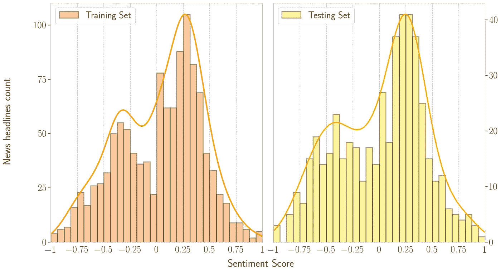
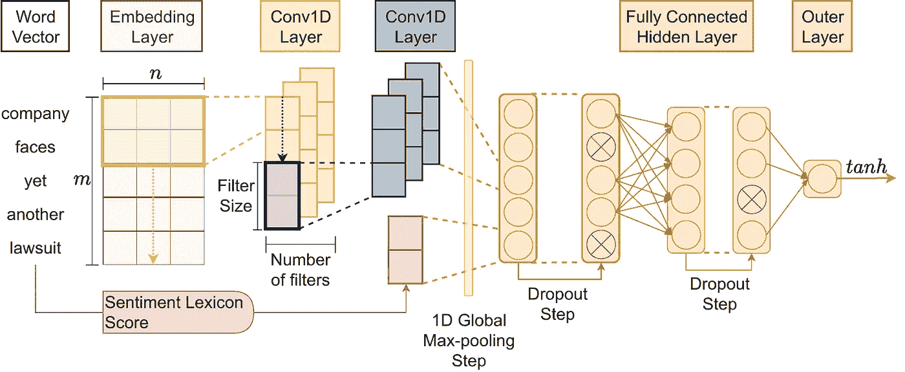
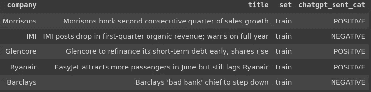
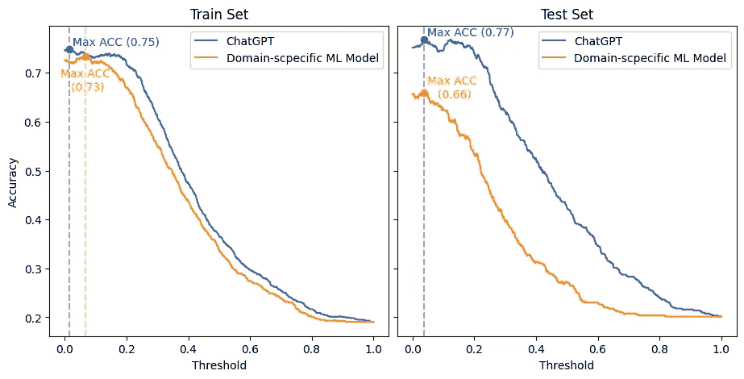
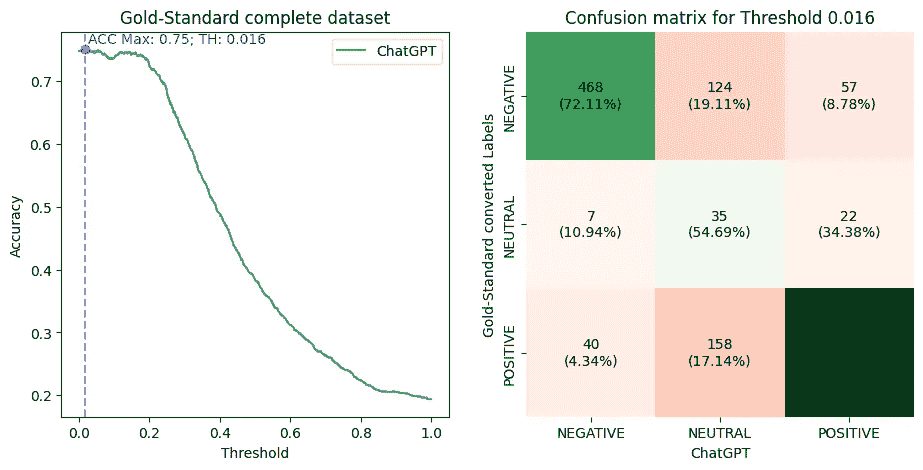
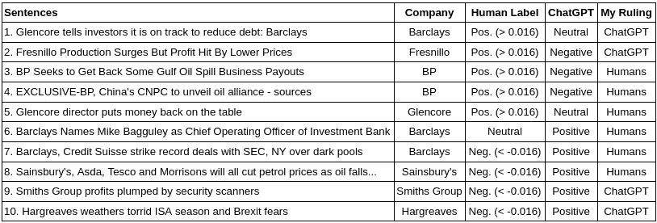
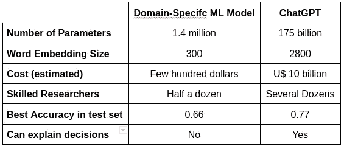
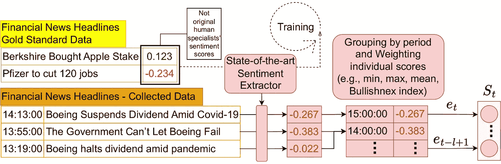

# ChatGPT 能与领域特定情感分析机器学习模型竞争吗？

> 原文：[`towardsdatascience.com/can-chatgpt-compete-with-domain-specific-sentiment-analysis-machine-learning-models-cdcd9937b460?source=collection_archive---------4-----------------------#2023-04-25`](https://towardsdatascience.com/can-chatgpt-compete-with-domain-specific-sentiment-analysis-machine-learning-models-cdcd9937b460?source=collection_archive---------4-----------------------#2023-04-25)

## 一个使用 ChatGPT 与领域特定模型的动手比较

[](https://medium.com/@francisco.paiva?source=post_page-----cdcd9937b460--------------------------------)[](https://towardsdatascience.com/?source=post_page-----cdcd9937b460--------------------------------) [Francisco Caio Lima Paiva](https://medium.com/@francisco.paiva?source=post_page-----cdcd9937b460--------------------------------)

·

[关注](https://medium.com/m/signin?actionUrl=https%3A%2F%2Fmedium.com%2F_%2Fsubscribe%2Fuser%2Fb20176e45fd4&operation=register&redirect=https%3A%2F%2Ftowardsdatascience.com%2Fcan-chatgpt-compete-with-domain-specific-sentiment-analysis-machine-learning-models-cdcd9937b460&user=Francisco+Caio+Lima+Paiva&userId=b20176e45fd4&source=post_page-b20176e45fd4----cdcd9937b460---------------------post_header-----------) 发表在 [Towards Data Science](https://towardsdatascience.com/?source=post_page-----cdcd9937b460--------------------------------) ·15 分钟阅读·2023 年 4 月 25 日[](https://medium.com/m/signin?actionUrl=https%3A%2F%2Fmedium.com%2F_%2Fvote%2Ftowards-data-science%2Fcdcd9937b460&operation=register&redirect=https%3A%2F%2Ftowardsdatascience.com%2Fcan-chatgpt-compete-with-domain-specific-sentiment-analysis-machine-learning-models-cdcd9937b460&user=Francisco+Caio+Lima+Paiva&userId=b20176e45fd4&source=-----cdcd9937b460---------------------clap_footer-----------)

--

[](https://medium.com/m/signin?actionUrl=https%3A%2F%2Fmedium.com%2F_%2Fbookmark%2Fp%2Fcdcd9937b460&operation=register&redirect=https%3A%2F%2Ftowardsdatascience.com%2Fcan-chatgpt-compete-with-domain-specific-sentiment-analysis-machine-learning-models-cdcd9937b460&source=-----cdcd9937b460---------------------bookmark_footer-----------)

照片由 [K. Mitch Hodge](https://unsplash.com/@kmitchhodge?utm_source=medium&utm_medium=referral) 提供，来源于 [Unsplash](https://unsplash.com/?utm_source=medium&utm_medium=referral)

ChatGPT 是一个 GPT (**生成式** **预训练** **变换器**) 机器学习（ML）工具，令世界惊叹。它令人惊叹的能力让普通用户、专业人士、研究人员甚至其[自身的创造者](https://twitter.com/janleike/status/1625207251630960640?t=wHDHT50I-UYEbL7kRDsgfw&s=08) 都感到印象深刻。此外，它作为一个为通用任务训练的机器学习模型，在特定领域情况下表现出色，这一点令人印象深刻。作为一名研究人员，我对它进行情感分析（SA）的能力很感兴趣。

SA 是一种非常广泛的自然语言处理（NLP）技术。它有多个应用，因此可以用于多个领域（例如，金融、娱乐、心理学）。然而，一些领域采用特定的术语和行话（例如，[金融](https://doi.org/10.1111/j.1540-6261.2010.01625.x)）。因此，[通用领域的机器学习模型是否可以与特定领域的](https://aclanthology.org/D16-1057/) 模型一样强大，仍然是一个[NLP 中的开放研究问题](http://dx.doi.org/10.1016/j.eswa.2014.06.009)。

如果你问 ChatGPT 这个研究问题——也就是本文的标题——它会给你一个谦逊的回答（继续试试吧）。但是，哦，我亲爱的读者，我通常不会给你剧透，但你完全无法想象这个 ChatGPT 回答有多么出人意料地谦虚……

作为 AI 研究员、行业专家和爱好者，我习惯于对通用领域的 NLP 机器学习工具（例如，GloVe）进行微调，以用于特定领域的任务。这是因为大多数领域很少能找到一个开箱即用的解决方案，能够在没有一些微调的情况下表现得足够好。我将展示如何不再是这种情况。

在这篇文章中，我通过讨论以下主题来比较 ChatGPT 与一个特定领域的机器学习模型：

1.  SemEval 2017 任务 5 —— 一个特定领域的挑战

1.  使用 ChatGPT API 给数据集打标签的代码示例

1.  比较的裁决和结果及其可重复性细节

1.  结论与结果讨论

1.  额外内容：如何在实际场景中进行这种比较

**注释 1**：*这只是一个简单的实践实验，稍微揭示了这个主题，* ***而非*** *详尽的科学调查。*

**注释 2**：*除非另有说明，所有图片均由作者提供。*

# 1\. SemEval 2017 任务 5 —— 一个特定领域的挑战

[SemEval (**语义评估**)](https://semeval.github.io/) 是一个著名的 NLP 研讨会，研究团队在情感分析、文本相似性和问答任务中进行科学竞争。组织者提供由标注员（领域专家）和语言学家创建的文本数据和金标准数据集，以评估每项任务的最先进解决方案。

特别是，SemEval 的[2017 年任务 5](https://aclanthology.org/S17-2089/)要求研究人员对金融微博和新闻标题进行情感分析，评分范围从 -1（最负面）到 1（最正面）。我们将使用那一年 SemEval 的金标准数据集来测试 ChatGPT 在特定领域任务中的表现。子任务 2 数据集（新闻标题）包含两个句子集（每个最多 30 个单词）：训练集（1,142 个句子）和测试集（491 个句子）。

考虑到这些数据集，下面展示了情感评分和文本句子的分布情况。下图显示了训练集和测试集中都有双峰分布。此外，图表还显示数据集中正面句子多于负面句子。这将在评估部分提供有用的信息。



SemEval 2017 任务 5 子任务 2（新闻标题）数据分布情感评分，考虑到训练集（左 — 1,142 个句子）和测试集（右 — 491 个句子）。

对于这个子任务，获胜的研究团队（即在测试集上排名最佳的团队）将他们的机器学习架构命名为[Fortia-FBK](https://aclanthology.org/S17-2138/)。受这一竞赛发现的启发，我和一些同事撰写了研究文章（[评估基于回归的金融文本情感分析技术](https://doi.org/10.5753/eniac.2019.9329)），在其中我们实现了 Fortia-FBK 的版本，并评估了改进该架构的方法。

此外，我们还调查了使这一架构成为获胜架构的因素。因此，我们的实现（[代码在这里](https://bit.ly/3kzau8G)）将用于与 ChatGPT 进行比较。所采用的架构（CNN+GloVe+Vader）如下所示。



针对金融新闻领域的特定领域情感分析机器学习模型。架构是为研究文章“[评估基于回归的金融文本情感分析技术](https://doi.org/10.5753/eniac.2019.9329)”开发的。**来源：** 作者硕士论文（Lima Paiva, F.C.，《将情感分析融入强化学习以实现智能交易》）。

# 2\. 使用 ChatGPT API 对数据集进行标注

关于使用 ChatGPT API 的讨论已在 Medium 上的[数据合成](https://hands-on-sentiment-analysis-on-hotels-reviews-using-artificial-intelligence-and-open-ais-chatgpt-d1939850c79e)中进行过。此外，你还可以在[ChatGPT API 代码示例部分](https://platform.openai.com/playground/p/default-adv-tweet-classifier?model=text-davinci-003)找到情感标注示例（请注意，使用该 API 并非免费）。在这个代码示例中，请考虑 SemEval 2017 任务的金标准数据集，你可以[在这里获取](https://bitbucket.org/ssix-project/semeval-2017-task-5-subtask-2/src/master/)。

然后，为了同时标注多个句子，使用如下代码，其中我准备了一个完整的提示，包含来自数据框的句子，黄金标准数据集中的要标注的句子以及情感所指的目标公司。

```py
def prepare_long_prompt(df):
  initial_txt = "Classify the sentiment in these sentences between brackets regarding only the company specified in double-quotes. The response should be in one line with format company name in normal case followed by upper cased sentiment category in sequence separated by a semicolon:\n\n"
  prompt = "\"" + df['company'] + "\"" + " [" + df['title'] + ")]"

  return initial_txt + '\n'.join(prompt.tolist())
```

然后，调用*text-davinci-003* *引擎*（GPT-3 版本）的 API。在这里，我对代码进行了一些调整，以考虑提示加回答的最大字符数，总共最多 4097 个字符。

```py
def call_chatgpt_api(prompt):
  # getting the maxium amount of tokens allowed to the response, based on the
  # api Max of 4097, and considering the length of the prompt text
  prompt_length = len(prompt)
  max_tokens = 4097 - prompt_length

  # this rule of dividing by 10 is just a empirical estimation and is not a precise rule
  if max_tokens < (prompt_length / 10):
    raise ValueError(f'Max allowed token for response is dangerously low {max_tokens} and might not be enough, try reducing the prompt size')

  response = openai.Completion.create(
    model="text-davinci-003",
    prompt=prompt,
    temperature=0,
    max_tokens=max_tokens,
    top_p=1,
    frequency_penalty=0,
    presence_penalty=0
  )

  return response.choices[0]['text']

long_prompt = prepare_long_prompt(df)
call_chatgpt_api(long_prompt)
```

最终，对黄金标准数据集中 1633 个（训练 + 测试集）句子进行处理，你会得到以下 ChatGPT API 标签的结果。



使用 ChatGPT API 标注情感的 SemEval 2017 任务 5 子任务 2（新闻头条）黄金标准数据集示例。

## 2.1\. ChatGPT 及其 API 在规模化时的问题

与其他 API 一样，有一些典型要求

+   请求速率限制需要进行节流调整

+   请求限制为 25000 tokens（即子词单元或字节对编码）

+   每个请求的最大长度为 4096 tokens（包括提示 + 响应）

+   成本为$0.0200 / 1K tokens（注：我在所有操作后从未花费超过 U$ 2）

然而，这些只是处理大多数 API 时的典型要求。此外，记住在这个领域特定的问题中，每个句子都有一个目标实体（即公司）用于情感分析。因此，我不得不进行一些调整，直到设计出一个使得能够一次标注多个句子的情感并且后续处理结果变得简单的提示模式。此外，还有其他限制影响了我之前展示的提示和代码。具体来说，我发现使用这个文本 API 处理多个句子（>1000）时存在问题。

+   **可重复性：** ChatGPT 的情感评估在提示中做出很小的修改（例如，添加或删除句子中的逗号或句号）后可能会发生显著变化。

+   **一致性：** 如果你没有明确指定模式响应，ChatGPT 会变得富有创意（即使你选择了非常低的随机性参数），这使得处理结果变得困难。此外，即使你指定了模式，它也可能输出不一致的格式。

+   **不匹配：** 尽管它可以非常准确地识别你在句子中想要评估情感的目标实体（例如公司），但在大规模处理时，它可能会混淆结果。例如，假设你传递了 10 个包含目标公司的句子。如果这些公司出现在其他句子中或重复出现，ChatGPT 可能会混淆目标和句子情感，改变情感标签的顺序或提供少于 10 个标签。

+   **偏见：** 目前，[ChatGPT 偏见问题是众所周知的](https://hbswk.hbs.edu/item/chatgpt-did-big-tech-set-up-the-world-for-ai-bias-disaster)。而且有[改进这个问题的想法](https://www.technologyreview.com/2023/02/21/1068893/how-openai-is-trying-to-make-chatgpt-safer-and-less-biased/)。然而，在那之前，请注意你正在学习使用一个有偏见的 API。

所有这些问题都意味着需要一个学习曲线来正确使用（有偏见的）API。它需要一些微调才能得到我需要的结果。有时我不得不进行许多尝试，直到以最小的一致性达到了期望的结果。

在理想情况下，你应该一次发送尽可能多的句子，原因有二。首先，你希望尽快获得标签。其次，提示作为令牌计算成本，因此请求越少，成本越低。然而，每次请求有 4096 个令牌的限制。此外，考虑到我提到的问题，另一个显著的 API 限制存在。一次传递太多句子增加了不匹配和不一致的机会。因此，你需要不断增加和减少句子的数量，直到找到一致性和成本的最佳平衡点。如果不这样做，你会在后处理结果阶段遭遇问题。

总之，如果你需要处理成千上万的句子，先从几句开始，并且最多用 `10` 个提示来检查响应的可靠性。然后，逐渐增加数量以验证容量和质量，直到找到适合你的任务的最佳提示和比例。

# 3. 判决和比较结果

## 3.1. 比较的细节

在其 GPT-3 版本中，ChatGPT 不能使用数值为文本句子赋予情感（无论我尝试了多少次）。然而，专家在这个特定的黄金标准数据集中为句子情感赋予了数值评分。

因此，为了进行有效的比较，我必须：

1.  将数据集评分分类为 *正面*、*中性* 或 *负面* 标签。

1.  对领域特定的机器学习模型生成的评分做相同的操作。

1.  定义可能的阈值范围（步长为 0.001），以确定一个类别的开始和结束。然后，根据阈值 *TH*，超过 +*TH* 的评分被视为 *正面* 情感，低于 -*TH* 为 *负面*，介于两者之间的是 *中性*。

1.  遍历阈值范围，并在每个点评估两个模型的准确性。

1.  按照集合（即训练或测试）来调查它们的表现，因为领域特定的模型在训练集上可能具有不公平的优势。

步骤 3 的代码如下。完整的比较代码[在这里](https://drive.google.com/drive/folders/1_FpNvcGjnl8N2Z_Az3FGGWQ4QxmutmgG?usp=share_link)。

```py
def get_df_plot(df, th_sequence):
  temp_list = []

  for th in th_sequence:
    converted_gold_arr = np.where((df['sentiment'] <= th) & (df['sentiment'] >= -th), 0, np.sign(df['sentiment']))
    converted_model_arr = np.where((df['cnn-pred-sent'] <= th) & (df['cnn-pred-sent'] >= -th), 0, np.sign(df['cnn-pred-sent']))
    df['sent_cat_value'] = converted_gold_arr.astype(np.int64)
    df['cnn_pred_sent_cat_value'] = converted_model_arr.astype(np.int64)
    corr_gold_chatgpt = df['chatgpt_sent_value'].corr(df['sent_cat_value'])
    corr_gold_cnn = df['chatgpt_sent_value'].corr(df['cnn_pred_sent_cat_value'])
    acc_gold_chatgpt = (df['chatgpt_sent_value']==df['sent_cat_value']).mean()
    acc_gold_cnn = (df['chatgpt_sent_value']==df['cnn_pred_sent_cat_value']).mean()
    temp_list.append([th, corr_gold_chatgpt, corr_gold_cnn, acc_gold_chatgpt, acc_gold_cnn])

  return pd.DataFrame(data=temp_list, columns=['th', 'corr_gold_chatgpt', 'corr_gold_cnn', 'acc_gold_chatgpt', 'acc_gold_cnn'])

th_sequence = np.arange(0, 1.000001, 0.001)
df_plot = get_df_plot(df.copy(), th_sequence)
```

## 3.2. 判决：是的，ChatGPT 不仅可以赢，而且可以超越竞争对手

最终结果显示在下面的图表中，该图表展示了当调整阈值（x 轴）时，两个模型在对数字黄金标准数据集进行分类时的准确性（y 轴）变化。此外，训练集和测试集分别位于左右两侧。



比较 ChatGPT 和领域特定机器学习模型，分别考虑训练集（左侧）和测试集（右侧）。这项评估评估了两个模型在对数字黄金标准数据集进行分类时，准确性（y 轴）如何随阈值（x 轴）的变化而变化。

首先，我必须诚实。我没想到会得到如此惊人的结果。因此，为了对 ChatGPT 公平，我复制了原始 SemEval 2017 竞赛设置，其中领域特定的机器学习模型将使用训练集进行构建。然后，实际排名和比较仅会在测试集上进行。

然而，即使在训练集中，在最有利的情况下——ChatGPT 的阈值为 0.066，而领域特定模型的阈值为 0.014——领域特定的机器学习模型的准确率最多比 ChatGPT 的最佳准确率低 2 个百分点（0.73 对 0.75）。此外，ChatGPT 在训练集和测试集中所有阈值下的准确率均优于领域特定模型。

有趣的是，两个模型的最佳阈值（0.038 和 0.037）在测试集中接近。在这个阈值下，ChatGPT 的准确率比领域特定模型高出 11 个百分点（0.66 对 0.77）。此外，ChatGPT 在阈值变化中的一致性明显优于领域特定模型。因此，可以看出 ChatGPT 的准确率下降得要少得多。

总的来说，ChatGPT 在准确性方面远远超过了领域特定的机器学习模型。另一方面，ChatGPT 还可以根据特定任务进行微调。因此，想象一下 ChatGPT 会变得多么优秀。

## 3.3. 调查 ChatGPT 的情感标注

我一直打算进行更深入的调查，通过分析 ChatGPT 不准确的例子，并将其与领域特定模型进行比较。然而，由于 ChatGPT 的表现远超预期，我转而只调查它未能正确判断情感的案例。

起初，我进行了一次类似的评估，但这次使用了完整的黄金标准数据集。接着，我选择了将黄金标准数值转换为正面、中性和负面标签的阈值（0.016），以获得 ChatGPT 的最佳准确率（0.75）。然后，我制作了一个混淆矩阵。图表如下。



左侧是一个线图，用于评估 ChatGPT 的准确性（y 轴）如何随阈值（x 轴）的变化而变化，以便对数字 Gold-Standard 完整数据集进行分类。右侧是正面、中性和负面标签的混淆矩阵，给出了最大 ChatGPT 性能的阈值为 0.016。此外，混淆矩阵包含了根据转换标签的 ChatGPT 的命中率和遗漏率的百分比。

请回忆一下我在前一节中展示的数据句子分布，其中正面句子的分数比负面句子的分数要高。在混淆矩阵中，观察到考虑到 0.016 的阈值，正面句子有 922 个（56.39%），负面句子有 649 个（39.69%），中性句子有 64 个（3.91%）。

此外，请注意 ChatGPT 在中性标签上的准确性较低。这是可以预期的，因为这些标签更容易受到阈值限制的影响。有趣的是，ChatGPT 倾向于将大多数这些中性句子分类为正面句子。然而，由于中性句子较少，这一现象可能与数据集中较高的正面情感分数有关。

另一方面，在考虑其他标签时，ChatGPT 显示出识别正面类别的能力比负面类别高出 6 个百分点（78.52%对 72.11%）。在这种情况下，我不确定这是否与每个评分范围内句子的数量有关。首先，因为每种类别的句子数量更多。其次，请观察 ChatGPT 将标签错误分类到相反方向（正面到负面或反之）的次数。再次，ChatGPT 在负面类别上的错误更多，而负面类别的句子数量较少。因此，ChatGPT 似乎在处理负面句子时比处理正面句子时更有困难。

## 3.4\. 一些特定案例及与人类专家的比较

我选择了一些在 Gold-Standard（人类评分）和 ChatGPT 之间具有最明显特征的句子。然后，我使用了之前确定的相同阈值将数值评分转换为情感标签（0.016）。此外，[ChatGPT 已经被报道表现优于人类](https://arxiv.org/abs/2303.15056)。因此，我调查了这些差异，并给出了我的裁决，即人类还是 ChatGPT 更精确。

此外，自 2018 年以来，美国机构[DARPA 已经深入研究了让 AI 决策具备解释性的重要性](https://www.darpa.mil/program/explainable-artificial-intelligence)。值得注意的是，ChatGPT 具备这种能力：它可以解释其决策。这一能力帮助我做出了裁决。下表展示了这一检查结果。



表格显示了 Gold-Standard 标签（通过使用 0.016 阈值从人类专家分数转换而来）与 ChatGPT 之间存在不匹配的句子示例。此外，我给出了我认为最好的裁决。

从我支持人类专家的案例开始。在句子 3 和 4 的情况下，ChatGPT 应该意识到，获得回款和公司联盟通常被认为在金融领域是有利的。然而，在句子 7 的情况下，我要求它解释其决定，ChatGPT 的回复是：

> 对 Barclays 的积极情感通过“创纪录”一词传达，这意味着公司在成功解决与监管机构的法律问题上取得了显著成就。

对于这个句子，ChatGPT 没有理解到，尽管达成创纪录的交易通常是好的，但 SEC 是一个监管机构。因此，与 SEC 达成创纪录的交易意味着 Barclays 和 Credit Suisse 必须支付创纪录的罚款。

继续讨论句子 5 和 8，这些都是非常艰难的判断。让我明确，人类在评估中是正确的。然而，ChatGPT 确实无法猜到这些。在句子 5 中，需要了解当时的情况才能理解这个句子代表了一个好的结果。对于句子 8，需要知道油价下跌与特定目标公司的股票价格下跌相关。

然后，对于句子 6，最中性的句子可以获得零情感分数，ChatGPT 解释了其决定如下：

> 这个句子是积极的，因为它宣布了新的投资银行首席运营官的任命，对公司来说是个好消息。

然而，这个回答很普通，没有很有洞察力，也没有解释为什么 ChatGPT 认为这位特定高管的任命是好的。因此，我在这种情况下同意了人类专家的观点。

有趣的是，我在句子 1、2、9 和 10 中对 ChatGPT 的评判是有利的。此外，仔细观察，人类专家应该更多关注目标公司或整体信息。这在句子 1 中尤其明显，专家们应当认识到虽然对 Glencore 的情感是积极的，但目标公司是 Barclays，而不是撰写报告的公司。在这方面，ChatGPT 在识别情感目标和意义方面做得更好。

# 4\. 结论和结果讨论

从下表可以看出，实现这样的表现需要大量的财务和人力资源。



比较模型的各个方面，例如参数数量、使用的词嵌入大小、成本、构建所需的研究人员数量、测试集中的最佳准确性，以及其决策是否可解释。

在这方面，尽管 ChatGPT 优于领域特定模型，但最终比较仍需要对 ChatGPT 进行领域特定任务的微调。这将有助于确定微调的性能提升是否超过了投入的成本。

此外，[文本模型中最重要的因素之一是词嵌入的大小](https://doi.org/10.5753/eniac.2019.9329)。自 SemEval 2017 版以来，这项技术已有所发展。因此，这部分的一些更新可能会显著提高领域特定模型的结果。

另一方面，随着生成文本模型和大型语言模型（LLMs）的流行，一些[开源版本](https://www.kdnuggets.com/2023/04/8-opensource-alternative-chatgpt-bard.html)可以帮助组装一个有趣的未来对比。此外，像 ChatGPT 这样的 LLM 能够解释其决策是一个杰出的、可能出乎意料的成就，这可能会彻底改变这一领域。

# 5\. 附加：如何在应用场景中进行这种对比

在不同领域的情感分析是一个独立的科学工作。然而，在合适的场景中应用情感分析的结果可能是另一个科学问题。此外，考虑到我们处理的是金融领域的句子，尝试将情感特征添加到应用智能系统中会比较方便。这正是一些研究人员一直在做的事情，我也在尝试这样做。

在 2021 年，我和一些同事发表了一篇[关于如何在应用场景中使用情感分析的研究文章](https://doi.org/10.1145/3490354.3494445)。在这篇文章中——在第二届 ACM 国际金融人工智能会议（ICAIF’21）上呈现——我们提出了一种将市场情绪纳入强化学习架构的高效方法。该架构的实现源代码[在这里可以获得](https://github.com/xicocaio/its-sentarl)，其整体设计的一部分如下所示。



一个将市场情绪纳入应用场景的强化学习架构的示例架构部分。**来源：** *《智能交易系统：一种情感感知的强化学习方法》。第二届 ACM 国际金融人工智能会议（ICAIF ‘21）论文集。* ***Lima Paiva, F. C.****; Felizardo, L. K.; Bianchi, R. A. d. C. B.; Costa, A. H. R.*

该架构旨在处理像 Gold-Standard 数据集中那样的数值情感分数。然而，也有技术（例如，[Bullishnex 指数](https://doi.org/10.1111/j.1540-6261.2004.00662.x)）可以将由 ChatGPT 生成的类别情感转换为适当的数值。应用这种转换使得可以在这样的架构中使用 ChatGPT 标记的情感。此外，这也是在这种情况下可以做的一种示例，并且是我计划在未来分析中做的事情。

## 5.1\. 我研究领域的其他文章（NLP，RL）

+   ***利马·帕伊瓦，F. C.****; 弗利扎多，L. K.; 比安基，R. A. d. C. B.; 科斯塔，A. H. R.* [*智能交易系统：一种情感感知的强化学习方法*](https://doi.org/10.1145/3490354.3494445)。第二届 ACM 国际金融人工智能会议（ICAIF ‘21）论文集。

+   弗利扎多，L. K.; **利马·帕伊瓦，F. C.**; 德维塔·格雷夫斯，C.; 松本，E. Y.; 科斯塔，A. H. R.; 德尔-莫拉尔-埃尔南德斯，E.; 布兰迪马特，P. [*超越算法交易强化学习系统：对加密货币市场的监督方法*](https://doi.org/10.1016/j.eswa.2022.117259)。应用专家系统（2022 年），第 202 卷，第 117259 页。

+   弗利扎多，L. K.; **利马·帕伊瓦，F. C.**; 科斯塔，A. H. R.; 德尔-莫拉尔-埃尔南德斯，E. [*应用于交易系统的强化学习：一项调查*](https://arxiv.org/abs/2212.06064)*.* arXiv，2022 年。

# 使用的资源

+   [比较 Jupyter 笔记本](https://drive.google.com/drive/folders/1_FpNvcGjnl8N2Z_Az3FGGWQ4QxmutmgG?usp=sharing)

+   [领域特定机器学习模型](https://bit.ly/3kzau8G)

+   [金标准数据集](https://bitbucket.org/ssix-project/semeval-2017-task-5-subtask-2/src/master/)

+   [应用情感分析场景的代码（ITS-SentARL）](https://github.com/xicocaio/its-sentarl)

# 主要参考文献

+   卡杰赫·纳西尔图西，A.，阿赫博佐尔吉，S.，英·瓦赫，T.，和吴，D. C. L. [市场预测中的文本挖掘：一项系统综述](http://dx.doi.org/10.1016/j.eswa.2014.06.009)。应用专家系统（2014 年），41(16):7653–7670。

+   洛赫兰，T. 和 麦克唐纳，B. [何为负债？文本分析、词典和 10-K 报告](https://doi.org/10.1111/j.1540-6261.2010.01625.x)。金融杂志（2011 年），66(1):35–65。

+   汉密尔顿，W. L.，克拉克，K.，列斯科维奇，J.，和朱拉夫斯基，D. [从未标记语料库中诱导领域特定情感词典。](https://aclanthology.org/D16-1057/) 2016 年自然语言处理经验方法会议论文集，页 595–605。

+   科尔蒂斯，K.; 弗雷塔斯，A.; 道德特，T.; 赫尔利曼，M.; 扎鲁克，M.; 汉施胡，S.; 戴维斯，B. [*SemEval-2017 任务 5：金融微博和新闻的细粒度情感分析*](https://aclanthology.org/S17-2089/)。第 11 届语义评价国际研讨会（SemEval-2017）论文集。

+   戴维斯，B.，科尔蒂斯，K.，瓦西留，L.，孔皮斯，A.，麦克德莫特，R.，和汉施胡，S. [由 X-Scores 驱动的社交情感指数](https://www.thinkmind.org/index.php?view=article&articleid=alldata_2016_1_40_90041)。ALLDATA，第二届国际大数据、小数据、关联数据和开放数据会议（2016 年）。

+   Ferreira, Taynan; **利马·帕伊瓦，F. C.**; 西尔瓦，罗伯托·达; 保拉，安赫尔·德; 科斯塔，安娜; 库尼亚斯卡，卡洛斯。[*评估基于回归的金融文本情感分析技术*](https://doi.org/10.5753/eniac.2019.9329)。第 16 届国家人工智能与计算智能会议（ENIAC），2019 年。

# 联系方式

+   [Linkedin](https://www.linkedin.com/in/xicocaio/)

+   [网站](https://sites.google.com/alumni.usp.br/francisco-paiva)

+   [研究门户](https://www.researchgate.net/profile/Francisco-Lima-Paiva)
