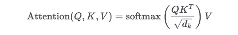
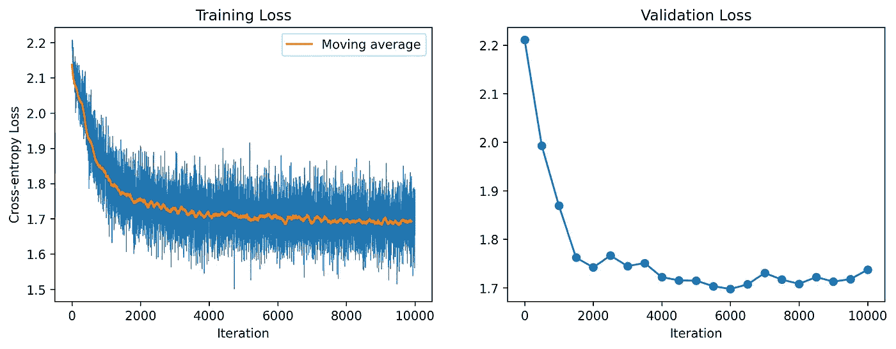
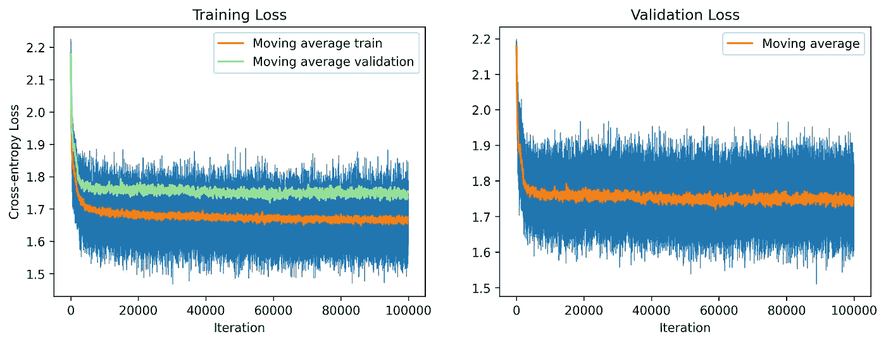
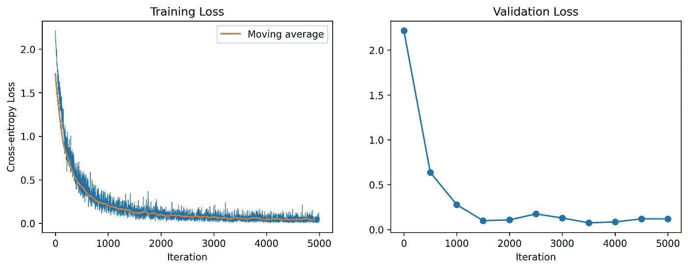

# 变换器能否学会制定策略？

> 原文：[`towardsdatascience.com/can-transformers-learn-to-strategize-862770c996ea`](https://towardsdatascience.com/can-transformers-learn-to-strategize-862770c996ea)

## TicTacGPT 用于玩简单的棋盘游戏

[](https://charlieoneill.medium.com/?source=post_page-----862770c996ea--------------------------------)[](https://towardsdatascience.com/?source=post_page-----862770c996ea--------------------------------) [Charlie O'Neill](https://charlieoneill.medium.com/?source=post_page-----862770c996ea--------------------------------)

·发布于 [Towards Data Science](https://towardsdatascience.com/?source=post_page-----862770c996ea--------------------------------) ·27 分钟阅读·2023 年 9 月 8 日

--


图片由 [Jon Tyson](https://unsplash.com/@jontyson?utm_source=medium&utm_medium=referral) 提供，来源于 [Unsplash](https://unsplash.com/?utm_source=medium&utm_medium=referral)

尽管大多数棋盘游戏倾向于使用卷积神经网络或其他几何灵感的架构，但我们实际能够将棋盘状态表示为字符串，这就引出了一个问题，即变换器是否可以自然地应用于游戏。在这里，我们将看看是否可以在简单的井字游戏的背景下回答这个问题。虽然这看起来可能不太实际（几乎每个人都知道这个游戏中存在一个简单的闭式纳什均衡策略），但它是我们问题的一个有用的测试平台。原因在于游戏足够简单，我们可以轻松训练一个变换器来玩它，但又足够复杂，不容易立刻看出最佳策略是什么。

# 实现游戏

我们将开始实现一个`TicTacToe`类。这相当简单。我们希望能够将棋盘表示为 9 个字符的字符串，每个字符代表一个方格。我们将使用`X`表示第一个玩家，`O`表示第二个玩家，`-`表示空方格。我们还会跟踪轮到谁进行下一步，游戏是否结束。如果有获胜者，我们也会记录下来。最后，我们将包含一个打印棋盘的方法，以便在调试时不必盯着字符串看。

```py
class TicTacToe:
    def __init__(self):
        # Initialise an empty board
        self.board = ['-' for _ in range(9)]
        self.current_player = 'X'  # X will start

    def make_move(self, position):
        """Make a move on the board."""
        if self.board[position] == '-':
            self.board[position] = self.current_player
            self.switch_player()
            return True
        else: return False  # illegal move

    def switch_player(self):
        """Switch the current player."""
        self.current_player = 'O' if self.current_player == 'X' else 'X'

    def check_winner(self):
        """Check if there is a winner."""
        # Rows, columns, diagonals
        winning_positions = [
            [0, 1, 2], [3, 4, 5], [6, 7, 8],  # Rows
            [0, 3, 6], [1, 4, 7], [2, 5, 8],  # Columns
            [0, 4, 8], [2, 4, 6]  # Diagonals
        ]

        for positions in winning_positions:
            values = [self.board[pos] for pos in positions]
            if values[0] == values[1] == values[2] and values[0] != '-':
                return values[0]

        return None  # No winner yet

    def is_draw(self):
        """Check if the game is a draw."""
        return all(cell != '-' for cell in self.board)

    def get_board_string(self):
        """Get the current board state as a string."""
        return ''.join(self.board)

    def get_legal_moves(self):
        """Get the positions of all legal moves."""
        return [i for i, cell in enumerate(self.board) if cell == '-']

    def pretty_print_board(self):
        """Pretty-print the board."""
        for i in range(0, 9, 3):
            print(f"{self.board[i]} | {self.board[i+1]} | {self.board[i+2]}")
            if i < 6:
                print("- "*5)

# Test the pretty_print_board method
tic_tac_toe = TicTacToe()
print("Initial board:")
tic_tac_toe.pretty_print_board()

# Make some moves
tic_tac_toe.make_move(0)
tic_tac_toe.make_move(4)
tic_tac_toe.make_move(8)
print("\nBoard after some moves:")
tic_tac_toe.pretty_print_board()

Initial board:
- | - | -
- - - - - 
- | - | -
- - - - - 
- | - | -

Board after some moves:
X | - | -
- - - - - 
- | O | -
- - - - - 
- | - | X
```

# 创建我们的训练数据

我们希望我们的变换器能够输入一个给定的棋盘状态，并输出一个走法，该走法是一个从 0 到 8 的整数，表示它希望将棋子放在的位置。为此，我们将创建一个棋盘状态和走法的数据集。我们将通过模拟我们玩家的所有可能获胜位置，然后遍历所有可能使我们达到该位置的游戏组合来做到这一点。这意味着变换器将学习在任何给定的棋盘状态下什么是一个好的走法。

为了实现这一点，`simulate_all_games` 函数生成了训练和验证数据。具体来说，该函数模拟了所有可能的井字棋游戏，探索了两个玩家（‘X’ 和 ‘O’）的每一种走法排列。这种详尽的模拟确保了模型在一个全面的数据集上进行训练，涵盖了所有可能的游戏情景。在每个模拟的游戏中，函数记录了不仅是获胜或平局的结果，还记录了棋盘状态的序列以及导致这些结果的走法。这些棋盘状态和走法随后被转换为数字表示，适用于训练我们的变换器。这确保了模型不仅学习如何获胜，还能够从任何给定的棋盘状态中输出一个合适的获胜走法。你可以将其视为类似于常规语言变换器在给定任何长度的上下文时输出一个合适的标记，从一个标记（即我们的起始棋盘状态）到 EOS 标记（即我们的获胜走法生成最终棋盘状态）。

```py
from copy import deepcopy
from itertools import product
import numpy as np
import torch

# Define character to integer mapping
chars = sorted(list(set('XO-')))
vocab_size = len(chars)
stoi = {ch: i for i, ch in enumerate(chars)}
itos = {0: '-', 1: 'X', 2: 'O'}
encode = lambda s: [stoi[c] for c in s]
decode = lambda l: ''.join([itos[i] for i in l])

input_sequences = []
output_sequences = []

# Function to simulate all possible games recursively
def simulate_all_games(game, x_moves, o_moves):
    global input_sequences, output_sequences

    # Check if the game has reached a terminal state
    winner = game.check_winner()
    if winner == 'X' or game.is_draw():
        # Add the sequence of board states and moves leading to this win for 'X' or draw
        board = ['-' for _ in range(9)]
        for i, x_move in enumerate(x_moves):
            input_sequences.append(encode(''.join(board)))
            output_sequences.append(x_move)
            board[x_move] = 'X'
            if i < len(o_moves):
                board[o_moves[i]] = 'O'
        return
    elif winner == 'O':
        return  # We don't add these to our training data

    # Otherwise, continue simulating the game
    legal_moves = game.get_legal_moves()
    for move in legal_moves:
        # Create a copy of the game to simulate the move
        new_game = deepcopy(game)
        was_legal = new_game.make_move(move)

        # If the move was legal, continue simulating
        if was_legal:
            if new_game.current_player == 'X':
                simulate_all_games(new_game, x_moves + [move], o_moves)
            else:
                simulate_all_games(new_game, x_moves, o_moves + [move])

# Create an initial empty game
initial_game = TicTacToe()

# Simulate all possible games starting with 'X'
simulate_all_games(initial_game, [], [])

# Convert to PyTorch tensors
input_tensor = torch.tensor(input_sequences, dtype=torch.long)
output_tensor = torch.tensor(output_sequences, dtype=torch.long)

# Show some sample input-output pairs
print(input_tensor[:10], output_tensor[:10])

print("Number of input-output pairs:", len(input_sequences))

tensor([[0, 0, 0, 0, 0, 0, 0, 0, 0],
        [1, 2, 0, 0, 0, 0, 0, 0, 0],
        [1, 2, 1, 2, 0, 0, 0, 0, 0],
        [0, 0, 0, 0, 0, 0, 0, 0, 0],
        [1, 2, 0, 0, 0, 0, 0, 0, 0],
        [1, 2, 1, 2, 0, 0, 0, 0, 0],
        [1, 2, 1, 2, 1, 2, 0, 0, 0],
        [0, 0, 0, 0, 0, 0, 0, 0, 0],
        [1, 2, 0, 0, 0, 0, 0, 0, 0],
        [1, 2, 1, 2, 0, 0, 0, 0, 0]]) 
tensor([1, 3, 5, 1, 3, 5, 6, 1, 3, 5])

Number of input-output pairs: 658224
```

这给我们大约 650,000 个张量用于训练。这些张量看起来大致正确，但没有可视化的棋盘很难判断。让我们重用我们的 `print_board` 函数来查看一些随机的棋盘状态，以及给定走法后的下一个棋盘状态是什么样的：

```py
def pretty_print_board(board: str):
    """Pretty-print the board."""
    for i in range(0, 9, 3):
        print(f"{board[i]} | {board[i+1]} | {board[i+2]}")
        if i < 6:
            print("- "*5)

rand_idx = torch.randint(len(input_tensor), (1,))[0]
random_game = input_tensor[rand_idx].tolist()
print("Current game state:")
decoded_game = decode(random_game)
pretty_print_board(decoded_game)
print( )

move = output_tensor[rand_idx].item()
decoded_game = decoded_game[:move] + 'X' + decoded_game[move+1:]
print("New game state:")
pretty_print_board(decoded_game)

Current game state:
X | - | -
- - - - - 
- | X | O
- - - - - 
- | O | -

New game state:
X | - | X
- - - - - 
- | X | O
- - - - - 
- | O | -
```

这似乎是合理的，但我注意到有些游戏有一个可用的获胜走法，但模拟却做出了不同的走法（仍然以胜利告终）。在上面的示例中出现了这种情况。让我们将 `simulate_all_games` 函数更改为在找到至少一个潜在获胜走法时停止搜索。

```py
input_sequences = []
output_sequences = []

def simulate_all_games(game, x_moves, o_moves):
    global input_sequences, output_sequences

    # Check if the game has reached a terminal state
    winner = game.check_winner()
    if winner == 'X' or game.is_draw():
        # Add the sequence of board states and moves leading to this win for 'X' or draw
        board = ['-' for _ in range(9)]
        for i, x_move in enumerate(x_moves):
            input_sequences.append(encode(''.join(board)))
            output_sequences.append(x_move)
            board[x_move] = 'X'
            if i < len(o_moves):
                board[o_moves[i]] = 'O'
        return
    elif winner == 'O':
        return  # We don't add these to our training data

    # Before simulating further moves, check if a winning move is available
    legal_moves = game.get_legal_moves()
    for move in legal_moves:
        test_game = deepcopy(game)
        test_game.make_move(move)
        if test_game.check_winner() == game.current_player:
            # This move is a winning move, so we make it and end further simulation
            if test_game.current_player == 'X':
                simulate_all_games(test_game, x_moves + [move], o_moves)
            else:
                simulate_all_games(test_game, x_moves, o_moves + [move])
            return  # End further exploration for this branch

    # If no immediate winning move is found, continue simulating the game
    for move in legal_moves:
        # Create a copy of the game to simulate the move
        new_game = deepcopy(game)
        was_legal = new_game.make_move(move)

        # If the move was legal, continue simulating
        if was_legal:
            if new_game.current_player == 'X':
                simulate_all_games(new_game, x_moves + [move], o_moves)
            else:
                simulate_all_games(new_game, x_moves, o_moves + [move])

# Create an initial empty game
initial_game = TicTacToe()

# Simulate all possible games starting with 'X'
simulate_all_games(initial_game, [], [])

# Convert to PyTorch tensors
input_tensor = torch.tensor(input_sequences, dtype=torch.long)
output_tensor = torch.tensor(output_sequences, dtype=torch.long)
```

最后，让我们看看我们需要训练多少步：

```py
print("Number of input-output pairs:", len(input_sequences))

Number of input-output pairs: 147104
```

大约 150,000 个示例。这看起来是一个合理的开始。

# 多头注意力的变换器架构

注意力是一种机制，使模型能够在进行预测时专注于输入序列的某些部分。变压器架构使用多头自注意力，这意味着模型学习以不同的方式关注输入序列的不同部分。这很有用，因为它允许模型学习输入序列和输出序列之间的不同关系。例如，当预测输出序列中的第一个词时，它可能会学习关注输入序列中的第一个标记，但在预测输出序列中的第二个词时，则关注输入序列中的最后一个标记。这是一种强大的机制，可以使模型学习输入序列和输出序列之间的复杂关系。

但这到底是怎么工作的呢？从原始的 *Attention is all you need* 论文中，定义在查询矩阵 Q、键矩阵 K 和值矩阵 V 上的注意力定义为：



其中我们除以 `sqrt{d_k}` 以确保 softmax 的方差适当。让我们分解一下实际发生了什么。假设我们有一个维度为 (B,T,C) 的输入，其中 B 是批次大小，T 是序列长度，C 是通道数。我们可以把它看作是一个包含 B 个长度为 T 的序列的批次，每个序列有 C 个通道：

```py
import torch.nn as nn
import torch.nn.functional as F

torch.manual_seed(1337)
B,T,C = 4,8,32 # batch, time, channels
x = torch.randn(B,T,C)
```

然后，为了实现一个自注意力头，我们需要创建查询、键和值。实际上，这些是具有一定 `head_size` 的线性层，`head_size` 就是我们希望线性层的宽度。我们不包括偏置项，因为我们不想为注意力学习一个偏置项。

```py
wei = q @ k.transpose(-2,-1) # (B, T, 16) @ (B, 16, T) -> (B, T, T)
```

但是，如果你拆解我们实际在做的事情，我们是在预测一个单词序列中的下一个词。由于我们不想作弊并使用我们尚未看到的序列部分（因为在生成过程中我们不能这样做），我们需要屏蔽掉尚未看到的序列部分。我们通过创建一个形状为 (T,T) 的掩码来实现，其中 T 是序列长度，然后将上三角的所有值设置为负无穷。这确保了 softmax 对所有掩码值为 0，因此模型不会关注这些值。

最后，我们将注意力权重与值矩阵相乘，以获得注意力层的输出。这是自注意力的单个头的输出。然后，我们可以根据需要重复此过程多次，然后将每个头的输出拼接在一起，以获得多头自注意力层的最终输出。

```py
tril = torch.tril(torch.ones((T,T)))
wei = wei.masked_fill(tril==0, float("-inf"))
wei = F.softmax(wei, dim=-1)

v = value(x) # (B,T,16)
out = wei @ v
out.shape
```

这只是自注意力的一个头。为了创建多个头，我们只需多次重复这个过程，然后将每个头的输出连接起来以获得多头自注意力层的最终输出。我们还添加了残差连接，以提高我们优化这个相对深层模型的能力。对于类似代码的完整演示以及解码器仅变换器背后的机制，我强烈推荐 Andrej Karpathy 的[nanoGPT 讲座](https://www.youtube.com/watch?v=kCc8FmEb1nY)。

```py
from tqdm import tqdm
import torch.nn as nn
import torch.nn.functional as F

# Hyperparameters
batch_size = 128  # How many independent sequences will we process in parallel?
block_size = 9  # The size of the tic-tac-toe board
max_iters = 10000
eval_interval = 500
learning_rate = 1e-3
device = 'mps' if torch.backends.mps.is_available() else 'cpu'
eval_iters = 100
n_embd = 32  # Reduced the embedding size
n_head = 2  # Reduced the number of heads
n_layer = 2  # Reduced the number of layers
dropout = 0.1

print(f'Training on {device}')

# Initialize random seed
torch.manual_seed(1337)

# Split into training and validation sets
n = int(0.90 * len(input_tensor))  # 90% for training
train_input = input_tensor[:n]
train_output = output_tensor[:n]
val_input = input_tensor[n:]
val_output = output_tensor[n:]

# Updated data loading function
def get_batch(split):
    input_data = train_input if split == 'train' else val_input
    output_data = train_output if split == 'train' else val_output
    # Choose index locs for batch_size sequences
    ix = torch.randint(len(input_data) - block_size + 1, (batch_size,))
    # Get the input and output sequences
    x = input_data[ix]
    y = output_data[ix]
    x, y = x.to(device), y.to(device)
    return x, y

@torch.no_grad()
def estimate_loss():
    out = {}
    model.eval()
    for split in ['train', 'val']:
        losses = torch.zeros(eval_iters)
        for k in range(eval_iters):
            X, Y = get_batch(split)
            logits, loss = model(X, Y)
            losses[k] = loss.item()
        out[split] = losses.mean()
    model.train()
    return out

class Head(nn.Module):
    """ one head of self-attention """

    def __init__(self, head_size):
        super().__init__()
        self.key = nn.Linear(n_embd, head_size, bias=False)
        self.query = nn.Linear(n_embd, head_size, bias=False)
        self.value = nn.Linear(n_embd, head_size, bias=False)
        self.register_buffer('tril', torch.tril(torch.ones(block_size, block_size)))

        self.dropout = nn.Dropout(dropout)

    def forward(self, x):
        # input of size (batch, time-step, channels)
        # output of size (batch, time-step, head size)
        B,T,C = x.shape
        k = self.key(x)   # (B,T,hs)
        q = self.query(x) # (B,T,hs)
        # compute attention scores ("affinities")
        wei = q @ k.transpose(-2,-1) * k.shape[-1]**-0.5 # (B, T, hs) @ (B, hs, T) -> (B, T, T)
        wei = wei.masked_fill(self.tril[:T, :T] == 0, float('-inf')) # (B, T, T)
        wei = F.softmax(wei, dim=-1) # (B, T, T)
        wei = self.dropout(wei)
        # perform the weighted aggregation of the values
        v = self.value(x) # (B,T,hs)
        out = wei @ v # (B, T, T) @ (B, T, hs) -> (B, T, hs)
        return out

class MultiHeadAttention(nn.Module):
    """ multiple heads of self-attention in parallel """

    def __init__(self, num_heads, head_size):
        super().__init__()
        self.heads = nn.ModuleList([Head(head_size) for _ in range(num_heads)])
        self.proj = nn.Linear(head_size * num_heads, n_embd)
        self.dropout = nn.Dropout(dropout)

    def forward(self, x):
        out = torch.cat([h(x) for h in self.heads], dim=-1)
        out = self.dropout(self.proj(out))
        return out

class FeedFoward(nn.Module):
    """ a simple linear layer followed by a non-linearity """

    def __init__(self, n_embd):
        super().__init__()
        self.net = nn.Sequential(
            nn.Linear(n_embd, 4 * n_embd),
            nn.ReLU(),
            nn.Linear(4 * n_embd, n_embd),
            nn.Dropout(dropout),
        )

    def forward(self, x):
        return self.net(x)

class Block(nn.Module):
    """ Transformer block: communication followed by computation """

    def __init__(self, n_embd, n_head):
        # n_embd: embedding dimension, n_head: the number of heads we'd like
        super().__init__()
        head_size = n_embd // n_head
        self.sa = MultiHeadAttention(n_head, head_size)
        self.ffwd = FeedFoward(n_embd)
        self.ln1 = nn.LayerNorm(n_embd)
        self.ln2 = nn.LayerNorm(n_embd)

    def forward(self, x):
        x = x + self.sa(self.ln1(x))
        x = x + self.ffwd(self.ln2(x))
        return x

class Transformer(nn.Module):

    def __init__(self):
        super().__init__()
        # each token directly reads off the logits for the next token from a lookup table
        self.token_embedding_table = nn.Embedding(vocab_size, n_embd)
        self.position_embedding_table = nn.Embedding(block_size, n_embd)
        self.blocks = nn.Sequential(*[Block(n_embd, n_head=n_head) for _ in range(n_layer)])
        self.ln_f = nn.LayerNorm(n_embd) # final layer norm
        self.lm_head = nn.Linear(n_embd, 9)

        # better init, not covered in the original GPT video, but important, will cover in followup video
        self.apply(self._init_weights)

    def _init_weights(self, module):
        if isinstance(module, nn.Linear):
            torch.nn.init.normal_(module.weight, mean=0.0, std=0.02)
            if module.bias is not None:
                torch.nn.init.zeros_(module.bias)
        elif isinstance(module, nn.Embedding):
            torch.nn.init.normal_(module.weight, mean=0.0, std=0.02)

    def forward(self, idx, targets=None):
        B, T = idx.shape

        # idx and targets are both (B,T) tensor of integers
        tok_emb = self.token_embedding_table(idx)  # (B,T,C)
        pos_emb = self.position_embedding_table(torch.arange(T, device=device))  # (T,C)
        x = tok_emb + pos_emb  # (B,T,C)
        x = self.blocks(x)  # (B,T,C)
        x = self.ln_f(x)  # (B,T,C)
        logits = self.lm_head(x)  # (B,T,vocab_size)
        # Take the logits corresponding to the last time step T
        logits = logits[:, -1, :]  # Now logits is (B, 9)

        if targets is None:
            loss = None
        else:
            loss = F.cross_entropy(logits, targets)

        return logits, loss

    def generate(self, idx, max_new_tokens):
        # idx is (B, T) array of indices in the current context
        for _ in range(max_new_tokens):
            # crop idx to the last block_size tokens
            idx_cond = idx[:, -block_size:]
            # get the predictions
            logits, loss = self(idx_cond)
            # focus only on the last time step
            logits = logits[:, -1, :] # becomes (B, C)
            # apply softmax to get probabilities
            probs = F.softmax(logits, dim=-1) # (B, C)
            # sample from the distribution
            idx_next = torch.multinomial(probs, num_samples=1) # (B, 1)
            # append sampled index to the running sequence
            idx = torch.cat((idx, idx_next), dim=1) # (B, T+1)
        return idx
```

为了确保我们的架构按预期工作，让我们尝试传递一个单一的批次。

```py
xb, yb = get_batch('train')
print(xb.shape, yb.shape)
m = Transformer().to(device)
logits, loss = m(xb, yb)
print(logits.shape)
print(f"Loss: {loss.item():.3f}")

torch.Size([128, 9]) torch.Size([128])
torch.Size([128, 9])
Loss: 2.203
```

在进行这个初始前向传播时，一个好的步骤是测试损失是否大致等于我们对随机输入的期望。由于我们有 9 维 logits，并且我们使用的交叉熵损失等于正确类别的负对数似然，我们期望损失大致为：


# 训练模型

使用相当小的变换器（约 25,000 个参数），我们实现了以下损失（请注意，我使用了少量的权重衰减和丢弃）：

```py
model = Transformer()
model = model.to(device)

# Print the number of parameters in the model
print(sum(p.numel() for p in model.parameters()) / 1e6, 'M parameters')

optimizer = torch.optim.AdamW(model.parameters(), lr=learning_rate, weight_decay=1e-4)
train_loss_history = []
val_loss_history = []

# Training loop
for iter in tqdm(range(max_iters)):
    # Evaluate the loss on train and val sets occasionally
    if iter % eval_interval == 0 or iter == max_iters - 1:
        losses = estimate_loss()
        print(f"step {iter}: train loss {losses['train']:.4f}, val loss {losses['val']:.4f}")
        val_loss_history.append(losses['val'])

    # Sample a batch of data
    xb, yb = get_batch('train')

    # Evaluate the loss
    logits, loss = model(xb, yb)
    train_loss_history.append(loss.item())
    optimizer.zero_grad()
    loss.backward()
    optimizer.step()

0.025961 M parameters
  0%|          | 5/10000 [00:00<24:42,  6.74it/s]  
step 0: train loss 2.2033, val loss 2.2106
  5%|▌         | 504/10000 [00:14<12:01, 13.15it/s]
step 500: train loss 1.9162, val loss 2.0215
 10%|█         | 1008/10000 [00:27<08:27, 17.73it/s]
step 1000: train loss 1.7846, val loss 1.8570
 15%|█▌        | 1505/10000 [00:40<10:34, 13.39it/s]
step 1500: train loss 1.7370, val loss 1.7648
 20%|██        | 2007/10000 [00:53<07:35, 17.55it/s]
step 2000: train loss 1.7188, val loss 1.7770
 25%|██▌       | 2506/10000 [01:05<07:11, 17.36it/s]
step 2500: train loss 1.6957, val loss 1.7456
 30%|███       | 3006/10000 [01:18<06:35, 17.69it/s]
step 3000: train loss 1.6965, val loss 1.7448
 35%|███▌      | 3506/10000 [01:31<06:12, 17.41it/s]
step 3500: train loss 1.6961, val loss 1.7809
 40%|████      | 4005/10000 [01:43<07:41, 12.98it/s]
step 4000: train loss 1.6819, val loss 1.7256
 45%|████▌     | 4506/10000 [01:56<05:18, 17.24it/s]
step 4500: train loss 1.6892, val loss 1.7066
 50%|█████     | 5005/10000 [02:09<05:14, 15.88it/s]
step 5000: train loss 1.6846, val loss 1.7141
 55%|█████▌    | 5508/10000 [02:23<04:37, 16.19it/s]
step 5500: train loss 1.6835, val loss 1.6998
 60%|██████    | 6004/10000 [02:36<05:19, 12.51it/s]
step 6000: train loss 1.6828, val loss 1.7095
 65%|██████▌   | 6506/10000 [02:49<03:23, 17.13it/s]
step 6500: train loss 1.6722, val loss 1.7151
 70%|███████   | 7008/10000 [03:02<03:05, 16.17it/s]
step 7000: train loss 1.6656, val loss 1.7158
 75%|███████▌  | 7505/10000 [03:15<02:30, 16.54it/s]
step 7500: train loss 1.6672, val loss 1.7078
 80%|████████  | 8007/10000 [03:28<02:01, 16.38it/s]
step 8000: train loss 1.6808, val loss 1.7120
 85%|████████▌ | 8505/10000 [03:41<01:47, 13.94it/s]
step 8500: train loss 1.6733, val loss 1.7144
 90%|█████████ | 9007/10000 [03:54<00:56, 17.54it/s]
step 9000: train loss 1.6714, val loss 1.7031
 95%|█████████▌| 9506/10000 [04:07<00:28, 17.39it/s]
step 9500: train loss 1.6707, val loss 1.7073
100%|██████████| 10000/10000 [04:20<00:00, 38.43it/s]
step 9999: train loss 1.6664, val loss 1.7506
```

这似乎不太好。让我们绘制图表看看发生了什么。

```py
import matplotlib.pyplot as plt

def plot_transformer_loss(loss_history, val_loss_history):

    # Two horizontal figures side-by-side
    fig, (ax1, ax2) = plt.subplots(1, 2, figsize=(12, 4))

    # First plot = training loss
    ax1.plot(loss_history, lw=0.5)
    # Plot moving average of loss
    window_size = 100
    ax1.plot(np.convolve(loss_history, np.ones(window_size) / window_size, mode='valid'), label='Moving average')
    ax1.set_xlabel('Iteration')
    ax1.set_ylabel('Cross-entropy Loss')
    ax1.set_title('Training Loss')
    ax1.legend()

    # Second plot = validation loss
    # Set marker style to be circles at each data point
    indices = np.arange(0, len(val_loss_history) * eval_interval, eval_interval)
    ax2.plot(indices, val_loss_history, marker='o')
    ax2.set_title('Validation Loss')
    ax2.set_xlabel('Iteration')

    plt.show()

plot_transformer_loss(train_loss_history, val_loss_history)
```



我们的变换器在井字游戏数据上训练的初始损失（图片由作者提供）。

我们可以使用这个`code`来测试变换器的效果：

```py
import random
import torch
from IPython.display import clear_output

def play_game(model, stoi, itos, device):
    game = TicTacToe()

    # Randomly decide who goes first
    game.current_player = random.choice(['X', 'O'])

    while game.check_winner() is None and not game.is_draw():
        #clear_output(wait=True)

        print(f"{game.current_player}'s turn.")
        game.pretty_print_board()

        current_board_str = game.get_board_string()

        if game.current_player == 'X':
            print("Model's turn...")
            current_board_encoded = torch.tensor([stoi[c] for c in current_board_str], dtype=torch.long).unsqueeze(0).to(device)
            logits, _ = model(current_board_encoded)

            # Move logits to cpu
            logits = logits.cpu()

            # Create a mask for legal moves and zero out logits for illegal moves
            legal_moves = game.get_legal_moves()
            mask = torch.zeros(9)
            mask[legal_moves] = 1
            masked_logits = logits * mask

            # Get the model's move
            predicted_move = masked_logits.argmax(dim=-1).item()

            # Make the model's move
            game.make_move(predicted_move)

        else:
            print("Your turn!")
            legal_moves = game.get_legal_moves()
            print("Legal moves:", legal_moves)

            user_move = int(input("Enter your move: "))
            if user_move in legal_moves:
                game.make_move(user_move)
            else:
                print("Illegal move. Try again.")
                continue

        winner = game.check_winner()
        if winner is not None:
            #clear_output(wait=True)
            print(f"{winner} wins!")
            game.pretty_print_board()
            break
        elif game.is_draw():
            #clear_output(wait=True)
            print("It's a draw!")
            game.pretty_print_board()
            break

O's turn.
- | - | -
- - - - - 
- | - | -
- - - - - 
- | - | -
Your turn!
Legal moves: [0, 1, 2, 3, 4, 5, 6, 7, 8]
X's turn.
- | - | -
- - - - - 
- | - | -
- - - - - 
- | - | O
Model's turn...
O's turn.
- | - | X
- - - - - 
- | - | -
- - - - - 
- | - | O
Your turn!
Legal moves: [0, 1, 3, 4, 5, 6, 7]
X's turn.
O | - | X
- - - - - 
- | - | -
- - - - - 
- | - | O
Model's turn...
O's turn.
O | - | X
- - - - - 
X | - | -
- - - - - 
- | - | O
Your turn!
Legal moves: [1, 4, 5, 6, 7]
O wins!
O | - | X
- - - - - 
X | O | -
- - - - - 
- | - | O
```

好吧，我轻松打败了模型。某些事情出错了。

# 改进变换器

所以目前，变换器甚至无法从任何给定位置可靠地学习简单的胜利动作。我能想到几个原因：

+   变换器仅在胜利的动作上进行训练，因此当我使用一个良好的策略（即没有胜利的动作可用）时，可能无法学习如何游戏。理论上，为了应对这一点，我们应该允许它在游戏注定为平局时进行训练。

+   变换器的参数过多。试图让几十万个神经元协调一个简单的策略可能需要很长时间来训练，并依赖于**grokking**和其他现象才能进入优化景观的可泛化部分。

+   变换器的参数过少。也许它需要更多的神经元来学习一个好的策略。这样说来，我非常怀疑如果几百万个神经元都无济于事，那几十万个神经元能否解决问题。

## 状态空间分析

在继续之前，我想从理论上分析编码井字游戏中完整胜利策略所需的神经元数量，我们需要考虑游戏的状态空间和决策过程的复杂性。

在井字棋中，游戏棋盘是一个 3 x 3 的网格，每个单元可以处于三种状态之一：‘X’，‘O’，或空（‘-’）。因此，总的可能棋盘状态数量可以计算为 3⁹ = 19683。然而，并非所有这些状态在实际游戏中都是有效的；其中一些是不可达的或非法的（例如，所有单元都是‘X’的棋盘）。合法状态的数量实际上大约为 5478，但为了分析的目的，我们将考虑上限，即 3⁹。

每个状态都需要一个决策：在哪里放置下一个‘X’（因为我们考虑的是‘X’的获胜策略）。有 9 个可能的位置，但合法的移动数量通常少于 9，这取决于已经被占据的单元格数量。一个神经网络需要将每个可能的棋盘状态映射到一个正确的移动。实现这种映射的一种方法是通过一个完全连接的层，该层将棋盘状态作为输入，并输出 9 个可能移动的概率分布。输入层将有 3x3=9 个神经元（每个单元一个），输出层将有 9 个神经元（每个可能移动一个）。中间的隐藏层将执行学习获胜策略的复杂任务。

考虑到输入层有 9 个神经元和输出层有 9 个神经元，我们关注的是隐藏层中的神经元数量。从理论上讲，我们可以使用一个具有 3⁹个神经元的隐藏层将每个可能的状态映射到一个获胜的移动。这将是一个上限，可能远远超过实际需要的数量，因为存在不可达/非法状态以及井字棋的固有对称性会减少实际的唯一状态数量。因此，在这个上限情况下，总的神经元数量将是：9 + 19683 + 9 = 19701。这是一个理论上的上限，实际数量可能由于前述因素而低得多。让我们尝试实现一个简单的前馈普通神经网络，看看它在我们的任务中的表现。我们将使用三个隐藏层，而不是一个具有数千个神经元的层。

```py
import torch.nn as nn
import torch.nn.functional as F

device = 'cpu'

class TicTacToeNN(nn.Module):
    def __init__(self):
        super(TicTacToeNN, self).__init__()
        self.fc1 = nn.Linear(9, 16)  # Input layer to hidden layer 1
        self.fc2 = nn.Linear(16, 32)  # Hidden layer 1 to hidden layer 2
        self.fc3 = nn.Linear(32, 16)  # Hidden layer 2 to hidden layer 
        self.fc4 = nn.Linear(16, 9)  # Hidden layer 3 to output layer

    def forward(self, x):
        x = F.relu(self.fc1(x))
        x = F.relu(self.fc2(x))
        x = F.relu(self.fc3(x))
        x = self.fc4(x)
        return x

def get_batch(split):
    input_data = train_input if split == 'train' else val_input
    output_data = train_output if split == 'train' else val_output
    # Choose index locs for batch_size sequences
    ix = torch.randint(len(input_data) - block_size + 1, (batch_size,))
    # Get the input and output sequences
    x = input_data[ix].float()
    y = output_data[ix]
    x, y = x.to(device), y.to(device)
    return x, y

# Create an initial empty game
initial_game = TicTacToe()

# Simulate all possible games starting with 'X'
simulate_all_games(initial_game, [], [])

# Convert to PyTorch tensors
input_tensor = torch.tensor(input_sequences, dtype=torch.long)
output_tensor = torch.tensor(output_sequences, dtype=torch.long)

nn_model = TicTacToeNN()
nn_model.to(device)

# Print the number of parameters in the model
print(sum(p.numel() for p in nn_model.parameters()), 'parameters')

# Create a PyTorch optimizer
optimizer = torch.optim.AdamW(nn_model.parameters(), lr=learning_rate, weight_decay=1e-4)
train_loss_history = []
val_loss_history = []

# Training loop
max_iters = 1000000
for iter in tqdm(range(max_iters)):
    # Evaluate the loss on train and val sets occasionally

    # Sample a batch of data
    xb, yb = get_batch('train')
    # Evaluate the loss
    logits = nn_model(xb)
    # Calculate cross-entropy loss
    loss = F.cross_entropy(logits, yb)
    train_loss_history.append(loss.item())
    # Get the validation loss
    xb, yb = get_batch('val')
    logits = nn_model(xb)
    val_loss = F.cross_entropy(logits, yb)
    val_loss_history.append(val_loss.item())
    # Backpropagate and update the weights
    optimizer.zero_grad()
    loss.backward()
    optimizer.step()

1385 parameters
100%|██████████| 1000000/1000000 [08:08<00:00, 2048.42it/s]
```

让我们看看损失情况如何：



对于普通前馈神经网络的训练损失（作者提供的图片）。

显然，我们正在饱和性能。任务和我们设置的方法有些问题，阻止了模型学习适当的策略。为了改变一下，我打算尝试给模型提供只包含最优策略的训练数据。

# 最优策略训练数据

[纽厄尔和西蒙 1972 年的井字棋程序](https://en.wikipedia.org/wiki/Tic-tac-toe)概述了完美策略（以赢得比赛或至少平局），如果我们从以下移动偏好中选择第一个可用的移动：

1.  *获胜*：如果你有两个连成一行，玩第三个以完成三连。

1.  *阻挡*：如果对手有两个连成一行，玩第三个以阻挡他们。

1.  *分叉*：创造一个你可以通过两种方式获胜的机会。

1.  *阻止对手的叉子*：我们可以创建两个连续的棋子以迫使对手防守（如果这样做不会给他们造成叉子），或者阻止他们的潜在叉子。

1.  *中心*：占据中心位置。

1.  *对角角落*：如果对手在一个角落里，选择对角的角落。

1.  *空角落*：选择一个空的角落。

1.  *空侧*：选择一个空的边侧。

让我们重写数据生成器，以根据这一策略获得所有可能的走法。我们还将模拟两种可能的先手玩家的所有游戏。

```py
from copy import deepcopy

# Helper function to find if there's a winning move or a move that blocks the opponent from winning
def find_winning_or_blocking_move(board, player):
    winning_positions = [
        [0, 1, 2], [3, 4, 5], [6, 7, 8],  # Rows
        [0, 3, 6], [1, 4, 7], [2, 5, 8],  # Columns
        [0, 4, 8], [2, 4, 6]  # Diagonals
    ]
    for positions in winning_positions:
        values = [board[pos] for pos in positions]
        if values.count(player) == 2 and values.count('-') == 1:
            return positions[values.index('-')]
    return None

# Helper function for checking for fork opportunities
def find_fork_move(board, player):
    fork_move = None
    for i in range(9):
        if board[i] == '-':
            temp_board = board[:]
            temp_board[i] = player
            winning_moves = 0
            for j in range(9):
                if temp_board[j] == '-':
                    temp_board_2 = temp_board[:]
                    temp_board_2[j] = player
                    if find_winning_or_blocking_move(temp_board_2, player) is not None:
                        winning_moves += 1
            if winning_moves >= 2:
                fork_move = i
                break
    return fork_move

# Helper function to find the optimal move according to a defined strategy
def optimal_strategy(board, player):
    opponent = 'O' if player == 'X' else 'X'

    # 1\. Win: If you have two in a row, play the third to get three in a row.
    win_move = find_winning_or_blocking_move(board, player)
    if win_move is not None:
        return win_move

    # 2\. Block: If the opponent has two in a row, play the third to block them.
    block_move = find_winning_or_blocking_move(board, opponent)
    if block_move is not None:
        return block_move

    # 3\. Fork: Create an opportunity where you can win in two ways.
    fork_move = find_fork_move(board, player)
    if fork_move is not None:
        return fork_move

    # 4\. Block Opponent's Fork
    opponent_fork_move = find_fork_move(board, opponent)
    if opponent_fork_move is not None:
        return opponent_fork_move

    # 5\. Center: Play the center.
    if board[4] == '-':
        return 4

    # 6\. Opposite Corner: If the opponent is in the corner, play the opposite corner.
    corners = [(0, 8), (2, 6), (8, 0), (6, 2)]
    for corner1, corner2 in corners:
        if board[corner1] == opponent and board[corner2] == '-':
            return corner2

    # 7\. Empty Corner: Play an empty corner.
    for corner in [0, 2, 6, 8]:
        if board[corner] == '-':
            return corner

    # 8\. Empty Side: Play an empty side.
    for side in [1, 3, 5, 7]:
        if board[side] == '-':
            return side

# Function to simulate all games according to the optimal strategy
def simulate_all_games_optimal_v2(game, x_starts=True):
    global input_sequences, output_sequences

    # Check for terminal state
    winner = game.check_winner()
    if winner or game.is_draw():
        return

    # If it's X's turn, apply the optimal strategy and save the board state and move
    if game.current_player == 'X':
        move = optimal_strategy(game.board, 'X')
        if move is None:
            move = game.get_legal_moves()[0]  # fallback
        input_sequences.append(encode(''.join(game.board)))
        output_sequences.append(move)
        new_game = deepcopy(game)
        new_game.make_move(move)
        simulate_all_games_optimal_v2(new_game, x_starts)
    else:
        # If it's O's turn, explore all possible legal moves
        for move in game.get_legal_moves():
            new_game = deepcopy(game)
            new_game.make_move(move)
            simulate_all_games_optimal_v2(new_game, x_starts)

# Character to integer mapping
chars = sorted(list(set('XO-')))
vocab_size = len(chars)
stoi = {ch: i for i, ch in enumerate(chars)}
itos = {0: '-', 1: 'X', 2: 'O'}
encode = lambda s: [stoi[c] for c in s]
decode = lambda l: ''.join([itos[i] for i in l])

# Reset and re-simulate
input_sequences = []
output_sequences = []

# 'X' starts
initial_game = TicTacToe()
simulate_all_games_optimal_v2(initial_game, True)

# 'O' starts
initial_game = TicTacToe()
initial_game.current_player = 'O'
simulate_all_games_optimal_v2(initial_game, False)

# Convert to Pytorch tensors
input_tensor = torch.tensor(input_sequences, dtype=torch.long)
output_tensor = torch.tensor(output_sequences, dtype=torch.long)

print("Number of input-output pairs:", len(input_sequences))

Number of input-output pairs: 1017
```

让我们在新的训练数据上重新训练我们的模型。

```py
# Hyperparameters
batch_size = 128  # How many independent sequences will we process in parallel?
block_size = 9  # The size of the tic-tac-toe board
max_iters = 10000
eval_interval = 500
learning_rate = 1e-3
device = 'mps' if torch.backends.mps.is_available() else 'cpu'
eval_iters = 100
n_embd = 32  # Reduced the embedding size
n_head = 2  # Reduced the number of heads
n_layer = 2  # Reduced the number of layers
dropout = 0.1

print(f'Training on {device}')

# Initialize random seed
torch.manual_seed(1337)

# Split into training and validation sets
n = int(0.90 * len(input_tensor))  # 90% for training
train_input = input_tensor[:n]
train_output = output_tensor[:n]
val_input = input_tensor[n:]
val_output = output_tensor[n:]

# Updated data loading function
def get_batch(split):
    input_data = train_input if split == 'train' else val_input
    output_data = train_output if split == 'train' else val_output
    # Choose index locs for batch_size sequences
    ix = torch.randint(len(input_data) - block_size + 1, (batch_size,))
    # Get the input and output sequences
    x = input_data[ix]
    y = output_data[ix]
    x, y = x.to(device), y.to(device)
    return x, y

# Initialize the model
model = Transformer()
model = model.to(device)

max_iters = 5000

# Print the number of parameters in the model
print(sum(p.numel() for p in model.parameters()) / 1e6, 'M parameters')

# Create a PyTorch optimizer
optimizer = torch.optim.AdamW(model.parameters(), lr=learning_rate, weight_decay=1e-4)
train_loss_history = []
val_loss_history = []

# Training loop
for iter in tqdm(range(max_iters)):
    # Evaluate the loss on train and val sets occasionally
    if iter % eval_interval == 0 or iter == max_iters - 1:
        losses = estimate_loss()
        print(f"step {iter}: train loss {losses['train']:.4f}, val loss {losses['val']:.4f}")
        val_loss_history.append(losses['val'])

    # Sample a batch of data
    xb, yb = get_batch('train')

    # Evaluate the loss
    logits, loss = model(xb, yb)
    train_loss_history.append(loss.item())
    optimizer.zero_grad()
    loss.backward()
    optimizer.step()

Training on mps
0.025961 M parameters
  0%|          | 6/5000 [00:00<10:15,  8.11it/s]  
step 0: train loss 2.2078, val loss 2.2166
 10%|█         | 505/5000 [00:13<05:23, 13.89it/s]
step 500: train loss 0.3063, val loss 0.6145
 20%|██        | 1005/5000 [00:26<04:40, 14.24it/s]
step 1000: train loss 0.0741, val loss 0.2259
 30%|███       | 1505/5000 [00:38<04:08, 14.05it/s]
step 1500: train loss 0.0368, val loss 0.1799
 40%|████      | 2005/5000 [00:51<03:36, 13.83it/s]
step 2000: train loss 0.0134, val loss 0.1589
 50%|█████     | 2504/5000 [01:04<02:57, 14.06it/s]
step 2500: train loss 0.0081, val loss 0.0884
 60%|██████    | 3008/5000 [01:17<01:56, 17.06it/s]
step 3000: train loss 0.0041, val loss 0.0521
 70%|███████   | 3505/5000 [01:29<01:46, 14.09it/s]
step 3500: train loss 0.0028, val loss 0.0855
 80%|████████  | 4005/5000 [01:42<01:10, 14.06it/s]
step 4000: train loss 0.0036, val loss 0.1125
 90%|█████████ | 4506/5000 [01:56<00:29, 16.68it/s]
step 4500: train loss 0.0014, val loss 0.0892
100%|██████████| 5000/5000 [02:08<00:00, 38.79it/s]
step 4999: train loss 0.0026, val loss 0.0721
```



使用最优训练数据的新损失（作者提供的图像）。

太棒了！我们不仅学会了策略，而且它在验证数据集上也能泛化（我们在训练和验证集上接近 0 损失）。我猜这是由于棋盘状态的固有对称性，变换器已经学会了一种对棋盘状态不变的模块算术形式。

让我们尝试新的变换器：

```py
O's turn.
- | - | -
- - - - - 
- | - | -
- - - - - 
- | - | -
Your turn!
Legal moves: [0, 1, 2, 3, 4, 5, 6, 7, 8]
X's turn.
- | O | -
- - - - - 
- | - | -
- - - - - 
- | - | -
Model's turn...
O's turn.
X | O | -
- - - - - 
- | - | -
- - - - - 
- | - | -
Your turn!
Legal moves: [2, 3, 4, 5, 6, 7, 8]
X's turn.
X | O | -
- - - - - 
- | - | -
- - - - - 
- | O | -
Model's turn...
O's turn.
X | O | -
- - - - - 
- | X | -
- - - - - 
- | O | -
Your turn!
Legal moves: [2, 3, 5, 6, 8]
X's turn.
X | O | -
- - - - - 
- | X | -
- - - - - 
- | O | O
Model's turn...
O's turn.
X | O | -
- - - - - 
- | X | -
- - - - - 
X | O | O
Your turn!
Legal moves: [2, 3, 5]
X's turn.
X | O | O
- - - - - 
- | X | -
- - - - - 
X | O | O
Model's turn...
X wins!
X | O | O
- - - - - 
X | X | -
- - - - - 
X | O | O
```

它打败了我！使用了一个绝妙的叉子。看起来我们的变换器已经学会了最优策略。

# 结论

我认为这里的主要收获是变换器完全能够学习游戏的最优策略。虽然一个普通的神经网络可能也能学到相同的最优策略，但注意力机制的动态特性意味着它可能能够处理表示游戏随时间演变的更长序列。这些想法自然地促使我们在强化学习设置中应用变换器。例如，[Janner 等（2021）](https://arxiv.org/pdf/2106.02039.pdf) 使用变换器来建模轨迹分布，并使用束搜索作为规划算法。

从这个项目中我学到的另一件事是，人工手动引导变换器通过最优策略的过程显然无法扩展，尤其是当游戏变得更加复杂时。例如，围棋并不是一个“已解决”的游戏，因此我们不能像上面那样提供最优策略进行训练。相反，我们必须使用类似自我对弈的方法来选择好的棋局序列，然后再用这些序列训练变换器。我希望未来能尝试这些想法。

最后，通过查看变换器中的预测和规划层级，仍有一个待开发的领域。正如[Ba 等人 (2016)](https://arxiv.org/pdf/1610.06258.pdf) 所指出的，深度学习通常关注于在激活动态中保持临时状态的方法，而我们的大脑似乎是通过中期突触可塑性来调节临时状态信息。换句话说，应该有某种形式的工作记忆/预测，在下一个标记级别和例如 LSTM 中的长期状态之间操作。作为 GPT-3 支撑骨架的自回归解码器仅变换器架构是一个强大的模型，可以通过预测一个标记的未来生成逼真的文本。然而，如果我们将智能拟人化，我们知道快速的直观预测（仅预测一个标记）并不能使人变成天才。因此，在我看来，尝试为模型提供多个预测层级，让模型学会预测多个未来标记将会很有趣。这将类似于人类的提前规划能力，并且可能是变换器学习的一个有用技能。

预测未来意味着什么？这里有几个不同的探索方向：

+   **时间上的预测**：变换器能否学会预测下一个序列中的标记，而不是预测两个、三个或更多步之后的标记？预测两个标记一次是否等同于先预测一个标记，再预测下一个标记，还是说一次预测两个标记有某种战略上的好处？这是否迫使变换器*思考*更长时间？

+   **空间上的预测**：有证据表明，人类会产生粗略的任务语义表示，然后使用层级模块来“填补”这些粗略表示中的空白。你可以将其想象为写一篇文章：首先你创建一个要点的骨架，然后为每一段填入论点句子，最后完善细节。变换器是否可能学会做同样的事情？

无论这些问题是否有用，我希望这篇文章能为我们如何将问题重塑为适合变换器的问题提供一些清晰的见解。祝调优愉快！

## 参考文献

1.  Vaswani, A., Shazeer, N., Parmar, N., Uszkoreit, J., Jones, L., Gomez, A. N., & Polosukhin, I. (2017). 注意力机制是你所需的一切。*神经信息处理系统进展*, *30*。

1.  Janner, M., Li, Q., & Levine, S. (2021). 离线强化学习作为一个大的序列建模问题。*神经信息处理系统进展*, *34*, 1273–1286。

1.  Ba, J., Hinton, G. E., Mnih, V., Leibo, J. Z., & Ionescu, C. (2016). 使用快速权重关注最近的过去。*神经信息处理系统进展*, *29*。

1.  Andrej Karpathy. *让我们从头开始构建 GPT：从代码到拼写的全程讲解。* [`www.youtube.com/watch?v=kCc8FmEb1nY&t=5076s`](https://www.youtube.com/watch?v=kCc8FmEb1nY&t=5076s)
