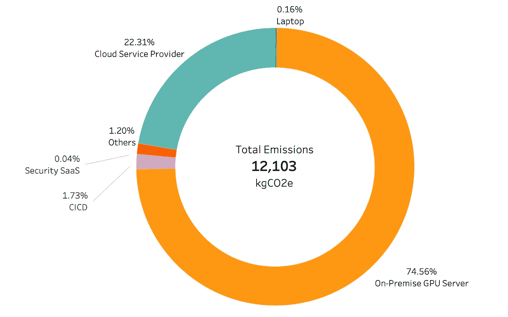
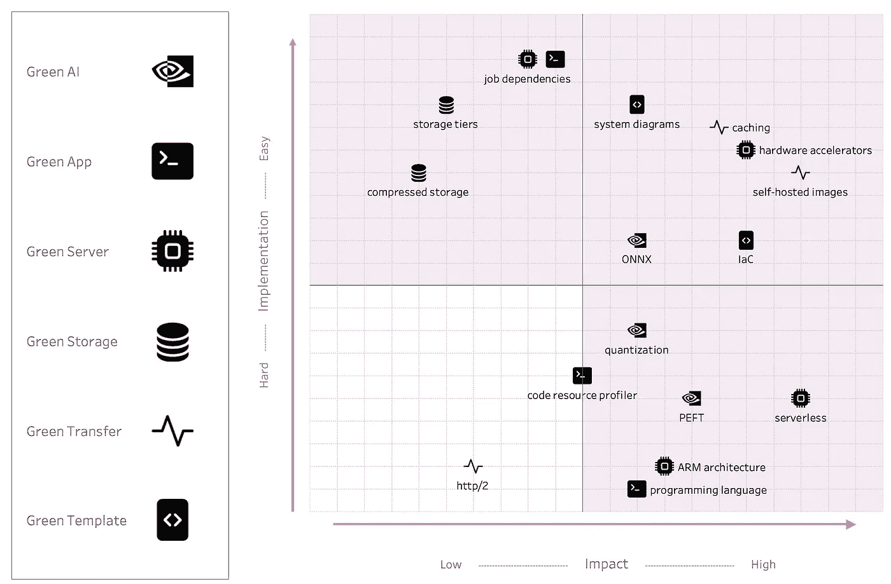
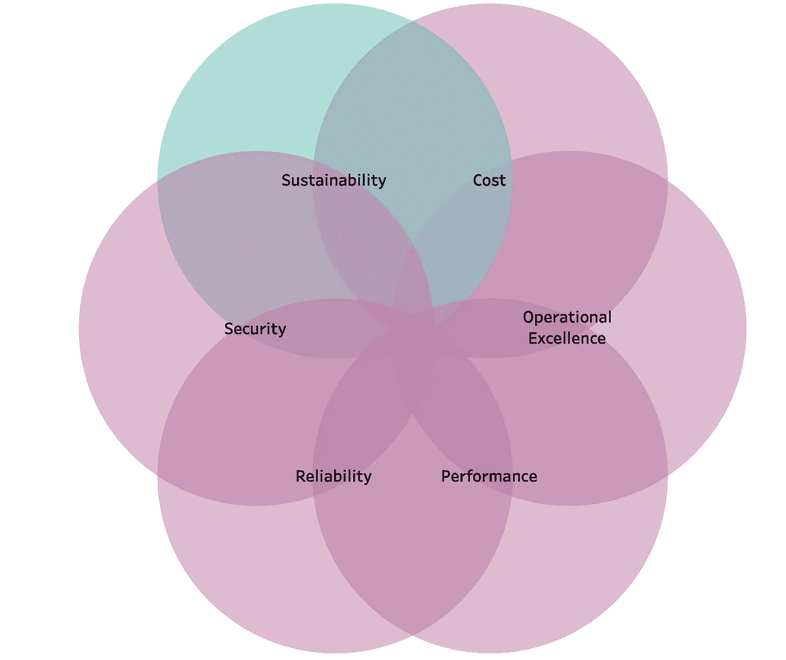

# 一个机器学习工程团队的碳排放

> 原文：[`towardsdatascience.com/carbon-emissions-of-an-ml-engineering-team-ce170bd4fae9`](https://towardsdatascience.com/carbon-emissions-of-an-ml-engineering-team-ce170bd4fae9)

## 开发的隐性成本

 [Jake Teo](https://medium.com/@teosiyang?source=post_page-----ce170bd4fae9--------------------------------)

·发表于[Towards Data Science](https://towardsdatascience.com/?source=post_page-----ce170bd4fae9--------------------------------) ·9 分钟阅读·2023 年 10 月 16 日

--

由于人为活动导致的全球变暖，大家都意识到了气候危机。为了防止其灾难性后果[1]，世界需要大幅减少我们的温室气体排放，许多国家设定了到 2050 年实现净零排放的目标。

近年来 AI 技术的蓬勃发展也引发了对其环境成本的担忧。如果我们仅仅关注其直接贡献，这将通过电力使用来训练和驱动模型。例如，训练具有 1750 亿参数的 ChatGPT-3 产生了高达 502 吨的碳当量排放（tCO2e）[2]。新兴的 Llama2 在训练其四个模型时产生了类似的 539 吨 tCO2e[3]。作为对比，每一个模型的排放量相当于一名乘客从纽约到旧金山单程飞行 500 次的排放量。

我在一个机器学习工程团队工作，这个问题也时常困扰着我。我们通过电力消耗贡献了多少碳排放？是否有减少的方法？于是，我们开始首次尝试进行碳排放核算。

图片由[Chris LeBoutillier](https://unsplash.com/@chrisleboutillier?utm_source=medium&utm_medium=referral)提供，来自[Unsplash](https://unsplash.com/?utm_source=medium&utm_medium=referral)

# **方法**

没有单一直接的方法来测量我们的电力消耗以及随之而来的碳影响。这是因为我们使用的平台和服务多种多样。我不会深入探讨技术实现，但从高层次来看，方法包括三种。

1.  **提供**：确切的碳排放数据已经为我们计算好了。这是我们的云服务提供商（CSP）提供的。

1.  **工具**：我们使用了像 Powermetics、Nvidia-SMI 和 Turbostat 这样的几种软件工具来测量功率（瓦特），这些工具跟踪我们笔记本电脑和本地服务器的 CPU 和 GPU 计算。

1.  **自我计算**：当上述方法不可行时，我们使用代理方法进行计算。这包括记录计算的持续时间，估计芯片的利用率百分比，以及查找每种芯片类型的热设计功率（TDP）来计算功耗。其余平台以这种方式计算。

对于后两种方法，功率会被转换为能量（千瓦时），如果有的话，会使用支持数据中心的电力使用效率（PUE）来获得更准确的能量消耗。最后，使用该国或地区的电网排放因子（kgCO2e/kWh）来计算温室气体排放。

# **结果与思考**

结果显示在下面的饼图中。

我们使用的每个平台的碳排放量 extrapolated 为整个 2023 年。图像由作者提供。

在碳排放排名方面，平台的排名并不特别令人惊讶，但我对百分比感到惊讶。我没有想到我们的开发笔记本电脑和 CICD 服务在非常重的使用下只产生了微量的碳。与此同时，我也没想到我们的本地开发和模型训练服务器会消耗比我们的云服务多三倍的碳。

回顾过去，我们最近将笔记本电脑升级到了最新的 Apple Silicon M2 芯片，这一芯片以高效著称。我们的 CICD 平台虽然拥有数千分钟的流水线运行时间，但使用的是最低计算芯片，实际上是无服务器的，仅在必要时运行。

对于我们的本地服务器，我们发现空闲的 Nvidia GPU 芯片仍然消耗大量电力，导致电力消耗膨胀。我们需要调查是否存在任何配置错误，如果没有，是否有更好的管理方法。

# **绿色计算**

现在我们对碳排放的认识有了更好的了解，我们如何才能真正改变开发团队，采用更多绿色解决方案呢？

绿色计算这个术语已经存在了一段时间，并且已被组织或分类成不同的形式，但我认为下面这六个广泛的主题将帮助我的团队更清晰地管理绿色转型。

由 [Ash from Modern Afflatus](https://unsplash.com/@modernafflatusphotography?utm_source=medium&utm_medium=referral) 提供的照片，来源于 [Unsplash](https://unsplash.com/?utm_source=medium&utm_medium=referral)

## **1\. 绿色 AI**

这指的是寻找**更高效地训练和推断模型以尽量减少质量损失**的方法。它基本上意味着更快的训练和推断时间，以及更小的模型尺寸，使用更少的计算能力。使用更复杂的神经网络需要越来越大的数据集以及日益先进、昂贵且耗能巨大的 GPU 芯片。

幸运的是，这也是最新优化研究的热点。在过去几年中，我听说我的数据科学家同事们在各个领域使用更高效的架构、迁移学习、量化或知识蒸馏等压缩技术、[ONNX](https://onnx.ai)、使用[deepspeed](https://github.com/microsoft/DeepSpeed)、[PEFT](https://github.com/huggingface/peft)等，以应对当今大语言模型时代的挑战。毫无疑问，我们需要跟上开源世界最新实施的步伐，因为它们的好处已被证明是显著的。

## **2\. 绿色应用**

模型在没有周围代码来处理数据、训练模型和**最终提供服务**的情况下是无用的。需要对**时间和空间复杂性**、实现的算法以及各种预构建函数有基本的理解。还应使用性能分析工具来查找延迟和内存中的瓶颈。

另一个构建绿色应用程序的重要软件工程技能是理解**任务和进程的管理、执行和协调**。这需要对并行性、并发性、异步性、多处理和线程、队列、I/O 和 CPU 限制任务等概念有扎实的掌握。

更进一步，**编程语言**的选择也很重要。由于其广泛的支持和易用性，Python 已成为数据科学和通用编程中使用的顶级语言之一。然而，作为一种解释性语言，与其编译语言如 Go 相比，在能耗和速度（约 x20）方面显著逊色[4]。因此，值得花费时间学习另一种编译语言，以应对需要大量处理的工作。

## **3\. 绿色服务器**

训练和服务机器学习应用需要计算能力。这由托管在本地或云端的服务器提供。如果可能的话，使用云服务是保持绿色的最佳方式，因为云服务提供商有动力高效运行其数据中心，而且你可以根据项目需求灵活切换资源。无论如何，我们应确保两个关键因素：选择**正确的硬件**来完成任务，以及**仅在需要时使用计算资源**。

主要的 CSP 都提供了多样的服务器供选择。例如，AWS 有七个实例家族，每个家族包含不同的芯片、内存和其他规格，足以满足各种需求，如 GPU、CPU、内存密集型过程，甚至 ARM 或 x86 架构。我们应选择那些最佳匹配我们的用例的服务器，以便通过其硬件规格高效分配计算资源。

我们如何在需要时才计算？首先，对所有不使用的资源进行盘点并关闭。你会惊讶于遗留项目中还有多少闲置的服务。在架构设计方面，我们可以选择使用类似 AWS lambda 的无服务器计算，它只有在有流量时才使用资源，或者提供一个基本的长生命周期计算，具有水平扩展功能，可以自动响应负载增加。

## **4\. 绿色存储**

存储有多种形式，如对象存储、块存储和文件存储、容器注册表和数据库。我们可以使用两个一般性的指南来高效管理存储：**减少存储大小**和**选择合适的存储类型**。

数据的存储大小可以通过压缩来减少，一些常见的压缩工具包括 [gzip](https://www.gnu.org/software/gzip/) 或用于归档的 `tar.gz`，它可以将大小减少一半。使用更高效的数据结构也可以是一个更好的替代方案。使用像 parquet 这样的列式格式不仅占用空间更少（>50%），而且由于其列式结构的特性，也使查询速度更快（提高 30 倍）。

以对象存储为例，有一些存储类别使用更少的能源。在 AWS S3 中，我们可以选择将不太重要的数据保留在一个区域，而不是在多个区域中复制。对于不经常访问的长期存储，我们可以将其放入“冷存储”（S3 glacier），那里使用的磁带驱动器相比 SSD 和 HDD 消耗更少的能源。还可以设置生命周期策略来自动在存储类别之间转换，甚至在项目结束时删除数据。

## **5\. 绿色传输**

数据需要在服务器、存储和其他设备之间来回传输。网络通信也需要能源，以支持复杂的网络设备、数据中心、传输基础设施和终端用户设备。对于我们这样的开发者，我们可以通过使用**高效的传输协议**以及**减少传输的频率和距离**来降低碳足迹。

在可能的情况下，应考虑使用 http/2 传输协议和 gRCP 框架，因为它可以以更紧凑的二进制格式传输，而不是传统的文本（JSON）有效载荷的 http/1。这样可以降低延迟和能源消耗。

将数据更靠近使用源，并安排它们的传输时间，也可以减少所需的能量。例如，运行自动化测试用例所需的依赖项可以缓存，并且仅在检测到新更改时才重新构建。镜像不需要每次都从 Dockerhub 拉取；我们可以将它们存储在我们的 CSP 注册表中，并在有新补丁时定期更新。

## **6\. 绿色模板**

这指的是**高效代码、基础设施和流程的可重用性和可重复性**。本质上，这是一种间接减少电力消耗的方式，因为实际实现来自前五个主题。然而，我认为这是最重要的一点，因为它是团队知识的总和。

这可以以文档或剧本的形式出现，设定团队职能和项目执行的标准，或为仓库、CICD 流水线、基础设施设置（例如 Terraform）和配置（例如 Ansible）提供现成模板。

决策象限以优先考虑高影响力和易于实施的解决方案。图片来自作者。

在这六个主题中的每一个，我都给出了一些示例，但这仅仅是冰山一角。在每个主题中实施的建议众多且令人望而生畏。然而，通过将每个建议放在决策象限中，估算它们在现有工作流程中的实施难度，以及它们的影响是否显著和协同，可以实现渐进式过渡。这将提供一些关于优先考虑哪些建议的指导。

# **设计原则**

这种转变既不直接也不容易。即便是像我们这样热衷于可持续发展的开发者，也必须优先考虑业务需求。我们可以通过**不把可持续性和碳效率在机器学习开发中视为与其他需求对立或相互排斥的概念**来应对这一挑战。这将确保你仍然与业务目标保持一致，同时也能更容易获得管理层的支持，他们总是面临着交付的压力。

我们可以将其可视化为一个维恩图，使用 AWS 的六个设计支柱来构建其[架构良好框架](https://aws.amazon.com/architecture/well-architected/?wa-lens-whitepapers.sort-by=item.additionalFields.sortDate&wa-lens-whitepapers.sort-order=desc&wa-guidance-whitepapers.sort-by=item.additionalFields.sortDate&wa-guidance-whitepapers.sort-order=desc)，其中功能或业务需求与可持续性重叠。

重新构想架构良好框架。图片来自作者。

事实上，如果你仔细思考，通常会发现协同影响。让我们来看一些例子：

+   压缩数据存储可以减少 x2 大小，从而节省成本和带宽，同时也减少了存储和传输所需的能量。

+   神经网络模型的量化在推理速度方面表现更好，从而消耗更少的能量。

+   移除 Docker 镜像中的未使用依赖项将通过减少潜在的可利用表面积来提高安全性，增加由于镜像体积较小而导致的部署速度，并减少存储和传输到及从你的注册中心所需的能量。

# 结论

总的来说，这为我们工程团队减少碳足迹的旅程提供了一个良好的开端。接下来还会有大量的工作需要识别、量化、标准化和教育每个绿色计算主题下的推荐措施。

我希望听到你在测量和减少开发团队碳足迹方面的旅程。请在下面的评论中分享！

***致谢***：这次碳核算尝试是我与我的同行* [*杨可文*](https://medium.com/u/a874892260e0?source=post_page-----ce170bd4fae9--------------------------------) *和* [*钟耀威*](https://medium.com/u/13e5c1d5b037?source=post_page-----ce170bd4fae9--------------------------------)* 一起完成的个人项目。*

***免责声明***：这里表达的意见和建议仅代表作者个人观点。*

# 参考文献

+   [1] 联合国环境规划署. 关于气候紧急情况的事实. [`www.unep.org/facts-about-climate-emergency`](https://www.unep.org/facts-about-climate-emergency)

+   [2] 斯坦福大学. 人工智能指数报告 2023. 第二章，技术性能. [`aiindex.stanford.edu/report/`](https://aiindex.stanford.edu/report/)

+   [3] Touvron 等. 2023. Llama 2: 开放基础与微调聊天模型. *arXiv:2307.09288\.* [`browse.arxiv.org/pdf/2307.09288.pdf`](https://browse.arxiv.org/pdf/2307.09288.pdf)

+   [4] Pereira 等. 2017. 编程语言的能源效率：能源、时间和内存如何相关？*第 10 届 ACM SIGPLAN 国际软件语言工程会议论文集*. 第 256–267 页。
