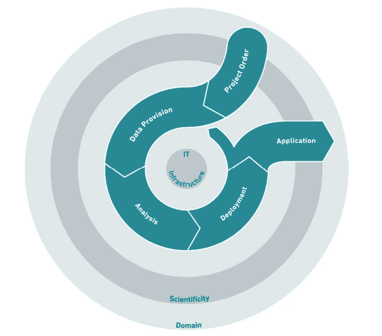
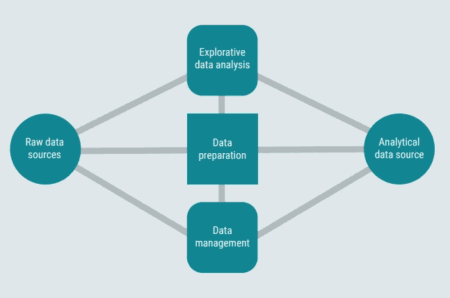

# 案例研究：将数据科学过程模型应用于实际场景

> 原文：[`towardsdatascience.com/case-study-applying-a-data-science-process-model-to-a-real-world-scenario-93ae57b682bf?source=collection_archive---------1-----------------------#2023-03-11`](https://towardsdatascience.com/case-study-applying-a-data-science-process-model-to-a-real-world-scenario-93ae57b682bf?source=collection_archive---------1-----------------------#2023-03-11)

## 供应链中材料规划的机器学习模型开发

 [Jonas Dieckmann](https://medium.com/@jonas_dieckmann?source=post_page-----93ae57b682bf--------------------------------)

·

[关注](https://medium.com/m/signin?actionUrl=https%3A%2F%2Fmedium.com%2F_%2Fsubscribe%2Fuser%2F1c8d1cf684f2&operation=register&redirect=https%3A%2F%2Ftowardsdatascience.com%2Fcase-study-applying-a-data-science-process-model-to-a-real-world-scenario-93ae57b682bf&user=Jonas+Dieckmann&userId=1c8d1cf684f2&source=post_page-1c8d1cf684f2----93ae57b682bf---------------------post_header-----------) 发表在 [Towards Data Science](https://towardsdatascience.com/?source=post_page-----93ae57b682bf--------------------------------) ·16 分钟阅读·2023 年 3 月 11 日

--

在当今快速变化的环境中，公司面临的一个最关键的挑战是准确预测未来需求。这对于供应链团队尤其重要，准确的需求规划对于保持客户满意度和控制成本至关重要。

在这个**案例研究**中，我们将探讨**数据科学过程模型**如何通过利用统计预测方法，帮助公司实际解决这一挑战。虚拟公司的目标是开发一个更准确的需求规划过程，以减少缺货，提高库存周转率，并改善整体供应链表现。

图片由[Unsplash](https://unsplash.com/)提供

本项目是数据科学如何通过揭示新见解、提高效率和改善决策来改变业务的强大示例。我希望这个案例研究能帮助你考虑在组织中潜在的应用，并展示如何成功应用过程模型 DASC-PM。

> *请注意，整篇文章也已在以下出版物中发布，作者为* ***丹尼尔·巴杜拉*** *和* ***乔纳斯·迪克曼***：
> 
> **第三章：“**供应链中材料规划的机器学习模型开发”**，见：**施尔茨等（2023）：** *DASC-PM v1.1 案例研究*。可从：[`www.researchgate.net/publication/368661660_DASC-PM_v11_Case_Studies`](https://www.researchgate.net/publication/368661660_DASC-PM_v11_Case_Studies)获取

# 1. 领域和项目描述

SCHRAMME AG 是一家领先的敷料、创可贴和绷带供应商。管理层认为在材料规划及其产生的生产过程中存在定性优化潜力和节省机会。管理层指派了一名内部项目经理开发一个基于机器学习的模型，以规划供应链中的材料和需求。由于之前的数据科学项目中的负面经验，建议初期应使用过程模型来开发此项目。

选择[DASC-PM](https://medium.com/towards-data-science/dasc-pm-a-novel-process-model-for-data-science-projects-9f872f2534b1)以确保项目管理的结构化和科学化过程。为了获得项目任务的概述，项目经理最初制定了各种用例，然后检查其适用性和可行性。适用的用例将作为确定具体问题和设计项目的基础。随后，这一设计将再次检查其适用性和可行性。

图片由[Unsplash](https://unsplash.com/)提供

## 起始点和用例开发

目前，公司手动规划并生产超过 2500 种不同的产品。在过去几个季度，公司在一些产品系列中越来越频繁地出现库存短缺，而个别产品的库存则超过了储存能力。尽管控制部门抱怨由于不精确的规划导致库存成本上升，需求规划师却感叹规划时间不足。供应链负责人已经批评规划完全依赖人工，未能充分利用数字化的机会。

**项目目标**

该项目的一个目标是开发一个机器学习模型，未来应根据各种影响因素自动规划大量产品需求。需求规划师应逐渐关注重要产品组和广告的规划。系统应考虑季节性、趋势和市场发展，达到 75%的规划准确度。这意味着每种产品的预测数量与实际需求的偏差不应超过 25%。订单历史、库存和客户销售数据，以及内部广告计划应作为潜在的数据来源。

阶段 1: 项目订单（Schulz et al. 2022）

**当前团队设置**

除了供应链部门的参与外，还期望与销售和 IT 部门进行紧密合作。供应链部门的规划团队现在包括一个全球市场需求规划团队，负责根据市场发展、产品生命周期和战略重点进行长期规划（6-18 个月）。在个别市场中，还有地方客户需求规划团队，通过相应的销售渠道为零售实施短期物料和广告规划（0-6 个月）。

需要开发的数据科学模型应支持每月的规划周期，并量化短期和长期物料的需求。预测结果随后被加载到内部规划软件中，并应进行分析，如有必要，进行补充或修正。最终的规划数量将由工厂用于生产规划。为了考虑客户和产品的专业知识、季节性和过往经验，规划团队的个别成员应被纳入项目中，分配最多 20%的工作时间参与其中。

**适用性检查**

在用例选择过程中，一个重要的部分方面是适用性测试。项目经理试图检验项目是否从根本上可以被分类为可行，以及是否可以利用现有资源执行这些要求。专家访谈表明，该问题总体上非常适合数据科学的应用，并且类似的项目已经在外部进行并发布。数据科学团队确认有足够数量的潜在适用方法用于该项目，并且所需的数据源也可用。

最后，项目经理分析可行性。需要与 IT 部门协调，检查可用的基础设施和相关员工的专业知识。微软提供的云基础设施和数据科学团队对 Databricks 软件的经验使得项目看起来在基础上是可行的。由于计划者在实施阶段担任主要控制者，结果会被检查，因此项目风险总体上被分类为中等。

数据科学过程模型 DASC-PM（Schulz 等，2022）

## 项目设计

根据问题和领域的具体方面，项目经理、供应链负责人以及数据科学家现在负责正式设计该项目。

项目的目标被认为是提高计划准确性和减少人工流程，并且与开发适当的项目模型的目标相关。根据初步估算，成本框架总计为 EUR 650,000。建议开发时间框架为六个月，额外计划六个月用于过程整合。

由于与许多其他项目相比，在数据科学背景下通常无法进行全面规划和项目过程描述，项目经理仅为该过程准备了一个项目概要，其中包含前述部分已指明的基本要素。预算包括 1 名全职项目经理、2 名全职数据科学家和 0.5 名全职数据工程师的财政资源。如前所述，需求规划师应分配大约 20%的工作时间来分享他们的专业知识和经验。

整个项目应采用敏捷工作方法，并基于 Scrum 方法论的 DASC-PM 阶段进行处理。工作在数据获取、分析、利用和使用等领域以迭代方式进行，每个阶段都将前一阶段和后一阶段作为重点。如果在关键领域发现差距或问题，并且只能通过回到前一个阶段来解决，则回溯步骤尤为重要。项目概要以可视化的方式准备，并放置在 SCHRAMME AG 办公室中所有参与者都能看到的位置。然后，整个项目描述会再次检查其适用性和可行性，直到过程进入下一阶段。

# 2. 数据提供

## 数据准备

SCHRAMME AG 拥有多个可以纳入自动规划的数据源。除了 ERP 系统中的历史销售数据外，还可以选择来自 CRM 系统的订单历史和客户数据，以及库存和营销措施。Azure Data Factory 被用来准备一个基于云的数据管道，加载、转换和集成来自各种源系统的数据。自动预测的主要基础应该是订单历史：其余数据要么作为规划团队的背景信息使用，要么在需要时进行集群分析。在项目的初始阶段，各个数据源在质量和结构上仍存在较大差异。因此，与 IT 和技术部门一起进行调整，以便在后续阶段能够在坚实的基础上进行预测。

ELT 数据准备过程用于分析。图像由作者提供

## 数据管理

数据管理过程由数据工程师自动化，并根据每日计划进行，以始终保持最新状态。为了保持复杂度在合理范围内，最有前景的数据源会首先进行处理，随后通过持续集成/持续部署（CI/CD）逐步扩展数据管道。部署后，处理过的数据会存储在 Azure Data Lake Storage 中，供未来使用 Azure Databricks 进行分析。DataLake 还存储准备好的数据和分析结果的备份，以及其他数据如协议、质量指标和凭证结构。写入和读取授权以及计划版本也确保只能处理最新的规划周期，使得过去的值不再发生变化。

阶段 2：数据提供（Schulz 等，2022）

## 探索性数据分析

数据准备中的一个重要步骤是探索性数据分析（EDA），在这个步骤中会生成各种统计数据和可视化图表。结果展示了数据中的分布、离群值和相关性。EDA 的结果提供了下一阶段分析中需要考虑的特征的见解。在第二步中，使用特征选择和特征工程来选择相关特征或生成新特征。对于高维数据，应用主成分分析等降维方法。EDA 提供了关于 SCHRAMMEAG 现有需求历史的信息。

探索性数据分析的结果示例。图片由作者提供

# 3. 分析

## 识别合适的分析方法

项目开始时的可行性测试明确了该项目可以并应该使用数据科学方法解决。最初参与的两名数据科学员工提供了适合现有问题的现有方法概述。这个现有问题属于监督学习算法中的回归问题类别。从根本上讲，这是一种时间序列分析类型，可以通过额外因素或多重回归进行扩展。

在科学性关键领域的背景下，考察了对比问题的最新研究进展。这显示出 XGBoost、ARIMA、FacebookProphet 和 LightGBM 是该问题类别中经常提到的方法。一名数据科学家记录了每种方法的相应优缺点，并根据复杂性和计算强度对其进行排序。为了获得关于 SCHRAMME AG 产品模型能力的初步指示，项目组初步选择了更简单的模型，然后采用了经典的指数平滑和 ARIMA 模型系列。

第三阶段：分析（Schulz 等人 2022）

## 分析方法的应用

由于该项目涉及多个用户参与分析过程，团队最初依赖于 Databricks 中的合适笔记本开发环境。按照典型的机器学习工作流程，首先实现了导入和数据清洗的代码。为了确保有效性，最终通过交叉验证将基础数据集划分为训练、验证和测试数据。然后，将选定的方法应用于训练和验证数据集，以优化模型。在此过程中，还反复尝试优化处理参数，并在必要时合理减少可用维度。SCHRAMME AG 的数据科学家记录了各个运行的执行和验证结果。尽管 ARIMA 系列模型在相对指数平滑方面表现出更好的性能，但目前得到的 62.4%的目标准确性仍未达到 75%。RMSE 和 MAPE 指标也显示出优化的潜力。

ARIMA 预测与实际需求的对比。图片作者提供

参数配置和选择最终模型的基础在第一次应用迭代后被记录并以技术上可理解的方式为项目经理和供应链负责人准备。特别观察到的是，一些产品组具有非常不寻常的季节性，某些产品总体上非常难以预测。即使 SCHRAMME AG 的产品组合由于冠状病毒大流行期间的临时关闭（封锁）受到的影响较小，但仍观察到调味品产品的需求略有下降。假设活动和运输减少，以及事故和伤害减少是导致这一下降的原因。

趋势可以在使用的分析方法中建模得相当好。为了提高目标准确性，在另一个实验中使用了技术上更复杂的方法，这些方法在识别合适方法的过程中证明是相关和适用的。在进行了一些参数优化和交叉验证迭代后，Prophet 和 XGBoost 方法分别展示了 73.4%和 65.8%的最高验证结果。

数据科学家认为 Prophet 是应用过程中最合适的方法，并根据测试时间序列确定规划准确性。即使准确性略低于目标值 73.4%，仍然取得了显著的规划准确性改进。MAPE 为 16.64%，RMSE 为 8,130，这表明与 XGBoost 方法中的 RMSE（10,134）相比，绝对偏差较小。然而，与第一次实验类似，仍然存在一些非常难以整体预测的产品组（37.2%），对累计准确性产生了负面影响。

各种方法的性能比较。作者图像

## 评估

分析结果作为供应链负责人和分析师逻辑评估和分类的基础，由项目经理组织和主持。采用的评估指标是所有预先定义产品的累积计划准确性以及常用的 RMSE 和 MAPE 指标。部门需要一个现实、可追踪和可靠的基础来确定产品级别的需求。

三个最佳模型的评估。作者图像

计划准确性的基准假设为过去两年中（手动计划的）中位准确率 58%。结果的评估显示，通过使用数据科学模型，许多产品组整体上可以以较高的准确性进行规划，并大大超过了基准。然而，也有一些产品组在手动规划方面表现出类似的准确性。尤其需要讨论的是排水领域，该领域使用模型的结果远差于手动规划，似乎不适合使用目前的方法进行统计需求计算。

最佳模型的评估，按产品组分布。作者图像

从技术角度来看，供应链负责人认为由于特定的季节性和趋势性特征，仅能实现有限的计划准确性，因此对这些产品组进行统计规划没有多大意义。她建议引入一个产品基础上的误差阈值，以确定哪些产品应通过模型进行预测，哪些产品组将从建模中剔除并仍由人工计划。略低于当前基准的范围似乎是一个合适的阈值，因为从部门的角度来看，较少的人工干预能带来几乎相同的准确性，这总是朝着实现项目目标的方向上的一种改进。项目负责人记录了评估结果以及所采取的决策和措施。

经过首次实际建模后，所有选择的产品在接下来的 18 个月所需的数量可以作为分析结果进行记录。现在可以将其利用并整合到团队的规划过程中。

# 4\. 部署

团队现在进入 DASC-PM 的整合利用阶段。

第 4 阶段：部署（Schulz 等人 2022）

## 技术方法准备

可以依赖现有基础设施进行利用。预测数据被加载到规划软件 IBM Planning Analytics 中，在那里进行测试和重新处理。所谓的 TurboIntegrator 被用来自动化加载过程，这是 IBM Planning Analytics 的一个核心组件。Planning Analytics 的 OLAP 结构允许创建灵活的视图，用户可以选择他们的上下文（时间参考、产品组等）并实时调整计算。此外，报告软件 QlikSense 也被集成用于更深入的分析。在这里，一方面可以可视化时间序列的组件（趋势、季节性、噪声），另一方面可以显示诸如异常值和中位数等附加信息。处理后的最终计划会被加载到数据湖中，以便未来参考。

## 确保技术可行性

预测本身会在每月初自动重新生成。规划人员可以在月初的前四个工作日内进行修正，并实时查看规划系统中的结果。由于算法在云环境中运行，计算能力可以根据需要进行扩展。为了使所有过程自动运行，应尽量减少数据源的变化。如果需要调整，数据工程师将会被通知，并通过记录所有数据源和连接的信息来更新接口文档。规划和预测系统是云（Microsoft Azure）和本地系统（Planning Analytics）的混合体，规划人员仅对本地结构拥有主动访问权限。这里授予凭证，使本地规划人员仅能访问他们的区域，而全球规划人员可以查看所有主题。开发阶段结束后，支持服务主要由 IT 部门处理。在复杂问题的情况下，还会咨询数据科学家或数据工程师。

图片来自 [Unsplash](https://unsplash.com/)

## 确保适用性

解决方案的用户包括本地和全球规划团队。由于团队成员技术背景较少，举办培训课程帮助他们解读预测结果并评估其质量。用户界面也以清晰和易懂为设计重点。使用简单的折线图和条形图来展示过程和基准，同时表格内容精简到最重要的信息。用户从一开始就参与开发，以确保技术的正确性和相关性，并在开发阶段结束前熟悉解决方案。此外，还会编写完整的文档。文档的技术部分主要基于接口文档，展示数据结构和连接，而内容部分则与用户共同准备。

## 技术准备

为了确保新解决方案在几个月后不会失去相关性或质量，尽管投入的时间大幅减少，工作仍继续进行改进。持续改进中最重要的方面是不断自动调整预测模型以适应新数据。系统中在开始时仍需手动处理的其他部分也会随着时间的推移实现自动化。规划人员可以在 Planning Analytics 中调整诸如预测范围或预测准确度阈值等参数，模型保持灵活。发布首个版本后出现的问题通过 IT 票务系统记录，并分配给数据科学领域。定期检查模型是否仍满足公司的期望，是否需要进行更改。

# 5\. （应用）使用和总结

第 5 阶段：应用（Schulz 等，2022 年）

过渡到使用开发的模型意味着数据科学过程模型（DASC-PM）进入其最后阶段。SCHRAMME AG 通过使用结构化和整体的方法，在供应链领域实现了其设定的目标。现在可以从中衍生出额外或新的项目。规划过程大部分已实现自动化，并得到机器学习算法的支持。管理、财务和供应链中的相关利益相关者对结果感到非常满意。经过最初的怀疑，规划团队现在也对工作负担的减少和可能的优先排序感到信服。然而，也可以预见在使用过程中会出现弱点，并且在后续阶段可能需要更多的迭代。

> 整体案例研究表明，特别是非线性过程模型在数据科学领域具有优势。DASC-PM 是一种适用于转移到许多其他领域和问题的合适新型过程。

## 结论

总结来说，数据科学在解决复杂业务问题中扮演着不可或缺的角色，通过识别隐藏的模式并从数据中提取可操作的见解。通过这个案例研究，我们展示了如何利用数据科学技术开发预测模型，帮助企业做出明智的决策，例如在供应链中。

虽然这个案例研究侧重于需求规划，但该过程模型可以用于多种方式，例如在电子商务网站上构建个性化推荐、识别金融交易中的欺诈行为或预测电信或订阅型业务中的客户流失。

然而，必须注意的是，现实世界的数据科学项目面临多个挑战，如数据质量问题、缺乏领域专业知识和利益相关者之间的沟通不畅。相比之下，虚构的案例研究提供了一个理想化的环境，拥有干净、标记良好的数据和明确定义的问题陈述。因此，现实世界的项目需要一种务实的方法，考虑到业务目标、数据质量、计算资源和伦理问题。我相信你从自己的经验中知道这一点。不要低估现实！

总之，数据科学具有巨大的潜力来改变行业、社会，并为企业创造新的机会。DASC-DM（或任何）过程模型可以帮助合理地构建方法，以确保对业务利益相关者和项目团队本身的明确指导。

请告诉我你在数据科学项目中的经验。你如何构建这些项目？最大的挑战是什么？欢迎留言！

图片由[Unsplash](https://unsplash.com/)提供

 [## Jonas Dieckmann - Medium

### 阅读 Jonas Dieckmann 在 Medium 上的文章。分析经理和产品负责人@Philips | 对…充满热情并撰写相关内容

medium.com](https://medium.com/@jonas_dieckmann?source=post_page-----93ae57b682bf--------------------------------)

希望你觉得这有用。告诉我你的想法！同时欢迎在[LinkedIn](https://www.linkedin.com/in/jonas-dieckmann/)上连接我，或在 Medium 上关注我。

# 另见我的其他文章：

 ## 人工智能中的伦理：偏见算法的潜在根源

### 理解数据偏见的另一种方法

[towardsdatascience.com  ## DASC-PM：数据科学项目的新型过程模型

### 或：如何正确地构建下一个数据科学项目

[towardsdatascience.com

# 参考文献

*整个案例研究已发布于：*

[1] **Schulz et al. (2023):** “*DASC-PM v1.1 案例研究*” 可从：[`www.researchgate.net/publication/368661660_DASC-PM_v11_Case_Studies`](https://www.researchgate.net/publication/368661660_DASC-PM_v11_Case_Studies) 获取

*过程图像取自：*

[2] **Schulz et al. (2022):** *“*[DASC-PM v1.1 — 数据科学项目的过程模型](https://www.researchgate.net/publication/361428426_DASC-PM_v11_-_A_Process_Model_for_Data_Science_Projects)”*（2022），出版商：NORDAKADEMIE gAG Hochschule der Wirtschaft，ISBN：978–3–00–064898–4，DOI：[10.25673/32872.2](http://dx.doi.org/10.25673/32872.2)
