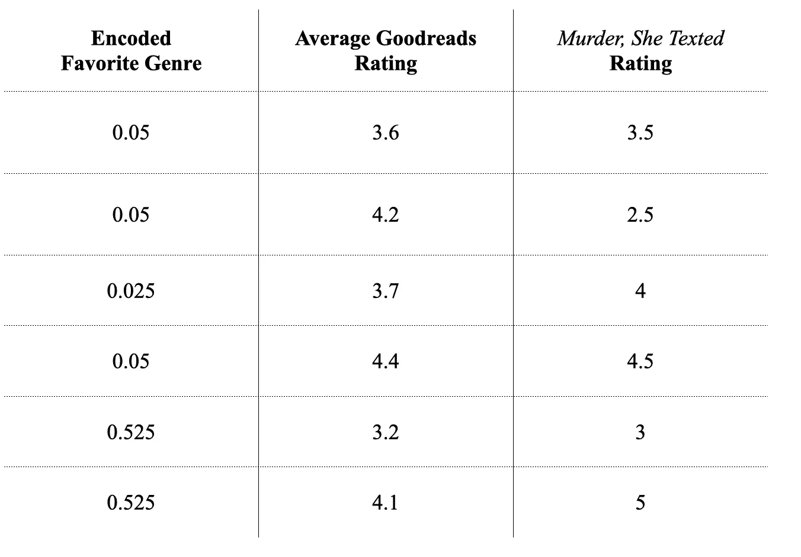
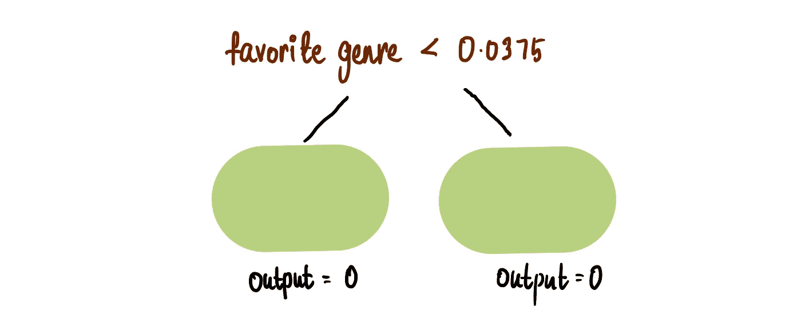

# CatBoost 回归：为我详细讲解一下

> 原文：[`towardsdatascience.com/catboost-regression-break-it-down-for-me-16ed8c6c1eca`](https://towardsdatascience.com/catboost-regression-break-it-down-for-me-16ed8c6c1eca)

## CatBoost 内部工作原理的全面（并且有插图）解析

 [Shreya Rao](https://medium.com/@shreya.rao?source=post_page-----16ed8c6c1eca--------------------------------)

·发表于 [Towards Data Science](https://towardsdatascience.com/?source=post_page-----16ed8c6c1eca--------------------------------) ·阅读时间 14 分钟·2023 年 9 月 2 日

--

CatBoost，代表类别增强，是一种强大的机器学习算法，在处理类别特征和产生准确预测方面表现出色。传统上，处理类别数据是相当棘手的——需要使用独热编码、标签编码或其他一些可能扭曲数据固有结构的预处理技术。为了解决这个问题，CatBoost 使用了其内置的编码系统，称为 **有序目标编码**。

让我们通过构建一个模型来预测某人如何给书籍 *Murder, She Texted* 打分，基于他们在 [Goodreads](https://www.goodreads.com/) 上的平均书籍评分和他们的最爱类别，来看看 CatBoost 在实践中是如何工作的。

我们让 6 个人对 *Murder, She Texted* 进行评分，并收集了关于他们的其他相关信息。

这是我们当前的训练数据集，我们将用它来训练（显而易见）数据。

## 第 1 步：随机打乱数据集并使用 **有序目标编码** 对类别数据进行编码

我们处理类别数据的方式对 CatBoost 算法至关重要。在这种情况下，我们只有一个类别列 — *Favorite Genre*。这个列被编码（即转换为离散整数），具体的编码方式取决于这是回归问题还是分类问题。由于我们处理的是回归问题（因为我们想预测的变量 *Murder, She Texted Rating* 是连续的），我们按照以下步骤进行。

1 — 随机打乱数据集：

2 — 将连续目标变量分成离散的 **桶**：由于我们这里的数据非常少，我们将创建两个相同大小的桶来对目标进行分类。（了解更多关于如何创建桶的内容，请参见 [这里](https://catboost.ai/en/docs/concepts/quantization#quantization)）。

我们将*Murder, She Texted Rating*的 3 个最小值放入桶 0，其余的放入桶 1。

3 — 使用公式对分类列进行编码：Ordered Target Encoding 假设它一次接收一行数据，并使用此公式对*最喜欢的类型*进行编码：

+   curCount = 我们之前见过的拥有相同*最喜欢的类型*且在*评分桶*1 中的人数

+   prior = 用户定义的常数值；在我们的例子中设置为 0.05

+   maxCount = 我们之前见过的拥有相同*最喜欢的类型*的人数

> 注意：如果我们有更多数据，我们将有更多的桶。我们使用不同的公式来编码分类数据。阅读更多[这里](https://catboost.ai/en/docs/concepts/algorithm-main-stages_cat-to-numberic)。

使用这个公式，让我们对第一行进行编码。由于这是第一行，我们假设之前没有数据，这一行是我们唯一的信息。

这里：

+   curCount = 我们之前见过的在*评分桶*1 中且*最喜欢的类型*为神秘的人的数量 = 0

+   maxCount = 我们见过的*最喜欢的类型*为神秘的人的数量 = 0

因此，第一行中神秘的编码值是 0.05。

现在对于第二行，我们假设唯一的数据是前两行。

+   curCount = 我们之前见过的在*评分桶*1 中且*最喜欢的类型*为浪漫的人的数量 = 0

+   maxCount = 我们见过的*最喜欢的类型*为浪漫的人的数量 = 0

与第一行类似，第二行的编码值是 0.05。

对于第三行：

+   curCount = 我们之前见过的在评分桶 1 中且*最喜欢的类型*为神秘的人的数量 = 0

+   maxCount = 我们见过的*最喜欢的类型*为神秘的人的数量 = 1

类似地，如果我们对剩余的行进行此编码，我们得到：

就是这样，我们对分类变量进行编码。

> *现在我们可以忽略*最喜欢的类型*并* *仅考虑*编码后的最喜欢的类型*。

## 步骤 2：进行初步预测并计算残差

CatBoost 从对所有行进行初始的*Murder, She Texted Rating*预测 0 开始。

然后我们使用这个公式计算称为*残差*的东西：

# 第 3 步：构建 CatBoost 树

现在我们有了*残差*，可以开始构建 CatBoost 树了。阅读我之前的文章[决策树](https://medium.com/towards-artificial-intelligence/decision-tree-classification-explain-it-to-me-like-im-10-59a53c0b338f)和 XGBoost 可能会对你理解决策树有所帮助。

## 查找根节点

我们通过比较使用*最喜欢的类型*（编码）与*平均 Goodreads 评分*作为根节点的效果，确定树根（第一次拆分）的最佳阈值。

首先，我们需要根据*最喜欢的类型*确定拆分树的候选节点。为此，我们必须将*最喜欢的类型*的值按升序排序：

然后我们计算*最喜欢的类型*中相邻值的平均值：

我们的*最喜欢的类型*拆分候选值是这些平均值——0.0375、0.05、0.2875 和 0.525。

我们尝试的第一个候选是*最喜欢的类型* < 0.0375：

树的叶节点是绿色的。CatBoost 初始化了一个叫做***输出***的东西，将拆分的叶节点设置为 0：

如果*最喜欢的类型*小于 0.0375，我们会落在左叶节点；否则，我们会落在右叶节点。**当每行数据传递到树中时，其*残差*被放入叶节点。**

所以将第一行数据传递到树中……

……我们将其*残差*放入右叶节点，因为*最喜欢的类型*为 0.05，大于 0.0375：

然后我们跟踪该行的***叶节点输出***：

**然后我们将树中*输出*的值更新为叶节点中*残差*值的平均值**。在这种情况下，由于叶节点中只有一个*残差*，*输出*为 3.5。

现在将第二行数据传递到树中：

我们也将其*残差*放入右叶节点，因为 0.05 > 0.0375：

残差最终落在右叶节点

我们存储*叶节点输出*值：

然后我们通过计算叶节点中两个*残差*的平均值来更新*输出*值：

正确输出：3.5 => 3

现在让我们传递第三行数据：

残差最终落在左叶节点，因为*最喜欢的类型* = 0.025 < 0.0375

跟踪叶节点输出：

更新叶节点的*输出*值：

左侧输出：0 => 4

最后，让我们将最后三行运行在树上。我们得到这棵树…

…以及这张表：

存储了叶节点输出值的最终表

## 量化这个根节点的“好坏”

CatBoost 通过计算 *叶节点输出* 列和 *残差* 之间的 **余弦相似度** 来量化划分的好坏。余弦相似度的公式是：

其中 A 和 B 只是我们试图比较的两列。

所以要计算 *残差* 和 *叶节点输出* 列的余弦相似度…

…我们将相应的值代入公式：

我们发现余弦相似度为 0.786。因此，阈值 *Favorite Genre* < 0.0375 的余弦相似度为 0.786。

现在使用与上述相同的过程，我们构建一个使用第二个候选根阈值的树：*Favorite Genre* < 0.05。重复相同的过程，我们得到这棵树：

…以及这张表：

…余弦相似度为：

> 注意：这与我们使用阈值 Favorite Genre < 0.0375 得到的值相同，因为残差落在相同的叶节点中。

让我们尝试下一个根阈值候选项：*Favorite Genre* < 0.2875。我们得到的树是：

…以及这张表：

…并且*残差*和*叶节点输出*的余弦相似度为 0.84。在这里，由于余弦相似度大于其他两个阈值的相似度，我们得出结论：*Favorite Genre* < 0.2875 是比 *Favorite Genre* < 0.0375 和 *Favorite Genre* < 0.05 更好的根节点划分。

现在，我们来进行最后的划分：*Favorite Genre* < 0.525。我们得到余弦相似度为 0.84，这使我们得出结论：0.2875 和 0.525 的划分效果相似。

**但请记住，我们只测试了 *Favorite Genre* 的候选项。** 接下来，我们需要测试 *Average Goodreads Rating* 的根节点候选项。为此，我们需要通过将列按升序排列并计算相邻的平均值来确定 *Average Goodreads Rating* 的划分候选项。

对于每一个平均值，我们构建一棵树并计算 *叶节点输出* 和 *残差* 之间的余弦相似度：

比较所有候选根节点的余弦相似度值，我们发现*Average Goodreads Rating* < 3.65 的余弦相似度最高，为 0.87。***所以我们选择这个作为我们的根节点分割***

获得根节点后，我们可以通过添加新分支来扩展树。为此，我们遵循与之前类似的过程，但不是选择根节点，而是选择从叶子处分裂出来的分支。选择具有最高余弦相似度值的分割。

CatBoost 树的一个注意事项是它们是**对称**的，意味着同一层上的每个分支使用相同的阈值。

> 注意：如果你对为什么要构建对称树感到好奇，你可以在这里阅读更多内容。

一个示例是：

在这种情况下，同一层的两个节点使用相同的分割。

**由于我们数据很少，最好只构建*深度*为 1 的树。**

> 注意：树的深度是我们可以调整的模型参数，主要用于避免过拟合。在大多数情况下，最佳深度范围是 4 到 10，建议使用 6 到 10 的值。

就这样，我们有了第一棵树！

# 步骤 4：进行新的预测

现在我们使用旧的预测和这个公式进行新的预测：

> 学习率是另一个我们可以调整以避免过拟合的参数。有关更多信息，请阅读[这里](https://catboost.ai/en/docs/concepts/parameter-tuning#learning-rate)。现在，让我们将其设置为 0.1。

让我们回到我们的表格。

使用公式，我们可以计算新的预测。对于第一行，新预测将是：

同样，如果我们计算其余行的新预测值，我们得到：

我们可以看到我们的新预测不够准确，因为它们与*Murder, She Texted*的实际评分仍然有显著差异。然而，相比于之前全为零的预测，已有所改善。

我们的下一步是构建一棵新树。但在此之前，让我们先快速清理一下嘈杂的数据集，以便更容易处理。我们可以忽略旧的预测、*残差*列和*叶子输出*列…

…将“新预测”列重命名为“预测”（因为它不再是新的了）

…并将*编码的最喜欢的类型*的值替换为我们原始的*最喜欢的类型*：

# 步骤 5：使用步骤 1-4 构建新树

现在我们重复构建第一棵树时所做的相同步骤来构建第二棵树。

使用**步骤 1**，我们打乱数据集…

…并使用有序目标编码对类别数据（即*最喜欢的类型*）进行编码：

按照**步骤 2**，因为我们已经有了预测，所以不需要进行初步预测。我们只需使用上述相同的公式计算*残差*：

我们得到以下*残差*：

然后我们使用**步骤 3**构建第二棵 CatBoost 树。假设在测试所有*编码后的最喜欢类型*和*平均 Goodreads 评分*候选项后，我们找到的最佳根节点是*编码后的最喜欢类型* < 0.288。由于树的深度为 1，如之前设置的，我们最终得到这样的树：

…以及带有*叶节点输出*的更新表：

最后，使用**步骤 4**，我们进行新的预测。使用这个公式…

…我们得到新的预测：

我们可以看到，新预测稍微比旧的预测更好。如果我们继续这个过程并构建更多的树，我们的预测会越来越好。

> 注意：我们继续构建树，直到我们的预测足够好，或者直到达到我们可以设置的[树的数量](https://catboost.ai/en/docs/concepts/parameter-tuning#trees-number)参数值。

# 使用我们的 CatBoost 树进行预测

假设我们用上面这两棵树完成了模型构建过程。（默认情况下，CatBoost 构建 1000 棵树）。我们现在有一个 CatBoost 模型（显然，由于我们只有 2 棵树，它不会接近一个好的模型），我们可以开始进行预测。

现在使用我们的模型，我们想要预测这两个人会如何评分*Murder, She Texted*。

首先，我们需要对类别数据进行编码——*最喜欢的类型*。编码新数据的过程类似于我们编码训练数据的方式；唯一的区别是我们使用整个训练数据集进行编码。

将*Murder, She Texted Rating*分配到之前使用的相同评分桶中：

现在我们使用上述相同的公式进行编码：

然而，我们使用整个训练数据集，而不是像训练过程中那样按顺序处理。例如，*最喜欢的类型*为神秘剧的编码将是：

同样，其他*最喜欢的类型*的编码是：

我们在新数据集中替换了编码值：

现在对于第一个人，我们回到我们的树，并将数据传递下去：

然后我们使用这个公式来进行预测：

所以我们的预测是：

当然，这是一个糟糕的预测。但请记住，这是一个相当糟糕的模型。我们拥有的树越多，我们的模型表现就会越好。

同样，对于第二个人：

就这些了。这就是我们如何构建 CatBoost 树并利用它们对新数据进行预测！

> 除非另有说明，所有图片均由作者提供

你可以通过[LinkedIn](https://www.linkedin.com/in/shreyarao24/)与我联系，或者通过*shreya.statistics@gmail.com*发送电子邮件给我，提出问题和建议，尤其是对任何你希望我讲解的其他算法！
