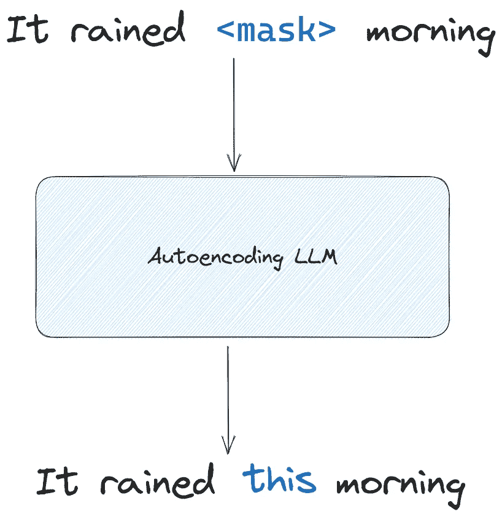

# 了解大型语言模型

> 原文：[`towardsdatascience.com/catch-up-on-large-language-models-8daf784f46f8`](https://towardsdatascience.com/catch-up-on-large-language-models-8daf784f46f8)

## 实用的无炒作大型语言模型指南

[](https://medium.com/@marcopeixeiro?source=post_page-----8daf784f46f8--------------------------------)[](https://towardsdatascience.com/?source=post_page-----8daf784f46f8--------------------------------) [Marco Peixeiro](https://medium.com/@marcopeixeiro?source=post_page-----8daf784f46f8--------------------------------)

·发表于 [Towards Data Science](https://towardsdatascience.com/?source=post_page-----8daf784f46f8--------------------------------) ·15 分钟阅读·2023 年 9 月 5 日

--


图片由 [Gary Bendig](https://unsplash.com/@kris_ricepees?utm_source=medium&utm_medium=referral) 提供，来源于 [Unsplash](https://unsplash.com/?utm_source=medium&utm_medium=referral)

如果你在这里，这意味着像我一样，你被围绕 **大型语言模型** (LLMs) 的不断信息流和炒作文章所压倒。

这篇文章是我试图帮助你了解大型语言模型的努力，没有炒作。毕竟，这是一个变革性的技术，我相信了解它很重要，希望这会激发你更深入地学习并用它创建一些东西。

在接下来的部分中，我们将定义什么是 LLM 及其工作原理，当然会涵盖 Transformer 架构。我们还将探讨不同的 LLM 训练方法，并通过一个动手项目结束文章，在这个项目中，我们将使用 Flan-T5 进行 Python 情感分析。

开始吧！

# LLM 和生成式 AI：它们是一样的吗？

生成式 AI 是机器学习的一个子集，专注于那些主要功能是生成 *某物* 的模型：文本、图像、视频、代码等。

生成模型通过在大量由人类创建的数据上进行训练，以学习模式和结构，从而能够生成新数据。

生成模型的示例包括：

+   **图像生成**：DALL-E，Midjourney

+   **代码生成**：OpenAI Codex

+   **文本生成**：GPT-3，Flan-T5，LLaMA

大型语言模型是生成式 AI 领域的一部分，因为它们会接收输入文本并反复预测下一个单词，直到输出完成。

然而，随着语言模型的规模不断扩大，它们能够执行其他自然语言处理任务，如摘要、情感分析、命名实体识别、翻译等。

既然如此，现在让我们关注 LLM 的工作原理。

# LLM 的工作原理

我们现在拥有大规模语言模型的原因之一是 Google 和多伦多大学的开创性工作，他们在 2017 年发布了论文 [Attention Is All You Need](https://arxiv.org/abs/1706.03762)。

本文介绍了 **Transformer** 架构，它是我们今天所知和使用的 LLM 背后的基础。

这种架构解锁了大规模模型，使得在多个 GPU 上训练非常大的模型成为可能，这些模型能够并行处理输入，给它们处理非常大数据序列的机会。

## Transformer 架构概述

以下内容旨在对 Transformer 架构进行高层次的概述。虽然有许多资源对其进行了更深入的探讨，但这里的目标只是理解其工作原理，以便理解不同的 LLM 如何在不同任务中发挥作用。

如需更多详细信息，我建议阅读 [原始论文](https://arxiv.org/pdf/1706.03762.pdf)。

所以，让我们从 Transformer 架构的简化可视化开始。


Transformer 架构的简化可视化。图片由作者提供。

从上图中，我们可以看到 Transformer 的主要组件是编码器和解码器。在每个组件内部，我们还可以找到 **attention** 组件。

让我们更详细地探讨每个组件，以理解 Transformer 架构的工作原理。

## 分词输入

我们知道 LLMs 使用文本，但计算机处理的是数字而非字母。因此，输入必须进行 *分词*。

分词是将句子的单词表示为数字的过程。

基本上，模型可以处理的每个可能单词都在一个字典中，并且与之关联一个编号。通过分词，我们可以检索与单词相关的编号，将句子表示为数字序列，如下所示。


分词示例。句子被分词后送入 Transformer 的嵌入层。图片由作者提供。

在上图中，我们看到一个例子，展示了如何在将句子“It rained this morning”发送到 Transformer 的嵌入层之前进行分词。

注意到分词句子的方式有很多种。在上面的例子中，分词器可以将一个词的部分表示出来，这就是为什么 *rained* 被分成 *rain* 和 *ed*。其他分词器可能只会为完整的单词分配一个编号。

## 词嵌入层

此时，我们有一系列表示单词的数字，但计算机如何理解这些数字的含义呢？

这是通过词嵌入层实现的。

词嵌入是一种对单词的学习表示，使得具有相似意义的单词具有相似的表示。模型将学习单词的不同属性，并在一个固定空间中表示它们，其中每个轴可以表示单词的属性。


词嵌入的可视化。我们可以看到“morning”和“sunrise”有相似的表示，因为它们在 3D 空间中的角度较小。同样，“rain”和“thunder”彼此更近。图片由作者提供。

在上图中，我们可以看到 3D 词嵌入的样子。我们看到“morning”和“sunrise”彼此更近，因此具有相似的表示。这可以通过余弦相似度计算得出。

另一方面，“rain”和“thunder”彼此较近，而与“morning”和“sunrise”相距较远。

现在，我们只能展示一个 3D 空间，但实际上，嵌入可以有数百个维度。事实上，原始的 Transformer 架构使用了 512 维的嵌入空间。这意味着模型可以学习 512 个不同的词属性，将它们表示在一个 512 维的空间中。

## 那么词序呢？

你可能已经注意到，通过表示词的嵌入，我们会丧失它们在句子中的顺序。

当然，在自然语言中，词序非常重要，因此我们使用位置编码，以便模型了解句子中单词的顺序。

是将词嵌入和位置编码结合在一起并发送给编码器。

## 在编码器内部

我们的输入在编码器内部传递，在那里它们会经过**自注意力**机制。

这就是模型可以学习句子中每个标记之间依赖关系的地方。它学习了每个词相对于句子中所有其他词的重要性。


单词“rained”的注意力图示例。笔划宽度代表重要性。在这里，我们可以看到“rained”与“this”和“morning”紧密连接。图片由作者提供。

在上图中，我们展示了单词“rained”的注意力图的风格化示例。笔划宽度表示重要性。

在这个例子中，我们可以看到自注意力捕捉了“rained”与“this”和“morning”的重要性，这意味着它理解了这个句子的上下文。

尽管这个例子很简单，因为我们只有一个非常短的句子，自注意力机制在较长的句子中效果很好，能够有效地捕捉上下文和句子的整体含义。

此外，模型并没有一个单一的注意力头。事实上，它有多个注意力头，也称为*多头自注意力*，每个头部可以学习语言的不同方面。

例如，在论文[Attention Is All You Need](https://arxiv.org/pdf/1706.03762.pdf)中，作者发现一个头部涉及到*指代消解*，即识别实体与其重复引用之间的联系。


指代消解的例子。在这里，单词“keys”在句子中再次被引用为“they”。图片由作者提供。

上面，我们看到一个指代解析的示例，其中单词“keys”后来被提及为“they”，因此一个注意力头可以专门识别这些链接。

注意，我们并未决定每个注意力头将学习语言的哪个方面。

此时，模型已经对句子的意义结构有了深层次的表示。这被发送到解码器。

## 解码器内部

解码器接受输入令牌的深层表示。这为解码器内部的自注意机制提供信息。

作为提醒，这里再次展示了 Transformer 架构，以便我们记住它的样子。


Transformer 架构的简化可视化。图片由作者提供。

**序列开始**令牌被插入作为解码器的输入，以指示其开始生成新令牌。

新令牌是根据编码器生成的输入序列的理解及其自注意机制生成的。

在上图中，我们可以看到解码器的输出被送到一个 softmax 层。这生成了每个可能令牌的概率向量。具有最大概率的令牌随后由模型输出。

该输出令牌随后被送回嵌入层作为解码器的输入，直到模型生成**序列结束**令牌。此时，输出序列完成。

这总结了大型语言模型背后的基本架构。通过 Transformer 架构及其并行处理数据的能力，使得在大量数据上训练模型成为可能，使 LLMs 成为现实。

现在，情况更复杂，因为 LLMs 并非都使用完整的 Transformer 架构，这影响了它们的训练方式。让我们更详细地探讨这一点。

# LLM 的训练方式

我们已经看到了支撑大型语言模型的基本机制，如前所述，并非所有模型都使用完整的 Transformer 架构。

实际上，一些模型可能只使用编码器部分，而其他模型只使用解码器部分。

这意味着模型的训练方式也不同，因此会专注于特定任务。

## 仅编码器模型

仅编码器模型，也称为**自编码**模型，最适合用于情感分析、命名实体识别和词汇分类等任务。

自编码模型的流行示例有 BERT 和 ROBERTA。

这些模型使用**掩码语言建模**（MLM）进行训练。通过这种训练方法，输入句子中的单词会被随机掩盖，模型的目标是重建原始文本。



说明了用于自编码模型的掩码语言建模（MLM）。在这里，输入句子中的一个随机单词被掩盖，模型必须重建原始句子。图片由作者提供。

在上图中，我们可以看到掩蔽语言建模的样子。一个词被隐藏，句子被输入到模型中，模型必须学习预测正确的词以得到正确的原始句子。

使用该方法，自编码模型发展了**双向上下文**，因为它们可以看到需要预测的标记前后的内容，而不仅仅是前面的内容。

再次如上图所示，模型看到“it rained”和“morning”，因此它看到句子的开头和结尾，这使得它能够预测“this”这个词，从而正确重构句子。

注意，对于自编码模型，输入和输出序列的长度是相同的。

## 仅解码器模型

仅解码器模型也称为*自回归*模型。这些模型最适合文本生成，但当模型变得非常大时，新的功能就会出现。

自回归模型的例子有 GPT 和 BLOOM。

这些模型使用**因果语言建模**（CLM）进行训练。使用因果语言建模时，模型只看到掩蔽之前的标记，这意味着它看不到序列的结尾。


说明因果语言建模。在这里，模型只看到导致掩蔽的标记。然后，它必须推断下一个标记直到句子完整。图像由作者提供。

如上所示，使用因果语言建模时，模型只看到导致掩蔽的标记，而看不到掩蔽之后的内容。然后，它必须预测下一个标记直到句子完整。

在上面的例子中，模型会输出“this”，然后该标记会被反馈作为输入，因此模型可以预测“morning”。

与掩蔽语言建模不同，模型建立了单向上下文，因为它们看不到掩蔽之后的内容。

当然，对于仅解码器模型，输出序列的长度可能与输入序列的长度不同。

## 编码器-解码器模型

编码器-解码器模型也称为*序列到序列*模型，并且它们使用完整的 Transformer 架构。

这些模型通常用于翻译、文本摘要和问答。

流行的序列到序列模型的例子有 T5 和 BART。

为了训练这些模型，使用了**跨度破坏**方法。在这里，一个随机的标记序列被掩蔽并指定为*哨兵*标记。然后，模型必须自回归地重构被掩蔽的序列。


跨度破坏的说明。在这里，一系列标记被掩蔽并用哨兵标记替代。然后，模型必须自回归地重构被掩蔽的序列。图像由作者提供。

在上图中，我们可以看到两个标记的序列被掩蔽并用哨兵标记替代。然后，模型被训练以重构哨兵标记以获得原始句子。

在这里，掩码输入被发送到编码器，而解码器负责重建掩码序列。

## 关于模型大小的说明

尽管我们已指定了某些模型表现最佳的任务，研究人员观察到大型模型能够执行各种任务。

因此，虽然编码-解码模型专门用于翻译，但非常大的仅解码模型在翻译方面也表现出色。

考虑到这些，让我们现在开始在 Python 中使用大型语言模型。

# 与大型语言模型合作

在我们实际操作大型语言模型之前，让我们先了解一些与 LLM 相关的技术术语。

首先，我们提供给 LLM 的文本称为*提示（prompt）*，模型的输出称为*完成（completion）*。


提示是我们向模型提供的包含指令的文本。模型的输出称为完成。图片由作者提供。

在提示中，我们向 LLM 提供指令，以实现我们希望完成的任务。

这也是进行**提示工程**的地方。通过提示工程，我们可以进行**上下文学习**，即向模型提供如何执行某些任务的示例。稍后我们将看到一个例子。

目前，让我们使用 Python 与 LLM 进行情感分析的互动。

# 实践项目：使用 Flan-T5 进行情感分析

对于这个迷你项目，我们使用 Flan-T5 对各种金融新闻进行情感分析。

Flan-T5 是 T5 模型的改进版，T5 是一个序列到序列模型。研究人员基本上对 T5 模型进行了微调，使其覆盖更多语言。有关更多详细信息，请参见[原始论文](https://arxiv.org/pdf/2210.11416.pdf)。

对于数据集，我们将使用由 Pekka Malo 和 Ankur Sinha 在 Creative Commons 属性许可下发布的*financial_phrasebank* 数据集。

数据集包含来自英语金融新闻的共 4840 个句子，这些句子被分类为积极、消极或中立。五到八名注释员对每个句子进行分类，根据一致性率，数据集的大小会有所不同（50%一致率为 4850 行，100%一致率为 2260 行）。

有关数据集及其编制方式的更多信息，请参见[完整数据集详情页面。](https://huggingface.co/datasets/financial_phrasebank)

当然，下面显示的所有代码都可以在[GitHub](https://github.com/marcopeix/learn_llm/blob/main/1_llm_get_started.ipynb)上找到。

## 设置你的环境

为了使以下实验有效，确保有一个虚拟环境，并安装了以下软件包：

+   torch

+   torchdata

+   transformers

+   datasets

+   pandas

+   matplotlib

+   scikit-learn

请注意，库*transformers*和*datasets*来自 HuggingFace，使我们可以轻松访问和实验 LLM。

一旦环境设置好，我们可以开始导入所需的库。

```py
import pandas as pd
import numpy as np
import matplotlib.pyplot as plt

from datasets import load_dataset
from transformers import AutoModelForSeq2SeqLM, AutoTokenizer, GenerationConfig
```

## 加载数据

然后，我们可以加载我们的数据集。在这里，我们使用了具有 100% 一致性率的数据集。

```py
dataset_name = "financial_phrasebank"

dataset = load_dataset(dataset_name, "sentences_allagree")
```

该数据集包含总共 2264 个句子。

请注意标签已被编码。1 代表中性，0 代表负面，2 代表正面。每种标签的计数如下所示。


数据集中每种情感的频率。图片由作者提供。

让我们将每个句子的实际标签存储在一个 DataFrame 中，以便后续更容易评估模型。

```py
labels_df = pd.DataFrame()

labels_from_dataset = [dataset['train'][i]['label'] for i in range(2264)]

labels_df['labels'] = labels_from_dataset
```

## 加载模型

现在，让我们加载模型和分词器。如前所述，我们将加载 Flan-T5 模型。请注意，该模型有不同的大小版本，但我决定使用基础版。

```py
model_name = "google/flan-t5-base"

model = AutoModelForSeq2SeqLM.from_pretrained(model_name)

tokenizer = AutoTokenizer.from_pretrained(model_name, use_fast=True)
```

就这样！我们现在可以使用这个 LLM 对我们的数据集进行情感分析。

## 向模型提出情感分析的提示

为了让模型进行情感分析，我们需要进行提示工程以指定该任务。

在这种情况下，我们简单地使用“*以下句子是正面、负面还是中性？*”。然后我们将数据集中的句子传递给模型，让模型进行推断。

请注意，这被称为**零-shot 推断**，因为模型没有特别针对这个特定任务和数据集进行训练。

```py
zero_shot_sentiment = []

for i in range(2264):
    sentence = dataset['train'][i]['sentence']

    prompt = f"""
Is the follwing sentence positive, negative or neutral?

{sentence}
    """

    inputs = tokenizer(prompt, return_tensors='pt')
    output = tokenizer.decode(
        model.generate(
            inputs["input_ids"],
            max_new_tokens=50
        )[0],
        skip_special_tokens=True
    )

    zero_shot_sentiment.append(output)
```

在上面的 Python 代码块中，我们循环遍历数据集中的每个句子，并将其传递到我们的提示中。提示被分词并设置给模型。然后，我们解码输出以获得自然语言响应。最后，我们将模型的预测存储在列表中。

然后，让我们将这些预测添加到我们的 DataFrame 中。

```py
labels_df['zero_shot_sentiment'] = zero_shot_sentiment
labels_df['zero_shot_sentiment'] = labels_df['zero_shot_sentiment'].map({'neutral':1, 'positive':2, 'negative':0})
```

## 评估模型

为了评估我们的模型，让我们展示预测的混淆矩阵以及分类报告。

```py
from sklearn.metrics import confusion_matrix, ConfusionMatrixDisplay
from sklearn.metrics import classification_report

cm = confusion_matrix(labels_df['labels'], labels_df['zero_shot_sentiment'], labels=[0,1,2])

disp_cm = ConfusionMatrixDisplay(cm, display_labels=[0,1,2])

disp_cm.plot();

plt.grid(False)
plt.tight_layout()

clf_report = classification_report(labels_df['labels'], labels_df['zero_shot_sentiment'], labels=[0,1,2])

print(clf_report)
```


使用 Flan-T5 对金融新闻进行零-shot 情感分析的混淆矩阵。图片由作者提供。


零-shot 情感分析的分类报告。图片由作者提供。

从上面的图中，我们可以看到模型找到了所有负面句子，但代价是精确度，因为它错误标记了 611 个中性句子和 92 个正面句子。此外，我们还可以看到识别中性句子存在明显的问题，因为它错误标记了绝大多数句子。

因此，让我们尝试更改提示，以查看是否可以提高模型的性能。

## 带有上下文学习的一次性推断

在这里，我们修改了我们的提示，加入了一个中性句子的示例。这种技术称为**上下文学习**，因为我们在提示中传递了模型应如何表现的示例。

传递一个示例称为**一次性推断**。可以传递更多示例，这种情况称为**少量样本推断**。

向 LLM 展示最多五个示例是正常的。如果性能没有提高，那么很可能需要对模型进行微调。

现在，让我们看看一个示例如何影响性能。

```py
one_shot_sentiment = []

for i in range(2264):
    sentence = dataset['train'][i]['sentence']

    prompt = f"""

Is the follwing sentence positive, negative or neutral?

Statement: "According to Gran , the company has no plans to move all production to Russia , although that is where the company is growing ."
neutral

Is the follwing sentence positive, negative or neutral?
Statement: {sentence}

{sentence}
    """

    inputs = tokenizer(prompt, return_tensors='pt')
    output = tokenizer.decode(
        model.generate(
            inputs["input_ids"],
            max_new_tokens=50
        )[0],
        skip_special_tokens=True
    )

    one_shot_sentiment.append(output)
```

在上面的代码块中，我们看到我们给出了一个中性句子的示例，以帮助模型识别它们。然后，我们将每个句子传递给模型进行分类。

然后，我们按照相同的步骤添加包含新预测的新列，并显示混淆矩阵。

```py
labels_df['one_shot_sentiment'] = one_shot_sentiment
labels_df['one_shot_sentiment'] = labels_df['one_shot_sentiment'].map({'neutral':1, 'positive':2, 'negative':0})

cm = confusion_matrix(labels_df['labels'], labels_df['one_shot_sentiment'], labels=[0,1,2])

disp_cm = ConfusionMatrixDisplay(cm, display_labels=[0,1,2])

disp_cm.plot();

plt.grid(False)
plt.tight_layout()
```


使用 Flan-T5 进行金融新闻的单次情感分析的混淆矩阵。图片由作者提供。


单次情感分析的分类报告。图片由作者提供。

从上图可以看出，略有改善。加权 F1 分数从 0.40 提高到了 0.44。模型在中性类别上的表现更好，但以牺牲对正面类别的表现为代价。

添加正面、负面和中性句子的示例可能会有帮助，但我没有进行测试。否则，就需要对模型进行微调，但那是另一篇文章的主题。

# 结论

本文涵盖了许多概念，从理解 LLM 的基础知识，到实际使用 Flan-T5 进行 Python 中的情感分析。

现在你拥有了探索这个领域的基础知识，可以自己看看如何微调 LLM，如何训练 LLM，以及如何围绕它们构建应用程序。

希望你学到了新东西，并且对学习更多充满好奇。

干杯 🍻

# 支持我

喜欢我的工作吗？通过[请我喝咖啡](http://buymeacoffee.com/dswm)来支持我，这是你鼓励我的简单方式，而我能享受一杯咖啡！如果你愿意，只需点击下面的按钮 👇


# 参考资料

[注意力机制](https://arxiv.org/abs/1706.03762) — Ashish Vaswani, Noam Shazeer, Niki Parmar, Jakob Uszkoreit, Llion Jones, Aidan N. Gomez, Lukasz Kaiser, Illia Polosukhin

[生成式 AI 与 LLM](https://www.deeplearning.ai/courses/generative-ai-with-llms/) — deeplearning.ai
