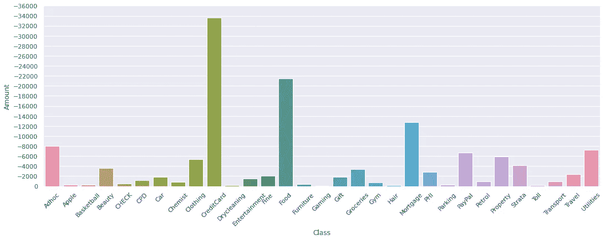
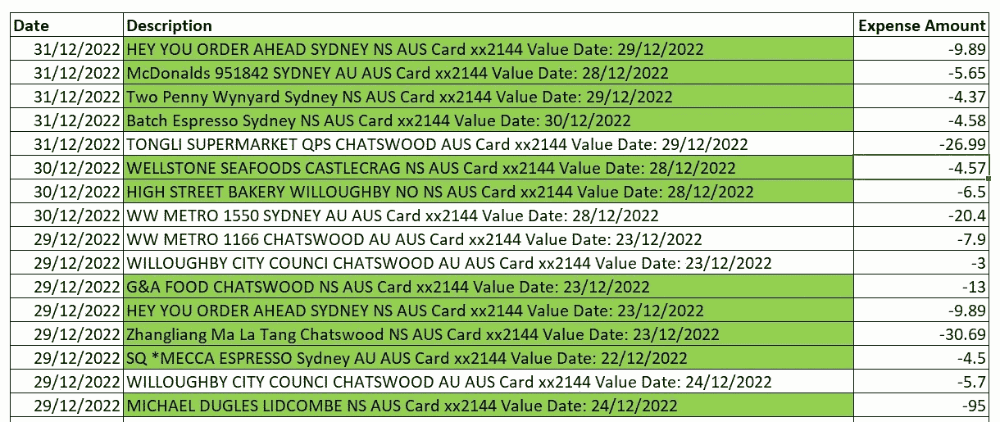
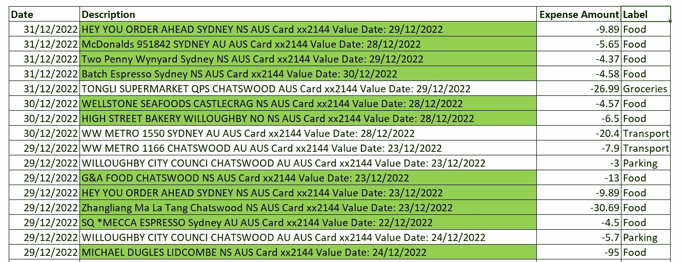
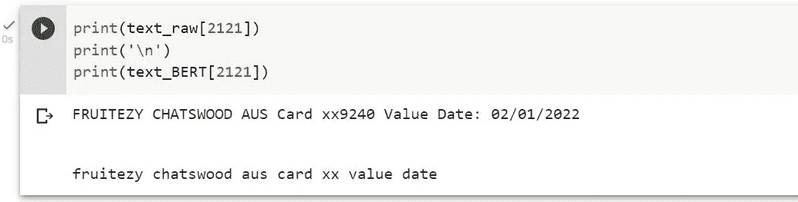
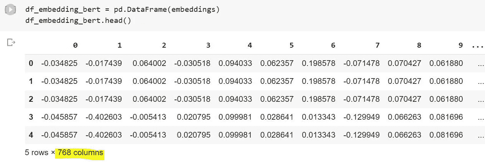
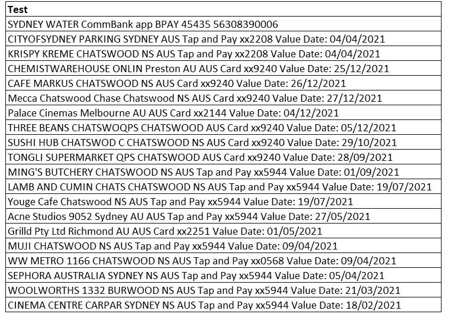
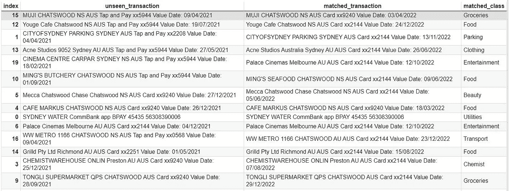
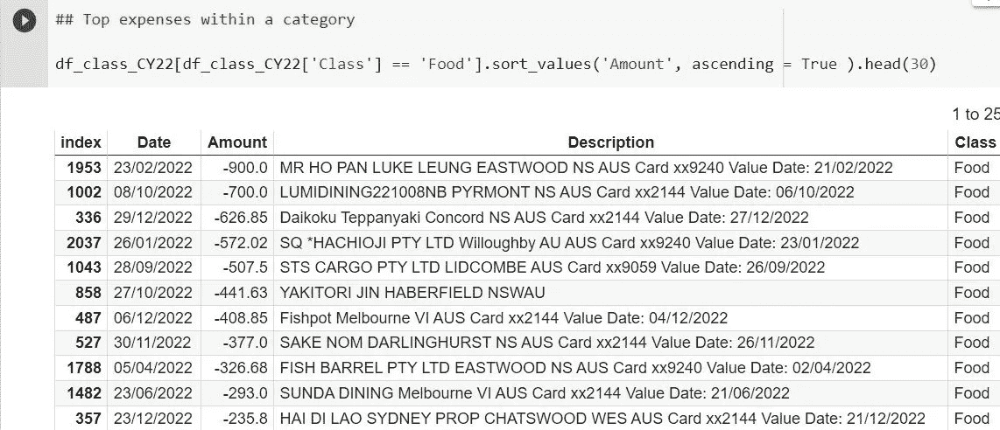

# 使用 BERT 对自由文本银行交易描述进行分类

> 原文：[`towardsdatascience.com/categorize-free-text-bank-transaction-descriptions-using-bert-44c9cc87735b`](https://towardsdatascience.com/categorize-free-text-bank-transaction-descriptions-using-bert-44c9cc87735b)

## 我为自己建立了一个开支跟踪工具

[](https://jin-cui.medium.com/?source=post_page-----44c9cc87735b--------------------------------)[](https://towardsdatascience.com/?source=post_page-----44c9cc87735b--------------------------------) [Jin Cui](https://jin-cui.medium.com/?source=post_page-----44c9cc87735b--------------------------------)

·发布于 [Towards Data Science](https://towardsdatascience.com/?source=post_page-----44c9cc87735b--------------------------------) ·7 分钟阅读·2023 年 1 月 30 日

--



按类别统计开支。图表由作者提供

# 情况说明

我在 2022 年年底购买了一处房产，并办理了抵押贷款。由于财务承诺的增加，我想对自己的开支进行监控。直到这一点之前，我从未意识到自己实际上不知道自己最常花钱的地方。弄清楚这一点可能是我自己开支管理的一个良好起点。

自然，我转向了从在线银行门户下载的银行交易数据，格式为 *.csv*。下面是 2022 年最后几天的数据片段。



图片 1：作者的银行交易数据。图片由作者提供

根据上面的数据片段，似乎我在食品上的支出比例较高（如绿色高亮所示）。更重要的是，交易描述是基于自由文本的，有没有办法自动将这些描述分类到一些预定义的开支类别中（例如食品、杂货购物、水电费等）？

使用像 BERT 这样的预训练大型语言模型至少有一种方法，本文提供了如何进行操作的教程！

# **2023 年 BERT 介绍**

虽然 ChatGPT 作为一种先进的**文本生成**模型目前受到广泛关注，但它通常不被认为是**通用**模型——例如 BERT 可以用于多种自然语言理解任务。一些示例包括语法检测、情感分类、文本相似性、问答推理等。

BERT 由谷歌于 2018 年开发和发布。它是一个使用维基百科和 BookCorpus 中的文本段落进行预训练的模型（以确保训练数据在语法上是准确的）。

本教程中使用的 BERT 模型可以通过 Hugging Face 的 sentence_transformer 库获得，该库是一个用于创建句子、文本和图像嵌入的 Python 框架。

# 构建费用分类器的步骤

我究竟如何将自由文本交易描述转换为费用类别？我能想到几种策略。在本教程中，我将提供一个基于（余弦）词嵌入相似度的费用分类器的逐步指南。步骤如下：

1.  手动将大量交易描述标记为一个费用类别（例如，食品、娱乐）。这会创建一组标记的训练数据。

1.  使用 BERT 将上述训练数据中的单个交易描述解析为词嵌入（即将文本转换为数值向量）。**步骤 1**和**步骤 2**共同确保训练数据被分配到特定的费用类别以及词嵌入向量。

1.  对新的交易描述重复**步骤 2**（即将未见过的文本转换为数值向量）

1.  将**步骤 3**中的词嵌入与训练数据中最相似的词嵌入配对，并分配相同的费用类别

# Python 实现

本节提供了加载所需包以及实施上述步骤的 Python 代码（不包括**步骤 1**，这是一项手动标记步骤）。

**步骤 0：导入所需的库**

```py
#for dataframe manipulation
import numpy as np 
import pandas as pd

#regular expressoin toolkit
import re

#NLP toolkits
import nltk
nltk.download('punkt')
from nltk.tokenize import word_tokenize

#for plotting expense categories later
import matplotlib.pyplot as plt 
plt.style.use('ggplot')
import seaborn as sns
import matplotlib
import matplotlib.ticker as ticker # for formatting major units on x-y axis

#for downloading BERT
!pip install sentence_transformers
from sentence_transformers import SentenceTransformer

#for finding most similar text vectors
from sklearn.metrics.pairwise import cosine_similarity
```

**步骤 1：标记训练数据**

我手动将 200 个交易描述标记为一个费用类别。例如，**图像 1**中的交易描述被分配了如下图所示的费用类别。我还将公共事业（即电费和煤气费）、汽车和礼品等类别分配给了训练数据中的其他交易。



图像 3：训练数据的手动标记。图片作者提供

**步骤 2：使用 BERT 创建训练数据的词嵌入**

我们首先定义一个用于清理文本数据的函数。这包括将单词小写、去除特殊字符（包括日期，这些在确定费用类别时并不有用）。

在使用 BERT 模型时，通常不需要进行词干提取、词形还原或去除停用词等 NLP 数据清理管道中的常见做法，因为 BERT 模型使用了字节对编码和注意力机制。

```py
###############################################
### Define a function for NLP data cleaning ###
###############################################

def clean_text_BERT(text):

    # Convert words to lower case.
    text = text.lower()

    # Remove special characters and numbers. This also removes the dates 
    # which are not important in classifying expenses
    text = re.sub(r'[^\w\s]|https?://\S+|www\.\S+|https?:/\S+|[^\x00-\x7F]+|\d+', '', str(text).strip())

    # Tokenise 
    text_list = word_tokenize(text)
    result = ' '.join(text_list)
    return result
```

然后我们将函数应用于交易描述，这些描述从**图像 1**中作为*text_raw*加载（*df_transaction_description*）。

```py
text_raw = df_transaction_description['Description']
text_BERT = text_raw.apply(lambda x: clean_text_BERT(x))
```

以下片段显示了数据清理应用前后的特定交易示例。



图像 2：数据清理示例。图片作者提供

然后我们将清理后的文本输入到 BERT 中。我选择了'*paraphrase-mpnet-base-v2*' BERT 模型，该模型以建模句子相似性而闻名。根据其在[Hugging Face](https://huggingface.co/sentence-transformers/paraphrase-mpnet-base-v2)上的文档，它将句子和段落映射到一个 768 维的密集向量空间，并可用于诸如聚类或语义搜索等任务。

```py
######################################
### Download pre-trained BERT model###
######################################

# This may take some time to download and run 
# depending on the size of the input

bert_input = text_BERT.tolist()
model = SentenceTransformer('paraphrase-mpnet-base-v2') 
embeddings = model.encode(bert_input, show_progress_bar = True)
embedding_BERT = np.array(embeddings)
```

下方提供了前几笔交易的词嵌入片段：



图像 4：BERT 嵌入。图像由作者制作

**步骤 3：为未见数据创建词嵌入**

我从未见过的数据中选择了 20 笔交易（为了本教程的目的，随机选择了交易）。这些交易显示在下图中。



图像 5：未见交易。图像由作者制作

上述交易描述作为*text_test_raw*加载。类似于**步骤 2**，这些数据通过 BERT 进行嵌入处理。

```py
# Load texts
text_test_raw = df_transaction_description_test['Test']

# Apply data cleaning function as for training data
text_test_BERT = text_test_raw.apply(lambda x: clean_text_BERT(x))

# Apply BERT embedding
bert_input_test = text_test_BERT.tolist()
#model = SentenceTransformer('paraphrase-mpnet-base-v2') 
embeddings_test = model.encode(bert_input_test, show_progress_bar = True)
embedding_BERT_test = np.array(embeddings_test)

df_embedding_bert_test = pd.DataFrame(embeddings_test)
```

**步骤 4：将未见数据与最相似的训练数据配对**

```py
 # Find the most similar word embedding with unseen data in the training data

similarity_new_data = cosine_similarity(embedding_BERT_test, embedding_BERT)
similarity_df = pd.DataFrame(similarity_new_data)

# Returns index for most similar embedding
# See first column of the output dataframe below
index_similarity = similarity_df.idxmax(axis = 1)

# Return dataframe for most similar embedding/transactions in training dataframe
data_inspect = df_transaction_description.iloc[index_similarity, :].reset_index(drop = True)

unseen_verbatim = text_test_raw
matched_verbatim = data_inspect['Description']
annotation = data_inspect['Class']

d_output = {
            'unseen_transaction': unseen_verbatim,
            'matched_transaction': matched_verbatim, 
            'matched_class': annotation

            } 
```

d_output 数据框显示，未见数据已被分配到一个相当合理的费用类别。



图像 6：未见数据与训练数据的匹配。图像由作者制作

现在，每当有新的费用产生时，只需将其输入模型即可！

**附加步骤：按类别绘制费用图**

我实际上将上述步骤应用于了 2022 日历年度的所有费用。下图展示了按分配类别计算的费用金额。


图表 7：按类别划分的费用图。图表由作者制作

主要观察结果如下：

+   在 2022 年，我在食品上的开支最多，其次是抵押贷款还款和公用事业账单。

+   尽管信用卡还款金额最高，但假设信用卡支出可以按相同比例分配到其他费用类别。这一假设也适用于 PayPal 类别。

+   根据数据，我可能希望减少食品开支，将更多支出转向杂货（即，开始在家做饭而不是外出就餐）以便于 2023 年。

+   我在美容产品上的支出可能是因为我和妻子一起购物的情况……

此外，返回特定类别中最高支出的交易非常简单。例如，我在 2022 年食品费用类别中的最高支出如屏幕截图所示。我对结果感到满意，因为这些餐厅中有些在训练数据中并不存在。尽管如此，BERT 仍然能够将这些交易分配到食品类别。



图像 7：主要费用。图像由作者制作

# 结论

本文提供了一个构建开支跟踪工具的全面教程。我做的就是将自由文本的交易描述翻译成机器理解的语言，使用 BERT，并让机器完成繁重的工作！

另一种方法是通过将相同的词向量嵌入传递到分类模型中，来替代本教程的**第 4 步**——这是给读者进一步实验的内容。

如果你喜欢我的这篇文章，可以随意阅读其他的[文章](https://jin-cui.medium.com/)。

*随着我踏上 AI/ML 的浪潮，我喜欢用全面的语言撰写和分享一步一步的指南和如何做的教程，并附带可运行的代码。如果你想访问我所有的文章（以及 Medium 上其他从业者/作者的文章），你可以通过* [*这个链接*](https://medium.com/@jin-cui/membership) *注册！*
