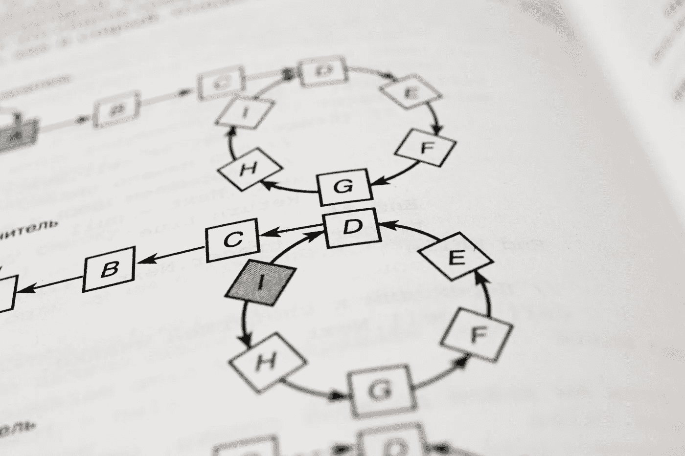

# 因果图：面对观察数据中的致命弱点

> 原文：[`towardsdatascience.com/causal-diagram-confronting-the-achilles-heel-in-observational-data-a69cdb1c4818?source=collection_archive---------4-----------------------#2023-11-23`](https://towardsdatascience.com/causal-diagram-confronting-the-achilles-heel-in-observational-data-a69cdb1c4818?source=collection_archive---------4-----------------------#2023-11-23)

图片来源：[Андрей Сизов](https://unsplash.com/@alpridephoto?utm_source=medium&utm_medium=referral) 在 [Unsplash](https://unsplash.com/?utm_source=medium&utm_medium=referral)

## “为何之书” 第三章和第四章，阅读与我系列

 [Zijing Zhu, PhD](https://zzhu17.medium.com/?source=post_page-----a69cdb1c4818--------------------------------)

·

[关注](https://medium.com/m/signin?actionUrl=https%3A%2F%2Fmedium.com%2F_%2Fsubscribe%2Fuser%2F7d83c09fb5d4&operation=register&redirect=https%3A%2F%2Ftowardsdatascience.com%2Fcausal-diagram-confronting-the-achilles-heel-in-observational-data-a69cdb1c4818&user=Zijing+Zhu%2C+PhD&userId=7d83c09fb5d4&source=post_page-7d83c09fb5d4----a69cdb1c4818---------------------post_header-----------) 发表在 [Towards Data Science](https://towardsdatascience.com/?source=post_page-----a69cdb1c4818--------------------------------) · 13 分钟阅读 · 2023 年 11 月 23 日

--

在我之前的两篇文章中，我[启动了](https://medium.com/towards-data-science/read-with-me-a-causality-book-club-edd7085d6ae6)“和我一起阅读”系列，并完成了阅读由 Judea Pearl 编写的《[因果之书](https://www.amazon.com/Book-Why-Science-Cause-Effect/dp/046509760X)》中的前两章。这些文章讨论了引入因果关系以实现类似人类的决策的重要性，并强调了因果梯子的基本概念，为未来的讨论奠定了基础。在这篇文章中，我们将探讨从因果梯子的第一层到第二层的关键环节，这将使我们能够超越概率，进入因果思维的领域。我们将从贝叶斯定理开始，转向贝叶斯网络，最终探讨因果图。

# 从贝叶斯定理到逆概率

作为侦探小说的爱好者，我最喜欢的系列是《福尔摩斯》。我仍然记得那些日夜，我读书时没有注意时间的流逝。多年后，许多案件细节已经从我的记忆中消失，但我仍然记得像其他人一样的名句：

> **当你排除了不可能的事物，剩下的，无论多么不可能，也必须是真相。**
