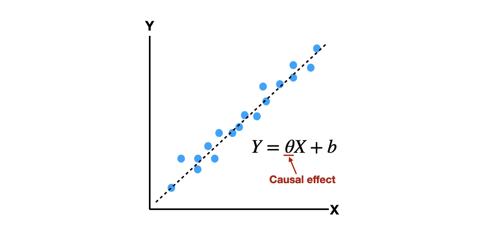
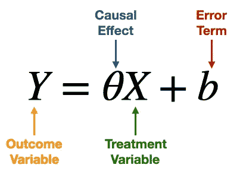
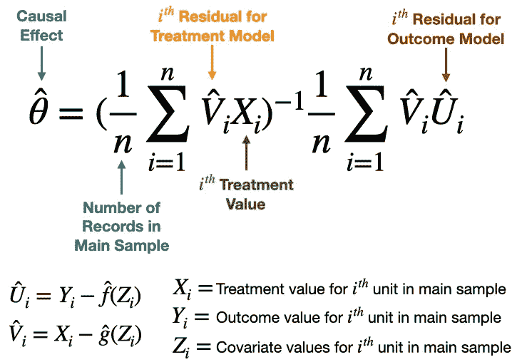
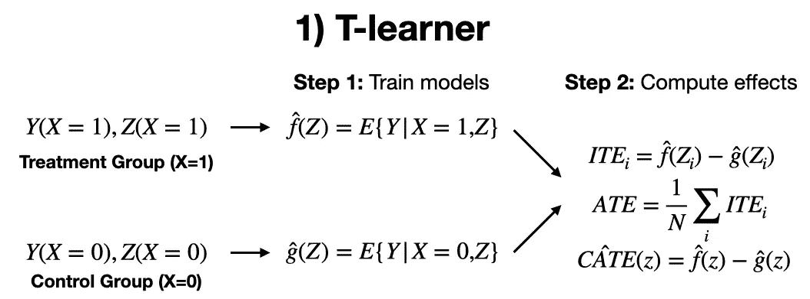
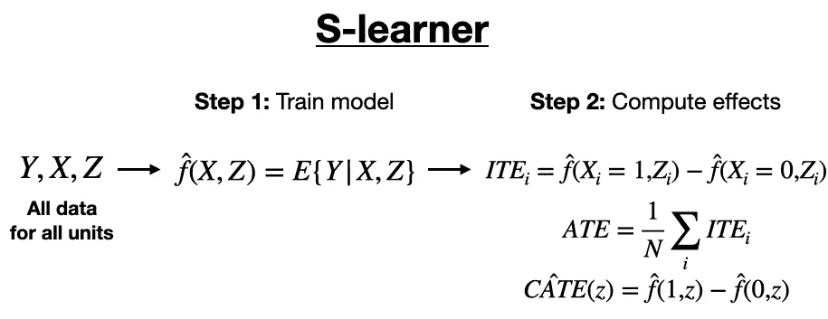
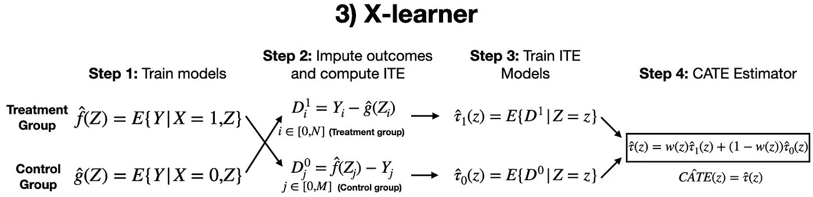

# 通过回归估计因果效应

> 原文：[`towardsdatascience.com/causal-effects-via-regression-28cb58a2fffc`](https://towardsdatascience.com/causal-effects-via-regression-28cb58a2fffc)

## 3 种流行技术及其 Python 示例代码

[](https://shawhin.medium.com/?source=post_page-----28cb58a2fffc--------------------------------)[](https://towardsdatascience.com/?source=post_page-----28cb58a2fffc--------------------------------) [Shaw Talebi](https://shawhin.medium.com/?source=post_page-----28cb58a2fffc--------------------------------)

·发表于[Towards Data Science](https://towardsdatascience.com/?source=post_page-----28cb58a2fffc--------------------------------) ·阅读时间 8 分钟·2023 年 1 月 10 日

--

这是关于[因果效应](https://shawhin.medium.com/understanding-causal-effects-37a054b2ec3b)系列文章的第 5 篇。在之前的文章中，我们讨论了从数据中计算处理效应的不同方法。在这里，我介绍了通过 3 种流行的基于回归的技术来估计因果效应的替代方法。我以如何在实践中使用这些技术的 Python 示例代码来结束本文。

**关键点：**

+   回归是利用数据学习变量之间关系的一种方法

+   3 种常见的基于回归的因果效应估计方法是：**线性回归**、**双重机器学习**和**元学习器**



通过线性回归的因果效应玩具示例。图片由作者提供。

# **什么是回归？**

**回归**是**利用数据学习变量之间关系的方法**。例如，巴布亚新几内亚成人[胡安树袋熊](https://www.zoo.org/view.image?Id=5582)的身高与体重之间的关系。

回归过程的输出称为**模型**。这本质上是**我们可以用来进行预测的东西**，例如，你告诉我一只树袋熊的身高，我可以告诉你它的体重大致值。

回归的关键好处是我们可以**利用数据将模型与现实相匹配**。

要使用回归来估计因果效应，我们需要开发数据驱动的模型，这些模型捕捉了处理、协变量和结果之间的关系。然后，审查这些模型以量化因果效应。

我们之前用平均处理效应（ATE）定义了因果效应，即处理组和控制组之间的结果均值差异。由于我们可以直接从数据中估计因果效应，因此不需要模型！

然而，在回归框架中，因果效应的推导方式不同。要了解这一点，我们从最简单的基于回归的因果效应估计方法——线性回归开始。

[](/causal-effects-f30f962ffff3?source=post_page-----28cb58a2fffc--------------------------------) ## 因果效应

### 什么是处理效应以及如何计算？

towardsdatascience.com

# **线性回归**

对于这种方法，我们训练一个线性模型来预测结果变量（Y）相对于处理变量（X）。然后我们将 **因果效应** 定义为 **回归模型中处理变量的系数**。下面给出了一个简单的示例。



使用线性回归估计 X 对 Y 的因果效应的简单示例。图像来自作者。

其中 **Y** 是结果变量，**X** 是处理变量，**b** 是截距（可以解释为误差项），**Θ** 是 X 对 Y 的因果效应。注意在这个回归框架中定义的因果效应是 **根本不同的**，与我们在 过去的文章 中定义的方式。

更进一步，我们可以在线性模型中包含混杂因素。在这种情况下，**混杂因素** 是 **影响处理变量和结果变量的变量**。通过这样做，我们可以减少由于混杂因素导致的因果效应估计的偏差。有关如何使用线性回归估计因果效应的更多细节，我建议读者参考 Gelman 和 Hill 的章节 [1]。

# **双重机器学习**

尽管线性回归的简单性使其易于使用，但它可能无法准确捕捉变量之间的关系（例如，当变量之间存在非线性关系时）。这时，更复杂的技术会更有帮助。

一种这样的技术被称为 **双重机器学习 (DML)**。介绍这种方法的论文很详尽（约 70 页），但整个过程可以分解为 3 个简单步骤 [2]。

1.  **训练** **2 个回归模型**。一个是预测 **结果变量** 相对于相关协变量。另一个是预测 **处理变量** 相对于协变量。

1.  **计算每个模型的残差**。换句话说，如果 f(Z) 通过 Z 估计 Y，而 g(Z) 通过 Z 估计 X，则它们的残差分别为 U = Y-f(Z) 和 V = X-g(Z)。

1.  **计算处理效应**。利用残差，我们可以使用下面的方程直接计算处理效应。



双重机器学习方法的因果效应表达式 [3]。图像来自作者。

这被称为双重机器学习，因为我们训练了 2 个机器学习模型，f(Z)和 g(Z)。此外，**对所使用的机器学习方法没有限制**，它们可以是简单的线性回归，也可以是复杂的亿参数神经网络。

做 DML 时一个重要的细节是需要将可用数据分成 2 个子集：**主要样本**和**辅助样本**。然后使用这些子集执行一个称为**交叉拟合**的过程。

这包括使用主要样本和辅助样本来分别训练模型 g(Z)和 f(Z)，然后进行交换，即使用主要样本来训练 f(Z)和辅助样本来训练 g(Z)。

然后，我们可以对每个样本-模型配对的因果效应估计进行平均。虽然这看起来像是额外的一步，但它在保持我们因果效应估计的数学简单性方面是重要的。更多细节请查看 DML 论文第 5 页[2]。

# 元学习者

**元学习者**旨在通过训练回归模型**捕捉处理、协变量和结果之间的关系**。与线性回归和 DML 不同，元学习者的因果效应不是定义为回归系数。相反，回归模型用于模拟每个单元的未观察结果，从而得到个体处理效应（ITE）。然后可以使用 ITE 来计算 ATE。

此外，对于所谓的*异质性*因果效应，可以使用**条件平均处理效应（CATE）**。这仅仅是**特定子人群的 ATE**（例如，雄性袋鼠、婴儿女孩的因果效应等）。异质性处理效应是在人群广泛变化的处理效应。

## **T-learner**

第一种元学习者是**T-learner**（或双重学习者）。在这里，我们训练**2 个结果模型**（因此得名），一个用于**控制组**，另一个用于**处理组**[4]。

此技术可以分解为 2 步过程。

1.  **训练 2 个模型**来分别估计控制组和处理组中的结果变量。

1.  使用每个模型为每个单元生成（控制和处理）结果预测，并获得 ITE，这些 ITE 可以用来**计算 ATE**。



T-learner 过程概述。图片由作者提供。

## **S-learner**

接下来，我们有**S-learner**（单一学习者）。这与 T-learner 类似，但不是训练 2 个结果模型，而是只创建一个，但**将处理变量作为预测因子**[4]。

使用此技术获取因果效应时，我们再次遵循 2 步过程。

1.  **训练模型**以估计协变量**和**处理值方面的结果变量。

1.  使用每个单元的模型预测来估计 ITE，并将其汇总以**获取 ATE**。



S-learner 过程概述。图片由作者提供。

## **X-learner**

最终类型的 meta-learner 是**X-learner**。这种方法与 T-learner 有重叠，但更进一步。

X-learner 的 4 步过程[4]。

1.  **训练 2 个模型**以分别估算对照组和处理组的结果变量，考虑协变量。（就像我们对 T-learner 所做的那样）。

1.  **使用模型估算未观察到的结果值**。例如，如果单位 i=0 的 X₀=1 且 Y₀=1，我们然后使用对照组模型估算 X₀=0 的未观察到的结果。然后，使用估算的结果值来分别计算对照组和处理组的 ITE。

1.  **再训练 2 个模型**以分别估计处理组和对照组的 ITE。

1.  通过结合 ITE 模型使用权重函数* w()*来**估计 CATE**。 （提示：使用倾向得分作为* w*）。



X-learner 过程概述。图片由作者提供。

关于 Meta-learners 的更多内容，我建议读者参考 Kunzel 等人的论文[4]和 Causal ML 文档[5]。

[](/propensity-score-5c29c480130c?source=post_page-----28cb58a2fffc--------------------------------) ## 通过倾向得分估计因果效应

### 如何从观察数据中估计效果

towardsdatascience.com

# 示例代码：估计研究生学校对收入的处理效果（再次查看）

在这个例子中，我们使用 3 种基于回归的技术来估计拥有研究生学位对年收入超过 50k 美元的因果影响。我们使用开源的[DoWhy](https://py-why.github.io/dowhy/v0.8/)库和来自[UCI 机器学习库](https://archive.ics.uci.edu/ml/datasets/census+income)的开放数据[6]。

示例代码可以在[GitHub Repo](https://github.com/ShawhinT/YouTube-Blog/tree/main/causality/causal_effects_regression)中找到。

```py
# import modules
import pickle

import econml
import dowhy

from sklearn.linear_model import LinearRegression
from sklearn.tree import DecisionTreeRegressor

# load data
df = pickle.load( open( "df_causal_effects.p", "rb" ) ).astype(int)
```

一旦我们拥有了库和数据，我们必须定义我们的因果模型。这本质上定义了我们的处理、结果和协变量。

```py
# define causal model
model = dowhy.CausalModel(
        data = df,
        treatment= "hasGraduateDegree",
        outcome= "greaterThan50k",
        common_causes="age",
        )

# define estimand
estimand = model.identify_effect(proceed_when_unidentifiable=True)
```

在这里，我们将“hasGraduateDegree”定义为处理，“greaterThan50k”定义为结果，而“age”作为唯一的混杂变量。

首先，我们尝试**线性回归**。DoWhy 库让一切变得非常简单，因此我们只需运行 2 行代码。

```py
# Linear Regression
LR_estimate = model.estimate_effect(estimand, 
                                    method_name="backdoor.linear_regression")

print(LR_estimate)
# ATE = 0.2976
```

接下来，我们尝试**Double ML**，虽然这个简单的例子对于它来说有点过于复杂，尤其是处理和结果变量只有 0 或 1 的值时。

```py
# Double Machine Learning
DML_estimate = model.estimate_effect(estimand, 
                                     method_name="backdoor.econml.dml.DML",
                                     method_params={"init_params":{
                                         'model_y':LinearRegression(),
                                         'model_t':LinearRegression(),
                                         'model_final':LinearRegression()
                                                                  },
                                                   "fit_params":{}
                                              })
print(DML_estimate)
# ATE = 0.2977
```

请注意，在这个例子中，我们在 DML 过程使用的模型都是线性回归，但对于更复杂的问题，可以（且很多时候应该）使用更复杂的技术。

最后，我们尝试使用决策树构建**X-learner**作为我们的子模型。

```py
# X-learner
Xlearner_estimate = model.estimate_effect(estimand,
                          method_name="backdoor.econml.metalearners.XLearner",
                          method_params={"init_params":{
                                              'models': DecisionTreeRegressor()
                                                    },
                                          "fit_params":{}
                                         })

print(Xlearner_estimate)
# ATE = 0.2032
```

[](https://github.com/ShawhinT/YouTube-Blog/tree/main/causal_effects_regression?source=post_page-----28cb58a2fffc--------------------------------) [## YouTube-Blog/causal_effects_regression 在主分支 · ShawhinT/YouTube-Blog

### 你现在无法执行此操作。你在另一个标签或窗口中已登录。你在另一个标签或窗口中已注销…

[github.com](https://github.com/ShawhinT/YouTube-Blog/tree/main/causal_effects_regression?source=post_page-----28cb58a2fffc--------------------------------)

**更多关于因果关系**: [因果效应概述](https://shawhin.medium.com/understanding-causal-effects-37a054b2ec3b) | 因果关系：简介 | 因果推断 | 因果发现

# 资源

**联系我**: [我的网站](https://shawhintalebi.com/) | [预约电话](https://calendly.com/shawhintalebi) | [问我任何问题](https://shawhintalebi.com/connect/)

**社交媒体**: [YouTube 🎥](https://www.youtube.com/channel/UCa9gErQ9AE5jT2DZLjXBIdA) | [LinkedIn](https://www.linkedin.com/in/shawhintalebi/) | [Twitter](https://twitter.com/ShawhinT)

**支持**: [请我喝咖啡](https://www.buymeacoffee.com/shawhint) ☕️

[`shawhin.medium.com/subscribe?source=post_page-----28cb58a2fffc--------------------------------`](https://shawhin.medium.com/subscribe?source=post_page-----28cb58a2fffc--------------------------------) [## 获取我撰写的每一个新故事的**免费**访问权限

### 获取我撰写的每一个新故事的**免费**访问权限 P.S. 我不会与任何人分享你的电子邮件 通过注册，你将创建一个…

[shawhin.medium.com](https://shawhin.medium.com/subscribe?source=post_page-----28cb58a2fffc--------------------------------)

[1] [对处理变量进行回归的因果推断](http://www.stat.columbia.edu/~gelman/arm/chap9.pdf) 由 Andrew Gelman 和 Jennifer Hill 编写

[2] [用于处理和因果参数的双重/去偏机器学习](https://arxiv.org/abs/1608.00060) 由 Victor Chernozhukov 等人编写

[3] [DoubleML](https://docs.doubleml.org/stable/guide/basics.html) Python 库文档

[4] [使用机器学习估计异质处理效应的元学习者](https://arxiv.org/abs/1706.03461) 由 Kunzel 等人编写

[5] [CausalML](https://causalml.readthedocs.io/en/latest/methodology.html#meta-learner-algorithms) Python 库文档 (元学习者)

[6] Dua, D. 和 Graff, C. (2019). [UCI 机器学习库](https://archive.ics.uci.edu/ml/datasets/census+income) [http://archive.ics.uci.edu/ml]。加州欧文：加州大学信息与计算机科学学院。(CC BY 4.0)
