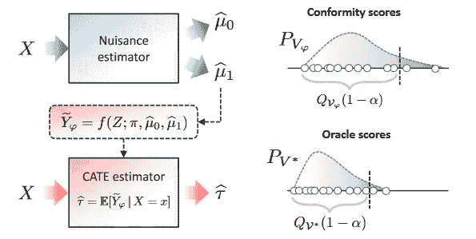
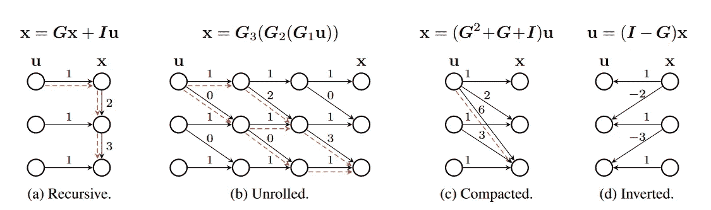
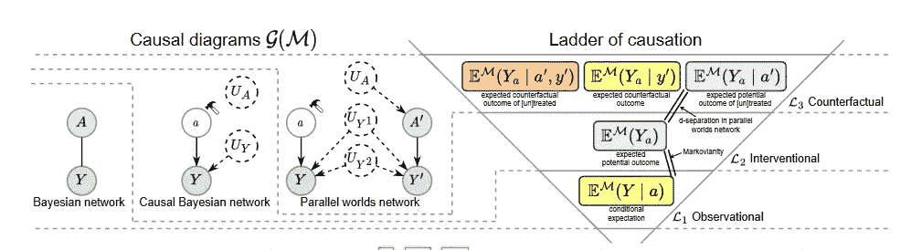
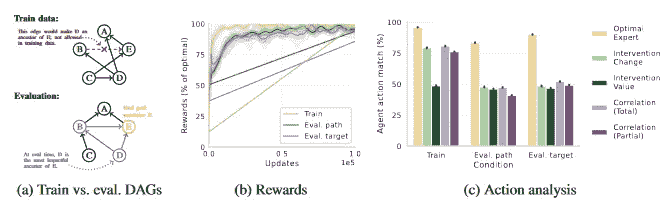
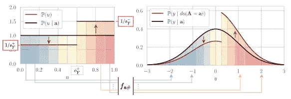

# 因果 Python：2023 年 NeurIPS 大会上的五个新颖因果观点

> 原文：[`towardsdatascience.com/causal-python-five-novel-causal-ideas-at-neurips-2023-13bb68c5ed56`](https://towardsdatascience.com/causal-python-five-novel-causal-ideas-at-neurips-2023-13bb68c5ed56)

## 令人兴奋的新想法，将因果关系与生成建模、保形预测和拓扑学结合起来。

 [Aleksander Molak](https://aleksander-molak.medium.com/?source=post_page-----13bb68c5ed56--------------------------------)

·发表于 [Towards Data Science](https://towardsdatascience.com/?source=post_page-----13bb68c5ed56--------------------------------) ·阅读时间 7 分钟·2023 年 9 月 24 日

--

图片来源：[**Pixabay** at **Pexels.com**](https://www.pexels.com/photo/binocular-blue-sky-daylight-discovery-221538/)

NeurIPS 被认为是全球最重要和最负盛名的人工智能和机器学习会议之一，因为其严格的论文审查过程和高质量的研究。

会议具有跨学科的关注点，涵盖了与开发智能系统和机器学习算法相关的广泛话题。

近年来，NeurIPS 大会上接受的与因果关系相关的论文数量呈指数增长。

在本文中，我们介绍了 2023 年会议上接受的五篇因果论文，这些论文引起了我的注意，带来了对该领域的重要新见解。

请注意，这是一个主观且肯定不完整的列表。原因之一是，在撰写时，NeurIPS 尚未发布会议接受论文的完整列表。

尽管如此，我相信下面介绍的论文中的想法有可能推动我们的领域向前发展。

开始吧！

# 保形元学习者

保形预测是一类不确定性量化技术，最初由 Vladimir Vovk 提出。

保形预测是无模型的（无需分布假设），并提供频率学覆盖保证。换句话说，它保证在*可交换性*假设下，真实结果将以高概率落入预测区间（或集合）¹。

**图 1.** 保形元学习者的描述。来源：[`bit.ly/44Z9U9L`](https://bit.ly/44Z9U9L)

在他们的新论文**《用于个体治疗效应预测推断的符合性元学习器》**中，Ahmed Alaa 及其同事提出了一种新的符合性元学习框架，该论文刚刚被 NeurIPS 2022 接受。

他们的方法使得直接推断目标参数（个体化治疗效应；**ITE**）成为可能，这是对先前方法的重要改进。

作者在一系列使用合成数据和半合成数据的实验中评估了该方法的性能，并以实现的覆盖率、均方根误差和区间长度来衡量性能。

结论？符合性*DR-learner*在大多数设置中表现优越。

该框架的一个局限性是它要求已知倾向评分，这在某些情况下可能是限制性的。

这项工作为将因果方法与符合性预测器提供的覆盖保证相结合开辟了一个令人兴奋的新方向。

🟡 阅读[**论文**](https://bit.ly/44Z9U9L)

🟡 查看[**代码**](https://bit.ly/3LBpwsX)

> * 想了解关于元学习器和 DR-learner 的内容？请查看[Causal Inference and Discovery in Python](https://amzn.to/3EQeRH9)的第九章和第十章，或者查看该书的免费[GitHub 仓库](https://bit.ly/3t3dulL)。

# 因果归一化流

归一化流是一类神经模型，通过将简单分布转换为复杂分布来表示复杂分布。

特别是，自回归归一化流将变量 X 的分布估计为其前面变量的函数。如果我们想要将一个变量表示为其前面变量的函数，我们首先需要以某种方式对这些变量进行排序。

请注意，这种设置类似于**结构性因果模型**（**SCM**），其中每个变量被表示为其父变量的函数。

**图 2**. 线性 SCM 的示例（a）以其通常的递归形式书写

公式；（b）没有递归，每一步都明确；（c）没有递归，作为一个单一的

函数；以及（d）将 u 写作 x 的函数。来源：[`bit.ly/3ZvwbuD`](https://bit.ly/3ZvwbuD)

归一化流以前曾用于因果发现（例如，**CAREFL**（Khemakhem 等，2021）用于**DECI**（Geffner 等，2022）；有关详细信息，请参见 Molak（2023），第十三章）。

在他们的新论文**《因果归一化流：从理论到实践》**中，Adrián Javaloy 及其同事将这些想法提升到了一个新水平。他们展示了在给定因果排序的情况下，因果模型可以从观察数据中识别，并使用归一化流进行恢复。

接下来，他们提出了一种在因果归一化流中实现*do*操作符的方法，这使我们能够回答干预性和反事实查询。

最后，他们在一个不完整图上的混合（连续/离散）数据上展示了他们方法的有效性。

真是一个令人兴奋的时代！

🟡 阅读[**论文**](https://bit.ly/3ZvwbuD)

🟡 查看[**代码**](https://bit.ly/3PQuBAe)

 ## 因果 Python — 提升你在 Python 中的因果发现技能（2023）

### …并解锁 Python 中最佳因果发现包的潜力！

[towardsdatascience.com

# 部分反事实识别的生成模型

反事实被置于 Pearl 的*因果阶梯*的第三层。

这使得它们最难处理，因为我们需要非常丰富的**结构因果模型**（**SCM**）描述，以解决反事实查询。

**图 3.** Pearl 因果阶梯的符号表示。反事实查询需要 SCM 的最丰富表示。来源：[`bit.ly/45UzGgx`](https://bit.ly/45UzGgx)

所谓的*符号可识别性*并不总是可用，其他可以使回答反事实查询可行的假设（例如单调性）在某些场景下可能难以满足，或仅在离散情况下有效。

Valentyn Melnychuk 及其同事的新论文**《具有曲率敏感性模型的连续结果的部分反事实识别》**提出了一种超越这些限制的新方法。

作者从拓扑学的角度（有关早期工作的参考见例如 Ibeling & Icard, 2021）来看待这一挑战，并提出了一种曲率敏感性模型（**CSM**），允许进行部分反事实识别。

连续结果。

换句话说，该方法使我们能够在没有关于数据生成过程的完整信息时，为连续结果下的反事实查询找到有信息量的界限。

作者建议，解决方案所依赖的假设应在从物理学到医学的广泛用例中是现实的，并且该方法在安全关键环境中的决策中具有潜在的相关性。

作为附注：所提出的方法还依赖于归一化流。

🟡 阅读[**论文**](https://bit.ly/45UzGgx)

🟡 查看[**代码**](https://bit.ly/3t65znM)

# 被动数据、主动因果策略和语言模型

如果你关注我在[LinkedIn](https://bit.ly/3RycjoP)或[Twitter/X](https://bit.ly/3rzaY6i)，你可能会记得关于这篇论文的[帖子](https://bit.ly/46pTI2c)。

实际上，这篇论文是激励我和我的同事组织**AAAI 2024** [关于大型语言模型和因果性的研讨会](https://bit.ly/3rj5f4K)的论文之一。

但是，言归正传！

**图 4.** 因果 DAG 环境和实验结果。(a) 施加的约束

在创建训练数据集时，以及在测试时评估代理时，因果 DAG 结构

结构。在训练期间，D 不允许成为 E 的祖先（即使是间接的），尽管它们

可能由于混淆变量而相关。在评估环境中，D 是最有影响力的

E 的祖先（见文本）。(b) 在互动设置中评估时，代理获得的奖励，作为

最优奖励的百分比。在这两种评估设置中，代理仍然接近最优

奖励。© 更详细地分析代理的行为，通过绘制代理的比例

与最优行为相匹配的行动，或基于干预或

相关统计数据。代理的策略与最优策略的匹配显著更接近。

与启发式基准匹配。来源：[`bit.ly/3Rt4cd3`](https://bit.ly/3Rt4cd3)

在他们的论文**《代理和语言模型中的被动学习主动因果策略》**中，DeepMind 的 Andrew Lampinen 和同事们展示了代理和（大规模）语言模型（**LLM**s）可以从被动（观察）数据中学习主动因果策略。

这些策略可以泛化到分布外的数据（！），但*仅*在某些条件下。

正如作者提出的，代理“*获得了用于发现和利用因果结构的可泛化策略，只要他们可以在测试时进行干预*”。

提示中的解释对 LLMs 的泛化能力至关重要。此工作并不意味着被动学习超越主动学习或完全解决 LLMs 中的混淆。然而，它标志着扩展语言模型因果能力的重要一步。

我迫不及待想看到更多的研究继续在这个激动人心的路径上前进！

🟡 阅读 [**论文**](https://bit.ly/3Rt4cd3)

# 广义敏感性分析

当我们不能排除存在隐藏混淆的可能性时，敏感性分析对于因果分析师至关重要。

传统的敏感性分析方法通常存在局限性（例如，它们假设线性模型或单一的二元处理）。

在他们的新论文中*，* **《广义因果敏感性分析的锐界》**，*Dennis Frauen 和同事们提出了一种新的统一

用于未观察混淆下因果敏感性分析的框架。

**图 5.** 在所提出模型下的干预分布界限。来源：[`bit.ly/3PLVBkl`](https://bit.ly/3PLVBkl)

该框架为一系列因果效应提供了锐界，包括（条件）平均处理效应（**CATE**）、中介效应、路径分析和分布效应。

此外，所提出的方法适用于离散、连续和时间变化的处理。

最棒的部分？论文附带了一个丰富的代码库。

引用 [Károly Zsolnai-Fehér](https://users.cg.tuwien.ac.at/zsolnai/):

*真是一个活着的好时光！*

🟡 阅读 [**论文**](https://bit.ly/3PLVBkl)

🟡 检查 [**代码**](https://bit.ly/3rp0UNg)

[## 因果 Python || 你学习 Python 中因果关系的首选资源](https://causalpython.io/?source=post_page-----13bb68c5ed56--------------------------------)

### 每周免费邮件关于因果关系和机器学习

[causalpython.io](https://causalpython.io/?source=post_page-----13bb68c5ed56--------------------------------)

# 脚注

¹ 在这里，***可交换性***的含义与潜在结果框架中的不同。我们可以将其视为 IID 假设的一个较温和版本。有关更多细节，请参见 [这里](https://bit.ly/3rtcjvB)。

# 参考文献

Geffner, T., Antorán, J., Foster, A., Gong, W., Ma, C., Kıcıman, E., Sharma, A., Lamb, A., Kukla, M., Pawlowski, N., Allamanis, M., & Zhang, C. (2022). 深度端到端因果推断。*arXiv*

Ibeling, D., Icard, T. (2021). 关于因果推断的拓扑视角。*第 35 届神经信息处理系统大会*。

Khemakhem, I., Monti, R., Leech, R. & Hyvarinen, A. (2021). 因果自回归流。*第 24 届国际人工智能与统计会议论文集*，在*机器学习研究论文集*，130，3520–3528\. [`proceedings.mlr.press/v130/khemakhem21a.html`](https://proceedings.mlr.press/v130/khemakhem21a.html)。

Molak, A. (2023). *Python 中的因果推断与发现：解锁现代因果机器学习的秘密，包括 DoWhy、EconML、PyTorch 等*。Packt Publishing。
