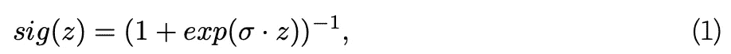
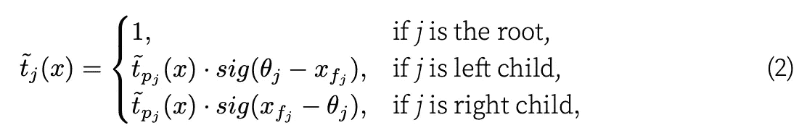
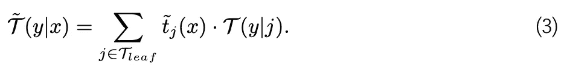
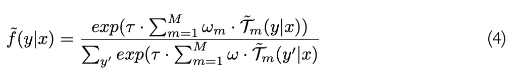
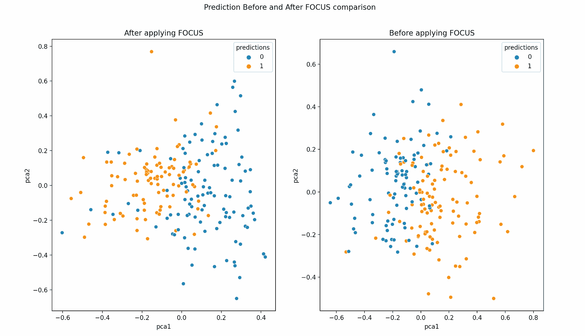

# CFXplorer：反事实解释生成 Python 包

> 原文：[`towardsdatascience.com/cfxplorer-counterfactual-explanation-generation-python-package-483ca4221ab8`](https://towardsdatascience.com/cfxplorer-counterfactual-explanation-generation-python-package-483ca4221ab8)

## 介绍了一款用于生成基于树的算法反事实解释的 Python 包

[](https://medium.com/@kyosuke1029?source=post_page-----483ca4221ab8--------------------------------)[](https://towardsdatascience.com/?source=post_page-----483ca4221ab8--------------------------------) [Kyosuke Morita](https://medium.com/@kyosuke1029?source=post_page-----483ca4221ab8--------------------------------)

·发表于[Towards Data Science](https://towardsdatascience.com/?source=post_page-----483ca4221ab8--------------------------------) ·阅读时间 9 分钟·2023 年 8 月 17 日

--

随着机器学习模型在现实场景中的应用日益增多，对模型可解释性的重视也在不断增加。了解模型如何做出决策不仅对模型的用户有益，也对受到模型决策影响的人员有所帮助。**反事实解释**的出现就是为了解决这个问题，因为它允许个人了解通过改变原始数据如何能获得理想的结果。在短期内，反事实解释可能会为那些受到机器学习模型决策影响的人员提供可行的建议。例如，一个被拒绝贷款申请的人可以知道这次该做些什么来被接受，这将有助于他们在下次申请中改进。

Lucic 等人[1]提出了 FOCUS，它旨在为树基机器学习模型中的所有实例生成与原始数据的最优距离反事实解释。

CFXplorer 是一个使用 FOCUS 算法为给定模型和数据生成反事实解释的 Python 包。本文介绍并展示了如何使用 CFXplorer 生成反事实解释。

# 链接

GitHub 仓库：[`github.com/kyosek/CFXplorer`](https://github.com/kyosek/CFXplorer)

文档：[`cfxplorer.readthedocs.io/en/latest/?badge=latest`](https://cfxplorer.readthedocs.io/en/latest/?badge=latest)

PyPI：[`pypi.org/project/CFXplorer/`](https://pypi.org/project/CFXplorer/)

# 目录

1.  FOCUS 算法

1.  CFXplorer 示例

1.  限制

1.  结论

1.  参考文献


照片由 [Wesley Sanchez](https://unsplash.com/@wesleycs12?utm_source=medium&utm_medium=referral) 提供，来源于 [Unsplash](https://unsplash.com/?utm_source=medium&utm_medium=referral)

# 1\. FOCUS 算法

本节简要介绍了 FOCUS 算法。

生成反事实解释的问题已经被一些现有方法解决。Wachter、Mittelstadt 和 Russell [2] 将这个问题形式化为优化框架，但这种方法仅限于可微分模型。FOCUS 旨在通过引入概率模型近似，将框架扩展到非可微分模型，特别是基于树的算法。该方法的一个关键方面是对预训练基于树的模型（表示为 *f*）的近似，通过用具有参数 *σ* 的 sigmoid 函数替换每棵树中的每个分裂来实现，参数 *σ* 定义为：



其中 *σ ∈ R>0*。

这个 sigmoid 函数被纳入了函数 *t ̃_j(x)* 中，该函数近似了树模型 *f* 的节点 *j* 激活 *t_j(x)* 对于给定输入 *x*。该函数定义为：



其中 θ_j 是节点 *j* 的激活阈值。

该方法近似于单棵决策树 *T*。树的近似可以定义为：



此外，该方法将* f* 的最大操作，即由权重 *ω_m ∈ R* 的*M*棵树的集合替换为带有温度 *τ ∈ R>0* 的 softmax 函数。因此，近似的 *f ̃* 可以表示为：



重要的是要注意，这种近似方法可以应用于任何基于树的模型。

FOCUS 算法的主要声明是该方法能够 (i) 为数据集中所有实例生成反事实解释，并且 (ii) 为基于树的算法找到更接近原始输入的反事实解释，比现有框架更优。

# 2\. CFXplorer 示例

本节展示了如何使用 CFXplorer 包的两个示例。第一个是一个简单示例，您可以了解包的基本用法。第二个示例展示了如何通过使用 Optuna [3] 包来搜索 FOCUS 的最佳超参数。正如本文章在前面部分所述，FOCUS 有一些超参数。这些超参数可以通过与超参数调优包集成来优化。

## 2.1\. 简单示例

在这个简单示例中，我们创建随机数据、决策树模型，并使用 CFXplorer 生成反事实解释。Python 包 CFXplorer 通过使用 FOCUS 算法生成反事实解释。本节演示了如何使用这个包来实现这一点。

**安装**

您可以使用 pip 安装该包：

```py
pip install CFXplorer
```

首先，导入相关包。

```py
import matplotlib.pyplot as plt
import numpy as np
import pandas as pd
import seaborn as sns

from cfxplorer import Focus
from sklearn.datasets import make_classification
from sklearn.decomposition import PCA
from sklearn.model_selection import train_test_split
from sklearn.preprocessing import MinMaxScaler
from sklearn.tree import DecisionTreeClassifier
```

我们创建一个虚拟数据集以供决策树模型使用。

```py
def generate_example_data(rows: int = 1000):
    """
    Generate random data with a binary target variable and 10 features.

    Args:
        rows (int): The number of rows in the generated dataset.

    Returns:
        pandas.DataFrame: A DataFrame containing the randomly generated data.

    """
    X, y = make_classification(
        n_samples=rows, n_features=10, n_classes=2, random_state=42
    )

    return train_test_split(X, y, test_size=0.2, random_state=42)
```

CFXplorer 只接受标准化的特征值（在 0 和 1 之间），因此我们需要对其进行缩放。

```py
def standardize_features(x_train, x_test):
    """
    Standardizes the features of the input data using Min-Max scaling.

    Args:
        x_train (pandas.DataFrame or numpy.ndarray): The training data.
        x_test (pandas.DataFrame or numpy.ndarray): The test data.

    Returns:
        tuple: A tuple containing two pandas DataFrames.
            - The first DataFrame contains the standardized features of the training data.
            - The second DataFrame contains the standardized features of the test data.
    """
    # Create a MinMaxScaler object
    scaler = MinMaxScaler(feature_range=(0, 1))

    # Fit and transform the data to perform feature scaling
    scaler = scaler.fit(x_train)
    scaled_x_train = scaler.transform(x_train)
    scaled_x_test = scaler.transform(x_test)

    # Create a new DataFrame with standardized features
    standardized_train = pd.DataFrame(scaled_x_train)
    standardized_test = pd.DataFrame(scaled_x_test)

    return standardized_train, standardized_test
```

现在训练决策树模型。

```py
def train_decision_tree_model(X_train, y_train):
    """
    Train a decision tree model using scikit-learn.

    Args:
        X_train (array-like or sparse matrix of shape (n_samples, n_features)): The training input samples.
        y_train (array-like of shape (n_samples,)): The target values for training.

    Returns:
        sklearn.tree.DecisionTreeClassifier: The trained decision tree model.

    """
    # Create and train the decision tree model
    model = DecisionTreeClassifier(random_state=42)
    model.fit(X_train, y_train)

    return model
```

我们将上述所有内容结合起来运行。

```py
 X_train, X_test, y_train, y_test = generate_example_data(1000)
  X_train, X_test = standardize_features(X_train, X_test)
  model = train_decision_tree_model(X_train, y_train)
```

一旦我们获得了数据和模型，我们初始化`Focus`。Focus 需要几个参数进行定制。但为了简单起见，在这个例子中，我们可以使用迭代次数和距离函数。

```py
focus = Focus(
      num_iter=1000,
      distance_function="cosine",
  )
```

> FOCUS 的其他参数是；

```py
distance_function: str, optional (default="euclidean")
    Distance function - one of followings;
        - "euclidean"
        - "cosine"
        - "l1"
        - "mahalabobis"

optimizer: Keras optimizer, optional (default=tf.keras.optimizers.Adam())
    Optimizer for gradient decent

sigma: float, optional (default=10.0)
    Sigma hyperparameter value for hinge loss

temperature: float, optional (default=1.0)
    Temperature hyperparameter value for hinge loss

distance_weight: float, optional (default=0.01)
    Weight hyperparameter for distance loss

lr: float, optional (default=0.001)
    Learning rate for gradient descent optimization

num_iter: int, optional (default=100)
    Number of iterations for gradient descent optimization

direction: str, optional (default="both")
    Direction of perturbation (e.g. both, positive and negative)

hyperparameter_tuning: bool, optional (default=False)
    if True, generate method returns unchanged_ever and mean_distance

verbose: int, optional (default=1)
    Verbosity mode.
        - 0: silent
        - else: print current number of iterations
```

最后，我们可以使用`generate`方法生成反事实解释。

```py
perturbed_feats = focus.generate(model, X_test, X_train)
```

我们可以在图中检查这些生成的反事实解释。

```py
def plot_pca(plot_df, focus_plot_df):
    """
    Plots the PCA-transformed features and corresponding predictions before and after applying FOCUS.

    Args:
        plot_df (pandas.DataFrame): A DataFrame containing the PCA-transformed features and
            predictions before applying FOCUS.
        focus_plot_df (pandas.DataFrame): A DataFrame containing the PCA-transformed features and
            predictions after applying FOCUS.

    Returns:
        None: This function displays the plot but does not return any value.
    """
    fig, axes = plt.subplots(1, 2, figsize=(20, 8))
    sns.scatterplot(
        data=focus_plot_df, x="pca1", y="pca2", hue="predictions", ax=axes[0]
    )
    axes[0].set_title("After applying FOCUS")
    sns.scatterplot(data=plot_df, x="pca1", y="pca2", hue="predictions", ax=axes[1])
    axes[1].set_title("Before applying FOCUS")
    fig.suptitle("Prediction Before and After FOCUS comparison")
    plt.show()

plot_df, focus_plot_df = prepare_plot_df(model, X_test, perturbed_feats)
plot_pca(plot_df, focus_plot_df)
```

它看起来像这样：



我们可以观察到，在应用 FOCUS 之前，许多预测== 1 位于右侧，但应用 FOCUS 后，它们变成了预测== 0。对于在 FOCUS 之前的预测== 0，它们位于左侧，并变成预测== 1。

## 2.2\. 超参数优化

主要有四个 FOCUS 的超参数，具体来说，sigma（方程 1）、温度（方程 4）、距离权重，它是距离损失和预测损失之间的权衡参数，以及 Adam 的学习率[4]。

*注意 1：在这个例子中，我们将使用决策树模型，因此我们不会使用* `*temperature*` *超参数。*

*注意 2：你可以将优化算法（这里使用的是* `*Adam*` *）视为一个超参数，但我们不会在本节中优化它，其他* `*Adam*` *的超参数也同样如此，除了学习率为了简单起见。*

本节使用 Optuna 来优化 FOCUS 的超参数。Optuna 是一个强大的超参数优化工具，执行贝叶斯优化。除了 Optuna，我们还可以再次使用我们之前创建的相同函数；`generate_example_data`、`standardize_features`和`train_decision_tree_model`。

以下是目标函数。它定义了要调整的超参数以及优化目标。在这个例子中，我们在`Focus`类中调整 3 个超参数，即 sigma、距离权重和 Adam 优化器的学习率。这些超参数的搜索空间被定义为`trial.suggest_float`或`trial.suggest_int.` 损失函数定义为`cfe_distance /100 + pow(unchanged_ever, 2).` 这样做的原因，如函数的文档字符串中所写，我们希望优先找到反事实解释，而不是最小化平均距离。因此，我们取未改变实例的平方数。

*注意：重要的是要将`*Focus*`类的`*hyperparameter_tuning*`参数设置为`*True*`。* 否则，它不会返回未改变实例的数量和平均反事实解释距离。

```py
import optuna
import tensorflow as tf

from cfxplorer import Focus

def objective(trial):
    """
    This function is an objective function for
    hyperparameter tuning using optuna.
    It explores the hyperparameter sets and evaluates the result on a
    given model and dataset

    Mean distance and number of unchanged instances are
    used for the evaluation.

    Args:
    trial (optuna.Trial):
    Object that contains information about the current trial,
    including hyperparameters.

    Returns:
    Mean CFE distance + number of unchanged instances squared -
    This is the objective function for hyperparameter optimization

    * Note: typically we want to minimise a number of unchanged first,
        so penalising the score by having squared number.
    Also, to not distort this objective,
    having the mean distance divided by 100.
    """
    X_train, X_test, y_train, y_test = generate_example_data(1000)
    X_train, X_test = standardize_features(X_train, X_test)
    model = train_decision_tree_model(X_train, y_train)

    focus = Focus(
        num_iter=1000,
        distance_function="euclidean",
        sigma=trial.suggest_int("sigma", 1, 20, step=1.0),
        temperature=0,  # DT models do not use temperature
        distance_weight=round(
            trial.suggest_float("distance_weight", 0.01, 0.1, step=0.01), 2
        ),
        lr=round(trial.suggest_float("lr", 0.001, 0.01, step=0.001), 3),
        optimizer=tf.keras.optimizers.Adam(),
        hyperparameter_tuning=True,
        verbose=0,
    )

    best_perturb, unchanged_ever, cfe_distance = focus.generate(model, X_test)

    print(f"Unchanged: {unchanged_ever}")
    print(f"Mean distance: {cfe_distance}")

    return cfe_distance / 100 + pow(unchanged_ever, 2)
```

一旦我们定义了目标函数，就可以开始调整这些超参数。

```py
if __name__ == "__main__":
    study = optuna.create_study(direction="minimize")
    study.optimize(objective, n_trials=100)

    print(f"Number of finished trials: {len(study.trials)}")

    trial = study.best_trial

    print("Best trial:")
    print("  Value: {}".format(trial.value))
    print("  Params: ")
    for key, value in trial.params.items():
        print("    {}: {}".format(key, value))
```

更全面的示例可以在[软件包仓库](https://github.com/kyosek/CFXplorer/tree/master/examples)中找到。

# 4\. 限制

Focus 类存在几个限制。以下是这些限制的列表：

+   目前，Focus 类仅适用于 scikit-learn 的 `DecisionTreeClassifier`、`RandomForestClassifier` 和 `AdaBoostClassifier`。

+   虽然类别特征可以包含在特征集中，但需要注意的是，类别特征变化的解释，例如从年龄 40 变为 20，可能不会提供有意义的见解。

+   在应用 Focus 之前，输入特征应缩放到 0 和 1 的范围。因此，在使用 Focus 之前，有必要对特征进行转换。然而，这种缩放过程可能在应用 Focus 后解释特征时引入一些额外的复杂性。

+   计算成本会随着给定模型的增大而增加。当你有一个大型模型时，可能无法执行代码。

# 5\. 结论

CFXplorer Python 包提供了对 FOCUS 算法的全面使用，以生成给定基于树的算法的反事实解释的最优距离。尽管存在一些限制，但对于那些希望在基于树的模型中探索反事实结果的人来说，这个包应该是有用的。

本文回顾了 FOCUS 算法的理论背景，代码示例展示了如何使用 CFXplorer，以及一些当前的限制。未来，我将为这个包添加更多的反事实解释生成方法。

希望你觉得这篇文章有用。

# 6\. 参考文献

1.  A. Lucic, H. Oosterhuis, H. Haned, 和 M. de Rijke. “FOCUS: 灵活可优化的树集成反事实解释。” 载于：AAAI 人工智能会议论文集。第 36 卷，第 5 期，2022 年，页 5313–5322。

1.  S. Wachter, B. Mittelstadt, 和 C. Russell. “不打开黑箱的反事实解释：自动决策与 GDPR。” 载于：Harv. JL & Tech. 第 31 卷 (2017)，页 841。

1.  T. Akiba, S. Sano, T. Yanase, T. Ohta, 和 M. Koyama. “Optuna: 下一代超参数优化框架。” 载于：第 25 届 ACM SIGKDD 国际知识发现与数据挖掘会议论文集。2019 年，页 2623–2631。

1.  D. P. Kingma 和 J. Ba. “Adam: 一种随机优化方法。” 载于：arXiv 预印本 arXiv:1412.6980 (2014)。
