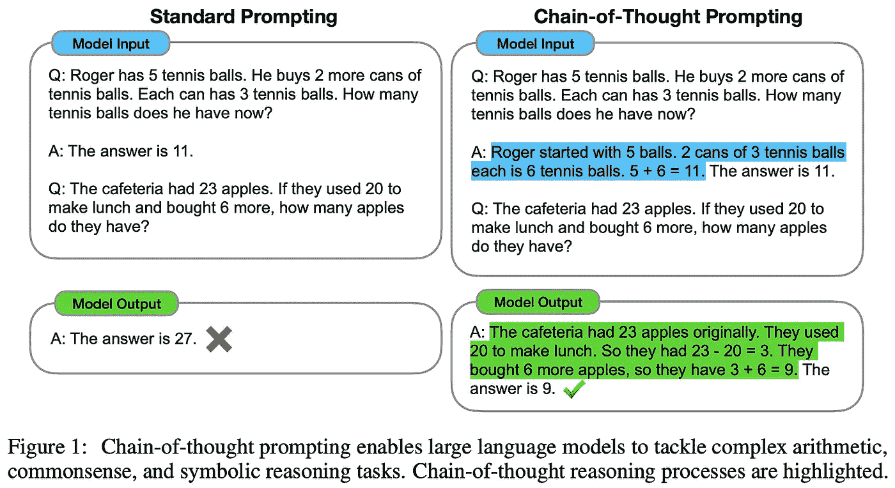
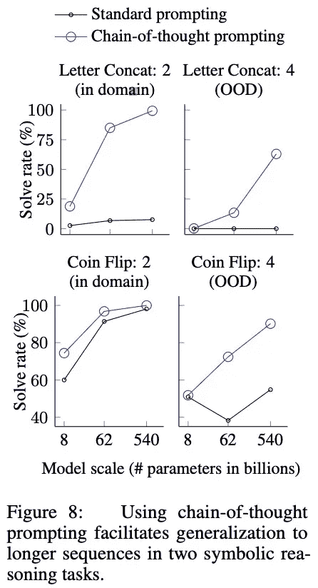

# LLMs 的思维链提示

> 原文：[`towardsdatascience.com/chain-of-thought-prompting-for-llms-33c963eead38`](https://towardsdatascience.com/chain-of-thought-prompting-for-llms-33c963eead38)

## 一个实用且简单的“推理”方法与 LLMs

 [Cameron R. Wolfe, Ph.D.](https://wolfecameron.medium.com/?source=post_page-----33c963eead38--------------------------------)

·发表于 [Towards Data Science](https://towardsdatascience.com/?source=post_page-----33c963eead38--------------------------------) ·阅读时长 16 分钟·2023 年 7 月 24 日

--

（照片由 [Matthew Lancaster](https://unsplash.com/@matthewelancaster?utm_source=unsplash&utm_medium=referral&utm_content=creditCopyText) 提供，来自 [Unsplash](https://unsplash.com/s/photos/chain?utm_source=unsplash&utm_medium=referral&utm_content=creditCopyText)）

大型语言模型（LLMs）的成功源于我们能够在大量文本语料库上进行预训练（使用[语言建模目标](https://cameronrwolfe.substack.com/i/85568430/language-modeling)）[仅解码器变换器](https://twitter.com/cwolferesearch/status/1640446111348555776?s=20)模型。考虑到我们对足够大的模型进行预训练，LLMs 在[少量样本学习](https://cameronrwolfe.substack.com/i/88082618/language-models-are-few-shot-learners)方面表现出色。换句话说，这意味着我们可以通过简单地制定一个文本提示（可能包含一些正确输出的示例）并让 LLM 生成正确答案来解决各种不同的问题（例如，翻译、句子分类、摘要等）。

尽管 LLMs 非常强大，但这些模型仍然存在一些持续难以解决的问题。特别是，推理问题（例如，算术或常识推理）特别困难。最初的尝试是通过对监督数据集中的各种推理问题的解决方案和解释进行微调 LLMs 和任务特定的验证模块 [3, 4]。然而，最近的研究发现可以利用少量样本学习来找到更简单的解决方案。

> “本文的目标是赋予语言模型生成思维链的能力——一系列连贯的中间推理步骤，这些步骤将引导到问题的最终答案。” *— 来源于 [1]*

特别是，链式思维（CoT）提示 [1] 是一种新提出的技术，通过少样本学习提升 LLM 在基于推理的任务上的表现。类似于标准的提示技术，CoT 提示将多个推理问题的示例解决方案插入到 LLM 的提示中。然后，每个示例都配有一系列思维链，即解决问题的中间推理步骤。LLM 然后以少样本的方式学习在解决推理问题时生成类似的思维链。这种方法使用最少的数据（即仅几个示例进行提示），无需特定任务的微调，并显著提高了 LLM 在基于推理的基准测试上的表现，尤其是对于较大的模型。

（来自 [1, 11]）

# 核心概念

要理解 CoT 提示，我们需要对 [LLMs](https://twitter.com/cwolferesearch/status/1639378997627826176?s=20) 和 [它们的工作原理](https://twitter.com/cwolferesearch/status/1635693551584522256?s=20)有一个基本了解。幸运的是，我们在之前的综述中已经广泛覆盖了这个话题：

+   语言模型简介 [[link](https://cameronrwolfe.substack.com/p/language-models-gpt-and-gpt-2)]

+   GPT-3 和语言模型的扩展定律 [[link](https://cameronrwolfe.substack.com/p/language-model-scaling-laws-and-gpt)]

+   现代 LLMs [[link](https://cameronrwolfe.substack.com/p/modern-llms-mt-nlg-chinchilla-gopher)]

+   专门化的 LLMs [[link](https://cameronrwolfe.substack.com/p/specialized-llms-chatgpt-lamda-galactica)]

本节将不会涵盖大语言模型（LLMs）的基础知识。相反，我们将专注于提高对提示和少样本学习的理解，并探讨这些技术如何被用来解决这些模型的核心限制：*它们无法解决推理任务*。

## 提示和少样本学习

在 [GPT](https://cameronrwolfe.substack.com/i/85568430/improving-language-understanding-by-generative-pre-training-gpt) 和 [GPT-2](https://cameronrwolfe.substack.com/i/85568430/language-models-are-unsupervised-multitask-learners-gpt) 等语言模型提出后，我们知道通过 [自监督](https://cameronrwolfe.substack.com/i/74325854/self-supervised-pre-training) 的下一词预测（或 [语言建模](https://cameronrwolfe.substack.com/i/85568430/language-modeling)）目标是非常强大的。然而，如何将这些通用的 [基础模型](https://cameronrwolfe.substack.com/i/85568430/creating-foundation-models) 适配到特定的下游任务上并不十分明确。例如，GPT 在下游任务上微调模型，而 GPT-2 以零样本的方式解决问题；见下文。

（来自 [2]）

在提出 [GPT-3](https://cameronrwolfe.substack.com/i/88082618/language-models-are-few-shot-learners) [2] 后，我们看到足够规模的 LLM 可以非常好地进行少样本学习。在通过语言建模目标进行预训练后，GPT-3（一个 1750 亿参数的 LLM）被发现能够准确地解决各种不同的语言任务，而无需任何微调。我们可以用提示方法代替微调。

更具体地说，提示利用了语言模型的文本到文本结构，通过提供如下输入：

+   “将这个句子翻译成英语：`<sentence> =>`”

+   “总结以下文档：`<document> =>`”。

这些任务解决“提示”使得在语言模型中进行零样本（即，不查看正确输出的示例；见上文）或少样本（即，在提示中插入一些正确输出的示例；见下文）推理成为可能。语言模型的最合适输出应该能够解决任务（例如，总结文档或完成推理任务），这意味着我们可以通过准确的下一个标记预测来解决各种问题！

（来自 [1, 2]）

我们可以通过提示做很多事情。事实上，最近创建了一个专门的[提示工程](https://www.promptingguide.ai/)领域，研究如何优化提示的措辞或结构以提高 LLM 性能。但是，*敏感性是这个发展中的领域中的一个重要考虑因素*。LLM 的性能可能会因为输入提示的微小扰动而发生巨大变化（例如，少样本示例的排列导致 GPT-3 在 [SST-2](https://huggingface.co/datasets/sst2) [13] 上的准确率从 93.4% 降低到 54.3%）。因此，在我们对提示方法的研究中，我们旨在找到* i)* 表现良好且 *ii)* 不受敏感性影响的技术。

## 我们能通过扩大规模来解决推理问题吗？

如上所述，LLM 的少样本学习性能随着规模的增加而改善，但大模型并不是我们所需要的一切。强大的 LLM 需要与大规模预训练数据集的[组合](https://twitter.com/cwolferesearch/status/1603837192346165248?s=20) [14]。考虑到这一点，我们可能会问自己：*LLM 在基于推理的数据集上的表现如何？随着规模的扩大，LLM 是否在推理方面变得更好？*

> “单独扩大模型规模并不足以在如算术、常识和符号推理等具有挑战性的任务上取得高性能”*— 来源于 [1]*

有趣的是，我们发现使用更大的模型和预训练数据集并不会改善 LLM 的推理能力（例如，参见[Gopher](https://cameronrwolfe.substack.com/i/91134599/scaling-language-models-methods-analysis-and-insights-from-training-gopher) [15]的分析）。事实上，这些模型因无法解决基本推理任务而受到严厉批评。因此，许多研究人员声称 LLM 只是[重复训练数据](https://twitter.com/cwolferesearch/status/1643388671456886788?s=20)，而没有进行任何复杂的推理或分析。无论如何，本概述将重点关注试图解决这一问题并使 LLM 更容易解决基本推理任务的提示技术。

（来自[4]）

**先前的方法。** 在进一步了解我们如何帮助 LLM 解决推理问题之前，了解这个领域中的先前方法是有用的。算术、常识和符号推理任务的基线技术执行任务特定的微调，即模型在每个推理问题的监督示例上进行训练。更进一步，最佳方法是训练一个补充的“验证”模块，该模块可以判断 LLM 在推理任务中的输出正确性[4]。在测试时，这个验证器可以在生成多个问题答案后推断出最佳可能的输出；参见上述内容。

尽管这些技术在某些情况下可能效果相对较好，但由于一些原因，它们有其局限性：

1.  需要进行任务特定的微调。

1.  模型架构必须针对每个任务进行适应（即，通过验证模型）。

1.  必须收集大量的监督数据。

考虑到这些限制，显而易见，使用仅基于提示的方法（例如，CoT 提示）来解决推理任务将会简单得多。我们可以避免微调，保持相同的模型架构，收集更少的数据，并用一个单独的预训练模型检查点解决许多任务。

## 一些显著的 LLM…

CoT 提示是一种提示技术，旨在提高预训练 LLM 的少样本学习性能。在[1]中，使用了一个特定组的 LLM 进行评估，下面列出了这些模型并进行了说明。

+   [GPT-3](https://cameronrwolfe.substack.com/i/88082618/language-models-are-few-shot-learners) [2]：一个拥有 1750 亿参数的预训练 LLM，使用标准语言建模目标进行训练。

+   [LaMDA](https://cameronrwolfe.substack.com/i/93578656/lamda-language-modeling-for-dialog-applications) [5]：一个基于 LLM 的对话模型，使用语言建模目标进行预训练，然后在对话数据和人工反馈上进行微调（存在 422M、2B、8B、68B 和 137B 等不同规模的模型）。

+   [PaLM](https://cameronrwolfe.substack.com/p/palm-efficiently-training-massive) [6]：一个使用标准语言建模目标、Google 的 [Pathways](https://blog.google/technology/ai/introducing-pathways-next-generation-ai-architecture/) 框架和大规模文本语料库进行预训练的 LLM（存在 8B、62B 和 540B 尺寸的模型）。

+   [Codex](https://cameronrwolfe.substack.com/i/93578656/evaluating-large-language-models-trained-on-code) [7]：一个具有 120 亿参数的 LLM，它在使用标准语言建模目标进行预训练后，针对 GitHub 上的公开 Python 代码进行了微调。

+   UL2–20B [8]：一个使用 [Mixture-of-Denoisers (MoD)](https://syncedreview.com/2022/05/13/googles-universal-pretraining-framework-unifies-language-learning-paradigms/) 目标进行预训练的 LLM，这是一个在许多数据集和设置中表现良好的统一目标。

除了这些 LLM，我们还在近期的综述中了解到其他模型（例如，[LLaMA](https://cameronrwolfe.substack.com/p/llama-llms-for-everyone)、[LLaMA 扩展](https://cameronrwolfe.substack.com/p/llama-llms-for-everyone) 和 [T5](https://cameronrwolfe.substack.com/p/t5-text-to-text-transformers-part-354)）。

# 思维链提示

（来源于 [1]）

尽管我们可能对提示的概念有一定了解，但*CoT 提示是什么？* CoT 仅指一种特定的提示技术，它将思维链（即一系列中间推理步骤）插入到 LLM 的提示中；见上文。对于足够大的模型（>1000 亿参数），这种方法显著提升了 LLM 在算术、常识和符号推理任务中的复杂推理能力。

**CoT 提示的来源是什么？** 在 CoT 提示提出之前，我们已经知道少样本学习对 LLM 极其强大；见下文。我们不是 [fine-tuning](https://cameronrwolfe.substack.com/i/85568430/improving-language-understanding-by-generative-pre-training-gpt) LLM 以执行任务，而是“提示”一个通用模型，给出几个正确输出的例子，然后生成最终答案。这种方法在许多任务中 [非常成功](https://cameronrwolfe.substack.com/i/88082618/language-models-are-few-shot-learners)。

使用少样本提示进行上下文学习（来源于 [2]）

此外，我们从相关研究中了解到，生成自然语言的推理来解释如何得出最终答案对算术推理任务有益。我们可以训练或微调模型来生成这些推理 [3, 4]，但这需要创建一个用于不同推理任务的高质量推理数据集，这既昂贵又耗时！

> “仅依靠提示的方法很重要，因为它不需要大量的训练数据集，而且单个模型可以在不丧失通用性的情况下执行许多任务。” *— 来自 [1]*

*CoT 提示法结合了少量示例提示的优势和生成自然语言推理的好处*。我们不需要额外的训练或微调，只需将一些推理示例（即思维链）插入到提示中，就可以让 LLM 通过少量示例学习生成类似的推理。

## CoT 提示法是如何工作的？

当我们作为人类解决推理任务时，通常会将问题拆分为更小的任务。例如，我在计算在餐厅想要给多少小费时通常会这样做：

+   取账单总额：$56.00

+   计算总额的 10%：$5.60

+   将这个值乘以 2（产生 20%的小费）：$11.20

尽管这个例子很简单，但这一理念可以扩展到我们作为人类解决的各种心理推理任务中。我们生成一个思维链（在[1]中定义为“引导问题最终答案的连贯中间推理步骤序列”）来解决这些任务。简单来说，*CoT 提示法增强了 LLM 生成类似思维链的能力*。

> “我们探索语言模型在推理任务中进行少量示例提示的能力，前提是提示由三元组组成：[输入，思维链，输出]。” *— 来自 [1]*

下方展示了结合思维链解决的各种推理任务的示例。

（来自 [1]）

**学习思维链。** 为了教导 LLM 生成问题解决的推理，我们可以将这些推理示例直接插入到提示中。然后，LLM 可以利用其少量示例学习能力在解决任何推理问题时生成类似的思维链。如下所示，提示通常包含几个思维链示例。

（来自 [1]）

[1]中的作者发现，这种提示方法使 LLM 在解决问题时生成类似的思维链，这有助于推理能力，并具有几个显著的好处：

+   *可解释性*：LLM 生成的思维链可以用来更好地理解模型的最终答案。

+   *适用性*：CoT 提示法可以用于任何可以通过语言由人类解决的任务。

+   *提示*：不需要对任何 LLM 进行训练或微调。我们只需将一些 CoT 示例插入提示中即可！

此外，LLM 甚至可以通过生成更多步骤的思维链来分配更多计算资源给复杂的推理问题。这模仿了我们作为人类通常会做的事情！

## CoT 提示法极其有益

为了评估 CoT 提示对 LLM 解决推理问题能力的影响，CoT 提示在算术、常识和符号推理基准上进行了测试。评估使用了几个不同的预训练 LLM，包括 [GPT-3](https://cameronrwolfe.substack.com/i/88082618/language-models-are-few-shot-learners) [2]、[LaMDA](https://cameronrwolfe.substack.com/i/93578656/lamda-language-modeling-for-dialog-applications) [5]、[PaLM](https://cameronrwolfe.substack.com/p/palm-efficiently-training-massive) [6]、[Codex](https://cameronrwolfe.substack.com/i/93578656/evaluating-large-language-models-trained-on-code) [7] 和 UL2 [8]。作为基准，文献 [1] 中的作者使用了标准的少量提示，由 GPT-3 提出的。所有模型在评估过程中使用 [贪婪解码](https://medium.com/nlplanet/two-minutes-nlp-most-used-decoding-methods-for-language-models-9d44b2375612)，但通过对多个样本进行多数投票可以获得更好的结果 [9]。

**算术推理。** 算术推理任务包括数学应用题。这样的题目对人类来说很简单，但 LLM 常常对此感到困难。下面提供了 [1] 中使用的算术推理数据集的概述。

（来自 [1]）

对于 CoT 提示，一组由八个少量示例组成的提示是手动编写的（无需大量提示工程），并且用于所有数据集，除了具有多项选择结构的 AQuA。下面展示了在多个 LLM 上进行 CoT 提示的算术推理数据集实验结果。

（来自 [1]）

从这些实验中，我们发现 CoT 提示有几个显著的特点。首先，CoT 提示似乎在较大的 LLM（即>100B 参数）上效果更好。较小的模型通常产生不合逻辑的思考链，从而使性能低于标准提示。此外，更复杂的问题（例如 GSM8K）从 CoT 提示中获得的好处更大。与之前的最先进方法（执行任务特定的微调）相比，使用 GPT-3 和 PaLM-540B 的 CoT 提示在所有情况下都达到了相当或更好的性能。

当我们定性地检查 CoT 提示生成的正确和错误答案时，我们得到以下结论：

+   大多数正确答案是逻辑思考链的结果，除了少数偶然从错误的思考链中预测出正确答案的情况。

+   46% 的错误答案几乎是正确的，这意味着它们包含了有轻微错误的思考链。

+   56% 的错误答案是由于思考链在理解或推理上存在主要问题造成的。

[1] 中的作者还分析了 CoT 提示对不同结构（例如，置换少量示例）的鲁棒性，并剖析了 CoT 提示的各个方面，发现 CoT 对模型性能提供了一致且独特的好处。有趣的是，CoT 提示对小的提示扰动并不太敏感。

**常识推理。** [常识推理](https://huggingface.co/datasets/commonsense_qa) 问题假设对一般背景知识有掌握，并需要对物理和人类互动进行推理。作者采用类似于算术推理实验的设置（除了少数需要手动策划少量示例的数据集），评估了各种预训练的 LLM 在常识推理任务中的表现，结果如下面的图所示。

(来自 [1])

简而言之，CoT 提示在常识推理问题上也被发现提供了巨大的好处。我们再次看到，较大的模型从 CoT 提示中获益更多。然而，无论是标准提示还是 CoT 提示的表现都随着模型规模的增加而提高，其中 CoT 提示倾向于实现稍微提高的性能。

**符号推理。** [1] 中的作者还在符号推理任务上评估了 CoT 提示，例如：

+   *最后一个字母连接*: 要求模型连接并输出序列中每个单词的最后一个字母。

+   *硬币翻转*: 要求模型确定经过一系列硬币翻转后，硬币是否仍然是正面朝上。

更进一步，考虑了领域内和领域外的符号推理测试，其中领域外示例被定义为那些需要比训练或少量示例中看到的更多推理步骤（例如，最后一个字母连接中更多的单词或更长的硬币翻转序列）的示例。领域内和领域外评估的结果如下所示。

(来自 [1])

尽管这些任务比较简单，但我们看到 CoT 思维提示在 *i)* 提升了符号推理任务的表现，并且 *ii)* 使模型在需要更多推理步骤的领域外问题中能够更好地泛化。此外，我们再次观察到，无论是否使用 CoT 提示，较小的模型都无法解决符号推理任务。因此，CoT 提示似乎是符号推理的一个极有益的方法。

## CoT 提示的变体

在 [1] 中提出 CoT 提示后，提出了几种变体，可以提高 LLM 的推理能力。这些不同的变体为引发 LLM 中的“推理”行为提供了各种有趣和实用的方法。下方提供了一些值得注意的 CoT 提示变体列表。

(来自 [10])

**零-shot CoT。** 零-shot CoT 提示[10]是对 CoT 提示[1]的简单跟进。为了鼓励 LLM 生成思维链，零-shot CoT 仅在问题末尾添加了“*让我们一步步思考。*”这句话。通过在 LLM 的提示中加入这一简单的补充，我们在[10]中看到，LLM 即使在没有观察到这种行为的明确示例的情况下，也能生成思维链，从而在推理任务中得到更准确的答案。请参见上文，以比较零-shot CoT 与其他提示方法。

(来自 [11])

**自一致性。** 自一致性是 CoT 提示的一种变体，它使用 LLM 生成多个思维链，然后将这些生成的结果中多数票作为最终答案；见上文。在 CoT 提示无效的情况下，使用自一致性往往会提高结果。简单来说，自一致性只是用一个生成多个答案的 LLM 管道来替代[1]中使用的贪婪解码过程，并选择这些答案中最常见的作为最终答案。

(来自 [12])

**从少到多提示。** 从少到多提示通过首先将问题分解为更小的子问题，然后单独解决每个子问题，从而超越了 CoT 提示。在解决每个子问题时，其答案会被包含在提示中，用于解决下一个子问题。与 CoT 提示相比，从少到多提示在多个任务（例如，最后一个字母拼接）上提高了准确性，并改善了对需要更多推理步骤的领域外问题的泛化能力。

**提示工程。** 正如上述示例所示（以及 CoT 提示的想法），为 LLM 制定一个有用的提示是一门艺术。要了解更多关于如何设计更有效提示的信息，我强烈推荐访问[这里](https://learnprompting.org/docs/intro)提供的 Learn Prompting 网站上的课程。

# 关键点

在这一概述中，我们看到标准提示不足以充分发挥 LLM 的潜力。相反，它似乎提供了一种“下限”来衡量 LLM 的表现，尤其是在更困难的推理任务上。CoT 提示通过利用 LLM 的少量示例学习能力，超越了标准提示技术，从而在解决基于推理的问题时引导生成连贯的多步骤推理过程。这种方法对 LLM 的表现极为有利，尤其是对于更大的模型。以下是一些关键点。

**CoT 提示的实用性。** LLMs 在处理常识、算术和符号推理等任务时表现不佳。然而，CoT 提示显著提高了这些任务的表现。此外，这种方法不需要 *i)* 微调和 *ii)* 最少的额外数据（即，仅需一组示例用于少量学习）。因此，这是一种易于使用的技术，经过一些提示工程和少量示例的策划，可以帮助预训练的 LLMs 解决它们通常面临的困难任务。

**推理随着规模的增长而显现。** 并非所有模型都能从 CoT 提示中受益。事实上，相较于较小的模型，较大的 LLMs 从 CoT 提示中获得的好处更加明显。在 [1] 中，作者观察到 CoT 提示的好处在参数超过 1000 亿的模型中显现。这个具体数字可能会严重依赖于实验设置，但总体思路很明确：*CoT 提示的好处在较大的模型中最为明显*。

> “链式思维模拟了人类推理者的思维过程。这并不能回答神经网络是否真的在进行推理。” *— 引自 [1]*

**LLMs 是否真的知道如何推理？** CoT 提示帮助 LLMs 解决某些推理任务，但这并不一定意味着 LLMs 具备复杂的推理能力。[1] 的作者甚至明确指出 CoT 提示的分析并不能回答 LLMs 是否真正进行推理。相反，CoT 提示是一种经验性技术，可以更准确地解决像算术、常识和符号推理这样通常对 LLMs 成为难题的任务。无论我们是否相信 LLMs 能够推理，我们都可以同意这项技术在实际应用中非常有用。

## 结束语

感谢你阅读这篇文章。我是 [Cameron R. Wolfe](https://cameronrwolfe.me/)，[Rebuy](https://www.rebuyengine.com/) 的人工智能总监。我研究深度学习的经验和理论基础。你还可以查看我在 medium 上的 [其他文章](https://medium.com/@wolfecameron)！如果你喜欢，请在 [twitter](https://twitter.com/cwolferesearch) 上关注我，或者订阅我的 [Deep (Learning) Focus 新闻简报](https://cameronrwolfe.substack.com/)，我通过对流行论文的易懂概述帮助读者深入理解人工智能研究中的主题。

## 参考文献

[1] Wei, Jason, 等. “链式思维提示引发大规模语言模型的推理。” *arXiv 预印本 arXiv:2201.11903* (2022)。

[2] Brown, Tom, 等. “语言模型是少量学习者。” *神经信息处理系统进展* 33 (2020): 1877–1901。

[3] Wang Ling, Dani Yogatama, Chris Dyer, 和 Phil Blunsom. 2017\. 通过理由生成的程序归纳：学习解决和解释代数文字问题。ACL。

[4] Karl Cobbe, Vineet Kosaraju, Mohammad Bavarian, Jacob Hilton, Reiichiro Nakano, Christopher Hesse 和 John Schulman. 2021\. 训练验证者以解决数学文字问题。arXiv 预印本 arXiv:2110.14168。

[5] Thoppilan, Romal 等人。“Lamda: 对话应用的语言模型。” *arXiv 预印本 arXiv:2201.08239*（2022 年）。

[6] Chowdhery, Aakanksha 等人。“Palm: 扩展语言建模的途径。” *arXiv 预印本 arXiv:2204.02311*（2022 年）。

[7] Chen, Mark 等人。“评估训练于代码的大型语言模型。” *arXiv 预印本 arXiv:2107.03374*（2021 年）。

[8] Tay, Yi 等人。“Ul2: 统一语言学习范式。” *第十一届国际学习表征会议*。2022 年。

[9] Xuezhi Wang, Jason Wei, Dale Schuurmans, Quoc Le, Ed Chi 和 Denny Zhou. 2022a. 自一致性改进语言模型中的思维链推理。arXiv 预印本 arXiv:2203.11171。

[10] Kojima, Takeshi 等人。“大型语言模型是零-shot 推理者。” *arXiv 预印本 arXiv:2205.11916*（2022 年）。

[11] Wang, Xuezhi 等人。“自一致性改进语言模型中的思维链推理。” *arXiv 预印本 arXiv:2203.11171*（2022 年）。

[12] Zhou, Denny 等人。“从最少到最多的提示使大型语言模型能够进行复杂推理。” *arXiv 预印本 arXiv:2205.10625*（2022 年）。

[13] Zhao, Zihao 等人。“使用前校准: 提升语言模型的少样本性能。” *国际机器学习会议*。PMLR，2021 年。

[14] Hoffmann, Jordan 等人。“训练计算最优的大型语言模型。” *arXiv 预印本 arXiv:2203.15556*（2022 年）。

[15] Rae, Jack W. 等人。“扩展语言模型: 方法、分析与训练 Gopher 的见解。” *arXiv 预印本 arXiv:2112.11446*（2021 年）。
