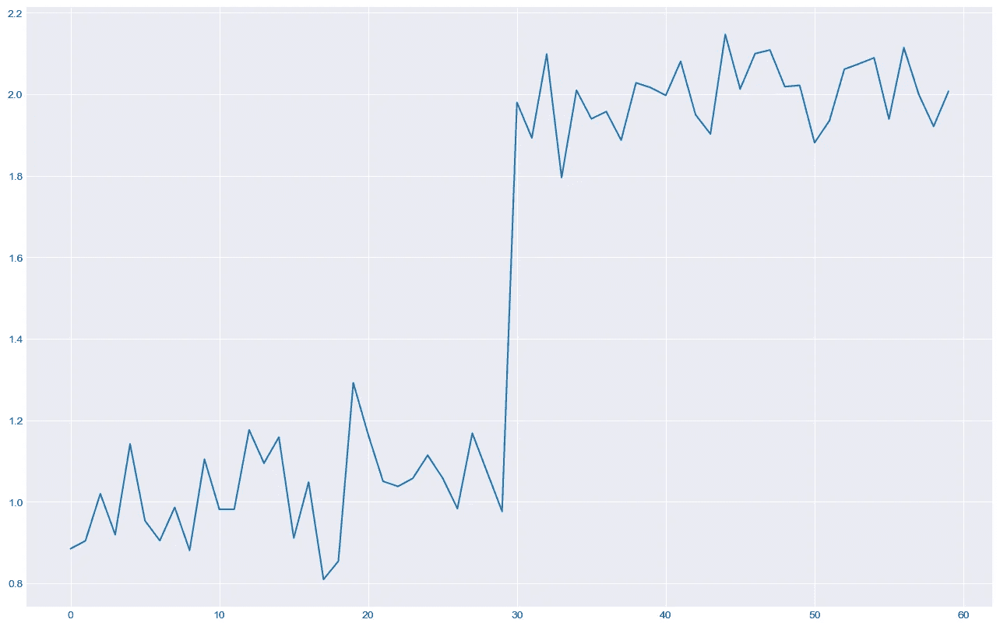
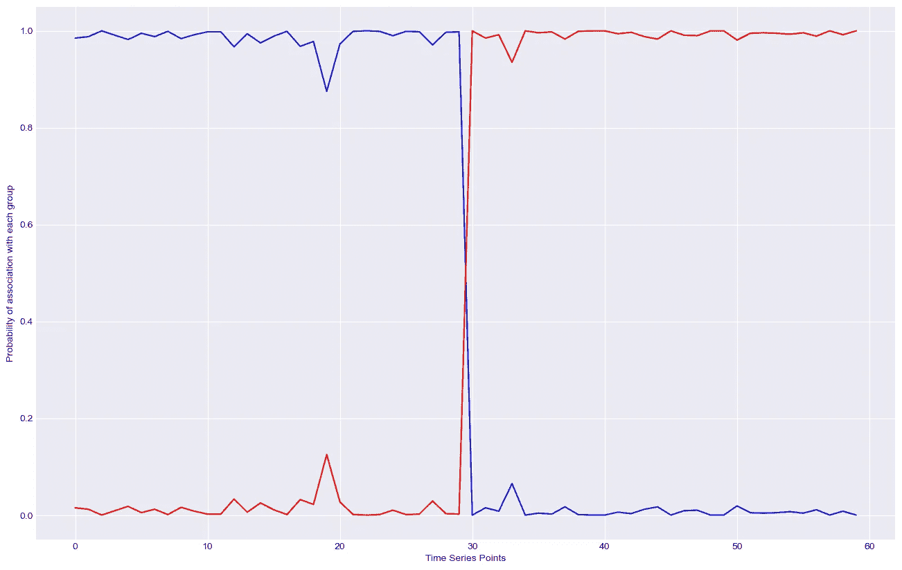
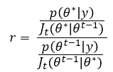
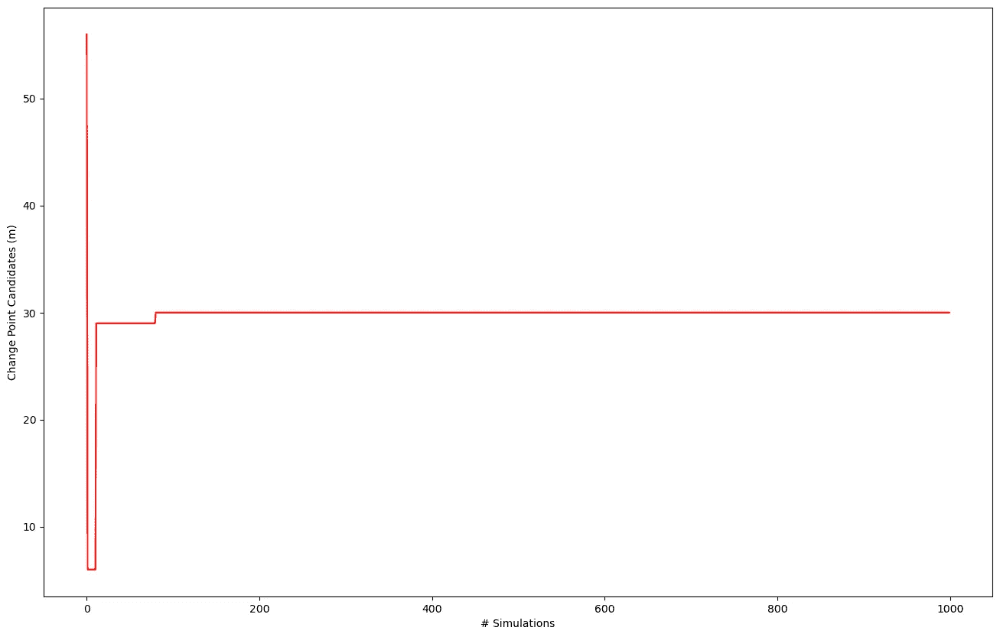
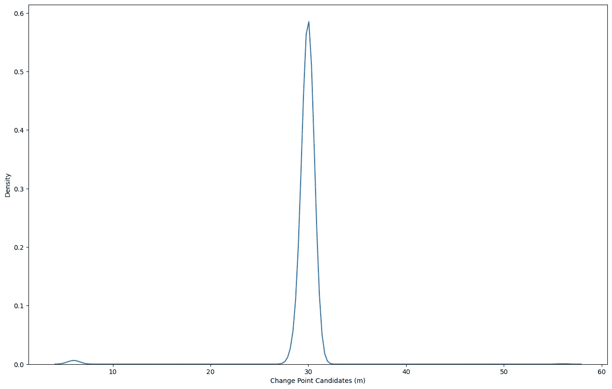
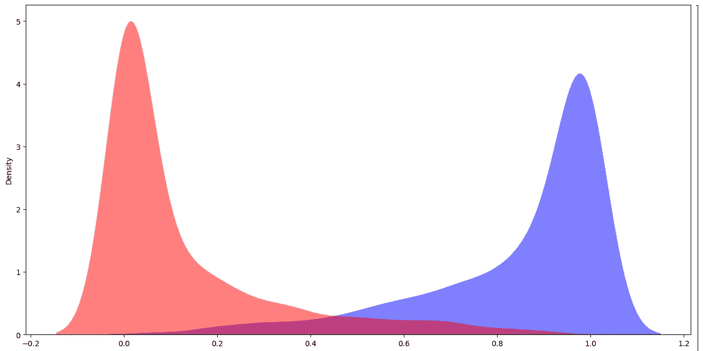

# 变化点检测 — 一种贝叶斯方法

> 原文：[`towardsdatascience.com/change-point-detection-a-bayesian-approach-8eb3cfca4a6e?source=collection_archive---------3-----------------------#2023-05-04`](https://towardsdatascience.com/change-point-detection-a-bayesian-approach-8eb3cfca4a6e?source=collection_archive---------3-----------------------#2023-05-04)

## 在时间序列分析中识别变化点可以提供比你之前认为的更多信息。

[](https://medium.com/@almeida.eas?source=post_page-----8eb3cfca4a6e--------------------------------)[](https://towardsdatascience.com/?source=post_page-----8eb3cfca4a6e--------------------------------) [Everton Almeida](https://medium.com/@almeida.eas?source=post_page-----8eb3cfca4a6e--------------------------------)

·

[关注](https://medium.com/m/signin?actionUrl=https%3A%2F%2Fmedium.com%2F_%2Fsubscribe%2Fuser%2F7060488ff9e&operation=register&redirect=https%3A%2F%2Ftowardsdatascience.com%2Fchange-point-detection-a-bayesian-approach-8eb3cfca4a6e&user=Everton+Almeida&userId=7060488ff9e&source=post_page-7060488ff9e----8eb3cfca4a6e---------------------post_header-----------) 发表于 [Towards Data Science](https://towardsdatascience.com/?source=post_page-----8eb3cfca4a6e--------------------------------) ·13 分钟阅读·2023 年 5 月 4 日[](https://medium.com/m/signin?actionUrl=https%3A%2F%2Fmedium.com%2F_%2Fvote%2Ftowards-data-science%2F8eb3cfca4a6e&operation=register&redirect=https%3A%2F%2Ftowardsdatascience.com%2Fchange-point-detection-a-bayesian-approach-8eb3cfca4a6e&user=Everton+Almeida&userId=7060488ff9e&source=-----8eb3cfca4a6e---------------------clap_footer-----------)

--

[](https://medium.com/m/signin?actionUrl=https%3A%2F%2Fmedium.com%2F_%2Fbookmark%2Fp%2F8eb3cfca4a6e&operation=register&redirect=https%3A%2F%2Ftowardsdatascience.com%2Fchange-point-detection-a-bayesian-approach-8eb3cfca4a6e&source=-----8eb3cfca4a6e---------------------bookmark_footer-----------)

变化点分析已经成为许多研究领域的关注点。这种分析涉及到寻找给定时间序列中的突然或突发的变化。根据 Iwata *et al.*（2018）的定义，变化点分析是“识别变化点的方法，即时间序列概率分布发生变化的时刻。” 根据 Van den Burg 和 Williams（2020）的说法，“时间序列行为中的突发变化时刻通常会引起警报，因为它们可能暗示数据生成过程中的重大变化。”

正如 Aminikhanghahi 和 Cook (2017) 以及 Iwata 等人 (2018) 所示，对这种分析的关注度增加是由于最近的技术发展。这些发展生成大量的数据，这些数据往往需要被密切监控，例如机器人技术、医学、气象、语音和图像识别等。应对这些问题有多种模型和方法。然而，由于本文的目标不是对这些模型进行描述性分析，我建议你参考 Van den Burg 和 Williams (2020) 的工作，以更好地了解这些方法论。在那里你可以找到在线和离线变化点检测的区别；单变量和多变量方法，这些方法可以是参数化的或非参数化的；以及监督或无监督模型。


图片来源 [Tech Daily](https://unsplash.com/@techdailyca?utm_source=unsplash&utm_medium=referral&utm_content=creditCopyText) — [Unsplash](https://unsplash.com/pt-br/fotografias/ztYmIQecyH4?utm_source=unsplash&utm_medium=referral&utm_content=creditCopyText)

从一开始，根据 Ehlers (2007) 的定义，“时间序列是指在时间上顺序进行的观测集合”，其主要特征是给定观测对邻近观测的依赖性。时间序列可以是连续的或离散的，在前一种情况下，根据 Ehlers (2007) 的定义，集合 *T={t∶ t1< t < t2},* 该序列表示为 *{X(t):t ∈ T}*。因此，取时间序列 T 的一个观测窗口，包含 n 个观测值，我们得到一个表示为 *{Xm, X(m+1),…, Xn }* 的时间序列。根据 Aminikhanghahi 和 Cook (2017，第 3 页) 的说法，“变化点的检测可以定义为一个假设检验问题，存在两个备选方案”，即“原假设 *H0*: ‘没有变化’” 和备择假设 *H1*: ‘发生了变化’”。

# 从一开始

所以，如果你喜欢编程，是时候启动 Jupyter Notebook 并开始进行一些模拟和分析，我们将通过这种方法进行“随机漫步”。让我们导入以下包：

```py
import numpy as np
from numpy.random import seed
from numpy.random import randn
import random
import datetime

import matplotlib.pyplot as plt
import seaborn as sns 

import math
import decimal
from scipy import stats
np.seterr(divide='raise') #Make sure you set this
```

我们将从一个时间序列 *y(t)* 开始，该序列由两个时间序列组成，*y(t1)* 的均值是 *μ=1* 加上一些噪声，*y(t2)* 的均值是 *μ=2* 加上一些噪声，两个序列都有 30 个观测值。正如你可能想的那样，提议的时间序列将会有一个显著的变化点。

```py
yt1 = u1 + 0.1*randn(30)
yt2 = u2 + 0.1*randn(30)

y = np.concatenate((yt1, yt2), axis=0)
plt.figure(figsize=(16, 10))
plt.plot(y)
```



一个具有两个不同均值的时间序列 — 作者提供的图片

如果你了解贝叶斯统计，你知道任何模型的构建基本上由 3 个分布组成。先验分布*h(*θ)* 反映了我们对问题的先验知识。似然函数*f(x|*θ)* 反映了获得的数据，并且必须纳入到先验分布中。这将导致一个后验分布*h(*θ|x)*，这是我们感兴趣的。这就是我们如何使用贝叶斯定理。

# 模糊聚类

目前，我们面临的第一个（也是最重要的？）问题是从我们构建的时间序列中获得一个先验分布——这是模型的第一部分。**问题是：我们没有！** 如果你处理的是时间序列，一旦我们得到一个先验分布，大多数任务就已经完成了。

D’Angelo *et al.*（2011）采取了一种有趣的方法来解决这个问题。他使用 Kohonen 网络对时间序列进行聚类。与硬聚类不同，Kohonen 网络是一种模糊聚类算法，这意味着任何给定点 X 与组 A 的关联概率为*p*。这种关联由函数*fA(X)*给出，该函数将每个点在 A 中的实数与区间*[0, 1]*中的数值关联起来，表示 X 在 A 中的隶属度。

对 Kohonen 网络的完整和更好解释，你可以参考 Kohonen（1990）和 Haykin（2007）。使用 Python，我构建了这样的网络，使用了两个函数：

```py
def Center_Kohonen(y, X=0, K=2, alfa=0.8, C=500):    
# This kohonen network implementation finds two centers in a time series
#Params:
#Y = Time Series
#M = Number of input patterns
#N = Dimension of the input pattern (for our case it will be 1)
#K = number of neurons, for the proposed problem (number of centers)
    M = y.shape[0]
    N = 1
    f = 0

#Initializin the neurons' weights
    I = y.argsort(axis=0) # Sorted Indexes
    Y = np.sort(y)        # Sortes Points in the Time Series    
    c1 = Y[0:7]           # Beginning of the series     
    c2 = Y[M-7:M]         # End of the series

    #Adjusting the values
    while np.std(c2) > 0.1: #As long as the standard deviation is greater than 0.1, replace the highest value with the mean
        ma = c2.argmax()
        c2[ma] = np.mean(c2);    
        y[I[ma+60-7]] = np.mean(c2);

    while np.std(c1) > 0.1: #As long as the standard deviation is greater than 0.1, replace the lowest value with the mean
        mi = c1.argmin()
        c1[mi] = np.mean(c1)
        y[I[mi]] = np.mean(c1);

    #Definition of weight values
    W = [np.mean(c1), np.mean(c2)] 

    #Finding centers from Kohonen's network training   
    for l in range(1, C+1):
        alfa=alfa*(1-(C-(C-l))/C)

        for i in range(0, M): #For each value in the time series
            a=999

            for j in range(0, K): #Where K is the number of cluster
                if np.linalg.norm([(y[i]-W[j])], 2) < a:
                    a = np.linalg.norm([(y[i]-W[j])], 2)
                    f = j

            W[f] = W[f]+alfa*(y[i]-W[f])

    return c1, c2, I, Y, W, a, alfa
```

```py
def Fuzzy_Set(y, W):
    # This program finds membership values for a time series from previously specified centers.
    # Where y is the time series and c a vector with the found centers
    center_1 = []
    center_2 = []
    n = y.shape[0]
    l = 2
# Finding the membership association for each point in the time series
    for i in range(0, l):
        for t in range(0, n):
            sum=0;
            for k in range(0, l):
                sum = sum+(y[t]-W[k])*(y[t]-W[k])
            if i == 0:
                center_1.append(np.round(1-((y[t]-W[i])*(y[t]-W[i]))/sum, 3))
            else:
                center_2.append(np.round(1-((y[t]-W[i])*(y[t]-W[i]))/sum, 3))
      return center_1, center_2
```

如果你顺序调用这两个函数，可能会得到这样的结果图：

```py
c1, c2, I, Y, W, a, alfa = Center_Kohonen(y, X=0, K=2, alfa=0.8, C=500)
center_1, center_2 = Fuzzy_Set(y, W)
plt.figure(figsize=(16, 10))
plt.plot(center_1, 'b') # plotting t, a separately 
plt.plot(center_2, 'r') # plotting t, b separately 
plt.show()
```



使用 Kohonen 网络对时间序列 y(t)进行的模糊聚类 — 图片由作者提供

这非常有趣！通过 Kohonen 网络，我们能够对时间序列*y(t)*进行分割。这个图表显示我们有两个簇，因为我们设置了*K=2\.* 在*xlabel*中，我们有时间序列中的每个点，而*ylabel*显示某一点与两个簇中的一个相关联的概率。正如你所见，蓝线告诉我们，在到达第 30 个点之前，所有点更可能（大约~99%）属于第一个组或集合*μ1(t)*。红线则显示了相反的情况，因为它表示与第二组，即集合*μ2(t)*的关联。这是合理的，因为我们构建了一个具有两个不同平均值的时间序列，从图示上看，这个图与第一个图相关。

尽管很有趣，我们直到现在还没有真正找到变化点（我们有一些线索），而且**这里没有贝叶斯内容。**

顺便提一下，大多数情况下，时间序列的点之间的区分并不会那么简单。例如，如果我们构建了时间序列*y(t)*，其中*y(t1)*的均值为*μ=1*加上一些噪声，而*y(t2)*的均值为*μ=1.3*（而不是 2）加上一些噪声，这样的分割会好吗？我让你试试这个练习…

# Metropolis-Hastings 算法登场了

如果你尝试了上述练习，你会发现仅仅使用 Kohonen 网络来找到替代时间序列中的任何变点指示时会遇到麻烦。这是因为 Kohonen 网络不提供变点，而是两组连续变量，表示每个点与给定簇的关联。

但要记住，集合*μ1(t)*和*μ2(t)*的值在区间[0,1]内。这意味着*μ1(t)*和*μ2(t)*近似于具有不同参数的贝塔分布（你听说过 Kullback–Leibler 吗？）。根据 D'Angelo *et al.* (2011)的说法，假设变点由*m*表示，则对于*t≤m*，我们将有*Beta(a,b)*分布，对于*t>m*，我们将有*Beta(c,d)*分布。考虑到 Beta 分布的性质，如果时间序列中存在变点，*参数 a*在*Beta(a,b)*中将大于*参数 b*，*参数 c*在*Beta(c,d)*中将小于*参数 d*。

**问题是：** 你如何构建这两个贝塔分布？Metropolis-Hastings 算法是一种马尔可夫链蒙特卡洛方法，最初由 Metropolis *et al.* (1953)提出，后来由 Hastings (1970)推广。根据 Gelman *et al.* (2003)的说法，任何马尔可夫链模拟的目标是“创建一个稳态分布由*p(θ | x)*指定的马尔可夫过程”。充分运行模拟使我们能够获得足够接近稳态和后验分布的分布。后验分布可以用参数θ的特定函数的期望来概括，即*∫g(θ)p(θ | x)dθ = E [g(θ) | x]*。这样的积分并不轻松，这就是为什么 MCMC 方法用于近似后验分布的好处所在。

Metropolis-Hastings 算法使用拒绝的概念，这意味着它从辅助分布中生成一个值，并以一定的概率接受它。如果你对 MCMC 方法不熟悉，你可能会质疑算法如何拒绝一个抽取的值。我们使用 Hastings (1970)给出的转移规则：



将其简单说来，我们可以利用由模糊聚类给出的两组连续变量来拒绝从给定先验分布中随机抽取的值，用于变点检测。如果你想了解更多关于 MCMC 方法的信息，我建议参考 Gamerman 和 Lopes (2018)。

让我们回到 Jupyter Notebook。下面的函数是针对这个问题的 Metropolis-Hastings 算法的实现。尽管功能强大，但该算法需要一些条件。首先是为每个需要找到的参数设置先验分布。对于参数 *m*，我们使用了 1 到 60 之间的均匀分布，这意味着算法在时间序列中随机选择变化点候选值。对于参数 *a, b, c* 和 *d*，我选择了信息量较弱的伽马分布。该函数还需要参数，这些参数是随机变量的集合 (*μ1(t)* 或 *μ2(t)*) 和模拟次数。

```py
def Metropolis_Hastings(center_kohonen, n_sims=1000):
     n = len(y)
     m = 1 + round((n-1) * np.random.uniform(0, 1))
     shape, scale, loc = 10, 0.1, 0
#Lists to save the date for each parameter
     a_params = []
     b_params = []
     c_params = []
     d_params = [] 
     m_params = []
#Prior Distributions for the Parameters
     a = stats.erlang.rvs(shape, loc=loc, scale=scale, size=1, random_state=None)[0]
     b = stats.erlang.rvs(shape, loc=loc, scale=scale, size=1, random_state=None)[0]
     c = stats.erlang.rvs(shape, loc=loc, scale=scale, size=1, random_state=None)[0]
     d = stats.erlang.rvs(shape, loc=loc, scale=scale, size=1, random_state=None)[0]

for i in range(0, n_sims): 
         m1 = 1+round((n-1) * np.random.uniform(0, 1));
         a1 = stats.erlang.rvs(shape, loc=loc, scale=scale, size=1, random_state=None)[0]
         b1 = stats.erlang.rvs(shape, loc=loc, scale=scale, size=1, random_state=None)[0]
         c1 = stats.erlang.rvs(shape, loc=loc, scale=scale, size=1, random_state=None)[0]
         d1 = stats.erlang.rvs(shape, loc=loc, scale=scale, size=1, random_state=None)[0]
#PARAM A    
         aux1 = 1
         for j in range(0, m):
             try:
                 aux1 = aux1 * (center_kohonen[j] ** (a1-1))
             except:
                 aux1 = aux1
aux2 = 1
         for j in range(0, m):
             try:
                 aux2 = aux2 * center_kohonen[j] ** (a-1)
             except:
                 aux2 = aux2
try:
             ra = ((math.gamma(a1+b)/math.gamma(a1))**m)*aux1*((((a/a1)**.9)*math.exp(-.1*(a1-a)))**2)/(((math.gamma(a+b)/math.gamma(a))**m)*aux2)  
             if (min(1, ra) > np.random.uniform(0, 1)):
                 a=a1
         except:
             pass
#PARAM B
         aux1 = 1
         for j in range(0, m):
             try:
                 aux1 = aux1*(1-center_kohonen[j])**(b1-1)
             except:
                 aux1 = aux1
aux2 = 1
         for j in range(0, m):
             try:
                 aux2 = aux2*(1-center_kohonen[j])**(b-1)
             except:
                 aux2 = aux2

         try:
             rb = ((math.gamma(a+b1)/math.gamma(b1))**m)*aux1*((((b/b1)**.9)*math.exp(-.1*(b1-b)))**2)/(((math.gamma(a+b)/math.gamma(b))**m)*aux2)
             if (min(1, rb) > np.random.uniform(0, 1)):
                 b = b1
         except:
             pass
#PARAM C
         aux1 = 1
         for j in range(m, n):
             try:
                 aux1=aux1*center_kohonen[j]**(c1-1)
             except:
                 aux1 = aux1
aux2 = 1
         for j in range(m, n):
             try:
                 aux2=aux2*center_kohonen[j]**(c-1)
             except:
                 aux2 = aux2
try:
             rc = ((math.gamma(c1+d)/math.gamma(c1))**(n-m))*aux1*((((c/c1)**.9)*math.exp(-.1*(c1-c)))**2)/(((math.gamma(c+d)/math.gamma(c))**(n-m))*aux2)
             if (min(1, rc) > np.random.uniform(0, 1)):
                 c = c1
         except:
             pass
#PARAM D    
         aux1 = 1
         for j in range(m, n):
             try:
                 aux1=aux1*(1-center_kohonen[j])**(d1-1)
             except:
                 aux1 = aux1
aux2 = 1
         for j in range(m, n):
             try:
                 aux2=aux2*(1-center_kohonen[j])**(d-1)
             except:
                 aux2 = aux2
try:
             rd = ((math.gamma(c+d1)/math.gamma(d1))**(n-m))*aux1*((((d/d1)**.9)*math.exp(-.1*(d1-d)))**2)/(((math.gamma(c+d)/math.gamma(d))**(n-m))*aux2)
             if (min(1, rd) > np.random.uniform(0, 1)):
                 d = d1
         except:
             pass
#PARAM M
         aux1 = 1 
         for j in range(0, m1):
             try:
                 aux1 = aux1*(center_kohonen[j]**(a-1))*((1-center_kohonen[j])**(b-1))
             except:
                 aux1 = aux1
aux2 = 1;
         for j in range(m1, n):
             try:
                 aux2 = aux2*(center_kohonen[j]**(c-1))*((1-center_kohonen[j])**(d-1))            
             except:
                 aux2 = aux2
aux3 = 1
         for j in range(0, m):
             try:
                 aux3 = aux3*(center_kohonen[j]**(a-1))*((1-center_kohonen[j])**(b-1))            
             except:
                 aux3 = aux3
aux4 = 1
         for j in range(m, n):
             try:
                 aux4 = aux4*(center_kohonen[j]**(c-1))*((1-center_kohonen[j])**(d-1))
             except:
                 aux4 = aux4
try:
             rm = (((math.gamma(a+b)/(math.gamma(a)*math.gamma(b)))**m1)*((math.gamma(c+d)/(math.gamma(c)*math.gamma(d)))**(n-m1))*aux1*aux2)/(((math.gamma(a+b)/(math.gamma(a)*math.gamma(b)))**m)*((math.gamma(c+d)/(math.gamma(c)*math.gamma(d)))**(n-m))*aux3*aux4)        
             if (min(1, rm) > np.random.uniform(0, 1)):
                 m = m1
         except:
             pass

         a_params.append(a)
         b_params.append(b)
         c_params.append(c)
         d_params.append(d)
         m_params.append(m)
    return a_params, b_params, c_params, d_params, m_params
```

用两个所需参数调用那个函数：在这里，我传递了由函数 *Fuzzy_Set* 给出的 ***center_1*** 和 ***n_sims=1000***

```py
a_params, b_params, c_params, d_params, m_params = Metropolis_Hastings(center_1, n_sims=1000)
fig_dims = (16, 10)
fig, ax = plt.subplots(figsize=fig_dims)
plt.plot(m_params, 'r')
ax.set(xlabel='# Simulations', ylabel='Change Point Candidates (m)')
```



Metropolis-Hastings 算法模拟 — 图片由作者提供

你现在终于找到了变化点。这张图很有趣，因为它展示了绘图过程。第一次由均匀分布给出的绘制值是 *m=55*。算法拒绝了它，然后尝试其他值，直到得到令人满意且稳定的结果。经过大约 150 次额外运行后，*m=30* 的值再也不能被算法拒绝。

由于函数返回了每个参数的采样值，我们也可以绘制它们的值。从参数 *m* 开始，这是所有变化点的绘制结果。要查看密度图，你可以丢弃前 200 次模拟作为“烧入”：

```py
fig_dims = (16, 10)
fig, ax = plt.subplots(figsize=fig_dims)
ax.set(xlabel='Change Point Candidates', ylabel='Density')
sns.kdeplot(m_params[200:])
```



变化点候选密度图 — 图片由作者提供

我们还可以使用四个其他参数的均值来创建 Beta 分布，即参数 *a, b, c* 和 *d*。正如我们之前讨论的，这些参数对于 Metropolis-Hastings 算法至关重要，因为当拒绝规则必须断言 *t≤m* 时，我们将有 *Beta(a,b)* 分布，而 *t>m* 时将有 *Beta(c,d)* 分布。

让我们使用变量 *a_params, b_params, c_params* 和 *d_params* 来构建这种表示，这些变量包含了 *a, b, c* 和 *d* 的采样值

```py
fig, ax = plt.subplots(1, 1, figsize=(16, 8))

ax.set_ylabel('Density')

beta_1 = np.random.beta(np.mean(a_params[200:]), np.mean(b_params[200:]), size=1000)
beta_2 = np.random.beta(np.mean(c_params[200:]), np.mean(d_params[200:]), size=1000)

sns.kdeplot(beta_1, color='b', fill=True, common_norm=False, alpha=.5, linewidth=0)
sns.kdeplot(beta_2, color='r', fill=True, common_norm=False, alpha=.5, linewidth=0)
```

用参数 *a* 和 *b* 的均值构建的第一个 Beta 分布是红色的，第二个是用参数 *c* 和 *d* 的均值构建的，呈蓝色。在中间，两个分布的密度较低，我们找到了变化点。毫无疑问，使用这种方法的一个巨大优势是可以得到这样的分布，因为我们可以用它们进行贝叶斯推断，丰富预测模型，甚至使用其他类型的 Monte Carlo 模拟。



两个 Beta 分布的表示 — 图片由作者提供

# 结论

寻找时间序列中的变化点可以防止系统陷入严重故障。试想一下，必须控制温度的机器。任何突然的变化必须尽快被识别，以便工程师进行检查。或者各种生产设施中的能源消耗。任何过度的消耗都必须被分析，因为它可能表示生产中存在某种偏差或能源泄漏，从而显著影响生产成本。

也就是说，D’Angelo（2011）开发的方法并在这里用 Python 实现，证明在检测给定时间序列中的变化点方面非常有价值。此外，如前所述，这种方法的另一个优点正是我们获得了两个 beta 分布作为输出，这可能非常有用。

# 参考文献

AMINIKHANGHAHI, Samaneh 和 COOK, J. Diane. **时间序列变化点检测方法综述**。知识与信息系统，51，2017 年。

D’ANGELO, Marcos Flávio *等* **时间序列变化点检测问题的模糊/贝叶斯方法**。运筹学研究，31(2)，2011 年。

EHLERS, Ricardo S. **贝叶斯推断**。第 5 版。巴拉那联邦大学统计系，2007 年。

FAMA, Eugene. **股票市场价格的随机游走**。金融分析师，21，1965 年。

_____________ **有效资本市场：** 理论与实证工作的回顾。《金融杂志》，25，1970 年。

GAMERMAN, Dani. LOPES, Hedibert Freitas. **马尔科夫链蒙特卡罗：** 贝叶斯推断的随机模拟。第 2 版。佛罗里达州：Chapman & Hall/CRC，2006 年。315 页。

GELMAN, Andrew *等* **贝叶斯数据分析**。第 2 版。佛罗里达州：Chapman & Hall/CRC，2003 年。668 页。

HASTINGS, W. K. **使用马尔科夫链的蒙特卡罗抽样方法及其应用**。生物统计学，57，1970 年。

HAYKIN, Simon. **神经网络**：原理与实践。第 2 版。阿雷格里港：Bookman，2007 年。900 页。

IWATA, Takuma *等* **使用 10GbE FPGA NIC 加速在线变化点检测算法**。在第 24 届国际并行与分布式计算会议上提出。都灵：2018 年。

KOHONEN, Teuvo. **自组织映射**。纽约：Springer，1990 年，501 页。

METROPOLIS, Nicholas *等* **通过快速计算机计算状态方程**。化学物理学杂志，21，1953 年。

OH KJ, *等* **开发基于时间的聚类神经网络用于变化点检测：应用于金融时间序列**。亚太运营研究杂志，22(1)，2005 年。

PAULINO, Carlos Daniel *等* **贝叶斯统计**。第 2 版。里斯本：卡洛斯·古尔本基安基金会，2018 年，601 页。

VAN DEN BURG, Gerrit J. J., WILLIAMS, Christopher K. I. **变化点检测算法评估**。stat.ML，arXiv:2003.06222，2020 年。
