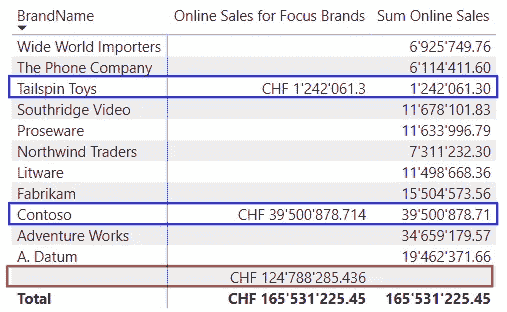

# 在 DAX 测量中随着时间改变你的关注点

> 原文：[`towardsdatascience.com/change-your-focus-over-time-in-dax-measures-292ff012643a`](https://towardsdatascience.com/change-your-focus-over-time-in-dax-measures-292ff012643a)

## *如何确定当你随着时间推移广告产品时投资是否有所回报*

[](https://medium.com/@salvatorecagliari?source=post_page-----292ff012643a--------------------------------)[](https://towardsdatascience.com/?source=post_page-----292ff012643a--------------------------------) [Salvatore Cagliari](https://medium.com/@salvatorecagliari?source=post_page-----292ff012643a--------------------------------)

·发表于 [Towards Data Science](https://towardsdatascience.com/?source=post_page-----292ff012643a--------------------------------) ·7 分钟阅读·2023 年 5 月 19 日

--


图片由 [David Travis](https://unsplash.com/@dtravisphd?utm_source=medium&utm_medium=referral) 提供，来源于 [Unsplash](https://unsplash.com/?utm_source=medium&utm_medium=referral)

# 介绍

如何衡量广告活动的成功？

尤其是当你想要随着时间推移广告不同品牌时？

一个类似的问题曾由我的客户提问。

他希望分析其品牌的销售情况，并将其与广告品牌的销售情况进行比较，以确定投资是否有所回报。

挑战在于修改数据模型，使得在不破坏现有报告和分析的情况下能够进行此分析。

# 专注于选择的品牌

第一步是拥有一个随时间变化的广告品牌表。

如下所示：


图 1 — 每月的重点品牌表（作者提供的图）

在此表中，几乎每个月都会找到一个或多个品牌。

现在我可以扩展我的数据模型。

我在 Contoso 数据模型中的起点如下（从整个数据模型中摘录）：


图 2 — 初始数据模型（作者提供的图）

如你所见，我有一个品牌名称列，但没有品牌 ID。

在这种情况下，我必须通过 [BrandName] 列创建一个关系。

# 集成 Focus Brands 表

将 Focus Brands 表添加到我的数据模型后，我添加了以下关系：


图 3 — 新数据模型及新关系（作者提供的图）

我设置了过滤器“聚焦品牌”过滤“产品”来代替“聚焦品牌”和“产品”表之间的双向过滤。但双向过滤也有效，只是引入了一个不必要的过滤方向。我们需要设置正确的过滤方向，以便我们能够根据“产品”表中的属性深入挖掘结果。

由于“产品”表中有多个相同名称的产品，我们必须与“产品”表建立多对多（m:n）关系。

在这种情况下创建数据模型的另一种方法是添加一个包含每个品牌一行的“品牌”表，并从这两个表到这个新表创建 1:n 关系。

为了简化起见，我在这里没有进行额外的步骤，而是坚持使用 m:n 关系。正如下面“参考文献”部分的 SQLBI 文章中描述的，还有更好的解决方案。

同样的情况适用于“聚焦品牌”表和“日期”表之间基于“MonthKey”列的关系。

但为了避免数据模型中的歧义，两个关系都必须被禁用。

关键关系是“聚焦品牌”和“在线销售”表之间的关系。

我的第一个方法是没有与“在线销售”表的关系。但我不得不在表之间使用交叉过滤来正确计算结果。

这种方法带来了一些问题：

+   无法计算广告产品和非广告产品的销售部分。

+   无法正确计算时间序列。

+   最重要的是，报告对所有用户不起作用。

最后一点至关重要。我在我的度量中使用了[CROSSFILTER()](https://dax.guide/crossfilter/)函数。

正如你在[微软文档的备注](https://learn.microsoft.com/en-us/dax/crossfilter-function?WT.mc_id=DP-MVP-4025372#remarks)中可以读到的，当数据模型中实施了行级安全时，CROSSFILTER()是不支持的，我的客户就有这种情况。

为了实现“聚焦品牌”和“在线销售”表之间的关系，我不得不在每个表中添加一个新列，以将每个品牌映射到每个月。

在“聚焦品牌”表中，我用以下表达式添加了这一列：


图 4 — 带有每月品牌列的“聚焦品牌”表（图由作者提供）

在“在线销售”表中，我使用了这个表达式来添加相应的列：

```py
Brand per Month = RELATED('Product'[BrandName])
                  & "_" & CONVERT(RELATED('Date'[MonthKey]),STRING)
```

现在，我已经能够添加新的关系。

# 创建度量并检查结果

计算结果的度量如下：

```py
Online Sales for Focus Brands =
  CALCULATE([Sum Online Sales]
        ,USERELATIONSHIP('Online Sales'[Brand per Month]
                        ,'Focus Brands'[Brand per Month]
                        )
        ,USERELATIONSHIP('Focus Brands'[MonthKey]
                        ,'Date'[MonthKey]
                        )
      )
```

添加了带有[Sum Online Sales]和新[Online Sales for Focus Brands]度量的视觉效果后，2019 年 3 月的结果如下所示：



图 5 — 检查“聚焦品牌”度量的结果（图由作者提供）

如你所见，2019 年 3 月的每个“聚焦品牌”中两个度量的结果是相同的（用蓝色标记）。

新的度量正在为“聚焦品牌”计算正确的结果。

但现在，我们必须使用来自重点品牌列的品牌名称列来获得这些结果。

但最大的问题是，我得到了所有销售额的空白行，而没有对应的重点品牌。

当仅在列视觉中使用新度量时，这一点更为明显：


图 6 — 带空白的每月重点销售（作者绘制）

我可以向视觉中添加过滤器，以排除所有[BrandName] = Blank 的行，但我希望避免这样做，因为数据模型的所有用户都需要这样做，而不是通过良好的数据模型一次性解决这个问题。

目标是仅在报告中一次性提供品牌名称列，而不干扰使用产品表的所有现有视觉效果或报告。

# 改进数据模型

为了实现这一点，我必须确保在计算重点品牌的销售时，过滤器上下文能够正确流动。

请查看下面的图片以了解所需的流向：


图 7 — 所需的过滤器流向（作者绘制）

在这种情况下，我必须在重点品牌表和产品表之间设置双向过滤。

然后，我必须更改我的度量以强制过滤器上下文从产品表通过重点品牌表流动。

为此，我调整了度量以包含 CROSSFILTER()：

```py
Online Sales for Focus Brands =
  CALCULATE([Sum Online Sales]
    ,USERELATIONSHIP('Online Sales'[Brand per Month]
                        ,'Focus Brands'[Brand per Month]
                    )
    ,USERELATIONSHIP('Focus Brands'[MonthKey]
                    ,'Date'[MonthKey]
            )
    ,CROSSFILTER('Online Sales'[ProductKey]
                ,'Product'[ProductKey]
                ,None
                )
    )
```

这样，我们面临的问题是这个度量对应用 RLS 规则的所有用户都不起作用。

没有这种限制，这个度量在使用产品表中的品牌名称列时将有效。

我尝试了其他解决方法，但无论我做什么，要么不能按需工作，要么会干扰现有报告。

我甚至添加了一个品牌表，并故意将品牌表和重点品牌表之间的关系设置为多对多。但这仍然没有解决对 CROSSFILTER()函数的需求：


图 8 — 带品牌表的数据模型（作者绘制）

我将重点品牌和品牌表之间的关系设置为多对多，因为该关系变为限制关系，从而避免在结果中创建<Blank>行。

但它仍然仅与度量中的 CROSSFILTER()函数一起工作。

而下钻仍然不起作用。

目前我没有解决此问题的方案。

# 结论

起初，我认为这个要求相对容易解决。

结果是一个完美的示例，说明了良好的数据模型如何解决问题，以及如何操作关系以实现目标。

即便如此，我仍然无法消除对额外过滤器的需求。

有时我们必须接受需求冲突并寻找解决办法以实现目标。

根据上面展示的解决方案，我现在可以创建度量来计算广告活动的成功或重点品牌的销售如何与所有其他品牌相关。


照片由 [Kai Dahms](https://unsplash.com/@dilucidus?utm_source=medium&utm_medium=referral) 在 [Unsplash](https://unsplash.com/?utm_source=medium&utm_medium=referral) 提供

# 参考资料

阅读 SQLBI 关于处理 m:n 关系时可能的解决方案的这篇文章：

[在 Power BI 和 Tabular 中建模多对多关系的不同选项 — SQLBI](https://www.sqlbi.com/articles/different-options-to-model-many-to-many-relationships-in-power-bi-and-tabular/)

我使用了 Contoso 示例数据集，就像在我之前的文章中一样。您可以从微软[这里](https://www.microsoft.com/en-us/download/details.aspx?id=18279)免费下载 ContosoRetailDW 数据集。

表格 Focus Brands 是通过这种数据集的半随机过程生成的。

Contoso 数据可以在 MIT 许可证下自由使用，如[这里](https://github.com/microsoft/Power-BI-Embedded-Contoso-Sales-Demo)所述。

我扩大了数据集，以使 DAX 引擎更加努力地工作。

在线销售表包含 7100 万行（而不是 1260 万行），零售销售表包含 1850 万行（而不是 340 万行）。

[](https://medium.com/@salvatorecagliari/membership?source=post_page-----292ff012643a--------------------------------) [## 使用我的推荐链接加入 Medium - Salvatore Cagliari

### 阅读 Salvatore Cagliari 的每一个故事（以及 Medium 上其他成千上万的作者）。您的会员费直接…

medium.com](https://medium.com/@salvatorecagliari/membership?source=post_page-----292ff012643a--------------------------------)
