# 在 Power BI 中改变数据视角

> 原文：[`towardsdatascience.com/changing-perspective-on-your-data-in-power-bi-4cca965f5fe7`](https://towardsdatascience.com/changing-perspective-on-your-data-in-power-bi-4cca965f5fe7)

## *通常，我们在报告页面上需要比实际拥有的空间更多。但如果我们能在同一页面上切换数据视角呢？让我们看看怎么做。*

[](https://medium.com/@salvatorecagliari?source=post_page-----4cca965f5fe7--------------------------------)[](https://towardsdatascience.com/?source=post_page-----4cca965f5fe7--------------------------------) [Salvatore Cagliari](https://medium.com/@salvatorecagliari?source=post_page-----4cca965f5fe7--------------------------------)

·发布于 [Towards Data Science](https://towardsdatascience.com/?source=post_page-----4cca965f5fe7--------------------------------) ·阅读时间 7 分钟 ·2023 年 7 月 24 日

--


由 [Nathan Dumlao](https://unsplash.com/@nate_dumlao?utm_source=medium&utm_medium=referral) 在 [Unsplash](https://unsplash.com/?utm_source=medium&utm_medium=referral) 提供的照片

# 介绍

想象一个包含一些卡片、列和折线图的报告页面。

在页面顶部，你会看到四个按钮：

+   实际数据

+   YTD（年初至今）

+   YE（年末）

+   最近三个月

类似这样的：

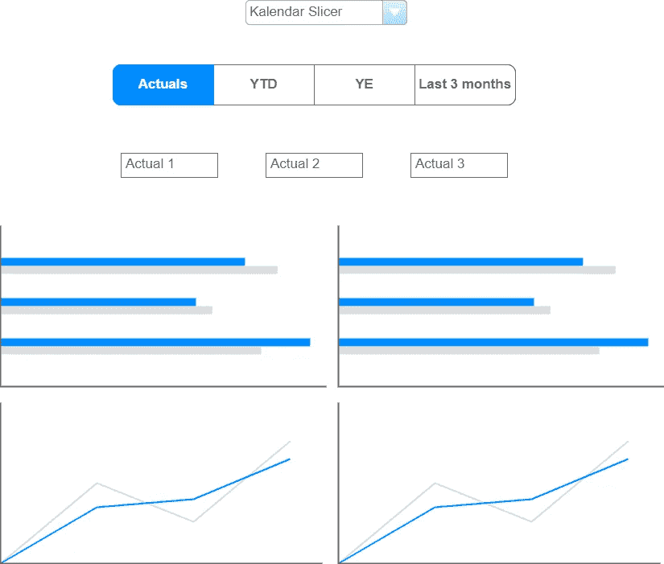

图 1 — 实际数据的模型图（作者提供的图）

当你点击“YTD”按钮时，你的数据将会更改为显示 YTD 结果，从而改变我们结果的视角：

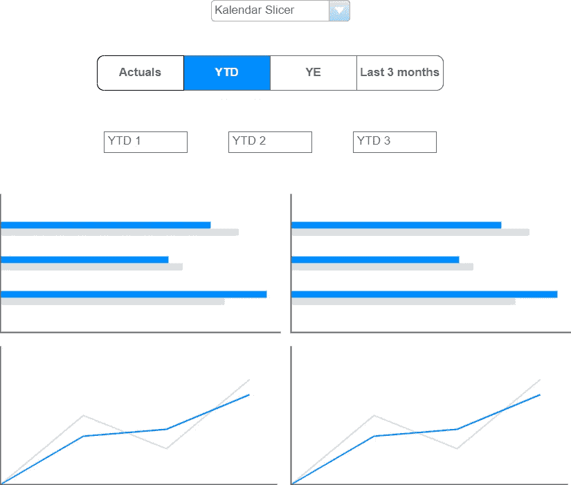

图 2 — YTD 结果的模型图（作者提供的图）

这就是我们想要实现的目标。

最后，我们想根据选择来更改结果的格式。

重要的是要理解，我们需要一个日期或年月筛选器来进行我们的报告。我们想要更改结构数据的结果，比如：

+   地理

+   门店

+   产品类别

+   客户组

+   等等。

通常，选择日期周期（如年份或月份）的筛选器，然后以时间序列显示年份或月份的数据并没有意义。我们可能只能看到数据的一个实例。

好的，你可以选择一年以按月份查看结果。但这与预期的场景不同。

# 准备数据模型

第一步是添加一个场景表。

这个表格包含每个需要的场景的一行。

我在 Power BI 中使用“输入数据”功能创建了这个表格，如下所示：

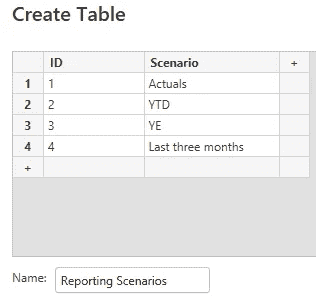

图 3 — 场景表（作者提供的图）

该表与其他任何表没有关系。这样，我避免了使用时的任何副作用。

现在，我需要为每个场景创建一个度量值。

我不会详细介绍如何编写每个度量值，因为这会使文章过长。

可以将所有逻辑包含在一个度量值中。但我有几个理由创建单独的度量值：

1.  可重用性：这些度量值可以在其他报告中重用。

1.  简单性：每个度量值本身都很简单。没有必要将多个度量值合并为一个度量值。

1.  可测试性：独立测试每个度量值要容易得多。

下一步是创建一个度量值，该度量值根据选定的场景返回正确的结果。

# 添加动态度量值

现在，我可以添加度量值，它可以根据切片器中选择的项目动态使用正确的度量值。

这个度量值很简单：

```py
Online Sale (By scenario) =
VAR SelectedScenario = SELECTEDVALUE('Reporting Scenarios'[Scenario])

RETURN
  SWITCH(SelectedScenario
    ,"Actuals", [Sum Online Sales]
    ,"YTD", [Online Sales (YTD)]
    ,"YE", [Online Sales (YE)]
    ,"Last three Months", [Online Sales (Last 3 Months)]
  )
```

我在报告页面上添加了一个切片器，将其样式设置为 Tile，并启用单选，以确保始终选择一个值，并且永远不会选择多个值。

当我将单独的度量值和动态度量值添加到矩阵视觉对象中并选择 YTD 时，我得到的是：

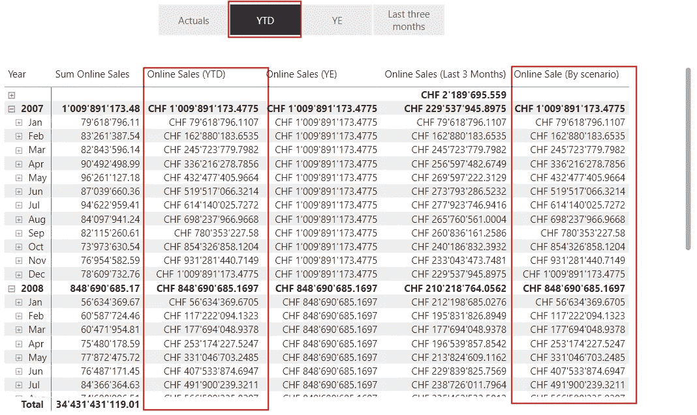

图 4 — 使用动态度量值的结果（图由作者提供）

我检查了日期层级的结果以进行测试，以查看所有计算是否正确。

# 使用计算组

为了使内容更通用，我添加了两个计算组：

第一个包含我在场景中需要使用的所有时间智能函数。

无论你是否打算使用这种方法，我都建议使用计算组来处理时间智能逻辑。这样，我们可以只编程一次你的逻辑，并在所有度量值中重用它。

如果你需要学习如何使用计算组，请跳到下面的参考部分，找到 SQLBI 的介绍文章链接。

第二个计算组只有一个计算项：

```py
VAR SelectedScenario = SELECTEDVALUE('Reporting Scenarios'[Scenario])

RETURN
  SWITCH(SelectedScenario
    ,"Actuals", SELECTEDMEASURE()
    ,"YTD", CALCULATE(SELECTEDMEASURE(), 'Time Intelligence'[Time Functions] = "YTD")
    ,"YE", CALCULATE(SELECTEDMEASURE(), 'Time Intelligence'[Time Functions] = "YE")
    ,"Last three Months", CALCULATE(SELECTEDMEASURE(), 'Time Intelligence'[Time Functions] = "Last three Months")
    ,SELECTEDMEASURE()
  )
```

最后一行确保返回结果，即使没有选择场景或选择了多个场景。

在 Tabular Editor 中，它的显示效果如下：

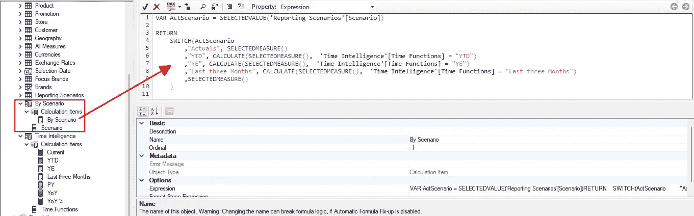

图 5 — 按场景划分的计算组（图由作者提供）

最后，我将我的在线销售（按场景）度量值更改为以下内容，以使用新的计算组：

```py
Online Sale (By scenario) =
  CALCULATE([Sum Online Sales]
            ,'By Scenario'[Scenario] = "By Scenario"
            )
```

当我将两个矩阵视觉对象并排放置，一个使用时间智能计算，另一个使用动态度量值时，结果如预期：

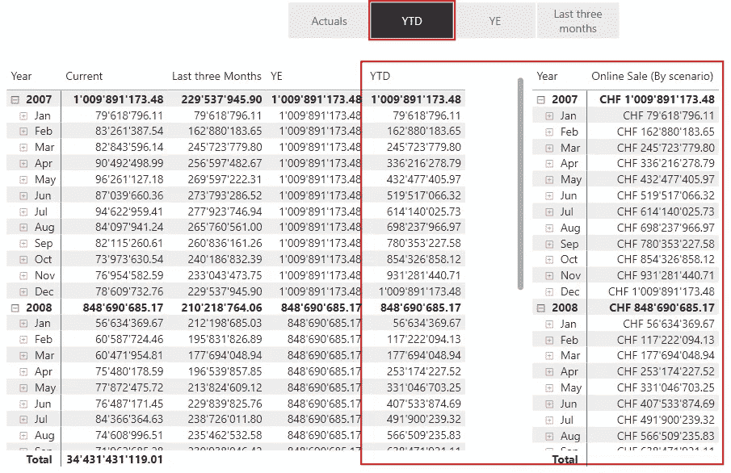

图 6 — 使用计算组的结果（图由作者提供）

所以，第一步已经完成。让我们看看如何处理结果的格式化。

# 那么动态格式化呢？

想象一下，我们想选择是否查看实际结果、相对于去年绝对数值的差异，还是百分比的差异：

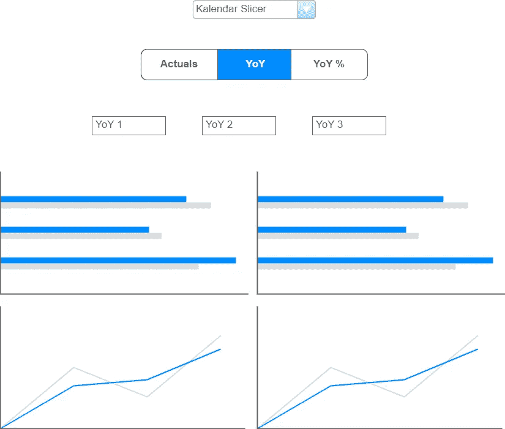

图 7 — 差异类型的选择（图由作者提供）

对于这个案例，我扩展了报告场景表，新增了一个类型列和几个新行：

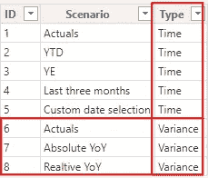

图 8 — 带有类型列的场景表（作者绘制）

现在，我可以添加进一步的切片器，并通过类型列限制每个切片器的可用选项，仅显示实际需求所需的选项，借助过滤面板：

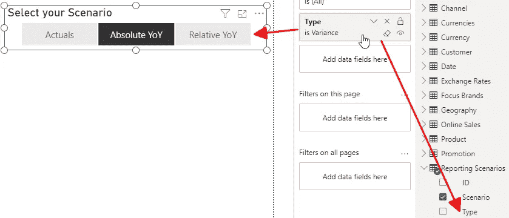

图 9 — 使用新类型列过滤切片器（作者绘制）

接下来，我在我的时间智能计算组中添加了两个计算项：

+   YoY：按绝对数字计算的年同比差异

+   YoY %：按百分比计算的年同比差异

计算项默认从源度量获取数字格式。

由于与计算项一起使用的度量具有数字格式，因此它将返回一个数字结果，而不是百分比。

但我为百分比结果的计算项添加了格式字符串，如下所示，以解决这个问题：

“0.00%;-0.00%;0.00%”

这是我对“YoY %”计算项所做的：

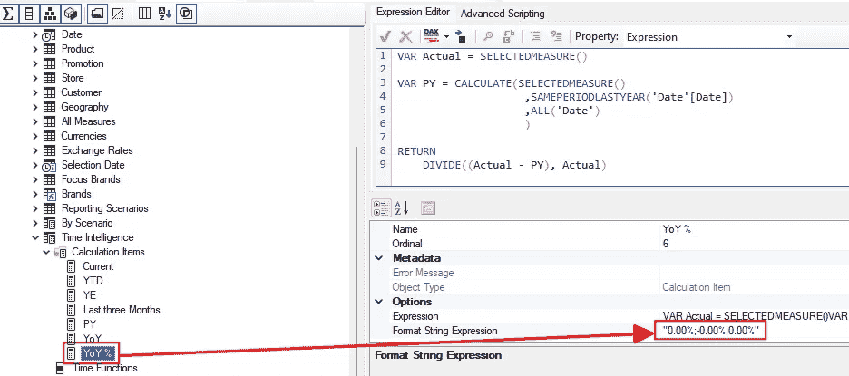

图 10 — 带有格式字符串的 YoY % 计算项（作者绘制）

我为动态场景的计算项添加了两个额外的案例：

```py
VAR SelectedScenario = SELECTEDVALUE('Reporting Scenarios'[Scenario])

RETURN
    SWITCH(SelectedScenario
        ,"Actuals", SELECTEDMEASURE()
        ,"YTD", CALCULATE(SELECTEDMEASURE(),  'Time Intelligence'[Time Functions] = "YTD")
        ,"YE", CALCULATE(SELECTEDMEASURE(),  'Time Intelligence'[Time Functions] = "YE")
        ,"Last three Months", CALCULATE(SELECTEDMEASURE(),  'Time Intelligence'[Time Functions] = "Last three Months")
        ,"Absolute YoY", CALCULATE(SELECTEDMEASURE(),  'Time Intelligence'[Time Functions] = "YoY")
        ,"Relative YoY", FORMAT(CALCULATE(SELECTEDMEASURE(),  'Time Intelligence'[Time Functions] = "YoY %"), "0.00%;-0.00%;0.00%")

        ,SELECTEDMEASURE()
    )
```

不幸的是，计算项的格式字符串未应用于场景的计算项。因此，我们必须使用[FORMAT()](https://dax.guide/format/)函数明确设置格式为百分比。

（并排视图与明确的度量）结果如下：

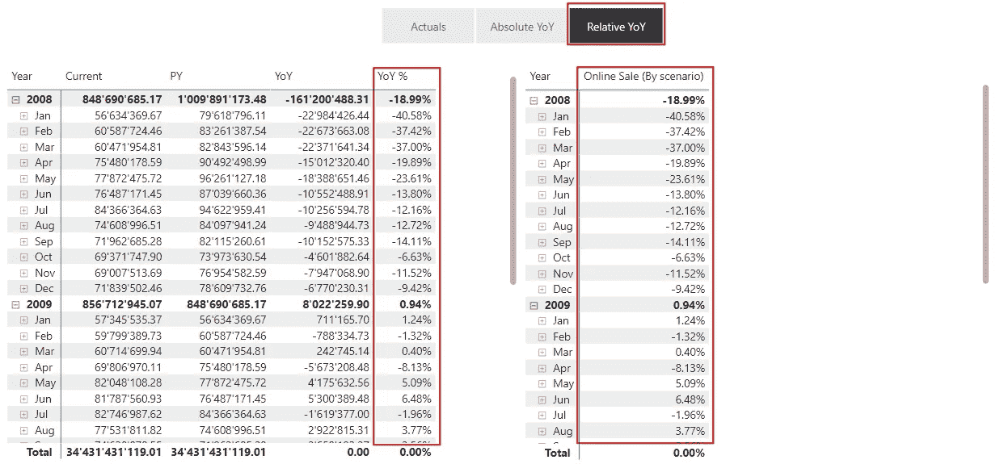

图 11 — 格式正确的结果（作者绘制）

当我添加一个用于周期的切片器并将矩阵更改为按产品层级报告时，结果接近最终版本：

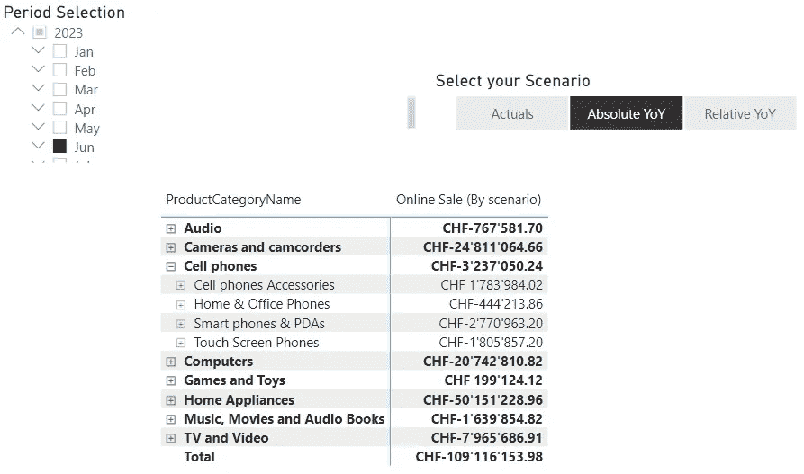

图 12 — 带有周期切片器和产品层级的结果（作者绘制）

现在，我可以添加更多视觉效果与其他动态度量来提高报告的信息密度，而无需添加大量视觉效果。


[Tekton](https://unsplash.com/@tekton_tools?utm_source=medium&utm_medium=referral) 拍摄的照片，来源于 [Unsplash](https://unsplash.com/?utm_source=medium&utm_medium=referral)

# 结论

在这一部分，我结合了几种技术来实现新的功能：

1.  无关系的表格

1.  时间智能的计算组

1.  一个用于场景的计算组，使用来自另一个计算组的计算项

1.  在计算项中格式化输出

这种特性的组合对找到挑战的最佳解决方案至关重要。

当我调查解决此问题的可能方法时，我对如何进行有了清晰的想法。

尽管如此，我还是在网上搜索了其他方法，并找到了另一种使用计算表处理每个场景的所有日期的方法。

如该示例视频所解释：

但我的需求需要一种更灵活的方法。计算表中使用的每个场景只有基于实际日期的日期范围。这一日期将是最后一次刷新日期。

只有在刷新数据集后，你才会得到正确的结果。不刷新数据集，你将得到错误的结果。

但我需要能够动态定义报告的日期范围，然后设置所需的计算方法，比如 YTD 或前一年。

当我选择一个可能的解决方案时，我会考虑以下几个关键因素：

1.  所选的方法是否满足所有要求？

1.  它是否引入了任何限制？

1.  它是否引入了不必要的复杂性？

1.  是否足够通用以便重用？

我希望这些建议能帮助你应对未来的挑战。

# 参考文献

SQLBI 关于计算组的介绍：[`www.sqlbi.com/articles/introducing-calculation-groups/`](https://www.sqlbi.com/articles/introducing-calculation-groups/)

我使用了 Contoso 示例数据集，就像我之前的文章中一样。你可以从微软[这里](https://www.microsoft.com/en-us/download/details.aspx?id=18279)免费下载 ContosoRetailDW 数据集。

Contoso 数据可以根据[这里](https://github.com/microsoft/Power-BI-Embedded-Contoso-Sales-Demo)的 MIT 许可协议自由使用。

[](https://medium.com/@salvatorecagliari/subscribe?source=post_page-----4cca965f5fe7--------------------------------) [## 获取 Salvatore Cagliari 发布内容的邮件通知。

### 获取 Salvatore Cagliari 发布内容的邮件通知。通过注册，如果你还没有 Medium 账户，将会创建一个…

medium.com](https://medium.com/@salvatorecagliari/subscribe?source=post_page-----4cca965f5fe7--------------------------------)
