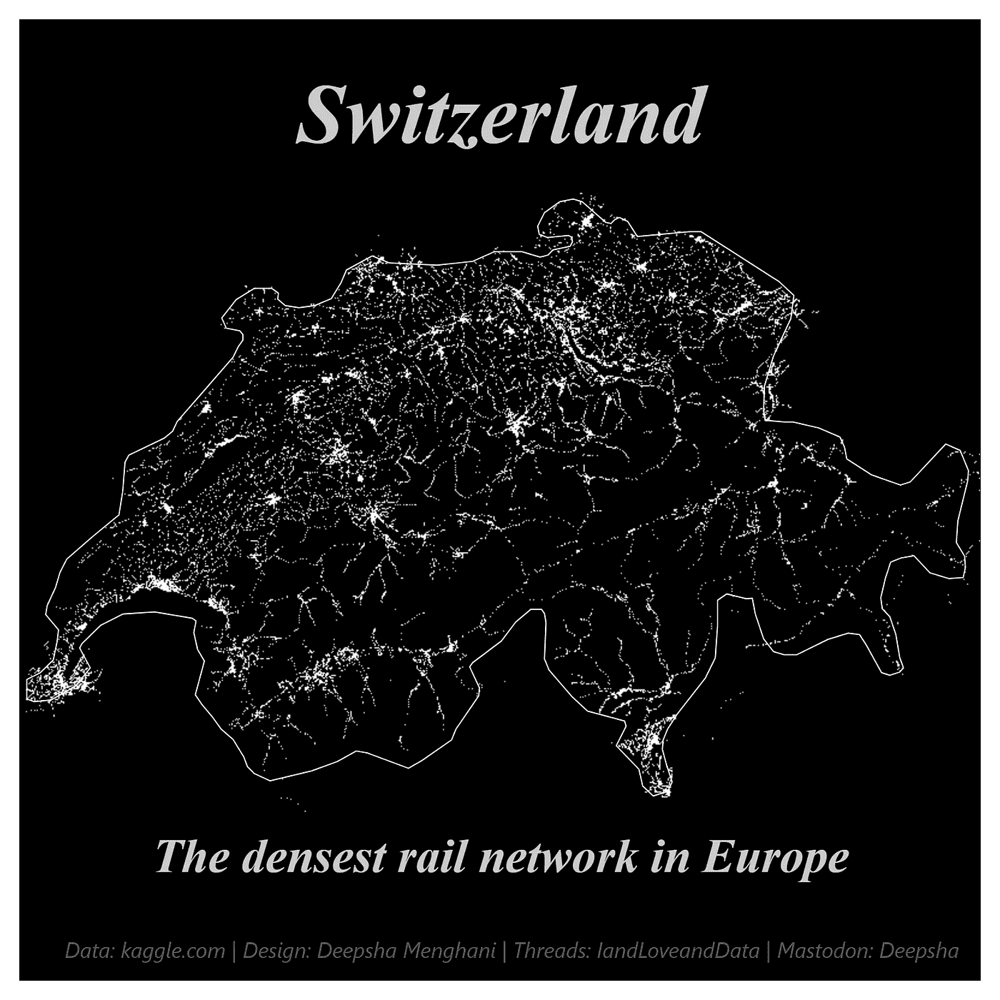

# 探索最终边界：完成 #30DayMapChallenge 之旅

> 原文：[`towardsdatascience.com/charting-the-final-frontier-completing-the-30daymapchallenge-odyssey-bb68d4ab1285?source=collection_archive---------8-----------------------#2023-11-29`](https://towardsdatascience.com/charting-the-final-frontier-completing-the-30daymapchallenge-odyssey-bb68d4ab1285?source=collection_archive---------8-----------------------#2023-11-29)

 [Deepsha Menghani](https://medium.com/@menghani.deepsha?source=post_page-----bb68d4ab1285--------------------------------)

·

[关注](https://medium.com/m/signin?actionUrl=https%3A%2F%2Fmedium.com%2F_%2Fsubscribe%2Fuser%2Fb0c00845bcfa&operation=register&redirect=https%3A%2F%2Ftowardsdatascience.com%2Fcharting-the-final-frontier-completing-the-30daymapchallenge-odyssey-bb68d4ab1285&user=Deepsha+Menghani&userId=b0c00845bcfa&source=post_page-b0c00845bcfa----bb68d4ab1285---------------------post_header-----------) 发布于 [Towards Data Science](https://towardsdatascience.com/?source=post_page-----bb68d4ab1285--------------------------------) ·6 分钟阅读·2023 年 11 月 29 日

--

图片由作者提供

随着 [#30DayMapChallenge](https://30daymapchallenge.com/) 的结束，我深刻感受到社区和协作的力量。每天都有新的主题，每个主题带来了新的见解，而在这个过程中，呈现出了一幅地理可视化故事的挂毯。这个挑战不仅仅是对技能的考验，它是对共享知识和集体创造力的庆祝。

# 反思 #30DayMapChallenge：

对我而言，#30DayMapChallenge 不仅仅是每天制作一张地图的承诺；它是对数据讲故事核心的探索。通过这项挑战，我在每张我设计的地图中将迁移的片段故事、复杂的交通网络和城市生活的脉动缝合在一起，我很高兴与大家分享这些。在这个过程中，我学到了很多关于地理可视化的知识。

延续在[#30DayChartChallenge](https://medium.com/towards-data-science/how-i-used-my-first-30daychartchallenge-to-learn-observable-plot-78141929e3e2)中的实践，我利用[Observable Plot](https://observablehq.com/plot/)的简洁性为数据注入生命。在我之前的文章中，我分享了这次挑战前半部分我最喜欢的可视化。在这篇总结文章中，我将揭示一些剩余的地理可视化作品，每一件都融合了数据、设计和发现。你可以在我的[#30DayMapChallenge](https://observablehq.com/collection/@deepsha/30-day-map-challenge)收藏中找到所有的可视化作品及其数据源和代码。

本文中的所有图像均由作者创作。

# 第 16 天 — 大洋洲

第 16 天 — 大洋洲

利用来自[ala.org.au](http://ala.org.au/)的详细观察记录，我力图通过对澳大利亚独特有袋类动物栖息地的复杂描绘来展示澳大利亚袋鼹鼠的观察情况。

在创建这张地图时，挑战在于以既美观又科学准确的方式呈现空间数据。为了实现这一目标，我将记录到的观察点叠加在澳大利亚的轮廓上，明亮的点表示袋鼹鼠的存在。最终结果是一个信息丰富且引人注目的插图，展示了袋鼹鼠如今稀疏的分布，便于快速视觉评估种群密度和地理分布。

来自[wikipedia.org](http://wikipedia.org.en)的袋鼹鼠背景图像与澳大利亚地图美妙叠加，使得故事更加吸引人、强大和连贯。

# 第 17 天 — 流动

第 17 天 — 流动

来自[databank.worldbank.org](https://databank.worldbank.org/)的全面数据集提供了全球迁移的视角，使我能够将跨越大陆和文化的路线串联起来。在这张图像中，我以全球迁移模式的流动性和动态性捕捉了“流动”主题，从美国到 2000 年排名前 10 的国家。它使用弧线来表示人们在地球上的移动，每条曲线都从美国起点，延伸到世界各地的不同国家。

这种可视化不仅反映了从一个国家到另一个国家的物理移动，还 encapsulates 了迁移过程中固有的文化、思想和联系的转移。

# 第 21 天 — 栅格

第 21 天 — 栅格

对于这个主题，我想创建一个鲜明的西雅图交通碰撞可视化，数据来源于[IBM 课程的毕业项目](https://s3.us.cloud-object-storage.appdomain.cloud/cf-courses-data/CognitiveClass/DP0701EN/version-2/Data-Collisions.csv)。

我使用了栅格图形方法有效地绘制了城市范围内的每一个事件，这本质上涉及将图像分解成像素或颜色点的网格。每个碰撞事件都表示为一个像素化的点，这强调了数据的颗粒度。这种方法允许表示高水平的细节，并创建一个密度图，可以揭示在其他数据可视化形式中不易察觉的模式。

第 21 天 — 栅格插值选项

在上面的图像系列中，我通过一个迷人的视角探索了“栅格”主题，展示了通过 Observable Plot 提供的各种插值方法，应用于西雅图交通碰撞数据。每个面板代表一种不同的方法——默认、最近邻、重心和随机游走——从单一数据集中创造出不同的视觉效果，每种方法都影响数据的空间分布和视觉纹理。‘默认’保持数据的原始颗粒度，而‘最近邻’引入了更加分段、几乎是立体主义的失真。‘重心’提供了数据点的棱镜状折射，而‘随机游走’则创造了扩散、几乎印象派的效果。这确实让我觉得我创造了意外的艺术。

# 第 23 天–3D

第 23 天–3D

在这个图像中，我想展示一个光滑而简约的全球钻石生产图像，通过在黑暗的世界地图上用发光的点来象征，数据来自[theglobaleconomy.com](https://www.theglobaleconomy.com/rankings/diamond_production_USD/)。

为了创建 3D 效果，我绘制了亮点来标记钻石开采的重要位置，这些亮点在世界地图的黑色背景下熠熠生辉，体现了钻石本身的珍贵。为了增强这些点的发光效果，我在它们下方添加了密度可视化。地球的旋转进一步通过这些钻石生产点的出现和消失来增强 3D 效果。

# 第 24 天 — 黑白

第 24 天 — 黑白

我想展示 2016 年至 2020 年间华盛顿州迁移趋势的单色解释，数据来自[美国人口普查局](http://www.census.gov)。这种黑白选择不仅符合美学主题，还突显了人们流入和流出的对比——白色表示净迁入，黑色表示净迁出。

地图上大胆的对比尖峰是该州人口统计变化的图形表示。它们的不同长度和颜色表示迁移的规模和方向，两种颜色的配色方案提供了清晰的视觉差异，增强了理解。通过为这些尖峰和州的边界创建阴影，我想在单色主题的基础上赋予其 3D 效果。

# 第 30 天——我最喜欢的

第 30 天——我最喜欢的

这张图片是对“我最喜欢的……”主题的生动致敬，展示了瑞士复杂而广泛的铁路网络，这一网络被誉为欧洲最密集的。我喜欢欧洲铁路网络的强大，它无疑是我最喜欢的旅行方式。

在这次可视化中，我另一个最喜欢的地方是类型——栅格。使用栅格图，这张地图确实让瑞士铁路网络的工程和组织奇迹如星空般闪耀。我在#30DayMapChallenge 期间学会了如何制作这个，并深深地爱上了这种图表在表示复杂点系统时的强大能力。

# 结束制图探险

这些地图不仅仅是每日练习；它们是放大我们世界复杂性和美丽的透镜。挑战的后半部分与前半部分一样引人入胜，每张地图都是数据与设计、故事与空间交汇的更深入探讨。从濒危物种到国际迁移的脉络，从人们的移动到引导他们的轨迹，#30DayMapChallenge 是对我们如何可视化和解释我们所居住空间的深刻探索。

对于那些一直关注的人，你们的好奇心和参与是这项工作的推动力。对于未来可能踏上这条道路的人：愿每个主题挑战你，社区激励你，愿你创建的每一张地图都成为你探索之旅中的一个里程碑。

所有的可视化，包括它们的底层代码和数据，都可以在我的[Observable 集合](https://observablehq.com/collection/@deepsha/30-day-map-challenge)中找到，供那些渴望开始自己制图冒险的人参考。

如果你愿意，可以在[Linkedin](https://www.linkedin.com/in/deepshamenghani/)上找到我。
