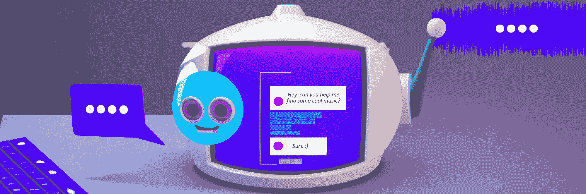

# 聊天机器人即将颠覆音乐搜索

> 原文：[`towardsdatascience.com/chatbots-are-about-to-disrupt-music-search-1e4a4cd7ba01`](https://towardsdatascience.com/chatbots-are-about-to-disrupt-music-search-1e4a4cd7ba01)

## 三个引人注目的范式转变理由

 [Max Hilsdorf](https://medium.com/@maxhilsdorf?source=post_page-----1e4a4cd7ba01--------------------------------)

·发表于[Towards Data Science](https://towardsdatascience.com/?source=post_page-----1e4a4cd7ba01--------------------------------) ·11 分钟阅读·2023 年 6 月 9 日

--

图像由 DALL-E 生成，随后由作者编辑。

技术已经改变了我们搜索和发现音乐的方式。随着技术的不断进步，AI 聊天机器人作为一种有前景的工具，正被用来提升音乐搜索体验。凭借其进行对话互动和提供量身定制的推荐的能力，聊天机器人有望彻底改变我们探索和享受音乐的方式。在这篇博客文章中，我将呈现**三个引人注目的理由**，说明聊天机器人即将接管音乐搜索。

# 1 — 技术已经到来

[Alexandre Debiève](https://unsplash.com/@alexkixa?utm_source=medium&utm_medium=referral)拍摄的照片，来源于[Unsplash](https://unsplash.com/?utm_source=medium&utm_medium=referral)

最近的人工智能进展使聊天机器人技术达到了新的高度，使其能够以更高的智能和细致度理解和回应人类的查询。鉴于对话式搜索相较于传统方法的优势，微软和谷歌等行业巨头已经开始将 AI 聊天机器人应用到其网页搜索引擎中。

在音乐搜索领域，这一转变尤为相关，因为类似“谷歌搜索”的简单关键词搜索在过去几个月才逐渐受到关注。今年早些时候，一些音乐科技初创公司如[Cyanite](https://cyanite.ai/2023/02/01/pr-cyanite-launches-technology-that-can-find-music-based-on-full-text-for-the-first-time/)推出了基于自由文本的音乐搜索功能，作为一种突破性技术。在此之前，音乐搜索主要依赖于选择流派、情绪或艺术家，并在潜在的众多歌曲中筛选出所需的歌曲。

然而，像 ChatGPT 这样的模型的出现促进了从“自由文本”搜索到真正对话式搜索的过渡。这种变革性方法使我们能够克服重复的“输入-输出-重复”工作流程，并用动态和自然的对话取而代之。这种范式的转变与微软的 Bing 和 Google 等主要搜索引擎中所见的持续演变相一致。

此外，构建自定义音乐聊天机器人的可及性已达到前所未有的水平。实际上，我在不到一天的时间内以不到$5 的成本构建了自己的 [音乐聊天机器人原型](https://github.com/MaxHilsdorf/music_search_chatbot) —— 但更多内容将在后续帖子中详细介绍。尽管 ChatGPT 本身在音乐发现方面已经非常有用，但量身定制的聊天机器人系统提供了更精细的响应、与音乐数据库或网页播放器的无缝集成，并且对对话有更大的控制权。得益于开源社区的最新发展，基于特定领域或公司数据进行训练并根据个人需求定制的自定义聊天机器人的构建变得比以往任何时候都更容易。

# 2 — 对话是发现音乐最自然的方式

照片由 [Christina @ wocintechchat.com](https://unsplash.com/@wocintechchat?utm_source=medium&utm_medium=referral) 提供，发布在 [Unsplash](https://unsplash.com/?utm_source=medium&utm_medium=referral) 上。

在音乐发现方面，对话提供了一种自然且直观的方式来探索和寻找新歌曲或艺术家。我们常常依赖朋友、音乐爱好者或专家的推荐，因为这些对话让我们可以表达自己的偏好并获得个性化建议。聊天机器人可以复制这种对话体验，使用户能够就音乐品味进行对话并获得量身定制的推荐。

相比之下，传统的“谷歌搜索”工作流程，我们在过去 20 年中已经习惯了，有时会感到不够直观。当以这种方式搜索音乐时，我们遵循一个严格的步骤顺序：

1.  制作一个文本提示，描述我们要寻找的内容。

1.  浏览响应并听一些曲目。

1.  如果不满意，我们要么分析如何改进提示，使搜索引擎更好地理解我们，要么返回第 1 步。

这种方法的问题在于，每次搜索尝试都会有效地抹去所有先前的结果，即使这些结果对搜索过程的后续阶段可能有用。这种限制正是聊天机器人擅长的地方，因为它们具备存储整个搜索历史（即对话）的能力。

假设你的提示是

> 一首节奏适中的朋克摇滚歌曲，女歌手演唱，歌词内容关于单相思。

传统搜索引擎将执行搜索并推荐 20 首曲目，按预测相关性排序。你听了前 5 首曲目却不喜欢。它们要么是现场录音，要么节奏稍微快了些。于是，你更改了你的提示

> 一首**录音室录音**的朋克摇滚歌曲，**节奏适中偏慢**，女性歌手演唱，歌词关于单相思。

并重新开始搜索。搜索引擎进行另一次（可能代价高昂的）搜索，并向你推荐另外 20 首歌曲。这个过程会一直持续，直到你找到喜欢的曲目为止。

相比之下，音乐搜索聊天机器人以更优雅的方式解决了这个问题。你从你的提示开始

> 一首节奏适中、女性歌手演唱的朋克摇滚歌曲，歌词关于单相思。

聊天机器人很聪明，会要求你更精确地指定节奏，因为它知道否则结果可能不准确。你告诉聊天机器人“我不知道，也许 110-130 bpm？”而没有更改你的原始提示。考虑到从对话中收集的所有信息，聊天机器人发起了搜索，并向你展示了根据预测相关性排序的新 20 首曲目列表。

然而，在查看了前 5 个曲目后，你发现它们再次是现场录音，而你并没有将现场录音作为偏好。幸运的是，你无需回到提示阶段重新开始搜索过程，而是可以利用聊天机器人的能力来细化结果。你只需要求聊天机器人从推荐中排除所有现场录音。聊天机器人理解你的请求后，将现有的 20 首曲目分为两类：录音室录音和现场录音。然后，它会向你展示过滤后的结果，省去了再次进行昂贵搜索的必要。

将音乐搜索概念化为一个过程，而不是简单的输入输出操作，这种方法显然对那些通常不知道自己确切需求的用户有很大帮助。一个聊天机器人…

1.  通过提问后续问题或指出不准确的表述来引导用户描述他们的需求

1.  根据进一步的规格快速更新其推荐

具有大幅颠覆现有音乐搜索系统的潜力。

# 3 — 领域特定的音乐聊天机器人可以像口袋音乐学家一样

照片由 [Jonas Leupe](https://unsplash.com/ja/@jonasleupe?utm_source=medium&utm_medium=referral) 提供，发布于 [Unsplash](https://unsplash.com/?utm_source=medium&utm_medium=referral)

音乐聊天机器人最令人兴奋的前景之一是它们作为领域特定专家的潜力，类似于口袋音乐学家。音乐学家是对各种音乐类型、艺术家、历史背景以及其他复杂细节拥有广泛知识的个人。通过将这些专业知识封装在聊天机器人中，用户可以即时访问大量的信息和见解。

为了说明这一点，我们考虑一个场景：你正在寻找一个体现特定音乐特征的歌曲，但你只能通过“像 AC/DC 风格的吉他独奏”这样的参考来描述它。虽然一个合格的音乐搜索引擎可以搜索到吉他独奏的歌曲，但它可能难以理解这个参考，特别是当它的数据库中没有 AC/DC 的歌曲时。在这种情况下，你唯一的选择是尝试描述 AC/DC 吉他独奏的独特之处，这对没有丰富音乐知识的人来说可能很有挑战。

这就是口袋音乐学家聊天机器人的无价之处。一个经过多种来源（如专辑评论、粉丝论坛、乐谱和已发表的音乐分析）的训练的音乐聊天机器人，具备深刻的理解，知道典型的 AC/DC 吉他独奏是如何构建和演奏的。因此，聊天机器人可以将你的参考信息转化为精确的提示，以描述所需的音乐特征，从而被搜索引擎有效利用。

在这里，我要求 ChatGPT 列出一些 AC/DC 独奏的刻板特征。它给出的答案是：

> 1\. 节奏蓝调的影响。
> 
> 2\. 简单且引人入胜的旋律。
> 
> 3\. 原始而粗犷的经典摇滚声音。
> 
> 4\. 强力和标志性吉他段。
> 
> 5\. 布鲁斯风格的弯音和颤音。
> 
> 7\. 高能量和激进的演奏风格。

当然，这些结果并不令人惊艳。然而，请记住，这是一个通用聊天机器人，没有经过特定的音乐学培训。你可以想象，像这样的领域特定聊天机器人能够提供更准确和详细的描述。

这只是将音乐聊天机器人概念化为口袋音乐学家的一个例子，说明它如何帮助改善搜索体验。然而，可能性是无穷的。例如，你可以开始对话，要求聊天机器人列出一些有趣的爵士乐子类型，并解释每种类型的主要特点。然后，你可以选择一个听起来有趣的类型，并在该类型内发起搜索。考虑一下：当 ChatGPT 在 2022 年底发布时，没人能预见到它将为数百万用户提供的广泛用途。基于聊天机器人的音乐搜索同样适用。

# 开放性问题

图片来源：[JESHOOTS.COM](https://unsplash.com/@jeshoots?utm_source=medium&utm_medium=referral) 在 [Unsplash](https://unsplash.com/?utm_source=medium&utm_medium=referral)

## 聊天还是不聊天

在前面的部分中，我提出了三个理由，说明我们可能正处于音乐搜索范式转变的边缘。虽然对这些论点的有效性可能存在不同意见，但关键问题在于，基于聊天机器人的音乐搜索的优势和可行性是否能说服公司和研究机构开发这项技术。

绝不是显而易见的，聊天机器人会完全取代传统搜索引擎。幸运的是，我们可以深入研究其他搜索领域的进展，特别是网络搜索。尽管如新必应、谷歌搜索和 Perplexity AI 等网络搜索聊天机器人已经出现，但它们的使用仍主要限于技术爱好者和人工智能专业人士。显然，这些聊天机器人尚未获得与通用（并且离线！）聊天机器人 ChatGPT 相媲美的广泛采用。最显著的是，它们远未替代传统的谷歌搜索引擎。

尽管这可能部分由于产品成熟和潜在用户采纳所需的时间，但也有实际考虑因素有利于继续使用更传统的基于关键词或语义的搜索。例如，搜索引擎常被用来查找我们曾经遇到过但不记得完整名称或网址的特定文章、网站或歌曲。在这种情况下，使用基于关键词的搜索并将搜索输入与与输入的关键词紧密匹配的结果对比，更为实际。利用像聊天机器人这样的复杂技术来完成这一任务就像用大锤去砸坚果一样。

此外，并不是每次互动都需要是对话。例如，当在特定的音乐类型中搜索歌曲时，你可能更希望不与 AI 机器人进行对话。这有两个原因。首先，你可能希望获得即时结果，因此任何偏离提供搜索结果的搜索引擎回应都是浪费时间。其次，使用聊天机器人可能将纯粹机械的音乐搜索行为转变为社交互动。这种潜在的社交方面可能被视为一种缺点，特别是对于那些寻求通过音乐逃避社交环境的人来说。

总而言之，我预计这种范式转变不会完全消除传统的音乐搜索方法。相反，我设想聊天机器人将被用于用户寻求指导和咨询的场景，而不是快速筛选音乐目录。在生产音乐领域，基于聊天机器人的搜索可以大大帮助找到适合商业广告或 YouTube 视频的完美曲目。然而，对于普通的音乐流媒体服务用户而言，大多数情况下还是采用更传统的搜索系统可能更为实际。*最终*，这种范式转变可能会表现为生产音乐库和音乐流媒体服务结合两种类型的搜索，以满足用户的多样化需求。

## 技术实现

在今天的技术环境中，构建符合特定业务需求的定制聊天机器人变得异常容易。有几种方法可以实现这一点。一种方法是利用像 OpenAI 的 GPT 模型这样的基础模型，通过 API 进行调用，并用自定义逻辑进行增强。另一种方法是利用开源语言模型，并使用领域特定数据对其进行微调，以确保其相关性和准确性。

通过 API 使用像 GPT-4 这样的预构建基础模型提供了许多优点。首先，它使企业能够直接利用这些模型，而无需额外的数据获取、准备或机器学习工作。这对于数据科学家有限或没有的公司尤其有利，因为它将任务简化为软件工程问题。其次，不需要担心构建本地或云基础设施以满足这些大型模型的计算需求。通过利用 API，企业可以以相对较低的成本访问托管解决方案。

一个缺点是，你的数据，包括用户搜索输入、音乐元数据等，可能会被模型提供者（例如 OpenAI）访问，甚至用于进一步训练他们的模型。这可能不符合内部数据治理指南或外部法规，具体取决于你的情况。另一个缺点是这些第三方解决方案通常不允许在你的数据上对其模型进行微调。因此，无法开发之前描述的那种“口袋音乐专家”。

另一方面，使用自己基础设施上的开源模型有几个优势。首先，没有限制可以完全定制一个聊天机器人以满足你的具体需求。通过微调过程，你可以将其转变为全面的音乐专家，或训练它理解你公司或领域内使用的特定词汇。其次，工作流的每一步，包括微调和模型推断，都可以在你的基础设施中实现。这消除了对内部指南或外部法规合规性的任何顾虑。

使用开源模型构建自己的聊天机器人有一个缺点，即会产生显著的工程开销。这会消耗计算和人力资源，在看到初步结果之前，你可能会犹豫是否投资于这种产品。此外，开源模型更新换代的速度很快。因此，你需要过渡到更新的模型，并定期重复微调过程，从而消耗额外资源。相比之下，通过 API 提供的托管解决方案提供了更大的灵活性，可以尝试并切换到其他聊天机器人模型。

总之，如果你的目标是开发一个快速原型或缺乏在适当基础设施中微调和部署自己模型所需的人力资源，我建议目前选择一个托管的 API 解决方案。这正是我为我的[聊天机器人原型](https://github.com/MaxHilsdorf/music_search_chatbot)所做的，你可以从我的方法中获得灵感。然而，值得注意的是，这些解决方案可能会被更先进和定制的系统所超越，比如基于开源模型的系统。

## 进一步阅读

如果你对这样的系统如何实现感兴趣，可以考虑查看我在不到一天内构建的音乐搜索聊天机器人，链接在这个[GitHub 仓库](https://github.com/MaxHilsdorf/music_search_chatbot)中。我正在编写一篇后续文章，详细描述我如何构建它。

这里还有两篇关于音乐 AI 当前发展的文章，你可能会喜欢：

+   AudioGPT — 未来音乐创作的瞥见

+   [谷歌如何利用虚假数据集来训练生成音乐 AI](https://medium.com/towards-data-science/how-google-used-fake-datasets-to-train-generative-music-ai-def6f3f71f19)
