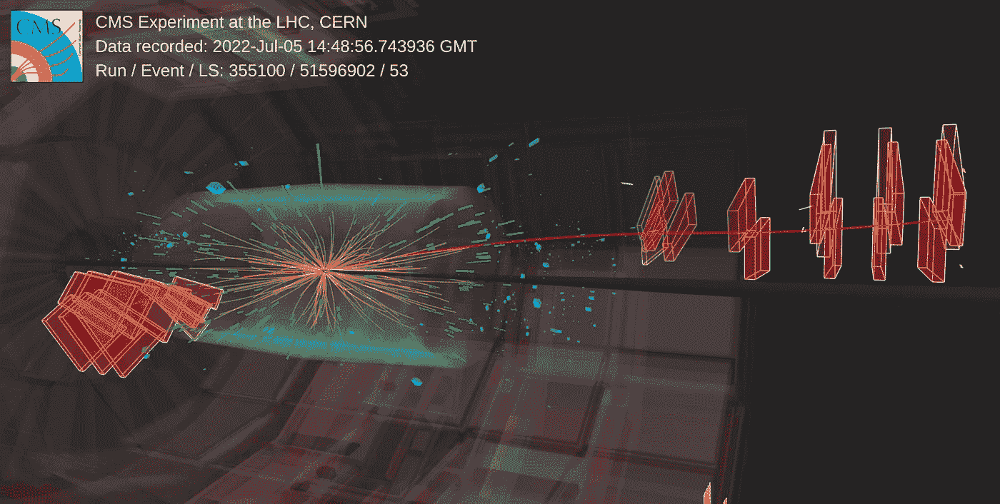

# 推动边界：ChatGPT 在粒子物理学中的应用

> 原文：[`towardsdatascience.com/chatgpt-applications-in-high-energy-physics-science-particle-chatgpt4-chatgpt3-f70eda3232bd?source=collection_archive---------6-----------------------#2023-06-08`](https://towardsdatascience.com/chatgpt-applications-in-high-energy-physics-science-particle-chatgpt4-chatgpt3-f70eda3232bd?source=collection_archive---------6-----------------------#2023-06-08)

## 探索 ChatGPT 在研究中的无限潜力

 [安德烈亚·瓦伦苏埃拉](https://medium.com/@andvalenzuela?source=post_page-----f70eda3232bd--------------------------------)

·

[关注](https://medium.com/m/signin?actionUrl=https%3A%2F%2Fmedium.com%2F_%2Fsubscribe%2Fuser%2Fa6f3f1654c3&operation=register&redirect=https%3A%2F%2Ftowardsdatascience.com%2Fchatgpt-applications-in-high-energy-physics-science-particle-chatgpt4-chatgpt3-f70eda3232bd&user=Andrea+Valenzuela&userId=a6f3f1654c3&source=post_page-a6f3f1654c3----f70eda3232bd---------------------post_header-----------) 发布于 [Towards Data Science](https://towardsdatascience.com/?source=post_page-----f70eda3232bd--------------------------------) ·6 分钟阅读·2023 年 6 月 8 日

[]

[[来源](https://cms.cern/news/wait-overthe-lhc-run-3-has-started)] 在瑞士 CERN 的大型强子对撞机（LHC）CMS 探测器中的粒子碰撞。

上个月，计算领域的高能物理（HEP）社区举办了一次重要会议：**所谓的** [**CHEP 2023**](https://www.jlab.org/conference/CHEP2023)，代表 **高能物理** 和核物理的 **计算** — *是的，简单！* :)

作为一名在[CERN](https://home.cern/)工作的计算机工程师，这是一件大事：这是**观察我们领域最新技术趋势的机会**。尽管我完全了解 ChatGPT 的当前热门程度，但我并没有预料到会有关于这个主题的演讲。结果我完全错了，*确实有几场！*

我发现这些非常吸引人，所以在这篇文章中，**我想描述一下这些演讲的主要信息**。ChatGPT 不仅在重塑我们的日常任务，还在改变像 HEP 这样的重要研究领域。

**让我们探索一下即将到来的内容吧！**

# HEP 和 CHEP——简要介绍

HEP 社区指的是全球从事高能物理领域的科学家、研究人员、工程师、技术人员和机构的网络。这个社区致力于研究**物质的基本构成**、**支配它们的力量**…
