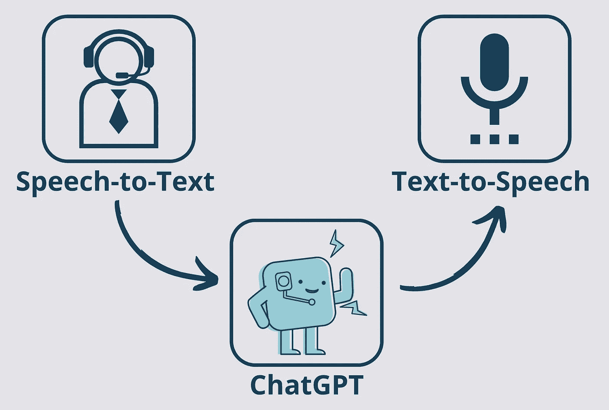
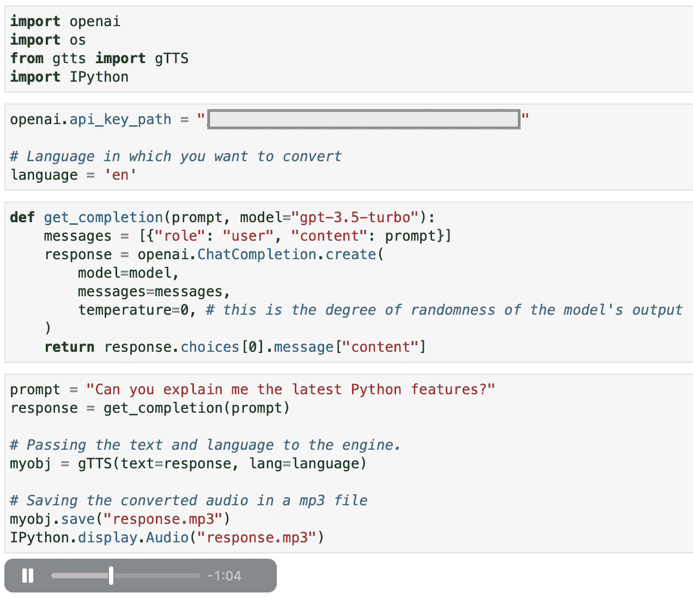

# 开启 ChatGPT 的新维度：文本转语音集成

> 原文：[`towardsdatascience.com/chatgpt-text-to-speech-artificial-intelligence-python-data-science-52456f51fad6`](https://towardsdatascience.com/chatgpt-text-to-speech-artificial-intelligence-python-data-science-52456f51fad6)

## 提升 ChatGPT 互动中的用户体验

 [Andrea Valenzuela](https://medium.com/@andvalenzuela?source=post_page-----52456f51fad6--------------------------------)

·发表于 [Towards Data Science](https://towardsdatascience.com/?source=post_page-----52456f51fad6--------------------------------) ·阅读时间 6 分钟·2023 年 5 月 30 日

--

图片来源：[Jason Rosewell](https://unsplash.com/@jasonrosewell?utm_source=unsplash&utm_medium=referral&utm_content=creditCopyText) 在 [Unsplash](https://unsplash.com/es/fotos/ASKeuOZqhYU?utm_source=unsplash&utm_medium=referral&utm_content=creditCopyText)

如果你进入了这篇文章，我敢肯定你已经使用 ChatGPT 有一段时间了。我也是 :)

在过去几个月里，我专注于如何从 ChatGPT 中获得更好的输出，即所谓的[*提示工程*](https://medium.com/gitconnected/improve-chatgpt-performance-prompt-engineering-data-science-artificial-intelligence-6fa3953bc5b6) 或构建使用大型语言模型（LLM）的[自定义应用程序](https://medium.com/towards-data-science/chatgpt-summarization-llms-chatgpt3-chatgpt4-artificial-intelligence-16cf0e3625ce)。然而，最近我在思考**如何提升 ChatGPT 的用户体验**。

网页界面还不错，但我们会同意经过几次迭代后，它并不那么用户友好。*如果我们能更进一步，给 ChatGPT 一个声音会怎样？* **想象一下 ChatGPT 像你自己的 AI 助手一样大声回应你**。

在这篇文章中，我们将探讨如何通过为 ChatGPT 的输出添加文本转语音（TTS）层来增强你的 ChatGPT 体验，从而获得听 ChatGPT 而不仅仅是阅读的所有好处。

**让我们为 ChatGPT 赋予声音，使你的互动更加引人入胜、易于访问和方便！**

# 语音合成技术

文本到语音技术在用户体验方面已成为游戏规则的改变者。顾名思义，**这些技术可以将任何输入文本转换为语音**。如今，TTS 技术在我们的日常生活中十分普遍，应用范围涵盖多个领域。

例如，流行的虚拟助手如*Siri*、*Alexa*或*Google Home*利用 TTS 技术提供对用户查询的语音回应。**这些设备将基于文本的信息转换为合成语音**，使用户能够通过语音命令与设备互动，并获得听觉反馈。

流行的 GPS 导航系统如*Google Maps*也是一个例子。**TTS 技术将书面街道名称和方向转换为语音提示**，使驾驶员能够集中注意力在道路上，同时获得导航指导。

## 可访问性与 TTS

将 TTS（文本到语音技术）集成到我们日常生活中的一个显著优势是它对可访问性带来的积极影响。

例如，文本到语音技术为视力障碍者打开了一个新的可能性世界。**TTS 系统使视觉障碍者能够独立获取信息**，通过提供书面内容的听觉输出。

**它们还允许免手操作的互动，这对运动障碍者非常有帮助**，因为他们可以毫不费力地进行对话，而无需进行物理互动或打字。

此外，TTS 还带来了对话自然性的额外好处，使其特别**适合音频学习者或那些仅通过阅读处理信息困难的人**。

# ChatGPT 与 TTS

向 ChatGPT 添加文本到语音层可以使 AI 模型感觉更加人性化和易于亲近，**促进更强的连接，使对话更加引人入胜和愉快**。

在学习新科目或探索陌生主题时，听到 ChatGPT 的解释可以提供更具沉浸感和吸引力的体验。**通过将基于文本的互动与音频解释相结合，ChatGPT 可以提供一个全面的学习环境**，适应各种学习风格和偏好。这可以促进知识的保留和对讨论概念的更深入理解。

例如，当使用 ChatGPT 学习一门新语言时，ChatGPT 的语音合成能力可以通过**提供准确的语言音频表示**来帮助学习者提高语言技能。这可以促进语言练习、纠正口音以及整体流利度的发展，从而增强学习体验。

## 架构

在这篇文章中，我们专注于将 ChatGPT 输出的文本进行语音再现的文本到语音过程。然而，**我们也可以通过语音将提示输入给 ChatGPT，从而完成闭环**。

自制图示。`语音识别` → `ChatGPT API` → `文本转语音`循环的表示。

*你是否也对用大声提问 ChatGPT 感兴趣？* 请告诉我，以便我提供一篇后续文章，介绍整个`**语音识别**` **→** `**ChatGPT API**` **→** `**文本转语音**` **循环**。

# Python 集成

让我们开始实践，将 ChatGPT API 和 TTS 库集成到 Jupyter Notebook 中。

## ChatGPT API

这里是我们将在实现中调用 ChatGPT API 的基本代码结构：

函数`get_completion()`使用给定的*提示*调用 ChatGPT API。如果提示包含额外的*用户文本*，它将被三引号分隔开。

## **Google 文本转语音（**gTTS**）库**

为了大声重现 ChatGPT 的输出，我们将使用开源的`gTTs`库。

**`**gTTS**`**库是一个免费的 Python 包装器，用于 Google 文本转语音 API**。它允许你将文本转换为语音并生成音频文件。该库的一些关键功能包括：

1.  **文本转语音转换**：它通过利用 Google 的文本转语音 API，将文本转换为语音。

1.  **语言和口音选择**：你可以指定生成语音的语言和口音。它支持多种语言和口音，如*澳大利亚英语*等。

1.  **音频文件生成**：该库生成`MP3`格式的音频文件，可以保存和播放。

1.  **其他音频功能**：它包括其他可能性，如`slow`选项以更慢地朗读输出文本或`lang_check`以检测文本中的语言错误。

此外，它提供了方便的 Jupyter Notebook 集成，使其成为我们目的的优秀开源选择。

## 赋予 ChatGPT 声音

将 TTS 层实现到 ChatGPT 中是相当简单的。**我们只需将 ChatGPT 的** `**response**` **传递给** `**gTTS()**` **方法**，然后将其保存为`.mp3`文件。最后，我们可以使用`IPython`模块重复播放响应多次。

通过使用此实现，任何 ChatGPT 调用在我们的 Jupyter Notebook 中将如下所示：

从示例 Jupyter Notebook 中截图。

**现在是你尝试并将 ChatGPT 提升到下一个水平的时候了！**

# 总结

听取解释可以通过以不同的方式呈现信息来增强理解。具有语音功能的 ChatGPT 扩展了在各种领域使用语言模型的可能性，如教育、无障碍技术、客户支持和语言学习，提升了任何使用案例中的整体用户体验。

**通过使用简单的 API 调用以及 gTTS 和 IPython 库，可以通过大声朗读 ChatGPT 的输出，提升其用户体验**。正如文章中提到的，可以通过使用语音转文本库，将指令大声朗读给 ChatGPT，从而实现完整的无文本工作流程。*敬请期待下一篇文章！*

就这些了！非常感谢你的阅读！

我希望这篇文章能帮助你**定制 ChatGPT，以提高可访问性和用户体验！**

你还可以订阅我的 **新闻通讯** 以保持关注新内容。**特别是**，**如果你对 ChatGPT 相关文章感兴趣**：

 ## 掌握 ChatGPT：利用 LLMs 进行有效总结

### 如何提示 ChatGPT 以获得高质量总结

[towardsdatascience.com  [## 我从 OpenAI 的提示工程课程中学到了什么 — 提示指南

### 了解 OpenAI 的提示指南

[medium.com](https://medium.com/geekculture/prompt-engineering-prompting-guidelines-chatgpt-chatgpt3-chatgpt4-artificial-intelligence-6b74f35d2695?source=post_page-----52456f51fad6--------------------------------)  [## 通过提示工程提高 ChatGPT 性能

### 如何向 ChatGPT 提问以最大化成功回答的机会

[levelup.gitconnected.com](https://levelup.gitconnected.com/improve-chatgpt-performance-prompt-engineering-data-science-artificial-intelligence-6fa3953bc5b6?source=post_page-----52456f51fad6--------------------------------)  ## ChatGPT 知道你的哪些信息：OpenAI 在数据隐私方面的探索

### 管理 ChatGPT 中个人数据的新方法

[towardsdatascience.com

**如果你有任何问题，请随时转发给** *forcodesake.hello@gmail.com* :)
