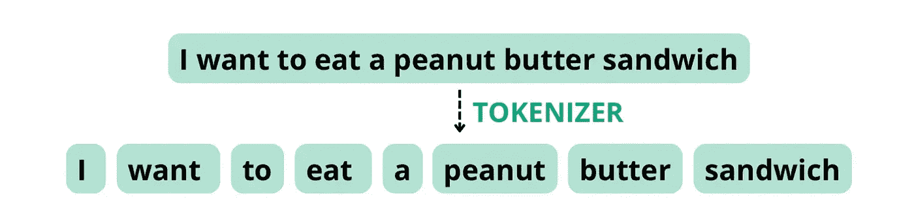
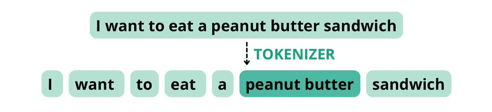
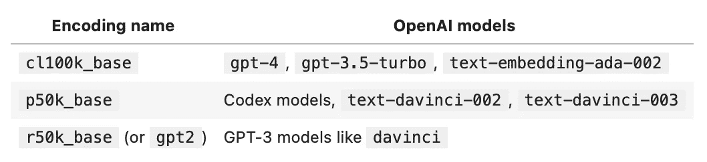
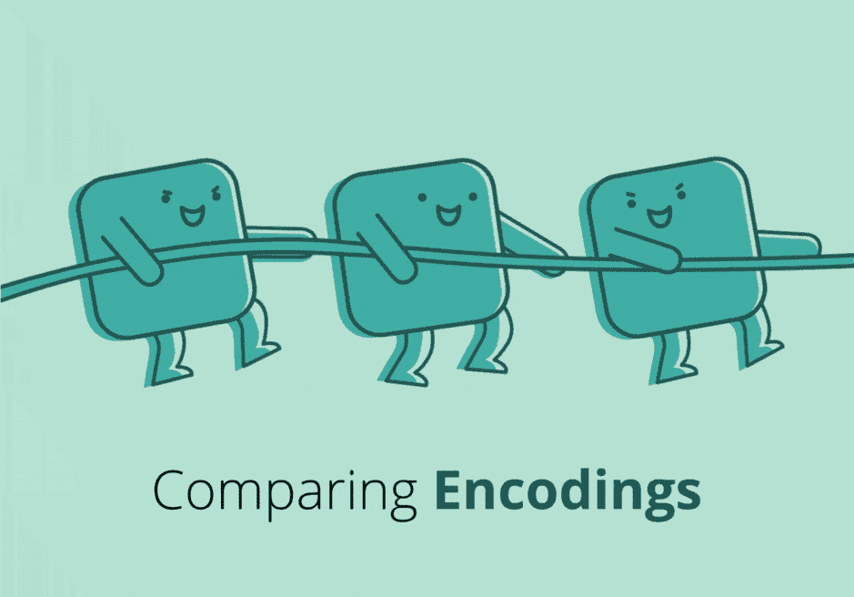
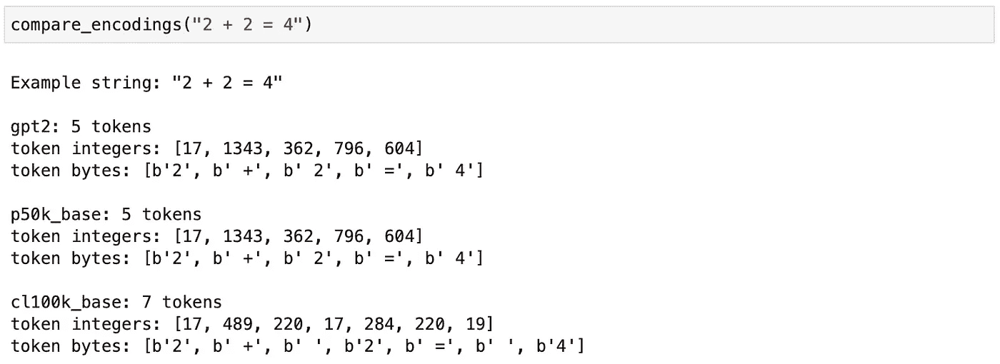
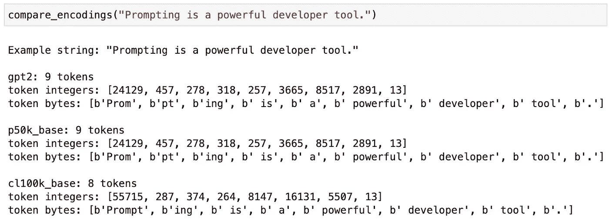
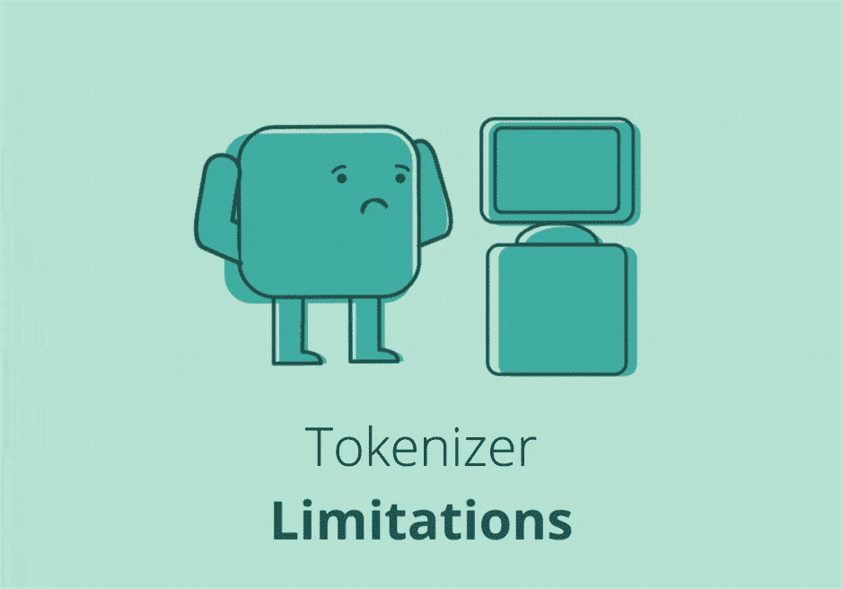
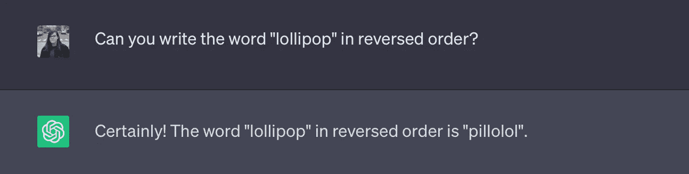
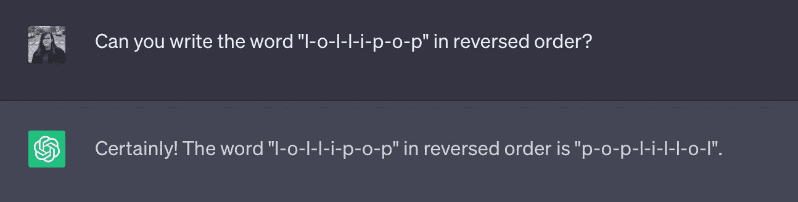

# 解锁 ChatGPT 分词器

> 原文：[`towardsdatascience.com/chatgpt-tokenizer-chatgpt3-chatgpt4-artificial-intelligence-python-ai-27f78906ea54`](https://towardsdatascience.com/chatgpt-tokenizer-chatgpt3-chatgpt4-artificial-intelligence-python-ai-27f78906ea54)

## 实践操作！ChatGPT 如何管理令牌？

[](https://medium.com/@andvalenzuela?source=post_page-----27f78906ea54--------------------------------)[](https://towardsdatascience.com/?source=post_page-----27f78906ea54--------------------------------) [Andrea Valenzuela](https://medium.com/@andvalenzuela?source=post_page-----27f78906ea54--------------------------------)

·发布于 [Towards Data Science](https://towardsdatascience.com/?source=post_page-----27f78906ea54--------------------------------) ·阅读时间 9 分钟·2023 年 7 月 6 日

--


自制 gif。

**你是否曾经好奇 ChatGPT 背后的关键组件是什么？**

我们都被告知 ChatGPT 预测下一个单词。但实际上，这个说法有点误导。**它并不是预测下一个单词，ChatGPT 预测的是下一个令牌**。

*令牌？* 是的，令牌是大型语言模型（LLMs）中的文本单元。

实际上，**ChatGPT 在处理任何提示时的第一个步骤之一就是将用户输入拆分成令牌**。这就是所谓的 **分词器** 的工作。

在本文中，我们将揭示 ChatGPT 分词器如何使用 OpenAI 的原始库进行实践操作，即 `tiktoken` 库。

*TikTok 风格... 有趣 :)*

让我们深入了解分词器实际执行的步骤，以及它的行为如何真正影响 ChatGPT 输出的质量。

# 分词器如何工作

在文章掌握 ChatGPT：使用 LLMs 的有效总结中，我们已经看到了 ChatGPT 分词器背后的一些奥秘，但让我们从头开始。

分词器在文本生成过程的第一步出现。**它负责将我们输入给 ChatGPT 的文本片段拆分为单个元素**，即令牌，这些令牌随后被语言模型处理以生成新的文本。

当分词器将一段文本拆分为令牌时，它是根据一组规则进行的，这些规则旨在识别目标语言中的有意义的单元。

例如，当给定句子中出现的词汇是相当常见的词时，每个标记很可能对应一个单词。但如果我们使用一个包含不常见词汇的提示，例如在句子*“Prompting as powerful developer tool”*中，我们可能无法获得一对一的映射。在这种情况下，词语*prompting*在英语中仍然不那么常见，因此它实际上被拆分成三个标记：*“‘prom”*、*“pt”*和*“ing”*，因为这三个序列是常见的字母组合。

*让我们看另一个例子！*

考虑以下句子：*“I want to eat a peanut butter sandwich”*。如果分词器配置为基于空格和标点符号拆分标记，它可能会将此句子拆分为以下标记，总词数为 8，与标记数相等。



自制图像。

然而，如果分词器将*“peanut butter”*视为一个复合词，因为这些组件经常一起出现，它可能会将句子拆分为以下标记，**总词数为 8，但标记数为 7**。



自制图像。

在 ChatGPT 和标记管理的上下文中，术语**编码和解码指的是将文本转换为模型可以理解的标记（编码）以及将模型的输出转换回人类可读文本（解码）**的过程。

# Tiktoken 库

了解 ChatGPT 分词器背后的理论是必要的，但在本文中，我也想重点关注一些实际的揭示。

ChatGPT 实现使用`tiktoken`库来管理标记。我们可以像使用其他 Python 库一样使它运行起来：

```py
pip install --upgrade tiktoken
```

一旦安装完毕，获取与 ChatGPT 相同的编码模型非常简单，因为有一个`encoding_for_model()`方法。顾名思义，这个方法会自动加载给定模型名称的正确编码。

第一次为给定模型运行时，需要互联网连接以下载编码模型。之后的运行则不需要互联网，因为编码已经预先缓存。

对于广泛使用的`gpt-3.5-turbo`模型，我们可以简单地运行：

```py
import tiktoken
encoding = tiktoken.encoding_for_model("gpt-3.5-turbo")
```

输出`encoding`是一个分词器对象，我们可以用来可视化 ChatGPT 实际上如何看到我们的提示。

更具体地说，`tiktoken.encoding_for_model`函数初始化一个专门用于`gpt-3.5-turbo`模型的分词管道。这个管道处理文本的分词和编码，为模型的使用做准备。

一个重要的方面是，标记是数值表示。在我们的*“Prompting as powerful developer tool”*示例中，与词语*prompting*相关的标记是*“‘prom”*、*“pt”*和*“ing”*，但模型实际接收到的是这些序列的数值表示。

*不必担心！* 我们将在实践部分看到这是什么样的。

## 编码类型

`tiktoken`库支持多种编码类型。实际上，不同的`gpt`模型使用不同的编码。以下是最常见的编码类型的表格：



## 编码 — 实操！

让我们继续前进，尝试对我们的第一个提示进行编码。给定提示 *“tiktoken is great！”* 和已加载的`encoding`，我们可以使用方法`encoding.encode`将提示分割成标记并可视化其数值表示：

```py
prompt = "tiktoken is great!"
encoded_prompt = encoding.encode(prompt)
print(encoded_prompt)
# Output: [83, 1609, 5963, 374, 2294, 0]
```

*是的，这是真的。* 输出 `[83, 1609, 5963, 374, 2294, 0]` 似乎不太有意义。但实际上，从一眼看过去可以猜到一些东西。

*明白了吗？*

*长度！* 我们可以很快看到我们的提示 *“tiktoken is great！”* 被分割成了 6 个标记。在这种情况下，**ChatGPT 并不是基于空格分割这个样本提示，而是基于最常见的字母序列。**

在我们的示例中，输出列表中的每个坐标对应于标记化序列中的一个特定标记，即所谓的标记 ID。**标记 ID 是整数，根据模型使用的词汇表唯一标识每个标记**。ID 通常映射到词汇表中的单词或子词单位。

让我们解码坐标列表，以便再次检查它是否与原始提示相符：

```py
encoding.decode(encoded_prompt)
# Output: 'tiktoken is great!'
```

`.decode()` 方法将标记整数列表转换为字符串。虽然 `.decode()` 方法可以应用于单个标记，但**要注意它对不在 `**utf-8**` 边界上的标记可能会有损失。**

现在你可能想知道，*有没有办法查看单独的标记？*

*让我们开始吧！*

对于单个标记，`.decode_single_token_bytes()` 方法可以安全地将单个整数标记转换为它表示的字节。对于我们的示例提示：

```py
[encoding.decode_single_token_bytes(token) for token in encoded_prompt]
# Output: [b't', b'ik', b'token', b' is', b' great', b'!']
```

请注意，字符串前的`b`表示这些字符串是字节字符串。对于英语，平均每个标记大约对应四个字符或约四分之三的单词。

了解文本是如何被分割成标记的很有用，因为 GPT 模型以标记的形式查看文本。知道文本字符串中有多少个标记可以提供有用的信息，比如字符串是否对文本模型来说过长，或者 OpenAI API 调用的成本是多少，因为使用是按标记计价的，等等。

# 比较编码模型



自制 gif。

正如我们所见，**不同模型使用不同的编码类型**。有时，不同模型之间的标记管理差异可能非常大。

**不同的编码在分割单词、分组空格和处理非英语字符方面有所不同**。使用上述方法，我们可以对几种示例字符串比较不同`gpt`模型的编码。

让我们比较一下上表中的编码（`gpt2`、`p50k_base` 和 `cl100k_base`）。为此，我们可以使用以下包含我们迄今所见所有要点的函数：

`compare_encodings` 函数以 `example_string` 作为输入，比较该字符串使用三种不同编码方案的编码：`gpt2`、`p50k_base` 和 `cl100k_base`。最后，它打印关于编码的各种信息，包括标记数、标记整数和标记字节。

*让我们尝试一些例子！*



在这个第一个例子中，尽管 `gpt2` 和 `p50k_base` 模型在将数学符号与空格合并在一起的编码上达成一致，但 `cl100k_base` 编码则认为它们是分开的实体。



在这个例子中，单词 *Prompting* 的标记化方式也取决于所选择的编码。

# 标记器限制



自制 gif。

**这种对输入提示进行标记化的方法有时会导致一些 ChatGPT 完成错误**。例如，如果我们让 ChatGPT 将单词 lollipop 反向书写，它会做错！



自制截图。

这里发生的情况是标记器实际上将给定的单词分解为三个标记：*“l”*、*“oll”* 和 *“ipop”*。因此，**ChatGPT 无法看到单独的字母，而是看到这三个标记**，这使得正确反向打印单独字母更加困难。

了解这些限制可以帮助你找到避免这些问题的解决方法。在这种情况下，如果我们在单词的字母之间添加短横线，我们可以迫使标记器根据这些符号拆分文本。通过稍微修改输入提示，它实际上做得更好：



自制截图。

**通过使用短横线，模型更容易看到单独的字母并将其反向打印**。所以请记住：如果你想让 ChatGPT 玩字词游戏，如 *Word* 或 *Scrabble*，或者围绕这些原则构建应用程序，这个巧妙的技巧可以帮助它更好地识别单独的字母。

**这只是一个简单的例子，其中 ChatGPT 标记器导致模型在非常简单的任务中失败**。*你遇到过其他类似的情况吗？*

# 总结

在这篇文章中，我们探讨了**ChatGPT 如何查看用户提示并根据从大量语言数据中学习的统计模式处理这些提示以生成完成输出**。

通过使用 `tiktoken` 库，**我们现在可以在将提示输入 ChatGPT 之前评估任何提示**。这可以帮助我们**调试 ChatGPT 错误**，因为通过稍微修改提示，我们可以让 ChatGPT 更好地完成任务。

还有一个额外的信息：**一些设计决策可能会在未来转变为技术债务**。正如我们在简单的*棒棒糖*示例中看到的，尽管模型在令人惊叹的任务中表现出色，但它不能完成简单的练习。这背后的原因不在于模型的能力，而在于最初的分词步骤！

就这些了！非常感谢阅读！

我希望这篇文章能帮助你在**构建 ChatGPT 应用程序时**！

你也可以订阅我的[**新闻通讯**](https://towardsdatascience.com/@andvalenzuela/subscribe)以获取最新内容。**特别是**，**如果你对 ChatGPT 相关文章感兴趣**：

[](/chatgpt-summarization-llms-chatgpt3-chatgpt4-artificial-intelligence-16cf0e3625ce?source=post_page-----27f78906ea54--------------------------------) ## 精通 ChatGPT：使用 LLMs 进行有效总结

### 如何提示 ChatGPT 以获得高质量的总结

towardsdatascience.com [](https://medium.com/geekculture/prompt-engineering-course-openai-inferring-transforming-expanding-chatgpt-chatgpt4-e5f63132f422?source=post_page-----27f78906ea54--------------------------------) [## OpenAI 提示工程课程 — 使用 ChatGPT 进行推断、转换和扩展

### 最大化 ChatGPT 在你自定义应用程序中的潜力

medium.com](https://medium.com/geekculture/prompt-engineering-course-openai-inferring-transforming-expanding-chatgpt-chatgpt4-e5f63132f422?source=post_page-----27f78906ea54--------------------------------) [](/chatgpt-text-to-speech-artificial-intelligence-python-data-science-52456f51fad6?source=post_page-----27f78906ea54--------------------------------) ## 解锁 ChatGPT 的新维度：文本到语音集成

### 提升 ChatGPT 交互中的用户体验

[towardsdatascience.com

**随时向*forcodesake.hello@gmail.com*提出任何问题** :)
