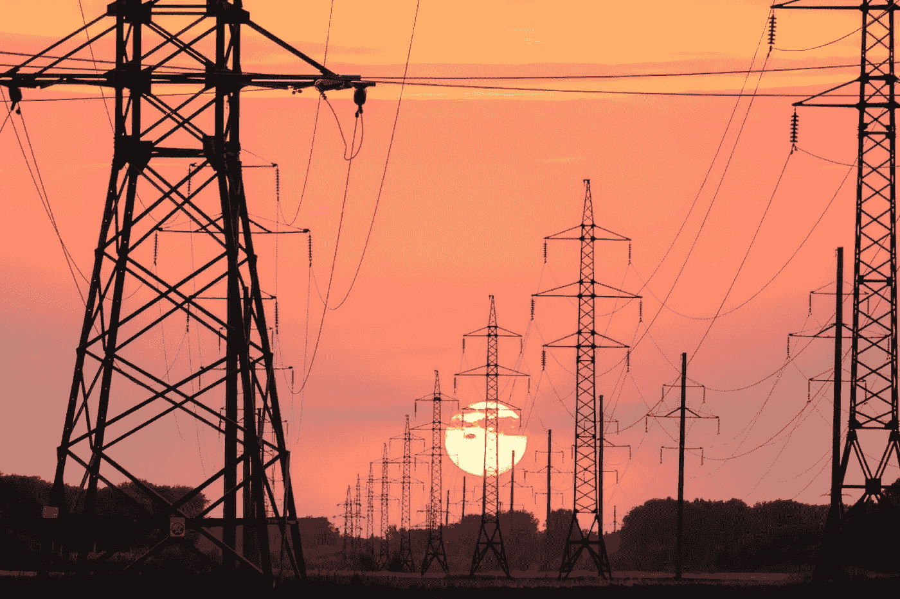

# ChatGPT 每个查询的能源使用量

> 原文：[`towardsdatascience.com/chatgpts-energy-use-per-query-9383b8654487?source=collection_archive---------1-----------------------#2023-08-06`](https://towardsdatascience.com/chatgpts-energy-use-per-query-9383b8654487?source=collection_archive---------1-----------------------#2023-08-06)

## ChatGPT 回答一个问题需要多少电量？

 [Kasper Groes Albin Ludvigsen](https://kaspergroesludvigsen.medium.com/?source=post_page-----9383b8654487--------------------------------)

·

[关注](https://medium.com/m/signin?actionUrl=https%3A%2F%2Fmedium.com%2F_%2Fsubscribe%2Fuser%2Fba0b31bed21a&operation=register&redirect=https%3A%2F%2Ftowardsdatascience.com%2Fchatgpts-energy-use-per-query-9383b8654487&user=Kasper+Groes+Albin+Ludvigsen&userId=ba0b31bed21a&source=post_page-ba0b31bed21a----9383b8654487---------------------post_header-----------) 发表在 [Towards Data Science](https://towardsdatascience.com/?source=post_page-----9383b8654487--------------------------------) · 8 分钟阅读 · 2023 年 8 月 6 日

--

图片来自 Andrey Metelev 于 Unsplash

这篇文章展示了 ChatGPT 每个查询的电力消耗范围，并将其与另外两个大型语言模型（LLMs）的测量能源消耗进行了比较。

这个任务有两个有趣的原因：

首先，如果组织知道 ChatGPT 回答一个问题所需的电量，他们可以估算使用 ChatGPT 或类似服务（如 OpenAI 的 LLM API）所产生的碳足迹。

对于超过 50,000 家欧洲企业来说，这可能很快会变得极其相关，因为即将出台的公司社会责任指令（CSRD）可能会迫使它们在管理报告中披露范围 3 排放[1]。我预计像 ChatGPT 这样的服务的使用将属于范围 3，因为云计算被视为范围 3[2]。我希望这篇文章能为如何估算您组织的 ChatGPT 及类似服务的范围 3 排放提供灵感。

另一个研究 ChatGPT 每次查询的能源使用的有趣原因是，这将使个人能够自己估算 ChatGPT 的总电力消耗或碳足迹。因此，我希望这篇博客文章能……
