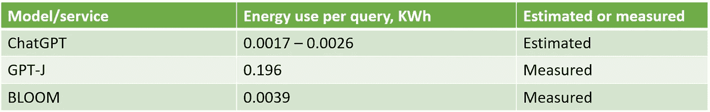

# ChatGPT 每次查询的能耗

> 原文：[`towardsdatascience.com/chatgpts-energy-use-per-query-9383b8654487`](https://towardsdatascience.com/chatgpts-energy-use-per-query-9383b8654487)

## ChatGPT 回答一个问题需要多少电力？

 [Kasper Groes Albin Ludvigsen](https://kaspergroesludvigsen.medium.com/?source=post_page-----9383b8654487--------------------------------)

·发布于 [Towards Data Science](https://towardsdatascience.com/?source=post_page-----9383b8654487--------------------------------) ·阅读时间 8 分钟·2023 年 8 月 6 日

--

摄影：Andrey Metelev，来自 Unsplash

本文展示了 ChatGPT 每次查询的电力消耗可能的范围，并与另外两个大型语言模型（LLMs）的测量能耗进行了比较。

这是一个有趣的课题，原因有二：

首先，如果组织知道 ChatGPT 回答一个问题需要多少电力，他们可以估算使用 ChatGPT 或类似服务（如 OpenAI 的 LLM API）的碳足迹。

对于超过 50,000 家欧洲企业来说，这可能很快变得非常相关，因为即将出台的《公司社会责任指令》（CSRD）可能迫使它们在管理报告中披露第 3 类排放 [1]。我预计像 ChatGPT 这样的服务的使用将被归入第 3 类，因为云计算被视为第 3 类 [2]。我希望这篇文章能为如何估算您组织的 ChatGPT 和类似服务的第 3 类排放提供一些启示。

另一个原因是，了解 ChatGPT 每次查询的能耗很有趣，因为这将使个人能够自行估算 ChatGPT 的总电力消耗或碳足迹。因此，我希望这篇博客文章能激励其他人发表类似的研究。

在本文的其余部分，“查询”和“请求”这两个术语将被交替使用。

 [## 通过我的推荐链接加入 Medium - Kasper Groes Albin Ludvigsen

### 作为 Medium 会员，您的一部分会费将用于支持您阅读的作者，同时您将获得对所有故事的完全访问权限……

kaspergroesludvigsen.medium.com](https://kaspergroesludvigsen.medium.com/membership?source=post_page-----9383b8654487--------------------------------)

# 估算 ChatGPT 每次查询的电力消耗的方法

在这一部分，我将介绍用于估算 ChatGPT 每次查询电力消耗的方法。估算依赖于两种不同的方法：

1.  一种是估算 ChatGPT 运行所需的硬件总能耗，并除以假定的每日查询量

1.  另一种方法是使用 GPT-4 进行一次前向传递所需的浮点运算（FLOPS）来计算能耗

## 使用方法#1 估算 ChatGPT 每次请求的电力消耗

以下是通过方法 1 估算 ChatGPT 电力消耗的公式。这一公式是机器学习模型能耗估算的标准方法（参见例如 [3] [4]）：

`每次查询的能耗 (KWh) = (硬件总量 * 平均硬件功耗 * TDP * 24 * PUE) / 每日总查询量`

对于方法 1，我将假设以下值：

*硬件总量：* 根据 SemiAnalysis 对服务 ChatGPT 用户所需计算量的估算，ChatGPT 使用了 3,617 台 Nvidia HGX 服务器，包含总共 28,936 个 Nvidia A100 GPU，这些估算基于 GPT-3.5 LLM 时的服务情况 [5]。

*平均硬件功耗：* 50%至 75%。

*TDP（热设计功耗）*：TDP 是硬件的最大理论功耗，但通常用作实际最大硬件功耗的替代值。我将假设 TDP 为 6.5 kW，因为 Nvidia DGX A100 服务器的 TDP 与 Nvidia HGX A100 服务器相似。

*功耗效率（PUE）：* 我将假设 ChatGPT 部署在微软的数据中心。微软的平均 PUE 为 1.18 [6]。

*每日查询量：* 硬件总量的估算假设 13 百万活跃用户，每人每天 15 次查询，即每日 195 百万查询 [5]。这似乎是一个合理的估算，我预计它会随着用户数量的增加而线性增长，因此如果每日查询量翻倍，硬件数量也会翻倍。在这些假设下，为了计算 ChatGPT 每次查询的能耗，ChatGPT 当前是否有更多或更少的每日查询并不重要，只要 195,000,000 次每日查询需要 3,617 台 Nvidia HGX A100 服务器的估算是合理的。

所以计算公式变成了：

`每次查询的能耗 (KWh) = (3617 * 6.5 * 平均硬件功耗 * 24 * 1.18) / 195,000,000`

其中，平均硬件功耗为 0.5 或 0.75。

 ## 普遍生成式人工智能的环境影响

### 如果数十亿人开始每天使用生成式人工智能技术，我们的环境会发生什么？

[towardsdatascience.com

## 使用方法 2 估算 ChatGPT 每次请求的电力消耗

方法 2 使用以下公式（改编自 Mike Ellis 的方法 [7]）：

`每次查询的能量消耗 (KWh) = (每次查询的 FLOPS * 每 FLOP 的焦耳数 * PUE) / 3600000`

我除以 3,600,000 来将焦耳转换为 KWh。

对于方法 2，我将假设以下值：

*每次查询的 FLOPS*: 560,000,000,000,000 (560 Teraflops) [8]。

*每 FLOP 的焦耳数*: 0.00000000001 [7]。

*PUE*: 1.18（与方法 1 相同）。

因此，计算公式变为：

`每次查询的能量消耗 (KWh) = (560000000000000 * 0.00000000001 * 1.18) / 3600000`

现在，让我们应用这些方法来估算 ChatGPT 每次查询的能量使用。

 ## GPT-4 的碳足迹

### 最近泄露的数据首次允许我们估算训练 OpenAI 的 GPT-4 所产生的碳排放。

[towardsdatascience.com

# ChatGPT 每次请求的电力消耗估算

在这一部分，我将展示 ChatGPT 处理一次请求所需的能量估算值，以及另外两种大型语言模型 BLOOM 和 GPT-J 的每次查询的实际能量消耗，如其他地方所报道 [9][10]。

在下表 1 中，我们可以看到方法 1 和方法 2 对 ChatGPT 每次查询的能量消耗估算值相似。使用方法 1，ChatGPT 每次查询的估算能量消耗为 0.0017 KWh（低估值范围，平均功耗为 TDP 的 50%）和 0.0026 KWh（高估值范围，平均功耗为 TDP 的 75%）。使用方法 2，ChatGPT 每次请求的估算能量使用为 0.0018 KWh。

表 1: ChatGPT 每次查询的估算能量使用

让我们看看 ChatGPT 每次查询的电力消耗估算值与其他大型语言模型的电力消耗比较。下表 2 显示了 GPT-J 和 BLOOM 每次查询的能量消耗。GPT-J 的每次查询电力消耗为 0.196 KWh，而 BLOOM 的每次查询电力消耗为 0.0039 KWh。请注意，BLOOM 每次查询的电力消耗与 ChatGPT 的估算电力消耗差别不大，而 GPT-J 的能量使用明显更高。

表 2: 将 ChatGPT 每次查询的估算电力消耗与 BLOOM 和 GPT-J 的每次查询实际电力消耗进行比较，如 [9][10] 中所述

 [## 如何估算和减少机器学习模型的碳足迹

### 两种方法轻松估算机器学习模型的碳足迹，并提供了 17 个减少碳足迹的想法

[如何估算和减少机器学习模型的碳足迹](https://towardsdatascience.com/how-to-estimate-and-reduce-the-carbon-footprint-of-machine-learning-models-49f24510880?source=post_page-----9383b8654487--------------------------------)

# 讨论

上述内容中，我们看到 ChatGPT 每次查询的电力消耗可能在 0.0017 到 0.0026 KWh 之间，具体取决于我们使用的假设。我们可以看到，两种方法估算的能量使用量相似，这对我来说表明估算是合理的。方法 2 的估算稍低于方法 1 的上限范围，可能是因为方法 2 仅考虑了 GPU 的能量消耗。然而，其他硬件（CPU、RAM、网络设备）也消耗能量。

如果我们相信 SemiAnalysis [5] 的估算是正确的，那么——从我的角度来看——ChatGPT 电力消耗估算中的主要不确定来源是每个硬件的电力使用量。在这篇文章中，我假设每个硬件使用其最大功耗的 50–75%，我个人认为这是合理的，但请质疑这一点。

还需注意，估算的数量是 ChatGPT 查询的*平均*电力消耗，因为我们使用了微软的*平均* PUE。然而，PUE 在不同的数据中心可能有所不同。如果你想估算使用 ChatGPT 或类似服务的*你的*电力消耗，应该使用你预期处理请求的数据中心的 PUE。MLCO2 Impact 计算器可以向你展示微软 Azure 地区的列表[11]。

这篇博客文章估计了 ChatGPT 每次请求的能量使用量小于名为 BLOOM 的 LLM 的测量能量消耗。BLOOM 与 GPT-3 类似——ChatGPT 最初基于的 LLM。ChatGPT 比 BLOOM 更节能是有道理的，因为 BLOOM 论文的作者没有采取任何措施来提高请求处理的能效。此外，考虑到这可能减少他们的成本，合理预期 OpenAI 会进行这种努力。

结果还显示，GPT-J 每次查询的电力消耗远高于其他模型，尽管 GPT-J 有 60 亿个参数，远小于 BLOOM（1760 亿）、GPT-3（1750 亿）和 GPT-4（传闻 1800 亿）。这可能的解释是，在报告的实验中，GPT-J 运行在可能不如 ChatGPT 运行的 Nvidia A100 能效高的 Nvidia RTX3090 GPU 上。此外，实验中没有采取任何措施来提高 GPT-J 的能效。

在 AI 堆栈交换[7]中，Mike Ellis 使用方法 2 计算了 ChatGPT 的能耗，得出每次查询 0.000083 KWh。他在计算中使用了 30 teraflops，而我在本文中使用了 560 teraflops。Mike Ellis 使用 30 teraflops 是因为 ChatGPT 自己说它使用 30 teraflops。但正如 Mike Ellis 自己也指出的那样，我们应该对 ChatGPT 的回答持谨慎态度，因为它被认为会产生幻觉并提供虚假信息[12]。使用 560 teraflops，如我在这里所做的，得出的能耗更接近 BLOOM 的测量能耗。再加上 560 teraflops 的数据来自 SemiAnalysis，因此我认为每查询 560 teraflops 更为现实。

最后，为了将 ChatGPT 每次请求的估计能耗放入一个大的背景中：如果你打开一个标准的 40W 灯泡 1 小时，它将消耗的能量与 15 到 24 次 ChatGPT 查询的能量相当，这也是我的估算。

# 结论

这篇文章估算了 ChatGPT 回答一个查询可能使用 0.0017 到 0.0026 KWh 的电量。这些数据可以帮助组织估算使用 ChatGPT 及类似服务的碳足迹。两种不同的方法得出了相近的结果。这些估算值低于 LLMs BLOOM 和 GPT-J 的测量能耗，前者为 0.0039，后者为 0.196 KWh 每个查询。根据这些 ChatGPT 每查询的能耗估算值，如果你打开一个标准的 40W 灯泡 1 小时，它将消耗的能量相当于 15 到 24 次 ChatGPT 查询的能量。

就这些了！希望你喜欢这个故事。告诉我你的想法吧！

通过注册 Medium 会员[HERE](https://kaspergroesludvigsen.medium.com/membership)，你可以享受 Medium 的福利并支持我的写作。

关注我，获取更多关于 AI 和可持续性的内容，并且[订阅](https://kaspergroesludvigsen.medium.com/subscribe)，当我发布新故事时通过电子邮件接收我的更新。

我有时也会写关于时间序列预测的内容。

也可以在[LinkedIn](https://www.linkedin.com/in/kaspergroesludvigsen)上与我联系。

# 参考文献

[1] [`normative.io/insight/csrd-explained`](https://normative.io/insight/csrd-explained/)/

[2] [`www.bloomberg.com/news/articles/2022-11-17/hidden-emissions-from-cloud-computing-pose-net-zero-threat`](https://www.bloomberg.com/news/articles/2022-11-17/hidden-emissions-from-cloud-computing-pose-net-zero-threat)

[3] [`arxiv.org/pdf/2307.09288.pdf`](https://arxiv.org/pdf/2307.09288.pdf)

[4] [`arxiv.org/ftp/arxiv/papers/2204/2204.05149.pdf`](https://arxiv.org/ftp/arxiv/papers/2204/2204.05149.pdf)

[5] [`www.semianalysis.com/p/the-inference-cost-of-search-disruption`](https://www.semianalysis.com/p/the-inference-cost-of-search-disruption)

[6] [`azure.microsoft.com/en-us/blog/how-microsoft-measures-datacenter-water-and-energy-use-to-improve-azure-cloud-sustainability/`](https://azure.microsoft.com/en-us/blog/how-microsoft-measures-datacenter-water-and-energy-use-to-improve-azure-cloud-sustainability/)

[7] [`ai.stackexchange.com/questions/38970/how-much-energy-consumption-is-involved-in-chat-gpt-responses-being-generated/39418?noredirect=1#comment58882_39418`](https://ai.stackexchange.com/questions/38970/how-much-energy-consumption-is-involved-in-chat-gpt-responses-being-generated/39418?noredirect=1#comment58882_39418)

[8] [`archive.md/2RQ8X`](https://archive.md/2RQ8X)

[9] [`arxiv.org/abs/2211.02001`](https://arxiv.org/abs/2211.02001)

[10] [`borsen.dk/nyheder/baeredygtig/de-har-regnet-paa-chat-gpts-klimaaftryk-nu-raader-de-folk-til-at-taenke-sig-rigtig-godt-om?b_source=topchef-i-sydbank-krigen-i-ukraine-minder-om-finanskrisen&b_medium=row_8&b_campaign=news_2`](https://borsen.dk/nyheder/baeredygtig/de-har-regnet-paa-chat-gpts-klimaaftryk-nu-raader-de-folk-til-at-taenke-sig-rigtig-godt-om?b_source=topchef-i-sydbank-krigen-i-ukraine-minder-om-finanskrisen&b_medium=row_8&b_campaign=news_2) 和 BLOOM [`arxiv.org/abs/2211.02001`](https://arxiv.org/abs/2211.02001)

[11] [`mlco2.github.io/impact/`](https://mlco2.github.io/impact/)

[12] [`fortune.com/2023/08/01/can-ai-chatgpt-hallucinations-be-fixed-experts-doubt-altman-openai/`](https://fortune.com/2023/08/01/can-ai-chatgpt-hallucinations-be-fixed-experts-doubt-altman-openai/)
