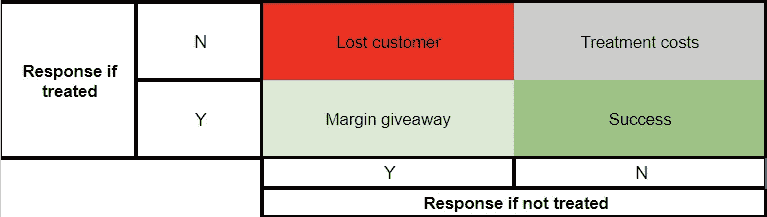

# 选择正确的路径：流失模型与提升模型

> 原文：[`towardsdatascience.com/choosing-the-right-path-churn-models-vs-uplift-models-b8489306aa80?source=collection_archive---------8-----------------------#2023-06-16`](https://towardsdatascience.com/choosing-the-right-path-churn-models-vs-uplift-models-b8489306aa80?source=collection_archive---------8-----------------------#2023-06-16)

## 我们真的需要流失模型吗？也许提升建模可以给我们更全面的答案？

 [Mark Eltsefon](https://markeltsefon.medium.com/?source=post_page-----b8489306aa80--------------------------------)

·

[查看](https://medium.com/m/signin?actionUrl=https%3A%2F%2Fmedium.com%2F_%2Fsubscribe%2Fuser%2F88f461f6049a&operation=register&redirect=https%3A%2F%2Ftowardsdatascience.com%2Fchoosing-the-right-path-churn-models-vs-uplift-models-b8489306aa80&user=Mark+Eltsefon&userId=88f461f6049a&source=post_page-88f461f6049a----b8489306aa80---------------------post_header-----------) 发表在 [Towards Data Science](https://towardsdatascience.com/?source=post_page-----b8489306aa80--------------------------------) ·5 分钟阅读·2023 年 6 月 16 日

--

图片由 [cmophoto.net](https://unsplash.com/@cmophoto?utm_source=medium&utm_medium=referral) 提供，来源于 [Unsplash](https://unsplash.com/?utm_source=medium&utm_medium=referral)

让我们设想一下，我们在电子商务领域工作，产品经理来到我们这里要求构建流失模型。

但实际上，他问我们的是？

那么，流失模型能给我们带来什么呢？

实际上，这一切都在于理解特定客户离开的可能性。我们的下一步是由**启发式**驱动的：

> 如果我们向可能流失的客户提供折扣，他们就会留下来。

然而，我们的目标略有不同。让我们假设我们只能做两件事：提供待遇或不提供待遇，在我们的案例中就是折扣。有 4 种可能的结果。

图片由作者提供

1.  **利润赠送。** 我们提供了折扣，用户使用了它并购买了一件商品，但即使没有折扣，用户也会做出购买决定。这是一个负面结果，因为利润已经被让步。

1.  **治疗费用。** 我们提供了折扣，但用户没有使用它，结果是……
