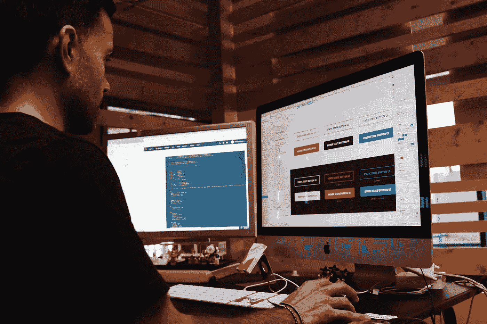

# 为你的下一个数据科学网络应用选择合适的工具

> 原文：[`towardsdatascience.com/choosing-the-right-tool-for-your-next-data-science-web-application-3d7ec8293d61?source=collection_archive---------20-----------------------#2023-01-31`](https://towardsdatascience.com/choosing-the-right-tool-for-your-next-data-science-web-application-3d7ec8293d61?source=collection_archive---------20-----------------------#2023-01-31)

## Flask、Django、Streamlit：数据科学家进入网络开发的三种选择。

 [Murtaza Ali](https://murtaza5152-ali.medium.com/?source=post_page-----3d7ec8293d61--------------------------------)

·

[关注](https://medium.com/m/signin?actionUrl=https%3A%2F%2Fmedium.com%2F_%2Fsubscribe%2Fuser%2F607fa603b7ce&operation=register&redirect=https%3A%2F%2Ftowardsdatascience.com%2Fchoosing-the-right-tool-for-your-next-data-science-web-application-3d7ec8293d61&user=Murtaza+Ali&userId=607fa603b7ce&source=post_page-607fa603b7ce----3d7ec8293d61---------------------post_header-----------) 发表在[Towards Data Science](https://towardsdatascience.com/?source=post_page-----3d7ec8293d61--------------------------------) ·6 分钟阅读·2023 年 1 月 31 日

--

图片由[Campaign Creators](https://unsplash.com/@campaign_creators?utm_source=medium&utm_medium=referral)提供，来源于[Unsplash](https://unsplash.com/?utm_source=medium&utm_medium=referral)

在现代计算能力的支持下，我们可以比以往更有效地利用数据。我们可以在家中舒适地设计和实现可能改变生活的技术，只需使用笔记本电脑和通过互联网获得的大量数据。

但有一个问题。一个令人印象深刻的机器学习模型或有见地的数据可视化工具，如果只是作为代码文件静静地待在你的计算机上，对任何人都没有太大用处。要真正产生影响，你需要能够以紧凑、可用的方式与其他人分享你的发明。

传统的方法是通过网络应用程序来实现这一点。通过将你的数据科学工具转换成一个应用程序，并将其托管在一个通过互联网对任何人都可访问的服务器上，你可以立即使你的工具对数百万人可用。

不幸的是，这并不像听起来那么简单。构建一个网络应用程序是一个相当复杂的编程任务，它涉及到一组超出许多数据科学家专长的技能。从零开始编码确实是一个挑战。
