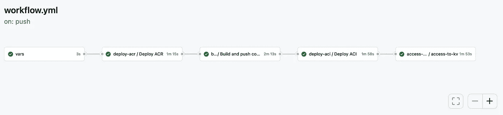

# 数据处理应用程序的 CI/CD 管道在 Azure 上 第一部分：容器实例

> 原文：[`towardsdatascience.com/ci-cd-pipelines-for-data-processing-applications-on-azure-part-1-container-instances-6c8ec9578280?source=collection_archive---------4-----------------------#2023-10-31`](https://towardsdatascience.com/ci-cd-pipelines-for-data-processing-applications-on-azure-part-1-container-instances-6c8ec9578280?source=collection_archive---------4-----------------------#2023-10-31)


图像由 AI Comic Factory 生成：[`huggingface.co/spaces/jbilcke-hf/ai-comic-factory`](https://huggingface.co/spaces/jbilcke-hf/ai-comic-factory)

## 使用 GitHub Actions 部署 Docker 容器的逐步指南

[](https://peerchristensen.medium.com/?source=post_page-----6c8ec9578280--------------------------------)[](https://towardsdatascience.com/?source=post_page-----6c8ec9578280--------------------------------) [Peer Christensen](https://peerchristensen.medium.com/?source=post_page-----6c8ec9578280--------------------------------)

·

[关注](https://medium.com/m/signin?actionUrl=https%3A%2F%2Fmedium.com%2F_%2Fsubscribe%2Fuser%2Fbcb4f0f95775&operation=register&redirect=https%3A%2F%2Ftowardsdatascience.com%2Fci-cd-pipelines-for-data-processing-applications-on-azure-part-1-container-instances-6c8ec9578280&user=Peer+Christensen&userId=bcb4f0f95775&source=post_page-bcb4f0f95775----6c8ec9578280---------------------post_header-----------) 发表在 [Towards Data Science](https://towardsdatascience.com/?source=post_page-----6c8ec9578280--------------------------------) ·7 分钟阅读·2023 年 10 月 31 日[](https://medium.com/m/signin?actionUrl=https%3A%2F%2Fmedium.com%2F_%2Fvote%2Ftowards-data-science%2F6c8ec9578280&operation=register&redirect=https%3A%2F%2Ftowardsdatascience.com%2Fci-cd-pipelines-for-data-processing-applications-on-azure-part-1-container-instances-6c8ec9578280&user=Peer+Christensen&userId=bcb4f0f95775&source=-----6c8ec9578280---------------------clap_footer-----------)

--

[](https://medium.com/m/signin?actionUrl=https%3A%2F%2Fmedium.com%2F_%2Fbookmark%2Fp%2F6c8ec9578280&operation=register&redirect=https%3A%2F%2Ftowardsdatascience.com%2Fci-cd-pipelines-for-data-processing-applications-on-azure-part-1-container-instances-6c8ec9578280&source=-----6c8ec9578280---------------------bookmark_footer-----------)

## 介绍

手动创建和部署 Azure 及其他云提供商的资源相对简单，在某些情况下可能足够。然而，更多时候，已部署的资源需要随着时间的推移而更改，这反过来需要大量额外的工作来维护和重新部署资源。为了自动化这些任务，开发人员和数据专业人员可以使用基础设施即代码（IaC）方法，并创建用于持续集成和部署（CI/CD）的管道。这种方法使开发人员能够编写代码，自动定义和重新部署资源。

在这份逐步指南中，我们将构建用于数据处理应用程序的管道，以执行以下任务：

+   配置一个容器注册表

+   构建并推送 Docker 镜像到注册表

+   创建一个运行数据处理工作负载的容器实例

+   启用“托管身份”访问 Azure Key Vault，这样我们的应用程序可以检索到其他资源的访问密钥，例如存储帐户

+   将上述资源部署到测试环境和生产环境中，并使用不同的触发器来运行管道

## 入门

为了演示，应用程序本身包括一个非常简单的 R 脚本，该脚本加载一个数据集，打印前几行，并将数据集返回到存储帐户。请记住，应用程序代码对其余的管道并不重要，可以轻松地用你自己的代码替代。

要开始使用，你需要一个 Azure 帐户。你也可能想要在本地系统上[安装 Azure CLI](https://learn.microsoft.com/en-us/cli/azure/install-azure-cli)。不过，你也可以选择通过 Azure 门户中的 Cloud Shell 运行 Azure CLI 命令。

由于我们的应用程序将数据传输到 Azure Blob 存储并返回，你可能会发现安装 Azure Storage Explorer 很有用，它可以稍微简化文件上传和验证应用程序是否正确运行及返回处理过的数据的过程。

## 步骤 1：克隆仓库并设置静态资源。

首先，你需要克隆[这个仓库](https://github.com/PeerChristensen/AzureDocker-CICD-Template)。README 文件详细说明了如何使用 RStudio 执行此操作，但你可以自由选择你喜欢的 IDE。

接下来，使用 Azure 门户创建以下资源：

+   一个资源组，将包含所有其他资源。

+   一个带有两个文件夹的存储帐户 Blob 容器：一个用于输入文件，另一个用于输出文件。在我们的案例中，这两个文件夹应分别命名为“input”和“output”。在输入容器中存储一个名为“input_data.csv”的小数据集。

+   一个密钥库，你需要将存储帐户的主要访问密钥作为机密存储在其中。

在第 3 步中，你需要密钥库的名称以及包含主要访问密钥的机密名称。

## 步骤 2：将 GitHub 链接到 Azure

为了更新 Azure 资源，我们需要授予 GitHub 权限。

首先，使用 Azure CLI 登录到你的 Azure 账户。

```py
az login
```

然后从 JSON 输出中复制 `id` 值，这是订阅 id。将订阅 id 粘贴到下面的命令中并运行。这会创建一个具有基于角色的访问控制的“服务主体”，可以视作在使用 GitHub Actions 工作流部署或更新资源时代表你的用户。

```py
az ad sp create-for-rbac \
      --name "your-app-name" \
      --role Owner \
      --scopes /subscriptions/<your-subscription-id>/resourceGroups/<your-resource-group-name> \
      --sdk-auth
```

复制整个 JSON 输出，前往你的 GitHub 仓库，点击“设置” > “秘密和变量” > “操作”。

创建一个新的仓库秘密并将其命名为 AZURE_CREDENTIALS。将上述命令的 JSON 输出粘贴进去并保存。

## 第 3 步：修改脚本

在这种情况下，我们正在部署一个简单的 R 脚本，它的功能不多。因此，Dockerfile 也保持非常简单。这两个文件显然需要根据你的要求和首选编程语言进行修改。然而，如果你对这方面不太熟悉，最好先使用现有代码将你的流水线启动运行，然后再应用自己的代码。

如果你选择继续使用当前的 R 脚本 (*script.R*)，你只需修改 `{keyvault-name}`、`{access-key-name}` 和 `{storage-account-name}` 的值（省略括号）。

接下来，修改 *.github/workflows/* 目录下两个工作流文件 *workflow.yml* 和 *workflow_release_prod.yml* 中 `env:` 下的以下值：

```py
env:
  RESOURCEGROUP_NAME: my-rg
  REGISTRY_NAME: my-cr
  SHORT_NAME: mycr
  ACI_NAME: my-ci-test
  KV_NAME: my-kv
  ENVIRONMENT: test
  CPU: 1
  MEMORY: 1.5
```

## 第 4 步：运行流水线和容器实例

当所有相关更改都已提交到“main”分支时，你应该可以在“操作”窗格下看到你的流水线运行。这是因为工作流设置了分支触发器，使其在主分支更新时运行。

如果没有遇到任何错误，你的容器实例应该在大约十分钟内准备好运行。前往 Azure 门户，找到你的新容器实例并点击“启动”。在日志窗格中，你可能会看到你的脚本在控制台中运行。完成后，验证是否在你的 blob 容器的“output”文件夹中出现了一个名为*output_data.csv*的新 cv 文件。

就这样！如果愿意，你现在可以手动触发第二个工作流，以创建一个用于生产工作负载的相同容器实例。

要了解 CI/CD 流水线中发生了什么，请阅读以下部分。

## 理解工作流逻辑

workflow.yml 文件定义了我们流水线中的五个步骤或作业，这些步骤将资源部署到测试环境。



作者提供的图片

首先，我们将之前设置的环境变量传递为 `outputs`，这些变量是后续步骤所需的。

```py
 vars:
    runs-on: ubuntu-latest
    outputs:
      resource_group: ${{ env.RESOURCEGROUP_NAME }}
      acr_name: ${{ env.REGISTRY_NAME }}
      short_name: ${{ env.SHORT_NAME }}
      aci_name: ${{ env.ACI_NAME }}
      kv_name: ${{ env.KV_NAME }}
      environment: ${{ env.ENVIRONMENT }}
      cpu: ${{ env.CPU }}
      memory: ${{ env.MEMORY }}
    steps:
      - run: echo "Exposing env vars"
```

在第二步中，我们创建或更新现有的容器注册表。请注意，`needs` 键指示此步骤必须等待前一步完成。`uses` 键告诉我们此步骤使用了另一个文件，而 `with` 键用于传递所需的值。我们还需要传递或设置存储库的密钥。

```py
 deploy-acr:
    needs: vars
    uses: ./.github/workflows/deploy_acr.yml
    if: github.ref == 'refs/heads/main'
    with:
      environment: ${{ needs.vars.outputs.environment }}
      resource_group: ${{ needs.vars.outputs.resource_group }}
      acr_name: ${{ needs.vars.outputs.acr_name }}
    secrets:
      azure_credentials: ${{ secrets.AZURE_CREDENTIALS }}
```

在用于此步骤的 *deploy_acr.yml* 文件顶部，我们看到脚本在工作流中每次调用时运行，以及我们在 *workflow.yml* 文件中提供的所需输入。

```py
on: 
  workflow_call:
    inputs:
      environment:
        required: true
        type: string
      resource_group:
        required: true
        type: string
      acr_name:
        required: true
        type: string

    secrets:
      azure_credentials:
        required: true
```

在 *deploy_acr.yml* 的底部，我们有一个多步骤过程运行三个预定义的操作。第一个操作检出代码库，然后我们使用我们创建并存储的服务主体凭据登录 Azure。最后，我们使用名为 *azure/arm-deploy@v1* 的操作来部署容器注册表。请注意，此步骤使用了 Bicep，这是一个用于配置和部署 Azure 资源的流行语言。在本文底部，你可以找到一些极好的资源来进一步了解 Bicep。

```py
jobs:
  deploy-acr:
    name: Deploy ACR
    runs-on: ubuntu-latest
    environment: ${{ inputs.environment }}
    steps:
      - uses: actions/checkout@v2
      - uses: azure/login@v1
        with:
          creds: ${{ secrets.azure_credentials }}
      - name: Deploy bicep
        uses: azure/arm-deploy@v1
        with:
          resourceGroupName: ${{ inputs.resource_group }}
          template: bicep/acr.bicep
          parameters:
            acrName=${{ inputs.acr_name }}
            acrSku=Basic
          failOnStdErr: false
```

然后，在第三步中使用名为 *build_push_container.yml* 的文件构建并推送 Docker 镜像到注册表，该文件运行 Azure CLI 命令以检索容器注册表的凭据，以及 Docker 命令以构建和推送 Docker 镜像。

在第四步中，容器实例根据我们的 Docker 镜像进行配置。此步骤通过名为 *deploy_aci.yml* 的文件进行，该文件使用了名为 ‘azure/aci-deploy@v1’ 的预定义操作。

在最后一步中使用 *kv_access.yml* 文件，我们授权容器实例通过“受管身份”访问密钥库，这意味着容器可以直接从密钥库中检索密钥，而无需使用访问密钥。为实现这一点，我们需要使用 Azure CLI 命令 `az container create` 更新已部署的容器实例，并提供我们之前使用的各种参数。此外，我们提供了以下设置：

`— assign-identity — scope ${{ steps.rg_id_step.outputs.rg_id }}`

最后，你可能已经注意到 *workflow.yml* 中的以下行：

```py
on: 
  push:
    branches: 
      - main
  workflow_dispatch:
```

这些行指示了我们的管道应在何时以及在什么条件下运行。在我们的场景中，我们希望当更改推送到‘main’分支时管道运行。此外，我们还希望能够手动运行它。这通过添加 `workflow_dispatch:` 实现。在 *workflow_prod_release.yml* 文件中定义的生产管道中，你会注意到生产发布只有一个手动触发。还有许多其他方法可以配置管道运行的触发方式。例如，你可以忽略特定文件或文件夹中的更改，以便只有对应用程序代码的更改会触发新的部署。

## 进一步阅读

如果你想了解更多关于 GitHub Actions 和 Bicep 的内容，我强烈推荐 MS Learn 平台上的以下资源：

**GitHub Actions**

[`learn.microsoft.com/zh-cn/training/modules/introduction-to-github-actions/`](https://learn.microsoft.com/zh-cn/training/modules/introduction-to-github-actions/)

[`learn.microsoft.com/zh-cn/training/modules/learn-continuous-integration-github-actions/`](https://learn.microsoft.com/zh-cn/training/modules/learn-continuous-integration-github-actions/)

[`learn.microsoft.com/zh-cn/training/modules/github-actions-automate-tasks/`](https://learn.microsoft.com/zh-cn/training/modules/github-actions-automate-tasks/)

[`learn.microsoft.com/zh-cn/training/modules/github-actions-ci/`](https://learn.microsoft.com/zh-cn/training/modules/github-actions-ci/)

[`learn.microsoft.com/zh-cn/training/modules/github-actions-cd/`](https://learn.microsoft.com/zh-cn/training/modules/github-actions-cd/)

**Bicep：**

[`learn.microsoft.com/zh-cn/training/paths/fundamentals-bicep/`](https://learn.microsoft.com/zh-cn/training/paths/fundamentals-bicep/)

[`learn.microsoft.com/zh-cn/training/paths/bicep-github-actions/`](https://learn.microsoft.com/zh-cn/training/paths/bicep-github-actions/)
