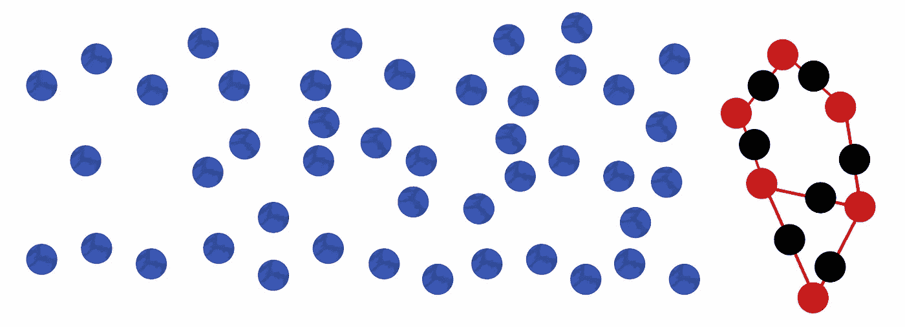
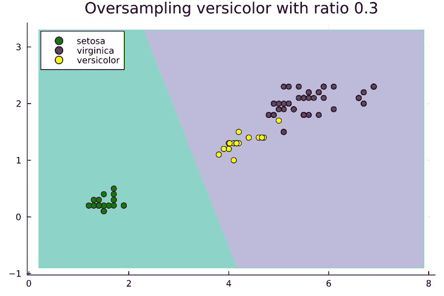
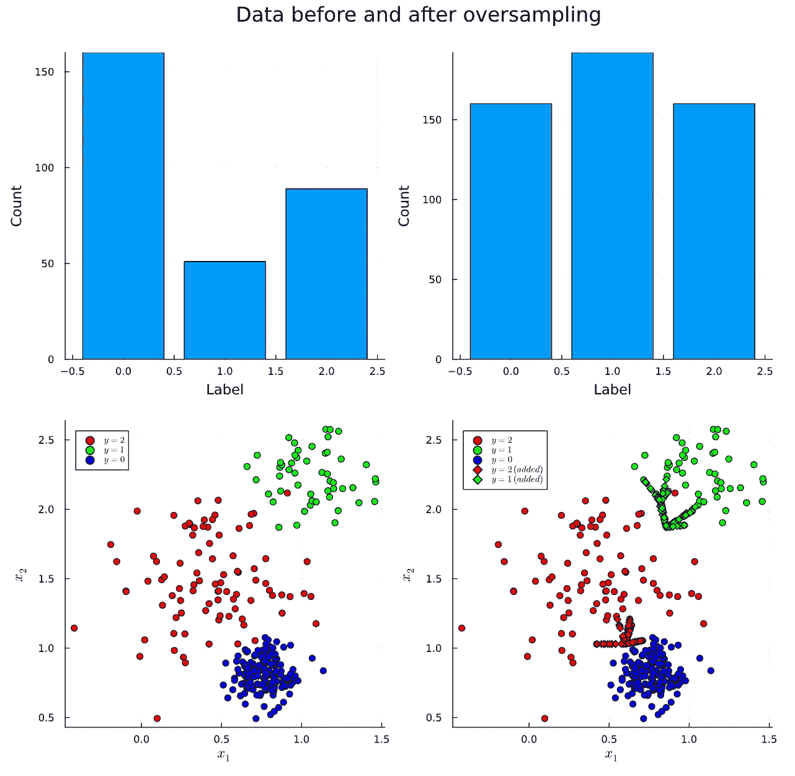
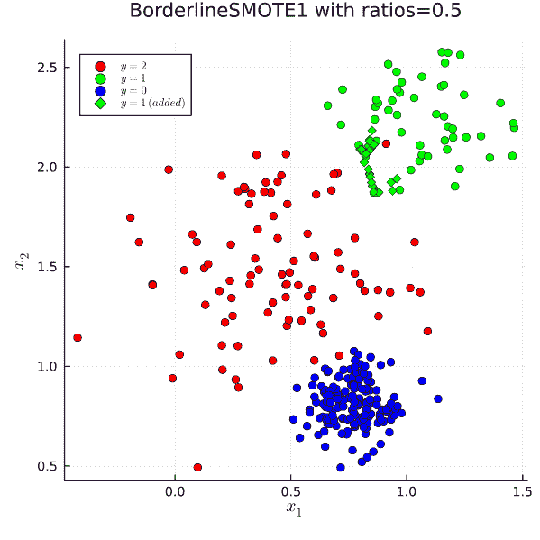

# 类别不平衡：从 SMOTE 到 BorderlineSMOTE1、SMOTE-NC 和 SMOTE-N

> 原文：[`towardsdatascience.com/class-imbalance-from-smote-to-smote-n-759d364d535b?source=collection_archive---------3-----------------------#2023-08-30`](https://towardsdatascience.com/class-imbalance-from-smote-to-smote-n-759d364d535b?source=collection_archive---------3-----------------------#2023-08-30)

## 探索四种算法以解决类别不平衡问题

 [Essam Wisam](https://essamwissam.medium.com/?source=post_page-----759d364d535b--------------------------------)

·

[关注](https://medium.com/m/signin?actionUrl=https%3A%2F%2Fmedium.com%2F_%2Fsubscribe%2Fuser%2Fccb82b9f3b87&operation=register&redirect=https%3A%2F%2Ftowardsdatascience.com%2Fclass-imbalance-from-smote-to-smote-n-759d364d535b&user=Essam+Wisam&userId=ccb82b9f3b87&source=post_page-ccb82b9f3b87----759d364d535b---------------------post_header-----------) 发表在 [Towards Data Science](https://towardsdatascience.com/?source=post_page-----759d364d535b--------------------------------) ·12 分钟阅读·2023 年 8 月 30 日

--

在[前一篇文章](https://medium.com/towards-data-science/class-imbalance-from-random-oversampling-to-rose-517e06d7a9b)中，我们解释了朴素随机过采样、随机过采样示例（ROSE）、随机游走过采样（RWO）算法的工作原理。更重要的是，我们还定义了类别不平衡问题，并直观地推导了其解决方案。我强烈推荐查看这篇[文章](https://medium.com/@essamwissam/class-imbalance-and-oversampling-a-formal-introduction-c77b918e586d)，以确保对类别不平衡有清晰的理解。

## 目录

∘ 简介

∘ SMOTE（合成少数类过采样技术）

∘ BorderlineSMOTE1

∘ SMOTE-NC（SMOTE-名义连续）

∘ SMOTE-N (SMOTE-名义)

## 介绍

在这个故事中，我们将继续考虑 SMOTE、BorderlineSMOTE1、SMOTE-NC 和 SMOTE-N 算法。但在此之前，值得指出的是我们在上一个故事中考虑的两个算法适合以下实现框架：

1.  定义算法如何对属于类 k 的数据进行 *N_k* 个样本的计算，并通过过采样生成这些样本

1.  给定一些比率超参数，计算每个类需要添加的点数

1.  对每个类运行算法，然后将所有新增点与原始数据结合起来，形成最终的过采样数据集

对于随机过采样和 ROSE 算法（如果比率足够大，可能也包括随机游走过采样），生成 *N_k* 个类 k 示例的算法也做了以下操作：

+   从属于类 k 的数据中随机选择 *N_k* 个点，允许重复。

+   对每个选择的点执行逻辑以生成新点（例如，复制或放置高斯分布然后从中采样）

我们将在本故事中考虑的其余算法也适合相同的框架。

## **SMOTE (合成少数类过采样技术)**

因此，要解释 SMOTE 的作用，我们只需回答一个问题：为了生成 *N_k* 个新的示例，对每个从类 k 随机选择的 *N_k* 个示例执行了什么逻辑？

答案如下：

+   找到该点的 k 最近邻（k 是算法的超参数）

+   随机选择其中一个

+   从点绘制到随机选择的邻居的线段

+   随机选择该线段上的一个点

+   将其作为新点返回

从数学上讲，

+   如果点 *x_i* 有最近邻 *z_i1, z_i2, …, z_ik*

+   如果 *j* 是 *[1,k]* 范围内的随机数

+   并且 *r* 是 *[0, 1]* 范围内的随机数

然后，对于每个点 *x_i*，SMOTE 通过简单应用生成一个新的点 *x_i’*：

这就是 SMOTE 算法所做的全部。从点 *x_i* 沿向量 *z_ij — x_i* 行进距离 *r*，然后放置一个新点。

图由作者绘制。黑色示例是合成生成的。

一个小的侧面说明是算法操作方式与论文中呈现的方式有少许差异。特别是，作者假设比率为整数（如果不是，则向下取整）。如果类别 k 的比率是整数 C，则对于每个点，在其内选择一个随机邻居，重复 C 次，然后应用我们描述的 SMOTE 逻辑。**实际上**，当实现 SMOTE 时，通常将其泛化为按我们描述的浮点比率工作，而是随机选择*N_k*个点，然后对每个点应用 SMOTE。对于整数比率如 C=2，平均每个点被选中两次，我们回到了原始算法。这应该是有道理的，因为这是从通过重复具有整数比率的过采样到随机过采样的相同转换，这在上个故事中已经解释过了。

作者制作的动画

此动画显示了在不平衡的鸢尾花数据集的偏好类别上改变过采样比例时，SVM 的决策区域如何变化。这里的比例相对于多数类的大小。也就是说，比率为 1.0 将*N_k*设置为使 versicolor 类具有与 virginica 类相同数量的示例。

你可能会想，为什么 SMOTE 比 ROSE 更好。毕竟，SMOTE 生成点的逻辑在论文中并未得到证明；与此同时，从*P(x|y)*的估计中进行采样，就像 ROSE 中那样，更为合理和直观。可能的一个问题是获取*P(x|y)*的良好估计需要大量数据；然而，我们知道少数类通常数据较少。如果我们没有大量数据，我们有两个选择：

1.  选择带宽过小，我们回到了可能的过拟合，就像在随机过采样中一样。

1.  选择带宽过大，在极端情况下等同于从特征空间中均匀添加随机点（即，不现实的示例）。

如果你仔细想想，我们应该更少地担心 SMOTE 中的这个问题。如果存在一个完全线性分离数据的超平面，那么应用 SMOTE 后这个解决方案仍然存在。事实上，SMOTE 生成点的方式可能使非线性超表面变得更加线性化，因此在导致模型过拟合的风险要低得多。

## **BorderlineSMOTE1**

文献中有很多算法只是对 SMOTE 的修改或改进。一个流行的例子是 BorderlineSMOTE1，它应用以下修改：

在选择 *x_i* 时，不是随机从属于该类的所有点集中选择，而是随机从属于该类的边界（论文中称为 DANGER）点集中选择。 如果其 k 个最近邻的大多数，但不是全部，来自大多数/其他类，则该点是边界点。 逻辑上讲，靠近决策边界的点满足此条件，这些点也是决定决策边界或分类模型性能最重要的点。 忽略所有邻居都来自另一个类的点背后的理由是，这些可能是噪音。

另一个变种 BorderlineSMOTE2 在同一篇论文中描述，并且只是修改了用于查找边界点的条件。

以下是在 Julia 中使用 Imbalance.jl 包应用 BorderlineSMOTE1 的示例

作者绘制的图表

这是相应的动画：

## **SMOTE-NC (SMOTE-Nominal Continuous)**

虽然 ROSE 和 SMOTE 似乎比朴素的随机过采样有显著改进，但它们的缺点是失去了处理分类变量的能力，这对于朴素的随机过采样来说并不是问题。 SMOTE 的作者们足够聪明，想出了一种方法来规避这个问题，通过开发这个 SMOTE 算法的扩展来处理同时存在分类特征的情况。

你可能认为编码分类特征可以绕过这个问题，然而这并不完全正确，因为 SMOTE 或 ROSE 会将它们视为连续的并为其生成无效值。 例如，如果一个特征是二进制的，那么沿线选择的点可能是 0.57，这不是 0 和 1\. 将其四舍五入是一个坏主意，因为这等同于随机选择它是 0 还是 1。

回想一下，以下是 SMOTE 生成新点的方式：

+   假设点 *x_i* 有最近的邻居 *z_i1, z_i2, …, z_ik*

+   让 *j* 是 *[1, k]* 中的随机数

+   让 *r* 是 *[0, 1]* 中的随机数

对于每个点 *x_i*，SMOTE 通过简单地应用公式生成一个新点 *x_i’*

显然，我们无法在存在分类特征的情况下应用相同的方法，除非我们通过回答以下两个问题来扩展它

1.  如何找到 k 个最近邻？ 欧几里得距离度量只在连续特征上运行

1.  新点是如何生成的？我们不能应用 SMOTE 方程来生成 *x_i’* 的分类部分

对于第一个问题，作者建议对欧几里得距离进行修改，以考虑分类部分。假设每个*x_i*和*z_ij*涉及*m*个连续特征和*n*个分类特征，那么在修改后的度量中，连续特征自然被相减并平方，然后对于每对不同的分类特征添加一个常数惩罚。这个惩罚特别是所有连续特征方差的中位数，可以在算法开始时计算出来。

例如，要测量两个点*x_1*和*x_2*之间的距离

如果标准差的中位数是*m*，则距离由下式给出

最后的两个项考虑了最后两个分类特征的不同。

虽然作者没有对度量提供理由，但观察到在分类特征之间测量距离的最常见方法之一是汉明距离。它简单地对每对不同的分类特征加 1。汉明距离为 6 表示两个点在 6 个分类特征上有不同的值。在我们的案例中，将惩罚设置为 1（如同汉明距离中）并不直观，因为如果连续特征经常发生强烈变化，那么 1 的值在总和中将非常微不足道，这等同于忽略分类特征的测量。使用任何两个连续特征之间的平均平方差作为惩罚应该能够解决这个问题，因为如果连续特征的方差通常很大，惩罚也会很大且不可忽略。唯一的问题是作者使用了方差的中位数而不是均值，这可能是由于其对异常值的鲁棒性。

回答第二个问题要简单得多，现在我们已经使用修改后的度量找到 k 个最近邻，我们可以像往常一样使用 SMOTE 公式生成新点的连续部分。为了生成新点的分类部分，简单地取 k 个最近邻分类部分的众数是有意义的。即，让邻居对分类部分的值进行投票，其中最常见的值将占主导地位。

因此，SMOTE-NC 生成新点的过程是……

+   使用修改后的欧几里得度量找到点的 k 个最近邻（k 是算法的一个超参数）

+   随机选择其中一个

+   从该点到邻居在连续特征空间中画一条线段

+   随机选择线段上的一个点

+   让这条线段成为新点的连续部分

+   对于新点的分类部分，取 k 个最近邻分类部分的众数。

## **SMOTE-N (SMOTE-Nominal)**

应该很明显，当没有分类特征参与时，SMOTE-NC 会变成 SMOTE，因为那时惩罚为零，生成中的模式步骤被跳过。然而，如果没有连续特征参与，则算法处于一种不稳定的状态，因为没有定义惩罚，因为没有连续特征。你的解决办法可能是将其设置为 1 或其他值，然后按正常方式操作算法，但这并不理想，因为在计算最近邻居时会容易出现许多平局。*如果一个点与另 10 个点之间的汉明距离是 7，它们真的都同样接近那个点吗？* 还是它们只是共享在 7 个特征上与该点不同的共同点？

SMOTE-N 是作者在论文中提出的另一种算法，用于处理纯粹分类的数据。它通过在分类特征上采用另一种距离度量来对上述*斜体*问题作出负面回应。一旦找到 k 个最近邻居，模式计算决定了新点；然而，这次点本身也参与模式计算（投票）。

因此，足以解释在 SMOTE-N 中用于执行 K-NN 的距离度量。该度量称为“修改值距离度量”（Cost & Salzberg, 1993），其操作如下：给定具有 q 个分类特征和每个分类特征分别有 p_1, p_2, …, p_q 个可能值的两个特征向量。

1.  通过长度为 K 的向量 V 对每个分类值进行编码，其中 K 是类别的数量。V[i]应为该值在第 i 类中的频率除以其在所有类别中的频率。

1.  现在任何分类向量都由 q 个长度为 k 的向量组成的张量表示。

1.  通过计算每对长度为 k 的向量之间的曼哈顿距离，然后取结果的 L2 范数，来计算该张量所表示的任意两个分类向量之间的距离。

例如，假设我们要找出以下两个分类向量之间的距离

然后给定 3 个类别，编码后假设我们得到了

计算每对向量之间的曼哈顿距离后，我们得到

这在取 L2 范数后评估为 1.428。

精确地说，论文指出可以使用 L1 范数或 L2 范数来表示大小，但没有决定算法使用哪种（这里我们选择了 L2）。

你可能会问为什么这比使用普通的汉明距离更好。明确的答案是作者并没有做出合理解释。然而，仅为了引入一些直观的理解，我们之前争论了汉明距离在 KNN 的距离计算中可能经常导致许多平局。假设我们有三个分类向量

在这里，汉明距离会建议 *x_2* 和 *x_3* 距离 *x_1* 相同，因为两者的汉明距离都是 1。同时，修改值差异度量会先考虑每个值在各个类别中的分布，然后再决定哪个更接近。假设 B2 的类别频率为 [0.3, 0.2, 0.5]，B3 为 [0.1, 0.9, 0]，B1 为 [0.25, 0.25, 0.5]。在这种情况下，MVDM 会建议 *x_3* 更接近 *x_1*，因为 B1 比 B3 更接近 B2。从概率的角度来看，如果我们收集一个类别未知的新点，那么知道该类别是 B2 还是 B3 对于预测类别帮助不大，因此它们在这个意义上是相似的或可以互换的。

因此，总结来说，SMOTE-N 算法生成新点的过程如下：

+   使用修改值差异度量找到点的 k 近邻（k 是算法的超参数）

+   返回邻居的类别值的众数（包括点自身）以生成新点

就这样！现在你应该清楚了 SMOTE、BorderlineSMOTE1、SMOTE-N 和 SMOTE-NC 各自的工作原理。我们结束了对所有在 Julia 包 [Imbalance.jl](https://github.com/JuliaAI/Imbalance.jl) 中最初实现的重采样算法的解释系列，并附上了 [这篇文章](https://medium.com/towards-data-science/class-imbalance-exploring-undersampling-techniques-24009f55b255) 关于欠采样的故事。

**参考文献：**

[1] N. V. Chawla, K. W. Bowyer, L. O. Hall, W. P. Kegelmeyer，“SMOTE：合成少数类过采样技术，”人工智能研究杂志，321–357，2002 年。

[2] H. Han, W.-Y. Wang, 和 B.-H. Mao，“Borderline-SMOTE：一种新的不平衡数据集学习过采样方法，”国际智能计算会议，2005 年，页码 [878–8871](https://sci2s.ugr.es/keel/keel-dataset/pdfs/2005-Han-LNCS.pdf)
