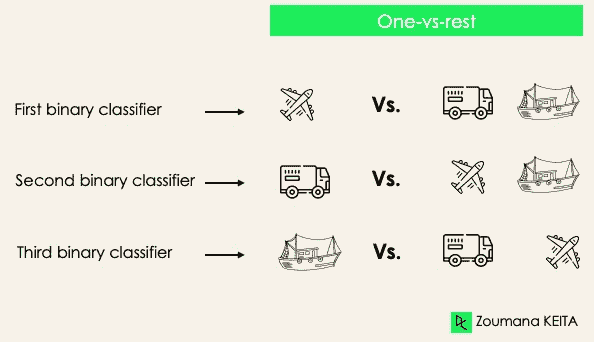
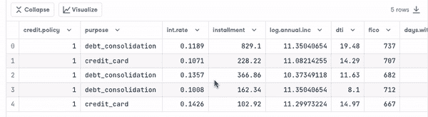
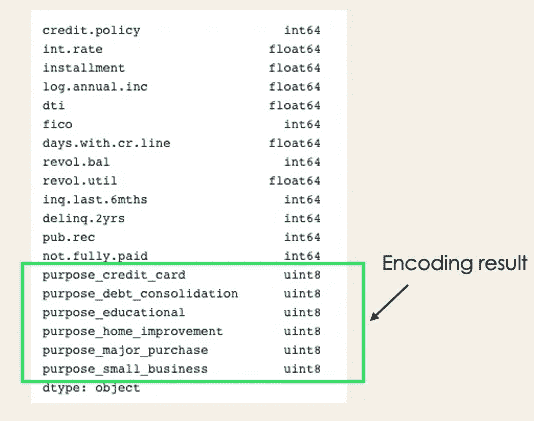

# 机器学习中的分类：入门

> 原文：[`towardsdatascience.com/classification-in-machine-learning-an-introduction-d52595e3dcab`](https://towardsdatascience.com/classification-in-machine-learning-an-introduction-d52595e3dcab)

## 了解机器学习中的分类，看看它是什么，如何使用，以及一些分类算法的示例

[](https://zoumanakeita.medium.com/?source=post_page-----d52595e3dcab--------------------------------)[](https://towardsdatascience.com/?source=post_page-----d52595e3dcab--------------------------------) [Zoumana Keita](https://zoumanakeita.medium.com/?source=post_page-----d52595e3dcab--------------------------------)

·发布在 [Towards Data Science](https://towardsdatascience.com/?source=post_page-----d52595e3dcab--------------------------------) ·11 分钟阅读·2023 年 2 月 24 日

--


照片由[Markus Winkler](https://unsplash.com/@markuswinkler)拍摄，发布在[Unsplash](https://unsplash.com/photos/f57lx37DCM4)

# 介绍

现在，许多行业处理着各种类型的大型数据集。手动处理所有这些信息可能会耗时，并且从长远来看可能没有增加价值。许多策略，从简单的自动化到机器学习技术，正在被应用以获得更好的投资回报。本概念博客将涵盖一个重要的概念：机器学习中的分类。

我们将首先定义机器学习中的分类是什么，然后阐明机器学习中的两种学习者类型，以及分类与回归之间的区别。接着，我们将介绍一些可以应用分类的实际场景。之后，我们将介绍所有不同类型的分类，并深入探讨一些分类算法的示例。最后，我们将提供几个算法实现的实践机会。

# 机器学习中的分类是什么？

分类是一种监督学习方法，其中模型尝试预测给定输入数据的正确标签。在分类中，模型使用训练数据进行全面训练，然后在测试数据上进行评估，之后才能用于对新的未见数据进行预测。

例如，一个算法可以学习预测给定的电子邮件是垃圾邮件还是正常邮件（非垃圾邮件），如下所示。


作者提供的图片

在深入了解分类概念之前，我们首先了解分类中两种类型的学习者的区别：惰性学习者和渴求学习者。然后，我们将澄清分类和回归之间的误解。

## 惰性学习者与渴求学习者

机器学习分类有两种类型的学习者：惰性学习者和渴求学习者。

**渴求学习者**是那些首先从训练数据集中构建模型，然后才对未来的数据集进行预测的机器学习算法。他们在训练过程中花费更多时间，因为他们渴望通过学习权重获得更好的泛化能力，但在进行预测时所需时间较少。

大多数机器学习算法是渴求学习者，以下是一些例子：

+   逻辑回归。

+   支持向量机。

+   决策树。

+   人工神经网络。

**惰性学习者或基于实例的学习者**，则不会立即从训练数据中创建模型，这就是惰性特性的来源。他们只是记住训练数据，每次需要进行预测时，他们会从整个训练数据中搜索最近的邻居，这使得他们在预测时非常缓慢。这类学习者的一些例子包括：

+   K 最近邻。

+   基于案例的推理。

然而，一些算法，如 [**BallTrees**](https://en.wikipedia.org/wiki/Ball_tree) 和 [**KDTrees**](https://en.wikipedia.org/wiki/K-d_tree)，可以用来提高预测的延迟。

## 机器学习分类与回归

机器学习算法主要分为四大类：监督学习、无监督学习、半监督学习和强化学习。

尽管分类和回归都属于监督学习的范畴，但它们并不相同。

+   当目标变量是离散的时，预测任务是***分类***。一个应用是识别一段文本的潜在情感。

+   当目标变量是连续的时，预测任务是***回归***。一个例子可以是根据一个人的学历、以往工作经验、地理位置和职位级别预测其薪资。


图片由作者提供

# 机器学习分类在现实生活中的例子

监督机器学习分类在我们日常生活的多个领域中具有不同的应用。以下是一些例子。

## 医疗保健

在历史患者数据上训练机器学习模型可以帮助医疗专家准确分析他们的诊断：

+   在 COVID-19 疫情期间，机器学习模型被实施以有效预测一个人是否感染了 COVID-19。

+   研究人员可以利用机器学习模型预测未来更有可能出现的新疾病。

## 教育

教育是处理最多文本、视频和音频数据的领域之一。这些非结构化信息可以借助自然语言技术进行分析，以执行不同的任务，例如：

+   按类别对文档进行分类。

+   在学生申请过程中自动识别其文档的底层语言。

+   分析学生对教授的反馈情感。

## 交通

交通是许多国家经济发展的关键组成部分。因此，工业正在使用机器学习和深度学习模型：

+   预测哪个地理位置的交通量会增加。

+   预测由于天气条件可能在特定地点发生的潜在问题。

## 可持续农业

农业是人类生存的重要支柱之一。引入可持续性可以在不破坏环境的情况下提高农民的生产力：

+   通过使用分类模型预测哪种类型的土地适合某种类型的种子。

+   预测天气以帮助他们采取适当的预防措施。

# 机器学习中的不同类型的分类任务

机器学习中有四种主要的分类任务：二分类、多类别分类、多标签分类和不平衡分类。

## 二分类

在二分类任务中，目标是将输入数据分类为两个互斥的类别。在这种情况下，训练数据以二进制格式标记：真和假；正和负；O 和 1；垃圾邮件和非垃圾邮件等，具体取决于所处理的问题。例如，我们可能想要检测给定的图像是卡车还是船。


作者提供的图片

逻辑回归和支持向量机算法本质上是为二分类设计的。然而，其他算法如 K-Nearest Neighbors 和决策树也可以用于二分类。

## 多类别分类

多类别分类另一方面具有至少两个互斥的类别标签，其目标是预测给定输入示例属于哪个类别。在以下情况下，模型正确地将图像分类为飞机。


作者提供的图片

大多数二分类算法也可以用于多类别分类。这些算法包括但不限于：

+   随机森林

+   朴素贝叶斯

+   K-Nearest Neighbors

+   梯度提升

+   SVM

+   逻辑回归。

> 但是等等！你不是说 SVM 和逻辑回归默认不支持多类别分类吗？
> 
> → 没错。然而，我们可以应用如一对一和一对多的二分类转换方法来使本质上的二分类算法适应多类别分类任务。

**一对一**：这种策略训练的分类器数量等于标签对的数量。如果我们有 3 类分类，将有三对标签，从而得到三个分类器，如下图所示。


图片由作者提供

通常，对于 N 个标签，我们将有 Nx(N-1)/2 个分类器。每个分类器在一个二分类数据集上进行训练，最终类别由所有分类器的多数投票决定。一对一方法在 SVM 和其他基于内核的算法中效果最佳。

**一对其余**：在这个阶段，我们首先将每个标签视为一个独立的标签，并将其余的标签组合成一个标签。对于 3 类，我们将有三个分类器。

通常，对于 N 个标签，我们将有**N**个二分类器。



图片由作者提供

## 多标签分类

在多标签分类任务中，我们尝试为每个输入样本预测 0 个或多个类别。在这种情况下，没有互斥关系，因为输入样本可以有多个标签。

这种情况可以在不同领域中观察到，例如自然语言处理中的自动标记，其中给定文本可以包含多个主题。类似地，在计算机视觉中，一张图像可以包含多个对象，如下图所示：模型预测该图像包含：飞机、船只、卡车和狗。


图片由作者提供

无法使用多类或二分类模型来执行多标签分类。然而，大多数用于这些标准分类任务的算法都有其专门用于多标签分类的版本。我们可以举例：

+   多标签决策树

+   多标签梯度提升

+   多标签随机森林

## 不平衡分类

对于不平衡分类，每个类别中的样本数量分布不均，这意味着在训练数据中，某一个类别的样本可能比其他类别的样本更多。我们可以考虑以下的 3 类分类场景，其中训练数据包含：60%的卡车，25%的飞机和 15%的船只。


图片由作者提供

不平衡分类问题可能出现在以下场景中：

+   金融行业中的欺诈交易检测

+   稀有疾病诊断

+   客户流失分析

使用传统的预测模型，如决策树、逻辑回归等，在处理不平衡数据集时可能效果不佳，因为这些模型可能会偏向于预测样本数量最多的类别，并将样本较少的类别视为噪声。

> 那么，这是否意味着这些问题就此被抛在了脑后？

当然不是！我们可以使用多种方法来解决数据集中的不平衡问题。最常用的方法包括采样技术或利用成本敏感算法的优势。

**采样技术**

这些技术旨在通过以下方式平衡原始数据的分布：

+   基于聚类的过采样：

+   随机欠采样：从多数类中随机删除样本。

+   SMOTE 过采样：从少数类中随机复制样本。

**成本敏感算法**

这些算法考虑了误分类的成本。它们旨在最小化模型产生的总成本。

+   成本敏感决策树。

+   成本敏感逻辑回归。

+   成本敏感支持向量机。

# 深入探讨分类算法

现在我们掌握了实施一些算法所需的所有工具。本节将介绍四种算法及其在[**贷款数据集**](https://www.kaggle.com/datasets/itssuru/loan-data)（Kaggle 上免费提供）上的实现，以展示之前涉及的一些概念，特别是针对不平衡数据集的二分类任务。为了简单起见，我们将只关注四种算法。

## 数据集中贷款的分布

+   查看数据集中的前五个观测值。

```py
import pandas as pd
loan_data = pd.read_csv("loan_data.csv")
loan_data.head()
```



+   数据集中的借款人概况。

```py
import matplotlib.pyplot as plt
# Helper function for data distribution
# Visualize the proportion of borrowers
def show_loan_distrib(data):
  count = ""
  if isinstance(data, pd.DataFrame):
      count = data["not.fully.paid"].value_counts()
  else:
      count = data.value_counts()

  count.plot(kind = 'pie', explode = [0, 0.1], 

              figsize = (6, 6), autopct = '%1.1f%%', shadow = True)
  plt.ylabel("Loan: Fully Paid Vs. Not Fully Paid")
  plt.legend(["Fully Paid", "Not Fully Paid"])
  plt.show()

# Visualize the proportion of borrowers
show_loan_distrib(loan_data)
```


作者提供的图像

从上面的图形中，我们注意到 84%的借款人偿还了他们的贷款，而只有 16%没有偿还，这使得数据集非常不平衡。

## 变量类型

在进一步操作之前，我们需要检查变量的类型，以便对需要编码的变量进行编码。

我们注意到，除了需要编码的**目的**属性之外，所有列都是连续变量。


作者提供的图像

```py
# Check column types
print(loan_data.dtypes)
```



作者提供的图像

```py
encoded_loan_data = pd.get_dummies(loan_data, prefix="purpose",   

                                   drop_first=True)
print(encoded_loan_data.dtypes)
```

## 将数据分为训练集和测试集

```py
X = encoded_loan_data.drop('not.fully.paid', axis = 1)
y = encoded_loan_data['not.fully.paid']

X_train, X_test, y_train, y_test = train_test_split(X, y, test_size=0.30, 

                                           stratify = y, random_state=2022)
```

## 采样策略的应用

我们将在这里探讨两种采样策略：随机欠采样和 SMOTE 过采样。

**随机欠采样**

我们将对多数类进行欠采样，该类对应于“完全还款”（类 0）。

```py
X_train_cp = X_train.copy()
X_train_cp['not.fully.paid'] = y_train
y_0 = X_train_cp[X_train_cp['not.fully.paid'] == 0]
y_1 = X_train_cp[X_train_cp['not.fully.paid'] == 1]
y_0_undersample = y_0.sample(y_1.shape[0])
loan_data_undersample = pd.concat([y_0_undersample, y_1], axis = 0)

# Visualize the proportion of borrowers
show_loan_distrib(loan_data_undersample)
```


作者提供的图像

**SMOTE 过采样**

对少数类进行过采样

```py
smote = SMOTE(sampling_strategy='minority')
X_train_SMOTE, y_train_SMOTE = smote.fit_resample(X_train,y_train)

# Visualize the proportion of borrowers
show_loan_distrib(y_train_SMOTE)
```


作者提供的图像

应用采样策略后，我们观察到数据集在不同类型的借款人之间分布均匀。

## 一些机器学习分类算法的应用

本节将把这两种分类算法应用于 SMOTE 过采样数据集。相同的训练方法也可以应用于欠采样数据。

**逻辑回归**

这是一个可解释的算法。它通过使用 sigmoid 函数对数据点属于给定类别的概率进行建模来进行分类。

```py
X = loan_data_undersample.drop('not.fully.paid', axis = 1)
y = loan_data_undersample['not.fully.paid']
X_train, X_test, y_train, y_test = train_test_split(X, y, test_size=0.15, stratify = y, random_state=2022)
logistic_classifier = LogisticRegression()
logistic_classifier.fit(X_train, y_train)
y_pred = logistic_classifier.predict(X_test)
print(confusion_matrix(y_test,y_pred))
print(classification_report(y_test,y_pred))
```


作者提供的图像

**支持向量机**

该算法既可用于分类，也可用于回归。它通过使用边际最大化原理来绘制超平面（决策边界）。这个决策边界通过两个最接近的支持向量绘制。

SVM 提供了一种名为核技巧的转换策略，用于将不可分的数据投影到更高维度的空间，使其变得线性可分。

```py
from sklearn.svm import SVC
svc_classifier = SVC(kernel='linear')
svc_classifier.fit(X_train, y_train)

# Make Prediction & print the result
y_pred = svc_classifier.predict(X_test)

print(classification_report(y_test,y_pred))
```


作者提供的图片

这些结果当然可以通过更多的特征工程和微调来改进。但它们已经比使用原始不平衡数据要好。

该算法是一个广为人知的梯度提升树算法的扩展。它不仅是应对过拟合的绝佳选择，而且在速度和性能方面也表现出色。

# 结论

这篇文章涵盖了机器学习中分类的主要方面，并提供了它们应用于不同领域的一些示例。最后，它介绍了逻辑回归和支持向量机的实现，经过欠采样和 SMOTE 过采样策略来生成平衡的数据集以训练模型。

你可以从我的 [GitHub 上获取笔记本](https://github.com/keitazoumana/Medium-Articles-Notebooks/blob/main/Introduction_to_classification.ipynb)。

如果你喜欢阅读我的故事并希望支持我的写作，考虑 [成为 Medium 会员](https://zoumanakeita.medium.com/membership)。每月 5 美元的承诺，你将解锁对 Medium 上故事的无限访问。

你想请我喝杯咖啡 ☕️ 吗？→ [这里请](http://www.buymeacoffee.com/zoumanakeig)!

欢迎在 [Medium](https://zoumanakeita.medium.com/)、[Twitter](https://twitter.com/zoumana_keita_) 和 [YouTube](https://www.youtube.com/channel/UC9xKdy8cz6ZuJU5FTNtM_pQ) 上关注我，或者在 [LinkedIn](https://www.linkedin.com/in/zoumana-keita/) 上打个招呼。讨论 AI、ML、数据科学、NLP 和 MLOps 的话题总是很愉快的！

离开之前，请查看以下一些可能对你有帮助的文章：

[Pandas 和 Python 在数据科学与数据分析中的技巧 — 第一部分](https://medium.com/towards-data-science/pandas-and-python-tips-and-tricks-for-data-science-and-data-analysis-1b1e05b7d93a)

[Pandas 和 Python 在数据科学与数据分析中的技巧 — 第二部分](https://medium.com/towards-data-science/pandas-python-tricks-for-data-science-data-analysis-part-2-dc36460de90d)

Pandas 和 Python 在数据科学与数据分析中的技巧 — 第三部分

所有数据科学家和分析师应了解的统计学基础 — 带代码 — 第一部分
