# 分类指标：为有志数据科学家准备的完整指南

> 原文：[`towardsdatascience.com/classification-metrics-the-complete-guide-for-aspiring-data-scientists-9f02eab796ae`](https://towardsdatascience.com/classification-metrics-the-complete-guide-for-aspiring-data-scientists-9f02eab796ae)

## 你唯一需要的指南来掌握机器学习中的分类指标

[](https://federicotrotta.medium.com/?source=post_page-----9f02eab796ae--------------------------------)[](https://towardsdatascience.com/?source=post_page-----9f02eab796ae--------------------------------) [Federico Trotta](https://federicotrotta.medium.com/?source=post_page-----9f02eab796ae--------------------------------)

·发表于 [Towards Data Science](https://towardsdatascience.com/?source=post_page-----9f02eab796ae--------------------------------) ·阅读时间 26 分钟·2023 年 5 月 15 日

--


图片来自 [UliSchu](https://pixabay.com/it/users/ulischu-1993560/?utm_source=link-attribution&utm_medium=referral&utm_campaign=image&utm_content=1205171) 在 [Pixabay](https://pixabay.com/it//?utm_source=link-attribution&utm_medium=referral&utm_campaign=image&utm_content=1205171)

监督学习可以分为两类问题：分类和回归。本文旨在成为分类指标的终极指南：所以如果你是一个有志的数据科学家或初级数据科学家，你绝对需要阅读这篇文章。

首先，你也许还想阅读我关于掌握回归问题所需的 5 个指标的指南：

[](/mastering-the-art-of-regression-analysis-5-key-metrics-every-data-scientist-should-know-1e2a8a2936f5?source=post_page-----9f02eab796ae--------------------------------) ## 精通回归分析艺术：每个数据科学家应该了解的 5 个关键指标

### 你应该掌握的回归分析中使用的所有指标的终极指南

towardsdatascience.com

其次，让我通过目录告诉你你会在这里找到什么：

```py
**Table of Contents:**

What is a classification problem?
Dealing with class imbalance
What a classification algorithm actually does
Accuracy
Precision and recall
F1-score
The confusion matrix
Sensitivity and specificity
Log loss (cross-entropy)
Categorical crossentropy
AUC/ROC curve
Precision-recall curve
BONUS: KDE and learning curves
```

像往常一样，你会找到 Python 示例来将理论付诸实践。

# 什么是分类问题？

在分类问题中，数据被标记为不同的类别：换句话说，我们的标签值代表数据点所属的类别。

分类问题有两种类型：

+   **二分类**问题：在这种情况下，目标值用 0 或 1 进行标记。

+   **多类别** 问题：在这种情况下，标签有多个值（0, 1, 2, 3 等），具体取决于类别的数量。

让我们来可视化它们。首先，让我们按照以下方式创建一个二分类数据集：

```py
import numpy as np
import matplotlib.pyplot as plt

# Set random seed for reproducibility
np.random.seed(42)

# Generate data
num_samples = 1000
X = np.random.rand(num_samples, 2) * 10 - 5
y = np.zeros(num_samples)
y[np.sum(X ** 2, axis=1) < 5] = 1

# Plot data
plt.scatter(X[:, 0], X[:, 1], c=y, cmap='coolwarm')
plt.xlabel('Feature')
plt.ylabel('Label')
plt.title('Binary Classification Dataset')
plt.show()
```

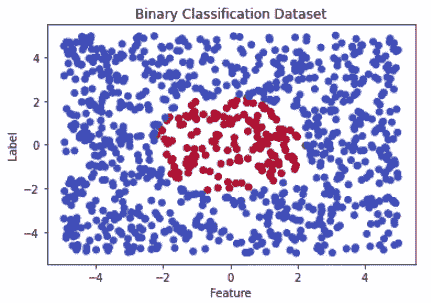

我们创建的二分类问题。图片来源：Federico Trotta。

所以，这是一个二分类数据集的例子：一些数据点属于蓝色类别，一些属于红色类别。现在，这些类别代表什么并不重要。它们可以是苹果或梨，汽车或火车。这不重要。现在重要的是我们可视化了一个二分类问题。

现在，让我们可视化一个多类别问题：

```py
import numpy as np
import matplotlib.pyplot as plt

# Set random seed for reproducibility
np.random.seed(42)

# Generate data
num_samples = 1000
X = np.random.rand(num_samples, 2) * 10 - 5
y = np.zeros(num_samples, dtype=int)
y[np.sum(X ** 2, axis=1) < 2.5] = 1
y[np.logical_and(X[:, 0] > 2, np.abs(X[:, 1]) < 1)] = 2
y[np.logical_and(X[:, 0] < -2, np.abs(X[:, 1]) < 1)] = 3

# Plot data
plt.scatter(X[y==0, 0], X[y==0, 1], c='blue', label='Class 1')
plt.scatter(X[y==1, 0], X[y==1, 1], c='red', label='Class 2')
plt.scatter(X[y==2, 0], X[y==2, 1], c='green', label='Class 3')
plt.scatter(X[y==3, 0], X[y==3, 1], c='purple', label='Class 4')
plt.xlabel('Feature')
plt.ylabel('Label')
plt.title('Multiclass Classification Dataset')
plt.legend()
plt.show()
```

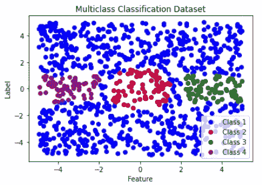

我们创建的多类别分类问题。图片来源：Federico Trotta。

所以，这里我们创建了一个分类问题，数据点属于 4 个类别。

多类别分类问题的一个难点是理解所有类别是否都重要。让我们在下一段中看看这是什么意思。

```py
NOTE:

in the case of a binary classification,classes can be named as 0-1.
But they can also be named as 1-2\. So, there is no convention that
tells us we need to start from 0.

This is the same for the multi-class case. Classe can be named 0,1,2,3 as
well as 1,2,3,4.
```

# 处理类别不平衡

考虑以下数据集：

```py
import numpy as np
import matplotlib.pyplot as plt

# Set random seed for reproducibility
np.random.seed(42)

# Class 1: blue
mean1 = [0, 0]
cov1 = [[1, 0], [0, 1]]
num_points1 = 7000
X1 = np.random.multivariate_normal(mean1, cov1, num_points1)

# Class 2: green
mean2 = [3, 3]
cov2 = [[0.5, 0], [0, 0.5]]
num_points2 = 2700
X2 = np.random.multivariate_normal(mean2, cov2, num_points2)

# Class 3: red
mean3 = [-3, 3]
cov3 = [[0.5, 0], [0, 0.5]]
num_points3 = 300
X3 = np.random.multivariate_normal(mean3, cov3, num_points3)

# Plot the data
plt.scatter(X1[:, 0], X1[:, 1], color='blue', s=1, label='Class 1')
plt.scatter(X2[:, 0], X2[:, 1], color='green', s=1, label='Class 2')
plt.scatter(X3[:, 0], X3[:, 1], color='red', s=1, label='Class 3')
plt.xlabel('Feature')
plt.ylabel('Label')
plt.title('Imbalanced Multiclass Classification Dataset')
plt.legend()
plt.show()
```

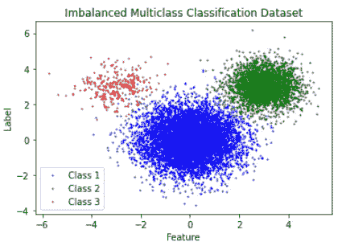

我们创建的不平衡的多类别分类问题。图片来源：Federico Trotta。

如我们所见，我们有很多蓝色点，还有大量绿色点。而红色点与其他点相比非常少。

问题是：我们应该考虑红色点吗？换句话说：我们可以通过删除红色点来进行机器学习分析吗？因为这些点太少了。

答案是……这要视情况而定！

通常情况下，我们可以忽略那些观测值少于其他类别的一个（或多个）类别。但在某些特定情况下，我们绝不能这么做！这就是领域知识发挥作用的地方。

例如，如果我们在研究银行公司的欺诈检测，我们期望欺诈交易相对于标准交易来说是稀少的。这给我们带来了一个不平衡的数据集，这意味着：我们不能删除属于观测值较少类别的值！

如果我们在医学领域研究某些问题也是一样的。在稀有疾病的情况下，我们期望这些疾病是……稀有的！因此，不平衡的数据集是我们所期望的。

无论如何，我们故意创建了上面的数据集用于教学目的。一般来说，很难可视化数据点，因为我们有多个特征。因此，评估类别不平衡的一种方法是显示标签的直方图。

在继续之前……如果你不知道直方图和条形图的区别，你可以阅读我写的以下文章：

[](/what-is-the-difference-between-a-barplot-and-a-histogram-e62d0e532e7d?source=post_page-----9f02eab796ae--------------------------------) ## 条形图和直方图有什么区别？

### 它们看起来似乎是一样的，但它们之间的差异是相关的。

[towardsdatascience.com

所以，这里是我们可以做的。让我们创建一个包含三个标签的数据集，如下所示：

```py
import pandas as pd
import numpy as np

# Create a list of labels
labels = ['1', '2', '3']

# Create a list of features
features = ['feature_1', 'feature_2', 'feature_3']

# Set the number of samples
num_samples = 1000

# Create an empty Pandas DataFrame to store the data
data = pd.DataFrame()

# Add the features to the DataFrame
for feature in features:
    data[feature] = np.random.rand(num_samples)

# Add the labels to the DataFrame
data['label'] = np.random.choice(labels, num_samples)
```

即使这个数据框是故意创建的，它也反映了真实情况，因为它是表格化的（意味着我们可以用 pandas 操作它）。所以，如果我们显示头部，我们得到：

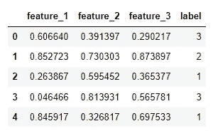

我们数据框的头部。图片由 Federico Trotta 提供。

所以，为了理解我们的数据集是否可能是不平衡的，我们绘制一个直方图，如下所示：

```py
import seaborn as sns
import matplotlib.pyplot as plt

# Plot histogram
sns.histplot(data=data, x='label')

# Write title and axis labels
plt.title('CLASSES FREQUENCIES', fontsize=14) #plot TITLE
plt.xlabel('Our labels (our classes)', fontsize=12) #x-axis label
plt.ylabel('Frequencies of the three classes', fontsize=12) #y-axis label
```

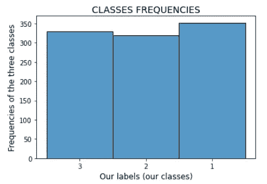

我们数据集的三个类别的频率。图片由 Federico Trotta 提供。

好吧，在这种情况下，三个类别的频率是相同的。因此，数据集是平衡的，我们必须在分析中考虑所有标签。

相反，这是通过直方图表示的类别不平衡：

```py
import pandas as pd
import numpy as np
import seaborn as sns
import matplotlib.pyplot as plt

# Create a list of labels with class imbalance
labels = ['1'] * 500 + ['2'] * 450 + ['3'] * 50

# Create a list of features
features = ['feature_1', 'feature_2', 'feature_3']

# Shuffle the labels
np.random.shuffle(labels)

# Create an empty Pandas DataFrame to store the data
data = pd.DataFrame()

# Add the features to the DataFrame
for feature in features:
    data[feature] = np.random.rand(len(labels))

# Add the labels to the DataFrame
data['label'] = labels

# Plot histogram
sns.histplot(data=data, x='label')

# Write title and axis labels
plt.title('CLASSES FREQUENCIES', fontsize=14) #plot TITLE
plt.xlabel('Our labels (our classes)', fontsize=12) #x-axis label
plt.ylabel('Frequencies of the three classes', fontsize=12) #y-axis label
```

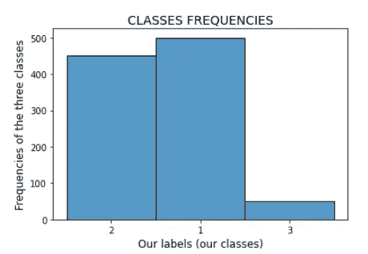

我们创建的不平衡数据集。图片由 Federico Trotta 提供。

所以，在这种情况下，我们需要了解是否需要考虑第 3 类（我们正在研究“稀有情况”）或不需要考虑（我们正在研究“没有稀有事件的情况”），以便可以丢弃与其相关的所有值。

现在，在深入了解解决分类问题所需的指标之前，我们需要了解分类算法实际做了什么。

# 分类算法实际做了什么

正如我们所知，我们使用机器学习来进行预测。这意味着我们在可用数据上训练一个机器学习模型，期望预测结果尽可能接近实际数据。

如果你不知道“训练一个机器学习模型”实际意味着什么，你可以在这里阅读我的文章：

[## 什么是训练好的模型？](https://towardsdatascience.com/what-is-a-trained-model-5c872cfa8448?source=post_page-----9f02eab796ae--------------------------------)

### 或者……“训练一个机器学习模型”是什么意思？

towardsdatascience.com

所以，让我们考虑一个二分类问题。我们的机器学习模型接收特征作为输入，并预测数据点是否属于第 1 类或第 2 类。如果预测“是完美的”，这意味着我们的模型可以准确地告诉我们哪些数据属于第 1 类，哪些属于第 2 类，没有错误。所以，所有实际属于第 1 类的数据点都被我们的机器学习模型预测为第 1 类。

当然，正如你所想，0%的错误是不可能的，这就是为什么我们需要一些指标来评估我们的机器学习模型。

所以在深入了解指标之前，我们需要使用一些术语：

+   我们将**真正例（TP）**定义为属于某一类别的数据点，并且被预测为属于该类别。例如，如果模型预测一封邮件是垃圾邮件，并且它确实是垃圾邮件，那么这就是一个真正例。

+   我们定义**真负例（TN）**为一个数据点不属于某个类别且预测为不属于该类别的情况。例如，如果模型预测一封邮件不是垃圾邮件，而它确实不是垃圾邮件，那么这就是一个真负例。

+   我们定义**假正例（FP）**为一个数据点属于一个类别，但预测为属于另一个类别的情况。例如，如果模型预测一封邮件是垃圾邮件，但实际上它不是垃圾邮件，那么这就是一个假正例。

+   我们定义**假负例（FN）**为一个数据点不属于某个类别但预测为不属于该类别的情况。例如，如果模型预测一封邮件不是垃圾邮件，但实际上它是垃圾邮件，那么这就是一个假负例。

一般来说，正如你可能想象的那样，我们希望在最大化真正例和真负例的同时，最小化假正例和假负例，以使模型尽可能准确。这意味着我们的 ML 模型做出了准确的预测。

那么，“准确”是什么意思？我们需要深入了解我们的第一个分类指标来理解它。

# 准确率

我们考虑的第一个指标是准确率。让我们看看公式：

作者在 embed-dot-fun 上写出的准确率公式。

所以，**准确率**是衡量我们的 ML 模型在预测中多么正确的一个指标。

例如，假设我们有一个标记为垃圾邮件或非垃圾邮件的邮件数据集。我们可以使用 ML 来预测新邮件是否为垃圾邮件。如果模型正确预测 100 封邮件中有 80 封是垃圾邮件，并且正确预测 100 封邮件中有 90 封不是垃圾邮件，那么它的准确率将是：

我们示例的计算。

这意味着我们的模型能够在 85% 的情况下正确预测邮件的类别。高准确率（接近 1）表示模型表现良好，而低准确率（接近 0）则表示模型需要改进。然而，准确率单独可能并不是评估模型性能的最佳指标，尤其是在不平衡的数据集中。

这是可以理解的，因为流行类别有“更多的数据”被标记，因此如果我们的模型准确，它将根据流行类别做出准确预测。换句话说，我们的模型可能因为流行类别而存在偏差。

让我们用 Python 创建一个数据集作为示例：

```py
import numpy as np
import pandas as pd

# Random seed for reproducibility
np.random.seed(42)

# Create samples
n_samples = 1000
fraud_percentage = 0.05 # Fraudolent percentage

# Create classes 
X = np.random.rand(n_samples, 10)
y = np.random.binomial(n=1, p=fraud_percentage, size=n_samples)

# Create data frame
df = pd.DataFrame(X)
df['fraudulent'] = y
```

我们创建了一个包含 1000 个样本的数据框，这些样本可以代表一些信用卡交易的数据。例如，我们创建了一个欺诈交易类别，它占所有观察值的 5%。所以，这个数据集显然是不平衡的。

如果我们的模型准确，那是因为它受到 95% 属于非欺诈交易类别的观察值的影响。因此，让我们拆分数据集，使用逻辑回归模型进行预测，并打印准确率：

```py
from sklearn.model_selection import train_test_split
from sklearn.linear_model import LogisticRegression
from sklearn.metrics import accuracy_score

# Split the dataset 
X_train, X_test, y_train, y_test = train_test_split(X, y, test_size=0.3, random_state=42)

# Fit logistic regression model to train set
model = LogisticRegression()
model.fit(X_train, y_train)

# Make predictions
y_pred = model.predict(X_test)

# Calculate and print accuracy
accuracy = accuracy_score(y_test, y_pred)
print('Accuracy:', accuracy)

>>>
    Accuracy: 0.95
```

所以，我们的模型准确率为 95%：好极了！现在……让我们定义其他指标，并看看它们告诉我们关于这个数据集的信息。

# 精确度和召回率

**精确度**衡量分类器不将负样本标记为正样本的能力。换句话说，它衡量所有正预测中真实正样本的比例。简单来说，精确度告诉我们模型的正预测有多准确。这是公式：

公式由作者在 embed-dot-fun 上写出。

在考虑电子邮件垃圾邮件分类问题时，精确度衡量模型分类为垃圾邮件的邮件中实际有多少是垃圾邮件。

让我们在不平衡数据集中使用它：

```py
from sklearn.metrics import precision_score

# Calculate and print precision
precision = precision_score(y_test, y_pred)

print('Precision:', precision)

>>>

    Precision: 0.0
```

哎呀！95%的准确率和 0%的精确度：这意味着什么？这意味着模型将所有样本预测为负样本或非欺诈交易。这显然是错误的。实际上，高精确度分数表示模型能够在所有预测为欺诈交易的交易中正确识别出较高比例的欺诈交易。

然后，我们有**召回率**指标，它衡量所有实际正样本中真实正样本的比例。换句话说，它衡量实际正样本中有多少被正确预测。简单来说，召回率告诉我们模型在找到数据中的所有正实例方面的能力。这是公式：

公式由作者在 embed-dot-fun 上写出。

在考虑电子邮件垃圾邮件分类问题时，召回率衡量数据集中实际的垃圾邮件有多少被我们的机器学习分类器正确识别为垃圾邮件。

假设我们有一个 1000 封邮件的数据集，其中 200 封是垃圾邮件，其余的是正常邮件。我们训练一个机器学习模型来将邮件分类为垃圾邮件或非垃圾邮件，它预测了 100 封邮件为垃圾邮件。

精确度会告诉我们这些 100 个预测为垃圾邮件的邮件中实际上有多少是垃圾邮件。例如，如果 100 个预测为垃圾邮件的邮件中有 90 个实际上是垃圾邮件，那么精确度就是 90%。这意味着，在模型预测为垃圾邮件的所有邮件中，90%实际上是垃圾邮件。

另一方面，召回率告诉我们模型正确识别了多少实际的垃圾邮件。例如，如果在 200 个实际的垃圾邮件中，模型正确识别了 150 个为垃圾邮件，那么召回率就是 75%。这意味着在所有实际的垃圾邮件中，模型正确识别了 75%。

现在，让我们在不平衡数据集中使用召回率：

```py
from sklearn.metrics import recall_score

# Calculate and print recall
recall = recall_score(y_test, y_pred)

print('Recall:', recall)

>>>

    Recall: 0.0
```

再次说明：我们有 95%的准确率和 0%的召回率。这意味着什么？就像之前一样，这意味着模型没有正确识别任何欺诈交易，而是将所有交易都预测为非欺诈交易。实际上，高召回率分数表示模型能够正确识别所有实际欺诈交易中的较高比例。

因此，在实际操作中，我们希望根据我们研究的问题在精度和召回率之间达到平衡。为此，我们经常参考其他两个考虑到这两者的指标：混淆矩阵和 F1 分数。让我们看看它们。

# F1 分数

**F1 分数** 是一种机器学习评估指标，它将精度和召回率结合成一个范围为 0-1 的单一值。如果 F1 分数为 0，则我们的机器学习模型性能较差。如果 F1 分数为 1，则我们的机器学习模型性能较高。

这个指标通过计算精度和召回率的调和平均值来平衡精度和召回率。这是一种对低值更敏感的平均数，因此这个指标特别适用于不平衡的数据集。

让我们看看它的公式：

由作者在 embed-dot-fun 上撰写的 F1 分数公式。

现在，我们知道在我们不平衡的数据集上将获得的结果（F1 分数将为 0）。但让我们看看如何在 Python 中使用它：

```py
from sklearn.metrics import f1_score

# Calculate and print f1-score
f1 = f1_score(y_test, y_pred)

print('F1 score:', f1)

>>>

    F1 score: 0.0
```

在垃圾邮件分类器的背景下，假设我们有一个包含 1000 封邮件的数据集，其中 200 封是垃圾邮件，其余的是合法邮件。我们训练一个机器学习模型来将邮件分类为垃圾邮件或非垃圾邮件，并且预测有 100 封邮件是垃圾邮件。

要计算垃圾邮件分类器的 F1 分数，我们首先需要计算其精度和召回率。假设在 100 封预测为垃圾邮件的邮件中，有 80 封实际上是垃圾邮件。因此，精度为 80%。另外，假设在 200 封实际的垃圾邮件中，模型正确识别了 150 封垃圾邮件。因此，召回率为 75%。

现在我们可以计算 F1 分数：

由作者在 embed-dot-fun 上撰写的垃圾邮件分类器的 F1 分数计算方法。

这是一个相当不错的结果，因为我们接近 1。

# 混淆矩阵

混淆矩阵是一个表格，通过显示真正例、假正例、真负例和假负例的数量来总结分类模型的性能。

在二分类问题中，混淆矩阵有两行两列，显示如下：

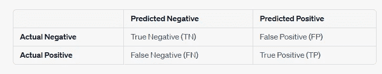

混淆矩阵。图片由费德里科·特罗塔提供。

以垃圾邮件分类为例，假设我们的模型预测了 100 封邮件为垃圾邮件，其中 80 封实际上是垃圾邮件，预测了 900 封邮件为非垃圾邮件，其中 20 封实际上是垃圾邮件。

这个例子的混淆矩阵会是这样的：

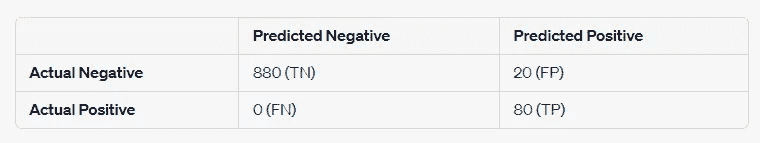

我们的垃圾邮件分类问题的混淆矩阵。图片由费德里科·特罗塔提供。

现在，这是一种非常有用的分类可视化工具，有两个原因：

1.  它可以通过可视化帮助我们计算精度和召回率

1.  它立即告诉我们重要的内容，而无需任何计算。实际上，我们在分类问题中希望 TN 和 TP 尽可能高，而 FP 和 FN 尽可能低（尽量接近 0）。因此，如果主对角线上的值高而其他位置上的值低，那么我们的机器学习模型表现良好。

这就是我喜欢混淆矩阵的原因：我们只需要观察主对角线（从左上到右下）和非对角线上的值来评估机器学习分类器的性能。

考虑到我们的不平衡数据集，我们获得了 0 的精确度和召回率，我们说这意味着模型没有正确识别任何欺诈交易，而是将所有交易预测为非欺诈的。

这可能真的很难可视化，因为精确度和召回率的公式。我们必须在脑海中把它们弄清楚。由于我很难进行这种可视化，让我们应用混淆矩阵到我们的例子中，看看会发生什么：

```py
from sklearn.metrics import confusion_matrix

# Calculate and print confusion matrix
cm = confusion_matrix(y_test, y_pred)

print('Confusion matrix:\n', cm)

>>>

    Confusion matrix:
       [[285   0]
       [ 15   0]]
```

看发生了什么？我们可以清楚地说我们的模型表现不好，因为它捕获了 285 个 TNs 却没有捕获任何 TPs！这就是混淆矩阵的视觉力量！

还有另一种展示混淆矩阵的方式，我非常喜欢，因为它改善了可视化体验。这是代码：

```py
from sklearn.metrics import ConfusionMatrixDisplay

# Calculate confusion matrix
cm = confusion_matrix(y_test, y_pred)

# Plot confusion matrix
cmd = ConfusionMatrixDisplay(cm)
cmd.plot()
```

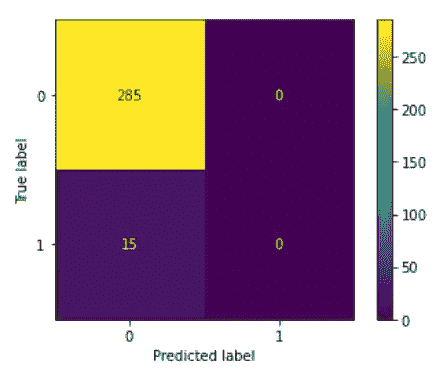

我们的混淆矩阵可视化。图片由 Federico Trotta 提供。

这种可视化在多类分类问题中非常有用。让我们来看一个例子：

```py
import numpy as np
from sklearn.datasets import make_classification
from sklearn.model_selection import train_test_split
from sklearn.metrics import confusion_matrix, ConfusionMatrixDisplay

# Generate random data with 3 classes
X, y = make_classification(n_samples=1000, n_classes=3, n_features=10,
                            n_clusters_per_class=1, n_informative=5,
                            class_sep=0.5, random_state=42)

# Split the data into training and test sets
X_train, X_test, y_train, y_test = train_test_split(X, y, test_size=0.2,
                                    random_state=42)

from sklearn.linear_model import LogisticRegression

# Train a logistic regression model on the training data
clf = LogisticRegression(random_state=42).fit(X_train, y_train)

# Make predictions on the test data
y_pred = clf.predict(X_test)

# Calculate the confusion matrix
cm = confusion_matrix(y_test, y_pred)

# Display the confusion matrix
disp = ConfusionMatrixDisplay(confusion_matrix=cm,
        display_labels=['Class 0', 'Class 1', 'Class 2'])
disp.plot()
```

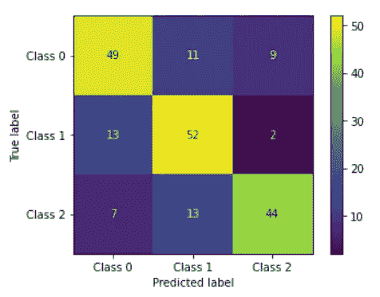

我们三类问题的混淆矩阵可视化。图片由 Federico Trotta 提供。

在这些情况下，很难理解真正的 TPs、TNs 等，因为我们有三类样本。不过，我们可以简单地参考主对角线上的值和非对角线上的值。在这种情况下，主对角线上的值为 49、52 和 44，这些值远高于非对角线上的值，表明该模型表现良好（还要注意我们是在测试集上计算了混淆矩阵！）。

# 灵敏度和特异性

有几个指标，在我个人看来，在某些特定情况下更适用：灵敏度和特异性。让我讲讲这些，然后我们将讨论在特定情况下的可用性。

**灵敏度** 是分类器找到所有正样本的能力：

作者在 embed-dot-fun 上写的灵敏度公式。

> 等一下！但这不是召回率吗？！

是的，确实如此。这不是一个错误。这就是为什么我告诉你这些指标更适用于特定情况。但是让我继续。

我们将**特异性**定义为分类器找到所有负样本的能力：

作者在 embed-dot-fun 上写的特异性公式。

因此，这两者都描述了测试的“精确度”：敏感性描述了正测试的概率，特异性描述了负测试的概率。

根据我的经验，这些指标更适合用于医疗领域、生物学等领域的分类器。

举个例子，我们考虑一个 COVID 测试。考虑这种方法（可以被认为是贝叶斯方法，但我们先略过）：你做了一个 COVID 测试，结果是阳性。问题是：得到阳性测试的概率是多少？得到阴性测试的概率是多少？

换句话说：你用来得到结果的工具的 **敏感性和特异性** 是什么？

好吧，你可能会问自己：你在问什么问题，Federico？

让我举一个我去年夏天经历的例子。

在意大利，阳性 COVID 测试需要由某人认证（我们暂且略过原因）：通常是医院或药店。所以，当我们出现症状时，我们通常会在家里进行 COVID 测试（3-5 欧元的 COVID 测试），然后去药店确认（15 欧元的 COVID 测试）。

去年 7 月，我在妻子和女儿测试呈阳性后出现症状。所以我在家测试结果为阳性。然后，立刻去药店确认，结果却是阴性！

怎么可能呢？很简单：我在家里使用的 COVID 测试工具比药剂师使用的工具更敏感（或者，药剂师使用的测试比我使用的测试更特异）。

因此，根据我的经验，这些指标特别适用于任何类型的测量仪器（机械、电气等）和/或某些特定领域（如生物学、医学等）。此外，记住这些指标使用 TP、TN、FP 和 FN 作为精确度和召回率：这再次强调了这些指标在二分类问题中的适用性。

当然，我不是说敏感性和特异性 **必须** 只在上述情况下使用。根据我的经验，它们只是更适合。

# Log loss（交叉熵）

Log loss — 有时称为交叉熵 — 是分类中的一个重要指标，并且基于概率。这个分数将每个类别的预测概率与实际类别标签进行比较。

让我们看一下公式：

作者在 embed-dot-fun 上写的 Log Loss 公式。

其中我们有：

+   `n` 是观测总数，`i` 是单个观测值。

+   `y` 是真实值。

+   `p` 是预测的概率。

+   `Ln` 是自然对数。

要计算预测的概率 `p`，我们需要使用可以实际计算概率的 ML 模型，比如逻辑回归。例如，在这种情况下，我们需要像这样使用 `predict_proba()` 方法：

```py
from sklearn.linear_model import LogisticRegression

# Invoke logistic regression model
model = LogisticRegression()
# Fit the data on the train set
model.fit(X_train, y_train) 

# Calculate probabilities
y_prob = model.predict_proba(X_new)
```

所以，假设我们有一个二分类问题，并且假设我们通过逻辑回归模型计算概率，并且假设以下表格代表我们的结果：

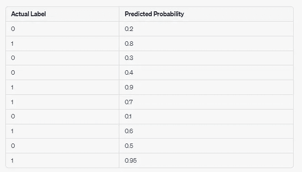

一个展示实际标签和通过逻辑回归模型计算的概率的表格。图片由 Federico Trotta 提供。

我们计算 Log Loss 的步骤如下：

使用上表中的值（我们只对前两个出现的值进行了计算）计算 Log Loss，由 Author 在 embedd-dot-fun 上完成。

这会导致一个接近 0 的值，这让我们感到满意，意味着我们的逻辑回归模型对每个类别的标签预测得相当好。实际上，Log Loss 为 0 的值表示可能的最佳拟合。换句话说，一个 Log Loss 为 0 的模型预测每个观察值的概率作为真实值。

但是，不必担心：我们不需要手动计算 Log Loss 的值。幸运的是，`sklearn` 为我们提供了帮助。因此，让我们回到我们不平衡的数据集。要在 Python 中计算 Log Loss，我们输入以下内容：

```py
from sklearn.metrics import log_loss

# Invoke & print Log Loss
log_loss_score = log_loss(y_test, y_pred)

print("Log loss score:", log_loss_score)

>>>

    Log loss score: 1.726938819745535
```

再次，我们在测试集上得到了一个糟糕的指标，确认了上述所有情况。

最后，一个最后的考虑：Log Loss 适用于二分类问题。那多分类问题呢？

# 分类交叉熵

分类交叉熵指标表示 Log Loss 在多分类情况下的推广。

这个指标特别适用于不平衡数据集，因为它考虑了预测类别的概率。当我们有一个不平衡的数据集时，因为类别的相对频率可以影响模型正确预测“少数”类别的能力，所以这是很重要的。

这里我们有：

作者在 embed-dot-fun 上写的分类交叉熵公式。

其中命名法与 Log Loss 情况下相同。

最后，在 Python 中，我们使用的方法与 Log Loss 相同，通过调用 `from sklearn.metrics import log_loss`。因此，这次讨论仅仅是为了强调二分类或多分类情况的细微差别。

# AUC/ROC 曲线

**ROC** 代表“接收者操作特征”，是一种通过绘制真实正率（**TPR**）与假正率（**FPR**）在不同阈值下的图形来评估分类器的方式。

**AUC** 代表“曲线下面积”，表示 ROC 曲线下的面积。这是一种整体性能指标，范围从 0 到 1（其中 1 表示分类器预测了 100% 的标签作为实际值），并且在比较不同的分类器时更为合适。

首先，让我们定义 TPR 和 FPR：

+   TPR 是敏感度（也可以叫做召回率，正如我们所说的）。

+   FPR 定义为 `1-specificity`。

请注意，AUC/ROC 适用于二分类问题。实际上，对于多分类分类器，TPR 和 FPR 需要重新审视。这需要一些工作，所以在这里我的建议是仅在二分类问题中使用它。

现在，让我们看看如何在 Python 中实现这一点：

```py
import numpy as np
from sklearn.datasets import make_classification
from sklearn.model_selection import train_test_split
from sklearn.linear_model import LogisticRegression
from sklearn.metrics import roc_curve, roc_auc_score
import matplotlib.pyplot as plt

# Generate a random binary classification dataset
X, y = make_classification(n_samples=1000, n_features=10, n_classes=2,
       random_state=42)

# Split the dataset into training and testing sets
X_train, X_test, y_train, y_test = train_test_split(X, y,
                                  test_size=0.2, random_state=42)

# Fit a logistic regression model on the training data
model = LogisticRegression()
model.fit(X_train, y_train)

# Predict probabilities for the testing data
probs = model.predict_proba(X_test)

# Compute the ROC curve and AUC score
fpr, tpr, thresholds = roc_curve(y_test, probs[:, 1])
auc_score = roc_auc_score(y_test, probs[:, 1])

# Plot the ROC curve
plt.plot(fpr, tpr, label='AUC = {:.2f}'.format(auc_score))
plt.plot([0, 1], [0, 1], 'k--')
plt.xlabel('False Positive Rate')
plt.ylabel('True Positive Rate')
plt.title('ROC Curve')
plt.legend(loc='lower right')
plt.show()
```

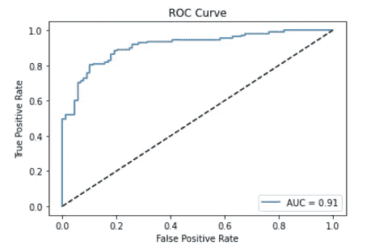

上述代码的 AUC/ROC 曲线。图像由 Federico Trotta 提供。

虚线代表一个完全随机的分类器（这就像是随机猜测一个类别，而不是另一个。事实上，由于这是一个二分类问题，这条线的斜率为 0.5，意味着我们有 50% 的机会猜对）。因此，我们的曲线离这条虚线越远，我们的模型就越好。理想情况下，我们的曲线应尽可能保持在左上角，这意味着 False Positive Rate 较低，同时 True Positive Rate 较高。

这就是为什么这个图形适合用来比较模型：更好的模型在图形的左上角附近有曲线。让我们来看一个例子：我们将使用与之前相同的数据集，但我们会将数据拟合到三种不同的机器学习模型上。

```py
import numpy as np
from sklearn.datasets import make_classification
from sklearn.model_selection import train_test_split
from sklearn.linear_model import LogisticRegression
from sklearn.ensemble import RandomForestClassifier
from sklearn.neighbors import KNeighborsClassifier
from sklearn.metrics import roc_curve, roc_auc_score
import matplotlib.pyplot as plt

# Generate a random binary classification dataset
X, y = make_classification(n_samples=1000, n_features=10, n_classes=2,
       random_state=42)

# Split the dataset into training and testing sets
X_train, X_test, y_train, y_test = train_test_split(X, y, test_size=0.2,
                                  random_state=42)

# Fit three different classifiers on the training data
clf1 = LogisticRegression()
clf2 = RandomForestClassifier(n_estimators=100)
clf3 = KNeighborsClassifier(n_neighbors=5)
clfs = [clf1, clf2, clf3]

# Predict probabilities for the testing data
plt.figure(figsize=(8,6))
for clf in clfs:
    clf.fit(X_train, y_train)
    probs = clf.predict_proba(X_test)
    fpr, tpr, _ = roc_curve(y_test, probs[:,1])
    auc_score = roc_auc_score(y_test, probs[:,1])
    plt.plot(fpr, tpr, label='{} (AUC = {:.2f})'.format(clf.__class__.__name__,
    auc_score))

# Plot the ROC/AUC curves for each classifier
plt.plot([0, 1], [0, 1], 'k--')
plt.xlim([0.0, 1.0])
plt.ylim([0.0, 1.05])
plt.xlabel('False Positive Rate')
plt.ylabel('True Positive Rate')
plt.title('ROC Curve Comparison')
plt.legend(loc="lower right")
plt.show()
```

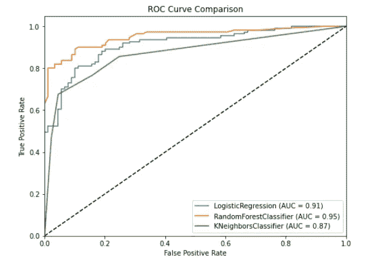

上述代码的 AUC/ROC 曲线。图像由 Federico Trotta 提供。

在这种情况下，随机森林分类器是预测我们数据最好的，因为它的曲线位于左上角，且数值高于其他模型。

结束这一部分之前，让我提醒你们，我们在这一段开始时提到 ROC 图将 TPR 对 FPR 在不同阈值下进行绘制，但我们还没有指定其他内容。因此，让我们在下一段中进行说明。

# 精确度-召回率曲线

考虑一个二分类问题。我们将数据拟合到分类器，它将任何预测值分配到类别 1 或类别 0：用于分配的标准是什么？

停下来思考一下吧。

是的，你猜对了：在分类问题中，分类器为每个样本分配一个介于 0 和 1 之间的分数。这表示样本属于正类的概率。

因此，我们的机器学习模型使用阈值将概率分数转换为类别预测。换句话说，任何概率分数大于阈值的样本都会被预测为正类，例如。

当然，即使在多类别分类问题中也是如此：我们使用二分类的情况只是为了简化我们的推理。

因此，ROC 曲线非常有用，因为它们展示了机器学习模型在不同阈值下的表现变化。

无论如何，分类器基于阈值将预测值分配到某个类别的事实告诉我们，精确度和召回率是一个权衡（就像偏差和方差一样）。

同时，我们甚至可以绘制精确度-召回率曲线。让我们看看如何做，使用我们用于 AUC/ROC 曲线的数据集：

```py
import numpy as np
from sklearn.datasets import make_classification
from sklearn.model_selection import train_test_split
from sklearn.linear_model import LogisticRegression
from sklearn.metrics import precision_recall_curve
import matplotlib.pyplot as plt

# Generate a random binary classification dataset
X, y = make_classification(n_samples=1000, n_features=10, n_classes=2,
      random_state=42)

# Split the dataset into training and testing sets
X_train, X_test, y_train, y_test = train_test_split(X, y, test_size=0.2,
                                  random_state=42)

# Fit a logistic regression model on the training data
clf = LogisticRegression()
clf.fit(X_train, y_train)

# Predict probabilities for the testing data. Compute precision-recall curve
probs = clf.predict_proba(X_test)
precision, recall, thresholds = precision_recall_curve(y_test, probs[:,1])

# Plot the precision-recall curve
plt.plot(recall, precision)
plt.xlabel('Recall')
plt.ylabel('Precision')
plt.title('Precision-Recall Curve')
plt.show()
```

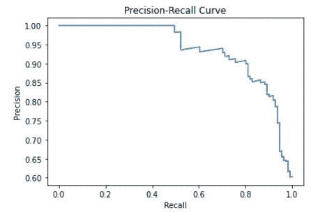

上述代码的精确度-召回率曲线。图像由 Federico Trotta 提供。

因此，上面我们可以看到精确度在约 0.5 召回率之前保持为 1，然后迅速下降。因此，我们希望在这个值之前选择一个精确度-召回率权衡点。假设选择在 0.4 召回率处。

另一种很好的可视化这种权衡的方法是绘制精确度与召回率随阈值变化的图。使用相同的数据集，这就是发生的情况：

```py
import numpy as np
from sklearn.datasets import make_classification
from sklearn.model_selection import train_test_split
from sklearn.linear_model import LogisticRegression
from sklearn.metrics import precision_recall_curve
import matplotlib.pyplot as plt

# Generate a random binary classification dataset
X, y = make_classification(n_samples=1000, n_features=10, n_classes=2,
      random_state=42)

# Split the dataset into training and testing sets
X_train, X_test, y_train, y_test = train_test_split(X, y, test_size=0.2,
                                  random_state=42)

# Fit a logistic regression model on the training data
clf = LogisticRegression()
clf.fit(X_train, y_train)

# Predict probabilities for the testing data. Compute precision-recall curve
probs = clf.predict_proba(X_test)
precision, recall, thresholds = precision_recall_curve(y_test, probs[:,1])

# Plot precision and recall as thresholds change
plt.plot(thresholds, precision[:-1], label='Precision')
plt.plot(thresholds, recall[:-1], label='Recall')
plt.xlabel('Threshold')
plt.ylabel('Precision & Recall')
plt.legend()
plt.title('Precision and Recall as Thresholds Change')
plt.show()
```

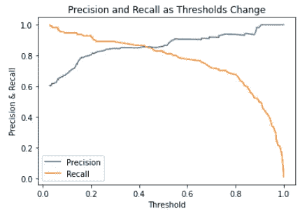

随着阈值变化的精确度与召回率。图像由 Federico Trotta 提供。

因此，上图确认了在这种情况下，平衡精确度-召回率权衡的阈值大约为 0.4。

所以，当有人告诉你找到一个 95% 精确度的机器学习模型时，你应该问：“*召回率是多少？*”

最后，由于它们使用的指标非常相似，你可能会想知道何时使用 AUC/ROC 曲线，何时使用精确度-召回率曲线。引用参考文献 1（第 92 页）：

> 作为经验法则，当正类稀有，或当你更关心假阳性而不是假阴性时，你应该优先考虑精确度-召回率曲线，否则使用 ROC 曲线。

# 额外内容：KDE 和学习曲线

在我们看到的所有特定于分类问题的方法和指标中，有两个是跨领域的。这意味着它们可以用于评估分类和回归问题。

有 KDE 图和学习曲线。我在之前的文章中写过它们，所以我会在下面链接它们：

你可以在以下文章的“验证机器学习模型的图形方法”段落第 3 点找到什么是 KDE 以及如何使用它：

[## 掌握线性回归：有志数据科学家的权威指南](https://medium.com/mlearning-ai/how-to-easily-validate-your-ml-models-with-learning-curves-21cc01636083?source=post_page-----9f02eab796ae--------------------------------)

### 这里是你需要知道的关于线性回归的一切（包括在 Python 中的应用）。

[towardsdatascience.com](https://medium.com/mlearning-ai/how-to-easily-validate-your-ml-models-with-learning-curves-21cc01636083?source=post_page-----9f02eab796ae--------------------------------)

你可以在这里阅读关于学习曲线是什么以及如何使用它们的内容：

[## 如何轻松验证你的机器学习模型与学习曲线](https://medium.com/mlearning-ai/how-to-easily-validate-your-ml-models-with-learning-curves-21cc01636083?source=post_page-----9f02eab796ae--------------------------------)

### 发现学习曲线的强大功能来验证你的机器学习模型。

[medium.com](https://medium.com/mlearning-ai/how-to-easily-validate-your-ml-models-with-learning-curves-21cc01636083?source=post_page-----9f02eab796ae--------------------------------)

# 结论

到目前为止，我们已经看到很多评估分类算法的指标和方法。如果你在考虑使用哪一种，我总是说，虽然熟悉每一种（特别是比较它们）是一个好习惯，但很难回答这个问题，原因有很多。通常，这只是一个个人偏好的问题。

此外，仅使用一个指标来评估机器学习模型是不够的，这是一条经验法则。

如果你读过我其他的文章，你会知道我个人喜欢使用至少一种分析方法和一种图形方法。在分类问题的情况下，我通常使用混淆矩阵和 KDE。

不过，再次强调：这完全是个人喜好问题。我的建议是练习使用这些方法，并决定你喜欢哪些，记住你需要不止一种方法来对你的 ML 模型做出准确的判断。

**免费 Python 电子书：**

刚开始学习 Python 数据科学却感到困难？ [***订阅我的新闻通讯并获取我的免费电子书：这将为你提供正确的学习路径，帮助你通过动手实践学习 Python 数据科学。***](https://federico-trotta.ck.page/a3970f33f4)

喜欢这个故事吗？成为 Medium 会员，仅需 5$/月 [通过我的推荐链接](https://medium.com/@federicotrotta/membership)：这样我将赚取小额佣金，但对你没有额外费用：

[](https://medium.com/@federicotrotta/membership?source=post_page-----9f02eab796ae--------------------------------) [## 通过我的推荐链接加入 Medium — Federico Trotta

### 阅读 Federico Trotta 的每一篇故事（以及 Medium 上其他成千上万的作者）。你的会员费直接支持……

medium.com](https://medium.com/@federicotrotta/membership?source=post_page-----9f02eab796ae--------------------------------)

*参考书目和文献：*

+   *[1] 使用 Scikit-Learn 和 Tensorflow 的动手机器学习 - 奥雷利安·吉龙*

+   *[2] 使用 PyTorch 和 Scikit-learn 的机器学习 - 塞巴斯蒂安·拉施卡，刘宇溪，瓦希德·米里亚利*
