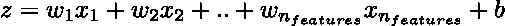

# 使用罗斯恩布拉特感知器进行分类

> 原文：[`towardsdatascience.com/classification-with-rosenblatts-perceptron-e7f49e3af562?source=collection_archive---------3-----------------------#2023-09-09`](https://towardsdatascience.com/classification-with-rosenblatts-perceptron-e7f49e3af562?source=collection_archive---------3-----------------------#2023-09-09)

## 机器学习的“hello-world”

 [潘·克里坦](https://medium.com/@cretanpan?source=post_page-----e7f49e3af562--------------------------------)

·

[关注](https://medium.com/m/signin?actionUrl=https%3A%2F%2Fmedium.com%2F_%2Fsubscribe%2Fuser%2Fff990ba57425&operation=register&redirect=https%3A%2F%2Ftowardsdatascience.com%2Fclassification-with-rosenblatts-perceptron-e7f49e3af562&user=Pan+Cretan&userId=ff990ba57425&source=post_page-ff990ba57425----e7f49e3af562---------------------post_header-----------) 发布于 [Towards Data Science](https://towardsdatascience.com/?source=post_page-----e7f49e3af562--------------------------------) ·8 分钟阅读·2023 年 9 月 9 日

--

照片由 [Lucie Morel](https://unsplash.com/@kaklahad?utm_source=medium&utm_medium=referral) 提供，刊登在 [Unsplash](https://unsplash.com/?utm_source=medium&utm_medium=referral)

最近我在思考什么是机器学习最基本的介绍。我寻找一个简单的任务，比如二分类，并且一个足够简单的算法，以便可以从头开始构建并在短文中解释。如果这个算法有一定的历史背景，那就更好了。很快我找到了候选者：感知机。感知机将我们带回机器学习的起点。它由 Frank Rosenblatt 在 60 多年前[引入](https://blogs.umass.edu/brain-wars/files/2016/03/rosenblatt-1957.pdf)。像神经元一样，感知机规则接受多个输入特征，并拟合权重，这些权重与输入特征向量相乘后决定神经元是否输出信号，或在机器学习分类上下文中是否输出 0 或 1。感知机可能是最简单的二分类器，我不知道现在是否有任何实际的机器学习应用可以用它来解决。然而，它具有重要的教育和历史价值，因为它为神经网络铺平了道路。

本文的目的是介绍感知机并在一个简单的二分类任务中使用它。感知机已经在[scikit-learn](https://scikit-learn.org/stable/modules/generated/sklearn.linear_model.Perceptron.html)中实现，但我们将从零开始构建它。我们还将创建一组可视化图表，以理解算法如何设定其决策边界并探究其收敛性。感知机是一个线性模型，包括权重和在拟合过程中同时和迭代调整的偏置项。然而，它不像机器学习历史上可能的直接继承者——自适应线性神经元（Adaline）算法那样具有连续的损失函数，后者也是一个单层神经网络。拟合感知机完全依赖于检测错误分类的样本，权重和偏置在每次错误分类样本出现时都会立即更新，而不是每个时期（时期为完整的训练集通过一次）。因此，该算法甚至不需要优化器。我敢说，它如此简单和优雅，以至于它变得美丽。如果你对它的工作原理感到好奇，请继续关注！

## 感知机理论

感知机，像其他线性模型一样，使用一组权重，每个特征一个权重，并通过计算权重与特征值的点积并添加偏置来生成预测。

这个线性函数的结果，也称为净输入，会被输入到激活函数 f(z) 中，在感知器的情况下，这个函数是一个简单的阶跃函数，即 f(z) 如果 z≥0 则取值 1，否则取值 0。激活函数的作用是将净输入映射到两个值，即 0 和 1。实际上，我们所做的不过是定义了一个超平面。处于超平面同一侧的点属于同一类。权重定义了垂直于超平面的向量，即超平面的方向，而偏差则是超平面距离原点的距离。当拟合过程开始时，我们有一个随机定向的超平面，距离原点也是随机的。每当遇到一个错误分类的样本时，我们会稍微调整超平面，改变其方向和位置，以便在下一个周期中样本位于超平面的正确侧。我们可以决定调整超平面的幅度，即学习率应该是多少。

通常我们需要通过所有样本几个项目（周期），直到没有点被错误分类，或者更准确地说，直到没有更多的进展。每个周期，我们遍历训练集中所有样本 i = 1,.., nₛₐₘₚₗₑₛ，并使用当前的权重和偏差检查模型是否错误分类，如果是，我们将更新所有权重 j=1,.., nfₑₒₜᵤᵣₑₛ，使用学习率 η：

其中

带有帽子的符号表示预测输出。我们也会更新偏差

其中

理解这些操作的概念上是简单的。假设模型预测了类 0，而正确的应该是 1。如果 xⱼ 是正数，那么权重将增加，从而使净输入增加。如果 xⱼ 是负数，那么权重将减少，以使净输入再次增加（无论权重的符号如何）。类似地，偏差将增加，从而进一步增加净输入。通过这些改变，更有可能在下一个周期中为错误分类的样本预测正确的类别。当模型预测类 1，而正确的应该是 0 时，逻辑类似，唯一的区别是所有符号都会被反转。

如果你仔细观察，权重和偏差可能会在同一个周期内更新多次，每次针对一个被错误分类的样本。每次错误分类都会重新调整和定位决策边界超平面，以便在下一个周期中正确预测样本。

## 数据准备

我们将使用一个合成数据集，其中包含两个高斯分布。感知器可以与任何维度的特征一起使用，但为了本文的目的，我们将限制在两个维度，以便于可视化。

产生如下图形

合成数据集中两类的散点图。图片由作者提供。

两个高斯分布被故意拉长并进一步分开，通过选择适当的均值和协方差。我们稍后会再回到这个话题。

## 感知机实现及使用

感知机的实现见下文。我们使用 scikit-learn 风格来初始化模型、拟合它并最终进行预测。

初始化方法设置学习率、最大迭代次数和随机数生成器种子以确保可重复性。`fit`方法创建一个随机数生成器，然后用于将权重设置为从均匀分布中采样的一些小数，同时偏置初始化为零。然后我们迭代最多若干个时期。每个时期我们计算错误分类的数量，以便监控收敛情况，并在可能的情况下提前终止。对于每个错误分类的样本，我们更新权重和偏置，如前述部分所述。如果错误分类的数量为零，则无法进一步改进，因此无需继续下一个时期。`predict`方法只是计算权重和特征值的点积，添加偏置并应用步进函数。

如果我们使用上述感知机类与合成数据集

我们可以看到在 24 个时期内达到了收敛，即无需耗尽指定的最大时期数。

感知机收敛情况。图片由作者提供。

可以使用 scikit-learn 中的决策边界实用工具[函数](https://scikit-learn.org/stable/modules/generated/sklearn.inspection.DecisionBoundaryDisplay.html)来直观地展示决策边界。为了使用此函数，我们生成一个 200x200 的点网格，覆盖训练集中特征值的范围。本质上，我们构建了一个轮廓图，显示预测的类别，并将样本作为散点图叠加，使用真实标签进行着色。这种绘制决策边界的方式非常通用，可以适用于任何二维分类器。

这两个合成的高斯分布已经通过一个可以用几行代码从零开始编码的模型完美分开。这种方法的简洁性和优雅使它成为机器学习的一个出色的入门和激励示例。

拟合的感知机模型的决策边界。图片由作者提供。

我们还可以通过提前停止模型拟合过程来可视化不同时代决策边界的演变。实际上，可以通过使用递增的最大时代数来拟合模型来实现。对于每一次尝试，我们使用拟合（可能未收敛）的模型的权重和偏置，并将决策边界绘制为一条线。这些线条用时代编号进行注释。这本可以通过温启动实现得更优雅，但拟合模型非常快速，因此额外的复杂性不值得。

各个时代的决策边界演变如下面的图所示。最初，一小部分类别 0 的样本被误分类，这导致决策边界线的斜率和截距逐渐变化。我们可以看到在 24 个时代内达到了收敛，这与上面的收敛图一致。一旦决策边界实现了对类别的完美分隔，拟合过程就会停止，无论边界距离其周围的样本有多近。

几点注意事项。感知器的收敛不能被视为理所当然，因此重要的是设置最大迭代次数。实际上，可以通过数学证明，对于线性可分的类别，收敛是有保证的。如果类别不是线性可分的，那么权重和偏置将不断更新，直到达到最大迭代次数。这就是为什么在合成数据集中两个高斯分布被进一步分开的原因。

另一个重要的注意点是感知器没有唯一的解决方案。通常，会有无数个超平面可以分隔线性可分的类别，模型将随机收敛到其中一个。这也意味着测量决策边界的距离不是确定性的，因此不是特别有用。支持向量机解决了这个限制。

感知器本质上是一个单层神经网络。在跳到多层神经网络和可以用于非线性问题的反向传播算法之前，理解它的工作原理是有帮助的。
