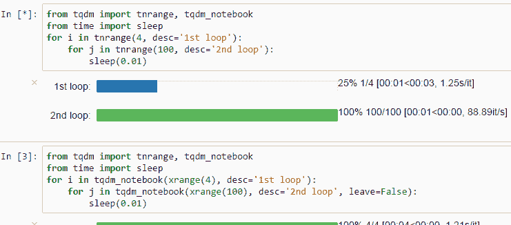
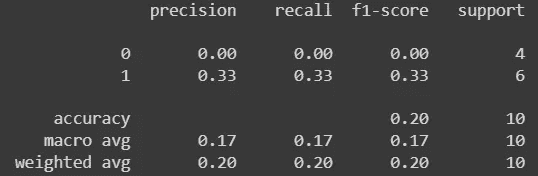

# PyTorch 中的干净代码：可读性 ML 的最佳实践

> 原文：[`towardsdatascience.com/clean-code-in-pytorch-best-practices-for-readable-ml-adfd798bf6df`](https://towardsdatascience.com/clean-code-in-pytorch-best-practices-for-readable-ml-adfd798bf6df)


照片由[Greyson Joralemon](https://unsplash.com/@greysonjoralemon?utm_source=medium&utm_medium=referral)提供，发布在[Unsplash](https://unsplash.com/?utm_source=medium&utm_medium=referral)。

## 五个编写干净、高效且易读代码的技巧，适用于 PyTorch

[](https://medium.com/@marcellopoliti?source=post_page-----adfd798bf6df--------------------------------)[](https://towardsdatascience.com/?source=post_page-----adfd798bf6df--------------------------------) [Marcello Politi](https://medium.com/@marcellopoliti?source=post_page-----adfd798bf6df--------------------------------)

·发表于[Towards Data Science](https://towardsdatascience.com/?source=post_page-----adfd798bf6df--------------------------------) ·5 分钟阅读·2023 年 3 月 17 日

--

## 介绍

在数据科学和编程领域，能够编写易于阅读和维护的代码非常重要。你肯定也有过这样的经历：写出的代码看似运作正常且比较清晰，但一两天或一周后重新阅读时却显得难以理解。当你需要审查别人编写的代码时，这种困难就更为明显。

在 AI 领域，编写清晰易懂的代码至关重要，因为我们经常需要设置多个实验，然后尝试多个模型、多个数据和大量的超参数。

在这篇文章中，我分享了一些我在使用 PyTorch 编程时使用的技巧，你可以立即应用这些技巧，希望它们能帮助你在数据科学家的工作中变得更加高效。

## 创建一个 DataModule 类来管理你的数据

在这个例子中，我将使用著名的 MNIST 数据集。虽然我使用的实践在这种情况下可能看起来不必要，因为各种库已经方便了这类简单数据集的使用，但它们在处理更复杂的数据集时总是会派上用场。

在处理非标准数据集时，我们往往需要经历不同的步骤，比如下载数据、结构化文件夹和子文件夹以拆分数据、创建自定义 Dataset 类等。因此，创建一个 DataModule 类来处理所有这些操作并提供两个直接返回我们将用于训练的数据加载器的函数，将会非常有用。

拥有这样的类将使我们在大规模上拥有更清晰、更具扩展性的工作流程。让我们看一个简单的例子。

```py
import torch
from torch.utils.data import Dataset
from torchvision import datasets
from torchvision.transforms import ToTensor

class DataModule:
    def __init__(self, bs = 64) -> None:
        self.bs = bs
        self.training_data = datasets.FashionMNIST(
            root="data",
            train=True,
            download=True,
            transform=ToTensor()
        )
        self.valid_data = datasets.FashionMNIST(
            root="data",
            train=False,
            download=True,
            transform=ToTensor()
        )

    def train_dataloader(self):
        return torch.utils.data.DataLoader(self.training_data, batch_size=self.bs, shuffle=True)

    def val_dataloader(self):
        return torch.utils.data.DataLoader(self.valid_data, batch_size=4 * self.bs, shuffle=False)
```

在这种情况下，DataModule 类负责使用两个函数创建数据集和实例化数据加载器。这样，在主函数中，我可以简单地调用 train_dataloader() 和 val_dataloader() 函数来访问我的数据。一般来说，如果你有一些需要执行的数据检索任务来收集你的数据集，最好将它们添加到 DataModule 类中，然后可以用它来实例化数据加载器。这样，你可以以直接的方式访问数据。

## 让我们复现 TensorFlow 的 fit 方法

我不是 TensorFlow 的忠实粉丝，实际上，除非必要，我几乎总是使用 PyTorch。不过，我发现 TensorFlow 的 fit() 方法非常方便。实际上，在创建模型之后，你只需调用 model.fit(data) 来训练它，类似于你在 scikit-learn 中使用模型的方式。

那么为什么不在 PyTorch 中也重新创建类似的东西呢？

我们在下一个示例中将做的是定义一个 fit 函数，该函数通过接受之前创建的 DataModule 作为输入来训练网络。之后，我们将把这个函数作为定义模型的类的方法。

这样，每当我们想要创建一个不同的模型时，我们总是可以将其与 fit() 函数关联起来，这个函数保持不变。

```py
class MNISTNet(nn.Module):
    def __init__(self) -> None:
        super(MNISTLogistic, self).__init__()
        self.flatten = nn.Flatten()
        self.lin = nn.Linear(784,10)

    def forward(self, xb):
        return self.lin(torch.flatten(xb,1))

def fit(self: nn.Module, datamodule, epochs:int, loss_fn = nn.CrossEntropyLoss()):
    train_dataloader = datamodule.train_dataloader()
    val_dataloader = datamodule.val_dataloader()

    opt = configure_optimizer(self)
    train_dataloader = datamodule.train_dataloader()

    for epoch in range(epochs):
        self.train()
        for xb, yb in train_dataloader:
            pred = self(xb)
            loss = loss_fn(pred, yb)
            loss.backward()
            opt.step()
            opt.zero_grad()
        self.eval()
        with torch.no_grad():
            valid_loss = sum(loss_fn(self(xb), yb) for xb, yb in val_dataloader)

MNISTLogistic.fit = fit
```

现在我们可以使用 model.fit(datamodule = datamodule, epochs = 3) 来运行我们的训练。

## 进度条

在模型训练过程中，如果没有关于完成所需时间的提示，确实会很烦人。但幸运的是，可以在 PyTorch 中以非常简单的方式实现一个进度条。

只需使用 tqdm 函数，将 dataloader 包装起来，并用 *len(dataloader)* 显式声明 dataloader 的总长度。

这样，进度条就会像魔法一样出现，使输出更加美观。

```py
!pip install tqdm
from tqdm import tqdm

for index, (xb,yb) in tqdm(enumerate(train_loader), total = len(train_loader))
  pred = self(xb)
  loss = loss_fn(pred, yb)
  loss.backward()
  opt.step()
  opt.zero_grad()
```



来源: [`github.com/tqdm/tqdm`](https://github.com/tqdm/tqdm)

## 评估指标

我不知道为什么，但当我阅读用 PyTorch 编写的代码时，我经常看到人们手动实现常见的指标，如精确度、召回率、准确率……

然而，当他们使用其他库，如 scikit-learn 时，情况就不同了。在训练函数中实现这些指标可能会使函数难以阅读，并且可能更容易插入错误。

我建议在工作时使用库中已经找到的指标，如 scikit-learn。这使我们能够使用可能更稳健的代码，更重要的是节省时间！

当然，如果需要实现自定义指标，那么讨论就会有所不同，例如，如果你正在研究模型评估的新方法。

特别是在开始开发项目时，我们希望使用标准指标来判断是否走在正确的道路上，我发现使用 scikit-learn 的 classification_report 函数非常有用。让我们看一个例子。

```py
from sklearn.metrics import classification_report
preds = [0, 1, 1, 0, 1, 0, 1, 1, 0, 1]
labels = [1, 0, 0, 1, 1, 1, 0, 0, 1, 1,]
print(classification_report(labels, preds))
```



(图片由作者提供)

# 结束语

作为一名开发者，我总是尽力使我的代码清晰、整洁（且无错误！[😉](https://emojipedia.org/it/apple/ios-15.4/faccina-che-fa-l-occhiolino/)）。我总是记得我的代码必须尽可能易于理解，即使没有使用注释。因此，我喜欢学习可以立即在代码中实现的简单技巧。

如果这篇文章对你有帮助，请关注我以阅读我下一篇类似的文章！😊

# 终结

*马切洛·波利蒂*

[领英](https://www.linkedin.com/in/marcello-politi/)，[推特](https://twitter.com/_March08_)，[简历](https://march-08.github.io/digital-cv/)
