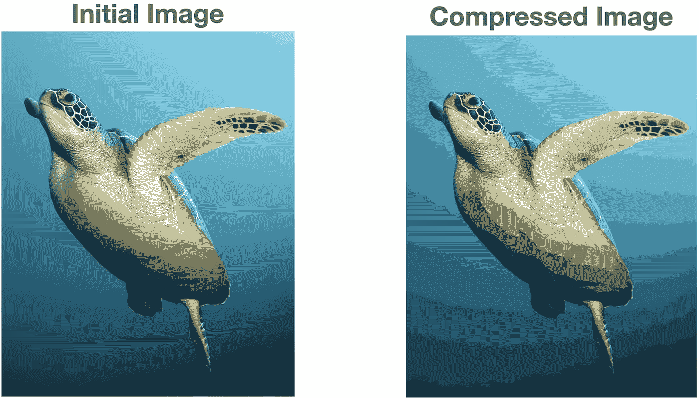
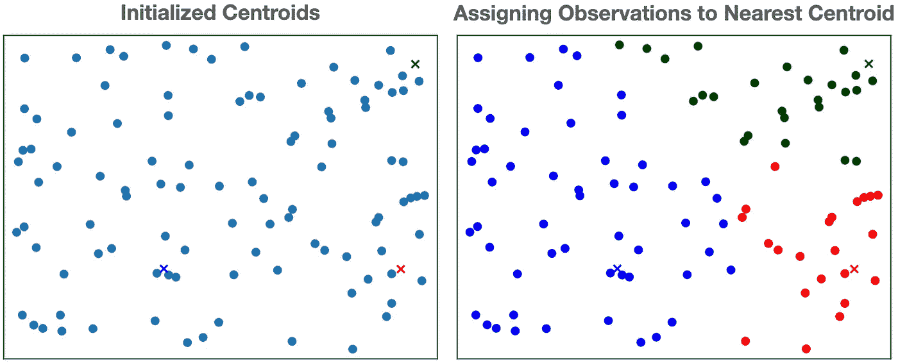
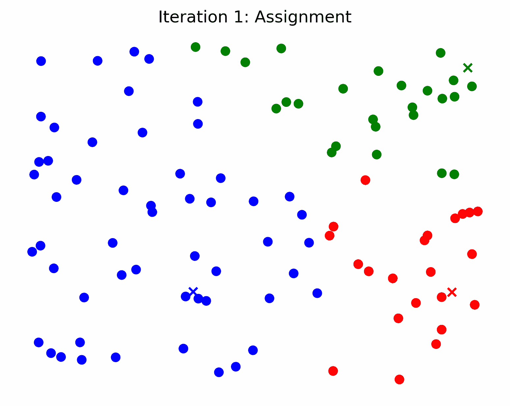
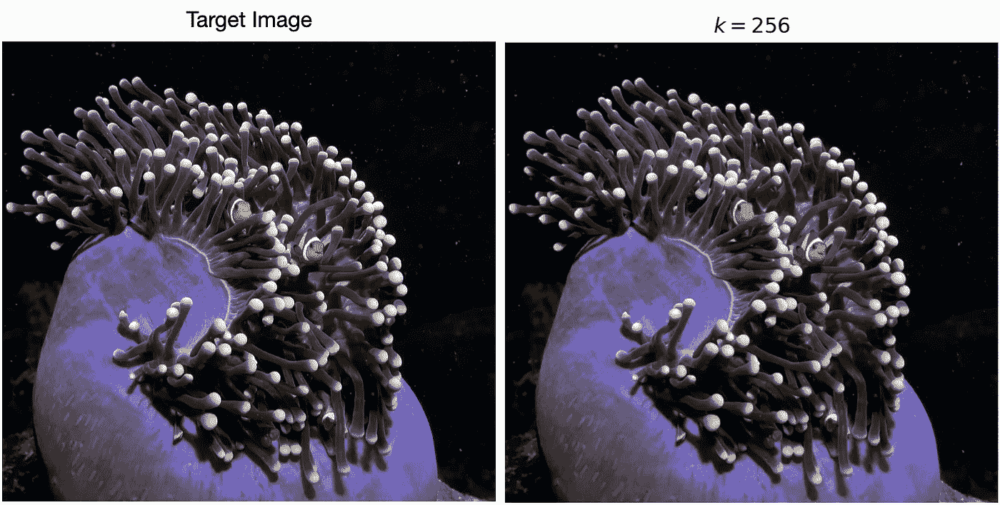

# K-Means 图像压缩的清晰、直观解释

> 原文：[`towardsdatascience.com/clear-and-visual-explanation-of-the-k-means-algorithm-applied-to-image-compression-b7fdc547e410?source=collection_archive---------8-----------------------#2023-01-16`](https://towardsdatascience.com/clear-and-visual-explanation-of-the-k-means-algorithm-applied-to-image-compression-b7fdc547e410?source=collection_archive---------8-----------------------#2023-01-16)

 [Sebastian Charmot](https://medium.com/@sebastian.charmot?source=post_page-----b7fdc547e410--------------------------------)

·

[关注](https://medium.com/m/signin?actionUrl=https%3A%2F%2Fmedium.com%2F_%2Fsubscribe%2Fuser%2F8d18b9c9ebb&operation=register&redirect=https%3A%2F%2Ftowardsdatascience.com%2Fclear-and-visual-explanation-of-the-k-means-algorithm-applied-to-image-compression-b7fdc547e410&user=Sebastian+Charmot&userId=8d18b9c9ebb&source=post_page-8d18b9c9ebb----b7fdc547e410---------------------post_header-----------) 发表在 [Towards Data Science](https://towardsdatascience.com/?source=post_page-----b7fdc547e410--------------------------------) ·11 分钟阅读·2023 年 1 月 16 日

--

K-Means 如何显著减少图像文件大小。

在本指南中，我从零开始描述并实现了 k-means 算法，并将其应用于图像压缩。我使用不同的可视化方法帮助读者深入理解 k-means 算法及其在图像压缩中的应用。我还在最后讨论了这种方法的各种优点和局限性。

除非另有说明，否则所有图片均由作者提供，可在[此处](https://www.sebastiancharmot.com/)查看。

使用 K-means 将左侧的原始图像压缩了 6 倍

K-means 算法如何迭代地创建压缩图像

# 什么是 K-Means 算法？

K-means 算法是一种*无监督*算法，它将数据集划分为*k*个不同的簇。它是无监督的，意味着数据点没有标签。换句话说，我们不知道数据集应该如何被聚类。我们只需提供数据集本身，使用 k-means 将其划分为*k*个簇。

## 大概念

K-means 旨在将数据集划分为 k 个簇，其中每个簇的成员共享特征，并且与其他簇不同。因此，K-means 的目标是将数据集*有意义*地划分为 k 个不同的簇。

## 应用

聚类分析通过抽象数据集的底层结构，将相似的数据分组在一起，从而提供有意义的见解。“聚类已经在心理学、生物学、医学、计算机视觉、通信和遥感等各种工程和科学领域得到了有效应用”[[1](https://www.researchgate.net/profile/M-Murty-3/publication/5600582_Genetic_K-Means_Algorithm/links/541aaa280cf25ebee988b52d/Genetic-K-Means-Algorithm.pdf)]。

# K-Means 算法如何工作

K-means 算法分为几个步骤：

1.  初始化一组簇心

1.  将观测值分配到簇中

1.  更新簇

第 2 步和第 3 步会重复执行，直到达到设定的迭代次数或直到收敛，即当簇心不再变化时。

让我们更深入地了解这些步骤。

## 1\. 初始化簇心集合

初始化簇心集合的第一步是选择我们想要使用多少个簇心，我们将其称为*k*。

一旦我们选择了簇的数量，我们从训练样本中随机选择*k*个样本，将簇心设置为所选*k*个样本的值。或者，我们可以在解空间中随机抽取*k*个不同的点来初始化簇心。

我们将*j*-th 簇心称为μⱼ，因为它代表分配给簇*j*的值的均值。这就是 k-means 名称的由来。在下图中，我们设置*k*=3，并在样本空间中随机抽取 3 个点（用绿色、蓝色和红色的‘x’表示）来初始化簇心。

在左侧，数据以散点图的形式展示。在右侧，我们添加了三个初始的簇心，用绿色、蓝色和红色的‘x’表示。

## 2\. 将观测值分配到簇中

现在我们有了我们的*k*质心，我们将每个观察值（数据点）分配给离它最近的质心。通常，我们使用欧几里得距离计算“接近度”。在下图中，我们展示了将观察值分配给上面 3 个质心的过程。

左侧显示了 3 个初始质心。右侧则显示了将观察值分配给最近的质心。

## 3\. 更新质心

一旦所有观察值都被分配到一个簇中，我们会将每个簇的质心移动到其分配观察值的均值。我们在下面展示了这一过程。

左侧是将观察值分配到簇中。右侧则是将簇的质心更新为分配的观察值的均值。注意质心如何移动。

## 重复直到收敛或进行一定次数的迭代

k-means 算法的每次迭代包括两个部分：步骤 2（将观察值分配给簇）和步骤 3（更新簇）。这个过程会重复进行，直到达到设定的迭代次数或收敛。当簇的质心不再变化时，就发生了收敛。这等同于说观察值的分配不再变化。

*k*均值算法将在有限次数的迭代内收敛[[2](https://stats.stackexchange.com/questions/188087/proof-of-convergence-of-k-means)]，但它容易受到局部极小值的影响[[3](https://cs229.stanford.edu/notes2022fall/main_notes.pdf)]。

在下例中，*k*均值算法在第 4 次迭代时收敛。这是因为在第 4 次迭代之后，簇的质心不再变化。

K-means 迭代直到收敛

# K-means 用于图像压缩

图像压缩的目标是减少图像的文件大小。我们可以使用 K-means 选择*k*种颜色来表示整个图像。这使我们可以仅用*k*种颜色来表示图像，而不是整个 RGB 空间。这一过程也称为*图像量化*。

## 为什么 K-means 对图像压缩有用

使用 k-means 进行图像压缩的目的是选择*k*种颜色来表示目标图像，从而使逼近误差最小。换句话说，我们将使用 k-means 找到表示目标图像的**最佳** *k*种颜色。

## K-means 如何提供压缩

图像中的颜色像素由其 RGB 值表示，每个值的范围从 0 到 255。由于每个颜色通道有 256=2⁸种设置，总共有 256 **⋅** 256 **⋅** 256 = 256³ = 2²⁴ ~ 1700 万种颜色。为了表示这些颜色中的每一种，计算机需要 log₂(2²⁴) = 24 位的存储空间。如果我们使用 K-means 选择 16 种颜色来表示整个图像，我们只需要 log₂(16) = 4 位。因此，通过使用*k*=16 的 K-means，我们可以将图像大小压缩 6 倍！

现在我们理解了理论，让我们深入一些代码和可视化。

随着迭代次数增加，质心和压缩图像的变化情况

## 读取图像并初始化质心

在图像压缩的背景下，质心是我们用来表示压缩图像的颜色。因此，我们的第一步是读取图像并从图像中选择 *k* 种随机颜色来初始化我们的质心。

在第 7 行，我们使用 numpy 读取图像。这会生成一个二维数组，其中每个元素是一个长度为 3 的列表，表示该像素的 RGB 值。记得将 `image_path` 修改为你自己的路径。

从第 9 行开始，我们定义函数以初始化我们的质心。我们从图像中选择一个随机像素，并将其对应的 RGB 值添加到 `centroids_init` 数组中。我们这样做 *k =* `num_clusters` 次。因此，`centroids_init` 是一个从图像中随机采样的 *k* 种颜色的数组。

## 分配和更新质心

为了迭代更新质心，我们重复分配观测值到簇质心的过程，并将质心更新为分配观测值的均值。

在图像压缩的背景下，这意味着将目标图像的每个像素分配给最近的质心颜色。

在第 11 到 17 行，我们创建了字典 `centroid_rgbs`。每个键对应质心的一个索引，值是一个包含所有分配给相应质心的颜色的 numpy 数组。

每个像素的质心分配在第 13 行完成，使用 `linalg.norm` 计算到每个质心的欧几里得距离，然后使用 `argmin` 找到最近质心的索引。

## 创建压缩图像

现在我们已经确定了最终的质心，可以创建压缩图像。我们只需遍历每个像素，并将其颜色更改为最近的质心。

## 综合所有内容

使用以下代码片段和上述函数定义，运行 k-means 进行图像压缩的所有步骤已经完成。

为生成 GIF，我在算法的各个阶段使用了 `plt.savefig`。我的 GitHub 仓库包含了该过程的代码，以及如何将这些帧转换为 GIF [[4](https://github.com/SebastianCharmot/kmeans_image_compression)]。

k=64 在一只墨鱼图像上的进展。

在上面的 GIF 中，我们可以看到质心（即我们选择用来表示图像的颜色）如何随着 k-means 算法的迭代而变化。

# K-Means 在图像压缩中的分析

现在，我们分析一些关于使用 k-means 进行图像压缩的细节。

## 异常值

通常，图像会包含相对于图像主要色彩调色板的异常颜色。例如，下面的目标图像包含两只亮橙色的小丑鱼。它们的颜色与黑暗的背景和海葵形成强烈对比，这引起了观众的注意（希望以美观的方式）。

我的原始图像在左侧。右侧的图像是使用 k-means 压缩的，*k*=16

下面的 GIF 展示了当我们对图像应用 k-means 时发生的情况，*k*=16。虽然小丑鱼的亮橙色被选为初始集群，但随着算法迭代，它最终被较暗的颜色“冲淡”。

K-means 在海葵的图像上进行迭代。注意亮橙色如何随着时间的推移而消失。

> 尽管压缩图像的总体质量随着迭代次数的增加而提高，但异常颜色的准确性会下降。

一些文献建议专门为异常值创建集群（使用距离度量计算）以提高整体聚类准确性 [[5](https://www2.math.uconn.edu/~gan/ggpaper/gan2017kmor.pdf)]。作者通过对合成数据和真实数据的数值实验来演示他们提出的算法的有效性和效率。我怀疑实现这个算法可能有助于使用 k-means 进行图像压缩，尤其是对于包含异常颜色的图像。

## 选择“*k*”

*k* 的选择决定了压缩量，并由用户设置。较高的*k*值将提供对目标图像的更忠实的表示，但代价是压缩率较低。在下面的图形中，我们展示了随着 *k* 值增加的压缩图像。*k*=16、*k*=32、*k*=64 和 *k*=128 的压缩因子分别为 **6**、**4.8**、**4** 和 **3.4**。

k=16、32、64 和 128 的压缩图像

在上面的例子中，我们可以看到选择一个大于 32 的*k*值对于缓解前面提到的异常值问题至关重要。由于 k 足够大，至少一个中心点能够分配给亮橙色。在下图中，我们绘制了 k=64 和 k=256 在 30 次迭代后的中心点颜色。

k=64 和 k=256 在 30 次迭代后的中心点

在 30 次迭代后，*k*=64 具有一个分配给橙色的中心点。对于 *k*=256，大约有 4 种橙色。

> 这个可视化还描绘了不同*k*值下的压缩量与细节保留之间的权衡。显然，对于较大的*k*值，我们有更多的颜色和细节保留，但我们需要更多的数据来表示这些颜色。

根据目标图像和使用案例，尝试不同的*k*值可能是值得的。

## 有损压缩

使用 k-means 算法压缩图像是一种*有损压缩*。有损压缩是一类数据压缩方法，它通过对目标图像进行近似和部分数据丢失来实现[[6](https://www.khanacademy.org/computing/computers-and-internet/xcae6f4a7ff015e7d:digital-information/xcae6f4a7ff015e7d:data-compression/a/lossy-compression)]。当我们使用 k-means 进行图像压缩时，我们是通过最近的中心点来近似每个像素的颜色。由于在这个过程中丢失了信息，我们无法将压缩后的图像恢复为原始图像。这就是为什么有损压缩也被称为*不可逆压缩*。

另一方面，无损数据压缩不会丢失信息。相反，它使用技术来用更少的数据表示原始信息[[7](https://ieeexplore.ieee.org/abstract/document/1594297)]。然而，无损数据压缩能够实现的压缩量远低于有损压缩。

尽管 k-means 是一种有损压缩形式，但对于某些*k*值，细节的丧失对人眼几乎是不可察觉的。

左侧为目标图像，右侧为使用 k=256 压缩后的图像

你能注意到上面两幅图像之间的许多差异吗？使用*k*=256，右侧的压缩图像只需要右侧完整图像的 1/3 的数据量！

## 中心点初始化中的随机性

在 k-means 算法的所有条件保持不变的情况下，由于中心点初始化过程中的随机性，每次运行的结果会略有不同。

注意 k=16 时 3 次独立运行的压缩图像中的细微变化

这意味着在相同参数下，压缩图像会输出略微不同的变体。然而，对于较大的 k 值，这种效果对人眼不那么明显。

k=1256 时 3 次独立运行的压缩图像差异几乎不可区分

# 优势与劣势

现在我们已经完成了对 k-means 算法在图像压缩方面的全面分析，我们将明确讨论其优缺点。

## 优势

+   效率：k-means 算法在计算上高效（线性时间复杂度），使其适用于实时图像压缩应用[[8](https://ieeexplore.ieee.org/document/8101601)]。这也意味着它可以处理大图像。

+   简单性：k-means 算法相对简单，易于理解。

+   对于某些类型的图像很有用：k-means 在具有明显颜色簇的图像上表现良好。

## 缺点

+   有损压缩算法：k-means 是一种有损压缩形式，它基于像素簇表示整个图像，因此会丢失一些颜色信息，可能无法保留图像中的细节。

+   对初始化的敏感性：k-means 算法的性能可能对质心的初始位置敏感，这可能导致次优或不一致的结果。对于较大的*k*值，这个问题会有所减轻。

+   不适用于某些类型的图像：k-means 算法在颜色渐变平滑的图像和噪声较高的图像上表现较差。

# 结论

总体来说，k-means 对于有明显颜色簇的图像来说是一个不错的有损图像压缩选择。然而，它可能不是所有类型图像的最佳选择，其他技术如向量量化或分形压缩可能会产生更好的结果。

用户在选择*k*的值时面临关键决策，并且必须牢记在“选择‘k’”部分讨论的“压缩量与细节权衡”。最佳的 k 值可能会根据用户的需求而有所不同。

希望不同的可视化能够帮助加深对 k-means 算法及其如何进行图像压缩的理解。

## 参考文献

[1] Krishna, K., 和 M. Narasimha Murty. “遗传 k-means 算法。” *IEEE 系统、男人与控制学报 B 部分（控制学）*，第 29 卷，第 3 期，1999 年，页码 433–439。 [`doi.org/10.1109/3477.764879`](https://doi.org/10.1109/3477.764879)

[2] [`stats.stackexchange.com/questions/188087/proof-of-convergence-of-k-means`](https://stats.stackexchange.com/questions/188087/proof-of-convergence-of-k-means)

[3] Ng, Andrew. “CS229 讲义。” [`cs229.stanford.edu/notes2022fall/main_notes.pdf`](https://cs229.stanford.edu/notes2022fall/main_notes.pdf)

[4] 我的 Github 代码库。 [`github.com/SebastianCharmot/kmeans_image_compression`](https://github.com/SebastianCharmot/kmeans_image_compression)

[5] Gan, Guojun, 和 Michael Kwok-Po Ng. “去除异常值的 k-means 聚类。” *模式识别快报*，第 90 卷，2017 年，页码 8–14。 [`doi.org/10.1016/j.patrec.2017.03.008`](https://doi.org/10.1016/j.patrec.2017.03.008)

[6] “有损压缩（文章）。” *可汗学院*，可汗学院， [`www.khanacademy.org/computing/computers-and-internet/xcae6f4a7ff015e7d:digital-information/xcae6f4a7ff015e7d:data-compression/a/lossy-compression`](https://www.khanacademy.org/computing/computers-and-internet/xcae6f4a7ff015e7d:digital-information/xcae6f4a7ff015e7d:data-compression/a/lossy-compression)

[7] Ming Yang 和 N. Bourbakis. “无损数字图像压缩技术概述。” *第 48 届中西部电路与系统研讨会，2005 年*，2005 年， [`doi.org/10.1109/mwscas.2005.1594297`](https://doi.org/10.1109/mwscas.2005.1594297)

[8] Chiou, Paul T., 等. “JPEG 图像压缩算法的复杂性分析。” *2017 年第九届计算机科学与电子工程会议 (CEEC)*, 2017, [`doi.org/10.1109/ceec.2017.8101601.`](https://doi.org/10.1109/ceec.2017.8101601.)
