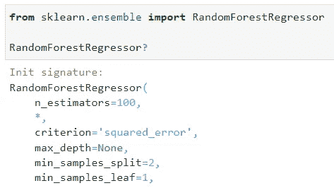

# 一劳永逸地澄清混乱：Python 中的 args、kwargs 和星号

> 原文：[`towardsdatascience.com/clearing-the-confusion-once-and-for-all-args-kwargs-and-asterisks-in-python-a905c36467a2`](https://towardsdatascience.com/clearing-the-confusion-once-and-for-all-args-kwargs-and-asterisks-in-python-a905c36467a2)

## 并幸福地生活在一起

[](https://ibexorigin.medium.com/?source=post_page-----a905c36467a2--------------------------------)[](https://towardsdatascience.com/?source=post_page-----a905c36467a2--------------------------------) [Bex T.](https://ibexorigin.medium.com/?source=post_page-----a905c36467a2--------------------------------)

·发表于[数据科学前沿](https://towardsdatascience.com/?source=post_page-----a905c36467a2--------------------------------) ·阅读时间 9 分钟·2023 年 5 月 30 日

--


图片由我用 Midjourney 制作

## 动机

我总是感到烦恼，当看到有人在函数中使用`*args`、`**kwargs`或将星号运算符用于乘法以外的任何其他目的时。我是说，他们能不能停下来片刻，用一些其他人都能理解的东西呢？

但在了解了它们的作用后，我意识到`*args`、`**kwargs`和前缀星号的使用源于对灵活性和优雅的渴望。尽管这可能让人感觉像是在[Python 之禅](https://peps.python.org/pep-0020/)上打了一巴掌，"可读性很重要"，但它们是美丽代码的强大工具。

因此，在这篇文章中，我打算澄清所有关于这些神秘关键词和星光表达的混乱，并向你展示几乎所有可以使用它们的场景。

让我们开始吧。

## 解包可迭代对象

当星号用于两个变量或 Python 对象之间时，通常是用于乘法或幂运算。但是，当用于*变量*或可迭代对象之前时，它就变成了完全不同的东西。

> 可迭代对象是一个你可以遍历的 Python 对象，比如字符串、元组、列表、字典、集合等。

通过在任何可迭代对象或持有可迭代对象的变量前面放置星号，你可以拆解（解包）所有的元素。

展示 A：

```py
breakable_list = list(range(25))

print(*breakable_list)
```

```py
0 1 2 3 4 5 6 7 8 9 10 11 12 13 14 15 16 17 18 19 20 21 22 23 24
```

注意，打印解包的可迭代对象与单独打印它是不一样的：

```py
print(breakable_list)
```

```py
[0, 1, 2, 3, 4, 5, 6, 7, 8, 9, 10, 11, 12, 13, 14, 15, 16, 17, 18, 19, 20, 21, 22, 23, 24]
```

区别在于，在第一次`print`调用中，我们将列表的所有元素作为*单独的参数*（实际上是 25 个）传递给`print`。在第二次调用中，我们将整个列表作为一个参数传递给`print`。

因此，场景零——使用可迭代解包将可迭代对象的所有元素作为*单独的参数*传递给某个函数。

展示 B 中的字符串：

```py
string = "Readability counts"

print(*string)
```

```py
R e a d a b i l i t y   c o u n t s
```

使用循环，它会是这样：

```py
for s in string:
    print(s, end=" ")
```

```py
R e a d a b i l i t y   c o u n t s
```

我们稍后会看到这个场景的更多变体。

## 字典解包

场景一——使用双星号`**`操作符解包字典（仅字典）。

这个场景也有许多变体。其中之一是将字典项作为关键字参数传递给函数。

例如，考虑以下包含与`pretty_print`函数参数完全相同键的`author`字典：

```py
author = {"name": "Bex", "n_followers": 17000, "happy": True}

def pretty_print(name, n_followers, happy):
    print(
        f"{name} has {n_followers} followers and "
        f"he is {'happy' if True else 'unhappy'}!"
    )
```

要将`author`的内容传递给`pretty_print`，我们需要写下这段难看的代码：

```py
pretty_print(
    name=author["name"],
    n_followers=author["n_followers"],
    happy=author["happy"],
)
```

```py
Bex has 17000 followers and he is happy!
```

但我们不必这样做；我们可以使用双星号来解包项：

```py
pretty_print(**author)
```

```py
Bex has 17000 followers and he is happy!
```

这两个场景足以理解`args`和`kwargs`。

让我们继续。

## 位置参数与关键字参数

在此之前最后一件事——让我们快速回顾一下 Python 函数中位置参数和关键字参数的区别，以避免以后出现混淆或误解。

区别的一个句子总结：位置参数偏爱**顺序**，而关键字参数偏爱**明确性**。

看一个有四个参数的函数来进一步了解区别：

```py
def total_price(
    price: float,
    quantity: int,
    discount=0,
    tax_rate=0,
):
    # The rest of the code
    ...
```

**位置参数**：

1.  不像`price`和`quantity`那样有默认值。

1.  不能省略。当调用函数时，你应该始终提供这些值。

1.  需要顺序。如果你想让代码有意义或避免错误，你不能交换两个位置参数。

1.  不关心名称。它们关心的是位置。

1.  保持函数定义简短明了。

1.  可能很难理解，尤其是在处理有很多参数的函数时。

另一方面，**关键字参数**：

1.  始终有一个默认值，这意味着你可以在调用函数时省略它们。

1.  不关心顺序。你可以随时选择任何一个，而不管它们在函数签名中定义的顺序。

1.  提供精确性和清晰度。它们让你可以明确指定哪个参数对应哪个实参。

1.  增强函数文档。它们作为功能的小标签来展示它们的作用。

查看[这个讨论](https://stackoverflow.com/questions/9450656/positional-argument-vs-keyword-argument)以获取更多细节。

## 不确定数量的位置参数

有一种常见的 Python 函数不知道需要多少个位置参数。例如，考虑这个计算三个数字几何平均数的函数：

```py
def geometric_average(a, b, c):
    product = a * b * c
    geometric_avg = product ** (1 / 3)

    return geometric_avg

geometric_average(5, 9, 8)
```

```py
7.113786608980125
```

如果你想将其推广到四个数字怎么办？或者五个？或者六个？你知道我在说什么…

我们希望函数能够计算任意数量数字的几何平均数。

所以，这里是星号操作符的第二种场景：定义接受**不确定数量**位置参数的函数。

```py
def geometric_average(*args):
    print("That works.")
```

通过将`*args`放入函数定义中，你进入了第二种场景，允许你传递任意多个值而不会引发错误：

```py
geometric_average(1, 2, 3, 4, 5, 6)
```

```py
That works.
```

但`*args`实际是什么意思？

在幕后，当我们将用逗号分隔的六个数字传递给`geometric_average`时，`*args`将它们收集成一个元组：

```py
def geometric_average(*args):
    # Print the type of args
    print(type(args))

geometric_average(2, 1)
```

```py
<class 'tuple'>
```

> 因此，在这种情况下，我们进行的是打包，而不是*解包*。

好的，既然`args`现在是一个普通的元组，我们可以迭代它的元素并完成函数的其余部分：

```py
def geometric_average(*args):
    product = 1
    # Iterate over args
    for num in args:
        product *= num
    geometric_avg = product ** (1 / len(args))

    return geometric_avg

geometric_average(2, 3, 5, 6, 1)
```

```py
2.825234500494767
```

使用关键字`args`只是一个约定。事实上，你可以将其更改为更易读的词，如`numbers`：

```py
def geometric_average(*numbers):
    product = 1
    for num in numbers:
        product *= num
    geometric_avg = product ** (1 / len(numbers))

    return geometric_avg
```

## 不确定数量的关键字参数

下一个（第三个）场景是当一个函数可以接受任意数量的关键字参数。你猜对了，这就是`**kwargs`的用武之地：

```py
def pickle_model(model_object, path, **kwargs):
    "A function to pickle an ML model"
    ...
```

`pickle_model`将机器学习模型以 pickle 格式保存到磁盘。它有两个必需的位置参数，一个是模型对象本身，另一个是保存路径。

用户可以选择传递关于模型的额外信息，如超参数值、版本号、模型作者等，作为关键字参数。

```py
pickle_model(
    xgb_regressor,
    "models/xgb_regressor.pkl",
    hyperparameters={"max_depth": 3, "eta": 1},
    author="bexgboost",
    version="v1.0.1",
)
```

并且不会有任何错误。

和`args`一样，`kwargs`是一个你可以更改为几乎任何其他名称的名称：

```py
def pickle_model(model_object, path, **metadata):
    "A function to pickle an ML model"
    print(type(metadata))

pickle_model(xgb_regressor, "models/xgb_reg.pkl", author="bexgboost")
```

```py
<class 'dict'>
```

但不同于`args`，`kwargs`是一个字典。这意味着你可以通过查找（这可能导致错误）或使用`.items()`迭代来访问它的内容：

```py
def pickle_model(model_object, path, **metadata):
    "A function to pickle an ML model."
    # Raises an error if author is not given, so use `get()`
    author = metadata["author"]

    # Iterate
    for key, value in metadata.items():
        ...
```

## 一切的顺序

在混合参数时，无论是在函数签名还是调用中，你必须遵循一些规则：

1.  位置参数总是优先。

```py
def func(arg1, arg2, *args, **kwargs):
    pass
```

1.  位置参数不能被跳过（已说过）。

1.  调用函数时可以完全跳过`*args`和`**kwargs`：

```py
func(1, 2)
```

在这种情况下，`args`将是一个空列表，`kwargs`将是一个空字典。

3\. 所有类型的参数可以是独立的，这意味着你不必混合使用函数的参数：

```py
# Only args itself
def func(*args):
    ...
```

4\. 在关键字参数后不能传递位置参数：

```py
#  Can't do this
def func(arg1, arg2, hello="it's me", arg3):
    pass
```

```py
 def func(arg1, arg2, hello="it's me", arg3):
                                              ^
SyntaxError: non-default argument follows default argument
```

5\. `*args`必须始终在位置参数之后和关键字参数之前。

6\. `**kwargs`应该始终是最后一个。

## 宏大的场景

尽管不算宏大，但这是在最新版本的 Python 中引入的一个方便技巧。考虑这个函数签名：

```py
def weird(arg, arg_again, *, default=1):
    pass
```

在一切的中间，我们看到一个独立的星号，没有附加任何东西。这是什么意思？

这种**独立星号**语法强制你始终*显式*使用关键字参数。例如，我们定义`weird`而没有星号，并调用它：

```py
def weird(arg, arg_again, default=1):
    pass

weird(1, 2, 3)
```

没有错误。对于`default`，我们传递了 3 但没有写`default=3`以使调用更简洁。

现在，让我们尝试带有星号的相同内容：

```py
def weird(arg, arg_again, *, default=1):
    pass

weird(1, 2, 3)
```

```py
TypeError: weird() takes 2 positional arguments but 3 were given
```

我们得到一个`TypeError`！它告诉我们传递了一个多余的位置参数。换句话说，我们必须使用以下语法：

```py
weird(1, 2, default=3)
```

现在，它又没有错误了。这种语法的引入是为了使函数调用更具可读性，特别是对于接受许多参数的函数和类。

Sklearn 在其最近的版本中广泛采用了这一特性。例如，这里是`RandomForestRegressor`的文档：



图片由我提供

过去，某些阅读文档的高手会这样写代码：

```py
rf = RandomForestRegressor(1000, 'squared_error', 3, 3, 2)
```

初学者读到它会感到困惑。但是添加了星号后，所有在`n_estimators`之后的关键字参数必须被明确指定：

```py
rf = RandomForestRegressor(
    1000,  # Before the asteisk
    criterion="poisson",  # After the asterisk
    max_depth=3,
    min_samples_split=3,
    min_samples_leaf=2,
)
```

## 各种解包技巧

星号解包可以用于许多方式，除了函数签名和调用。在本节中，我将列出其中一些，而不深入细节。

0\. 合并两个可迭代对象：

```py
a = [1, 2, 3]
b = [4, 5, 6]

x_dict = {"a": 1, "b": 0}
y_dict = {"c": 10, "d": 10}
```

```py
# Merge lists
[*a, *b]
```

```py
[1, 2, 3, 4, 5, 6]
```

```py
# Merge dictionaries
{**x_dict, **y_dict}
```

```py
{'a': 1, 'b': 0, 'c': 10, 'd': 10}
```

1.  扩展可迭代对象

```py
a = [1, 2, 3]
b = [*a, "c", "d", "n"]

b
```

```py
[1, 2, 3, 'c', 'd', 'n']
```

2\. 使用字典项格式化字符串

```py
employee_info = {"name": "John Doe", "age": 35, "position": "Manager"}

message = (
    "Employee Name: {name}\nAge: "
    "{age}\nPosition: {position}".format(**employee_info)
)

print(message)
```

```py
Employee Name: John Doe
Age: 35
Position: Manager
```

3\. 解包到变量中

```py
# Unpack all elements of a set one-by-one
a, b, c = {1, 2, 3}

# Unpack into varied length arguments
first, *remaining, last = [1, 2, 3, 4, 5]

print(first, remaining, last)
```

```py
1 [2, 3, 4] 5
```

4\. 丢弃值

```py
first, second, *_ = [1, 2, 3, 4, 5]

print(first, second)
```

```py
1 2
```

5\. 解包嵌套列表

```py
nested_list = [1, [2, 3], 4]

a, (b, c), d = nested_list

print(b, c)
```

```py
2 3
```

6\. 转置列表的列表（矩阵）

```py
def transpose(list_of_lists):
    return [list(row) for row in zip(*list_of_lists)]

my_list = [[1, 4, 7], [2, 5, 8], [3, 6, 9]]
print(my_list)
```

```py
[[1, 4, 7], [2, 5, 8], [3, 6, 9]]
```

```py
transpose(my_list)
```

```py
[[1, 2, 3], [4, 5, 6], [7, 8, 9]]
```

我希望你暂停思考为什么这些例子都能正常工作，尤其是那些甚至没有涉及星号运算符的第五个例子。

你自己知道其他技巧吗？不要害羞——在评论中分享一下吧。

## 结论

Python 的怪癖无穷无尽，星号的使用加上`args`和`kwargs`无疑就是一个例子。

关键是接受这种怪癖，克服最初的不适，因为它们可以成为使你的代码更优雅、可读的绝佳工具，当然，也有点奇怪。

感谢阅读！

喜欢这篇文章，并且，面对现实，它的奇特写作风格？想象一下如果你能访问到更多类似的文章，全部由一位才华横溢、迷人、机智的作者（顺便说一下，就是我 :)）所写。

仅需 4.99 美元会员，你将不仅能访问我的故事，还能获得来自 Medium 上最优秀思想的知识宝库。如果你使用 [我的推荐链接](https://ibexorigin.medium.com/membership)，你将获得我的超级感谢和一个虚拟的高五，感谢你支持我的工作。

[## 通过我的推荐链接加入 Medium - Bex T.](https://ibexorigin.medium.com/membership?source=post_page-----a905c36467a2--------------------------------)

### 获得对我所有⚡高级⚡内容以及 Medium 上所有内容的独家访问权。通过购买我一杯咖啡来支持我的工作…

[ibexorigin.medium.com](https://ibexorigin.medium.com/membership?source=post_page-----a905c36467a2--------------------------------) 

图片由我使用 Midjourney 制作

参考文献：

[1] RealPython, [Python args and kwargs: Demystified](https://realpython.com/python-kwargs-and-args/)，2019，realpython.com

[2] Trey Hunner, [Asterisks in Python: what they are and how to use them](https://treyhunner.com/2018/10/asterisks-in-python-what-they-are-and-how-to-use-them/)，2018，treyhunner.com
