# CLIP — 直观且详尽的解释

> 原文：[`towardsdatascience.com/clip-intuitively-and-exhaustively-explained-1d02c07dbf40`](https://towardsdatascience.com/clip-intuitively-and-exhaustively-explained-1d02c07dbf40)

## 为一般机器学习任务创建强大的图像和语言表示。

[](https://medium.com/@danielwarfield1?source=post_page-----1d02c07dbf40--------------------------------)[](https://towardsdatascience.com/?source=post_page-----1d02c07dbf40--------------------------------) [Daniel Warfield](https://medium.com/@danielwarfield1?source=post_page-----1d02c07dbf40--------------------------------)

·发表于 [Towards Data Science](https://towardsdatascience.com/?source=post_page-----1d02c07dbf40--------------------------------) ·阅读时间 17 分钟·2023 年 10 月 20 日

--


由 Daniel Warfield 使用 MidJourney 制作的“对比模式”。除非另有说明，所有图片均由作者提供。

在这篇文章中，你将学习到“对比语言-图像预训练”（CLIP），一种创建视觉和语言表示的策略，使得这些表示足够好，可以用于创建高度特定且性能优越的分类器，而无需任何训练数据。我们将探讨理论，了解 CLIP 与更传统方法的不同，然后逐步讲解其架构。

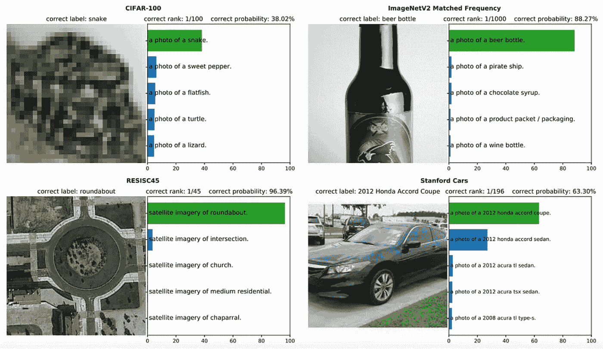

CLIP 为分类任务预测高度特定的标签，这些任务从未直接进行过训练。[来源](https://arxiv.org/pdf/2103.00020.pdf)

**谁会觉得这篇文章有用？** 任何对计算机视觉、自然语言处理（NLP）或多模态建模感兴趣的人。

**这篇文章有多高级？** 这篇文章对初学数据科学的读者应该是容易理解的。后面的一些部分稍微复杂一点（特别是当我们深入探讨损失函数时）。

**前提条件：** 对计算机视觉和自然语言处理有一些基础了解。

# 典型的图像分类器

在训练一个模型以检测一张图片是猫还是狗时，常见的方法是向模型展示猫和狗的图片，然后根据模型的错误逐步调整，直到模型学会区分这两者。

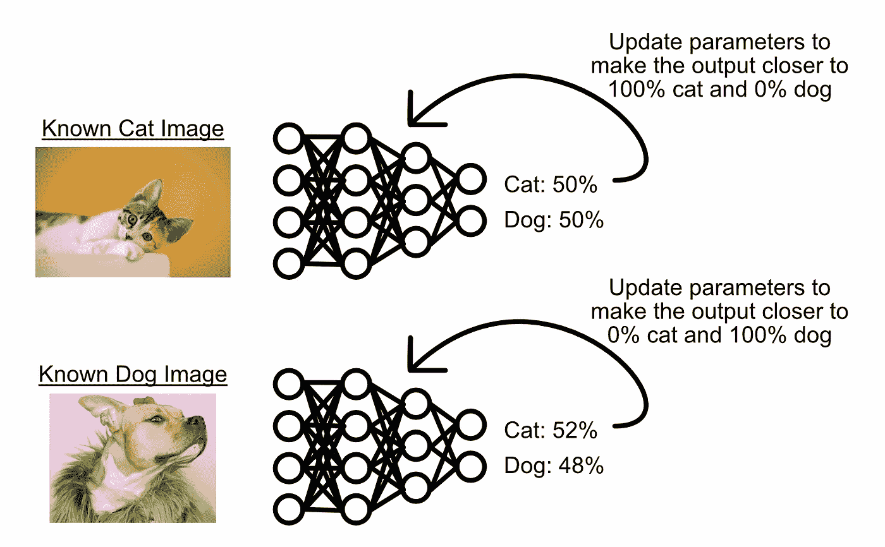

监督学习可能是什么样子的概念图。假设我们有一个对图像一无所知的新模型。我们可以将一张图像输入给它，让它预测图像的类别，然后根据预测的错误程度来更新模型的参数。我们可以重复这个过程多次，直到模型开始在任务上表现良好。我在[这篇文章](https://medium.com/towards-data-science/what-are-gradients-and-why-do-they-explode-add23264d24b)中探讨了反向传播，这是使这种情况一般可能的机制。

这种传统的监督学习形式在许多使用场景中完全可以接受，并且在各种任务中表现良好。然而，这种策略也会导致高度专业化的模型，这些模型只在其初始训练的范围内表现良好。

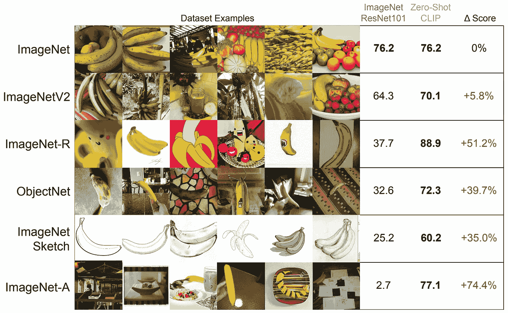

将 CLIP 与更传统的监督模型进行比较。每个模型都在 ImageNet（一个流行的图像分类数据集）上进行训练并表现良好，但当暴露于包含相同类别但不同表示形式的类似数据集时，监督模型的性能会显著下降，而 CLIP 则不会。这表明 CLIP 中的表示比其他方法更具鲁棒性和可泛化性。[来源](https://arxiv.org/pdf/2103.00020.pdf)

为了解决过度专业化的问题，CLIP 以一种根本不同的方式处理分类；通过尝试通过对比学习来学习图像及其注释之间的关联。我们将在下一部分探讨这意味着什么。

# CLIP，简而言之

如果我们不是创建一个可以预测图像是否属于某个类别的模型，而是创建一个预测图像是否属于某个任意说明的模型呢？这是一个微妙的思维转变，它为完全新的训练策略和模型应用打开了大门。

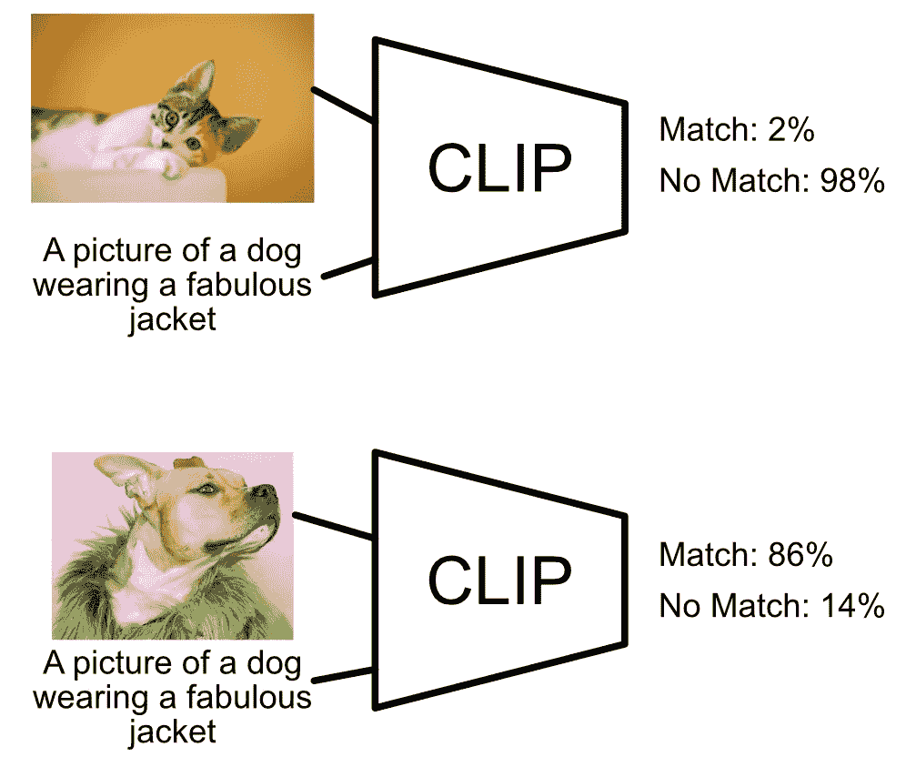

CLIP 的最终结果是一个可以预测任意文本是否与任意图像匹配的模型

CLIP 的核心思想是利用从互联网上抓取的带有说明文字的图像来创建一个模型，该模型可以预测文本是否与图像兼容。

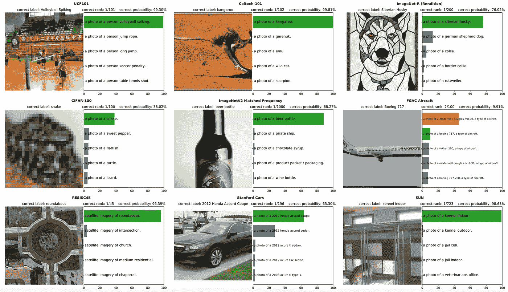

CLIP 应用于它之前未见过的各种数据集的示例。虽然并不完全完美（它预测了错误类型的飞机），但 CLIP 表现出一种令人瞩目的能力，能够理解各种不同的分类问题。[来源](https://arxiv.org/pdf/2103.00020.pdf)

CLIP 通过学习如何对图像和文本进行编码，使得当比较文本和图像的编码时，匹配的图像具有高值而不匹配的图像具有低值。**本质上，该模型学习将图像和文本映射到一个空间，使得匹配的对接近在一起，而不匹配的对则远离。** 这种学习预测事物是否属于同一组的策略通常被称为“对比学习”。

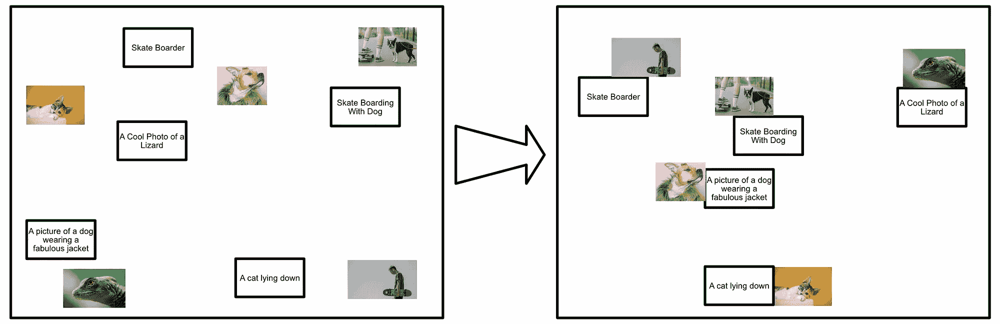

从 CLIP 的角度来看，对比学习的概念图。本质上，我们将每个图像和每个标题放置在某个任意空间中。然后我们学习将这些图像和标题放置在该空间中，使得匹配的对接近在一起，而不匹配的对则远离。

在 CLIP 中，通过学习一个文本编码器和一个图像编码器来进行对比学习，这两个编码器学习将输入放置在向量空间中的某个位置。CLIP 然后在训练过程中比较这些位置，并尝试最大化正对的接近度，同时最小化负对的接近度。

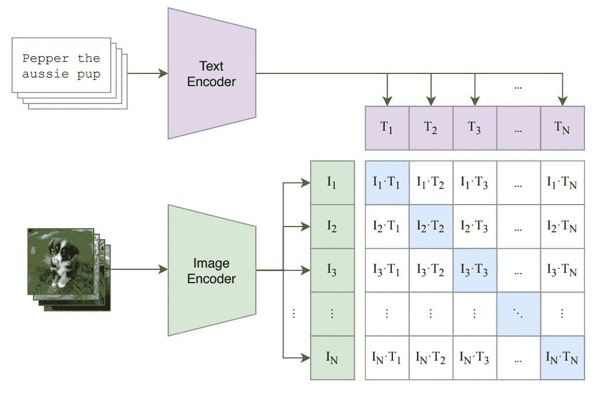

CLIP 的示意图。我们将一堆图像及其相应的描述进行编码，使得匹配值较大，不匹配值较小。在上面的示意图中，蓝色高亮区域对应正匹配对，而矩阵的其余部分对应需要最小化的负匹配对。 [来源](https://arxiv.org/pdf/2103.00020.pdf)

CLIP 采用的总体策略允许我们做各种事情：

+   我们可以通过只询问模型哪些文本，如“猫的照片”和“狗的照片”，最有可能与图像相关，来构建图像分类器。

+   我们可以构建一个图像搜索系统，用于找到与输入文本最相关的图像。例如，我们可以查看各种图像，并找到最可能与文本“狗的照片”对应的图像。

+   我们可以单独使用图像编码器来提取与文本相关的图像的抽象信息。编码器可以根据图像的内容将图像定位在空间中，这些信息可以被其他机器学习模型使用。

+   我们可以单独使用文本编码器来提取与图像相关的文本的抽象信息。编码器可以根据文本的整体内容将文本定位在空间中，这些信息可以被其他机器学习模型使用。

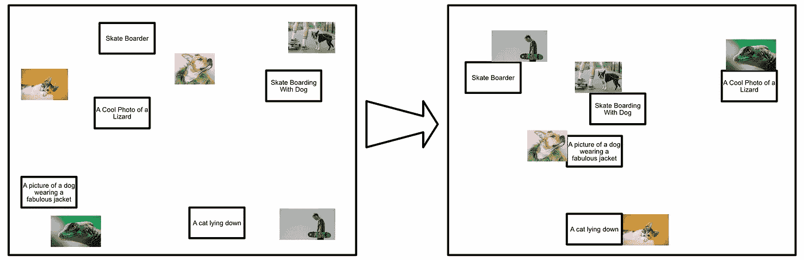

回想一下，我们在学习如何将图像和文本定位到相似的东西靠近在一起。通过这个过程，我们找到了一种将文本和图像放置在有意义位置的方法。为了有效地做到这一点，我们必须构建对图像和文本有强大理解的编码器。我们需要能够理解图像中的“猫性”，或者理解“fabulous”这个词在修饰“jacket”这个词。因此，CLIP 中使用的编码器可以单独使用以从特定输入中提取意义。

虽然零样本分类相当酷（零样本指的是能够在未见过的数据类型上表现良好。例如，询问模型“这个人快乐吗”而模型从未被明确训练去检测快乐），提取和使用 CLIP 中的文本或图像编码器变得更加流行。由于 CLIP 模型被训练来创建文本和图像的微妙而强大的编码，这些编码可以表示复杂的关系，因此 CLIP 编码器生成的高质量嵌入可以被用于其他任务；例如，我有一篇文章使用 CLIP 的图像编码器来使语言模型理解图像：

[](/visual-question-answering-with-frozen-large-language-models-353d42791054?source=post_page-----1d02c07dbf40--------------------------------) ## 使用冻结的大型语言模型进行视觉问答

### 与 LLMs 谈论图像，而不对 LLMs 进行图像训练。

towardsdatascience.com

所以，现在我们对 CLIP 有了一个高层次的理解。如果你还没完全明白也没关系；在下一节中，我们将逐个组件拆解 CLIP，以建立对其功能的直观理解。

# CLIP 的组件

CLIP 是一个高层次的架构，可以使用各种不同的子组件来实现相同的一般结果。我们将遵循[CLIP 论文](https://arxiv.org/pdf/2103.00020.pdf)，并拆解其中一种可能的方法。

## 文本编码器

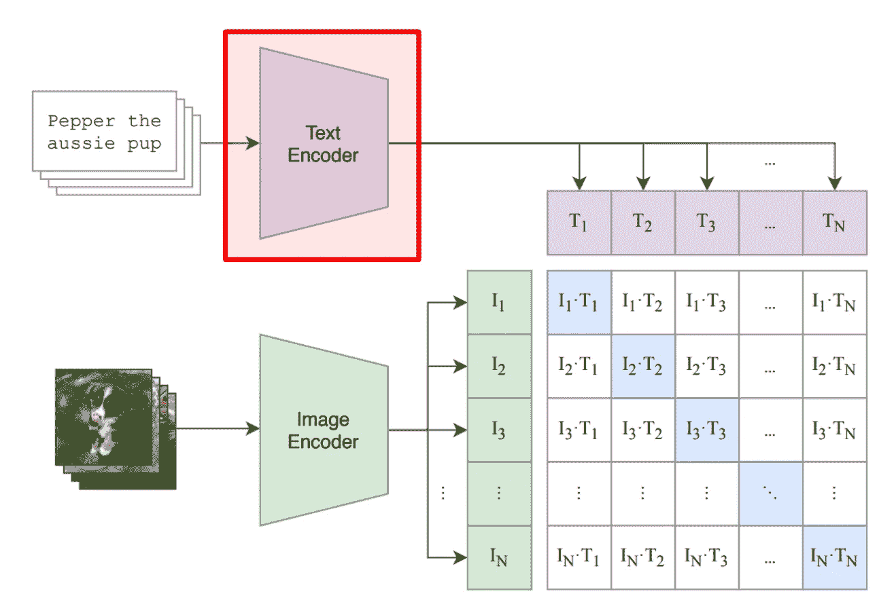

CLIP 中的文本编码器，[source](https://arxiv.org/pdf/2103.00020.pdf)

在最高层次上，文本编码器将输入文本转换为一个表示文本含义的向量（一个数字列表）。

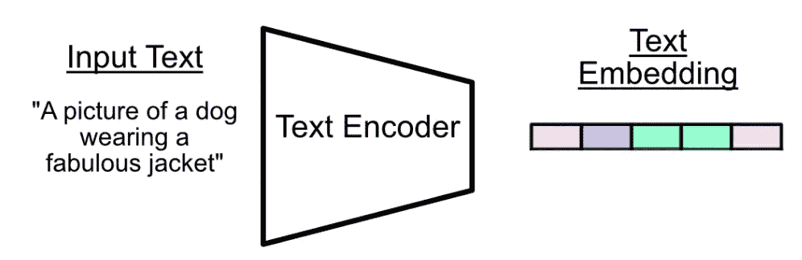

文本编码器的目的，本质上

CLIP 中的文本编码器是标准的变压器编码器，我在[另一篇文章](https://medium.com/towards-data-science/transformers-intuitively-and-exhaustively-explained-58a5c5df8dbb)中直观而详尽地介绍了它。为了本文的目的，变压器可以被认为是一个系统，它接收整个输入序列的词，然后重新表示和比较这些词，以创建整个输入的抽象化、情境化表示。变压器中的自注意机制是创建这种情境化表示的主要机制。


多头自注意力，变压器中的主要操作，将输入序列的词转换为抽象表示。最终结果可以被概念化为包含“情境化意义”，而不是一个词列表。如果你不知道什么是词向量嵌入，我在[这篇文章](https://medium.com/towards-data-science/transformers-intuitively-and-exhaustively-explained-58a5c5df8dbb)中进行了介绍。

CLIP 对通用变压器策略的一项修改是，它生成的是向量而不是矩阵，旨在表示整个输入序列。它通过简单地提取输入序列中最后一个标记的向量来实现。这是有效的，因为自注意机制旨在将每个输入与其他输入进行情境化。因此，经过多层自注意力机制后，变压器可以学习将所有必要的意义编码到一个单一的向量中。

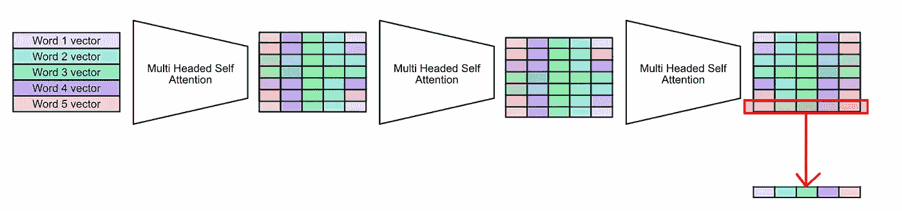

CLIP 文本编码器的概念图；多个多头自注意力层将输出操控为最终的向量，该向量表示整个输入。这个最终向量被用来将文本输入表示为空间中的一个点，这个点最终用于计算字幕与图像之间的“接近度”。

随时参阅我关于变压器的文章，以获得更深入的信息。在下一节中，我们将讨论图像编码器，它将图像转换为代表性向量。

[](/transformers-intuitively-and-exhaustively-explained-58a5c5df8dbb?source=post_page-----1d02c07dbf40--------------------------------) ## 变压器 — 直观而详尽的解释

### 探索现代机器学习的潮流：一步步拆解变压器

towardsdatascience.com

## 图像编码器

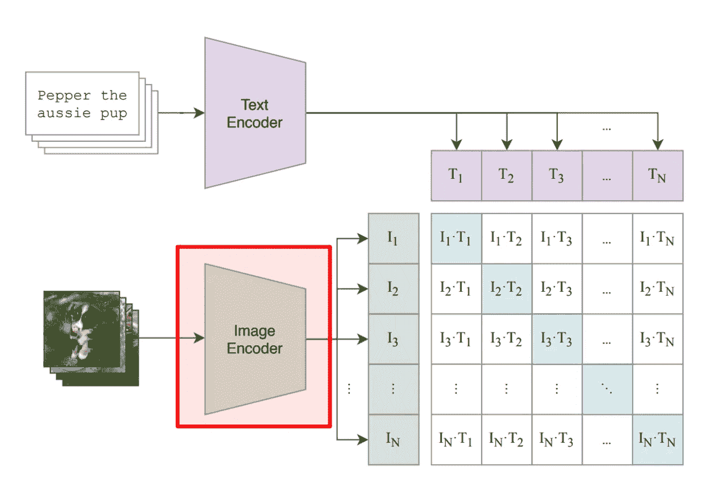

CLIP 中的图像编码器，[source](https://arxiv.org/pdf/2103.00020.pdf)

在最高层次上，图像编码器将图像转换为代表图像含义的向量（数字列表）。

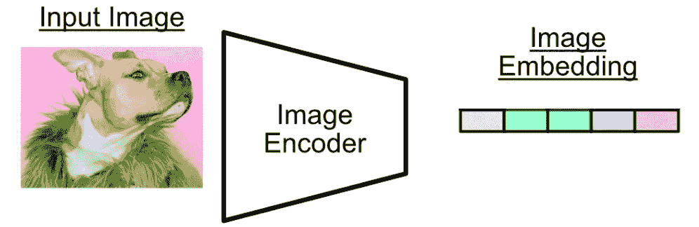

图像编码器的目的，基本上

CLIP 论文中讨论了几种图像编码器的方法。在这篇文章中，我们将考虑 ResNET-50，这是一种经过时间考验的卷积方法，已应用于多个通用图像任务。我将在未来的文章中详细介绍 ResNET，但在本文中，我们可以将 ResNET 视为经典的卷积神经网络。

卷积神经网络是一种图像建模策略，通过一个称为卷积核的小矩阵对图像进行滤波。它将卷积核在图像中滑动，并根据卷积核和输入图像计算每个像素的新值。

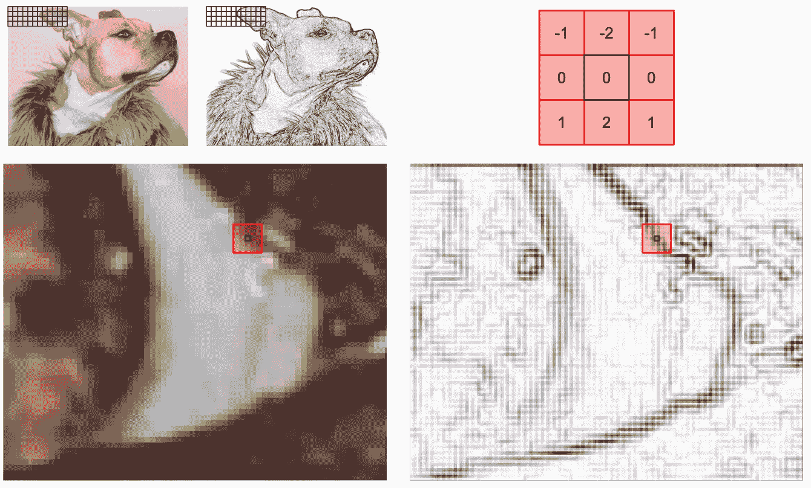

通过卷积核转换图像的概念图。卷积核被放置在图像的某个位置，并将周围的像素乘以某个值。然后，它将这些乘积值相加，以计算图像在该位置的新值。每个卷积核的值是可学习的，卷积网络使用许多卷积核。最终结果是一个网络，通过多种不同方式重新表示输入图像，以从中提取意义。

卷积网络的整个想法是，通过对图像进行卷积和下采样的组合，你可以提取越来越微妙的特征表示。一旦图像被压缩成少量高质量的抽象特征，就可以使用密集网络将这些特征转换为最终输出。我在[另一篇文章](https://medium.com/towards-data-science/self-supervised-learning-using-projection-heads-b77af3911d33)中深入讨论了这个问题，特别是最后的密集网络的角色，即投影头。

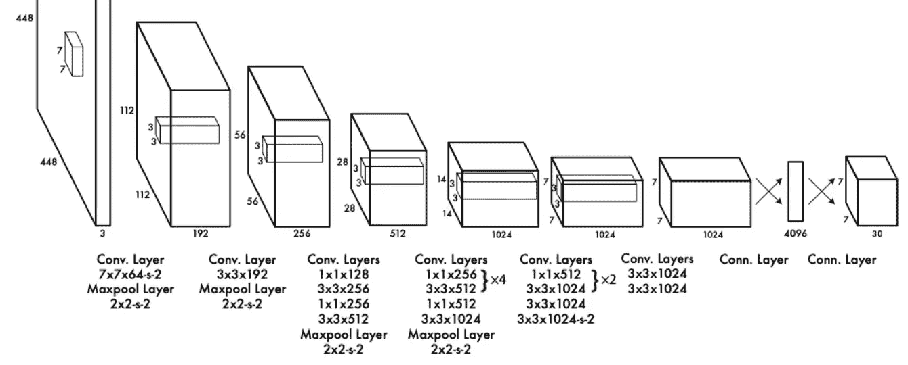

YOLO 论文中的经典卷积架构，一个具有里程碑意义的目标检测模型。这些框描述了输入图像的水平和垂直尺寸，以及它们的“深度”，以特征数量来衡量。输入图像是 RGB 图像，因此它的深度为 3。下一个框的“深度”为 192，这对应于有 192 个卷积核从输入图像中提取不同的信息。通过提取越来越多的特征，并通过最大池化对图像进行下采样，网络将图像提炼成一个抽象表示，并训练其对图像的某些含义。[Source](https://arxiv.org/pdf/1506.02640.pdf)

从 CLIP 的角度来看，最终结果是一个向量，可以被视为输入图像的摘要。这个向量以及文本的摘要向量将用于下一部分，以构建多模态嵌入空间，我们将在下一部分中讨论。

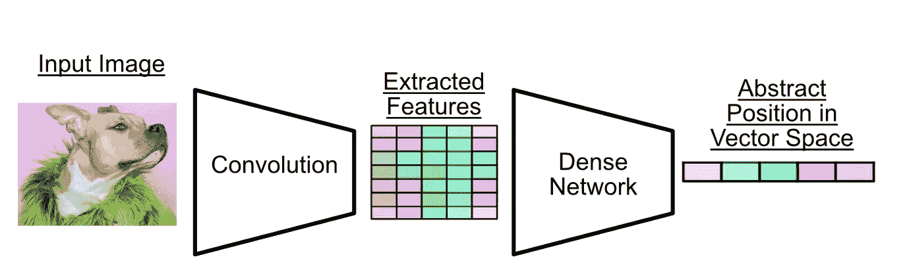

CLIP 中使用的图像编码器简要说明。图像编码器通过卷积网络将图像转换为一组抽象特征，然后使用密集的全连接神经网络生成最终输出。在这种情况下，最终输出向量可以被认为是对整个输入的总结。

## 多模态嵌入空间与 CLIP 训练

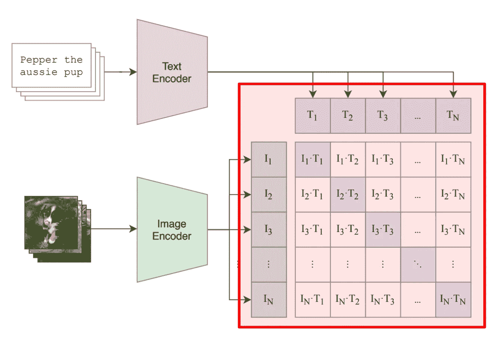

CLIP 训练过程中的一个组件，它将文本和图像的嵌入进行联合对齐，[来源](https://arxiv.org/pdf/2103.00020.pdf)

在前两节中，我们讨论了可以将文本和图像总结为向量的建模策略。在这一节中，我们将讨论 CLIP 如何利用这些向量构建强大的图像和语言表示。

将复杂事物总结为抽象向量的想法通常被称为“嵌入”。我们将图像和文本等事物“嵌入”到向量中，以总结它们的一般意义。


图像和文本编码器将每个输入“嵌入”。注意：这些嵌入的长度通常非常长，可能长达 256 个元素。

我们可以将这些嵌入向量视为高维空间中某一点的表示。为了演示的目的，我们可以想象创建将输入嵌入到长度为二的向量的编码器。这些向量可以被视为二维空间中的点，我们可以绘制它们的位置。

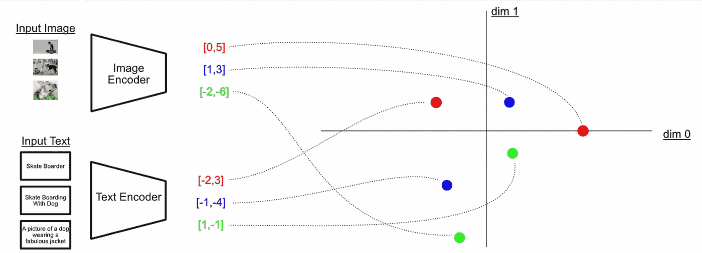

CLIP 训练前的示例，使用二维嵌入进行演示。每张图像都通过图像编码器生成一个长度为 2 的向量，每个输入文本都通过文本编码器生成一个长度为 2 的向量。

我们可以将这个空间视为**多模态嵌入空间**，我们可以训练 CLIP（通过训练图像和文本编码器）使这些点的位置安排得使得正样本对彼此接近。

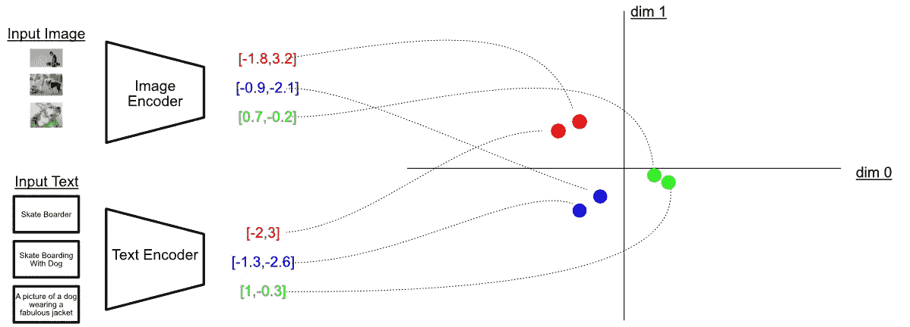

CLIP 训练后的示例，使用二维嵌入进行演示。注意，一旦编码器经过训练，正样本对最终会接近在一起。

在机器学习中定义“接近”的方式有很多种。可以说最常见的方法是余弦相似度，这是 CLIP 使用的方法。余弦相似度的思想是，如果两个向量之间的角度很小，我们可以说它们是相似的。

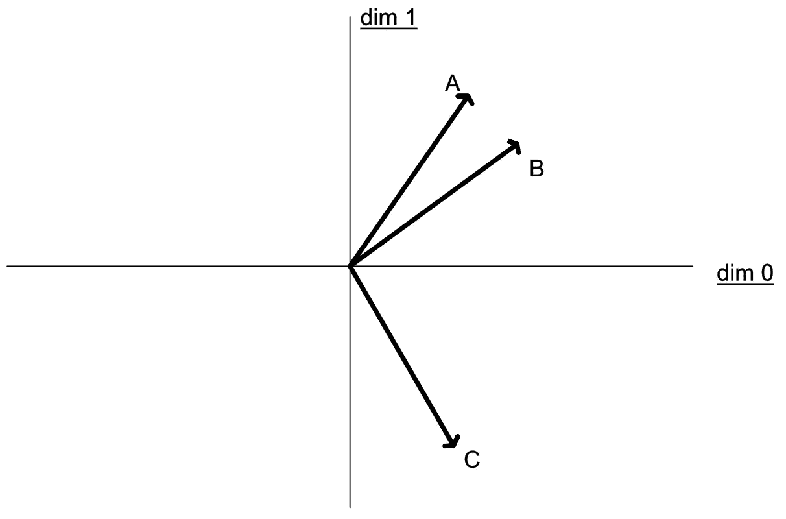

如果基于余弦相似度计算相似性，则 A 和 B 之间的角度较小，因此 A 和 B 是相似的。C 将被认为与 A 和 B 都非常不同。

“余弦”这个术语来源于余弦函数，它是一种三角函数，根据某个角度计算直角三角形中邻边与斜边的比值。如果这听起来像是胡言乱语，也没关系：如果两个向量之间的角度很小，则它们之间的余弦值接近 1。如果向量之间的角度为 90 度，余弦值为零。如果向量指向相反的方向，余弦值为-1。结果是，当向量朝同一方向时，你会得到大的数值，而当它们不朝同一方向时，你会得到小的数值。

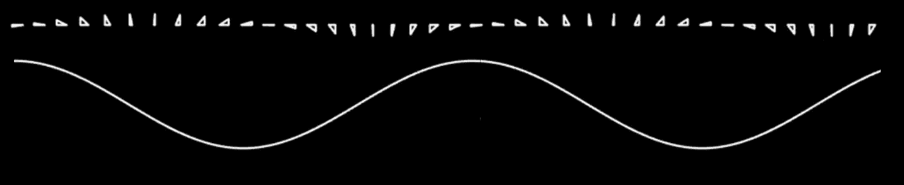

这是一个关于余弦波（底部的波形）如何与直角三角形中的角度相关的概念图。对本文而言，完全理解余弦函数并不是非常重要，只需了解当两个事物之间的角度为 0 时，余弦值最大，而当两个事物朝相反方向时，余弦值最小。如果你对学习更多关于三角学和波动的内容感兴趣，可以参考我写的[这篇文章](https://medium.com/towards-data-science/use-frequency-more-frequently-14715714de38)，讲述了频率分析如何与机器学习相关。

两个向量之间的夹角的余弦值可以通过测量它们之间的角度，然后将该角度通过余弦函数计算来得到。不过，打印出所有向量并使用量角器测量它们之间的角度可能会拖慢我们的训练时间。幸运的是，我们可以使用以下恒等式来计算两个向量之间夹角的余弦值：

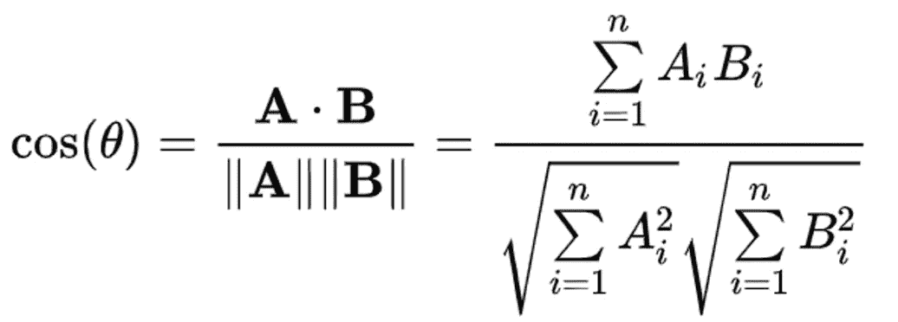

来源

如果你已经觉得数学很复杂，你现在可能会觉得更复杂。但是我会将其拆解：

+   短语**A•B**表示向量 A 和 B 之间的点积。点积是指将 A 中的每个元素与 B 中对应的元素相乘，然后将所有结果相加。所以如果 A=[1,2,3]，B=[2,3,4]，则 A•B = (1x2) + (2x3) + (3x4)。

+   短语“||(某个向量)||”，如**||A||**或**||B||**，表示向量的范数计算。这只是向量的大小或长度。向量的长度可以通过计算向量中各个分量的平方和的平方根来得到。所以，对于 A=[1,2,3]，||A|| = sqrt(1² + 2² + 3²)。

+   从概念上讲，可以将分子**A•B**视为相似性，而分母**||A||||B||**将相似性除以向量的长度。这种除法使得余弦相似性仅根据向量之间的角度变化，而不依赖于它们的大小。如果没有分母进行调整，**A•B** 的值会随着 A 和 B 的长度增加而增大，而不管它们的方向。

如果我们回顾原始图示，可能会注意到我们正在计算图像和文本的嵌入之间的点积。


CLIP 中图像和文本表示之间距离的计算。注意点积，即余弦相似度的分子，是如何在文本和图像的每个嵌入之间计算的。[来源](https://arxiv.org/pdf/2103.00020.pdf)。

由于损失的计算方式，所有图像和文本向量的长度都将为 1，因此我们可以省略除以向量大小的步骤。因此，虽然我们没有除以分母，但这仍然是通过余弦相似度进行概念上的训练（我们将在下一部分详细讨论）。

现在我们对如何将图像和文本转换为嵌入向量以及如何使用这些嵌入向量来计算相似度有了一定了解，我们可以更深入地探讨训练实际情况，了解 CLIP 如何使用对比损失。

# CLIP 和对比损失

对比损失的整体思想是，不是单独查看每个示例以尝试在每对样本上提升性能，而是将问题视为逐步提高正样本对的相似度，同时保持负样本对的距离。

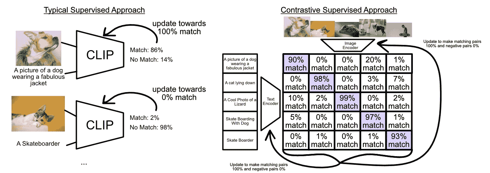

左侧是传统的监督方法，右侧是对比方法。监督方法处理单个输入-输出对（通常以小批量的形式出现，但仍然是一对一的分组），而对比方法将所有可能的对配对在一起，并尝试提高正样本对的接近性（用蓝色突出显示），同时减少负样本对的接近性。

在 CLIP 中，这是通过计算编码文本和图像表示之间的点积来完成的，正如我们之前讨论的，这可以用来量化“接近性”。

这种转变的思维方式使得对比学习真正赋予 CLIP 强大的能力。图像的描述可以有很多种方式；一张图片可以被描述为“猫躺下了”、“猫咪放松中”、“小可爱乔治在打盹”等等。虽然很难预测图像的实际描述，但通过使用“接近性”和“远离性”，CLIP 能够优雅地处理这个问题。

CLIP 在每个批次中使用 32,768 对图像-文本，这比传统方法的批次大小（通常为 16–64）要大得多。因此，CLIP 必须非常擅长将正样本对从大量负样本对中分离开来，这也是 CLIP 如此强大的原因。

为了训练神经网络，你需要一个性能的单一值，称为“损失”，你可以用它来更新模型。在每次训练步骤中，你更新模型的参数，使得模型在该步骤输出一个更小的损失值。CLIP 论文中包括了以下伪代码，描述了 CLIP 中损失的计算方式：

```py
# image_encoder - ResNet or Vision Transformer
# text_encoder - CBOW or Text Transformer
# I[n, h, w, c] - minibatch of aligned images
# T[n, l] - minibatch of aligned texts
# W_i[d_i, d_e] - learned proj of image to embed
# W_t[d_t, d_e] - learned proj of text to embed
# t - temperature parameter

# 1) get a batch of aligned images and text
I, T = get_mini_batch()

# 2) extract feature representations of each modality
I_f = image_encoder(I) #[n, d_i]
T_f = text_encoder(T) #[n, d_t]

# 3) joint multimodal embedding [n, d_e]
I_e = l2_normalize(np.dot(I_f, W_i), axis=1)
T_e = l2_normalize(np.dot(T_f, W_t), axis=1)

# 4) scaled pairwise cosine similarities [n, n]
logits = np.dot(I_e, T_e.T) * np.exp(t)

# 5) symmetric loss function
labels = np.arange(n)
loss_i = cross_entropy_loss(logits, labels, axis=0)
loss_t = cross_entropy_loss(logits, labels, axis=1)
loss = (loss_i + loss_t)/2
```

将这一点分解成组件：

1.  首先，我们获取一批维度为 `[batch size, image height, image width, number of colors]` 的图像和一批维度为 `[batch size, sequence length]` 的文本。这些批次彼此对齐，使得图像批次中的每个图像与文本批次中的每一段文本对应。

1.  我们将这些通过我们的编码器，这样每个图像和每段文本在各自的批次中就会生成一个向量。

1.  为了将图像和文本放置在相同的嵌入空间中，这些向量通过线性投影。这可以被视为一个没有偏差或激活函数的单层全连接网络。CLIP 论文提到，这些细节并不是特别重要，重要的是图像和文本向量的长度最终相同。这些向量使用 l2 归一化进行归一化，这使得向量保持指向相同的方向，但将所有向量压缩为长度为一。

1.  由于所有嵌入向量的长度为 1，因此不需要通过其大小来计算余弦相似度。因此，嵌入向量之间的点积等同于余弦相似度。余弦相似度乘以一个温度参数，该参数控制相似度在给定训练周期中的影响强度。

1.  损失是通过交叉熵损失在文本和图像之间对称地计算的。这在 CLIP 论文中有提到，但细节可能有些复杂。

在研究这篇文章时，我发现了以下交叉熵损失的表达式：

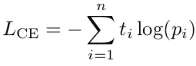

交叉熵损失，其中“t”是某个真实标签的值，“p”是某个预测的值。

这个想法很好，但正如我们之前讨论的，余弦相似度的范围是 -1 到 1，而你不能对负数取对数。CLIP 论文提到如下内容：

> 这些嵌入的余弦相似度随后被计算，通过温度参数 τ 进行缩放，并通过 softmax 归一化为概率分布。— [CLIP](https://arxiv.org/pdf/2103.00020.pdf)

利用这些信息，以及伪代码中的信息：

```py
# 5) symmetric loss function
# logits = nxn matrix of cosin similarity predictions
# labels = nxn matrix of true values
labels = np.arange(n)
loss_i = cross_entropy_loss(logits, labels, axis=0)
loss_t = cross_entropy_loss(logits, labels, axis=1)
loss = (loss_i + loss_t)/2
```

我们可以推断出 `cross_entropy_loss` 函数（作为伪代码中指定的函数）包含在指定轴上的 softmax 操作。这是一个细节，但它在使 CLIP 有效训练中很重要。

对于那些可能不太了解的人，softmax 函数将一组值的向量转换为一个正向量，其组件的总和等于一。

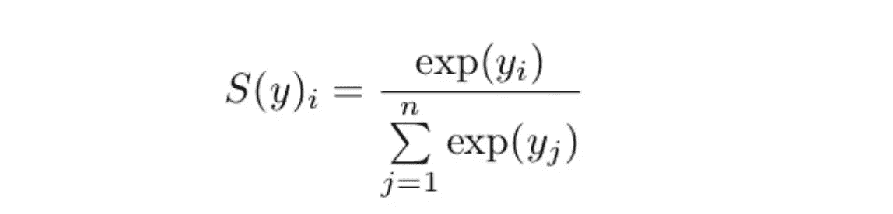

softmax 函数。使用 exp 具有各种良好的属性，但本质上，softmax 函数将输入向量压缩，使得向量中的元素在 0 和 1 之间，且向量中所有元素的总和为 1。

这已经有点数学复杂了，我认为对 softmax 的完整数学理解并不是根本性的关键。让我们看看几个例子：

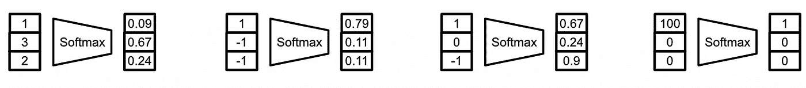

Softmax 函数的四个示例应用。Softmax 函数将向量中的所有元素映射到 0 和 1 之间，并确保所有映射元素的总和等于 1。softmax 函数的结果可以看作是一组概率。（第三个例子中有一个错字，应为 [0.67, 0.24, 0.09]，感谢 Anna 提醒我并在评论中告知我。）

Softmax 函数允许我们将余弦距离值在 -1 和 1 之间的“接近度”转换为概率向量，概率值在 0 和 1 之间，可以解释为“属于一组”。

这种“属于一组”的概率可以通过两种方式计算：

1.  我们可以对文本轴上的余弦距离进行 softmax，从而计算文本属于图像的概率。

1.  我们可以对图像轴上的余弦距离进行 softmax，从而计算图像属于文本的概率。

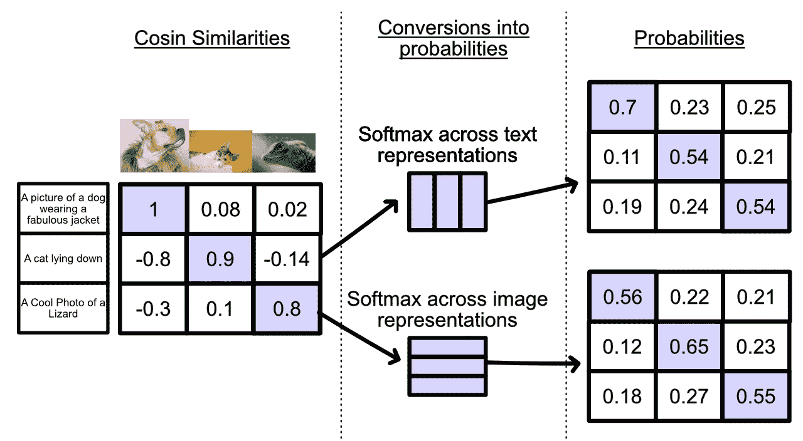

计算概率的两种方法。我们可以计算某段文本属于图像的概率（上图），或者我们可以计算某张图像属于一段文本的概率（下图）。

这就是 CLIP 伪代码中的 `cross_entropy_loss` 函数包含 `axis` 参数的原因；softmax 可以水平或垂直计算，以进行两种损失计算之一。

现在我们得到的概率范围在 0 和 1 之间，我们可以使用交叉熵函数来计算损失。这将是我们的训练目标，我们将尝试最小化它。


交叉熵损失，其中“t”是某个真实标签的值，“p”是某个预测的值。这个特定的表达式适用于真实值向量和预测向量。这个表达式也可以扩展为矩阵或两个矩阵的损失之和，正如我们在这里的情况。

我们可以逐个计算每个矩阵中的元素的损失。然后我们可以将两个矩阵中的所有损失加起来以计算总损失。

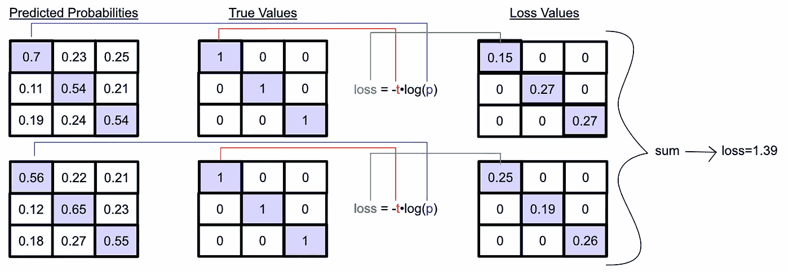

通过两种 softmax 方法将概率转换为单一损失值。

聪明的人可能会意识到这里的一个特殊不兼容性。对比学习的整个要点是你正在学习优化正对和负对。我们希望将正对推得更近，同时将负对推得更远。如果负对的损失（我们优化的内容）无论我们做什么都是零，我们怎么能学习将负对推得更远呢？（负对被识别为真实值为零，这使得负对的对数损失总是为零）

这是 softmax 函数的一个巧妙但极其重要的特性：**当负对的概率增大时，正对的概率会直接减少。** 结果，通过优化正对的概率尽可能接近 1，我们也在优化负对之间的余弦距离尽可能小。

# 使用 CLIP

我之前提到过 CLIP 的这些使用场景，但现在我们对 CLIP 有了更深入的了解，我想重申一下。

**用法 1: 图像分类器**

给定一个输入图像，我们可以将各种文本描述传递给 CLIP，计算哪个描述最能代表图像。我们可以通过将图像传递通过图像编码器，将所有文本传递通过文本编码器，并通过它们的嵌入的点积计算图像和所有文本输入之间的余弦相似度。然后，我们可以计算所有相似度值的 softmax，以计算一段文本属于某个图像的概率。

**用法 2: 图像搜索**

类似于构建图像分类器，我们可以将一些短语传递到文本编码器，将多张图像传递到图像编码器，计算点积和 softmax，从而获得哪个图像与一段文本最相关的概率。

**用法 3: 图像编码器**

由于 CLIP 在一般情况下能够很好地表示图像内容，我们可以将图像编码器用于下游任务。我在[这里](https://medium.com/towards-data-science/visual-question-answering-with-frozen-large-language-models-353d42791054)介绍了一个示例。

**用法 4: 文本编码器**

由于 CLIP 在理解语言短语的哪些方面与图像相关方面表现出色，我们可以将文本编码器用于下游任务。

# 附件

查看这篇文章的附件，其中我使用 CLIP 风格的模型实现了两种类型的图像搜索

[](/image-search-in-5-minutes-9bc4f903b22a?source=post_page-----1d02c07dbf40--------------------------------) ## 5 分钟内的图像搜索

### 前沿的图像搜索，简单而迅速

[towardsdatascience.com

# 结论

就这些了！做得好，坚持下来了。CLIP 是非常迷人和强大的，但因为它在本质上与更直接的方法差异很大，所以可能很难理解。

在这篇文章中，我们讨论了 CLIP 存在的高层原因以及它的一般功能。然后我们将 CLIP 分解为三个组件：图像编码器、文本编码器以及用于将两者连接在一起的共同对齐嵌入空间。我们讲解了 CLIP 如何利用大量的批次创建众多正负样本的高层直觉，然后深入探讨了用于优化 CLIP 的损失函数。

# 关注获取更多内容！

我描述了机器学习领域的论文和概念，重点在于实用和直观的解释。我计划在未来的文章中从头实现 CLIP。

[](https://medium.com/@danielwarfield1/subscribe?source=post_page-----1d02c07dbf40--------------------------------) [## 每当**丹尼尔·沃菲尔德**发布新文章时，获取邮件

### 高质量的数据科学文章直接送到你的邮箱。每当**丹尼尔·沃菲尔德**发布新文章时，你都会收到邮件。通过注册，你…

medium.com](https://medium.com/@danielwarfield1/subscribe?source=post_page-----1d02c07dbf40--------------------------------)

**版权声明：** 本文档中的所有资源均由**丹尼尔·沃菲尔德**创建，除非另有来源说明。你可以将本文中的任何资源用于个人非商业用途，只要你引用了这篇文章，[`danielwarfield.dev`](https://danielwarfield.dev/)，或两者都引用。应要求可以提供明确的商业许可。
