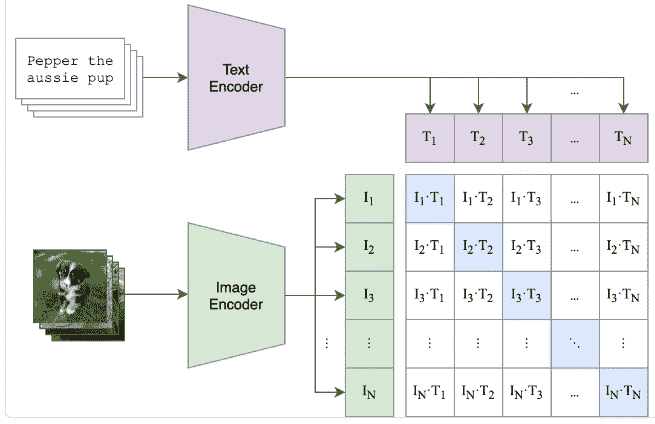
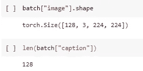
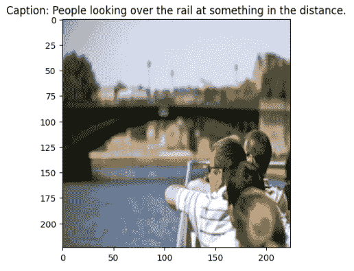

# CLIP 模型及其多模态嵌入的重要性

> 原文：[`towardsdatascience.com/clip-model-and-the-importance-of-multimodal-embeddings-1c8f6b13bf72?source=collection_archive---------1-----------------------#2023-12-11`](https://towardsdatascience.com/clip-model-and-the-importance-of-multimodal-embeddings-1c8f6b13bf72?source=collection_archive---------1-----------------------#2023-12-11)

[](https://medium.com/@faheemrustamy?source=post_page-----1c8f6b13bf72--------------------------------)[](https://towardsdatascience.com/?source=post_page-----1c8f6b13bf72--------------------------------) [Fahim Rustamy, PhD](https://medium.com/@faheemrustamy?source=post_page-----1c8f6b13bf72--------------------------------)

·

[关注](https://medium.com/m/signin?actionUrl=https%3A%2F%2Fmedium.com%2F_%2Fsubscribe%2Fuser%2F931fc8afcda1&operation=register&redirect=https%3A%2F%2Ftowardsdatascience.com%2Fclip-model-and-the-importance-of-multimodal-embeddings-1c8f6b13bf72&user=Fahim+Rustamy%2C+PhD&userId=931fc8afcda1&source=post_page-931fc8afcda1----1c8f6b13bf72---------------------post_header-----------) 发表在 [Towards Data Science](https://towardsdatascience.com/?source=post_page-----1c8f6b13bf72--------------------------------) ·10 分钟阅读·2023 年 12 月 11 日[](https://medium.com/m/signin?actionUrl=https%3A%2F%2Fmedium.com%2F_%2Fvote%2Ftowards-data-science%2F1c8f6b13bf72&operation=register&redirect=https%3A%2F%2Ftowardsdatascience.com%2Fclip-model-and-the-importance-of-multimodal-embeddings-1c8f6b13bf72&user=Fahim+Rustamy%2C+PhD&userId=931fc8afcda1&source=-----1c8f6b13bf72---------------------clap_footer-----------)

--

[](https://medium.com/m/signin?actionUrl=https%3A%2F%2Fmedium.com%2F_%2Fbookmark%2Fp%2F1c8f6b13bf72&operation=register&redirect=https%3A%2F%2Ftowardsdatascience.com%2Fclip-model-and-the-importance-of-multimodal-embeddings-1c8f6b13bf72&source=-----1c8f6b13bf72---------------------bookmark_footer-----------)

CLIP，即对比语言-图像预训练，是 OpenAI 在 2021 年开发的深度学习模型。CLIP 的图像和文本嵌入共享同一空间，使得两种模态之间可以直接进行比较。这是通过训练模型使相关的图像和文本更接近，同时将不相关的图像和文本推远来实现的。本文将解释 CLIP 的工作原理，并指导你如何使用 flikker 和 COCO 数据集训练 CLIP 模型。

你可以在这个 GitHub 仓库中找到代码：

[`github.com/RustamyF/clip-multimodal-ml`](https://github.com/RustamyF/clip-multimodal-ml)

**CLIP 的应用**

CLIP 的一些应用包括：

1.  图像分类和检索：CLIP 可以用于图像分类任务，通过将图像与自然语言描述关联起来。它允许更为多样和灵活的图像检索系统，用户可以通过文本查询来搜索图像。

1.  内容审查：CLIP 可以通过分析图像及其附带的文本来识别和过滤不适当或有害的内容，从而用于在线平台上的内容审查。

原始 CLIP 模型旨在将图像和文本模态统一到一个共享的嵌入空间中。这个概念及其技术不仅限于图像和文本，还扩展到其他模态。Netflix 在[这篇博客文章](https://netflixtechblog.com/building-in-video-search-936766f0017c)中通过在共享嵌入空间中结合视频和文本模态来训练模型，以增强视频应用中的搜索功能。[对比语言-音频预训练 (CLAP)](https://arxiv.org/abs/2206.04769)是另一种将文本和音频模态集成在同一嵌入空间中的模型，有助于改善音频应用中的搜索功能。

CLIP 的基础技术非常简单但却非常强大，为许多多模态机器学习技术打开了大门。Meta AI 最近发布了[**ImageBind**](https://imagebind.metademolab.com/)，该技术在六种模态——图像、文本、音频、深度、热成像和 IMU 数据之间学习联合嵌入。CLIP 是第一个接受两种模态的大规模 AI 模型，它是理解 ImageBind 和其他多模态 AI 系统的前提。


META AI 的 Imagebind 接受六种不同的模态作为输入（取自[ImageBind 的官方 GitHub 页面](https://github.com/facebookresearch/ImageBind)）。

**什么是 CLIP**

CLIP 旨在预测批次中的 N × N 潜在（图像、文本）配对中哪些是真实匹配的。为此，CLIP 通过图像编码器和文本编码器的联合训练建立了一个多模态嵌入空间。**CLIP 损失的目标是最大化批次中 N 个真实配对的图像和文本嵌入之间的余弦相似度，同时最小化 N² − N 个错误配对的余弦相似度。** 优化过程涉及使用对称交叉熵损失函数，该函数作用于这些相似度得分。以下展示了伪代码（取自原始论文），概述了 CLIP 的核心实现。

```py
# image_encoder - ResNet or Vision Transformer
# text_encoder - CBOW or Text Transformer
# I[n, h, w, c] - minibatch of aligned images
# T[n, l] - minibatch of aligned texts
# W_i[d_i, d_e] - learned proj of image to embed
# W_t[d_t, d_e] - learned proj of text to embed
# t - learned temperature parameter
# extract feature representations of each modality
I_f = image_encoder(I) #[n, d_i]
T_f = text_encoder(T) #[n, d_t]
# joint multimodal embedding [n, d_e]
I_e = l2_normalize(np.dot(I_f, W_i), axis=1)
T_e = l2_normalize(np.dot(T_f, W_t), axis=1)
# scaled pairwise cosine similarities [n, n]
logits = np.dot(I_e, T_e.T) * np.exp(t)
# symmetric loss function
labels = np.arange(n)
loss_i = cross_entropy_loss(logits, labels, axis=0)
loss_t = cross_entropy_loss(logits, labels, axis=1)
loss = (loss_i + loss_t)/2
```

以下是每一行伪代码的逐步描述及其在 PyTorch 中的实现：

**模型架构：**

CLIP 使用两种独立的架构作为视觉和文本数据集编码的骨干：

+   `image_encoder`：表示负责编码图像的神经网络架构（例如，ResNet 或 Vision Transformer）。

+   `text_encoder`：表示神经网络架构（如 CBOW、BERT 或 Text Transformer），负责对文本信息进行编码。

原始 CLIP 模型从头开始训练，没有用预训练权重初始化图像编码器和文本编码器，因为他们用于训练 CLIP 模型的数据集体积巨大（4 亿对图像-文本）。在本博客文章中的示例中，我们会有所不同。我们将从 resnet（用于图像）和 distilbert（用于文本）模型的预训练权重开始，以初始化这些部分。



CLIP 模型的架构（取自原始论文）

**输入数据：**

模型接收一个包含 n 对图像和文本的小批量作为输入，其中：

+   `I[n, h, w, c]`：表示对齐图像的小批量，其中 `n` 是批量大小，`h` 是图像高度，`w` 是图像宽度，`c` 是通道数。

+   `T[n, l]`：表示对齐文本的小批量，其中 `n` 是批量大小，`l` 是文本序列的长度。



一批图像和标题对，批量大小为 128

**特征提取：**

+   `I_f = image_encoder(I)`：从图像编码器中提取特征表示（`I_f`）。`I_f` 的形状为 `[n, d_i]`，其中 `d_i` 是图像特征的维度。

+   `T_f = text_encoder(T)`：从文本编码器中提取特征表示（`T_f`）。`T_f` 的形状为 `[n, d_t]`，其中 `d_t` 是文本特征的维度。

```py
I_f = models.resnet34(pretrained=True)      # for encoding images
T_f= AutoModel.from_pretrained("distilbert-base-multilingual-cased") # for encoding captions
```

**学习到的投影：**

+   `W_i[d_i, d_e]`：表示用于将图像特征（`I_f`）映射到嵌入空间（`I_e`）的学习投影矩阵。`W_i` 的形状为 `[d_i, d_e]`，其中 `d_e` 是联合嵌入空间的期望维度。

+   `W_t[d_t, d_e]`：表示用于将文本特征（`T_f`）映射到相同嵌入空间（`T_e`）的学习投影矩阵。`W_t` 的形状为 `[d_t, d_e]`。

投影操作可以通过一个包含两个线性层的神经网络来编码，这些层的权重就是**学习到的投影矩阵**。在大多数情况下，投影权重是唯一具有活跃梯度的权重，可以在新数据集上进行训练。此外，投影层在对齐图像和文本嵌入的维度方面起着至关重要的作用，确保它们具有相同的大小。

```py
class Projection(nn.Module):
    def __init__(self, d_in: int, d_out: int, p: float=0.5) -> None:
        super().__init__()
        self.linear1 = nn.Linear(d_in, d_out, bias=False)
        self.linear2 = nn.Linear(d_out, d_out, bias=False)
        self.layer_norm = nn.LayerNorm(d_out)
        self.drop = nn.Dropout(p)

    def forward(self, x: torch.Tensor) -> torch.Tensor:
        embed1 = self.linear1(x)
        embed2 = self.drop(self.linear2(F.gelu(embed1)))
        embeds = self.layer_norm(embed1 + embed2)
        return embeds
```

**嵌入和归一化：**

+   `I_e = l2_normalize(np.dot(I_f, W_i), axis=1)`：在联合嵌入空间中嵌入并归一化图像特征（`I_e`）。

+   `T_e = l2_normalize(np.dot(T_f, W_t), axis=1)`：在联合嵌入空间中嵌入并归一化文本特征（`T_e`）。

下面的代码展示了图像和文本数据的顺序处理过程。最初，数据经过基本编码器处理，然后通过投影层，最后生成归一化的嵌入并返回。

```py
class VisionEncoder(nn.Module):
    def __init__(self, d_out: int) -> None:
        super().__init__()
        base = models.resnet34(pretrained=True)
        d_in = base.fc.in_features
        base.fc = nn.Identity()
        self.base = base
        self.projection = Projection(d_in, d_out)
        for p in self.base.parameters():
            p.requires_grad = False

    def forward(self, x):
        projected_vec = self.projection(self.base(x))
        projection_len = torch.norm(projected_vec, dim=-1, keepdim=True)
        return projected_vec / projection_len

class TextEncoder(nn.Module):
    def __init__(self, d_out: int) -> None:
        super().__init__()
        self.base = AutoModel.from_pretrained(Config.text_model)
        self.projection = Projection(Config.transformer_embed_dim, d_out)
        for p in self.base.parameters():
            p.requires_grad = False

    def forward(self, x):
        out = self.base(x)[0]
        out = out[:, 0, :]  # get CLS token output
        projected_vec = self.projection(out)
        projection_len = torch.norm(projected_vec, dim=-1, keepdim=True)
        return projected_vec / projection_len

vision_encoder = VisionEncoder(Config.embed_dim)
I_e = vision_encoder(images)
caption_encoder = TextEncoder(Config.embed_dim)        
T_e = caption_encoder(text["input_ids"])
```

**余弦相似度：**

+   `logits = np.dot(I_e, T_e.T) * np.exp(t)`：计算图像和文本嵌入之间的成对余弦相似度，按学习到的温度参数`t`进行缩放。

在本示例中，我们以与原始论文中相同的方式交替使用相似度和 logits。我们将在本博客中不包含温度参数`t`。

```py
logits = I_e @ T_e.T
```

**对称损失函数：**

CLIP 使用对比损失（首次在[对比预测编码的表示学习](https://arxiv.org/pdf/1807.03748.pdf)中引入）来将相关的图像和文本拉近，同时将不相关的图像和文本分开。

+   `labels = np.arange(n)`：生成表示批次索引的标签。

+   `loss_i = cross_entropy_loss(logits, labels, axis=0)`：计算图像轴上的交叉熵损失。

+   `loss_t = cross_entropy_loss(logits, labels, axis=1)`：计算文本轴上的交叉熵损失。

+   `loss = (loss_i + loss_t)/2`：计算图像和文本损失的对称平均。

```py
def CLIP_loss(logits: torch.Tensor) -> torch.Tensor:
    n = logits.shape[1]      # number of samples
    labels = torch.arange(n) # Create labels tensor
    # Calculate cross entropy losses along axis 0 and 1
    loss_i = F.cross_entropy(logits.transpose(0, 1), labels, reduction="mean")
    loss_t = F.cross_entropy(logits, labels, reduction="mean")
    # Calculate the final loss
    loss = (loss_i + loss_t) / 2

    return loss
```

**最终自定义 CLIP 模型**

将所有不同的部分组合在一起，最终的自定义 CLIP 模型如下所示：

```py
class CustomModel(nn.Module):
    def __init__(self, lr: float = 1e-3) -> None:
        super().__init__()
        self.vision_encoder = VisionEncoder(Config.embed_dim)
        self.caption_encoder = TextEncoder(Config.embed_dim)
        self.tokenizer = Tokenizer(AutoTokenizer.from_pretrained(Config.text_model))
        self.lr = lr
        self.device = "cuda" if torch.cuda.is_available() else "cpu"

    def forward(self, images, text):
        text = self.tokenizer(text).to(self.device)

        image_embed = self.vision_encoder(images)
        caption_embed = self.caption_encoder(text["input_ids"])
        similarity = caption_embed @ image_embed.T

        loss = CLIP_loss(similarity)
        img_acc, cap_acc = metrics(similarity)
        return loss, img_acc, cap_acc
```

**示例**

本示例演示了创建图像标题数据集和训练自定义 CLIP 模型的过程。目标是联合训练视觉编码器和文本编码器，将图像及其标题的表示投影到相同的嵌入空间，使标题嵌入位于它们描述的图像的嵌入附近。此项目的代码在我的[GitHub 存储库](https://github.com/RustamyF/clip-multimodal-ml)中。

**数据集和数据加载器**

我们的自定义 CLIP 模型将使用[flickr30k 数据集](https://huggingface.co/datasets/nlphuji/flickr30k)进行训练。该数据集包含超过 31,000 张图像，每张图像至少有 5 个独立的人类生成的标题。我们将在本示例中使用每张图像的两个标题，共有 62,000 对图像和文本用于训练。尽管传统上用于图像标题任务，但我们打算将图像-标题对适配到我们的双编码器模型，专门用于图像搜索。 [GitHub 存储库](https://github.com/RustamyF/clip-multimodal-ml)中还包括了用于在 MS-COCO 数据集上训练模型的代码，其中包含 164,000 对图像和文本。

```py
from torch.utils.data import DataLoader
from datasets import load_dataset
from torchvision import transforms
from PIL import Image
import torch
from torchvision import transforms
from PIL import Image
# Define a custom dataset class for Flickr30k
class Flickr30kDataset(torch.utils.data.Dataset):
    def __init__(self):
        self.dataset = load_dataset("nlphuji/flickr30k", cache_dir="./huggingface_data")
        self.transform = transforms.Compose([
            transforms.Resize((224, 224)),
            transforms.ToTensor(),
        ])
        self.cap_per_image = 2

    def __len__(self):
        return self.dataset.num_rows["test"] * self.cap_per_image

    def __getitem__(self, idx):
        original_idx = idx // self.cap_per_image
        image = self.dataset["test"][original_idx]["image"].convert("RGB")
        image = self.transform(image)

        # labels
        caption = self.dataset["test"][original_idx]["caption"][idx % self.cap_per_image]

        return {"image": image, "caption": caption}

# Create an instance of the custom dataset
flickr30k_custom_dataset = Flickr30kDataset()
```

关键模型常量包括`embed_dim`用于学习的表示，`transformer_embed_dim`用于变换器层特征，以及`max_len`用于文本输入长度。选择的`text_model`是“distilbert-base-multilingual-cased”。训练跨度为 3`epochs`，`batch_size`为 128，这些常量将输入到模型构建和训练中。

```py
from dataclasses import dataclass

@dataclass
class Config:
    """
    Configuration class for the CLIP training script.
    """

    embed_dim: int = 512  # Embedding dimension
    transformer_embed_dim: int = 768  # Transformer embedding dimension
    max_len: int = 32  # Maximum text length
    text_model: str = "distilbert-base-multilingual-cased"  # Text model name
    epochs: int = 3 # Number of training epochs
    batch_size: int = 128 # Batch size
```

DataLoader 被设置为在训练期间高效迭代，提供对图像-标题对的有组织访问。

```py
# Create the DataLoader
clip_dataloader = DataLoader(flickr30k_custom_dataset, batch_size=BATCH_SIZE, shuffle=True, num_workers=4)
```

这是数据集中一个批次中图像标题对的示例。

```py
import numpy as np
import matplotlib.pyplot as plt
# Create an iterator from the dataloader
data_iter = iter(clip_dataloader)

# Get one batch
batch = next(data_iter)

image = batch["image"][0]  # get one image from the batch
caption = batch["caption"][0]  # get one text from the batch

# Convert the image tensor to a NumPy array and permute dimensions
image_np = np.transpose(image.numpy(), (1, 2, 0))

# Display the image and caption
plt.imshow(image_np)
plt.title(f"Caption: {caption}")
plt.show()
```



在这里，我们初始化我们的 CustomModel 并将其发送到设备（CPU 或 GPU）。此外，我们指定了在训练过程中需要优化的参数。由于我们已经固定了文本和图像编码器的基础层，因此只有与投影层相关的参数将在新数据集上进行训练。

```py
# Create an instance of your model
model = CustomModel().to(device)

# Define optimizer
optimizer = torch.optim.Adam([
    {'params': model.vision_encoder.parameters()},
    {'params': model.caption_encoder.parameters()}
], lr=model.lr)
```

**模型训练**

训练是在一台 Tesla T4 (g4dn-xlarge) GPU 机器上进行了 3 个训练 epoch。该 [Jupyter Notebook](https://github.com/RustamyF/clip-multimodal-ml/blob/main/notebooks/flicker30kclip_model.ipynb) 可在项目的 [GitHub 仓库](https://github.com/RustamyF/clip-multimodal-ml) 中找到，并包含训练循环的代码。

```py
batch_zero = True
for epoch in range(start_epoch, num_epochs):
    model.train()
    for batch in clip_dataloader:
        image = batch["image"].to(device)
        text = batch["caption"]
        # images, text = batch
        loss, img_acc, cap_acc = model.common_step((image, text))

        # Backward pass and optimization
        optimizer.zero_grad()
        loss.backward()
        optimizer.step()

        if batch_zero:
          print(f"Epoch [{0}/{num_epochs}], Batch Loss: {loss.item()}")
          batch_zero = False

    # Print training statistics
    print(f"Epoch [{epoch+1}/{num_epochs}], Batch Loss: {loss.item()}")

print("Training complete.")
```

以下是使用 flicker30k 数据集进行每个 epoch 的训练循环结果。有关更多详细信息，请参阅[此笔记本](https://github.com/RustamyF/clip-multimodal-ml/blob/main/notebooks/flicker30kclip_model.ipynb)。

```py
Epoch [0/3], Batch Loss: 4.854558944702148
Epoch [1/3], Batch Loss: 3.187166690826416
Epoch [2/3], Batch Loss: 3.0981950759887695
Epoch [3/3], Batch Loss: 3.164858818054199
Training complete.
```

以下是使用 COCO2017 数据集进行每个 epoch 的训练循环结果。与 flickr30k 数据集中的 62,000 张图像对相比，COCO 数据集提供了超过 160,000 张图像-文本对，使模型在 COCO 数据集上的收敛速度更快。有关更多详细信息，请参阅[此笔记本](https://github.com/RustamyF/clip-multimodal-ml/blob/main/notebooks/coco2017clip_model.ipynb)。

```py
Epoch [0/3], Batch Loss: 4.852224349975586
Epoch [1/3], Batch Loss: 2.7819151878356934
Epoch [2/3], Batch Loss: 2.727229118347168
Epoch [3/3], Batch Loss: 2.717097759246826
Training complete.
```

**结论**

总结来说，本博客文章探讨了 CLIP 模型，揭示了其广泛应用的潜力。随着我们对 CLIP 应用的理解变得更加深入，其影响显然超出了最初的预期，为各个领域的创新解决方案铺平了道路。CLIP 是第一个成功地弥合了不同模态之间差距的模型，并开启了跨学科创新的途径。
