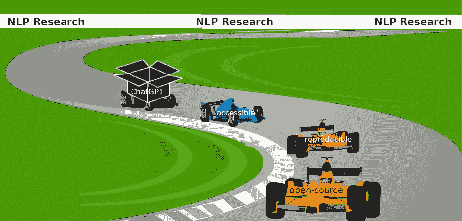

# 关闭的 AI 模型不适合作为基准

> 原文：[`towardsdatascience.com/closed-ai-models-make-bad-baselines-4bf6e47c9e6a?source=collection_archive---------5-----------------------#2023-04-25`](https://towardsdatascience.com/closed-ai-models-make-bad-baselines-4bf6e47c9e6a?source=collection_archive---------5-----------------------#2023-04-25)

 [Anna Rogers](https://medium.com/@anna.rogers?source=post_page-----4bf6e47c9e6a--------------------------------)

·

[关注](https://medium.com/m/signin?actionUrl=https%3A%2F%2Fmedium.com%2F_%2Fsubscribe%2Fuser%2F201bcd64e17&operation=register&redirect=https%3A%2F%2Ftowardsdatascience.com%2Fclosed-ai-models-make-bad-baselines-4bf6e47c9e6a&user=Anna+Rogers&userId=201bcd64e17&source=post_page-201bcd64e17----4bf6e47c9e6a---------------------post_header-----------) 发表在 [Towards Data Science](https://towardsdatascience.com/?source=post_page-----4bf6e47c9e6a--------------------------------) · 18 分钟阅读 · 2023 年 4 月 25 日

--

> 这篇文章的作者是 Anna Rogers，在 Niranjan Balasubramanian、Leon Derczynski、Jesse Dodge、Alexander Koller、Sasha Luccioni、Maarten Sap、Roy Schwartz、Noah A. Smith 和 Emma Strubell（按字母顺序排列）的宝贵帮助和反馈下完成。*封面图片来源：Sasha Luccioni*

以下内容是尝试汇总 ChatGPT 之后 NLP 研究现状的一些讨论。¹ 我们是 NLP 研究人员，至少我们的工作是维护科学方法的基本原则。这篇文章主要针对初级 NLP 研究人员，但也对社区的其他成员相关，他们在考虑这种模型的存在应该如何改变他们的下一篇论文。我们认为，就研究和科学出版物而言，“封闭”模型（如下面定义的）不能被有意义地研究，它们不应成为“通用基准”，像 BERT 曾一度被广泛认为的那样。这篇文章的 TLDR 是对审稿人和主席的一个简单建议规则（类似于[贝德规则](https://thegradient.pub/the-benderrule-on-naming-the-languages-we-study-and-why-it-matters/)），要求命名所研究的语言）：

> ***不可开放且合理可重复的内容不能被视为必要的基准。***

*这里所说的“开放”意味着模型可以下载，可以离线运行（即使需要非平凡的计算资源），并且即使原始提供者不再提供下载，仍可以与其他用户共享。“开放”的模型支持版本控制，并为每个模型版本记录所使用的训练数据。如果模型不是开放的，它就是“封闭”的。*

*这里所说的“合理可重复”意味着创建者公开了足够的信息，使得模型可以通过提供的代码、数据和指定的计算资源来重复，尽管由于硬件/软件差异、数据流失因素和神经网络的非确定性，存在一定的变化。例如，重复* [*BLOOM*](https://huggingface.co/bigscience/bloom) *需要超级计算机——但至少从理论上讲，这是可能的，考虑到开源代码、收集和记录数据的措施。因此，根据我们的定义，它是“合理可重复的”，尽管不是每个人都能做到。*

# 相关性 != 流行度

许多 NLP 研究生最近都在问一个问题：

这种焦虑似乎部分源于我们的领域中，**“相关性”一直受到极端流行趋势的驱动**。在过去的十年里，总会有一个大家都在谈论的事物：一个模型或方法，成为一个标尺，一个基准，大家都明智地在他们的论文中展示，以证明他们所做的工作是有意义的改进。这是可以理解的，因为机器学习社区的一个驱动[价值观](https://dl.acm.org/doi/fullHtml/10.1145/3531146.3533083)是改进过去的工作——否则，我们怎么知道自己在取得进展，对吧？2013 年之后，我们有了 word2vec/GloVe，接着是 BERT 的类似热潮。然后是 GPT-3。现在——ChatGPT 和 GPT-4。

这为什么会发生？背后有两种推理：

1.  **大家都在谈论的事物**要么是我所做的事情中真正最先进的，要么是一个合理的基准，所以我最好在我的论文中提到它，并用我的模型超越它。

1.  作为作者，我的发表机会部分依赖于审稿人对我工作的喜爱，因此对我来说最安全的做法是谈论大多数人可能感兴趣的事物——也就是**大家都在谈论的事物**。

(b) 实际上是自我实现的预言：作者们越是这样想，他们就会越多地使用**大家都在谈论的事物**，这反过来又强化了审稿人对这一事物确实是必需品的信念。我们看到这种循环表现为个体社区成员的信念与他们对其他人对应优先研究方向（例如，专注于基准测试或规模）的看法之间的差异，正如[NLP 社区元调查](https://nlpsurvey.net/)中所记录的那样。尽管这需要付出努力，研究社区的成员可以抵制这种循环（我们将在下面讨论具体的[策略](http://localhost:63342/markdownPreview/775791527/markdown-preview-index-1387425898.html?_ijt=oeg9a3abpl7mtfkhbp8oinaoo1#we-do-have-options)）。至于 (a) — 当**大家都在谈论的事物**实际上是可以有意义比较的东西时，这是有道理的。

我们想要表达的主要观点是，这种推理方式对于那些未披露足够架构、训练设置、数据和推理时操作信息的封闭模型已经不再适用。即使有多少人说它们效果很好也无关紧要。即使不涉及商业 LLM 的可疑伦理问题，已经有涉及[代码](https://www.techradar.com/news/microsoft-is-being-sued-over-github-copilot-piracy)和[艺术](https://arstechnica.com/information-technology/2023/01/artists-file-class-action-lawsuit-against-ai-image-generator-companies/)的版权侵权诉讼，以及[不道德来源的标记数据](https://time.com/6247678/openai-chatgpt-kenya-workers/)——基本的研究方法论都要求如此。许多人提出，作为研究人员，我们现在面临着一个不可能的境地。

+   我们对这些模型的训练内容或方式知之甚少：

+   所谓的黑箱正在不断变化：

+   我们的输入提示和输出答案可能会通过不明确的机制进行不明确的编辑。例如，ChatGPT 通过内容过滤器进行“自我审查”，人们乐于绕过这些过滤器，并且拥有专有的提示前缀：

是的，这些模型在实践中确实对许多人来说很令人印象深刻——但作为研究人员，我们的工作不是盲目跟随炒作。训练这些模型的公司有权选择完全商业化，因此不接受独立审查——这是以利润为主要目的的实体的预期。然而，这必然意味着它们放弃了科学研究者的角色。正如 Gary Marcus [所说](https://garymarcus.substack.com/p/the-sparks-of-agi-or-the-end-of-science?publication_id=888615)，

> *我不期望可口可乐公布其秘密配方。但我也不打算为他们声称的进展提供科学可信度，这些进展我们一无所知。*

# 为什么封闭模型作为必要基准会破坏 NLP 研究叙事

为了使事情更具体，让我们考虑一些 NLP 论文中常见的“研究叙事”，以及使用这种“封闭”模型作为基准时它们将如何受到影响。我们将以 GPT-4 作为一个“封闭”模型的实例，尽管它发布时几乎没有 [技术细节](https://virtualizationreview.com/articles/2023/03/15/gpt-4-details.aspx)，但它的确得到了 100 页的报告称赞，但这些观点同样适用于其他类似模型。

# “我们提出了一种在技术上超越现有水平的机器学习模型”：

+   要声称我们的算法比商业模型所做的任何事情更优秀，我们至少需要知道我们在做一些质的不同的事情。如果我们提议对当前流行的方法（例如，Transformers）进行某些修改，而没有文档，我们根本不能排除“封闭”模型可能在做类似的事情。

+   即使我们相信我们正在做一些质的不同的事情，我们仍然需要能够声称任何改进都是由于我们提出的修改，而不是模型大小、数据的类型和数量、重要的超参数、“幸运”的随机种子等。由于我们没有这些信息，无法对封闭“基准”进行有意义的比较。

+   即使我们忽略所有上述因素——为了在某些性能指标上与这些模型进行公平比较，我们至少要知道我们的模型没有观察到测试数据。对于“封闭”模型，我们同样不知道。即使是 OpenAI 自身最初也对 [GPT-3 的测试数据污染](https://proceedings.neurips.cc/paper/2020/hash/1457c0d6bfcb4967418bfb8ac142f64a-Abstract.html) 感到担忧，尤其是在全世界都乐意测试 ChatGPT 几个月之后，这种情况是不可能改善的。而且它 没有改善。

我们作为模型开发者从 GPT-4 的存在中能学到的唯一一点是，这是一种通过某种未指定的当前方法和数据组合可以获得的性能。这是一个上限或存在证明，看起来高于现有的替代方案。**上限很重要，可以作为我们工作的动力来源，但不能用作比较的依据。**

# “我们提出了一个新的挑战性任务/基准/指标”：

构建良好的评估数据是一项非常艰难且昂贵的工作，当我们相信这些数据可以作为公开基准来衡量 NLP 模型的进展时，投资其中是有意义的，至少可以维持几个月。过去推动 NLP 研究的基准示例包括[SQuAD](https://rajpurkar.github.io/SQuAD-explorer/)、[GLUE](https://gluebenchmark.com/)和[BigBench](https://github.com/google/BIG-bench)。但是，公开基准只有在测试数据保持隐藏的情况下才能有效（即使如此，[最终人们还是会评估太多次](https://laurenoakdenrayner.com/2019/09/19/ai-competitions-dont-produce-useful-models/)并开始隐性过拟合）。这显然与流行的“封闭”模型开发者的场景不兼容，该开发者通过 API 访问模型，保留我们的提交数据并可能用于训练。除非模型明确描述*并分享*其训练数据，否则我们无法进行审计。

这意味着就开发者的模型而言，我们的努力基本上是一次性的。下一次迭代可能会“表现出色”（但原因不一定正确）。

让我们考虑一下 OpenAI 在这方面的政策：

+   ChatGPT [默认会保留你的数据并可能用于训练](https://help.openai.com/en/articles/7039943-data-usage-for-consumer-services-faq)。据说提供了[退出数据收集的选项](https://help.openai.com/en/articles/7039943-data-usage-for-consumer-services-faq)。

+   [OpenAI API 政策](https://openai.com/policies/api-data-usage-policies) 于 2023 年 3 月 1 日更新，目前规定默认情况下数据不会被保留或用于训练。任何在此日期之前提交的数据都可以使用，因此我们可以安全地假设，自 2020 年以来，现有的大部分甚至全部公共基准数据已经提交给 GPT-3，包括标签或“黄金”答案——至少那些被用作少量示例提示的内容。有趣的是，OpenAI 随后使用数据污染作为排除某些评估的理由，但不排除其他评估：GPT-4 技术报告称由于数据污染未对 BIG-bench 进行评估（在[版本 3](https://arxiv.org/abs/2303.08774v3)的报告中是第 6 页的脚注 5），尽管他们确实展示了 100%污染的 GRE 写作考试的结果（表 9）。

总体问题在于，选择退出甚至选择加入在作为公共基准的数据集的情况下是不足够的：作为数据集创建者，我们工作的未来可能不仅会受到我们自己使用数据的影响，还会受到其他人使用数据的影响！只需要一个没有小心选择退出的研究者，或无法选择退出的研究者，我们的数据就会被那个开发者“污染”对未来模型的影响。即使只提交了一些少量样本，它们也可能被用来以某种方式自动增强类似的用户提示。最后但同样重要的是，如果我们将数据公开，模型开发者自己也可能主动将其加入训练数据，以期改善他们的模型。如果标签或“黄金”答案对于一个重要基准数据集不公开，他们可能会创建一些类似的数据。

目前还不清楚如何解决这个问题。也许很快会出现某种特殊版本的 robots.txt，它不仅禁止用于 AI 训练，*还*要求任何重新分享这些数据的行为保留相同的标记。并且，希望大型公司最终会被要求遵守，并接受审计。**在短期内，唯一的选择似乎是简单地不信任或不产生无法进行测试-训练重叠分析的模型的基准结果。**

# “我们展示了模型 X 是否做 Y：（模型分析和可解释性）”

由于我们只能通过 API 访问 GPT-4，我们只能探查模型输出。如果计划使用现有的探查数据集或构建新的数据集，我们将面临上述相同的资源问题（之前使用的探查数据集可能已经被训练，之前使用的技术可能已经被优化，新工作将是一次性的，并且仍然存在未确定程度的训练测试重叠问题）。

此外，至少有些模型似乎故意在使用相同的探针和设置时不产生相同的输出（可能通过随机种子或不同版本的模型并行使用）。在这种情况下，我们获得的结果可能对其他人已经不同，这使我们的基本结论面临风险。这可能包括论文的审稿人，他们可能会合理地得出我们的报告可能不真实的结论。而且，如果开发者在我们写论文的过程中不断调整模型，那么当我们完成论文时，模型可能会发生变化（甚至基于我们自己的数据）。这不仅会使我们的工作在审查前就已经过时，还可能不正确。

这个问题可以通过“冻结”模型的给定版本并承诺保持其对研究人员的可用性来解决，但对于盈利公司来说几乎没有任何激励[²]去这样做。例如，一些流行的模型包括 Codex/code-davinci-002 已经被[弃用](https://platform.openai.com/docs/models/gpt-3)。我们也没有公开的信息说明哪些变化会导致或不会导致新的版本号（而且很可能至少过滤器会不断更新，因为用户在尝试突破模型）。

最后但同样重要的是，考虑展示模型 X 是否做/不做 Y 的影响：

+   *“模型做 Y”*：没有测试和训练重叠的保证，这不一定是对模型的声明。例如，ChatGPT 被报告能够下棋（[表现不好](https://medium.com/@ivanreznikov/how-good-is-chatgpt-at-playing-chess-spoiler-youll-be-impressed-35b2d3ac024a)）。这对于你认为是语言模型的东西来看似乎有些意外，但如果你知道它看过大量的棋局数据——那么语言模型能预测出看起来合理的棋步序列几乎不值得惊讶。基本上，我们发现的不是语言模型的属性（这可能是一个研究发现），而是我们发现它所训练的互联网数据中包含了一些棋局数据。

+   *“模型不做 Y”*：通过收集模型似乎失败的案例，我们在隐性地帮助控制该模型的商业实体“修复”这些特定案例，同时进一步模糊了“突现”语言模型属性和训练中泄露的测试案例之间的界限。事实上，GPT-4 已经在 ChatGPT 的大规模测试中收集了用户交互数据，这为 Open AI 提供了数百万个免费的示例，包括用户提交的提示的“修正”回应。从长远来看，我们的工作会使下一位研究人员更难以检查下一个“封闭”模型。更糟糕的是，这将减少那些可能防止普通用户受到[Eliza 效应](https://en.wikipedia.org/wiki/ELIZA_effect)影响的明显错误，从而增加他们对这些系统的信任（尽管它们仍然从根本上不可靠）。

**总之，通过展示一个封闭模型 X 是否做/不做 Y，我们可能不会对这类模型的总体理解有所贡献，和/或加剧评估问题。**

# “我们展示模型 X 是（不）公平/有偏见等”：（AI 伦理）

比如说，我们以某种方式展示了封闭模型产生了某种特定类型的虚假信息或对某个身份群体的误代表（例如，关于[GPT-3 中的反穆斯林偏见](https://dl.acm.org/doi/10.1145/3461702.3462624)）。这种工作的最可能结果是，这种特定类型的输出会被迅速“修补”，可能在我们甚至发布论文之前。结果是（a）我们的辛勤工作短暂，这可能对研究者的职业生涯有影响，（b）我们积极帮助公司使他们的模型*看起来*更具伦理性，而他们的训练数据可能并未根本改变，因此模型可能仍然编码着可能以其他方式显现的有害刻板印象。考虑到在[Dall-E 2](https://arxiv.org/abs/2211.06323)中，性别和身份术语被随机添加以使输出看起来更具多样性，而不是显示默认的身份群体（即：白人男性）。

那么，我们是否应该从伦理角度放弃研究“封闭”模型？当然不是：**对商业系统的独立分析是严格必要的。但我们需要找出在不向公司提供免费数据的情况下进行分析的方法，以免掩盖潜在问题的症状。** 这里有一些可能依赖于 NLP 研究人员仍在发展的技能集的替代方案，并可能通过与 HCI 和社会科学专家的合作得到强化：

+   用户研究是否人们信任过于简化的聊天机器人回答，他们验证信息的可能性，学生是否以实际改善学习成果的方式使用它，以及促进更安全使用实践的干预措施。这类工作关注这些模型的潜在影响，鉴于已知的自动化偏见现象，任何负面发现只有通过公开用户研究才能被反驳。

+   讨论和记录实际世界中伤害的实例，这些伤害可以追溯到模型（类似于[随机鹦鹉](https://dl.acm.org/doi/pdf/10.1145/3442188.3445922)论文）。理想情况下，这些案例不仅需要修复，还需要公开承认，并希望得到赔偿。

+   对各种人口统计群体进行用户研究，查看系统在不同实际任务中是否对他们同样有效：这需要定性评估，修复可能需要为该群体获取更好的训练数据。但这类工作需要在某种程度上避免产生过多具体证据，这些证据可能被用来简单地“修补”输出。

+   不仅仅是这些系统的研究，还包括它们对社会的预期和实际影响。我们需要大量的关于系统级问题的研究，其中“修复”可能需要对商业模式和/或这些系统的展示和营销方式进行改变。一个明显的例子是那些过于危险而不能用我们当前不可靠、带有偏见、容易产生幻觉的系统来自动化的工作。例如，政策制定者是否会利用机会减少教师数量？哪些类型的学校更可能走上这条路？

# “我们开发了一种比模型 X 更高效的解决方案”：

评审者可能（并且正确地）期望我们在保持类似性能水平的同时提高效率，这意味着我们继承了上述所有评估问题。此外，我们可能连“基线”训练的详细信息，包括其计算成本、投入的能源量和来源等，都不够充分。

# 我们确实有选择！

亲爱的 NLP 社区成员：好消息是，如果你想进行……你知道的……实际的*研究*语言模型，你确实有开放的选择，而且随着训练成本的降低，可能会有更多的选择。**以下是一些不仅提供合理训练数据描述，还有查询工具的模型示例**。

+   [BLOOM](https://huggingface.co/bigscience/bloom)（多语言 LLM），大小 560M-176B: [文档工作](https://huggingface.co/spaces/bigscience-data/bigscience-corpus)，[ROOTS 语料库描述](https://openreview.net/forum?id=UoEw6KigkUn)，[训练数据搜索工具](https://huggingface.co/spaces/bigscience-data/roots-search)

+   [GPT-Neo 模型](https://github.com/EleutherAI/gpt-neo)（主要是英文 LLM），大小 125M-2.7B: [Pile 语料库数据表](https://arxiv.org/abs/2201.07311)，[The Pile](https://arxiv.org/abs/2101.00027)[The Pile 数据肖像](https://pile.dataportraits.org/)

+   [T5](https://huggingface.co/docs/transformers/model_doc/t5)（英文 LLM），大小 60M-11B: [部分 C4 文档](https://arxiv.org/pdf/2104.08758.pdf)，[C4 搜索工具](https://c4-search.apps.allenai.org/)

**那些可能会说“那 GPT-4 在哪里？”的评审者怎么办？** 你可以这样做：

+   在你的论文提交之前，预先讨论为什么不提供例如 ChatGPT 结果作为基线。如果需要，在回复评审者时使用这篇文章中的论点。

+   提前向你计划提交的会议主席提出这一问题，询问他们是否有反对这种表面化、受流行趋势驱动的审稿政策。ACL 2023 的[政策](https://2023.aclweb.org/blog/review-acl23/#2-check-for-lazy-thinking)并没有涵盖这一点，因为问题在提交截止日期后才显现出来，但未来的主席可以扩展此政策。我们会关注与此相关的 ACL 会议政策讨论；如果你有任何意见，或有重大进展且希望我们将你纳入讨论——请使用这个[表格](https://forms.gle/N2Gakzk8xF6V9aTr5)。

+   作为审稿人或主席，如果你看到有人坚持使用封闭的基线——站在作者的一边并提出反对意见。

+   在你的社区中公开讨论这些问题；作为审稿人，我们可以继续教育和影响彼此，将我们的规范推向更好的方向。

另一个超出本文范围的问题，但未来可能会引发社区讨论的是，是否应该将“封闭”模型接受为常规会议提交（与“开放”工作直接竞争以获得会议接受和最佳论文奖）——或者是否是时候重新考虑“行业”轨道的角色。

**我们的社区正处于转折点，你可以帮助引导新的社区规范，遵循科学而不是炒作——无论是作为作者还是审稿人**。引用和研究最佳可用开放解决方案的人越多，我们就越能激励开放和透明的研究，下一步的开放解决方案也更有可能更好。毕竟，正是我们开放研究的传统使我们的社区如此成功。

# 附录：反对意见

**训练-测试重叠和未检查的训练数据一直是一个问题，自我们开始使用 word2vec 进行迁移学习以来就是如此。为什么现在要抗议呢？**

事实上，人们之前已经多次提出过这个问题。再次，即使是 OpenAI 自己也在 GPT-3 论文中花了很大篇幅讨论基准数据污染的问题。问题的陈旧性并不会使它不再成为问题；相反，它使我们成为一个有十年方法学债务的领域，这种情况没有意义，仅仅不断累积。

**“大家谈论的封闭模型确实在这个任务上表现得比我的模型或开放替代方案更好，我怎么能忽视它并声称自己是最先进的呢？**

不要。“最先进”的声明通常在几个月内就会过时。请更具体地说明，仅展示相对于最佳公开解决方案的改进。假设在你的任务中，ChatGPT 显然、明显优于公开的替代方案，基于你自己用自己示例的小规模测试。你不知道的是，这是否主要由于某种巧妙的模型架构或某些专有数据。在后者的情况下，你的科学发现将是……模型在与其训练数据相似的数据上表现最好。这并不完全具有革命性。

此外，问问自己：你确定你观察到的令人印象深刻的行为是纯粹的泛化结果吗？如上所述，我们无法判断你的测试示例与训练数据的相似程度。而且那些训练数据可能包括由其他在这个话题上工作的研究者提交的示例，这些示例并不是任何公开数据集的一部分。

**封闭模型（The-Closed-Model-Everybody-Is-Talking-About）在这项任务中的表现确实比我的模型或开放的替代方案更好，我怎么能忽视它而不在其基础上进行构建呢？**

确实，以往许多 NLP 论文的路径是这样的：拿一个现有的问题和最新的“大家都在谈论的事物”，将它们结合起来，展示相对于以前方法的改进，进行发表。问题在于，对于一个 API 访问的封闭模型，你实际上并没有“构建”在其上；顶多你是制定新的提示（并希望它们能在不同的模型版本中转移）。如果你的目标是工程，如果你只是需要一个有效的方案——这可能就足够了。但如果你追求的是对机器学习理论或方法的科学贡献——这必然会降低你工作在评审者眼中的价值。如果声称你发现了一些新的“行为”使你的解决方案得以实现，并且之前没有被注意到——你仍然需要证明这种“行为”不能通过训练数据来解释。

**无论我们怎么说，大家都在讨论的封闭模型（The-Closed-Model-Everybody-Is-Talking-About）已经成为每个人心中的焦点。人们对此很感兴趣。如果我不发表相关内容，其他人会发布，并且获得比我更多的认可。**

好吧，这个问题是个人选择：你想要什么样的认可，想从谁那里获得认可？在“最热门”的话题上发表可能短期内有效，但正如上面所示，如果我们仅仅跟随这些模型作为 BERT 的新的必备基准的传统 NLP 研究叙事，我们的工作将要么从研究方法学的基本原则中根本脱节，要么极其短暂，要么两者兼而有之。想象一下十年后看你的发表论文列表：你希望它更长，还是包含更多你长期以来引以为豪的东西？

有没有其他方式来研究这些模型，不会遇到这些问题？我们讨论过一些针对伦理研究的方法，也许还有其他选择。

**我们不能仅仅研究那些不太可能出现在训练数据中的虚构示例吗？**

首先，如果目的是了解该模型在真实数据上是如何运作的——某些非常人工的示例可能会以一些定性不同的方式处理。

其次，在这一点上，你需要确保你比那些测试 ChatGPT 几个月的其他人更具原创性。尤其是因为用于 RLHF 的数据来自与 GPT3 的互动——可能甚至是你自己的！

第三，你仍然需要知道哪些部分实际上未被看到。例如，ChatGPT 被[报道](https://twitter.com/tqbf/status/1598513757805858820?s=20)用 King James Bible 风格写了一则关于粘在 VCR 里的花生酱三明治的寓言，这个例子随后在数十篇媒体文章中被分享。这*确实*是一个很酷的例子，但我们认为令人印象深刻的到底是什么？风格转移、对物品被卡在 VCR 里的知识、还是可行的指示？这些中的每一个令人印象深刻的程度取决于训练数据中包含了什么。甚至将这些东西结合在一起的能力的印象深刻程度仍然取决于训练中看到了哪些“技能”的组合，以及这是否实际上是纯语言模型行为，而不是某些管道组件的组合。

我们尝试重现那个答案，但不小心输入了“CVR”而不是“VCR”。结果非常有启发性。我们得到了一些通用的指示，这些指示可能来自类似 WikiHow 的内容：如何擦掉电器上的粘性物质。显然，这在这里没有用处：三明治包括一大块面包，你需要用手而不是擦拭的方式将其移除。但最有趣的是，模型后来“承认”它不知道“CVR”是什么！(实际上，大型语言模型本质上并不“知道”任何关于世界的事情)。然后，当被提示“VCR”时，显然保持对话一致性的指令覆盖了它对‘VCR’可能说的任何内容……所以我们得到了相同的错误指示。

顺利进行的是 King James 风格的释义。但很难想象释义不是一个预期的且经过训练的“能力”，或者这种风格在大型基于网络的语料库中没有得到充分代表——哦，你们这些信心不足的人。它效果好吗？是的。它是一个神奇的“涌现”属性吗？不是。我们可以开发另一个释义系统并有意义地将其与这个系统进行比较吗？也不能。这就是它对 NLP 研究变得不相关的地方。*那种不公开且合理可重复的东西不能被视为必要的基准。*

# 说明

¹ 这篇文章的工作开始于一段时间前，与[长期主义](https://futureoflife.org/open-letter/pause-giant-ai-experiments/)或[GPU 资源民主化请求](https://laion.ai/blog/petition/)无关。

² 实际上，确实有激励措施促使这些公司关闭和弃用其模型的旧版本，以（a）减少攻击面，（b）限制技术债务。这些对于商业实体来说是合理的担忧，但它们与模型作为科学研究对象的本质上存在矛盾。
