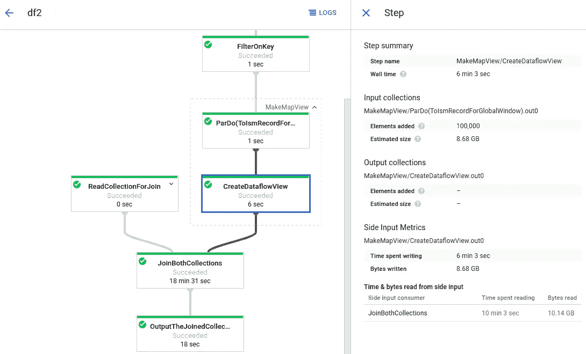

# 云优先的数据科学：分析和建模数据的现代方法

> 原文：[`towardsdatascience.com/cloud-first-data-science-a-modern-approach-to-analyzing-and-modeling-data-33695041f712`](https://towardsdatascience.com/cloud-first-data-science-a-modern-approach-to-analyzing-and-modeling-data-33695041f712)

## 使用云端进行数据科学工作流程每一步的指南

[](https://bench-5.medium.com/?source=post_page-----33695041f712--------------------------------)[](https://towardsdatascience.com/?source=post_page-----33695041f712--------------------------------) [Ben Chamblee](https://bench-5.medium.com/?source=post_page-----33695041f712--------------------------------)

·发布于 [Towards Data Science](https://towardsdatascience.com/?source=post_page-----33695041f712--------------------------------) ·阅读时长 11 分钟·2023 年 11 月 28 日

--


照片由 [Myriams-Fotos](https://pixabay.com/users/myriams-fotos-1627417/) 提供，发布在 [Piaxabay](https://pixabay.com/)

数据科学是全球增长最快的行业之一，利用现代前沿技术来改善我们使用数据的方式。然而，如果你曾经从事数据科学工作，你可能知道有一天你会不可避免地面对一个 Excel 表格。Excel 没有问题，只是它不是你在一个现代化行业中期望使用的工具。

许多组织已经开始利用现代云基础设施，但并没有充分利用它。因此，许多数据科学家发现自己在从云数据仓库提取数据后，只能在本地系统上训练模型。这样做也没有问题，但如果我们能够将整个数据科学工作流程都搬到云端，那将会怎样？实际上，我们可以做到！

从数据清理到模型部署，有一个基于云的工具可以帮助你现代化你的工作流程。在这篇文章中，我将逐步介绍数据科学工作流程的每一个步骤，展示如何将其迁移到云端，并在过程中提供一些示例。如果你已经现代化了工作流程的一部分，可以随意跳过，但如果你想获得 100%云端的数据科学体验，请继续关注！

**云端的数据收集与存储**

你可能已经对存储数据在云中的好处很熟悉，但以防你没有听说过：这真的很棒！将你的数据存储在云中可以让你从任何有互联网连接的地方访问数据，轻松与其他云服务集成，根据需要扩展存储容量，创建备份以便恢复，还有许多其他非常有用的功能。

无论你是否需要数据仓库、数据湖还是对象存储，如果你想将数据部署到其他应用程序，你的数据必须存储在某个地方。有很多提供云数据存储的服务；一些更受欢迎的包括：

+   AWS S3

+   Azure Blob 存储

+   Google Cloud 存储

+   Hadoop

+   Snowflake

这甚至不是云数据存储服务的完整列表，但如果你从事数据科学工作，那么很有可能你会最终使用到这些服务中的某些，甚至是全部。每种服务和云存储类型都有其优点和缺点，因此你应该选择你认为最适合你项目的那一个！

无论你使用哪种服务进行云数据存储，收集和存储数据的过程都有相同的一般步骤。你通常需要在服务提供商处注册账户，创建存储容器或桶，然后你就可以上传数据了。根据你使用的服务，这可以通过网络界面、命令行工具、SDK 或 API 完成。

存储数据在云中的最佳实践之一是设置权限和访问控制。如果你在做一个个人项目，这一点不是特别相关，但如果你在团队中工作，这就至关重要了。管理你的数据也很重要，包括数据结构、元数据、更新频率和保留。加密也可以确保你的数据安全和隐私，创建备份将保护你免于丢失任何进展，并提高数据的可用性！

**云中的数据清洗和转换**

既然你的数据已经存储在云中，那么继续在云中执行所有必要的清洗步骤是有意义的！这样做的好处与上述讨论的类似；可以从任何地方访问、可扩展性、易于集成等，但你还会得到一个额外的好处：无需下载你的云数据、清洗它再重新上传。如果操作得当，工作流程应该是非常流畅的！

这里有一些你可以用来进行云数据清洗和转换的工具示例，我将保持与上面部分中列出的五个工具一致，但请记住，还有很多其他工具可供选择！

+   AWS Glue

+   Azure 数据工厂

+   Google Cloud Dataflow

+   Apache Hive

+   Snowflake 数据集成

一些服务通过提供 ETL（提取、转换、加载）前后的数据样本，使得清洗过程变得简单。还有一些工具提供“无代码”体验，你可以通过拖放命令来操作，而其他工具则提供高度可定制的编码体验。你可以根据自己的偏好选择！一般来说，这些工具可以与多个云存储提供商兼容，因此整个过程非常灵活。

关于在线数据转换工具，我最喜欢的一点是其可视化组件，大多数工具都会有一个界面，逐步展示数据转换过程，如下所示：



图片来自 Google Cloud Dataflow [文档](https://cloud.google.com/dataflow/docs/guides/job-graph)（CC BY 4.0）

我的经验是，当你向经理或观众展示数据转换时，有一个这样的可视化图像会大大简化解释过程。展示和解释原始的 python 代码可能相当困难，但逐步解释每一步发生的事情则容易得多。

如果你在 Snowflake 中进行这个过程，可能会是这样：一旦你的账户设置好并且数据加载到 Snowflake 中，探索你的数据集——你可以查看原始数据或使用其 Snowsight 工具更好地了解数据的结构和特征。一旦你了解了数据的样子，你可以使用内置工具或 SQL 轻松清理数据。然后根据你的项目需求，你也可以添加新的列以便进一步分析。例如，如果你在对客户评价进行情感分析，你可以写一个这样的快速脚本：

```py
-- Sentiment Analysis
CREATE OR REPLACE TABLE sentiment_scores AS
SELECT
    product_id,
    customer_id,
    review_text,
    CASE
        WHEN sentiment_score > 0.6 THEN 'Positive'
        WHEN sentiment_score < 0.4 THEN 'Negative'
        ELSE 'Neutral'
    END AS sentiment
FROM your_dataset;

-- Aggregation
CREATE OR REPLACE TABLE aggregated_sentiments AS
SELECT
    product_id,
    AVG(sentiment_score) AS avg_sentiment
FROM sentiment_scores
GROUP BY product_id;
```

然后，一旦数据被清理和/或转换，你可以将其保存为新的数据集，并继续进行下一步！

**基于云的数据分析**

现在我们已经上传、清理并准备好数据进行分析了！我们有很多分析选项，从笔记本到仪表板，但无论你的偏好是什么；都有一个选项可以让你的工作流程保持在云端。

如果你停留在我们提到的五大云服务提供商的生态系统中，你的选择包括：

+   AWS Redshift

+   Azure Synapse Analytics

+   Google BigQuery

+   Apache Spark

+   Snowflake 数据仓库

市面上还有许多其他工具，但这五个应该可以完成工作，特别是当你的清理数据已经存在于各自的平台上时。根据你选择的工具，你将拥有广泛的数据分析能力，就像清理一样，无论你对 python 或 R 的熟练程度如何，你都可以有许多不同的方法。和往常一样，你应该使用你最喜欢的工具以及与项目兼容的工具。

根据你的项目复杂性，使用这些工具进行数据分析可能相当简单。例如，在 BigQuery 中，你可以编写自定义 SQL 查询来分析数据，此外你还可以快速生成视觉效果并进一步探索数据。如果你喜欢在笔记本上工作，你也可以将数据直接从 BigQuery 发送到 Google Colab 笔记本中进行分析，如果决定进行更改，你还可以将其作为单独的数据集发送回来。

现在你的数据已经被分析，你可能对如何展示数据有了一个好的想法——幸运的是，接下来的步骤，可视化，也可以完全在云端完成！

**云端数据可视化**

你可能会在本文中注意到一个主题，那就是每一步工作流的集成都非常简单。我们已经上传了数据，清理了数据，分析了数据，现在我们准备好进行可视化，整个过程都没有下载任何文件！

有许多工具可以用来创建令人惊叹的云端数据可视化。我们跟踪的五个云平台每个平台都有自己的一套可视化工具，但以下是一些可以轻松与我们的数据管理系统集成的其他工具：

+   Tableau Online

+   Power BI

+   Looker

+   Qlik Sense

+   Plotly Dash

根据你的需求，你可以轻松创建一个干净、信息丰富的视觉效果或创建一个交互式仪表板。例如，Tableau Online 还有一个很棒的创作者社区，分享他们的可视化作品。查看他们在 Tableau Public 上的[今日视觉](https://public.tableau.com/app/discover/viz-of-the-day)一直是我一些视觉效果的灵感来源。

过程非常简单，你只需将所选的可视化工具与所选的数据存储工具连接，然后你就可以在网上创建令人惊叹的视觉效果！这些工具通常会有令人惊叹的视觉库，既有信息性又视觉吸引！你通常还可以与这些视觉效果互动，并在你的云托管数据更新时获得实时更新。如果你愿意，你也可以将你的视觉效果嵌入其他网页应用或网站；整个过程非常可定制。

**基于云的机器学习和建模**

这可能是数据科学中利用云计算最有意义的领域。训练和测试模型对计算机的要求很高，那么为什么不将这些工作转移到专用服务器上呢？这只是云端机器学习（ML）和建模的一些优势之一。

云平台通常还会提供预构建模型，以便于你只需快速获取模型，如果你不是机器学习专家，还有 AutoML 服务会给出建议——全部无需编写一行代码。当然，对于机器学习工程师来说，还有高度可定制的应用程序，提供超参数调整和 MLOps 功能，以确保你的模型完全符合你的规格。

以下是一些你可以用于机器学习和建模的云工具示例：

+   AWS SageMaker

+   Azure Machine Learning

+   Google Cloud AI Platform

+   Databricks

+   Kubeflow

如果你喜欢为自己的模型编写代码，SageMaker 的过程大致如下。首先，你将从 S3 加载数据，然后创建 SageMaker 笔记本以编写代码。SageMaker 内置了像 XGBoost 这样的算法，但你也可以使用经典的 Scikit-Learn 库创建自定义模型。你可以在代码中指定模型的算法并调整超参数。当你准备好训练和测试模型时，SageMaker 将处理所有计算资源——这将为你节省大量时间。这个过程最酷的部分之一是，一旦完成，你可以通过 API 使训练后的模型可访问，并在任何你想要的地方使用该模型！

如果你不喜欢编写代码或需要一个工具为你建议模型，Azure Machine Learning 有一个叫做 Azure AutoML 的工具，非常适合你。与上述示例类似，你将从相应的数据仓库加载数据，但在建模部分，你可以让 Azure 为你建议一个模型，或从他们的算法库中选择以创建自己的模型。这个过程高度可定制，但仍然可以通过无代码界面完成。

无论你想如何创建机器学习模型，可能都有适合你的云端工具。同时，无论你使用哪个工具，它都有很大可能与我们在过程早期讨论过的其他工具集成。

**在云上部署数据科学解决方案**

现在我们已经训练了我们的模型，可以利用云将我们的见解和算法转化为现实世界的解决方案。在这里，你可以真正看到使用云的好处，因为你的解决方案将可以从任何地方访问，并且可以在大规模上扩展以回答各种问题。使用云还意味着你的训练模型可以继续学习和改进，当你从模型中获得结果时，你可以上传这些结果，清理它们，并使用我们在整篇文章中讨论的方法进行可视化。

如你所见，我非常喜欢这种云工作流，以及所有内容如何完美集成在一起。

部署你的模型有很多选项，但以下是几个值得考虑的：

+   Kubernetes (AWS, Azure, GCP)

+   AWS Lambda

+   Azure App Service

+   Google Cloud App Engine

+   Heroku

根据你的数据科学解决方案，你选择的工具会有所不同。例如，如果你正在设计一个使用你在线构建的模型的网络应用，你可以使用 Kubernetes 在该网络应用上部署和改进你的解决方案。过程将从将你的应用和模型打包到一个 Docker 容器中开始，Docker 容器是一个包含运行应用所需的一切的可执行包。你可以将这个容器存储在 Kubernetes 可以访问的容器注册中心（GCP、AWS 和 Azure 都有！）中。然后你可以在云中创建一个集群，并编写一个简单的配置文件（YAML）来告诉 Kubernetes 如何从 Docker 容器中运行你的网络应用。

一旦一切按你的喜好配置完成，你就可以开始将你的网络应用运行到所需的用户数量！你可以获得关于你的模型的实时反馈和分析，这些都可以存储在云端并进行可视化。无论你使用什么 Kubernetes 服务，都能顺利运行并处理所有计算任务，你还能向模型中添加额外的数据以持续改进它！

那真是很多内容——这无疑是过程中的最复杂步骤。不幸的是，如果你想要一个可视化的指导，你还可以查看[mildlyoverfitted 的这段 youtube 视频](https://www.youtube.com/watch?v=DQRNt8Diyw4)，他很好地展示了通过 Kubernetes 进行部署的过程。

**其他考虑事项**

尽管我在整篇文章中讨论了将工作流程迁移到云端的所有好处，但在你完全转向 100%基于云的工具之前，还有一些事项需要牢记。

首先需要知道的是，如果你完全依赖基于云的工具，可能会变得非常昂贵。虽然有很多免费的选项，但如果你扩展你的工作，迟早会遇到存储或计算能力的大额账单。还有一个问题是依赖于互联网连接，你的工作流程严重依赖互联网的质量。一些系统也会出现故障，从而打断你的工作和生产力。在系统或服务发生变化或突然终止的情况下，重要的是要多样化你的技能，这样你仍然可以继续工作。

然而，这些缺点并不适用于所有基于云的工具，重要的是要记住这些事项，以便你能做出明智的决定，关于你希望如何完成工作。

**结论**

我们已经从上传数据到部署机器学习模型，并且在整个过程中使用了现代基于云的工具。我认为这非常棒！我希望阅读这篇文章能激励你现代化你的某些或所有工作流程，或者即使没有，我也希望我至少展示了在云上进行数据科学是可能的。现代行业的现代工作流程——这感觉很对！

本文仅概述了可能的内容，如果你有兴趣了解更多关于这个话题的信息，以下是一些你可以查看的资源：

+   [Google Cloud Platform 上所有数据科学工具的概述](https://cloud.google.com/data-science)

+   [Snowflake 数据科学指南](https://www.snowflake.com/guides/data-science)

+   [迁移到云端的一些实际理由](https://www.qubole.com/blog/5-reasons-to-move-data-science-to-the-cloud)

感谢阅读！

**想要更多我的内容？**

1.  [在 Medium 上关注我](https://bench-5.medium.com/)

1.  通过使用[我的推荐链接](https://bench-5.medium.com/membership)在 Medium 上支持我的写作

1.  在[LinkedIn](https://www.linkedin.com/in/benchamblee/)和[Twitter](https://twitter.com/Bench__5)上与我联系

1.  查看我在[benchamblee.blog](https://www.benchamblee.blog/)上的《用 Python 进行数据科学》指南
