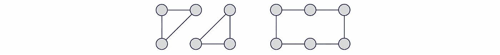
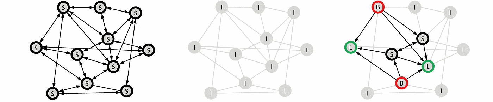
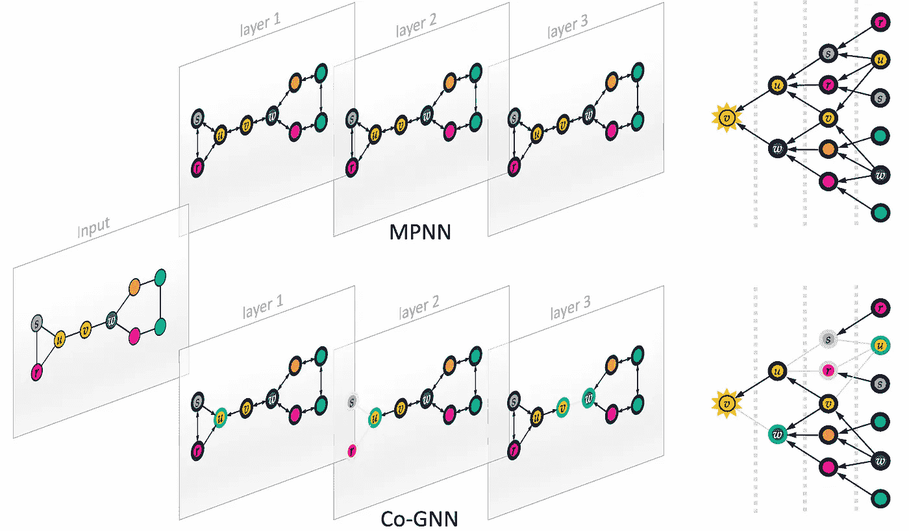
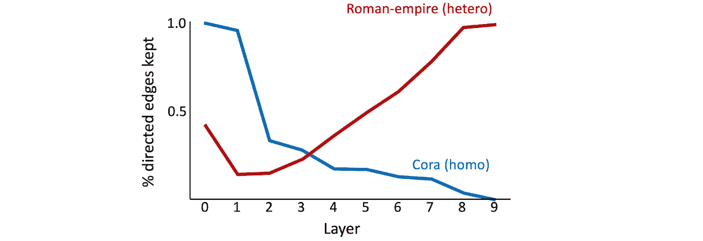
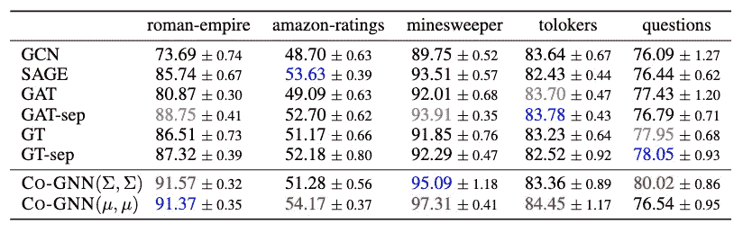
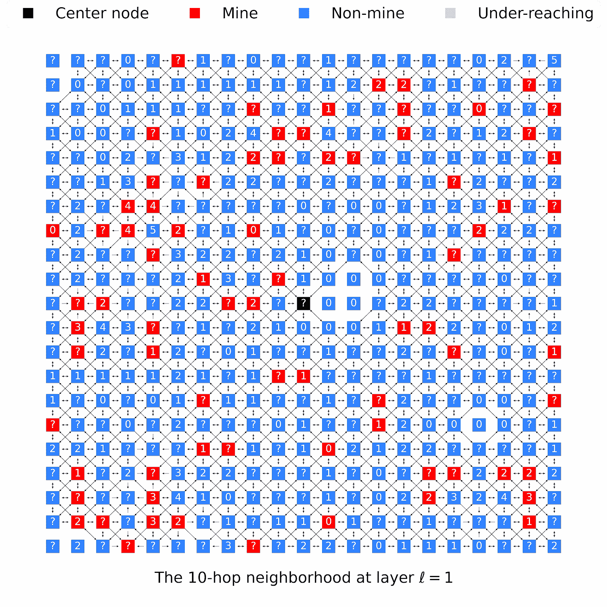

# 合作图神经网络

> 原文：[`towardsdatascience.com/co-operative-graph-neural-networks-34c59bf6805e`](https://towardsdatascience.com/co-operative-graph-neural-networks-34c59bf6805e)

## 新的 GNN 架构

## ***绝大多数图神经网络（GNNs）遵循信息传递范式，其中节点状态基于聚合的邻居消息进行更新。在本文中，我们描述了合作图神经网络（Co-GNNs），这是一种新的信息传递架构，其中每个节点被视为一个玩家，可以选择‘监听’、‘广播’、‘监听 & 广播’或‘隔离’。标准的信息传递是一种特殊情况，其中每个节点‘监听 & 广播’所有邻居。我们展示了 Co-GNNs 是异步的、更具表现力的，并且可以解决标准信息传递 GNNs 的常见问题，如过度压缩和过度平滑。***

 [Michael Bronstein](https://michael-bronstein.medium.com/?source=post_page-----34c59bf6805e--------------------------------)

·发布于 [数据科学之路](https://towardsdatascience.com/?source=post_page-----34c59bf6805e--------------------------------) ·阅读时长 11 分钟·2023 年 12 月 6 日

--

*Co-GNNs 中节点操作的示意图：标准、监听、广播和隔离。图片来源：DALL-E 3。*

本文由 Ben Finkelshtein、Ismail Ceylan 和 Xingyue Huang 共同撰写，基于论文 B. Finkelshtein 等人，[合作图神经网络](https://arxiv.org/abs/2310.01267)（2023）arXiv:2310.01267。

图神经网络（GNNs）是一类用于在图结构数据上进行学习的流行架构，例如分子、生物相互作用组和社交网络。大多数 GNN 遵循信息传递范式 [1]，在每一层中，图节点沿图的边缘交换信息。每个节点的状态通过对来自相邻节点的消息进行排列不变的聚合操作（通常是求和或取均值）来更新 [2]。

虽然消息传递范式在图 ML 中具有很大影响力，但它有着公认的理论和实际限制。消息传递图神经网络（MPNN）与图同构测试的形式等价 [3] 为它们的表达能力提供了理论上的上限。因此，即使是非常简单的非同构图（例如下面的 6-圈和两个三角形）也无法通过消息传递区分，除非有额外的信息，如位置编码或结构编码 [4]，或更复杂的信息传播机制 [5]。

*两个非同构图的示例，通过 1-WL（因此，通过消息传递）在没有额外信息的情况下无法区分。*

## **消息传递与信息瓶颈**

消息传递的一个实际限制与图上的信息流相关。为了从 *k* 跳邻居处接收信息，一个 MPNN 需要至少 *k* 层，这通常导致节点接收域的指数增长。增长的信息量必须被压缩为固定大小的节点嵌入，这可能导致信息丢失，称为 *过度压缩* [6]。

我们最近表明，MPNN 中是否发生过度压缩取决于任务、架构选择（例如层数）和图 [7]。使图“更友好”以应对过度压缩是图 ML 文献中一种常见的技术，通用名称为 *“图重连线。”*

每个节点既 *发送* 又 *接收* 来自其邻居的信息是经典消息传递的另一个限制。动态图重连线 [8]、注意力 [9] 或门控 [10] 等机制允许修改节点的邻域或降低邻居消息的权重。

# **合作图神经网络**

在最近的一篇论文 [11] 中，我们提出了一种可学习的消息传递推广方法，允许每个节点决定如何从或向邻居传播信息，从而实现更灵活的信息流动。我们将节点视为可以在每一层采取以下动作的参与者：

**标准：** 广播给那些监听的邻居 *和* 监听广播的邻居。所有节点选择此动作将产生经典的消息传递方案。

**监听：** 监听广播的邻居。

**广播：** 广播给监听的邻居。

**隔离：** 既不监听也不广播。当所有节点都隔离时，图上不会传播任何信息，预测以节点为单位进行，类似于 DeepSets [12]。

图上的节点操作示例：所有节点广播和听（标准消息传递用“S”表示），所有节点隔离（节点预测，用“I”表示），以及混合操作的通用案例（听“L”，广播“B”，听和广播“S”，隔离“I”）。

这些操作之间的相互作用以及局部和动态改变它们的能力使整体方法比标准消息传递更丰富。它允许我们以可学习（非启发式）和任务依赖的方式将输入图与计算解耦。

为了实现这一新颖的消息传递方案，我们引入了一类新的 GNN 架构，称为*合作 GNN*（“Co-GNN”）。与传统 MPNN 的主要区别在于，额外的*“行动网络”*为每一层的每个节点选择四个操作之一。所选择的操作会影响节点特征的更新方式，由另一个*环境网络*进行更新，该网络与行动网络共同训练[13]。

# Co-GNN 的优势

**任务特定的：** 标准消息传递根据节点的局部邻域更新节点，这完全与任务无关。通过允许每个节点只从相关邻居处接收信息，Co-GNN 可以确定最适合目标任务的计算图[14]。

**定向的：** 节点所能采取的行动结果相当于对输入图的特殊形式的“定向重连”。一条边可以被删除（例如，如果两个邻居都在听而没有广播）；保持无向（例如，如果两个邻居都执行标准的听和广播操作）；或变成有向（例如，如果一个邻居在听而其邻居在广播）。

**动态的：** Co-GNN 不在预先固定的计算图上操作，而是在通过选择节点操作学习到的计算图上操作，这在各层之间是动态的。每个节点学习与相关邻居交互，并且只有在这些邻居仍然相关时才这样做。

经典 MPNN 中的计算图示例（这是我们架构的一个特殊案例，其中所有节点选择“标准”操作，用黑色轮廓表示）和 Co-GNN。这一示例展示了将消息从源节点 w 直接路由到目标节点 v 的可能性。

**既基于特征也基于结构：** 标准消息传递完全由图的结构决定：具有相同邻域的两个节点接收相同的聚合消息。在 Co-GNN 中情况并非如此，它可以为具有不同节点特征的两个节点学习不同的操作。这允许即使邻域相同，也为不同节点传递不同的消息。

**异步的：** 标准消息传递在每次迭代中同步更新所有节点，这并不总是最优的[15]。Co-GNN 的设计允许在节点之间进行异步更新。

**比 1-WL 更具表现力：** 对于 1-WL 无法区分的节点对，有非平凡的概率会采样不同的动作，从而使其直接邻域不同[16]。这产生了高概率的唯一节点标识符，并允许我们区分任何一对图，前提是存在注射图池化函数[17]。

**适合长程任务：** 长程任务需要在远距离节点之间传播信息。我们的消息传递范式可以通过学习专注于连接这两个节点的最短路径，来有效地过滤无关信息，从而最大化信息流向目标节点[18]。

**可以防止过度压缩：** 在我们之前的工作[19–20]中，我们将过度压缩形式化为*第*r 层 MPNN 输出在节点*u*处对远处节点*v*的输入的*缺乏敏感性*。这可以通过形式为的偏导数（*雅可比矩阵*）的界限来量化

|∂**x***ᵤ*⁽*ʳ*⁾/∂**x***ᵥ*⁽⁰⁾| < *c*(**A***ʳ*)*ᵤᵥ,*

其中**x***ᵤ*⁽*ʳ*⁾表示第*r*层节点*u*处的特征，*c*封装了与架构相关的常数（例如，激活函数的 Lipschitz 正则性、宽度等），**A**是归一化的邻接矩阵，捕捉图的效果。图重连技术相当于修改**A**以增加上界，从而减少过度压缩的影响。在 Co-GNNs 中，每个节点的动作导致有效的图重连，传递特征从一个节点到另一个节点（如上例所示），从而最大化雅可比矩阵的界限[21]。

**可以防止过度平滑：** “**过度平滑**”是指节点嵌入随着消息传递层数的增加而在图中变得越来越相似的趋势。我们在[10]中表明，通过梯度门控机制可以缓解过度平滑，该机制自适应地禁用来自具有相似特征的邻居的节点更新。Co-GNNs 通过选择 BROADCAST 或 ISOLATE 动作来模拟这一机制。

# 实验结果

为了更好地理解我们新的消息传递方案中学习到的计算图的效果以及它如何适应不同任务，我们观察了在 Co-GNN 不同层之间保留的有向边的比例（一个经典的 MPNN 在输入图上执行消息传递，其比例为 1）。

*在同质图 Cora（蓝色）和异质图 Roman-empire（红色）中，每一层保留的有向边的比例显示了不同类型图中不同的自适应行为。*

我们在两个数据集上训练了一个 10 层的 Co-GNN：同质*Cora*和异质*Roman-Empire* [22]。我们观察到在保留的边的比例演变方面的*相反趋势*。在同质数据集中，保留的边的比例随着深度逐渐*减少*，而在异质数据集中则*增加*。保留的边的比例减少意味着信息在较少的节点之间传播，我们认为这是一种应对过度平滑现象的方法，类似于梯度门控[10]。

在被认为是 GNNs 的困难测试案例的异质数据集[23]上，Co-GNNs 在各个方面都取得了最先进的结果，尽管它们使用的行动和环境网络架构相对简单，超越了更复杂的模型如 Graph Transformers。这些结果令人振奋，因为它们确立了 Co-GNNs 作为异质环境中一种强有力的方法。

*异质节点分类的性能结果（准确率 %）。前三名模型分别用红色、蓝色、灰色标记。*

## 可视化行动

我们使用*Minesweepers*数据集[23]可视化 Co-GNN 在每一层的拓扑，该数据集是一个半监督节点分类任务，使用一个规则的 100×100 网格，其中每个节点连接到八个邻居节点。每个节点有一个热编码的输入特征，显示相邻地雷的数量。随机选择的 50%节点具有未知特征，用一个单独的二进制特征表示。任务是正确识别节点是否为地雷。

我们观察到在早期层次（1-4），行动网络学习隔离黑色节点的正确部分，这类似于人类玩这个游戏的方式：没有邻近地雷（标记为 0 的节点）的节点在确定黑色节点是否为地雷时最初没有帮助。因此，行动网络优先处理来自网格左侧区域的信息，那里的地雷更多，因此最初主要关注对任务更具信息性的节点。

在确定最重要的信息并将其传播通过网络之后，这些信息还需要与最初标记为 0 的节点进行通信。这导致在更深的层次（7-8）中几乎完全连接的网格。

# 结论

我们的新型消息传递方案使每个节点可以自适应地选择其行动及其在 Co-GNNs 形式下的架构，提供了多种优势，并帮助克服了传统消息传递方法的已知缺陷。我们相信这在理论和实践方面都是一个有前景的方向。

[1] J. Gilmer 等，[量子化学的神经消息传递](https://arxiv.org/abs/1704.01212)（2017）*ICML*。

[2] 这使得层具有置换等变性。

[3] K. Xu 等人，《图神经网络的强大能力？》（2019）*ICLR*，以及 C. Morris 等人，《魏斯费勒和莱曼走向神经网络：高阶图神经网络》（2019）*AAAI* 证明了消息传递与 B. Weisfeiler 和 A. Lehman 经典论文中描述的图同构测试之间的等价关系，《图的规范形式的化简及其中出现的代数》（1968）*Nauchno-Technicheskaya Informatsia* 2(9):12–16。请参见我们关于这一主题的[之前的博客文章](https://medium.com/towards-data-science/expressive-power-of-graph-neural-networks-and-the-weisefeiler-lehman-test-b883db3c7c49)。

[4] 请参见我们关于 GNNs 中结构编码的之前的博客文章。

[5] 关于这些构造的几个示例，请参见我们之前的博客文章，子图 GNNs 和拓扑消息传递。

[6] U. Alon 和 E. Yahav，[图神经网络瓶颈及其实际影响](https://openreview.net/pdf?id=i80OPhOCVH2)（2021）*ICML*。

[7] 从几何角度对过度挤压的理论分析首先由 J. Topping 和 F. Di Giovanni *等人* 完成，[通过曲率理解图上的过度挤压和瓶颈](https://arxiv.org/pdf/2111.14522.pdf)（2022），*ICLR*，并由 F. Di Giovanni *等人* 进一步扩展，[关于消息传递神经网络中的过度挤压：宽度、深度和拓扑的影响](https://arxiv.org/abs/2302.02941)（2023），*ICML*。最近，过度挤压与表达能力的关系由 F. Di Giovanni *等人* 链接，[过度挤压如何影响 GNNs 的能力？](https://arxiv.org/abs/2306.03589)（2023），arXiv:2306.03589。

[8] Wang 等人，[点云上的动态图卷积神经网络](https://arxiv.org/pdf/1801.07829.pdf)（2019）*ACM Trans. Graphics* 38(5):146，同时参见我们关于潜在图学习的博客文章。

[9] P. Veličković 等人，[图注意力网络](https://arxiv.org/abs/1710.10903)（2018）*ICLR*。

[10] K. Rusch 等人，[图上的深度多率学习的梯度门控](https://arxiv.org/pdf/2210.00513.pdf)（2023）*ICLR*。

[11] B. Finkelshtein 等人，[合作图神经网络](https://arxiv.org/abs/2310.01267)（2023）arXiv:2310.01267。

[12] M. Zaheer *等人*，[DeepSets](https://proceedings.neurips.cc/paper_files/paper/2017/file/f22e4747da1aa27e363d86d40ff442fe-Paper.pdf)（2017），*NIPS*。

[13] 动作网络预测每个节点的动作概率（参见我们论文[11]中的方程 1），然后使用直通 Gumbel-softmax 估计器对节点动作进行采样。随后，环境网络根据采样动作更新每个节点的状态，依据是我们论文[11]中的方程 1。

[14] 例如，如果任务只需要来自具有某种程度的邻居的信息，那么动作网络可以学习仅关注这些节点（参见我们论文[11]第 6.1 节中的实验）。

[15] L. Faber 和 R. Wattenhofer，[图学习中的异步神经网络](https://arxiv.org/abs/2205.12245)（2022），arXiv:2205.12245。

[16] 在我们的论文[11]中，第 5.1 条命题。采样过程引入的方差有助于区分那些 1-WL 不可区分的节点，但也使得 Co-GNN 模型仅在期望值上不变。

[17] 参见例如 A. Loukas，[图神经网络不能学习的内容：深度与宽度](https://arxiv.org/abs/1907.03199)（2020） *ICLR* 和 R. Abboud、R. Dimitrov 和 I. Ceylan，[用于图属性预测的最短路径网络](https://arxiv.org/abs/2206.01003)（2022） *LoG*。

[18] 在我们的论文[11]中，第 5.2 条定理。

[19] J. Topping *等*，通过曲率理解图上的过度挤压和瓶颈（2022），*ICLR*。

[20] F. Di Giovanni *等*，[关于消息传递神经网络中的过度挤压：宽度、深度和拓扑的影响](https://arxiv.org/pdf/2302.02941.pdf)（2023），*ICML*。

[21] 在我们的论文[11]中，第 5.2 条定理。

[22] *同质性* 表明节点的邻居具有与节点本身相似的属性。早期的 GNN 基准如*Cora* 和 *Pubmed* 主要是同质的。更近期的评估包括异质图，这对 GNN 来说更具挑战性。

[23] O. Platonov *等*， [对 GNN 在异质性下评估的批判性分析：我们真的在进步吗？](https://arxiv.org/pdf/2302.11640.pdf)（2023），*ICLR*。

*有关图上的深度学习的更多文章，请查看 Michael 的* [*其他文章*](https://towardsdatascience.com/graph-deep-learning/home) *，订阅* [*他的帖子*](https://michael-bronstein.medium.com/subscribe) *以及* [*YouTube 频道*](https://www.youtube.com/c/MichaelBronsteinGDL)*，获取* [*Medium 会员资格*](https://michael-bronstein.medium.com/membership)*，或关注* [*Michael*](https://twitter.com/mmbronstein)、[*Ben*](https://twitter.com/benfinkelshtein)*、[*Xingyue*](https://twitter.com/hxyscott)* 和* [*Ismail*](https://twitter.com/ismaililkanc) *在 Twitter 上的动态。*
