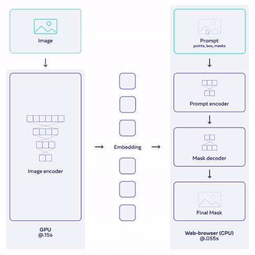
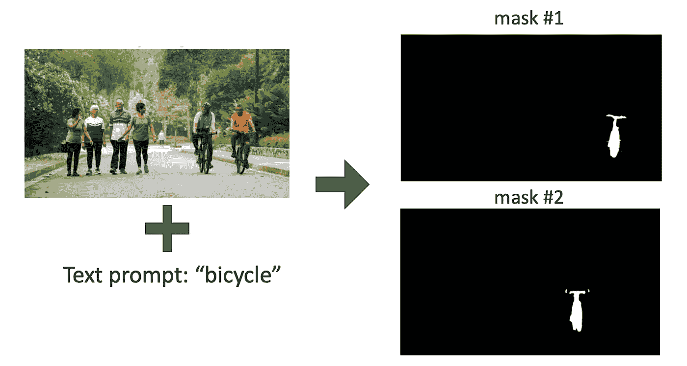
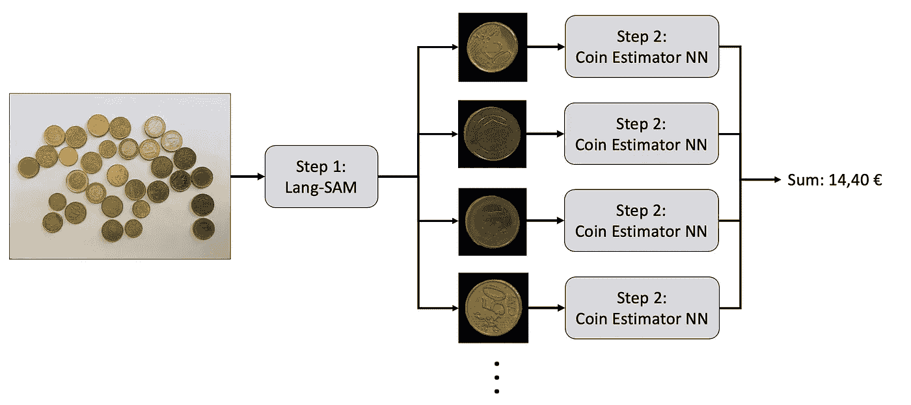
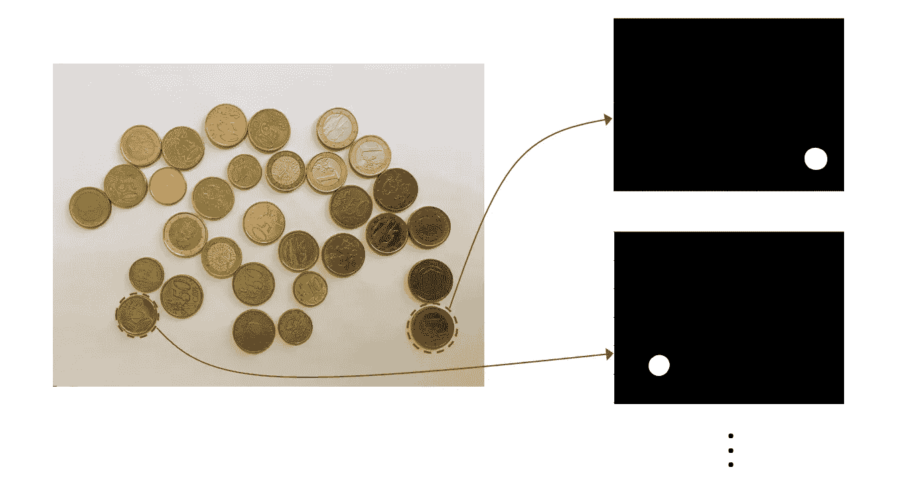
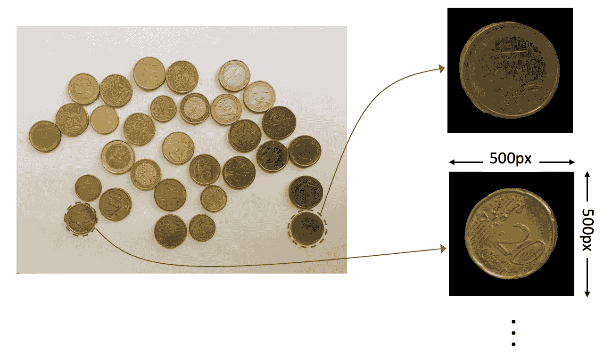
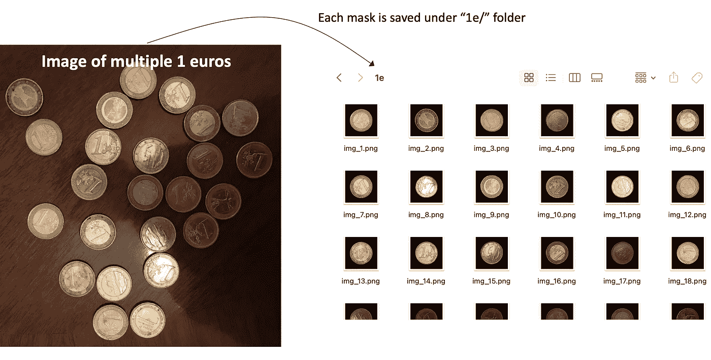
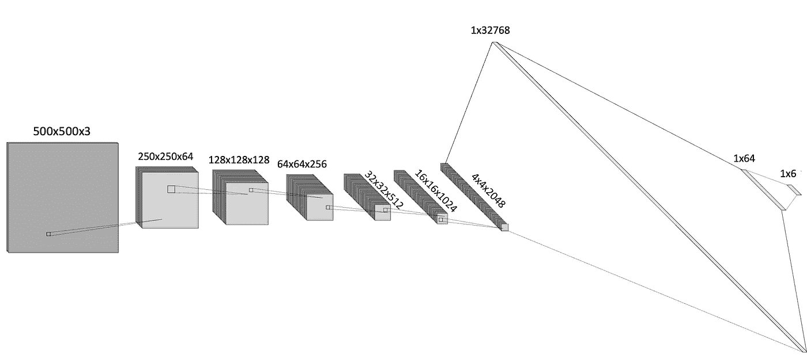
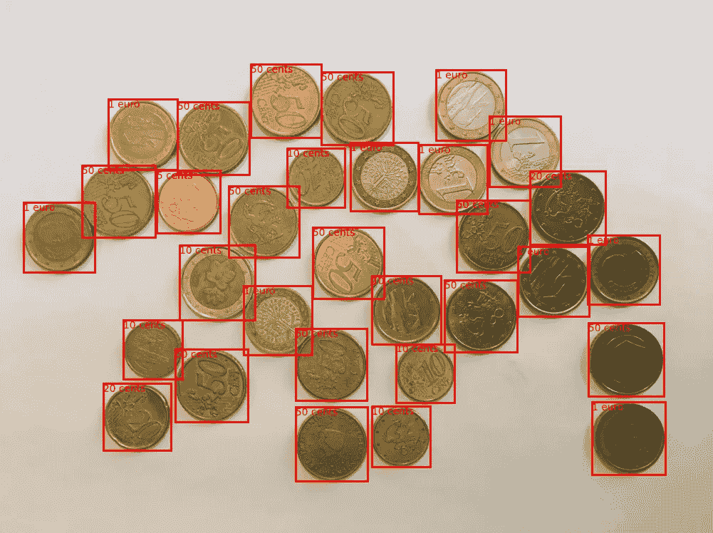

# 使用 Lang-SAM 和深度学习在图像中求和硬币值

> 原文：[`towardsdatascience.com/coin-counting-using-lang-sam-b469827808a7?source=collection_archive---------9-----------------------#2023-10-03`](https://towardsdatascience.com/coin-counting-using-lang-sam-b469827808a7?source=collection_archive---------9-----------------------#2023-10-03)

[](https://medium.com/@gamzsaglam?source=post_page-----b469827808a7--------------------------------)[](https://towardsdatascience.com/?source=post_page-----b469827808a7--------------------------------) [Gamze Zorlubas](https://medium.com/@gamzsaglam?source=post_page-----b469827808a7--------------------------------)

·

[关注](https://medium.com/m/signin?actionUrl=https%3A%2F%2Fmedium.com%2F_%2Fsubscribe%2Fuser%2Fd24f99cbdd78&operation=register&redirect=https%3A%2F%2Ftowardsdatascience.com%2Fcoin-counting-using-lang-sam-b469827808a7&user=Gamze+Zorlubas&userId=d24f99cbdd78&source=post_page-d24f99cbdd78----b469827808a7---------------------post_header-----------) 发表在 [Towards Data Science](https://towardsdatascience.com/?source=post_page-----b469827808a7--------------------------------) ·10 min read·Oct 3, 2023[](https://medium.com/m/signin?actionUrl=https%3A%2F%2Fmedium.com%2F_%2Fvote%2Ftowards-data-science%2Fb469827808a7&operation=register&redirect=https%3A%2F%2Ftowardsdatascience.com%2Fcoin-counting-using-lang-sam-b469827808a7&user=Gamze+Zorlubas&userId=d24f99cbdd78&source=-----b469827808a7---------------------clap_footer-----------)

--

[](https://medium.com/m/signin?actionUrl=https%3A%2F%2Fmedium.com%2F_%2Fbookmark%2Fp%2Fb469827808a7&operation=register&redirect=https%3A%2F%2Ftowardsdatascience.com%2Fcoin-counting-using-lang-sam-b469827808a7&source=-----b469827808a7---------------------bookmark_footer-----------)

在计算机视觉的最新进展中，图像分割取得了显著的进展。一个突出例子是“Segment Anything”模型（SAM），这是一个动态深度学习工具，通过输入提示从图像中预测对象掩码。得益于其先进的编码和解码能力，SAM 能够处理各种分割挑战，对研究人员和开发者都极为宝贵。

Lang-SAM 是一个基于 SAM 的项目。它通过文本提示提取图像中所有对象实例的掩码。它智能地结合了文本描述，弥合了自然语言处理和计算机视觉之间的差距。这种融合允许更加上下文感知、精确和详细的分割，将复杂的图像挑战扩展到超越传统能力的范围。

在探索了 SAM 模型的能力后，我发现了一个典型的用例：估算包含各种其他对象的图像中硬币的总价值。让我们深入了解 SAM 的操作，并查看我如何将其应用到我的硬币计数项目中，以生成数据集和测试神经网络。

## 1\. Segment-Anything

Facebook 的研究团队 FAIR 在 2022 年推出了他们的分割模型 SAM。SAM 令人惊叹的是，它能够识别和分离图像的部分，而不是专门为此训练的。



图 1：由 Meta 提供的 SAM 模型架构，通过[`segment-anything.com/`](https://segment-anything.com/)下载

SAM 的核心有三个主要部分：它理解图像，接受提示或命令，然后根据该命令创建掩码。为了训练 SAM，Facebook 创建了有史以来最大的图像数据集 SA-1B，通过详细的三步过程。技术上，SAM 使用了与其他流行模型类似的系统，但具有自己独特的特征。有时在给定模糊命令时，它会进行多次猜测并选择最佳结果。在测试中，SAM 在 23 个不同数据集上的表现优于其他模型。它们甚至将 SAM 与其他工具结合使用，用于寻找和突出图像中的特定对象等任务。

**尽管 SAM 使用文本编码器进行了文本提示训练，但 Meta 尚未发布带有文本编码器的权重。因此，当前公开模型中仅提供框或点提示。**

## 2\. Language-Segment-Anything (Lang-SAM)

为了解决 SAM 的文本提示问题，Luca Medeiras 创建了一个名为[Language-Segment-Anything (Lang-SAM)](https://github.com/luca-medeiros/lang-segment-anything/tree/main)的开源项目。Lang-SAM 依次部署了 GroundingDino 和 SAM。GroundingDino 是一个文本到边界框的模型，用户输入图像和文本提示，该模型根据文本提示找到这些对象的掩码。这些边界框然后用作 SAM 模型的输入提示，SAM 生成识别对象的精确分割掩码。

以下是用 Python 运行 Lang-SAM 的代码片段：

```py
from  PIL  import  Image
from lang_sam import LangSAM
from lang_sam.utils import draw_image

# Initialize LangSAM model
model = LangSAM()
# Load the image and convert it to RGB
image_pil = Image.open('./assets/image.jpeg').convert("RGB")
# Set the text prompt for the segmentation
text_prompt = 'bicycle'
# Perform prediction to obtain masks, bounding boxes, labels, and logits
masks, boxes, labels, logits = model.predict(image_pil, text_prompt)
# Draw segmented image using the utility function
image = draw_image(image_pil, masks, boxes, labels)
```

使用上述代码，我对图像中的自行车进行了分割测试。结果在下图中可视化。



图 2：Lang-SAM 的示例分割结果 — 作者提供的图像

# Lang-SAM 的用例：硬币总和计数



图 3：硬币计数工作流程 — 作者提供的图像

首先，我们决定硬币计数的工作流程。大致来说，我们将有包含各种硬币的图像。

作为工作流程的第一步，我们可以对输入图像中的每个硬币进行分割。此步骤可以通过使用 Lang-SAM 来完成，因为它允许我们简单地输入“硬币”作为文本提示。在获得硬币掩码后，我们可以使用卷积神经网络来估算硬币的类别。这个神经网络可以是一个自定义的网络，我们用使用 Lang-SAM 生成的数据集来训练。架构细节和训练方法在**第 2 步**中给出。在最后一步中，估算的类别将被简单地汇总。

## 第 1 步：使用 Lang-SAM

为了在图像中分割硬币，我编写了以下函数，该函数以图像作为输入，通过使用 Lang-SAM 模型返回每个硬币的掩码和框。单个硬币的框仅在后续的可视化过程中使用，因此目前并不重要。

```py
def find_coin_masks(image):
    # Suppress warning messages
    warnings.filterwarnings("ignore")
    text_prompt = "coin"
    try:
        model = LangSAM()
        masks, boxes, _, _ = model.predict(image, text_prompt)

        if len(masks) == 0:
            print(f"No objects of the '{text_prompt}' prompt detected in the image.")
        else:
            # Convert masks to numpy arrays
            masks_np = [mask.squeeze().cpu().numpy() for mask in masks]
            boxes_np = [box.squeeze().cpu().numpy() for box in boxes]
            return masks_np, boxes_np

    except (requests.exceptions.RequestException, IOError) as e:
        print(f"Error: {e}") 
```

从包含多个硬币的输入图像中，提供的上述函数生成了分割掩码，如下图所示。然而，生成的分割掩码为图像的原始分辨率。由于分割图像的 95%左右被空白区域占据，这可能被视为冗余信息。这种过多的数据在输入到神经网络进行后续训练阶段时会造成计算挑战。为了解决这个问题，我将引入一个后续函数，以裁剪和聚焦相关的分割区域，优化数据以便进一步处理。



图 4：find_coin_masks 函数的输入和输出 — 作者提供的图像

我创建了另一个名为`generate_coin_images`的函数。该函数首先使用`find_coin_mask`获取原始大小的掩码。接着，它裁剪掉掩码周围的黑色区域。最终掩码被调整为 500x500 像素的标准大小。如果包含硬币的区域大于这个尺寸，它会调整以适应 500x500 的大小，确保我们在下一步中有一致的输入。

```py
def generate_coin_images(image_dir):
    # Load the image and convert it to RGB format
    image = Image.open(image_dir).convert("RGB")

    # Use the previously defined function to obtain masks and bounding boxes
    masks, boxes = find_coin_masks(image)

    # Convert image to a numpy array for further processing
    image = np.array(image)

    # List to store final coin images
    coins = []
    for index in range(len(masks)):
        # Apply mask to image and obtain relevant segment
        mask = np.broadcast_to(np.expand_dims(masks[index],-1), image.shape)
        masked_image = mask * image

        # Find the bounding box coordinates for the non-zero pixels in the masked image
        nonzero_indices = np.nonzero(masked_image[:,:,0])
        nonzero_indices = np.array(nonzero_indices)
        y_min, y_max, x_min, x_max = find_boundary_of_coin(nonzero_indices)

        # Crop the masked image to the bounding box size
        masked_image = masked_image[y_min:y_max,x_min:x_max]  
        # Creating a 500x500 mask 
        if (y_max - y_min)<500 and (x_max - x_min)<500:
            difference_y = 500 - (y_max - y_min)
            difference_x = 500 - (x_max - x_min)
            if difference_y != 0:
                if difference_y % 2 == 0:
                    masked_image = np.pad(masked_image, [(difference_y//2, difference_y//2), (0, 0), (0, 0)])
                else:
                    masked_image = np.pad(masked_image, [((difference_y-1)//2, (difference_y-1)//2 + 1), (0, 0), (0, 0)])
            if difference_x != 0:
                if difference_x % 2 == 0:
                    masked_image = np.pad(masked_image, [(0, 0), (difference_x//2, difference_x//2), (0, 0)])
                else:
                    masked_image = np.pad(masked_image, [(0, 0), ((difference_x-1)//2, (difference_x-1)//2 + 1), (0, 0)])
            coins.append(masked_image)
        else:
            dim = (500, 500)
            resized_masked_image = cv2.resize(masked_image, dim, interpolation = cv2.INTER_AREA)
            coins.append(resized_masked_image)

    return coins, boxes
```

`generate_coin_images`函数生成硬币图像，如下所示。稍后我们将在创建数据集以训练神经网络时以及在测试流程中使用此函数。我们可以说这个函数是项目的核心。



图 5：generate_coin_images 函数的输入和输出 — 作者提供的图像

## 第 2 步：创建硬币估算神经网络

*第 2.1 步：数据集生成*

认识到缺乏专门的欧洲硬币数据集，我主动为我的项目创建了一个。我从这个[GitHub 页面](https://github.com/kaa/coins-dataset)获取了六种不同欧洲硬币面值的照片：2 欧元、1 欧元、50 分、20 分、10 分和 5 分。每张图片只包含一枚硬币，确保数据集的一致性。

利用`generate_coin_image`函数（我之前描述过的），我提取并保存了每个硬币的掩码版本。这些图像然后被系统地组织到以各自面额为基础的文件夹中。

为了清晰起见，训练数据集由 2,739 张图像组成，分布在六个类别中，如下所示：

+   2 欧元：292 张图像

+   1 欧元：301 张图像

+   50 美分：747 张图像

+   20 美分：444 张图像

+   10 美分：662 张图像

+   5 美分：293 张图像

验证集由 73 张图像组成，分布在六个类别中，如下所示：

+   2 欧元：5 张图像

+   1 欧元：12 张图像

+   50 美分：8 张图像

+   20 美分：17 张图像

+   10 美分：16 张图像

+   5 美分：15 张图像

```py
output_dir = "coin_dataset/training/"
dataset_dir = "coin_images/"
subfolders = os.listdir(dataset_dir) 

for subfolder in subfolders:
    files = os.listdir(os.path.join(dataset_dir,subfolder)) 
    if '.DS_Store' in files:
        files.remove('.DS_Store')
    if '.git' in files:
        files.remove('.git')
    files = [file for file in files if file.endswith('.jpg') or file.endswith('.png')] 

    for file in files:

        # Generate coin images with generate_coin_images function and loop through them
        padded_coins, boxes = generate_coin_images(os.path.join(dataset_dir,subfolder,file))

        for padded_coin in padded_coins:

            # Convert the numpy array image back to PIL Image object
            image = Image.fromarray((padded_coin).astype(np.uint8))
            if os._exists(os.path.join(output_dir, subfolder, '.DS_Store')):
                os.remove(os.path.join(output_dir, subfolder, '.DS_Store'))
            last_index = find_last_index(os.listdir(os.path.join(output_dir, subfolder)))
            image_name = f"img_{last_index+1}.png"
            subfolder_for_padded_coins = os.path.join(output_dir, subfolder, image_name)
            image.save(subfolder_for_padded_coins)
```

下图提供了我们分割程序的可视化表示，显示了处理 1 欧元硬币照片以创建数据集的过程。分割后，单个硬币图像被存储在‘1e/’目录中。



图 6：数据集生成工作流程的输入和输出 — 作者提供的图片

*步骤 2.2：训练*

神经网络的架构包括两个主要组件：几个卷积层，用于从输入图像中提取空间特征，以及两个密集层，负责最终分类。

具体来说，网络从一个 500x500x3 形状的 RGB 输入图像开始。随着网络经过卷积层，通道数增加，每个卷积后跟一个 ReLU 激活。通过在这些层中使用步幅为 2，特征图的空间维度在每个阶段都减少，产生编码效果。

在卷积阶段之后，空间特征被展平并传递到两个全连接层。最终层的输出提供了一个跨类别的概率分布，使用 softmax 激活。



图 7：硬币估计器的神经网络架构 — 作者提供的图片

我使用 Adam 优化器和交叉熵损失来训练模型。训练持续进行，直到验证损失出现饱和点，这发生在第 15 个 epoch。

*步骤 2.3：性能基准测试*

在完成训练后，我利用下面提供的脚本对最后一个 epoch 的检查点进行了基准测试。我使用了下面提供的`compute_accuracy`函数，该函数接受模型和数据加载器作为参数，并计算给定数据集中的准确预测百分比。

```py
def compute_accuracy(model, data_loader, device):
    correct_predictions = 0
    total_predictions = 0

    with torch.no_grad():
        for inputs, labels in data_loader:
            inputs, labels = inputs.to(device), labels.to(device)

            # Forward pass
            outputs = model(inputs)

            # Get the predicted class index by finding the max value in the output tensor along dimension 1
            _, predicted = torch.max(outputs.data, 1)  
            total_predictions += labels.size(0)

            # Update correct predictions count: 
            # Sum up all instances where the predicted class index equals the true class index
            correct_predictions += (predicted == labels).sum().item()

    return (correct_predictions / total_predictions) * 100

# Compute the accuracy on the training dataset and validation sets
train_accuracy = compute_accuracy(model, train_loader, device)
val_accuracy = compute_accuracy(model, val_loader, device)

print(f"Training set accuracy: {train_accuracy:.2f}%")
print(f"Validation set accuracy: {val_accuracy:.2f}%")
```

随后计算的训练集和验证集的平均准确率如下：

+   训练集：87%

+   验证集：95%

验证准确率超过了训练准确率，这可能是由于验证集相对较小。值得注意的是，项目的主要目的是展示新分割模型的潜在应用，而不是构建一个高性能的硬币估计网络。因此，对这些观察结果的深入分析将不会进行。

## 第 3 步：硬币计数的流程

在训练了硬币估计网络后，图 3 中概述的所有工作流程步骤现已完成。现在，让我们构建一个从头到尾利用 Lang-SAM 和我们的自定义神经网络（NN）的流程，旨在计算图像中硬币的总价值。

我创建了一个名为`coin_counter.ipynb`的 Python 笔记本，该笔记本指导了计数步骤。就像我们在创建数据集的过程中一样，最初使用`generate_coin_images`函数为图像中的每个硬币生成掩膜。然后，这些掩膜会被逐一输入到硬币估计网络中。最后，将预测的硬币值相加，以找出图像中的总金额。

## 测试结果

图 3 中的硬币图像被输入到硬币计数流程中。下方的图像包含了估计的类别叠加。虽然有些估计不准确，但总体性能是可以接受的。



如前所述，本项目的主要目标是展示一种可以接受文本输入的新分割模型的潜在应用，而不是构建一个高性能的硬币估计网络。

这是我的[Github repo](https://github.com/gamzez/lang-segment-anything)，你可以在其中找到本博客中使用的代码。

感谢阅读我的博客！
