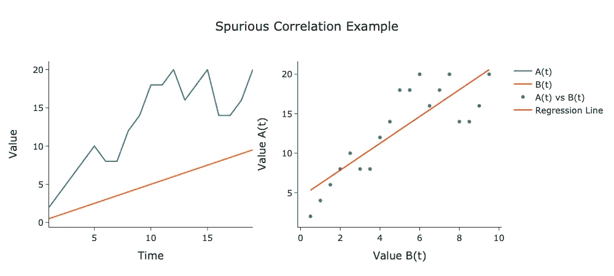
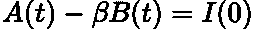
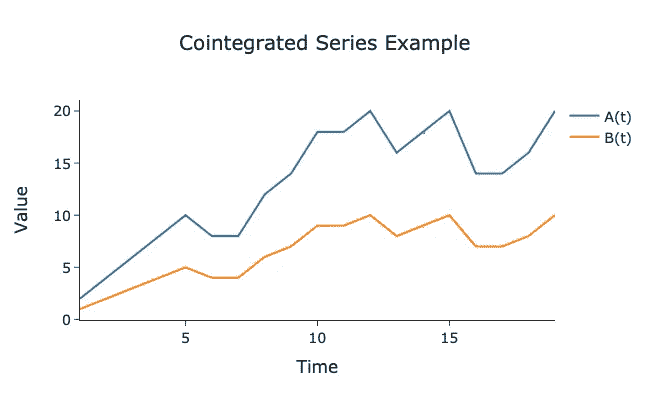
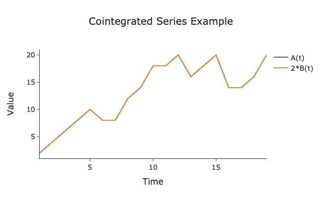
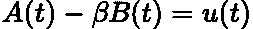
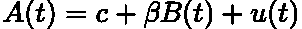
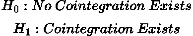
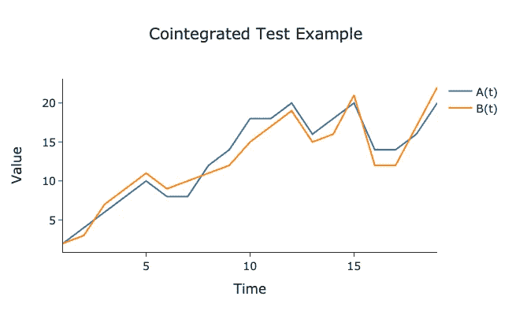

# 协整与相关性

> 原文：[`towardsdatascience.com/cointegration-vs-spurious-correlation-understand-the-difference-for-accurate-analysis-82727ad7cbc3`](https://towardsdatascience.com/cointegration-vs-spurious-correlation-understand-the-difference-for-accurate-analysis-82727ad7cbc3)

## *为什么相关性不等于因果关系*

[](https://medium.com/@egorhowell?source=post_page-----82727ad7cbc3--------------------------------)[](https://towardsdatascience.com/?source=post_page-----82727ad7cbc3--------------------------------) [Egor Howell](https://medium.com/@egorhowell?source=post_page-----82727ad7cbc3--------------------------------)

·发表于 [数据科学前沿](https://towardsdatascience.com/?source=post_page-----82727ad7cbc3--------------------------------) ·6 分钟阅读·2023 年 7 月 17 日

--


图片由 [Wance Paleri](https://unsplash.com/fr/@wance0003000?utm_source=medium&utm_medium=referral) 提供，来源于 [Unsplash](https://unsplash.com/?utm_source=medium&utm_medium=referral)

# 背景

在时间序列分析中，了解一个序列是否影响另一个序列是有价值的。例如，对于商品交易者来说，知道 *商品 A* 的增加是否会导致 *商品 B* 的增加是很有用的。最初，这种关系是通过线性回归来测量的，但在 1980 年代，[**Clive Granger**](https://en.wikipedia.org/wiki/Clive_Granger) 和 [**Paul Newbold**](https://en.wikipedia.org/wiki/Paul_Newbold) 证明了这种方法会产生错误结果，特别是对于 [**非平稳**](https://medium.com/towards-data-science/time-series-stationarity-simply-explained-125269968154) 时间序列。因此，他们提出了 [**协整**](https://en.wikipedia.org/wiki/Cointegration) 的概念，这为 Granger 赢得了诺贝尔奖。在这篇文章中，我想讨论协整的必要性和应用，以及为什么这是数据科学家应该理解的重要概念。

# 虚假相关

## 概述

在讨论协整之前，让我们先讨论一下它的必要性。历史上，统计学家和经济学家使用 [**线性回归**](https://en.wikipedia.org/wiki/Linear_regression) 来确定不同时间序列之间的关系。然而，Granger 和 Newbold 表明这种方法是错误的，会导致所谓的 [**虚假相关**](https://statisticsbyjim.com/basics/spurious-correlation/#:~:text=With%20this%20definition%20in%20mind,there%20are%20more%20shark%20attacks.)。

虚假相关指的是两个时间序列看起来相关，但实际上缺乏因果关系。这是经典的‘*相关性不意味着因果性*’声明。这是危险的，因为即使是统计测试也可能会表示存在一个[**因果关系**](https://en.wikipedia.org/wiki/Causality)。

## 例子

下面的图示展示了虚假关系的一个例子：



由作者在 Python 中生成的图。

这里我们有两个时间序列***A(t)***和***B(t)***，分别以时间为函数（左）和彼此对比（右）进行绘制。从右侧的图中可以看出，回归线显示序列之间存在某种相关性。然而，通过查看左侧图，我们发现这种相关性是虚假的，因为***B(t)***持续增加，而***A(t)***则不规则波动。此外，两时间序列之间的平均距离也在增加。因此，它们可能是相关的，但没有因果关系的证据。

> 查看[这里](https://www.statology.org/spurious-correlation-examples/)以获取更多虚假相关的例子。我最喜欢的是视频游戏销售与核能生产的例子！

## 原因

虚假相关发生的原因有几个：

+   *纯粹的运气、偶然或巧合。*

+   *样本时间序列数据无法充分代表总体时间序列。*

+   *两个时间序列* ***A*** *和* ***B****，由一个未观测的第三个时间序列* ***C**** 驱动。因此，* ***C*** *导致了* ***A*** *和* ***B****，因此看起来像是* ***A*** *导致* ***B*** *或反之亦然*。

# 什么是协整？

## 概述

协整是一种技术，可以帮助我们区分两个时间序列是否存在长期关系，还是只是虚假相关。它不仅测量序列是否一起移动，而是专注于确定它们均值之间的差异是否保持一致。

## 理论

如果两个时间序列之间存在一种线性组合，使得结果序列的[**积分**](https://en.wikipedia.org/wiki/Order_of_integration)低于两个单独序列的积分，那么这两个时间序列被认为是*协整的*。这里的积分是指序列的平稳程度，而不是微积分。

例如，如果两个序列具有***I(1)*** 积分顺序（非平稳），那么如果存在某种线性组合使结果序列为***I(0)***（平稳），则这两个时间序列被认为是协整的。

> 查看[这里](https://en.wikipedia.org/wiki/Order_of_integration)以获取有关积分顺序的更详细解释。

因此，如果我们有两个时间序列***A(t)*** 和 ***B(t)***，如果存在一个***β*** 规模系数能生成一个平稳过程，则这两个时间序列被认为是协整的：



由 LaTeX 生成的方程。

如果这是正确的，那么存在一种可能性，即***A(t)***和***B(t)***确实有长期的因果关系。

如果你想了解更多关于平稳性的内容，可以查看我之前的帖子：

## 时间序列平稳性简单解释

### 对于时间序列建模中平稳性需求的一个简单直观的解释。

towardsdatascience.com

## 示例

下面绘制的是两个协整序列的示例：



图由作者在 Python 中生成。

注意序列间的均值距离保持一致。实际上，如果我们将***B(t)***乘以***2, β=2,*** 得到的结果是：



图由作者在 Python 中生成。

这两个序列完全重叠！因此，我们可以说它们是协整的。

> 这是一个完美的玩具例子，实际上没有两个序列会完全重合。

# 协整测试：Engle-Granger 两步法

## 概述与理论

最常见的协整测试是[**Engle-Granger 测试**](https://en.wikipedia.org/wiki/Error_correction_model#Engle_and_Granger_2-step_approach)。它测量两个序列的线性和的残差是否平稳。

例如，回到上述方程，假设线性组合***A(t)***和***B(t)***导致一个平稳序列***u(t)***：



公式由 LaTeX 生成。

系数***β***可以通过对***A(t)***与***B(t)***进行线性回归拟合来计算。这是标准的[**OLS**](https://en.wikipedia.org/wiki/Ordinary_least_squares)过程：



公式由 LaTeX 生成。

其中***c***是截距项。

我们可以通过进行统计测试来验证***u(t)***是否确实平稳。最常见的平稳性测试是[**单位根检验**](https://en.wikipedia.org/wiki/Unit_root_test)，它是[**Augmented Dickey-Fuller (ADF)**](https://en.wikipedia.org/wiki/Augmented_Dickey%E2%80%93Fuller_test)测试。

假设是：



公式由 LaTeX 生成。

## 示例

让我们通过一个简单的玩具例子来使这个理论更加具体：



图由作者在 Python 中生成。

首先，我们将对***A(t)***与***B(t)***进行回归，以使用 OLS***找到***β：

GitHub Gist by author.

输出结果为：

```py
LinregressResult(slope=1.000392464678179, intercept=0.31083202511773855, rvalue=0.9629500869656515, pvalue=4.162670194519794e-11, stderr=0.06795014678046259, intercept_stderr=0.9311636662243622)So our value is β=2.
```

现在使用***β=1.0004,*** 我们可以计算两个序列的残差，并将这些残差进行 ADF 测试，以确定它们是否平稳：

GitHub Gist by author.

输出：

```py
ADF Statistic:  -1.9502125507110546
P-Value:  0.30882039870947364
Critical Values:
 1%: -4.14
 5%: -3.15
 10%: -2.71
```

由于我们的 ADF 统计量大于 10% [**置信区间**](https://medium.com/towards-data-science/confidence-intervals-simply-explained-58b0b11e985f)，因此这两个系列*不具备协整性*。

如果你想了解关于置信区间的内容，请查看我之前的文章：

[](/confidence-intervals-simply-explained-58b0b11e985f?source=post_page-----82727ad7cbc3--------------------------------) ## 置信区间简单解释

### 对置信区间的简要解释。

towardsdatascience.com

## 其他测试

Engle-Granger 检验的问题在于它仅测量两个时间序列之间的协整。然而，像[**Johansen 检验**](https://en.wikipedia.org/wiki/Johansen_test)这样的检验用于确定多个时间序列之间的协整。

> 见[这里](https://www.statisticshowto.com/johansens-test/)获取更多关于 Johansen 检验的信息。

# 总结与进一步思考

协整是时间序列分析中的一个重要工具，它使数据科学家能够区分系列之间真实的长期因果关系与虚假的相关性。这是一个有用的概念，特别是对那些在金融和交易公司工作的数据科学家来说，确实值得深入了解。

本博客中使用的完整代码可以在我的 GitHub 上找到：

[](https://github.com/egorhowell/Medium-Articles/blob/main/Time%20Series/Time%20Series%20Tools/cointegration.py?source=post_page-----82727ad7cbc3--------------------------------) [## Medium-Articles/Time Series/Time Series Tools/cointegration.py 在主分支 · egorhowell/Medium-Articles

### 我在 Medium 博客/文章中使用的代码。通过创建一个帐户来贡献于 egorhowell/Medium-Articles 的开发…

github.com](https://github.com/egorhowell/Medium-Articles/blob/main/Time%20Series/Time%20Series%20Tools/cointegration.py?source=post_page-----82727ad7cbc3--------------------------------)

# 参考文献及进一步阅读

+   关于协整的更全面的数学观点：[`www.uh.edu/~bsorense/coint.pdf`](https://www.uh.edu/~bsorense/coint.pdf)

+   *Robert F. Engle 和 C. W. J. Granger*关于协整的原始论文：[`www.jstor.org/stable/1913236?origin=crossref`](https://www.jstor.org/stable/1913236?origin=crossref)

# 另一个话题！

我有一个免费的通讯，[**Dishing the Data**](https://dishingthedata.substack.com/)，在其中我每周分享成为更好数据科学家的技巧。没有“空洞”的内容或“点击诱饵”，只有来自实践数据科学家的纯粹可操作的见解。

[](https://newsletter.egorhowell.com/?source=post_page-----82727ad7cbc3--------------------------------) [## 数据分析 | Egor Howell | Substack

### 如何成为更好的数据科学家。点击阅读由 Egor Howell 编写的 Dishing The Data，这是一个 Substack 出版物…

[newsletter.egorhowell.com](https://newsletter.egorhowell.com/?source=post_page-----82727ad7cbc3--------------------------------)

# 与我联系！

+   [**YouTube**](https://www.youtube.com/@egorhowell)

+   [**LinkedIn**](https://www.linkedin.com/in/egor-howell-092a721b3/)

+   [**Twitter**](https://twitter.com/EgorHowell)

+   [**GitHub**](https://github.com/egorhowell)
