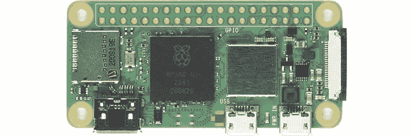

# 在树莓派上使用 Apache Airflow 收集数据

> 原文：[`towardsdatascience.com/collecting-data-with-apache-airflow-on-a-raspberry-pi-0ac3f72e377f?source=collection_archive---------2-----------------------#2023-10-21`](https://towardsdatascience.com/collecting-data-with-apache-airflow-on-a-raspberry-pi-0ac3f72e377f?source=collection_archive---------2-----------------------#2023-10-21)

## 一块树莓派就是你所需要的一切

 [Dmitrii Eliuseev](https://dmitryelj.medium.com/?source=post_page-----0ac3f72e377f--------------------------------)

·

[关注](https://medium.com/m/signin?actionUrl=https%3A%2F%2Fmedium.com%2F_%2Fsubscribe%2Fuser%2F65c1f6ba75db&operation=register&redirect=https%3A%2F%2Ftowardsdatascience.com%2Fcollecting-data-with-apache-airflow-on-a-raspberry-pi-0ac3f72e377f&user=Dmitrii+Eliuseev&userId=65c1f6ba75db&source=post_page-65c1f6ba75db----0ac3f72e377f---------------------post_header-----------) 发表在 [Towards Data Science](https://towardsdatascience.com/?source=post_page-----0ac3f72e377f--------------------------------) ·8 分钟阅读·2023 年 10 月 21 日

--

Raspberry Pi Zero（2021 年型号），图片来源 [维基百科](https://en.wikipedia.org/wiki/Raspberry_Pi)

我们常常需要在特定时间段内收集一些数据。这些数据可以来自 IoT 传感器、社交网络的统计数据，或其他来源。例如，[YouTube 数据 API](https://developers.google.com/youtube/v3)允许我们获取任何频道当前的观看次数和订阅者数量，但分析和历史数据仅对频道拥有者可用。因此，如果我们想要获取这些频道的每周或每月总结，我们需要自己收集这些数据。在 IoT 传感器的情况下，可能根本没有 API，我们也需要自行收集和保存数据。在这篇文章中，我将展示如何在 Raspberry Pi 上配置 Apache Airflow，它允许在不涉及任何云提供商的情况下长时间运行任务。

显然，如果你在一家大型公司工作，你可能不会需要一个 Raspberry Pi。在这种情况下，如果你需要额外的云实例，只需为你的 MLOps 部门创建一个 Jira 工单 ;) 但对于一个小项目或低预算的初创公司来说，它可能是一个有趣的解决方案。

让我们看看它是如何工作的。

## Raspberry Pi

实际上，Raspberry Pi 是什么？对于那些过去 10 年对硬件不感兴趣的读者（首个…
