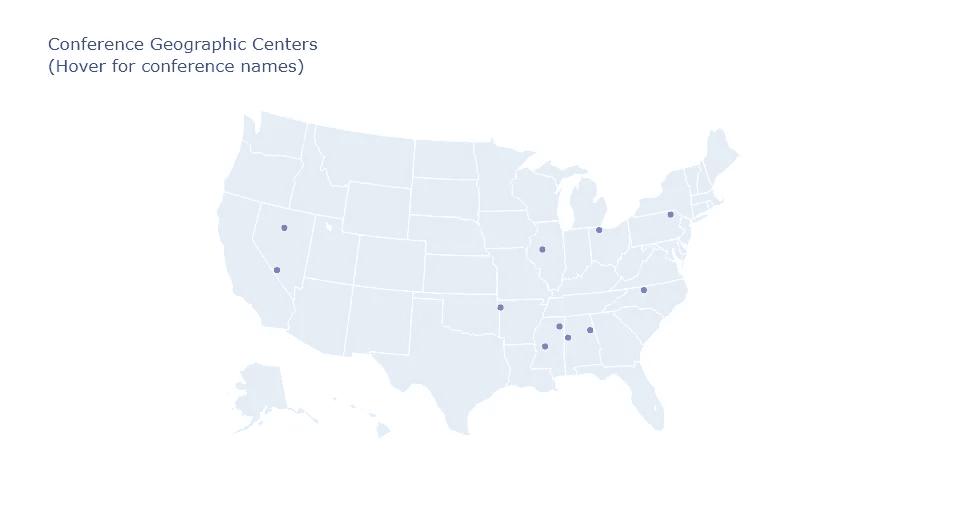
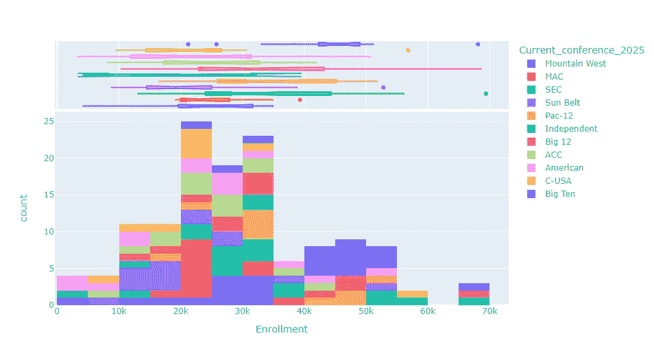
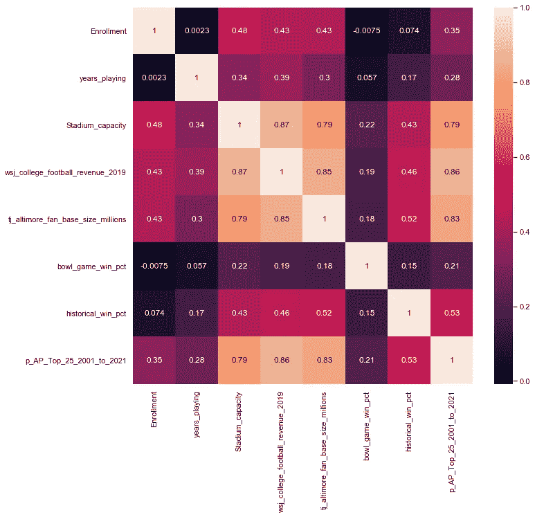
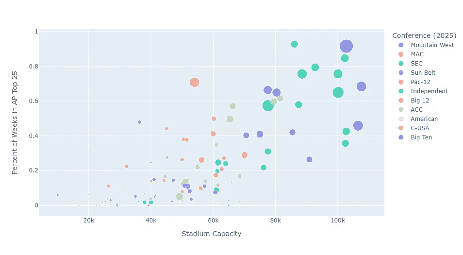

# 大学橄榄球联盟重组——Python 中的探索性数据分析

> 原文：[`towardsdatascience.com/college-football-conference-realignment-exploratory-data-analysis-in-python-6f4a74037572`](https://towardsdatascience.com/college-football-conference-realignment-exploratory-data-analysis-in-python-6f4a74037572)

[](https://medium.com/@gspmalloy?source=post_page-----6f4a74037572--------------------------------)[](https://towardsdatascience.com/?source=post_page-----6f4a74037572--------------------------------) [Giovanni Malloy](https://medium.com/@gspmalloy?source=post_page-----6f4a74037572--------------------------------)

·发表于 [Towards Data Science](https://towardsdatascience.com/?source=post_page-----6f4a74037572--------------------------------) ·阅读时间 8 分钟·2023 年 8 月 5 日

--

这是我最喜欢的时节：秋天，意味着大学橄榄球的季节。我一直喜欢大学体育。成长过程中，我生活在一个 Big Ten/SEC 家庭和一个 Big East（现在的 ACC）城市，这意味着从 8 月的第一次开球到 4 月的最后一秒钟，电视屏幕上充满了大学体育。最近，数据分析已经主导了这两种运动，但由于现在是橄榄球季节，我们就从这里开始。


图片由 [David Ireland](https://unsplash.com/@davidirelandmagnetic?utm_source=medium&utm_medium=referral) 提供，发布在 [Unsplash](https://unsplash.com/?utm_source=medium&utm_medium=referral)

过去两个休赛季，大学体育界一直充斥着 NIL、转会门户和联盟重组的新闻。我认为，大多数球迷的情绪可以通过 Dr. Pepper 的“[Chaos Comes to Fansville](https://www.youtube.com/watch?v=Gq-Ye91fAm0)”广告来体现。我开始注意到，每次关于联盟重组的对话，特别是充满了猜测和直觉的推动。然而，普遍存在一种信念，认为某个伟大的大学橄榄球奥兹正在 crunch 数据，以决定哪个球队值得加入哪个联盟。我仍然没有机会见到幕后的那个人，所以在那之前，我想尝试提出一种基于数据的联盟重组方案。

这是一个四部分的博客，希望能作为学习一些新数据科学工具的有趣方式：

1.  [大学橄榄球联盟重组——Python 中的探索性数据分析](https://medium.com/towards-data-science/college-football-conference-realignment-exploratory-data-analysis-in-python-6f4a74037572)

1.  大学橄榄球联盟重组——回归分析

1.  [大学橄榄球会议重组 — 聚类](https://medium.com/p/6ca16840ed3d#0733-ef9637a21b53)

1.  [大学橄榄球会议重组 — node2vec](https://medium.com/towards-data-science/college-football-conference-realignment-node2vec-ba2e931bb1c)

我在此帖子开头声明，进行探索性数据分析有很多方法，所以我只会介绍一些与会议重组相关的方法。

**数据**

我花时间构建了自己的数据集，使用了我从网络上汇总的各种来源。这些数据包括 [每个 FBS 项目的基本信息](https://en.wikipedia.org/wiki/List_of_NCAA_Division_I_FBS_football_programs)、所有 [大学橄榄球对抗赛](https://en.wikipedia.org/wiki/List_of_NCAA_college_football_rivalry_games) 的非规范近似、[体育场大小](https://en.wikipedia.org/wiki/List_of_NCAA_Division_I_FBS_football_stadiums)、[历史表现](https://en.wikipedia.org/wiki/List_of_NCAA_Division_I_FBS_football_bowl_records)、[AP 前 25 名投票的出现频率](https://collegepollarchive.com/football/index.cfm)、学校是否为 [AAU](https://www.aau.edu/) 或 [R1](https://en.wikipedia.org/wiki/List_of_research_universities_in_the_United_States) 机构（对加入 Big Ten 和 Pac 12 历史上非常重要）、[NFL 选秀情况](https://www.ncaa.com/news/football/article/2020-04-27/college-football-teams-most-nfl-draft-picks-2000) 从 2017 年至 2019 年的 [项目收入数据](https://graphics.wsj.com/table/NCAA_2019)，以及关于大学橄榄球粉丝基础的 [最近估算](https://drive.google.com/file/d/1MiUOwx8X3H2bSkUOz8a1YhceyJWLLCoJ/view)。

**寻找纬度和经度**

我们的探索性数据分析的第一步是将我们拥有的每支球队的城市和州数据转换为纬度和经度。在 Python 中使用 [geopy 包](https://geopy.readthedocs.io/en/stable/) 很容易做到这一点。首先，我导入依赖项，并加载一个包含每支球队城市和州的 csv 文件。

```py
# Import dependencies
import pandas as pd
import numpy as np
from geopy.geocoders import Nominatim
# Read csv data with column 'City' and column 'State'
city_list_df = pd.read_csv(r'.\FBS_Football_Cities.csv', encoding = 'unicode_escape')
```

接下来是代码的核心部分。我运行一个 for 循环来收集每个城市的所有纬度和经度。

```py
# Lists to track latitude and longitude of each city
lat_list = []
long_list = []
# for each city in the dataframe, get the latitude and longitude and # add them to the lists
index = 0
for city in city_list_df['City']:
    city_name = str(city)+', '+str(city_list_df['State'][index])

    # Two cities needed some manual cleaning
    if index == 39:
        city_name = 'Urbana, Illinois'
    elif index == 92:
        city_name = 'San Jose, California'

    print(city_name)
    print(index)

    # calling the Nominatim tool
    loc = Nominatim(user_agent="GetLoc")

    # entering the location name
    getLoc = loc.geocode(city_name)

    # add the latitude and longitude to their respective lists
    lat_list.append(getLoc.latitude)
    long_list.append(getLoc.longitude)

    index = index + 1
```

最后，我将这些数据合并到一个数据框中，并输出为 csv 文件。

```py
lat_long_df = pd.DataFrame(lat_list, columns=['latitude'])
lat_long_df['longitude'] = long_list
lat_long_df.to_csv(r'.\cfb_lat_long.csv')
```

**会议地理中心**

现在我们有了每支球队的纬度和经度数据，我们可以使用相同的软件包找到每个会议的地理中心。你可以把地理中心看作是会议冠军赛的最佳中立场地。我整理的数据将球队分配到 2025 赛季的各自会议（例如，UCLA 和 USC 在 Big Ten）。

```py
# Read csv of all data
cfb_info_df = pd.read_csv(r'.\FBS_Football_Team_Info.csv', encoding = 'unicode_escape')
# Track conference name, lat., long., and city name 
conf_name_list = []
conf_lat_list = []
conf_long_list = []
conf_city_list = []
# for each conference in the data set calculate the mean  latitude and mean longitude
for conf in np.unique(cfb_info_df['Current_conference_2025']):
    conf_latitude = np.mean(cfb_info_df[cfb_info_df['Current_conference_2025'] == conf]['Latitude'])
    conf_longitude = np.mean(cfb_info_df[cfb_info_df['Current_conference_2025'] == conf]['Longitude'])

    # calling the Nominatim tool
    loc = Nominatim(user_agent="GetLoc")

    # entering the lat. and long. to return the city name
    getCity = loc.reverse(str(conf_latitude)+', '+str(conf_longitude))

    #Update lists
    conf_name_list.append(conf)
    conf_lat_list.append(conf_latitude)
    conf_long_list.append(conf_longitude)
    conf_city_list.append(getCity)

    print(f'Conference: {conf}, Centroid City: {getCity} ({conf_latitude}, {conf_longitude})')

#Create data frame by conference
conf_center_df = pd.DataFrame(conf_name_list, columns=['conference'])
conf_center_df['latitude'] = conf_lat_list
conf_center_df['longitude'] = conf_long_list
conf_center_df['city'] = conf_city_list
# Add a column for text to appear on our map
conf_center_df['text'] = conf_center_df['conference'] + ': ' + conf_center_df['city'].astype(str)
```

现在，我们可以使用 [plotly](https://plotly.com/python/scatter-plots-on-maps/#styled-us-airports-map) 软件包来创建一个简单的交互式地图，并可视化大学橄榄球会议的新地理中心。

```py
import plotly.graph_objects as go
fig = go.Figure(data=go.Scattergeo(
        lon = conf_center_df['longitude'],
        lat = conf_center_df['latitude'],
        text = conf_center_df['text'],
        mode = 'markers'))
fig.update_layout(title = 'Conference Geographic Centers<br>(Hover for conference names)',
        geo_scope='usa')
fig.show()
```



每个会议（以及独立队）的地理中心图。

这些是最接近会议地理中心的小型和大型城市区域：

+   ACC: 格林斯伯勒，北卡罗来纳州（夏洛特，北卡罗来纳州）

+   American: 伯明翰，阿拉巴马州（孟菲斯，田纳西州）

+   Big 12: 费耶特维尔，阿肯色州（俄克拉荷马城，俄克拉荷马州）

+   Big Ten: 斯普林菲尔德，伊利诺伊州（圣路易斯，密苏里州）

+   C-USA: 杰克逊，密西西比州（孟菲斯，田纳西州）

+   MAC: 托莱多，俄亥俄州（底特律，密歇根州）

+   Mountain West: 拉斯维加斯，内华达州

+   Pac-12: 里诺，内华达州（盐湖城，犹他州）

+   SEC: 孟菲斯，田纳西州

+   Sun Belt: 伯明翰，阿拉巴马州（亚特兰大，乔治亚州）

+   Independents: 斯克兰顿，宾夕法尼亚州（纽约，纽约州）

这些结果似乎相当合理，尽管 Independents 实际上不是一个会议。南方是大学橄榄球世界的中心。[孟菲斯市正计划建设一个新体育场](https://www.tennessean.com/story/news/2022/10/18/memphis-asks-state-684-million-fedexforum-liberty-stadium-renovations/69564167007/)，也许正好赶上成为 American、C-USA 或 SEC 冠军赛的潜在主办城市。

**摘要统计**

了解任何数据集的最佳方法之一是生成数字特征的摘要统计。[Pandas](https://pandas.pydata.org/) 提供了一个名为 describe() 的内置方法来获取摘要统计。以下是一个关于入学的示例：

```py
cfb_info_df['Enrollment'].describe()
```

这一行语句输出：

```py
count      133.000000
mean     29337.541353
std      13780.834495
min       3297.000000
25%      21200.000000
50%      28500.000000
75%      38500.000000
max      69400.000000
Name: Enrollment, dtype: float64
```

从摘要统计中，我们可以看到均值和中位数相似，变异系数（标准差/均值）小于 0.5，意味着我们可能有一个大致对称的分布，但我们可以通过生成直方图来直观检查这一点，从而按会议划分入学人数。

```py
import plotly.express as px
fig = px.histogram(cfb_info_df, x="Enrollment", color="Current_conference_2025", marginal="box", hover_data=cfb_info_df.columns)
fig.show()
```



直方图展示了按会议划分的入学分布。边际分布如上所示。

从直方图中，我们可以直观地看到大多数大学的入学人数在 20,000 到 35,000 学生之间。Big Ten 的中位数入学人数超过 45,000，而 Sun Belt 包含了中位数入学人数不到 20,000 的最小学校。ACC 拥有所有 Power 5 会议中入学人数最少的学校。

**相关性**

相关性是衡量两个特征之间关系的指标。相关性范围从 -1 到 1，其中 1 表示完全正相关，-1 表示完全负相关，0 表示没有关系。相关性不应与因果关系混淆，因为相关性仅仅是观察到的两个特征之间关系的度量。Pandas 再次提供了一个方法来轻松计算两列之间的相关性。

```py
import seaborn as sns
# Pull out numeric columns from data
numeric_columns = ['Enrollment','years_playing','Stadium_capacity','total_draft_picks_2000_to_2020',
                  'wsj_college_football_revenue_2019', 'tj_altimore_fan_base_size_millions', 'bowl_game_win_pct',
                 'historical_win_pct', 'p_AP_Top_25_2001_to_2021']
# Generate Correlation Matrix using only the numeric columns
correlation_matrix = cfb_info_df.loc[:,numeric_columns].corr()
# Print the correlation matrix
#print(correlation_matrix)
# Plot the correlation matrix using seaborn
# Set plot size
sns.set(rc={"figure.figsize":(11, 10)})
# Show the plot
sns.heatmap(correlation_matrix, annot=True)
```



相关性矩阵显示每个特征与自身之间的完全正相关关系。我们还看到体育场容量、粉丝基础大小、2019 年收入和 2001 至 2021 年间 AP 前 25 名出现周数之间的相关性很高。

结果相关矩阵是理解哪些特征可能相互关联的一个很好的可视化工具。例如，体育场容量、2019 年收入、粉丝基础规模和历史上进入 AP 前 25 名排名的概率都是高度相关的。有趣的是，这些特征与历史胜率的相关性只是中等水平，与碗赛胜率的相关性几乎不存在。一个解释可能是赛程强度在我们的数据中并没有体现出来，一个在 Power 5 联盟中取得 8 胜 4 负的球队可能会比一个在 Group of 5 联盟中取得 8 胜 4 负的球队要好得多。此外，我们可以直接直观地理解相关性并不等于因果关系，因为建造一个更大的体育场并不能保证拥有更多的粉丝基础。

另一个有趣的发现是，球队活跃的年限与任何成功指标的相关性并不强。当然，长期的橄榄球历史可能会给粉丝基础带来长期的痛苦。例如，[印第安纳大学](https://www.indystar.com/story/sports/college/indiana/2022/10/15/indiana-hoosiers-football-iu-first-division-i-program-with-700-losses-most-history-worst-20-years/69484773007/)最近成为第一个达到历史 700 场失利的 FBS 球队。

最后，我们可以放大我们的最新发现，并使用 plotly 制作一个简单而强大的可视化图。

```py
import plotly.express as px
fig = px.scatter(cfb_info_df, x="Stadium_capacity", y="p_AP_Top_25_2001_to_2021", color="Current_conference_2025",
                 size="tj_altimore_fan_base_size_millions",
                labels=dict(Stadium_capacity="Stadium Capacity", 
                            p_AP_Top_25_2001_to_2021="Percent of Weeks in AP Top 25", 
                            Current_conference_2025="Conference (2025)", 
                            tj_altimore_fan_base_size_millions = "Fan Base Size"))
fig.show()
```



该图展示了 x 轴上的体育场容量与 y 轴上的 AP 排名成功。较大的点代表估计的更大粉丝基础。

该图直观地展示了 x 轴上的体育场容量与 y 轴上的 AP 排名成功之间的强相关性。散点图上每个点的大小表示粉丝基础的估计规模。该图表明，我们可能成功地使用回归模型来估计 Tony Altimore 的粉丝基础规模分析的结果。我将在我的会议重新调整博客的第二部分中进一步讨论这个问题。

感谢阅读！请在下面评论你的想法。

对我的内容感兴趣吗？请考虑 [在 Medium 上关注我](https://medium.com/@gspmalloy)。

在 Twitter 上支持一下: [@malloy_giovanni](https://twitter.com/malloy_giovanni)
